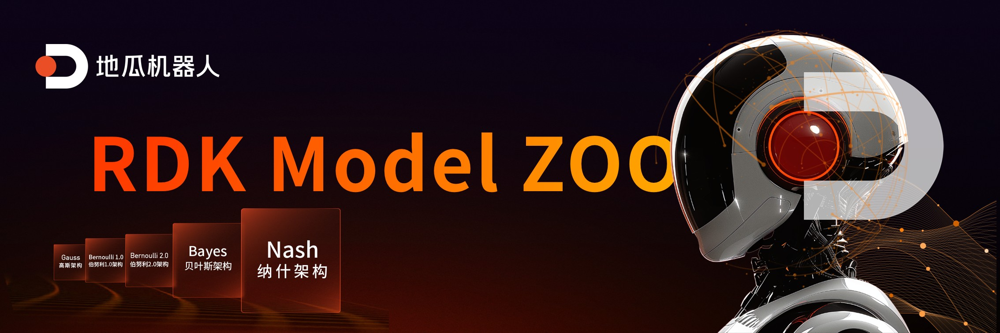
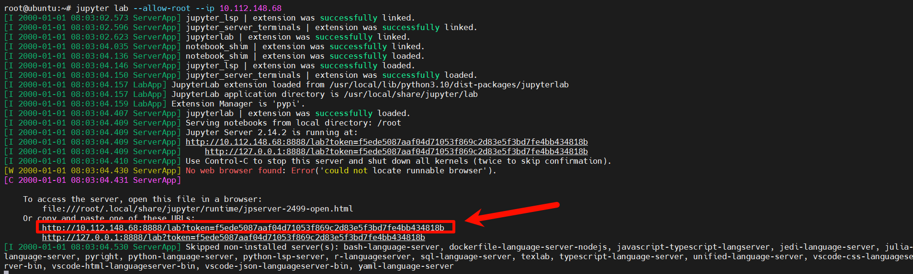
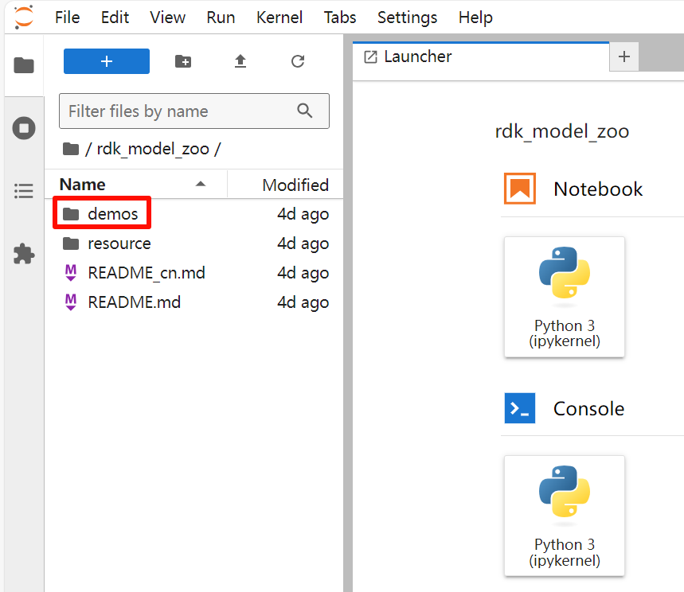
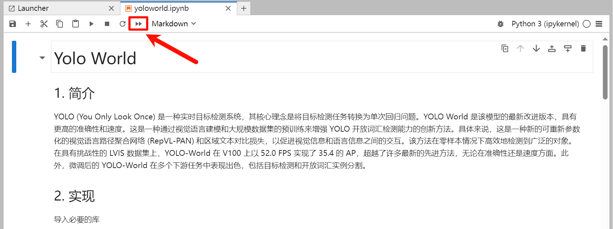
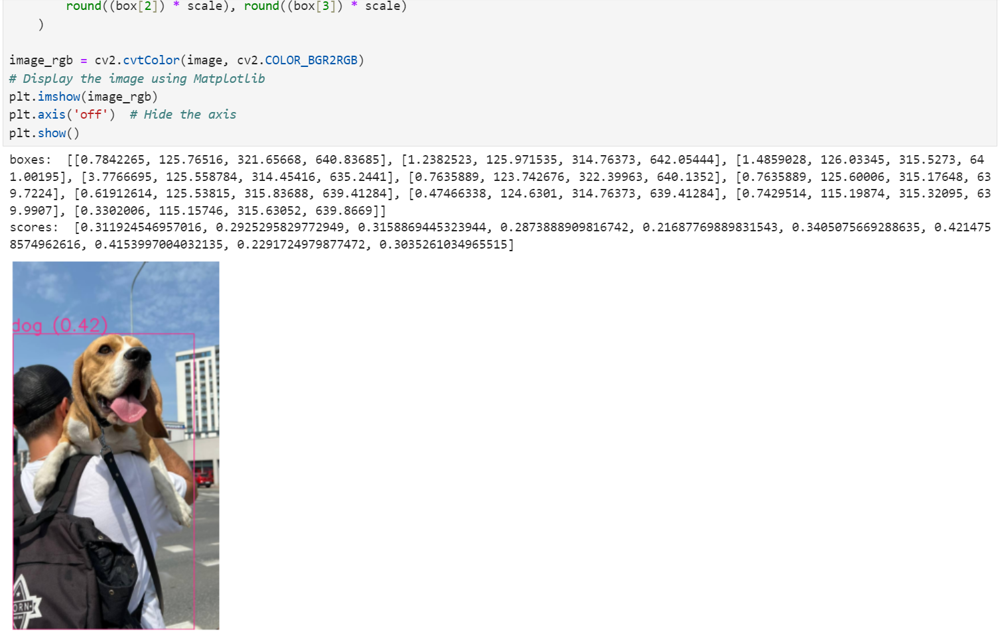
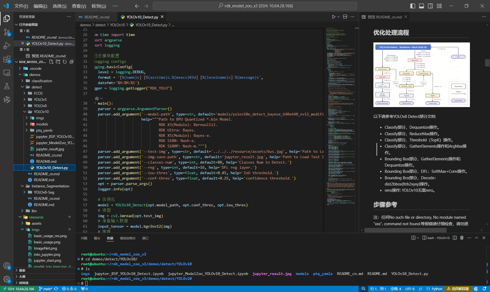
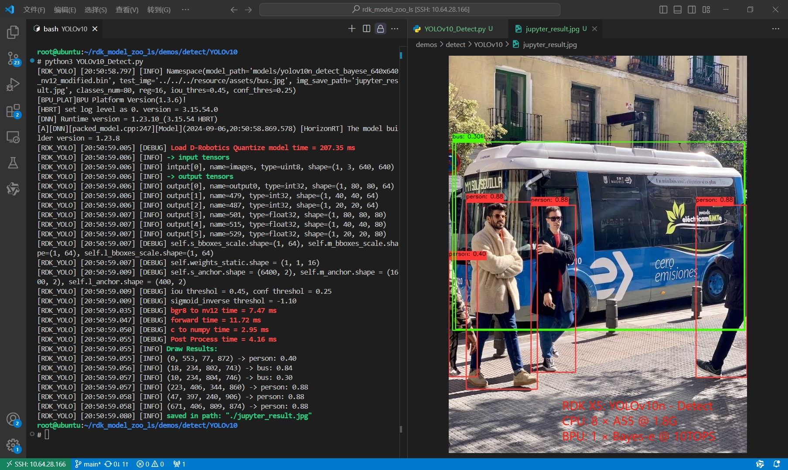

English | [简体中文](./README_cn.md)

# ⭐️ Give a Star for Guidance, Thanks for Your Attention ⭐️

## Introduction to RDK Model Zoo

RDK Model Zoo is developed based on [RDK](https://d-robotics.cc/rdkRobotDevKit), providing deployment routines for most mainstream algorithms. These routines include exporting D-Robotics *.bin models and using Python APIs to infer D-Robotics *.bin models. Some models also encompass data collection, model training, exportation, conversion, and deployment processes.

**RDK Model Zoo currently provides reference for the following types of models:**

- [Image Classification](https://github.com/D-Robotics/rdk_model_zoo/tree/main/demos/classification): `./rdk_model_zoo/demos/classification`
  
- [Object Detection](https://github.com/D-Robotics/rdk_model_zoo/tree/main/demos/detect): `./rdk_model_zoo/demos/detect`

- [Instance Segmentation](https://github.com/D-Robotics/rdk_model_zoo/tree/main/demos/Instance_Segmentation): `./rdk_model_zoo/demos/Instance_Segmentation`

- [Large Models](https://github.com/D-Robotics/rdk_model_zoo/tree/main/demos/llm): `./rdk_model_zoo/demos/llm`

**RDK Model Zoo supports the following platforms:**
- Supports [RDK X5](https://developer.d-robotics.cc/rdkx5), [RDK Ultra](https://developer.d-robotics.cc/rdkultra) platforms (Bayse)
- Supports [RDK S100](), [RDK S100P]() platforms (Nash)
- Partially supports [RDK X3](https://developer.d-robotics.cc/rdkx3) platform (Bernoulli2)

**Recommended System Versions**
- RDK X3: RDK OS 3.0.0, Based on Ubuntu 22.04 aarch64, TROS-Humble.
- RDK X5: RDK OS 3.0.0, Based on Ubuntu 22.04 aarch64, TROS-Humble.
- RDK Ultra: RDK OS 1.0.0, Based on Ubuntu 20.04 aarch64, TROS-Foxy.

## ⭐️ Preparation of RDK Board

Refer to the [RDK User Manual](https://developer.d-robotics.cc/information) to ensure the board can access the internet normally, ensuring one of the following conditions can be met.

- Use SSH to connect to the RDK board, allowing commands to be input through Terminal, knowing the IP address of the RDK board. Including but not limited to MobaXtern, Windows Terminal, etc.
- Use VSCode Remote SSH plugin to remotely connect to the RDK board, enabling normal use of VSCode or other IDEs.
- Access the board via VNC, operating it through the xfce graphical interface.
- Connect to the board via HDMI, operating it through the xfce graphical interface.

## ⭐️ Dependency Installation Reference

### RDK Model Zoo Python API (Recommended)
Install the bpu_infer_lib library using pip.

For RDK X5:
```bash
pip install bpu_infer_lib_x5 -i  http://sdk.d-robotics.cc:8080/simple/  --trusted-host sdk.d-robotics.cc
```

For RDK X3:
```bash
pip install bpu_infer_lib_x3 -i  http://sdk.d-robotics.cc:8080/simple/  --trusted-host sdk.d-robotics.cc
```

### D-Robotics System Software BSP C/C++ & Python API (Reference)

Managed as Debian packages with system flashing.
```bash
sudo apt update # Ensure the archive.d-robotics.cc source is available
sudo apt install hobot-spdev
sudo apt show hobot-spdev
```

### D-Robotics ToolChain C API (Reference)
Included with system flashing, this is the most basic C API.
Refer to the [RDK User Manual Algorithm Toolchain](https://developer.d-robotics.cc/rdk_doc/04_toolchain_development) section for obtaining OE packages, from which libdnn.so and its header files can be extracted.

## ⭐️ Experience RDK Model Zoo Using Jupyter (Recommended)
Install jupyterlab:
```bash
pip install jupyterlab
```

Then use the following command to pull the Model Zoo repository:
```bash
git clone https://github.com/D-Robotics/rdk_model_zoo
```

Note: The default branch pulled by git clone is the RDK X5 branch. If you are using another product in the RDK series, switch branches using git checkout. For example, to switch to the RDK X3 branch, execute:
```bash
git checkout rdk_x3
```

After pulling, enter the Model Zoo directory:
```bash
cd rdk_model_zoo
```

Then start Jupyter Lab (note: replace the IP address with your actual login IP):
```bash
jupyter lab --allow-root --ip 192.168.1.10
```


After executing the command, click the link shown in the log while holding down Ctrl to enter Jupyter Lab (as shown below). Double-click 'demos' to select models and experience the RDK Model Zoo.



Developers can navigate to the corresponding module to experience model deployment on RDK development boards.

Selecting a model's notebook in Jupyter Lab will bring up an interface similar to the following:



Taking the YOLO World model as an example, clicking the double triangle button runs all cells. Scrolling down reveals the results:



Developers can also choose to run cells individually by pressing Shift + Enter, which executes the current cell and moves to the next.

## ⭐️ Experience RDK Model Zoo Using VSCode (Reference)

Use the VSCode Remote SSH plugin to log into the board remotely, open the folder corresponding to the RDK Model Zoo repository, enter the specific model folder, view READMEs, edit programs, and run them.


Note: All program relative paths start from the model's directory.



## ⭐️ RDK Reference Resources

[D-Robotics](https://d-robotics.cc/)

[D-Robotics Developer Community](https://developer.d-robotics.cc/)

[RDK User Manual](https://developer.d-robotics.cc/information)

[Community Resource Center](https://developer.d-robotics.cc/resource)

[RDK X3 Algorithm Toolchain Community Manual](https://developer.d-robotics.cc/api/v1/fileData/horizon_xj3_open_explorer_cn_doc/index.html)

[RDK X3 OpenExplore Product Release](https://developer.d-robotics.cc/forumDetail/136488103547258769)

[RDK Ultra Algorithm Toolchain Community Manual](https://developer.d-robotics.cc/api/v1/fileData/horizon_j5_open_explorer_cn_doc/index.html)

[RDK Ultra OpenExplore Product Release](https://developer.d-robotics.cc/forumDetail/118363912788935318)

[RDK X5 Algorithm Toolchain Community Manual](https://developer.d-robotics.cc/api/v1/fileData/x5_doc-v126cn/index.html)

[RDK X5 OpenExplore Product Release](https://developer.d-robotics.cc/forumDetail/251934919646096384)

## ⭐️ Feedback
If you have any questions or encounter issues, we warmly welcome you to post them on the [D-Robotics Developer Community](https://developer.d-robotics.cc) or submit an issue/comment directly in this repository. Your feedback is invaluable to us, and we are always eager to assist you and improve our resources.

## ⭐️ FAQ

### The Precision of Self-trained Models Does Not Meet Expectations

- Please check if both the Docker version of the OpenExplore toolchain and the version of libdnn.so on the board are the latest released versions.
- When exporting models, ensure that you follow the requirements specified in the README files within the corresponding examples folders.
- Ensure that the cosine similarity of each output node reaches above 0.999 (a minimum of 0.99).

### The Speed of Self-trained Models Does Not Meet Expectations

- The inference performance using Python APIs is weaker; please test performance using C/C++ APIs.
- Performance data does not include preprocessing and postprocessing steps, which differ from the total time taken by complete demos. Generally, models with nv12 input can achieve end-to-end throughput equal to BPU throughput.
- Ensure that the board has been set to the highest frequency specified in the corresponding README.
- Check if other applications are occupying CPU/BPU and DDR bandwidth resources, as this can degrade inference performance.

### How to Address Model Quantization Loss of Precision

- According to the platform version, first refer to the relevant documentation for the specific platform, particularly the PTQ section on precision debugging, to debug precision issues.
- If int8 quantization leads to a loss of precision due to model structure characteristics or weight distribution, consider using hybrid quantization or QAT quantization.

### Can't Reshape 1354752 in (1,3,640,640)
Please modify the resolution in the preprocess.py file located in the same directory to match the resolution of the ONNX model you intend to convert. Delete all calibration datasets and rerun script 02 to regenerate the calibration dataset. Currently, the calibration dataset for this example comes from the ../../../01common/calibration data/coco directory and is generated in the ./calibration_data_rgb_f32 directory.

### Why Are There No Demos for Other Models? Is It Because They Are Not Supported?

Hello, no.

- Due to project scheduling constraints, we have selected frequently asked models as demo examples to cater to the needs of most D-Robotics developers. If you have better model recommendations, feel free to provide feedback on the D-Robotics Developer Community.
- Additionally, BPU and algorithm toolchain-related resources have already been released on the developer community, allowing custom models to be converted independently.

### mAP Precision Is Lower Compared to Ultralytics Official Results

- Ultralytics measures mAP using dynamic shape models, whereas BPU uses fixed shape models, resulting in lower mAP test results compared to dynamic shapes.
- It's normal for the precision calculated by RDK Solutions using pycocotools to be slightly lower than that calculated by Ultralytics due to minor differences in calculation methods. We focus on using the same calculation method to test the precision of quantized and floating-point models to assess precision loss during quantization.
- After quantization and converting NCHW-RGB888 input to YUV420SP(nv12) input, BPU models also experience some precision loss.

### Can ONNX Exported Without Modifying YOLO Model Structure Be Used?

Yes, but it's not recommended.

- For public model structures or self-designed output head structures, you need to design the post-processing code yourself.
- The adjustments made to model structures in the RDK Solutions repository have been considered for both precision and performance. Other modifications have not been tested yet, but we welcome explorations of more high-performance and high-precision modification methods.

### Do Models Need to Be Converted to ONNX First Before Quantization/How to Use Horizon Toolchain?
Under the PTQ scheme, models need to be exported to ONNX or Caffe first, then converted to bin models. Under the QAT scheme, a new Torch model needs to be built for quantization-aware training, converting from pt models to hbm models.

### Is It Necessary to Modify Output Heads During Training?
During training, follow the public version entirely and only modify when exporting. This ensures that the training loss function calculations align, and deployment will match the post-processing code running on the board.

### Does Model Inference Involve CPU Processing?
During model conversion, operators that cannot be quantized or do not meet BPU constraints will fallback to CPU computation. Specifically, for a fully BPU operator-based bin model, there will be quantization and dequantization nodes before and after the model, responsible for converting float to int and vice versa, which are computed by the CPU.
