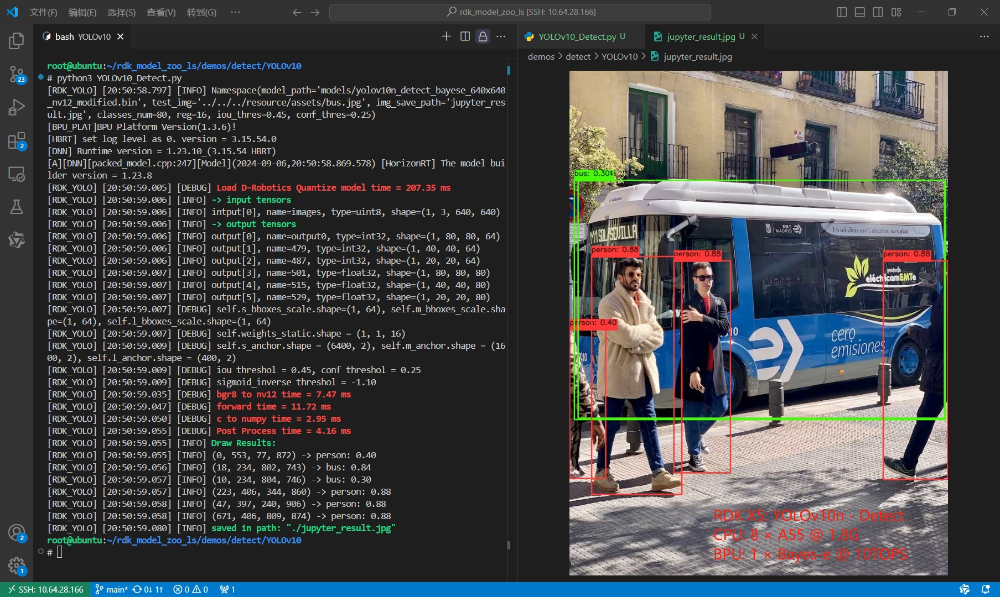

<div align="center">
  <p><b>⚠️ Note: This repository is currently undergoing migration and refactoring. Some features and documentation may be incomplete. Thank you for your patience.</b></p>
</div>

<div align="center">
  
</div>

<div align="center">
  <h1 align="center">RDK Model Zoo</h1>
  <p align="center">
    <b>Out-of-the-Box AI Model Deployment Pipelines and Full-Link Conversion Tutorials Based on D-Robotics BPU</b>
  </p>
</div>

<div align="center">

**English** | [简体中文](./README_cn.md)

<p align="center">
  <a href="https://github.com/D-Robotics/rdk_model_zoo/stargazers"></a>
  <a href="https://github.com/D-Robotics/rdk_model_zoo/network/members"></a>
  <a href="https://github.com/D-Robotics/rdk_model_zoo/pulls"></a>
  <a href="https://github.com/D-Robotics/rdk_model_zoo/tree/rdk_x5/LICENSE"></a>
  <a href="https://developer.d-robotics.cc"></a>
</p>

</div>

## Introduction

> **Mission**: Dedicated to providing D-Robotics developers with extreme performance, out-of-the-box, and full-scenario AI deployment validation experiences.

This repository is the official collection of BPU model examples and tools (Model Zoo) provided by D-Robotics. It is oriented towards AI model deployment and application development on BPU (Brain Processing Unit), helping developers to **quickly get started with BPU** and **fast-track model inference workflows**.

The repository includes BPU-ready models across multiple AI domains and provides complete reference implementations from **Original Model (PyTorch/ONNX) -> Fixed-point Quantization -> Inference Execution -> Result Parsing -> Example Validation**, helping users understand and utilize BPU capabilities at minimal cost.

### Core Value
- 🚀 **Quick BPU Adoption**: Provides out-of-the-box inference pipelines to help users complete BPU inference validation and performance evaluation in the shortest time.
- 🧩 **Complete End-to-End Examples**: Covers the entire process from algorithm export and fixed-point quantization to efficient on-board execution (`.bin` / `.hbm`). Includes model loading, preprocessing, BPU inference execution, post-processing, and result visualization.
- 📐 **Standardized Design & Documentation**: Provides unified directory structures and sample code specifications, supporting Python (`hbm_runtime`) and C/C++ interfaces for easy understanding, secondary development, and reduced integration/maintenance costs.
- **🌐 Full Scenario Coverage**: Covers classification, detection, segmentation, pose estimation, OCR, and cutting-edge multi-modal models like LLM.

### Hardware & System Support
- **RDK X5 (Bayse-e)**: Recommended to use RDK OS >= 3.5.0 (Based on Ubuntu 22.04 aarch64, TROS-Humble).
- **RDK S100/S600**: Please refer to the dedicated repository [RDK Model Zoo S](https://github.com/d-Robotics/rdk_model_zoo_s).

---

## Directory Structure

This repository keeps **fully standardized delivery samples** under `samples/` and preserves **legacy or in-progress examples** under `demos/`.

<details>
<summary><b>Click to expand project directory architecture</b></summary>

<br>

```bash
rdk_model_zoo/
|-- samples/               # Standardized delivery samples
|   `-- vision/
|       |-- convnext/
|       |-- fcos/
|       |-- lprnet/
|       |-- mobilenetv1/
|       |-- mobilenetv2/
|       |-- mobilenetv3/
|       |-- mobilenetv4/
|       |-- googlenet/
|       |-- edgenext/
|       |-- efficientformer/
|       |-- efficientformerv2/
|       |-- efficientnet/
|       |-- fastvit/
|       |-- paddleocr/
|       |-- resnet/
|       |-- ultralytics_yolo/
|       |-- ultralytics_yolo26/
|       `-- yolov5/
|-- demos/                 # Legacy or in-progress examples not yet normalized
|   |-- classification/    # Classification model collection
|   |-- detect/            # Other detection demos not yet standardized
|   |-- Seg/               # Segmentation demos pending standardization
|   |-- Vision/            # Vision-specific demos such as MODNet
|   |-- llm/               # LLM / multi-modal demos
|   `-- solutions/         # End-to-end solution demos
|-- docs/                  # Project guidelines and reference documentation
|-- datasets/              # Sample datasets and download scripts
|-- utils/                 # Shared C++ / Python utilities
`-- resource/              # Static resources (images, logos, etc.)
```
</details>

---

## Quick Start

Use `samples/` for standardized delivery examples. Use `demos/` only when the target model has not yet been migrated to the standard sample layout.

1. **Choose the right path**:
   - Standardized samples: `samples/vision/...`
   - Legacy / in-progress demos: `demos/...`
2. **Check system version**: Ensure the target board is running `RDK OS >= 3.5.0`.
3. **Connect hardware**: Ensure your RDK board is powered and network-connected. SSH or VSCode Remote SSH is recommended.
4. **Read the model README first**: Always open the target directory `README.md` before running commands.

> **Example A: standardized sample (`samples/`)**
> ```bash
> # Enter the standardized sample directory
> cd samples/vision/yolov5/runtime/python
>
> # Run inference (the script will download the default model automatically)
> bash run.sh
> ```

> **Example B: legacy / in-progress demo (`demos/`)**
> ```bash
> # Enter a legacy demo directory
> cd demos/detect
>
> # Select a legacy demo and follow its README
>
> # Read the demo README and follow its run instructions
> ```

**Inference Result:**
<div align="center">
  
</div>

---

## Model Zoo Matrix

### Standardized Samples

These directories have been migrated to the standard sample layout and are the recommended entry points.

| Category | Models | Path |
| :--- | :--- | :---: |
| **Classification** | ConvNeXt | [Code](./samples/vision/convnext) |
| **Classification** | MobileNetV1 | [Code](./samples/vision/mobilenetv1) |
| **Classification** | MobileNetV2 | [Code](./samples/vision/mobilenetv2) |
| **Classification** | MobileNetV3 | [Code](./samples/vision/mobilenetv3) |
| **Classification** | MobileNetV4 | [Code](./samples/vision/mobilenetv4) |
| **Classification** | GoogLeNet | [Code](./samples/vision/googlenet) |
| **Classification** | EdgeNeXt | [Code](./samples/vision/edgenext) |
| **Classification** | EfficientFormer | [Code](./samples/vision/efficientformer) |
| **Classification** | EfficientFormerV2 | [Code](./samples/vision/efficientformerv2) |
| **Classification** | EfficientNet | [Code](./samples/vision/efficientnet) |
| **Classification** | FastViT | [Code](./samples/vision/fastvit) |
| **Classification** | ResNet | [Code](./samples/vision/resnet) |
| **Object Detection** | FCOS | [Code](./samples/vision/fcos) |
| **Recognition** | LPRNet | [Code](./samples/vision/lprnet) |
| **Object Detection** | YOLOv5 | [Code](./samples/vision/yolov5) |
| **Ultralytics YOLO** | YOLOv5u, YOLOv8, YOLOv9, YOLOv10, YOLO11, YOLO12, YOLO13, YOLO26 | [Code](./samples/vision/ultralytics_yolo), [YOLO26](./samples/vision/ultralytics_yolo26) |
| **OCR** | PaddleOCR | [Code](./samples/vision/paddleocr) |

### Legacy / In-Progress Demos

These directories have been moved back to `demos/` because they have not yet been fully refactored to the standard sample layout.

| Category | Representative Models | Path |
| :--- | :--- | :---: |
| **Classification** | RepViT and other classification models | [Code](./demos/classification) |
| **Object Detection** | Other legacy detection demos | [Code](./demos/detect) |
| **Segmentation** | YOLOE-11-Seg-Prompt-Free | [Code](./demos/Seg) |
| **Vision Specifics** | MODNet | [Code](./demos/Vision) |
| **Large Models** | CLIP, YOLO-World | [Code](./demos/llm) |
| **Solutions** | RDK LLM Solutions, RDK Video Solutions | [Code](./demos/solutions) |

---

## Documentation & Resources

- **Model Docs**: Each model's top-level `README.md` provides an overview and run guide.
- **Source Reference**: For code-level interface details, see **[Source Documentation](./docs/source_reference/README.md)**.
- **Guidelines**: To contribute or develop, please read the **[Model Zoo Repository Guidelines](./docs/Model_Zoo_Repository_Guidelines.md)**.
- **Toolchain Manuals**:
  - [RDK X5 Toolchain Doc](https://developer.d-robotics.cc/api/v1/fileData/x5_doc-v126cn/index.html)
  - [RDK X3 Toolchain Doc](https://developer.d-robotics.cc/api/v1/fileData/horizon_xj3_open_explorer_cn_doc/index.html)
- **Developer Forum**: [D-Robotics Developer Community](https://developer.d-robotics.cc/)
- **User Manual**: [RDK User Manual](https://developer.d-robotics.cc/information)

---

## FAQ

<details>
<summary><b>1. Model accuracy doesn't meet expectations?</b></summary>
<br>

- Ensure OpenExplorer Docker and board-side `libdnn.so` versions are up-to-date.
- Check if model export followed the structure adjustments/operator replacements required in the model's README.
- Verify cosine similarity of each output node is >= 0.999 (minimum 0.99) during quantization validation.
</details>

<details>
<summary><b>2. Inference speed doesn't meet expectations?</b></summary>
<br>

- Python API performance is lower than C/C++. For maximum performance, use C/C++.
- Benchmark data (pure forward) excludes pre/post-processing. Models with **NV12** input usually achieve peak BPU throughput.
- Ensure CPU/BPU frequency is locked to maximum.
- Check for other resource-heavy processes.
</details>

<details>
<summary><b>3. How to fix quantization precision loss?</b></summary>
<br>

- Refer to the PTQ accuracy debugging section in the platform documentation.
- If INT8 loss is severe due to model characteristics, consider Mixed Precision or QAT (Quantization-Aware Training).
</details>

<details>
<summary><b>4. Error "Can't reshape 1354752 in (1,3,640,640)"?</b></summary>
<br>

Update the resolution in `preprocess.py` to match your ONNX model's input size. Delete old calibration data and re-run the calibration script.
</details>

<details>
<summary><b>5. mAP accuracy is lower than official results (e.g., Ultralytics)?</b></summary>
<br>

- Deployment uses fixed shape and INT8 quantization, unlike dynamic shape/float official tests.
- Slight implementation differences in evaluation scripts (e.g., `pycocotools`).
- NCHW-RGB to NV12 conversion adds minimal pixel-level loss.
</details>

<details>
<summary><b>6. Does the model use CPU during inference?</b></summary>
<br>

Yes. Non-quantizable or BPU-unsupported operators **fallback** to CPU. Even for pure BPU models, input/output quantization/dequantization nodes are executed by the CPU.
</details>

---

## Community & Contribution

### Star History
[](https://star-history.com/#D-Robotics/rdk_model_zoo&Date)

We warmly welcome contributions! Please raise an issue on [GitHub Issues](https://github.com/D-Robotics/rdk_model_zoo/issues) or discuss on the [Developer Community](https://developer.d-robotics.cc/).

## License

This project is licensed under the [Apache License 2.0](./LICENSE) agreement.
