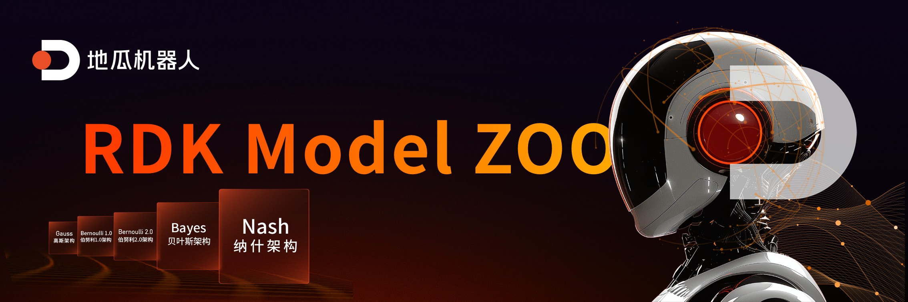

<div align="center">
  
</div>

<div align="center">
  <h1 align="center">RDK Model Zoo</h1>
  <p align="center">
    <b>基于 D-Robotics BPU 的开箱即用 AI 模型部署 Pipeline 与全链路转换教程</b>
  </p>
</div>

<div align="center">

[English](./README.md) | **简体中文**

<p align="center">
  <a href="https://github.com/D-Robotics/rdk_model_zoo/stargazers"></a>
  <a href="https://github.com/D-Robotics/rdk_model_zoo/network/members"></a>
  <a href="https://github.com/D-Robotics/rdk_model_zoo/pulls"></a>
  <a href="./LICENSE"></a>
  <a href="https://developer.d-robotics.cc"></a>
</p>

</div>

## 仓库简介 (Introduction)

> **使命**：致力于为地瓜机器人开发者提供极致性能、开箱即用、覆盖全场景的 AI 部署验证体验。

本仓库是 D-Robotics（地瓜机器人）官方提供的 BPU 模型示例与工具集合（Model Zoo），面向运行在 BPU（Brain Processing Unit）上的 AI 模型部署与应用开发，用于帮助开发者**快速上手 BPU**、**快速跑通模型推理流程**。

仓库中收录了覆盖多个 AI 领域的 BPU 可运行模型，并提供从 **原始模型 (PyTorch/ONNX) -> 定点量化转换 -> 推理运行 -> 结果解析 -> 示例验证** 的完整参考实现，帮助用户以最小成本理解并使用 BPU 能力。

### 仓库核心价值

- 🚀 **快速把 BPU 用起来**：提供开箱即用的推理 Pipeline，帮助用户在最短时间内完成 BPU 推理验证及性能评估。
- 🧩 **完整端到端示例**：覆盖从算法导出、定点量化转换到板端高效运行（`.bin` / `.hbm`）的全过程。包含模型加载、前处理、BPU 推理执行、后处理与结果可视化。
- 📐 **规范化设计与接口文档**：提供统一的目录结构与示例代码规范，支持 Python（`hbm_runtime`）与 C/C++ 接口，便于快速理解和二次开发，降低集成与维护成本。
- 🌐 **全场景覆盖**：涵盖分类、检测、分割、深度估计、OCR、语音以及多模态模型。

### 硬件与系统支持

当前 `develop` 分支是所有在维护板卡的统一源：每个 Sample 在运行时通过其文档声明的 `--target` / `--platform` 可选项选择目标板，各 Sample README 说明其发布制品支持的板卡；平台制品清单记录在 `docs/release/x5/` 与 `docs/release/s/`。`rdk_x5` 与 `rdk_s` 分支为分板卡交付线，RDK X3 资料归档在 `rdk_x3`。

| 目标硬件 | 获取方式 | 说明 |
| :--- | :--- | :--- |
| RDK X5 | 本分支，`--target x5` | 推荐系统版本为 RDK OS >= 3.5.0，系统基于 Ubuntu 22.04 aarch64 和 TROS-Humble。 |
| RDK S100 | 本分支，`--target s100` | Nash-E 制品发布于 `docs/release/s/`。 |
| RDK S100P | 本分支，`--target s100p` | Nash-M 制品发布于 `docs/release/s/`。 |
| RDK S600 | 本分支，`--target s600` | Nash-P 制品发布于 `docs/release/s/`。 |
| 分板卡交付线 | [`rdk_x5`](https://github.com/D-Robotics/rdk_model_zoo/tree/rdk_x5) / [`rdk_s`](https://github.com/D-Robotics/rdk_model_zoo/tree/rdk_s) | 按板卡发布的交付分支。 |
| RDK X3（归档） | [`rdk_x3`](https://github.com/D-Robotics/rdk_model_zoo/tree/rdk_x3) | 仅作历史归档，不再作为适配目标。 |

**[浏览在线模型目录 →](https://d-robotics.github.io/rdk_model_zoo/)**

在线模型目录以可搜索卡片展示已发布模型、模型资产、已经实测的性能与精度结果及其测试条件。缺失的性能或精度指标均表示尚未实测，不会根据其他指标推算或补造数值。

---

## 仓库目录结构

<details>
<summary><b>点击展开项目目录结构</b></summary>

<br>

```bash
rdk_model_zoo/
|-- samples/
|   |-- llm/                 # 端侧文本生成（原生 C++）
|   |   |-- gemma4-e2b/      # VLM chat runtime (native C++)
|   |   `-- minicpm5-2b/     # Text generation (native C++)
|   |-- robotics/
|   |   `-- himloco/         # Unitree Go2 运动控制策略
|   |-- speech/
|   |   |-- asr/             # 语音识别
|   |   |-- kws/             # 关键词检测
|   |   |-- paraformer/      # Paraformer 语音识别
|   |-- vla/                 # 上游 VLA 集成（ACT / Pi0，固定子模块）
|   |-- vision/
|   |   |-- 3dresnet/              # Video action classification
|   |   |-- bytetrack/             # Multi-object tracking
|   |   |-- clip/                  # Image-text multimodal matching
|   |   |-- convnext/              # Image classification
|   |   |-- depth_anything_v2/     # Monocular depth estimation
|   |   |-- diffusiondrive/        # End-to-end driving planning
|   |   |-- dinov2/                # Vision feature encoder
|   |   |-- edgenext/              # Image classification
|   |   |-- efficient_sam/         # Promptable image segmentation
|   |   |-- efficientformer/       # Image classification
|   |   |-- efficientformerv2/     # Image classification
|   |   |-- efficientnet/          # Image classification
|   |   |-- efficientvit/          # Image classification
|   |   |-- fasternet/             # Image classification
|   |   |-- fastvit/               # Image classification
|   |   |-- fcos/                  # Object detection
|   |   |-- googlenet/             # Image classification
|   |   |-- hgnetv2/               # Image classification
|   |   |-- lanenet/               # Lane detection
|   |   |-- lprnet/                # License plate recognition
|   |   |-- mobile_sam/            # Promptable image segmentation
|   |   |-- mobilenetv1/           # Image classification
|   |   |-- mobilenetv2/           # Image classification
|   |   |-- mobilenetv3/           # Image classification
|   |   |-- mobilenetv4/           # Image classification
|   |   |-- mobileone/             # Image classification
|   |   |-- modnet/                # Image matting
|   |   |-- paddle_ocr/            # OCR text detection and recognition
|   |   |-- pointnet/              # Point cloud part segmentation
|   |   |-- pp_liteseg/            # Semantic segmentation
|   |   |-- repghost/              # Image classification
|   |   |-- repvgg/                # Image classification
|   |   |-- repvit/                # Image classification
|   |   |-- resnet/                # Image classification
|   |   |-- resnext/               # Image classification
|   |   |-- siglip/                # Vision-language encoder
|   |   |-- ultralytics_yolo/      # Detection, segmentation, pose, classification (YOLOv5u-YOLO26)
|   |   |-- unet/                  # Semantic segmentation
|   |   |-- unetmobilenet/         # Semantic segmentation
|   |   |-- vargconvnet/           # Image classification
|   |   |-- vit/                   # Image classification
|   |   |-- yolo26_depth/          # Monocular depth estimation
|   |   |-- yoloe/                 # Prompt-free instance segmentation
|   |   |-- yolov5/                # Object detection
|   `-- yoloworld/             # Open-vocabulary object detection
|-- datasets/              # 数据集与下载脚本
|-- docs/                  # 项目规范与参考文档
|-- skills/                # RDK Model Zoo 技能
`-- utils/                 # 公共 C++ / Python 工具
```
</details>

---

## 快速开始 (Quick Start)

1. **检查系统版本**
   - 本示例运行在 RDK X5 上，确保板卡系统版本满足 `RDK OS >= 3.5.0`（其他示例以其 README 为准）。
2. **连接硬件**
   - 确保 RDK 板卡上电并可通过 SSH 或 VSCode Remote SSH 访问。
3. **先阅读对应 README**
   - 进入目标目录后先阅读 `README.md` / `README_cn.md`，再执行命令。
4. **运行 Ultralytics YOLO11x 检测 sample**

```bash
cd samples/vision/ultralytics_yolo/model
bash download_model.sh --platform x5 --family yolo11 --task detect --model-size x

cd ../runtime/python
python3 main.py \
  --task detect \
  --platform x5 \
  --family yolo11 \
  --model-size x \
  --test-img ../../test_data/bus.jpg \
  --img-save-path ../../test_data/inference_yolo11x.jpg
```

**推理结果示例：**
<div align="center">
  
</div>

---

## 模型列表

| 类别 | 模型名称 | 模型路径 | 支持平台 | 详情 |
| :--- | :--- | :--- | :--- | :---: |
| 视频动作分类 | 3D ResNet | `samples/vision/3dresnet` | RDK S100 | [详情](./samples/vision/3dresnet) |
| 图像分类 | ConvNeXt | `samples/vision/convnext` | RDK X5 | [详情](./samples/vision/convnext) |
| 图像分类 | EdgeNeXt | `samples/vision/edgenext` | RDK X5 | [详情](./samples/vision/edgenext) |
| 图像分类 | EfficientFormer | `samples/vision/efficientformer` | RDK X5 | [详情](./samples/vision/efficientformer) |
| 图像分类 | EfficientFormerV2 | `samples/vision/efficientformerv2` | RDK X5 | [详情](./samples/vision/efficientformerv2) |
| 图像分类 | EfficientNet | `samples/vision/efficientnet` | RDK X5 / RDK S100 / RDK S600 | [详情](./samples/vision/efficientnet) |
| 图像分类 | EfficientViT | `samples/vision/efficientvit` | RDK X5 | [详情](./samples/vision/efficientvit) |
| 图像分类 | FasterNet | `samples/vision/fasternet` | RDK X5 | [详情](./samples/vision/fasternet) |
| 图像分类 | FastViT | `samples/vision/fastvit` | RDK X5 | [详情](./samples/vision/fastvit) |
| 图像分类 | GoogLeNet | `samples/vision/googlenet` | RDK X5 | [详情](./samples/vision/googlenet) |
| 图像分类 | HGNetV2 | `samples/vision/hgnetv2` | RDK X5 | [详情](./samples/vision/hgnetv2) |
| 图像分类 | MobileNetV1 | `samples/vision/mobilenetv1` | RDK X5 / RDK S100 / RDK S600 | [详情](./samples/vision/mobilenetv1) |
| 图像分类 | MobileNetV2 | `samples/vision/mobilenetv2` | RDK X5 / RDK S100 / RDK S600 | [详情](./samples/vision/mobilenetv2) |
| 图像分类 | MobileNetV3 | `samples/vision/mobilenetv3` | RDK X5 / RDK S100 / RDK S600 | [详情](./samples/vision/mobilenetv3) |
| 图像分类 | MobileNetV4 | `samples/vision/mobilenetv4` | RDK X5 / RDK S100 / RDK S600 | [详情](./samples/vision/mobilenetv4) |
| 图像分类 | MobileOne | `samples/vision/mobileone` | RDK X5 | [详情](./samples/vision/mobileone) |
| 图像分类 | RepGhost | `samples/vision/repghost` | RDK X5 | [详情](./samples/vision/repghost) |
| 图像分类 | RepVGG | `samples/vision/repvgg` | RDK X5 | [详情](./samples/vision/repvgg) |
| 图像分类 | RepViT | `samples/vision/repvit` | RDK X5 | [详情](./samples/vision/repvit) |
| 图像分类 | ResNet | `samples/vision/resnet` | RDK X5 / RDK S100 / RDK S600 | [详情](./samples/vision/resnet) |
| 图像分类 | ResNeXt | `samples/vision/resnext` | RDK X5 | [详情](./samples/vision/resnext) |
| 图像分类 | VargConvNet | `samples/vision/vargconvnet` | RDK X5 | [详情](./samples/vision/vargconvnet) |
| 图像分类 | ViT | `samples/vision/vit` | RDK S100 | [详情](./samples/vision/vit) |
| 多目标跟踪 | ByteTrack | `samples/vision/bytetrack` | RDK S100 | [详情](./samples/vision/bytetrack) |
| 提示式图像分割 | EfficientSAM-Tiny | `samples/vision/efficient_sam` | RDK X5 / RDK S100 / RDK S100P | [详情](./samples/vision/efficient_sam) |
| 提示式图像分割 | MobileSAM | `samples/vision/mobile_sam` | RDK X5 / RDK S100 / RDK S100P | [详情](./samples/vision/mobile_sam) |
| 单目深度估计 | Depth Anything V2 | `samples/vision/depth_anything_v2` | RDK S100 | [详情](./samples/vision/depth_anything_v2) |
| 单目深度估计 | YOLO26 Depth | `samples/vision/yolo26_depth` | RDK X5 / RDK S100 / RDK S100P / RDK S600 | [详情](./samples/vision/yolo26_depth) |
| 语义分割 | PP-LiteSeg | `samples/vision/pp_liteseg` | RDK X5 | [详情](./samples/vision/pp_liteseg) |
| 语义分割 | UNet ResNet Family | `samples/vision/unet` | RDK X5 | [详情](./samples/vision/unet) |
| 语义分割 | UNetMobileNet | `samples/vision/unetmobilenet` | RDK S100 / RDK S600 | [详情](./samples/vision/unetmobilenet) |
| 车道线检测 | LaneNet | `samples/vision/lanenet` | RDK S100 | [详情](./samples/vision/lanenet) |
| 目标检测 | FCOS | `samples/vision/fcos` | RDK X5 | [详情](./samples/vision/fcos) |
| 目标检测 | YOLOv5 | `samples/vision/yolov5` | RDK X5 / RDK S100 / RDK S600 | [详情](./samples/vision/yolov5) |
| 目标检测 / 实例分割 / 姿态估计 / 图像分类 / 旋转框检测 | Ultralytics YOLO (`YOLOv5u / YOLOv8 / YOLOv9 / YOLOv10 / YOLO11 / YOLO12 / YOLO13 / YOLO26`) | `samples/vision/ultralytics_yolo` | RDK X5 / RDK S100 / RDK S100P / RDK S600 | [详情](./samples/vision/ultralytics_yolo) |
| 免提示实例分割 | YOLOE | `samples/vision/yoloe` | RDK X5 / RDK S100 / RDK S100P | [详情](./samples/vision/yoloe) |
| 开放词表目标检测 | YOLOWorld | `samples/vision/yoloworld` | RDK X5 | [详情](./samples/vision/yoloworld) |
| 点云分割 | PointNet | `samples/vision/pointnet` | RDK S100 | [详情](./samples/vision/pointnet) |
| 图像抠图 | MODNet | `samples/vision/modnet` | RDK X5 | [详情](./samples/vision/modnet) |
| OCR 文字检测与识别 | PaddleOCR | `samples/vision/paddle_ocr` | RDK X5 / RDK S100 / RDK S600 | [详情](./samples/vision/paddle_ocr) |
| 车牌识别 | LPRNet | `samples/vision/lprnet` | RDK X5 | [详情](./samples/vision/lprnet) |
| 图文多模态匹配 | CLIP | `samples/vision/clip` | RDK X5 | [详情](./samples/vision/clip) |
| 视觉特征编码 | DINOv2 | `samples/vision/dinov2` | RDK S100 / RDK S100P / RDK S600 | [详情](./samples/vision/dinov2) |
| 视觉-语言编码 | SigLIP | `samples/vision/siglip` | RDK S100 / RDK S100P | [详情](./samples/vision/siglip) |
| 语音识别 | ASR (Wav2Vec2) | `samples/speech/asr` | RDK S100 / RDK S600 | [详情](./samples/speech/asr) |
| 关键词检测 | KWS | `samples/speech/kws` | RDK S100 | [详情](./samples/speech/kws) |
| 语音识别 | Paraformer | `samples/speech/paraformer` | RDK S100 | [详情](./samples/speech/paraformer) |
| 端到端规划驾驶 | DiffusionDrive | `samples/vision/diffusiondrive` | RDK S100P / RDK S600 | [详情](./samples/vision/diffusiondrive) |
| 足式机器人运动控制 | HIMLoco (Unitree Go2) | `samples/robotics/himloco` | RDK X5 | [详情](./samples/robotics/himloco) |
| 视觉-语言模型 | Gemma4-E2B（原生 C++） | `samples/llm/gemma4-e2b` | RDK S100P / RDK S600 | [详情](./samples/llm/gemma4-e2b) |
| 文本生成 | MiniCPM5-2B (native C++) | `samples/llm/minicpm5-2b` | RDK S100P / RDK S600 | [详情](./samples/llm/minicpm5-2b) |

上游 VLA 集成（ACT 与 Pi0）另外以固定 Git 子模块形式提供于 `samples/vla/`，集成范围见 [VLA 总览](./samples/vla/README.md)。

## 文档说明与学习资源

为了帮助你更好地理解和使用 RDK 平台与本仓库代码，建议优先阅读以下文档：

- **模型说明**
  - 每个模型目录下的 `README.md` / `README_cn.md` 都包含整体介绍、运行方法和目录说明。
- **源码参考**
  - 如需了解代码级接口说明，请参考 **[源码文档说明](./docs/source_reference/README.md)**。
- **开发规范**
  - 如需新增或开发 Sample，请先阅读 **[Model Zoo 仓库规范指南](./docs/Model_Zoo_Repository_Guidelines.md)**。
- **Runtime 标准**
  - [Runtime 代码规范](./docs/sample-standards/runtime-code.md)（§9–§10 含阶段、数据流与测试要求）与 [README 规范](./docs/sample-standards/readme-contract.md)。
- **架构说明**
  - 可读模型示例模式见 [模型示例](./docs/architecture/model-examples.md)。
- **版本发布**
  - 发布流程与制品清单收录在 [docs/release](./docs/release)。
- **工具链文档**
  - [RDK X5 算法工具链文档](https://developer.d-robotics.cc/api/v1/fileData/x5_doc-v126cn/index.html)
  - [RDK X3 算法工具链文档](https://developer.d-robotics.cc/api/v1/fileData/horizon_xj3_open_explorer_cn_doc/index.html)
- **开发者社区**
  - [D-Robotics 开发者社区](https://developer.d-robotics.cc/)
- **用户手册**
  - [RDK 用户手册](https://developer.d-robotics.cc/information)

---

## 常见问题解答 (FAQ)

<details>
<summary><b>1. 自己训练模型的精度不满足预期？</b></summary>
<br>

- 检查 OpenExplorer Docker 与板端 `libdnn.so` 是否为当前推荐版本。
- 检查模型导出时是否按对应示例 README 的要求完成结构调整或算子替换。
- 检查量化验证阶段各输出节点的余弦相似度是否达到 0.999 以上（最低不低于 0.99）。
</details>

<details>
<summary><b>2. 自己训练模型的速度不满足预期？</b></summary>
<br>

- Python API 的性能通常低于 C/C++，如需极限性能请优先使用 C/C++。
- Benchmark 数据通常只统计纯前向，不包含前后处理，完整 demo 端到端耗时会更高。
- 使用 **NV12** 输入的模型通常更容易获得最高 BPU 吞吐。
- 请确认板卡 CPU / BPU 已设置为高性能模式，并避免其他进程抢占资源。
</details>

<details>
<summary><b>3. 如何解决模型量化掉精度问题？</b></summary>
<br>

- 请优先参考对应平台工具链文档中的 PTQ 精度调试章节。
- 若模型结构本身对 INT8 敏感，可考虑 Mixed Precision 或 QAT（量化感知训练）。
</details>

<details>
<summary><b>4. 报错 "Can't reshape 1354752 in (1,3,640,640)" 怎么解决？</b></summary>
<br>

转换配置与 ONNX 输入尺寸不再匹配。请将对应示例 `conversion/` 转换指南中的输入分辨率改为与待转换 ONNX 模型一致，同时删除旧的校准数据并重新生成。
</details>

<details>
<summary><b>5. mAP 精度相比官方结果（如 Ultralytics）偏低是否正常？</b></summary>
<br>

一般属于正常现象，常见原因包括：
- 官方测试通常使用动态 shape 和浮点精度，而部署版本使用固定 shape 与 INT8 量化。
- `pycocotools` 评测脚本和官方评测实现之间可能存在细微差异。
- 从 RGB 输入转换为 NV12 输入时会带来少量像素级误差。
</details>

<details>
<summary><b>6. 模型推理时会使用 CPU 吗？</b></summary>
<br>

会。无法量化的算子、无法映射到 BPU 的算子，或量化 / 反量化节点都会由 CPU 执行。即使是以 BPU 为主的 `.bin` 模型，输入输出端通常也会包含 CPU 参与的转换过程。
</details>

---

## 社区与贡献 (Community & Contribution)

### Star 增长趋势

<a href="https://www.star-history.com/?type=date&repos=D-Robotics%2Frdk_model_zoo">
 <picture>
   <source media="(prefers-color-scheme: dark)" srcset="https://api.star-history.com/chart?repos=D-Robotics%2Frdk_model_zoo&type=date&theme=dark&legend=top-left&sealed_token=pcz2nn9lRITzBL-JyNLEYFdMZf7Ra0ft7FtCA_eTVEsXH_7xk2cX9jbYWg1AT0ilwVvO4VgrNH0vXv3LVHeGq58Yi24r1novjfb7VFH3Gc1GCT2jGjg38g" />
   <source media="(prefers-color-scheme: light)" srcset="https://api.star-history.com/chart?repos=D-Robotics%2Frdk_model_zoo&type=date&legend=top-left&sealed_token=pcz2nn9lRITzBL-JyNLEYFdMZf7Ra0ft7FtCA_eTVEsXH_7xk2cX9jbYWg1AT0ilwVvO4VgrNH0vXv3LVHeGq58Yi24r1novjfb7VFH3Gc1GCT2jGjg38g" />
   
 </picture>
</a>

欢迎参与共建 RDK Model Zoo。如有问题或建议，请通过 [GitHub Issues](https://github.com/D-Robotics/rdk_model_zoo/issues) 提出，或在 [D-Robotics 开发者社区](https://developer.d-robotics.cc/) 交流。

## 许可证 (License)

本项目采用 [Apache License 2.0](./LICENSE) 开源协议。
