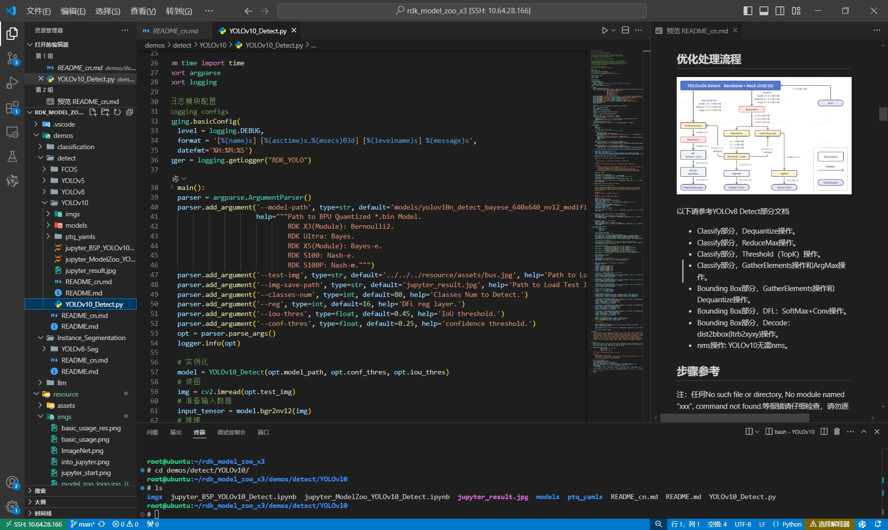

[English](./README.md) | 简体中文


## RDK Model Zoo 简介

RDK Model Zoo 基于[RDK](https://d-robotics.cc/rdkRobotDevKit)开发, 提供大多数主流算法的部署例程. 例程包含导出D-Robotics *.bin模型, 使用 Python 等 API 推理 D-Robotics *.bin模型的流程. 部分模型还包括数据采集, 模型训练, 导出, 转化, 部署流程.

**RDK Model Zoo 目前提供以下类型模型参考.**


 - [图像分类](https://github.com/D-Robotics/rdk_model_zoo/tree/main/demos/classification): `./rdk_model_zoo/demos/classification`
 - [目标检测](https://github.com/D-Robotics/rdk_model_zoo/tree/main/demos/detect): `./rdk_model_zoo/demos/detect`
 - [实例分割](https://github.com/D-Robotics/rdk_model_zoo/tree/main/demos/Instance_Segmentation): `./rdk_model_zoo/demos/Instance_Segmentation`
  - [大模型]([rdk_model_zoo/llm](https://github.com/D-Robotics/rdk_model_zoo/tree/main/demos/)): `./rdk_model_zoo/demos/llm`

**RDK Model Zoo 支持如下平台.**
 - 支持 [RDK X5](https://developer.d-robotics.cc/rdkx5), [RDK Ultra](https://developer.d-robotics.cc/rdkultra) 平台 (Bayse)
 - 支持 [RDK S100](), [RDK S100P]() 平台 (Nash)
 - 部分支持 [RDK X3](https://developer.d-robotics.cc/rdkx3) 平台 (Bernoulli2)

**推荐系统版本**
- RDK X3: RDK OS 3.0.0, Based on Ubuntu 22.04 aarch64, TROS-Humble.
- RDK X5: RDK OS 3.0.0, Based on Ubuntu 22.04 aarch64, TROS-Humble.
- RDK Ultra: RDK OS 1.0.0, Based on Ubuntu 20.04 aarch64, TROS-Foxy.

## 参考资源
- [地瓜机器人](https://d-robotics.cc/): `https://d-robotics.cc/`
- [地瓜开发者社区](https://developer.d-robotics.cc/): `https://developer.d-robotics.cc/`
- [RDK用户手册](https://developer.d-robotics.cc/information): `https://developer.d-robotics.cc/information`


## 目录
- [RDK Model Zoo 简介](#rdk-model-zoo-简介)
- [参考资源](#参考资源)
- [目录](#目录)
- [RDK Model Zoo 模型数据参考](#rdk-model-zoo-模型数据参考)
  - [图像分类](#图像分类)
    - [RDK X5 \& RDK X5 Module](#rdk-x5--rdk-x5-module)
    - [RDK X3 \& RDK X3 Module](#rdk-x3--rdk-x3-module)
  - [目标检测](#目标检测)
    - [RDK X5 \& RDK X5 Module](#rdk-x5--rdk-x5-module-1)
    - [RDK X3 \& RDK X3 Module](#rdk-x3--rdk-x3-module-1)
  - [实例分割](#实例分割)
    - [RDK X5 \& RDK X5 Module](#rdk-x5--rdk-x5-module-2)
    - [RDK X3 \& RDK X3 Module](#rdk-x3--rdk-x3-module-2)
  - [语义分割](#语义分割)
  - [全景分割](#全景分割)
  - [关键点检测](#关键点检测)
- [RDK板卡准备](#rdk板卡准备)
- [依赖库安装参考](#依赖库安装参考)
  - [RDK Model Zoo Python API (推荐)](#rdk-model-zoo-python-api-推荐)
  - [D-Robotics System Software BSP C/C++ \& Python API (参考)](#d-robotics-system-software-bsp-cc--python-api-参考)
  - [D-Robotics ToolChain C API (参考)](#d-robotics-toolchain-c-api-参考)
- [使用 Jupyter 体验RDK Model Zoo (推荐)](#使用-jupyter-体验rdk-model-zoo-推荐)
- [使用VSCode体验RDK Model Zoo (参考)](#使用vscode体验rdk-model-zoo-参考)
- [反馈](#反馈)


## RDK Model Zoo 模型数据参考

### 图像分类
#### RDK X5 & RDK X5 Module
| 架构         | 模型                       | 尺寸(像素)  | 类别数    | 参数量(M)  | 浮点Top-1 | 量化Top-1 | 延迟/吞吐量(单线程) | 延迟/吞吐量(多线程) | 帧率          |
| ----------- | -------------------------- | ----------- | -------- | --------- | --------- | --------- | ----------- | ----------- | ----------- |
| Transformer | EdgeNeXt_base              | 224x224     | 1000     | 18.51     | 78.21     | 74.52     | 8.80        | 32.31       | 113.35      |
|             | EdgeNeXt_small             | 224x224     | 1000     | 5.59      | 76.50     | 71.75     | 4.41        | 14.93       | 226.15      |
|             | **EdgeNeXt_x_small**       | **224x224** | **1000** | **2.34**  | **71.75** | **66.25** | **2.88**    | **9.63**    | **345.73**  |
|             | EdgeNeXt_xx_small          | 224x224     | 1000     | 1.33      | 69.50     | 64.25     | 2.47        | 7.24        | 403.49      |
|             | EfficientFormer_l3         | 224x224     | 1000     | 31.3      | 76.75     | 76.05     | 17.55       | 65.56       | 60.52       |
|             | **EfficientFormer_l1**     | **224x224** | **1000** | **12.3**  | **76.12** | **65.38** | **5.88**    | **20.69**   | **191.605** |
|             | EfficientFormerv2_s2       | 224x224     | 1000     | 12.6      | 77.50     | 70.75     | 6.99        | 26.01       | 152.40      |
|             | **EfficientFormerv2_s1**   | **224x224** | **1000** | **6.12**  | **77.25** | **68.75** | **4.24**    | **14.35**   | **275.95**  |
|             | EfficientFormerv2_s0       | 224x224     | 1000     | 3.57      | 74.25     | 68.50     | 5.79        | 19.96       | 198.45      |
|             | **EfficientViT_MSRA_m5**   | **224x224** | **1000** | **12.41** | **73.75** | **72.50** | **6.34**    | **22.69**   | **174.70**  |
|             | FastViT_SA12               | 224x224     | 1000     | 10.93     | 78.25     | 74.50     | 11.56       | 42.45       | 93.44       |
|             | FastViT_S12                | 224x224     | 1000     | 8.86      | 76.50     | 72.0      | 5.86        | 20.45       | 193.87      |
|             | **FastViT_T12**            | **224x224** | **1000** | **6.82**  | **74.75** | **70.43** | **4.97**    | **16.87**   | **234.78**  |
|             | FastViT_T8                 | 224x224     | 1000     | 3.67      | 73.50     | 68.50     | 2.09        | 5.93        | 667.21      |
| CNN         | ConvNeXt_nano              | 224x224     | 1000     | 15.59     | 77.37     | 71.75     | 5.71        | 19.80       | 200.18      |
|             | ConvNeXt_pico              | 224x224     | 1000     | 9.04      | 77.25     | 71.03     | 3.37        | 10.88       | 364.07      |
|             | **ConvNeXt_femto**         | **224x224** | **1000** | **5.22**  | **73.75** | **72.25** | **2.46**    | **7.11**    | **556.02**  |
|             | ConvNeXt_atto              | 224x224     | 1000     | 3.69      | 73.25     | 69.75     | 1.96        | 5.39        | 732.10      |
|             | Efficientnet_B4            | 224x224     | 1000     | 19.27     | 74.25     | 71.75     | 5.44        | 18.63       | 212.75      |
|             | Efficientnet_B3            | 224x224     | 1000     | 12.19     | 76.22     | 74.05     | 3.96        | 12.76       | 310.30      |
|             | Efficientnet_B2            | 224x224     | 1000     | 9.07      | 76.50     | 73.25     | 3.31        | 10.51       | 376.77      |
|             | FasterNet_S                | 224x224     | 1000     | 31.18     | 77.04     | 76.15     | 6.73        | 24.34       | 162.83      |
|             | FasterNet_T2               | 224x224     | 1000     | 15.04     | 76.50     | 76.05     | 3.39        | 11.56       | 342.48      |
|             | **FasterNet_T1**           | **224x224** | **1000** | **7.65**  | **74.29** | **71.25** | **1.96**    | **5.58**    | **708.40**  |
|             | FasterNet_T0               | 224x224     | 1000     | 3.96      | 71.75     | 68.50     | 1.41        | 3.48        | 1135.13     |
|             | GoogLeNet                  | 224x224     | 1000     | 6.81      | 68.72     | 67.71     | 2.19        | 6.30        | 626.27      |
|             | MobileNetv1                | 224x224     | 1000     | 1.33      | 71.74     | 65.36     | 1.27        | 2.90        | 1356.25     |
|             | **Mobilenetv2**            | **224x224** | **1000** | **3.44**  | **72.0**  | **68.17** | **1.42**    | **3.43**    | **1152.07** |
|             | **Mobilenetv3_large_100**  | **224x224** | **1000** | **5.47**  | **74.75** | **64.75** | **2.02**    | **5.53**    | **714.22**  |
|             | Mobilenetv4_conv_medium    | 224x224     | 1000     | 9.68      | 76.75     | 75.14     | 2.42        | 6.91        | 572.36      |
|             | **Mobilenetv4_conv_small** | **224x224** | **1000** | **3.76**  | **70.75** | **68.75** | **1.18**    | **2.74**    | **1436.22** |
|             | MobileOne_S4               | 224x224     | 1000     | 14.82     | 78.75     | 76.50     | 4.58        | 15.44       | 256.52      |
|             | MobileOne_S3               | 224x224     | 1000     | 10.19     | 77.27     | 75.75     | 2.93        | 9.04        | 437.85      |
|             | MobileOne_S2               | 224x224     | 1000     | 7.87      | 74.75     | 71.25     | 2.11        | 6.04        | 653.68      |
|             | **MobileOne_S1**           | **224x224** | **1000** | **4.83**  | **72.31** | **70.45** | **1.31**    | **3.69**    | **1066.95** |
|             | **MobileOne_S0**           | **224x224** | **1000** | **2.15**  | **69.25** | **67.58** | **0.80**    | **1.59**    | **2453.17** |
|             | RepGhostNet_200            | 224x224     | 1000     | 9.79      | 76.43     | 75.25     | 2.89        | 8.76        | 451.42      |
|             | RepGhostNet_150            | 224x224     | 1000     | 6.57      | 74.75     | 73.50     | 2.20        | 6.30        | 626.60      |
|             | RepGhostNet_130            | 224x224     | 1000     | 5.48      | 75.00     | 73.57     | 1.87        | 5.30        | 743.56      |
|             | RepGhostNet_111            | 224x224     | 1000     | 4.54      | 72.75     | 71.25     | 1.71        | 4.47        | 881.19      |
|             | **RepGhostNet_100**        | **224x224** | **1000** | **4.07**  | **72.50** | **72.25** | **1.55**    | **4.08**    | **964.69**  |
|             | RepVGG_B1g2                | 224x224     | 1000     | 41.36     | 77.78     | 68.25     | 9.77        | 36.19       | 109.61      |
|             | RepVGG_B1g4                | 224x224     | 1000     | 36.12     | 77.58     | 62.75     | 7.58        | 27.47       | 144.39      |
|             | RepVGG_B0                  | 224x224     | 1000     | 14.33     | 75.14     | 60.36     | 3.07        | 9.65        | 410.55      |
|             | RepVGG_A2                  | 224x224     | 1000     | 25.49     | 76.48     | 62.97     | 6.07        | 21.31       | 186.04      |
|             | **RepVGG_A1**              | **224x224** | **1000** | **12.78** | **74.46** | **62.78** | **2.67**    | **8.21**    | **482.20**  |
|             | RepVGG_A0                  | 224x224     | 1000     | 8.30      | 72.41     | 51.75     | 1.85        | 5.21        | 757.73      |
|             | RepViT_m1_1                | 224x224     | 1000     | 8.27      | 77.73     | 77.50     | 2.32        | 6.69        | 590.42      |
|             | **RepViT_m1_0**            | **224x224** | **1000** | **6.83**  | **76.75** | **76.50** | **1.97**    | **5.71**    | **692.29**  |
|             | RepViT_m0_9                | 224x224     | 1000     | 5.14      | 76.32     | 75.75     | 1.65        | 4.37        | 902.69      |
|             | ResNet18                   | 224x224     | 1000     | 11.27     | 71.49     | 70.50     | 2.95        | 8.81        | 448.79      |
|             | ResNeXt50_32x4d            | 224x224     | 1000     | 24.99     | 76.25     | 76.00     | 5.89        | 20.90       | 189.61      |
|             | VargConvNet                | 224x224     | 1000     | 2.03      | 74.51     | 73.69     | 3.99        | 12.75       | 310.29      |


#### RDK X3 & RDK X3 Module
| 架构         | 模型                       | 尺寸(像素)  | 类别数    | 参数量(M)  | 浮点Top-1 | 量化Top-1 | 延迟/吞吐量(单线程) | 延迟/吞吐量(多线程) | 帧率          |
| ----------- | -------------------------- | ----------- | -------- | --------- | --------- | --------- | ----------- | ----------- | ----------- |
| CNN | GoogLeNet                  | 224x224     | 1000     | 6.81      | 68.72     | 67.71     | 8.34        | 16.29       | 243.51      |
|     | Mobilenetv4                | 224x224     | 1000     | 3.76      | 70.50     | 70.26     | 1.43        | 2.96        | 1309.17     |
|     | Mobilenetv2                | 224x224     | 1000     | 3.4       | 72.0      | 68.17     | 2.41        | 4.42        | 890.99      |
|     | Mobilenetv4                | 224x224     | 1000     | 3.76      | 70.50     | 70.26     | 1.43        | 2.96        | 1309.17     |
|     | MobileOne                  | 224x224     | 1000     | 4.8       | 72.00     | 71.00     | 4.50        | 8.70        | 455.87      |
|     | RepGhost                   | 224x224     | 1000     | 4.07      | 72.50     | 72.25     | 2.09        | 4.56        | 855.18      |
|     | RepVGG                     | 224x224     | 1000     | 12.78     | 74.46     | 62.78     | 11.58       | 22.71       | 174.94      |
|     | RepViT                     | 224x224     | 1000     | 5.1       | 75.25     | 75.75     | 28.34       | 41.22       | 96.47       |
|     | ResNet18                   | 224x224     | 1000     | 11.2      | 71.49     | 70.50     | 8.87        | 17.07       | 232.74      |

### 目标检测
#### RDK X5 & RDK X5 Module
目标检测 Detection (COCO)
| 模型(公版) | 尺寸(像素) | 类别数 | 参数量 | BPU吞吐量 | 后处理时间<br/>(Python) |
|---------|---------|-------|---------|---------|----------|
| fcos_efficientnetb0 | 512×512 | 80 | - | **323.0** FPS | 9 ms |
| fcos_efficientnetb2 | 768×768 | 80 | - | 70.9 FPS | 16 ms |
| fcos_efficientnetb3 | 896×896 | 80 | - | 38.7 FPS | 20 ms |
| YOLOv5s_v2.0 | 640×640 | 80 | 7.5 M | **106.8** FPS | 12 ms |
| YOLOv5m_v2.0 | 640×640 | 80 | 21.8 M | 45.2 FPS | 12 ms |
| YOLOv5l_v2.0 | 640×640 | 80 | 47.8 M | 21.8 FPS | 12 ms |
| YOLOv5x_v2.0 | 640×640 | 80 | 89.0 M | 12.3 FPS | 12 ms |
| YOLOv5n_v7.0 | 640×640 | 80 | 1.9 M | **277.2** FPS | 12 ms |
| YOLOv5s_v7.0 | 640×640 | 80 | 7.2 M | 124.2 FPS | 12 ms |
| YOLOv5m_v7.0 | 640×640 | 80 | 21.2 M | 48.4 FPS | 12 ms |
| YOLOv5l_v7.0 | 640×640 | 80 | 46.5 M | 23.3 FPS | 12 ms |
| YOLOv5x_v7.0 | 640×640 | 80 | 86.7 M | 13.1 FPS | 12 ms |
| YOLOv8n | 640×640 | 80 | 3.2 M | **263.6** FPS | 5 ms |
| YOLOv8s | 640×640 | 80 | 11.2 M | 94.9 FPS | 5 ms |
| YOLOv8m | 640×640 | 80 | 25.9 M | 35.7 FPS | 5 ms |
| YOLOv8l | 640×640 | 80 | 43.7 M | 17.9 FPS | 5 ms |
| YOLOv8x | 640×640 | 80 | 68.2 M | 11.2 FPS | 5 ms |
| YOLOv10n | 640×640 | 80 | 6.7 G | **132.7** FPS | 4.5 ms | 
| YOLOv10s | 640×640 | 80 | 21.6 G | 71.0 FPS | 4.5 ms |  
| YOLOv10m | 640×640 | 80 | 59.1 G | 34.5 FPS | 4.5 ms |  
| YOLOv10b | 640×640 | 80 | 92.0 G | 25.4 FPS | 4.5 ms |  
| YOLOv10l | 640×640 | 80 | 120.3 G | 20.0 FPS | 4.5 ms |  
| YOLOv10x | 640×640 | 80 | 160.4 G | 14.5 FPS | 4.5 ms |  

#### RDK X3 & RDK X3 Module
目标检测 Detection (COCO)
| 模型(公版) | 尺寸(像素) | 类别数 | 参数量 | BPU吞吐量 | 后处理时间<br/>(Python) |
|---------|---------|-------|---------|---------|----------|
| fcos | 512×512 | 80 | - | 173.9 FPS | 5 ms |
| YOLOv5s_v2.0 | 640×640 | 80 | 7.5 M | **38.2** FPS | 13 ms |
| YOLOv5x_v2.0 | 640×640 | 80 | 89.0 M | 3.9 FPS | 13 ms |
| YOLOv5n_v7.0 | 640×640 | 80 | 1.9 M | **37.2** FPS | 13 ms |
| YOLOv5s_v7.0 | 640×640 | 80 | 7.2 M | 20.9 FPS | 13 ms |
| YOLOv5x_v7.0 | 640×640 | 80 | 86.7 M | 3.6 FPS | 13 ms |
| YOLOv8n | 640×640 | 80 | 3.2 M | **34.1** FPS | 6 ms |
| YOLOv10n | 640×640 | 80 | 6.7 G | **18.1** FPS | 5 ms | 

模型详细数据, 包括各个线程下的BPU帧延迟, BPU吞吐量, 后处理时间, 测试条件等信息在`demos/detect`对应子文件夹的`README.md`中.

### 实例分割

#### RDK X5 & RDK X5 Module
实例分割 Instance Segmentation (COCO)
| 模型(公版) | 尺寸(像素) | 类别数 | 参数量 | BPU吞吐量 | 后处理时间<br/>(Python) |
|---------|---------|-------|---------|---------|----------|
| YOLOv8n-seg | 640×640 | 80 | 3.4 M  | **175.3** FPS | 6 ms |
| YOLOv8s-seg | 640×640 | 80 | 11.8 M | 67.7 FPS | 6 ms |
| YOLOv8m-seg | 640×640 | 80 | 27.3 M | 27.0 FPS | 6 ms |
| YOLOv8l-seg | 640×640 | 80 | 46.0 M | 14.4 FPS | 6 ms |
| YOLOv8x-seg | 640×640 | 80 | 71.8 M | 8.9 FPS | 6 ms |

#### RDK X3 & RDK X3 Module
实例分割 Instance Segmentation (COCO)
| 模型(公版) | 尺寸(像素) | 类别数 | 参数量 | BPU吞吐量 | 后处理时间<br/>(Python) |
|---------|---------|-------|---------|---------|----------|
| YOLOv8n-seg | 640×640 | 80 | 3.4 M | **27.3** FPS | 6 ms |

模型详细数据, 包括各个线程下的BPU帧延迟, BPU吞吐量, 后处理时间, 测试条件等信息在`demos/Instance_Segmentation`对应子文件夹的`README.md`中.

### 语义分割
[TODO]

### 全景分割
[TODO]

### 关键点检测
[TODO]


## RDK板卡准备

参考[RDK用户手册](https://developer.d-robotics.cc/information), 使得板卡能正常访问互联网从, 确保能做到以下条件之一.

 - 利用ssh连接RDK板卡, 可以通过Termianl向RDK板卡输入命令, 知道RDK板卡的IP地址. 包括但是不限于MobaXtern, Windows Terminal等.
 - 利用VSCode Remote SSH插件远程连接RDK板卡, 可以正常的使用VSCode, 也可使用其他的IDE.
 - 利用VNC访问板卡, 能通过xfce的图形化界面操作板卡.
 - 利用HDMI连接板卡, 能通过xfce的图形化界面操作板卡.


## 依赖库安装参考

### RDK Model Zoo Python API (推荐)
使用pip完成bpu_infer_lib库的安装

如使用RDK X5：
```bash
pip install bpu_infer_lib_x5 -i http://archive.d-robotics.cc/simple/ --trusted-host archive.d-robotics.cc
```

使用 RDK X3：
```bash
pip install bpu_infer_lib_x3 -i http://archive.d-robotics.cc/simple/ --trusted-host archive.d-robotics.cc
```

### D-Robotics System Software BSP C/C++ & Python API (参考)

随系统烧录, 以debian包的形式管理.
```bash
sudo apt update # 确保有 archive.d-robotics.cc 源
sudo apt install hobot-spdev
sudo apt show hobot-spdev
```


### D-Robotics ToolChain C API (参考)
随系统烧录, 是最基本的C API.
还可以参考[RDK用户手册算法工具链](https://developer.d-robotics.cc/rdk_doc/04_toolchain_development)章节, 获取OE包, 从OE包中获取libdnn.so及其头文件.


## 使用 Jupyter 体验RDK Model Zoo (推荐)
安装jupyterlab
```bash
pip install jupyterlab
```

随后即可使用如下命令拉取Model Zoo仓库：
```bash
git clone https://github.com/D-Robotics/rdk_model_zoo
```

注：这里git clone拉下来的分支默认为RDK X5分支，如实际使用的开发板为RDK系列的其他产品，请使用git checkout命令进行切换，这里以X3为例，如想切换至RDK X3对应的分支，请执行如下命令：

```bash
git checkout rdk_x3
```

拉取完成后，使用如下命令进入Model Zoo目录：
```bash
cd rdk_model_zoo
```

随后使用如下命令启动Jupyter Lab（注：ip地址为板子实际登录时使用的ip）:
```bash
jupyter lab --allow-root --ip 192.168.1.10
```


使用命令后，会出现以上日志，按住Ctrl，鼠标左键点击上图所示的链接，即可进入Jupyter Lab（如下图所示），双击demos后，即可选择模型体验RDK Model Zoo。


开发者可跳转至对应的模块，体验模型在RDK 系列开发板的部署。

在Jupyter Lab中选择一个模型的notebook进入后，开发者会进入到类似如下的界面：


这里以yolo world模型为例，用户只需要点击上图中的双三角按钮，即可运行全部cell。鼠标拖动到下方，即可看到结果展示：


开发者也可以选择逐cell运行，此时只需要按下Shift + Enter，即可完成当前cell运行，并跳转至下一个cell。

## 使用VSCode体验RDK Model Zoo (参考)

使用VSCode Remote SSH插件, 远程登录进板卡, 打开RDK Model Zoo的仓库对应的文件夹, 进入对应的模型文件夹, 可以查看README, 编辑程序, 运行程序.


注: 所有的程序中, 相对路径均以模型所在的目录开始计算.


## 反馈
如果您有任何问题或遇到任何问题, 我们热烈欢迎您将它们发布到[地瓜开发者社区](https://developer.d-robotics.cc)或直接在此仓库中提交issue/comment. 您的反馈对我们来说是无价的, 我们一直渴望帮助您, 并改善我们的资源.


