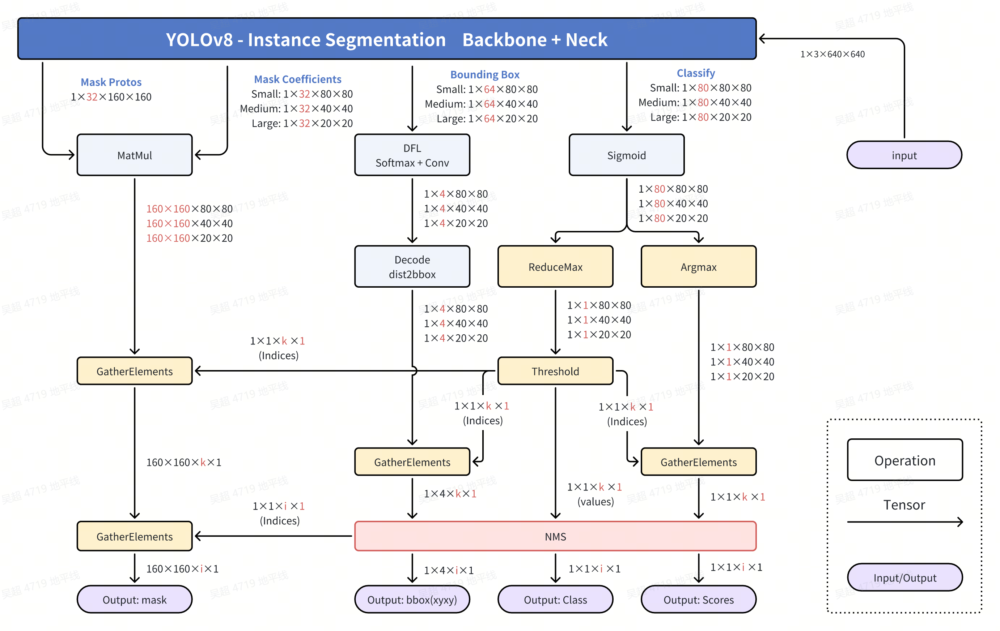

[English](./README.md) | 简体中文

# YOLOv8 Instance Segmentation
## 公版处理流程


## 优化处理流程


 - Mask Coefficients 部分, 两次GatherElements操作,
用于得到最终符合要求的Grid Cell的Mask Coefficients信息，也就是32个系数.
这32个系数与Mask Protos部分作一个线性组合，也可以认为是加权求和，就可以得到这个Grid Cell对应目标的Mask信息。

以下请参考YOLOv8 Detect部分文档
- Classify部分，Dequantize操作。
- Classify部分，ReduceMax操作。
- Classify部分，Threshold（TopK）操作。
- Classify部分，GatherElements操作和ArgMax操作。
- Bounding Box部分，GatherElements操作和Dequantize操作。
- Bounding Box部分，DFL：SoftMax+Conv操作。
- Bounding Box部分，Decode：dist2bbox(ltrb2xyxy)操作。
- nms操作。


## 步骤参考

注：任何No such file or directory, No module named "xxx", command not found.等报错请仔细检查，请勿逐条复制运行，如果对修改过程不理解请前往开发者社区从YOLOv5开始了解。
### 环境、项目准备
 - 下载ultralytics/ultralytics仓库，并参考YOLOv8官方文档，配置好环境
```bash
git clone https://github.com/ultralytics/ultralytics.git
```
 - 进入本地仓库，下载官方的预训练权重，这里以340万参数的YOLOv8n-Seg模型为例
```bash
cd ultralytics
wget https://github.com/ultralytics/assets/releases/download/v8.2.0/yolov8n-seg.pt
```

### 导出为onnx
 - 卸载yolo相关的命令行命令，这样直接修改`./ultralytics/ultralytics`目录即可生效。
```bash
$ conda list | grep ultralytics
$ pip list | grep ultralytics # 或者
# 如果存在，则卸载
$ conda uninstall ultralytics 
$ pip uninstall ultralytics   # 或者
```
 - 修改Detect的输出头，直接将三个特征层的Bounding Box信息和Classify信息分开输出，一共6个输出头。

文件目录：./ultralytics/ultralytics/nn/modules/head.py，约第51行，`Detect`类的forward方法替换成以下内容.
注：建议您保留好原本的`forward`方法，例如改一个其他的名字`forward_`, 方便在训练的时候换回来。
```python
def forward(self, x):
    bboxes = [self.cv2[i](x[i]).permute(0, 2, 3, 1).contiguous() for i in range(self.nl)]
    clses = [self.cv3[i](x[i]).permute(0, 2, 3, 1).contiguous() for i in range(self.nl)]
    return (bboxes, clses)
```

文件目录：./ultralytics/ultralytics/nn/modules/head.py，约第180行，`Segment`类的`forward`函数替换成以下内容。除了检测部分的6个头外，还有3个`32*(80*80+40*40+20*20)`掩膜系数张量输出头，和一个`32*160*160`的`基底，用于合成结果。
```python
def forward(self, x):
    p = self.proto(x[0]).permute(0, 2, 3, 1).contiguous()
    mc = [self.cv4[i](x[i]).permute(0, 2, 3, 1).contiguous() for i in range(self.nl)]
    bboxes, clses = Detect.forward(self, x)
    return (mc, bboxes, clses, p) 
```

 - 运行以下Python脚本，如果有**No module named onnxsim**报错，安装一个即可
```python
from ultralytics import YOLO
YOLO('yolov8n-seg.pt').export(imgsz=640, format='onnx', simplify=True, opset=11)
```

### PTQ方案量化转化
 - 参考天工开物工具链手册和OE包，对模型进行检查，所有算子均在BPU上，进行编译即可。对应的yaml文件在`./ptq_yamls`目录下。
```bash
(bpu_docker) $ hb_mapper checker --model-type onnx --march bayes-e --model yolov8n-seg.onnx
(bpu_docker) $ hb_mapper makertbin --model-type onnx --config yolov8_instance_seg_bayese_640x640_nchw.yaml
```

### 移除Bounding Box信息3个输出头和Mask Coefficients信息3个输出头的反量化节点
 - 查看Bounding Box信息的3个输出头的反量化节点名称
通过hb_mapper makerbin时的日志，看到大小为[1, 80, 80, 64], [1, 40, 40, 64], [1, 20, 20, 64]的三个输出的名称为379, 387, 395。
 - 查看Mask Coefficients信息的3个输出头的反量化节点名称
通过hb_mapper makerbin时的日志，看到大小为[1, 80, 80, 32], [1, 40, 40, 32], [1, 20, 20, 32]的三个输出的名称为output0, output1, 371。
```bash
ONNX IR version:          9
Opset version:            ['ai.onnx v11', 'horizon v1']
Producer:                 pytorch v2.1.1
Domain:                   None
Model version:            None
Graph input:
    images:               shape=[1, 3, 640, 640], dtype=FLOAT32
Graph output:
    output0:              shape=[1, 80, 80, 32], dtype=FLOAT32
    output1:              shape=[1, 40, 40, 32], dtype=FLOAT32
    371:                  shape=[1, 20, 20, 32], dtype=FLOAT32
    379:                  shape=[1, 80, 80, 64], dtype=FLOAT32
    387:                  shape=[1, 40, 40, 64], dtype=FLOAT32
    395:                  shape=[1, 20, 20, 64], dtype=FLOAT32
    403:                  shape=[1, 80, 80, 80], dtype=FLOAT32
    411:                  shape=[1, 40, 40, 80], dtype=FLOAT32
    419:                  shape=[1, 20, 20, 80], dtype=FLOAT32
    347:                  shape=[1, 160, 160, 32], dtype=FLOAT32
```

 - 进入编译产物的目录
```bash
$ cd yolov8n_instance_seg_bayese_640x640_nchw
```
 - 查看可以被移除的反量化节点
```bash
$ hb_model_modifier yolov8n_instance_seg_bayese_640x640_nchw.bin
```
 - 在生成的hb_model_modifier.log文件中，找到以下信息。主要是找到大小为[1, 64, 80, 80], [1, 64, 40, 40], [1, 64, 20, 20]的三个输出头和[1, 80, 80, 32], [1, 40, 40, 32], [1, 20, 20, 32]三个输出头的名称。当然，也可以通过netron等工具查看onnx模型，获得输出头的名称。
 此处的名称为：
 > "/model.22/cv4.0/cv4.0.2/Conv_output_0_HzDequantize"
 > "/model.22/cv4.1/cv4.1.2/Conv_output_0_HzDequantize"
 > "/model.22/cv4.2/cv4.2.2/Conv_output_0_HzDequantize"
 > "/model.22/cv2.0/cv2.0.2/Conv_output_0_HzDequantize"
 > "/model.22/cv2.1/cv2.1.2/Conv_output_0_HzDequantize"
 > "/model.22/cv2.2/cv2.2.2/Conv_output_0_HzDequantize"

```bash
2024-08-16 14:32:17,593 file: hb_model_modifier.py func: hb_model_modifier line No: 409 input: "/model.22/cv4.0/cv4.0.2/Conv_output_0_quantized"
input: "/model.22/cv4.0/cv4.0.2/Conv_x_scale"
output: "output0"
name: "/model.22/cv4.0/cv4.0.2/Conv_output_0_HzDequantize"
op_type: "Dequantize"

2024-08-16 14:32:17,594 file: hb_model_modifier.py func: hb_model_modifier line No: 409 input: "/model.22/cv4.1/cv4.1.2/Conv_output_0_quantized"
input: "/model.22/cv4.1/cv4.1.2/Conv_x_scale"
output: "output1"
name: "/model.22/cv4.1/cv4.1.2/Conv_output_0_HzDequantize"
op_type: "Dequantize"

2024-08-16 14:32:17,594 file: hb_model_modifier.py func: hb_model_modifier line No: 409 input: "/model.22/cv4.2/cv4.2.2/Conv_output_0_quantized"
input: "/model.22/cv4.2/cv4.2.2/Conv_x_scale"
output: "371"
name: "/model.22/cv4.2/cv4.2.2/Conv_output_0_HzDequantize"
op_type: "Dequantize"

2024-08-16 14:32:17,594 file: hb_model_modifier.py func: hb_model_modifier line No: 409 input: "/model.22/cv2.0/cv2.0.2/Conv_output_0_quantized"
input: "/model.22/cv2.0/cv2.0.2/Conv_x_scale"
output: "379"
name: "/model.22/cv2.0/cv2.0.2/Conv_output_0_HzDequantize"
op_type: "Dequantize"

2024-08-16 14:32:17,594 file: hb_model_modifier.py func: hb_model_modifier line No: 409 input: "/model.22/cv2.1/cv2.1.2/Conv_output_0_quantized"
input: "/model.22/cv2.1/cv2.1.2/Conv_x_scale"
output: "387"
name: "/model.22/cv2.1/cv2.1.2/Conv_output_0_HzDequantize"
op_type: "Dequantize"

2024-08-16 14:32:17,594 file: hb_model_modifier.py func: hb_model_modifier line No: 409 input: "/model.22/cv2.2/cv2.2.2/Conv_output_0_quantized"
input: "/model.22/cv2.2/cv2.2.2/Conv_x_scale"
output: "395"
name: "/model.22/cv2.2/cv2.2.2/Conv_output_0_HzDequantize"
op_type: "Dequantize"
```
 - 使用以下命令移除上述三个反量化节点，注意，导出时这些名称可能不同，请仔细确认。
```bash
$ hb_model_modifier yolov8n_instance_seg_bayese_640x640_nchw.bin \
-r "/model.22/cv4.0/cv4.0.2/Conv_output_0_HzDequantize" \
-r "/model.22/cv4.1/cv4.1.2/Conv_output_0_HzDequantize" \
-r "/model.22/cv4.2/cv4.2.2/Conv_output_0_HzDequantize" \
-r "/model.22/cv2.0/cv2.0.2/Conv_output_0_HzDequantize" \
-r "/model.22/cv2.1/cv2.1.2/Conv_output_0_HzDequantize" \
-r "/model.22/cv2.2/cv2.2.2/Conv_output_0_HzDequantize"
```
 - 移除成功会显示以下日志
```bash
2024-08-16 14:45:18,923 INFO log will be stored in /open_explorer/yolov8n_instance_seg_bayese_640x640_nchw/hb_model_modifier.log
2024-08-16 14:45:18,929 INFO Nodes that will be removed from this model: ['/model.22/cv4.0/cv4.0.2/Conv_output_0_HzDequantize', '/model.22/cv4.1/cv4.1.2/Conv_output_0_HzDequantize', '/model.22/cv4.2/cv4.2.2/Conv_output_0_HzDequantize', '/model.22/cv2.0/cv2.0.2/Conv_output_0_HzDequantize', '/model.22/cv2.1/cv2.1.2/Conv_output_0_HzDequantize', '/model.22/cv2.2/cv2.2.2/Conv_output_0_HzDequantize']
2024-08-16 14:45:18,929 INFO Node '/model.22/cv4.0/cv4.0.2/Conv_output_0_HzDequantize' found, its OP type is 'Dequantize'
2024-08-16 14:45:18,929 INFO scale: /model.22/cv4.0/cv4.0.2/Conv_x_scale; zero point: 0. node info details are stored in hb_model_modifier log file
2024-08-16 14:45:18,930 INFO Node '/model.22/cv4.0/cv4.0.2/Conv_output_0_HzDequantize' is removed
2024-08-16 14:45:18,930 INFO Node '/model.22/cv4.1/cv4.1.2/Conv_output_0_HzDequantize' found, its OP type is 'Dequantize'
2024-08-16 14:45:18,930 INFO scale: /model.22/cv4.1/cv4.1.2/Conv_x_scale; zero point: 0. node info details are stored in hb_model_modifier log file
2024-08-16 14:45:18,930 INFO Node '/model.22/cv4.1/cv4.1.2/Conv_output_0_HzDequantize' is removed
2024-08-16 14:45:18,930 INFO Node '/model.22/cv4.2/cv4.2.2/Conv_output_0_HzDequantize' found, its OP type is 'Dequantize'
2024-08-16 14:45:18,931 INFO scale: /model.22/cv4.2/cv4.2.2/Conv_x_scale; zero point: 0. node info details are stored in hb_model_modifier log file
2024-08-16 14:45:18,931 INFO Node '/model.22/cv4.2/cv4.2.2/Conv_output_0_HzDequantize' is removed
2024-08-16 14:45:18,931 INFO Node '/model.22/cv2.0/cv2.0.2/Conv_output_0_HzDequantize' found, its OP type is 'Dequantize'
2024-08-16 14:45:18,931 INFO scale: /model.22/cv2.0/cv2.0.2/Conv_x_scale; zero point: 0. node info details are stored in hb_model_modifier log file
2024-08-16 14:45:18,931 INFO Node '/model.22/cv2.0/cv2.0.2/Conv_output_0_HzDequantize' is removed
2024-08-16 14:45:18,932 INFO Node '/model.22/cv2.1/cv2.1.2/Conv_output_0_HzDequantize' found, its OP type is 'Dequantize'
2024-08-16 14:45:18,932 INFO scale: /model.22/cv2.1/cv2.1.2/Conv_x_scale; zero point: 0. node info details are stored in hb_model_modifier log file
2024-08-16 14:45:18,932 INFO Node '/model.22/cv2.1/cv2.1.2/Conv_output_0_HzDequantize' is removed
2024-08-16 14:45:18,932 INFO Node '/model.22/cv2.2/cv2.2.2/Conv_output_0_HzDequantize' found, its OP type is 'Dequantize'
2024-08-16 14:45:18,932 INFO scale: /model.22/cv2.2/cv2.2.2/Conv_x_scale; zero point: 0. node info details are stored in hb_model_modifier log file
2024-08-16 14:45:18,933 INFO Node '/model.22/cv2.2/cv2.2.2/Conv_output_0_HzDequantize' is removed
2024-08-16 14:45:18,936 INFO modified model saved as yolov8n_instance_seg_bayese_640x640_nchw_modified.bin
```

 - 接下来得到的bin模型名称为yolov8n_instance_seg_bayese_640x640_nchw_modified.bin, 这个是最终的模型。
 - NCHW输入的模型可以使用OpenCV和numpy来准备输入数据。
 - nv12输入的模型可以使用codec, jpu, vpu, gpu等硬件设备来准备输入数据，或者直接给TROS对应的功能包使用。


### 部分编译日志参考
```bash
2024-08-16 14:14:00,022 file: build.py func: build line No: 36 Start to Horizon NN Model Convert.
2024-08-16 14:14:00,023 file: model_debug.py func: model_debug line No: 61 Loading horizon_nn debug methods:[]
2024-08-16 14:14:00,023 file: cali_dict_parser.py func: cali_dict_parser line No: 40 Parsing the calibration parameter
2024-08-16 14:14:00,023 file: build.py func: build line No: 146 The specified model compilation architecture: bayes-e.
2024-08-16 14:14:00,023 file: build.py func: build line No: 148 The specified model compilation optimization parameters: [].
2024-08-16 14:14:00,046 file: build.py func: build line No: 36 Start to prepare the onnx model.
2024-08-16 14:14:00,047 file: utils.py func: utils line No: 53 Input ONNX Model Information:
ONNX IR version:          9
Opset version:            ['ai.onnx v11', 'horizon v1']
Producer:                 pytorch v2.1.1
Domain:                   None
Model version:            None
Graph input:
    images:               shape=[1, 3, 640, 640], dtype=FLOAT32
Graph output:
    output0:              shape=[1, 80, 80, 32], dtype=FLOAT32
    output1:              shape=[1, 40, 40, 32], dtype=FLOAT32
    371:                  shape=[1, 20, 20, 32], dtype=FLOAT32
    379:                  shape=[1, 80, 80, 64], dtype=FLOAT32
    387:                  shape=[1, 40, 40, 64], dtype=FLOAT32
    395:                  shape=[1, 20, 20, 64], dtype=FLOAT32
    403:                  shape=[1, 80, 80, 80], dtype=FLOAT32
    411:                  shape=[1, 40, 40, 80], dtype=FLOAT32
    419:                  shape=[1, 20, 20, 80], dtype=FLOAT32
    347:                  shape=[1, 160, 160, 32], dtype=FLOAT32
2024-08-16 14:14:00,230 file: build.py func: build line No: 39 End to prepare the onnx model.
2024-08-16 14:14:00,471 file: build.py func: build line No: 186 Saving model: yolov8n_instance_seg_bayese_640x640_nchw_original_float_model.onnx.
2024-08-16 14:14:00,472 file: build.py func: build line No: 36 Start to optimize the model.
2024-08-16 14:14:00,742 file: build.py func: build line No: 39 End to optimize the model.
2024-08-16 14:14:00,755 file: build.py func: build line No: 186 Saving model: yolov8n_instance_seg_bayese_640x640_nchw_optimized_float_model.onnx.
2024-08-16 14:14:00,755 file: build.py func: build line No: 36 Start to calibrate the model.
2024-08-16 14:14:01,026 file: calibration_data_set.py func: calibration_data_set line No: 82 input name: images,  number_of_samples: 50
2024-08-16 14:14:01,026 file: calibration_data_set.py func: calibration_data_set line No: 93 There are 50 samples in the calibration data set.
2024-08-16 14:14:01,034 file: default_calibrater.py func: default_calibrater line No: 122 Run calibration model with default calibration method.
2024-08-16 14:14:02,347 file: calibrater.py func: calibrater line No: 235 Calibration using batch 8
2024-08-16 14:15:05,577 file: calibrater.py func: calibrater line No: 235 Calibration using batch 8
2024-08-16 14:15:18,218 file: calibrater.py func: calibrater line No: 235 Calibration using batch 8
2024-08-16 14:15:54,739 file: default_calibrater.py func: default_calibrater line No: 211 Select kl:num_bins=1024 method.
2024-08-16 14:15:58,749 file: build.py func: build line No: 39 End to calibrate the model.
2024-08-16 14:15:58,775 file: build.py func: build line No: 186 Saving model: yolov8n_instance_seg_bayese_640x640_nchw_calibrated_model.onnx.
2024-08-16 14:15:58,775 file: build.py func: build line No: 36 Start to quantize the model.
2024-08-16 14:15:59,721 file: build.py func: build line No: 39 End to quantize the model.
2024-08-16 14:15:59,825 file: build.py func: build line No: 186 Saving model: yolov8n_instance_seg_bayese_640x640_nchw_quantized_model.onnx.
2024-08-16 14:16:00,120 file: build.py func: build line No: 36 Start to compile the model with march bayes-e.
2024-08-16 14:16:00,278 file: hybrid_build.py func: hybrid_build line No: 133 Compile submodel: main_graph_subgraph_0
2024-08-16 14:16:00,477 file: hbdk_cc.py func: hbdk_cc line No: 115 hbdk-cc parameters:['--O3', '--core-num', '1', '--fast', '--input-layout', 'NHWC', '--output-layout', 'NHWC', '--input-source', 'ddr']
2024-08-16 14:16:00,478 file: hbdk_cc.py func: hbdk_cc line No: 116 hbdk-cc command used:hbdk-cc -f hbir -m /tmp/tmpcxr_kxb1/main_graph_subgraph_0.hbir -o /tmp/tmpcxr_kxb1/main_graph_subgraph_0.hbm --march bayes-e --progressbar --O3 --core-num 1 --fast --input-layout NHWC --output-layout NHWC --input-source ddr
2024-08-16 14:16:00,478 file: tool_utils.py func: tool_utils line No: 317 Can not find the scale for node HZ_PREPROCESS_FOR_images_NCHW2NHWC_LayoutConvert_Input0
2024-08-16 14:18:48,605 file: tool_utils.py func: tool_utils line No: 322 consumed time 168.103
2024-08-16 14:18:48,702 file: tool_utils.py func: tool_utils line No: 322 FPS=188.82, latency = 5296.0 us, DDR = 25174368 bytes   (see main_graph_subgraph_0.html)
2024-08-16 14:18:48,782 file: build.py func: build line No: 39 End to compile the model with march bayes-e.
2024-08-16 14:18:48,807 file: print_node_info.py func: print_node_info line No: 57 The converted model node information:
==================================================================================================================================
Node                                                ON   Subgraph  Type           Cosine Similarity  Threshold   In/Out DataType  
----------------------------------------------------------------------------------------------------------------------------------
HZ_PREPROCESS_FOR_images                            BPU  id(0)     HzPreprocess   0.999779           127.000000  int8/int8        
/model.0/conv/Conv                                  BPU  id(0)     Conv           0.999641           0.995605    int8/int8        
/model.0/act/Mul                                    BPU  id(0)     HzSwish        0.989701           22.810610   int8/int8        
/model.1/conv/Conv                                  BPU  id(0)     Conv           0.972192           9.151398    int8/int8        
/model.1/act/Mul                                    BPU  id(0)     HzSwish        0.972105           26.311205   int8/int8        
/model.2/cv1/conv/Conv                              BPU  id(0)     Conv           0.976181           25.371887   int8/int8        
/model.2/cv1/act/Mul                                BPU  id(0)     HzSwish        0.985506           19.969627   int8/int8        
/model.2/Split                                      BPU  id(0)     Split          0.995095           7.959165    int8/int8        
/model.2/m.0/cv1/conv/Conv                          BPU  id(0)     Conv           0.982515           7.959165    int8/int8        
/model.2/m.0/cv1/act/Mul                            BPU  id(0)     HzSwish        0.986101           8.674012    int8/int8        
/model.2/m.0/cv2/conv/Conv                          BPU  id(0)     Conv           0.973077           8.419121    int8/int8        
/model.2/m.0/cv2/act/Mul                            BPU  id(0)     HzSwish        0.975514           12.190964   int8/int8        
UNIT_CONV_FOR_/model.2/m.0/Add                      BPU  id(0)     Conv           0.995095           7.959165    int8/int8        
/model.2/Split_output_0_calibrated_Requantize       BPU  id(0)     HzRequantize                                  int8/int8        
/model.2/Split_output_1_calibrated_Requantize       BPU  id(0)     HzRequantize                                  int8/int8        
/model.2/Concat                                     BPU  id(0)     Concat         0.987132           7.959165    int8/int8        
/model.2/cv2/conv/Conv                              BPU  id(0)     Conv           0.983192           14.770185   int8/int8        
/model.2/cv2/act/Mul                                BPU  id(0)     HzSwish        0.993170           9.126329    int8/int8        
/model.3/conv/Conv                                  BPU  id(0)     Conv           0.990073           5.923653    int8/int8        
/model.3/act/Mul                                    BPU  id(0)     HzSwish        0.992970           5.024549    int8/int8        
/model.4/cv1/conv/Conv                              BPU  id(0)     Conv           0.991381           3.821646    int8/int8        
/model.4/cv1/act/Mul                                BPU  id(0)     HzSwish        0.993407           5.574259    int8/int8        
/model.4/Split                                      BPU  id(0)     Split          0.991595           4.008720    int8/int8        
/model.4/m.0/cv1/conv/Conv                          BPU  id(0)     Conv           0.986378           4.008720    int8/int8        
/model.4/m.0/cv1/act/Mul                            BPU  id(0)     HzSwish        0.981661           5.402080    int8/int8        
/model.4/m.0/cv2/conv/Conv                          BPU  id(0)     Conv           0.987953           2.452948    int8/int8        
/model.4/m.0/cv2/act/Mul                            BPU  id(0)     HzSwish        0.990003           4.680353    int8/int8        
UNIT_CONV_FOR_/model.4/m.0/Add                      BPU  id(0)     Conv           0.995746           4.008720    int8/int8        
/model.4/m.1/cv1/conv/Conv                          BPU  id(0)     Conv           0.992773           4.663066    int8/int8        
/model.4/m.1/cv1/act/Mul                            BPU  id(0)     HzSwish        0.992980           4.205463    int8/int8        
/model.4/m.1/cv2/conv/Conv                          BPU  id(0)     Conv           0.988589           2.620327    int8/int8        
/model.4/m.1/cv2/act/Mul                            BPU  id(0)     HzSwish        0.993064           6.268336    int8/int8        
UNIT_CONV_FOR_/model.4/m.1/Add                      BPU  id(0)     Conv           0.995406           4.663066    int8/int8        
/model.4/Split_output_0_calibrated_Requantize       BPU  id(0)     HzRequantize                                  int8/int8        
/model.4/Split_output_1_calibrated_Requantize       BPU  id(0)     HzRequantize                                  int8/int8        
/model.4/m.0/Add_output_0_calibrated_Requantize     BPU  id(0)     HzRequantize                                  int8/int8        
/model.4/Concat                                     BPU  id(0)     Concat         0.995022           4.008720    int8/int8        
/model.4/cv2/conv/Conv                              BPU  id(0)     Conv           0.986058           4.964625    int8/int8        
/model.4/cv2/act/Mul                                BPU  id(0)     HzSwish        0.980343           5.177021    int8/int8        
/model.5/conv/Conv                                  BPU  id(0)     Conv           0.989115           1.648952    int8/int8        
/model.5/act/Mul                                    BPU  id(0)     HzSwish        0.986823           7.388950    int8/int8        
/model.6/cv1/conv/Conv                              BPU  id(0)     Conv           0.984163           3.007172    int8/int8        
/model.6/cv1/act/Mul                                BPU  id(0)     HzSwish        0.969440           6.992102    int8/int8        
/model.6/Split                                      BPU  id(0)     Split          0.983327           1.739103    int8/int8        
/model.6/m.0/cv1/conv/Conv                          BPU  id(0)     Conv           0.988370           1.739103    int8/int8        
/model.6/m.0/cv1/act/Mul                            BPU  id(0)     HzSwish        0.964151           6.619705    int8/int8        
/model.6/m.0/cv2/conv/Conv                          BPU  id(0)     Conv           0.967682           1.325212    int8/int8        
/model.6/m.0/cv2/act/Mul                            BPU  id(0)     HzSwish        0.965522           6.451187    int8/int8        
UNIT_CONV_FOR_/model.6/m.0/Add                      BPU  id(0)     Conv           0.983327           1.739103    int8/int8        
/model.6/m.1/cv1/conv/Conv                          BPU  id(0)     Conv           0.985118           4.035169    int8/int8        
/model.6/m.1/cv1/act/Mul                            BPU  id(0)     HzSwish        0.972546           6.828810    int8/int8        
/model.6/m.1/cv2/conv/Conv                          BPU  id(0)     Conv           0.978115           1.925712    int8/int8        
/model.6/m.1/cv2/act/Mul                            BPU  id(0)     HzSwish        0.979919           10.571894   int8/int8        
UNIT_CONV_FOR_/model.6/m.1/Add                      BPU  id(0)     Conv           0.976397           4.035169    int8/int8        
/model.6/Split_output_0_calibrated_Requantize       BPU  id(0)     HzRequantize                                  int8/int8        
/model.6/Split_output_1_calibrated_Requantize       BPU  id(0)     HzRequantize                                  int8/int8        
/model.6/m.0/Add_output_0_calibrated_Requantize     BPU  id(0)     HzRequantize                                  int8/int8        
/model.6/Concat                                     BPU  id(0)     Concat         0.979384           1.739103    int8/int8        
/model.6/cv2/conv/Conv                              BPU  id(0)     Conv           0.985567           3.777670    int8/int8        
/model.6/cv2/act/Mul                                BPU  id(0)     HzSwish        0.968548           7.449065    int8/int8        
/model.7/conv/Conv                                  BPU  id(0)     Conv           0.981500           1.436547    int8/int8        
/model.7/act/Mul                                    BPU  id(0)     HzSwish        0.954764           7.771261    int8/int8        
/model.8/cv1/conv/Conv                              BPU  id(0)     Conv           0.972024           2.540126    int8/int8        
/model.8/cv1/act/Mul                                BPU  id(0)     HzSwish        0.946683           9.435396    int8/int8        
/model.8/Split                                      BPU  id(0)     Split          0.944037           3.152479    int8/int8        
/model.8/m.0/cv1/conv/Conv                          BPU  id(0)     Conv           0.964745           3.152479    int8/int8        
/model.8/m.0/cv1/act/Mul                            BPU  id(0)     HzSwish        0.935775           8.760098    int8/int8        
/model.8/m.0/cv2/conv/Conv                          BPU  id(0)     Conv           0.945278           3.625072    int8/int8        
/model.8/m.0/cv2/act/Mul                            BPU  id(0)     HzSwish        0.936085           13.827316   int8/int8        
UNIT_CONV_FOR_/model.8/m.0/Add                      BPU  id(0)     Conv           0.953098           3.152479    int8/int8        
/model.8/Concat                                     BPU  id(0)     Concat         0.934154           3.152479    int8/int8        
/model.8/cv2/conv/Conv                              BPU  id(0)     Conv           0.948634           3.152479    int8/int8        
/model.8/cv2/act/Mul                                BPU  id(0)     HzSwish        0.921557           11.313808   int8/int8        
/model.9/cv1/conv/Conv                              BPU  id(0)     Conv           0.973669           3.151532    int8/int8        
/model.9/cv1/act/Mul                                BPU  id(0)     HzSwish        0.976808           6.803682    int8/int8        
/model.9/m/MaxPool                                  BPU  id(0)     MaxPool        0.991139           7.846062    int8/int8        
/model.9/m_1/MaxPool                                BPU  id(0)     MaxPool        0.993349           7.846062    int8/int8        
/model.9/m_2/MaxPool                                BPU  id(0)     MaxPool        0.993786           7.846062    int8/int8        
/model.9/Concat                                     BPU  id(0)     Concat         0.991218           7.846062    int8/int8        
/model.9/cv2/conv/Conv                              BPU  id(0)     Conv           0.979349           7.846062    int8/int8        
/model.9/cv2/act/Mul                                BPU  id(0)     HzSwish        0.897185           9.506282    int8/int8        
/model.10/Resize                                    BPU  id(0)     Resize         0.897175           2.125477    int8/int8        
/model.10/Resize_output_0_calibrated_Requantize     BPU  id(0)     HzRequantize                                  int8/int8        
...el.6/cv2/act/Mul_output_0_calibrated_Requantize  BPU  id(0)     HzRequantize                                  int8/int8        
/model.11/Concat                                    BPU  id(0)     Concat         0.918529           2.125477    int8/int8        
/model.12/cv1/conv/Conv                             BPU  id(0)     Conv           0.949666           2.015612    int8/int8        
/model.12/cv1/act/Mul                               BPU  id(0)     HzSwish        0.946858           8.101270    int8/int8        
/model.12/Split                                     BPU  id(0)     Split          0.970928           2.633660    int8/int8        
/model.12/m.0/cv1/conv/Conv                         BPU  id(0)     Conv           0.971128           2.633660    int8/int8        
/model.12/m.0/cv1/act/Mul                           BPU  id(0)     HzSwish        0.957243           7.655683    int8/int8        
/model.12/m.0/cv2/conv/Conv                         BPU  id(0)     Conv           0.957100           2.152981    int8/int8        
/model.12/m.0/cv2/act/Mul                           BPU  id(0)     HzSwish        0.969479           7.765214    int8/int8        
/model.12/Split_output_0_calibrated_Requantize      BPU  id(0)     HzRequantize                                  int8/int8        
/model.12/Split_output_1_calibrated_Requantize      BPU  id(0)     HzRequantize                                  int8/int8        
/model.12/Concat                                    BPU  id(0)     Concat         0.955293           2.633660    int8/int8        
/model.12/cv2/conv/Conv                             BPU  id(0)     Conv           0.945614           2.655962    int8/int8        
/model.12/cv2/act/Mul                               BPU  id(0)     HzSwish        0.953800           8.277517    int8/int8        
/model.13/Resize                                    BPU  id(0)     Resize         0.953802           3.692319    int8/int8        
/model.13/Resize_output_0_calibrated_Requantize     BPU  id(0)     HzRequantize                                  int8/int8        
...el.4/cv2/act/Mul_output_0_calibrated_Requantize  BPU  id(0)     HzRequantize                                  int8/int8        
/model.14/Concat                                    BPU  id(0)     Concat         0.961886           3.692319    int8/int8        
/model.15/cv1/conv/Conv                             BPU  id(0)     Conv           0.987480           2.488732    int8/int8        
/model.15/cv1/act/Mul                               BPU  id(0)     HzSwish        0.991672           5.461772    int8/int8        
/model.15/Split                                     BPU  id(0)     Split          0.992359           2.657087    int8/int8        
/model.15/m.0/cv1/conv/Conv                         BPU  id(0)     Conv           0.984787           2.657087    int8/int8        
/model.15/m.0/cv1/act/Mul                           BPU  id(0)     HzSwish        0.980956           7.162855    int8/int8        
/model.15/m.0/cv2/conv/Conv                         BPU  id(0)     Conv           0.980173           3.073536    int8/int8        
/model.15/m.0/cv2/act/Mul                           BPU  id(0)     HzSwish        0.986537           6.183841    int8/int8        
/model.15/Split_output_0_calibrated_Requantize      BPU  id(0)     HzRequantize                                  int8/int8        
/model.15/Split_output_1_calibrated_Requantize      BPU  id(0)     HzRequantize                                  int8/int8        
/model.15/Concat                                    BPU  id(0)     Concat         0.990079           2.657087    int8/int8        
/model.15/cv2/conv/Conv                             BPU  id(0)     Conv           0.984204           3.450227    int8/int8        
/model.15/cv2/act/Mul                               BPU  id(0)     HzSwish        0.987080           6.789716    int8/int8        
/model.16/conv/Conv                                 BPU  id(0)     Conv           0.962443           3.019450    int8/int8        
/model.22/proto/cv1/conv/Conv                       BPU  id(0)     Conv           0.974608           3.019450    int8/int8        
/model.22/cv4.0/cv4.0.0/conv/Conv                   BPU  id(0)     Conv           0.954863           3.019450    int8/int8        
/model.22/cv2.0/cv2.0.0/conv/Conv                   BPU  id(0)     Conv           0.978980           3.019450    int8/int8        
/model.22/cv3.0/cv3.0.0/conv/Conv                   BPU  id(0)     Conv           0.981073           3.019450    int8/int8        
/model.16/act/Mul                                   BPU  id(0)     HzSwish        0.942932           6.815027    int8/int8        
/model.22/proto/cv1/act/Mul                         BPU  id(0)     HzSwish        0.972202           5.596385    int8/int8        
/model.22/cv4.0/cv4.0.0/act/Mul                     BPU  id(0)     HzSwish        0.949757           6.009086    int8/int8        
/model.22/cv2.0/cv2.0.0/act/Mul                     BPU  id(0)     HzSwish        0.963524           7.337032    int8/int8        
/model.22/cv3.0/cv3.0.0/act/Mul                     BPU  id(0)     HzSwish        0.964152           8.370398    int8/int8        
/model.17/Concat                                    BPU  id(0)     Concat         0.951013           3.692319    int8/int8        
/model.22/proto/upsample/ConvTranspose              BPU  id(0)     ConvTranspose  0.986767           3.132451    int8/int8        
/model.22/cv4.0/cv4.0.1/conv/Conv                   BPU  id(0)     Conv           0.942498           1.826732    int8/int8        
/model.22/cv2.0/cv2.0.1/conv/Conv                   BPU  id(0)     Conv           0.937604           1.274294    int8/int8        
/model.22/cv3.0/cv3.0.1/conv/Conv                   BPU  id(0)     Conv           0.959002           1.971141    int8/int8        
/model.18/cv1/conv/Conv                             BPU  id(0)     Conv           0.954544           3.692319    int8/int8        
/model.22/proto/cv2/conv/Conv                       BPU  id(0)     Conv           0.985993           0.401985    int8/int8        
/model.22/cv4.0/cv4.0.1/act/Mul                     BPU  id(0)     HzSwish        0.953290           7.191059    int8/int8        
/model.22/cv2.0/cv2.0.1/act/Mul                     BPU  id(0)     HzSwish        0.942362           28.006041   int8/int8        
/model.22/cv3.0/cv3.0.1/act/Mul                     BPU  id(0)     HzSwish        0.970100           35.614365   int8/int8        
/model.18/cv1/act/Mul                               BPU  id(0)     HzSwish        0.949186           6.821432    int8/int8        
/model.22/proto/cv2/act/Mul                         BPU  id(0)     HzSwish        0.982941           5.515483    int8/int8        
/model.22/cv4.0/cv4.0.2/Conv                        BPU  id(0)     Conv           0.970855           5.927373    int8/int32       
/model.22/cv2.0/cv2.0.2/Conv                        BPU  id(0)     Conv           0.984537           44.928654   int8/int32       
/model.22/cv3.0/cv3.0.2/Conv                        BPU  id(0)     Conv           0.999475           11.418165   int8/int32       
/model.18/Split                                     BPU  id(0)     Split          0.957854           1.823525    int8/int8        
/model.22/proto/cv3/conv/Conv                       BPU  id(0)     Conv           0.955678           0.552066    int8/int16       
/model.18/m.0/cv1/conv/Conv                         BPU  id(0)     Conv           0.968385           1.823525    int8/int8        
/model.22/proto/cv3/act/Mul                         BPU  id(0)     HzSwish        0.961348           7.294638    int16/int16      
/model.18/m.0/cv1/act/Mul                           BPU  id(0)     HzSwish        0.961402           6.771519    int8/int8        
/model.18/m.0/cv2/conv/Conv                         BPU  id(0)     Conv           0.936460           2.046028    int8/int8        
/model.18/m.0/cv2/act/Mul                           BPU  id(0)     HzSwish        0.933734           10.005683   int8/int8        
/model.18/Split_output_0_calibrated_Requantize      BPU  id(0)     HzRequantize                                  int8/int8        
/model.18/Split_output_1_calibrated_Requantize      BPU  id(0)     HzRequantize                                  int8/int8        
/model.18/Concat                                    BPU  id(0)     Concat         0.941911           1.823525    int8/int8        
/model.18/cv2/conv/Conv                             BPU  id(0)     Conv           0.964758           3.209702    int8/int8        
/model.18/cv2/act/Mul                               BPU  id(0)     HzSwish        0.956053           8.534504    int8/int8        
/model.19/conv/Conv                                 BPU  id(0)     Conv           0.937904           1.909663    int8/int8        
/model.22/cv4.1/cv4.1.0/conv/Conv                   BPU  id(0)     Conv           0.950913           1.909663    int8/int8        
/model.22/cv2.1/cv2.1.0/conv/Conv                   BPU  id(0)     Conv           0.949635           1.909663    int8/int8        
/model.22/cv3.1/cv3.1.0/conv/Conv                   BPU  id(0)     Conv           0.953869           1.909663    int8/int8        
/model.19/act/Mul                                   BPU  id(0)     HzSwish        0.899583           8.396005    int8/int8        
/model.22/cv4.1/cv4.1.0/act/Mul                     BPU  id(0)     HzSwish        0.939736           6.342734    int8/int8        
/model.22/cv2.1/cv2.1.0/act/Mul                     BPU  id(0)     HzSwish        0.909527           11.879086   int8/int8        
/model.22/cv3.1/cv3.1.0/act/Mul                     BPU  id(0)     HzSwish        0.935315           9.987036    int8/int8        
/model.20/Concat                                    BPU  id(0)     Concat         0.897680           2.125477    int8/int8        
/model.22/cv4.1/cv4.1.1/conv/Conv                   BPU  id(0)     Conv           0.933450           2.494075    int8/int8        
/model.22/cv2.1/cv2.1.1/conv/Conv                   BPU  id(0)     Conv           0.892864           4.399797    int8/int8        
/model.22/cv3.1/cv3.1.1/conv/Conv                   BPU  id(0)     Conv           0.928013           3.700009    int8/int8        
/model.21/cv1/conv/Conv                             BPU  id(0)     Conv           0.922094           2.125477    int8/int8        
/model.22/cv4.1/cv4.1.1/act/Mul                     BPU  id(0)     HzSwish        0.923892           7.927379    int8/int8        
/model.22/cv2.1/cv2.1.1/act/Mul                     BPU  id(0)     HzSwish        0.890919           35.873985   int8/int8        
/model.22/cv3.1/cv3.1.1/act/Mul                     BPU  id(0)     HzSwish        0.947798           41.267296   int8/int8        
/model.21/cv1/act/Mul                               BPU  id(0)     HzSwish        0.899576           9.383277    int8/int8        
/model.22/cv4.1/cv4.1.2/Conv                        BPU  id(0)     Conv           0.965445           6.183768    int8/int32       
/model.22/cv2.1/cv2.1.2/Conv                        BPU  id(0)     Conv           0.976339           14.197179   int8/int32       
/model.22/cv3.1/cv3.1.2/Conv                        BPU  id(0)     Conv           0.998825           30.421883   int8/int32       
/model.21/Split                                     BPU  id(0)     Split          0.931002           2.960426    int8/int8        
/model.21/m.0/cv1/conv/Conv                         BPU  id(0)     Conv           0.949687           2.960426    int8/int8        
/model.21/m.0/cv1/act/Mul                           BPU  id(0)     HzSwish        0.924768           8.884334    int8/int8        
/model.21/m.0/cv2/conv/Conv                         BPU  id(0)     Conv           0.910429           2.125426    int8/int8        
/model.21/m.0/cv2/act/Mul                           BPU  id(0)     HzSwish        0.873477           10.461245   int8/int8        
/model.21/Split_output_0_calibrated_Requantize      BPU  id(0)     HzRequantize                                  int8/int8        
/model.21/Split_output_1_calibrated_Requantize      BPU  id(0)     HzRequantize                                  int8/int8        
/model.21/Concat                                    BPU  id(0)     Concat         0.888471           2.960426    int8/int8        
/model.21/cv2/conv/Conv                             BPU  id(0)     Conv           0.941732           3.847535    int8/int8        
/model.21/cv2/act/Mul                               BPU  id(0)     HzSwish        0.877449           16.453327   int8/int8        
/model.22/cv4.2/cv4.2.0/conv/Conv                   BPU  id(0)     Conv           0.902531           2.343095    int8/int8        
/model.22/cv2.2/cv2.2.0/conv/Conv                   BPU  id(0)     Conv           0.893761           2.343095    int8/int8        
/model.22/cv3.2/cv3.2.0/conv/Conv                   BPU  id(0)     Conv           0.896570           2.343095    int8/int8        
/model.22/cv4.2/cv4.2.0/act/Mul                     BPU  id(0)     HzSwish        0.918133           7.241290    int8/int8        
/model.22/cv2.2/cv2.2.0/act/Mul                     BPU  id(0)     HzSwish        0.878701           13.317915   int8/int8        
/model.22/cv3.2/cv3.2.0/act/Mul                     BPU  id(0)     HzSwish        0.881848           12.449150   int8/int8        
/model.22/cv4.2/cv4.2.1/conv/Conv                   BPU  id(0)     Conv           0.915845           3.366743    int8/int8        
/model.22/cv2.2/cv2.2.1/conv/Conv                   BPU  id(0)     Conv           0.867985           4.329203    int8/int8        
/model.22/cv3.2/cv3.2.1/conv/Conv                   BPU  id(0)     Conv           0.858073           7.521426    int8/int8        
/model.22/cv4.2/cv4.2.1/act/Mul                     BPU  id(0)     HzSwish        0.890156           9.154864    int8/int8        
/model.22/cv2.2/cv2.2.1/act/Mul                     BPU  id(0)     HzSwish        0.889582           39.768051   int8/int8        
/model.22/cv3.2/cv3.2.1/act/Mul                     BPU  id(0)     HzSwish        0.912551           37.483601   int8/int8        
/model.22/cv4.2/cv4.2.2/Conv                        BPU  id(0)     Conv           0.949460           5.405931    int8/int32       
/model.22/cv2.2/cv2.2.2/Conv                        BPU  id(0)     Conv           0.960124           24.789207   int8/int32       
/model.22/cv3.2/cv3.2.2/Conv                        BPU  id(0)     Conv           0.998110           13.536564   int8/int32
```


## 模型训练

 - 模型训练请参考ultralytics官方文档，这个文档由ultralytics维护，质量非常的高。网络上也有非常多的参考材料，得到一个像官方一样的预训练权重的模型并不困难。
 - 请注意，训练时无需修改任何程序，无需修改forward方法。

## 性能数据

RDK X5 & RDK X5 Module
实例分割 Instance Segmentation (COCO)
| 模型 | 尺寸(像素) | 类别数 | 参数量(M) | 浮点精度(box/mask) | 量化精度(box/mask) | 延迟/吞吐量(单线程) | 延迟/吞吐量(多线程) |
|---------|---------|-------|---------|---------|----------|--------------------|--------------------|
| YOLOv8n-seg | 640×640 | 80 | 3.4  | 36.7/30.5 |  |  |
| YOLOv8s-seg | 640×640 | 80 | 11.8 | 44.6/36.8 |  |  |
| YOLOv8m-seg | 640×640 | 80 | 27.3 | 49.9/40.8 |  |  |
| YOLOv8l-seg | 640×640 | 80 | 46.0 | 52.3/42.6 |  |  |
| YOLOv8x-seg | 640×640 | 80 | 71.8 | 53.4/43.4 |  |  |


说明: 
1. X5的状态为最佳状态：CPU为8×A55@1.8G, 全核心Performance调度, BPU为1×Bayes-e@1G, 共10TOPS等效int8算力。
2. 单线程延迟为单帧，单线程，单BPU核心的延迟，BPU推理一个任务最理想的情况。
3. 4线程工程帧率为4个线程同时向双核心BPU塞任务，一般工程中4个线程可以控制单帧延迟较小，同时吃满两个BPU到100%，在吞吐量(FPS)和帧延迟间得到一个较好的平衡。
4. 8线程极限帧率为8个线程同时向X3的双核心BPU塞任务，目的是为了测试BPU的极限性能，一般来说4核心已经占满，如果8线程比4线程还要好很多，说明模型结构需要提高"计算/访存"比，或者编译时选择优化DDR带宽。
5. 浮点/定点mAP：50-95精度使用pycocotools计算，来自于COCO数据集，可以参考微软的论文，此处用于评估板端部署的精度下降程度。