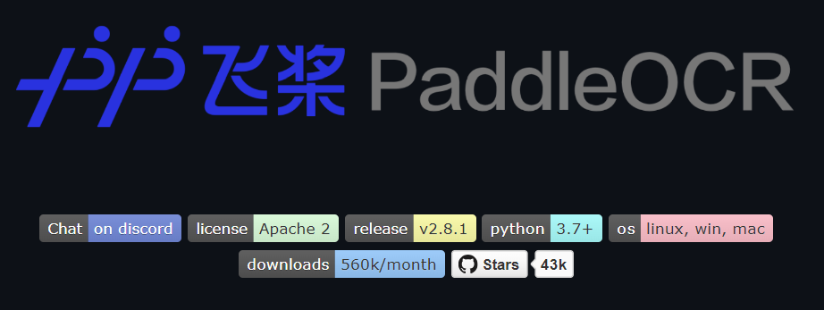

English | [简体中文](./README_cn.md) | [日本語](./READMD_jp.md)

# PaddleOCR text recognition

- [PaddleOCR text recognition](#paddleocr-text-recognition)
  - [1. Introduction to PaddleOCR](#1-introduction-to-paddleocr)
  - [2. Performance data](#2-performance-data)
  - [3. Model download link](#3-model-download-link)
  - [4. Deploy tests](#4-deploy-tests)


## 1. Introduction to PaddleOCR

PaddleOCR is Baidu PaddlePaddle's Optical Character Recognition (OCR) tool based on Deep learning. It uses the PaddlePaddle framework to perform text recognition tasks in images. The repository converts text in images into editable text through multiple stages such as image preprocessing, text detection, and text recognition. PaddleOCR supports recognition of multiple languages and fonts, suitable for text extraction tasks in various complex scenarios. PaddleOCR also supports custom training, allowing users to prepare training data according to specific needs to further optimize model performance.

In practical applications, the workflow of PaddleOCR includes the following steps:

- **Image preprocessing**: denoising and resizing the input image to make it suitable for subsequent detection and recognition.
- **Text detection**: Detect text areas in images through deep learning models to generate detection boxes.
- **Text recognition**: Recognize the text content in the detection box and generate the final text result.

The examples provided in this repository are based on the cases provided by PaddleOCR official. After model transformation, model quantization, and image post-processing, the characters can be clearly recognized and the model inference results can be obtained by running the jupyter script file.

GitHub: https://github.com/PaddlePaddle/PaddleOCR




## 2. Performance data

**RDK X5 & RDK X5 Module**

Dataset ICDAR2019-ArT

| Model(public) | size(pixels) | Parameter | BPU throughput |
| ------------ | ------- | ----- | ---------- |
| PP-OCRv3_det | 640x640 | 3.8 M | 158.12 FPS |
| PP-OCRv3_rec | 48x320  | 9.6 M | 245.68 FPS |


**RDK X3 & RDK X3 Module**

Dataset ICDAR2019-ArT

| Model(public) | size(pixels) | Parameter | BPU throughput |
| ------------ | ------- | ----- | ---------- |
| PP-OCRv3_det | 640x640 | 3.8 M | 41.96 FPS |
| PP-OCRv3_rec | 48x320  | 9.6 M | 78.92 FPS |


## 3. Model download link

**.Bin file download**:

You can download all .bin model files for this model structure with one click using the script [download.sh](./model/download.sh):

```shell
wget https://archive.d-robotics.cc/downloads/rdk_model_zoo/rdk_x3/en_PP-OCRv3_det_640x640_nv12.bin
wget https://archive.d-robotics.cc/downloads/rdk_model_zoo/rdk_x3/en_PP-OCRv3_rec_48x320_rgb.bin
```


## 4. Deploy tests

After downloading the .bin file, you can execute the Python/Jupyter script file to experience the actual test effect on the board. If you need to change the test image, you can download the dataset separately, put it in the data folder, and change the path of the image in the Python/Jupyter file

