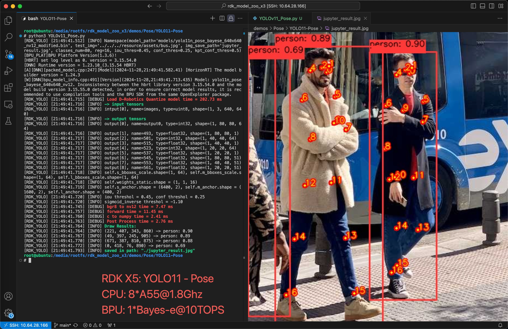
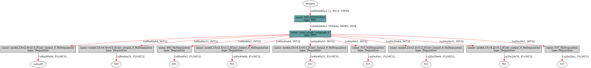
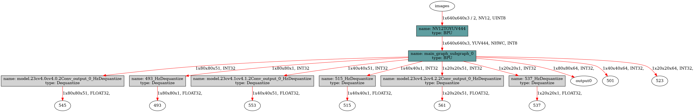

[English](./README.md) | 简体中文

# YOLOv11 Pose
- [YOLOv11 Pose](#yolov11-pose)
  - [YOLO介绍](#yolo介绍)
  - [性能数据 (简要)](#性能数据-简要)
    - [RDK X5 \& RDK X5 Module](#rdk-x5--rdk-x5-module)
  - [模型下载地址](#模型下载地址)
  - [kpt定义](#kpt定义)
  - [步骤参考](#步骤参考)
    - [环境、项目准备](#环境项目准备)
    - [导出为onnx](#导出为onnx)
    - [PTQ方案量化转化](#ptq方案量化转化)
    - [移除bbox信息3个输出头的反量化节点](#移除bbox信息3个输出头的反量化节点)
    - [使用hb\_perf命令对bin模型进行可视化, hrt\_model\_exec命令检查bin模型的输入输出情况](#使用hb_perf命令对bin模型进行可视化-hrt_model_exec命令检查bin模型的输入输出情况)
  - [部分编译日志参考](#部分编译日志参考)
  - [模型训练](#模型训练)
  - [性能数据](#性能数据)
    - [RDK X5 \& RDK X5 Module](#rdk-x5--rdk-x5-module-1)
  - [反馈](#反馈)
  - [参考](#参考)


## YOLO介绍



YOLO(You Only Look Once)是一种流行的物体检测和图像分割模型，由华盛顿大学的约瑟夫-雷德蒙（Joseph Redmon）和阿里-法哈迪（Ali Farhadi）开发。YOLO 于 2015 年推出，因其高速度和高精确度而迅速受到欢迎。

 - 2016 年发布的YOLOv2 通过纳入批量归一化、锚框和维度集群改进了原始模型。
2018 年推出的YOLOv3 使用更高效的骨干网络、多锚和空间金字塔池进一步增强了模型的性能。
 - YOLOv4于 2020 年发布，引入了 Mosaic 数据增强、新的无锚检测头和新的损失函数等创新技术。
 - YOLOv5进一步提高了模型的性能，并增加了超参数优化、集成实验跟踪和自动导出为常用导出格式等新功能。
 - YOLOv6于 2022 年由美团开源，目前已用于该公司的许多自主配送机器人。
 - YOLOv7增加了额外的任务，如 COCO 关键点数据集的姿势估计。
 - YOLOv8是YOLO 的最新版本，由Ultralytics 提供。YOLOv8 YOLOv8 支持全方位的视觉 AI 任务，包括检测、分割、姿态估计、跟踪和分类。这种多功能性使用户能够在各种应用和领域中利用YOLOv8 的功能。
 - YOLOv9 引入了可编程梯度信息(PGI) 和广义高效层聚合网络(GELAN)等创新方法。
 - YOLOv10是由清华大学的研究人员使用该软件包创建的。 UltralyticsPython 软件包创建的。该版本通过引入端到端头(End-to-End head),消除了非最大抑制(NMS)要求，实现了实时目标检测的进步。
 - YOLO11 NEW 🚀：Ultralytics的最新YOLO模型在多个任务上实现了最先进的（SOTA）性能。
  
## 性能数据 (简要)
### RDK X5 & RDK X5 Module
关键点 Pose (COCO)
| 模型(公版) | 尺寸(像素) | 类别数 | 参数量(M)/FLOPs(B) | BPU吞吐量 | 后处理时间(C/C++) |
|---------|---------|-------|---------|---------|----------|
| YOLO11n-pose | 640×640 | 1 | 2.9 M  / 7.6 B  | 159.0 FPS | 0.9 ms |
| YOLO11s-pose | 640×640 | 1 | 9.9 M  / 23.2 B | 75.9 FPS  | 0.9 ms |
| YOLO11m-pose | 640×640 | 1 | 20.9 M / 71.7 B | 33.5 FPS  | 0.9 ms |
| YOLO11l-pose | 640×640 | 1 | 26.2 M / 90.7 B | 24.8 FPS  | 0.9 ms |
| YOLO11x-pose | 640×640 | 1 | 58.8 M / 203.3 B| 11.9 FPS  | 0.9 ms |


## 模型下载地址
请参考`./model/download.md`

## kpt定义
YOLO11-Pose的关键点基于目标检测，kpt的定义参考如下
```python
COCO_keypoint_indexes = {
    0: 'nose',
    1: 'left_eye',
    2: 'right_eye',
    3: 'left_ear',
    4: 'right_ear',
    5: 'left_shoulder',
    6: 'right_shoulder',
    7: 'left_elbow',
    8: 'right_elbow',
    9: 'left_wrist',
    10: 'right_wrist',
    11: 'left_hip',
    12: 'right_hip',
    13: 'left_knee',
    14: 'right_knee',
    15: 'left_ankle',
    16: 'right_ankle'
}
```

## 步骤参考

注：任何No such file or directory, No module named "xxx", command not found.等报错请仔细检查，请勿逐条复制运行，如果对修改过程不理解请前往开发者社区从YOLOv5开始了解。
### 环境、项目准备
 - 下载ultralytics/ultralytics仓库，并参考ultralytics官方文档，配置好环境
```bash
git clone https://github.com/ultralytics/ultralytics.git
```
 - 进入本地仓库，下载官方的预训练权重，这里以290万参数的YOLO11n-Pose模型为例
```bash
cd ultralytics
wget https://github.com/ultralytics/assets/releases/download/v8.3.0/yolo11n-pose.pt
```

### 导出为onnx
 - 卸载yolo相关的命令行命令，这样直接修改`./ultralytics/ultralytics`目录即可生效。
```bash
$ conda list | grep ultralytics
$ pip list | grep ultralytics # 或者
# 如果存在，则卸载
$ conda uninstall ultralytics 
$ pip uninstall ultralytics   # 或者
```
如果不是很顺利，可以通过以下Python命令确认需要修改的`ultralytics`目录的位置:
```bash
>>> import ultralytics
>>> ultralytics.__path__
['/home/wuchao/miniconda3/envs/yolo/lib/python3.11/site-packages/ultralytics']
# 或者
['/home/wuchao/YOLO11/ultralytics_v11/ultralytics']
```

 - 修改Detect的输出头，直接将三个特征层的Bounding Box信息和Classify信息分开输出，一共6个输出头。

文件目录：./ultralytics/ultralytics/nn/modules/head.py，约第64行，`Detect`类的forward方法替换成以下内容.
注：建议您保留好原本的`forward`方法，例如改一个其他的名字`forward_`, 方便在训练的时候换回来。
```python
def forward(self, x):  # Detect
    result = []
    for i in range(self.nl):
        result.append(self.cv2[i](x[i]).permute(0, 2, 3, 1).contiguous())
        result.append(self.cv3[i](x[i]).permute(0, 2, 3, 1).contiguous())
    return result
```
文件目录：./ultralytics/ultralytics/nn/modules/head.py，约第242行，`Pose`类的forward方法替换成以下内容.
注：建议您保留好原本的`forward`方法，例如改一个其他的名字`forward_`, 方便在训练的时候换回来。
```python
def forward(self, x):
    detect_results = Detect.forward(self, x)
    kpt_results = []
    for i in range(self.nl):
        kpt_results.append(self.cv4[i](x[i]).permute(0, 2, 3, 1).contiguous())
    return (detect_results, kpt_results)
```

 - 运行以下Python脚本，如果有**No module named onnxsim**报错，安装一个即可
 - 注意，如果生成的onnx模型显示ir版本过高，可以将simplify=False。两种设置对最终bin模型没有影响，打开后可以提升onnx模型在netron中的可读性。
```python
from ultralytics import YOLO
YOLO('yolo11n-pose.pt').export(imgsz=640, format='onnx', simplify=False, opset=11)
```

### PTQ方案量化转化
 - 参考天工开物工具链手册和OE包，对模型进行检查，所有算子均在BPU上，进行编译即可。对应的yaml文件在GitHub仓库中，YOLOv11对于文件夹的`./ptq_yamls`目录下。
```bash
(bpu_docker) $ hb_mapper checker --model-type onnx --march bayes-e --model yolo11n-pose.onnx
```
 - 根据模型检查结果，找到手动量化算子Softmax, 应有这样的内容, Softmax算子将模型拆为了两个BPU子图。这里的Softmax算子名称为"/model.10/m/m.0/attn/Softmax".
```bash
/model.10/m/m.0/attn/MatMul      BPU id(0) HzSQuantizedMatmul --  1.0 int8      
/model.10/m/m.0/attn/Mul         BPU id(0) HzSQuantizedConv   --  1.0 int8      
/model.10/m/m.0/attn/Softmax     CPU --    Softmax            --  --  float     
/model.10/m/m.0/attn/Transpose_1 BPU id(1) Transpose          --  --  int8      
/model.10/m/m.0/attn/MatMul_1    BPU id(1) HzSQuantizedMatmul --  1.0 int8      

```
在对应的yaml文件中修改以下内容:
```yaml
model_parameters:
  node_info: {"/model.10/m/m.0/attn/Softmax": {'ON': 'BPU','InputType': 'int16','OutputType': 'int16'}}
```
如果是YOLOv11的l和x模型，需要指定两个SoftMax算子到BPU上
```yaml
model_parameters:
  node_info: {"/model.10/m/m.0/attn/Softmax": {'ON': 'BPU','InputType': 'int16','OutputType': 'int16'},
              "/model.10/m/m.1/attn/Softmax": {'ON': 'BPU','InputType': 'int16','OutputType': 'int16'}}
```
 
 - 模型编译:
```bash
(bpu_docker) $ hb_mapper makertbin --model-type onnx --config yolo11_pose_bayese_640x640_nv12.yaml
```

### 移除bbox信息3个输出头的反量化节点
 - 查看bbox信息的3个输出头的反量化节点名称
通过hb_mapper makerbin时的日志,看到大小为[1, 80, 80, 64], [1, 40, 40, 64], [1, 20, 20, 64] 的三个输出的名称为output0, 501, 523.
```bash
ONNX IR version:          9
Opset version:            ['ai.onnx v11', 'horizon v1']
Producer:                 pytorch v2.1.1
Domain:                   None
Version:                  None
Graph input:
    images:               shape=[1, 3, 640, 640], dtype=FLOAT32
Graph output:
    output0:              shape=[1, 80, 80, 64], dtype=FLOAT32
    493:                  shape=[1, 80, 80, 1], dtype=FLOAT32
    501:                  shape=[1, 40, 40, 64], dtype=FLOAT32
    515:                  shape=[1, 40, 40, 1], dtype=FLOAT32
    523:                  shape=[1, 20, 20, 64], dtype=FLOAT32
    537:                  shape=[1, 20, 20, 1], dtype=FLOAT32
    545:                  shape=[1, 80, 80, 51], dtype=FLOAT32
    553:                  shape=[1, 40, 40, 51], dtype=FLOAT32
    561:                  shape=[1, 20, 20, 51], dtype=FLOAT32
```

 - 进入编译产物的目录
```bash
$ cd yolo11n_pose_bayese_640x640_nv12
```
 - 查看可以被移除的反量化节点
```bash
$ hb_model_modifier yolo11n_pose_bayese_640x640_nv12.bin
```
 - 在生成的hb_model_modifier.log文件中,找到以下信息。主要是找到大小为[1, 80, 80, 64], [1, 40, 40, 64], [1, 20, 20, 64] 的三个输出头的名称。当然,也可以通过netron等工具查看onnx模型,获得输出头的名称。
 此处的名称为:
 > "/model.23/cv2.0/cv2.0.2/Conv_output_0_HzDequantize"
 > "/model.23/cv2.1/cv2.1.2/Conv_output_0_HzDequantize"
 > "/model.23/cv2.2/cv2.2.2/Conv_output_0_HzDequantize"
 

```bash
2024-11-26 19:29:29,928 file: hb_model_modifier.py func: hb_model_modifier line No: 409 input: "/model.23/cv2.0/cv2.0.2/Conv_output_0_quantized"
input: "/model.23/cv2.0/cv2.0.2/Conv_x_scale"
output: "output0"
name: "/model.23/cv2.0/cv2.0.2/Conv_output_0_HzDequantize"
op_type: "Dequantize"

2024-11-26 19:29:29,928 file: hb_model_modifier.py func: hb_model_modifier line No: 409 input: "/model.23/cv2.1/cv2.1.2/Conv_output_0_quantized"
input: "/model.23/cv2.1/cv2.1.2/Conv_x_scale"
output: "501"
name: "/model.23/cv2.1/cv2.1.2/Conv_output_0_HzDequantize"
op_type: "Dequantize"

2024-11-26 19:29:29,928 file: hb_model_modifier.py func: hb_model_modifier line No: 409 input: "/model.23/cv2.2/cv2.2.2/Conv_output_0_quantized"
input: "/model.23/cv2.2/cv2.2.2/Conv_x_scale"
output: "523"
name: "/model.23/cv2.2/cv2.2.2/Conv_output_0_HzDequantize"
op_type: "Dequantize"
```
 - 使用以下命令移除上述六个反量化节点,注意,导出时这些名称可能不同,请仔细确认。
```bash
$ hb_model_modifier yolo11n_pose_bayese_640x640_nv12.bin \
-r /model.23/cv2.0/cv2.0.2/Conv_output_0_HzDequantize \
-r /model.23/cv2.1/cv2.1.2/Conv_output_0_HzDequantize \
-r /model.23/cv2.2/cv2.2.2/Conv_output_0_HzDequantize
```
 - 移除成功会显示以下日志
```bash
2024-11-28 20:14:42,521 INFO log will be stored in /open_explorer/bin_dir/yolo11n_pose_bayese_640x640_nv12/hb_model_modifier.log
2024-11-28 20:14:42,581 INFO Nodes that will be removed from this model: ['/model.23/cv2.0/cv2.0.2/Conv_output_0_HzDequantize', '/model.23/cv2.1/cv2.1.2/Conv_output_0_HzDequantize', '/model.23/cv2.2/cv2.2.2/Conv_output_0_HzDequantize']
2024-11-28 20:14:42,581 INFO Node '/model.23/cv2.0/cv2.0.2/Conv_output_0_HzDequantize' found, its OP type is 'Dequantize'
2024-11-28 20:14:42,582 INFO scale: /model.23/cv2.0/cv2.0.2/Conv_x_scale; zero point: 0. node info details are stored in hb_model_modifier log file
2024-11-28 20:14:42,582 INFO Node '/model.23/cv2.0/cv2.0.2/Conv_output_0_HzDequantize' is removed
2024-11-28 20:14:42,582 INFO Node '/model.23/cv2.1/cv2.1.2/Conv_output_0_HzDequantize' found, its OP type is 'Dequantize'
2024-11-28 20:14:42,582 INFO scale: /model.23/cv2.1/cv2.1.2/Conv_x_scale; zero point: 0. node info details are stored in hb_model_modifier log file
2024-11-28 20:14:42,583 INFO Node '/model.23/cv2.1/cv2.1.2/Conv_output_0_HzDequantize' is removed
2024-11-28 20:14:42,583 INFO Node '/model.23/cv2.2/cv2.2.2/Conv_output_0_HzDequantize' found, its OP type is 'Dequantize'
2024-11-28 20:14:42,583 INFO scale: /model.23/cv2.2/cv2.2.2/Conv_x_scale; zero point: 0. node info details are stored in hb_model_modifier log file
2024-11-28 20:14:42,584 INFO Node '/model.23/cv2.2/cv2.2.2/Conv_output_0_HzDequantize' is removed
2024-11-28 20:14:42,587 INFO modified model saved as yolo11n_pose_bayese_640x640_nv12_modified.bin
```

 - 接下来得到的bin模型名称为yolo11n_pose_bayese_640x640_nv12_modified.bin, 这个是最终的模型。
 - NCHW输入的模型可以使用OpenCV和numpy来准备输入数据。
 - nv12输入的模型可以使用codec, jpu, vpu, gpu等硬件设备来准备输入数据，或者直接给TROS对应的功能包使用。


### 使用hb_perf命令对bin模型进行可视化, hrt_model_exec命令检查bin模型的输入输出情况

 - 移除反量化系数前的bin模型
```bash
hb_perf yolo11n_pose_bayese_640x640_nv12.bin
```
在`hb_perf_result`目录下可以找到以下结果：


```bash
hrt_model_exec model_info --model_file yolo11n_pose_bayese_640x640_nv12.bin
```
可以看到这个移除反量化系数前的bin模型的输入输出信息
```bash
[HBRT] set log level as 0. version = 3.15.55.0
[DNN] Runtime version = 1.24.5_(3.15.55 HBRT)
[A][DNN][packed_model.cpp:247][Model](2024-11-26,19:46:14.398.383) [HorizonRT] The model builder version = 1.24.3
Load model to DDR cost 72.193ms.
This model file has 1 model:
[yolo11n_pose_bayese_640x640_nv12]
---------------------------------------------------------------------
[model name]: yolo11n_pose_bayese_640x640_nv12

input[0]: 
name: images
input source: HB_DNN_INPUT_FROM_PYRAMID
valid shape: (1,3,640,640,)
aligned shape: (1,3,640,640,)
aligned byte size: 614400
tensor type: HB_DNN_IMG_TYPE_NV12
tensor layout: HB_DNN_LAYOUT_NCHW
quanti type: NONE
stride: (0,0,0,0,)

output[0]: 
name: output0
valid shape: (1,80,80,64,)
aligned shape: (1,80,80,64,)
aligned byte size: 1638400
tensor type: HB_DNN_TENSOR_TYPE_F32
tensor layout: HB_DNN_LAYOUT_NHWC
quanti type: NONE
stride: (1638400,20480,256,4,)

output[1]: 
name: 493
valid shape: (1,80,80,1,)
aligned shape: (1,80,80,1,)
aligned byte size: 25600
tensor type: HB_DNN_TENSOR_TYPE_F32
tensor layout: HB_DNN_LAYOUT_NCHW
quanti type: NONE
stride: (25600,320,4,4,)

output[2]: 
name: 501
valid shape: (1,40,40,64,)
aligned shape: (1,40,40,64,)
aligned byte size: 409600
tensor type: HB_DNN_TENSOR_TYPE_F32
tensor layout: HB_DNN_LAYOUT_NHWC
quanti type: NONE
stride: (409600,10240,256,4,)

output[3]: 
name: 515
valid shape: (1,40,40,1,)
aligned shape: (1,40,40,1,)
aligned byte size: 6400
tensor type: HB_DNN_TENSOR_TYPE_F32
tensor layout: HB_DNN_LAYOUT_NCHW
quanti type: NONE
stride: (6400,160,4,4,)

output[4]: 
name: 523
valid shape: (1,20,20,64,)
aligned shape: (1,20,20,64,)
aligned byte size: 102400
tensor type: HB_DNN_TENSOR_TYPE_F32
tensor layout: HB_DNN_LAYOUT_NHWC
quanti type: NONE
stride: (102400,5120,256,4,)

output[5]: 
name: 537
valid shape: (1,20,20,1,)
aligned shape: (1,20,20,1,)
aligned byte size: 1600
tensor type: HB_DNN_TENSOR_TYPE_F32
tensor layout: HB_DNN_LAYOUT_NCHW
quanti type: NONE
stride: (1600,80,4,4,)

output[6]: 
name: 545
valid shape: (1,80,80,51,)
aligned shape: (1,80,80,51,)
aligned byte size: 1305600
tensor type: HB_DNN_TENSOR_TYPE_F32
tensor layout: HB_DNN_LAYOUT_NHWC
quanti type: NONE
stride: (1305600,16320,204,4,)

output[7]: 
name: 553
valid shape: (1,40,40,51,)
aligned shape: (1,40,40,51,)
aligned byte size: 326400
tensor type: HB_DNN_TENSOR_TYPE_F32
tensor layout: HB_DNN_LAYOUT_NHWC
quanti type: NONE
stride: (326400,8160,204,4,)

output[8]: 
name: 561
valid shape: (1,20,20,51,)
aligned shape: (1,20,20,51,)
aligned byte size: 81600
tensor type: HB_DNN_TENSOR_TYPE_F32
tensor layout: HB_DNN_LAYOUT_NHWC
quanti type: NONE
stride: (81600,4080,204,4,)
```

 - 移除目标反量化系数后的bin模型
```bash
hb_perf yolo11n_pose_bayese_640x640_nv12_modified.bin
```
在`hb_perf_result`目录下可以找到以下结果。



```bash
hrt_model_exec model_info --model_file yolo11n_pose_bayese_640x640_nv12_modified.bin
```
可以看到这个移除反量化系数前的bin模型的输入输出信息, 以及移除反量化节点的所有反量化系数, 这也说明bin模型中是存储着这些信息的, 可以使用推理库的API获得, 方便我们进行对应的前后处理.
```bash
[HBRT] set log level as 0. version = 3.15.55.0
[DNN] Runtime version = 1.24.5_(3.15.55 HBRT)
[A][DNN][packed_model.cpp:247][Model](2024-11-28,20:15:27.943.445) [HorizonRT] The model builder version = 1.24.3
Load model to DDR cost 33.453ms.
This model file has 1 model:
[yolo11n_pose_bayese_640x640_nv12]
---------------------------------------------------------------------
[model name]: yolo11n_pose_bayese_640x640_nv12

input[0]: 
name: images
input source: HB_DNN_INPUT_FROM_PYRAMID
valid shape: (1,3,640,640,)
aligned shape: (1,3,640,640,)
aligned byte size: 614400
tensor type: HB_DNN_IMG_TYPE_NV12
tensor layout: HB_DNN_LAYOUT_NCHW
quanti type: NONE
stride: (0,0,0,0,)

output[0]: 
name: output0
valid shape: (1,80,80,64,)
aligned shape: (1,80,80,64,)
aligned byte size: 1638400
tensor type: HB_DNN_TENSOR_TYPE_S32
tensor layout: HB_DNN_LAYOUT_NHWC
quanti type: SCALE
stride: (1638400,20480,256,4,)
scale data: 0.000195859,0.000192412,0.000175646,0.000183794,0.000155355,0.000123078,0.000114695,8.58645e-05,0.000104824,0.000103413,9.11136e-05,7.42305e-05,5.78175e-05,5.32344e-05,4.90039e-05,6.51818e-05,0.000173609,0.000167342,0.000157,0.000154493,0.000163425,0.000141253,0.000188965,0.000147129,0.000161231,0.000116967,9.43256e-05,0.000107017,0.000109681,0.000110386,0.000136083,0.000193665,0.000203537,0.000206827,0.000198209,0.000168909,0.000141253,0.000120649,9.31505e-05,8.46894e-05,9.9888e-05,9.62842e-05,8.23391e-05,6.68662e-05,5.30386e-05,5.17067e-05,4.66928e-05,6.42417e-05,0.000213408,0.000168909,0.000154102,0.000144857,0.000161231,0.000191315,0.000159351,0.000133497,0.000157392,0.000147129,0.00011681,9.36989e-05,9.36989e-05,0.000105137,0.000111796,0.000151125,
quantizeAxis: 3

output[1]: 
name: 493
valid shape: (1,80,80,1,)
aligned shape: (1,80,80,1,)
aligned byte size: 25600
tensor type: HB_DNN_TENSOR_TYPE_F32
tensor layout: HB_DNN_LAYOUT_NCHW
quanti type: NONE
stride: (25600,320,4,4,)

output[2]: 
name: 501
valid shape: (1,40,40,64,)
aligned shape: (1,40,40,64,)
aligned byte size: 409600
tensor type: HB_DNN_TENSOR_TYPE_S32
tensor layout: HB_DNN_LAYOUT_NHWC
quanti type: SCALE
stride: (409600,10240,256,4,)
scale data: 0.000299691,0.000263322,0.000251198,0.000315558,0.000192366,0.00029256,0.000169724,0.000164732,0.000153768,0.000132552,0.000104027,0.000113119,0.000127917,0.000128452,0.000119627,0.000153857,0.000268135,0.000260826,0.000214294,0.000203597,0.000267957,0.000288459,0.000294342,0.000228378,0.000212511,0.000240323,0.00016491,0.000122925,0.000119627,0.000123906,0.000152698,0.000213224,0.00031538,0.00027901,0.000253338,0.000347292,0.000238006,0.000188087,0.000198427,0.000136118,0.000126312,0.000125064,0.000114457,0.000100729,9.49348e-05,8.30791e-05,6.83263e-05,9.9481e-05,0.00028115,0.000287924,0.000239254,0.00023551,0.000214829,0.000254229,0.000213046,0.000158403,0.000179084,0.000136385,9.57371e-05,0.000109376,0.000134157,0.000137544,0.000128095,0.000164019,
quantizeAxis: 3

output[3]: 
name: 515
valid shape: (1,40,40,1,)
aligned shape: (1,40,40,1,)
aligned byte size: 6400
tensor type: HB_DNN_TENSOR_TYPE_F32
tensor layout: HB_DNN_LAYOUT_NCHW
quanti type: NONE
stride: (6400,160,4,4,)

output[4]: 
name: 523
valid shape: (1,20,20,64,)
aligned shape: (1,20,20,64,)
aligned byte size: 102400
tensor type: HB_DNN_TENSOR_TYPE_S32
tensor layout: HB_DNN_LAYOUT_NHWC
quanti type: SCALE
stride: (102400,5120,256,4,)
scale data: 0.000398208,0.000393472,0.00036547,0.000308436,0.000285375,0.00030473,0.000248314,0.000255108,0.000299994,0.000254285,0.000241107,0.000195295,0.000159057,9.77503e-05,5.10628e-05,4.69963e-05,0.000399649,0.000386883,0.000350645,0.000390178,0.000368147,0.000324702,0.000372059,0.000283934,0.00037803,0.000368352,0.000322231,0.000336026,0.000214752,0.000232459,0.000273845,0.000233489,0.000380912,0.000434858,0.000415091,0.000352292,0.000311936,0.000366088,0.000367941,0.000275492,0.00028311,0.000232048,0.000216605,0.000217841,0.000191794,0.000105729,4.76655e-05,4.24408e-05,0.000481803,0.000324084,0.000379059,0.000374941,0.000364029,0.000329232,0.000310083,0.000355381,0.000364852,0.000284346,0.000261079,0.000266639,0.000209193,0.000106861,4.08966e-05,4.07422e-05,
quantizeAxis: 3

output[5]: 
name: 537
valid shape: (1,20,20,1,)
aligned shape: (1,20,20,1,)
aligned byte size: 1600
tensor type: HB_DNN_TENSOR_TYPE_F32
tensor layout: HB_DNN_LAYOUT_NCHW
quanti type: NONE
stride: (1600,80,4,4,)

output[6]: 
name: 545
valid shape: (1,80,80,51,)
aligned shape: (1,80,80,51,)
aligned byte size: 1305600
tensor type: HB_DNN_TENSOR_TYPE_F32
tensor layout: HB_DNN_LAYOUT_NHWC
quanti type: NONE
stride: (1305600,16320,204,4,)

output[7]: 
name: 553
valid shape: (1,40,40,51,)
aligned shape: (1,40,40,51,)
aligned byte size: 326400
tensor type: HB_DNN_TENSOR_TYPE_F32
tensor layout: HB_DNN_LAYOUT_NHWC
quanti type: NONE
stride: (326400,8160,204,4,)

output[8]: 
name: 561
valid shape: (1,20,20,51,)
aligned shape: (1,20,20,51,)
aligned byte size: 81600
tensor type: HB_DNN_TENSOR_TYPE_F32
tensor layout: HB_DNN_LAYOUT_NHWC
quanti type: NONE
stride: (81600,4080,204,4,)
```

## 部分编译日志参考

可以观察到, SoftMax算子已经被BPU支持, 余弦相似度保持在0.95以上, 整个bin模型只有一个BPU子图。
```bash
2024-11-26 19:16:11,884 file: model_builder.py func: model_builder line No: 35 Start to Horizon NN Model Convert.
2024-11-26 19:16:11,908 file: model_debugger.py func: model_debugger line No: 67 Loading horizon_nn debug methods:set()
2024-11-26 19:16:11,909 file: quantization_config.py func: quantization_config line No: 305 The activation calibration parameters:
    calibration_type:     kl
The input of node /model.10/m/m.0/attn/Softmax are set to : int16
The output of node /model.10/m/m.0/attn/Softmax are set to : int16
There are 1 nodes designated to run on the bpu: ['/model.10/m/m.0/attn/Softmax'].
2024-11-26 19:16:11,909 file: input_dict_parser.py func: input_dict_parser line No: 240 input images is from pyramid. Its layout is set to NHWC
2024-11-26 19:16:11,909 file: model_builder.py func: model_builder line No: 197 The specified model compilation architecture: bayes-e.
2024-11-26 19:16:11,909 file: model_builder.py func: model_builder line No: 207 The specified model compilation optimization parameters: [].
2024-11-26 19:16:11,909 file: model_builder.py func: model_builder line No: 35 Start to prepare the onnx model.
2024-11-26 19:16:11,994 file: prepare.py func: prepare line No: 106 Input ONNX Model Information:
ONNX IR version:          9
Opset version:            ['ai.onnx v11', 'horizon v1']
Producer:                 pytorch v2.1.1
Domain:                   None
Version:                  None
Graph input:
    images:               shape=[1, 3, 640, 640], dtype=FLOAT32
Graph output:
    output0:              shape=[1, 80, 80, 64], dtype=FLOAT32
    493:                  shape=[1, 80, 80, 1], dtype=FLOAT32
    501:                  shape=[1, 40, 40, 64], dtype=FLOAT32
    515:                  shape=[1, 40, 40, 1], dtype=FLOAT32
    523:                  shape=[1, 20, 20, 64], dtype=FLOAT32
    537:                  shape=[1, 20, 20, 1], dtype=FLOAT32
    545:                  shape=[1, 80, 80, 51], dtype=FLOAT32
    553:                  shape=[1, 40, 40, 51], dtype=FLOAT32
    561:                  shape=[1, 20, 20, 51], dtype=FLOAT32
2024-11-26 19:16:12,330 file: model_builder.py func: model_builder line No: 38 End to prepare the onnx model.
2024-11-26 19:16:12,366 file: model_builder.py func: model_builder line No: 265 Saving model to: yolo11n_pose_bayese_640x640_nv12_original_float_model.onnx.
2024-11-26 19:16:12,366 file: model_builder.py func: model_builder line No: 35 Start to optimize the onnx model.
2024-11-26 19:16:12,624 file: constant_folding.py func: constant_folding line No: 66 Summary info for constant_folding:
2024-11-26 19:16:12,624 file: constant_folding.py func: constant_folding line No: 67   After constant_folding, the number of nodes has changed from 327 to 327.
2024-11-26 19:16:12,624 file: constant_folding.py func: constant_folding line No: 71   After constant_folding, the number of parameters has changed from 2866485 to 2866485.
2024-11-26 19:16:12,625 file: constant_folding.py func: constant_folding line No: 76 Detailed info for constant_folding:
2024-11-26 19:16:12,625 file: constant_folding.py func: constant_folding line No: 88 
2024-11-26 19:16:13,022 file: model_builder.py func: model_builder line No: 38 End to optimize the onnx model.
2024-11-26 19:16:13,070 file: model_builder.py func: model_builder line No: 265 Saving model to: yolo11n_pose_bayese_640x640_nv12_optimized_float_model.onnx.
2024-11-26 19:16:13,070 file: model_builder.py func: model_builder line No: 35 Start to calibrate the model.
2024-11-26 19:16:13,416 file: calibration_data_set.py func: calibration_data_set line No: 111 input name: images,  number_of_samples: 50
2024-11-26 19:16:13,416 file: calibration_data_set.py func: calibration_data_set line No: 123 There are 50 samples in the data set.
2024-11-26 19:16:13,416 file: infer_thresholds.py func: infer_thresholds line No: 84 Run calibration model with kl:num_bin=1024,max_num_bin=16384 method.
2024-11-26 19:16:13,657 file: base.py func: base line No: 138 Calibration using batch 8
2024-11-26 19:16:17,241 file: ort.py func: ort line No: 207 Reset batch_size=1 and execute forward again...
2024-11-26 19:22:09,627 file: model_builder.py func: model_builder line No: 38 End to calibrate the model.
2024-11-26 19:22:09,818 file: model_builder.py func: model_builder line No: 265 Saving model to: yolo11n_pose_bayese_640x640_nv12_calibrated_model.onnx.
2024-11-26 19:22:09,819 file: model_builder.py func: model_builder line No: 35 Start to quantize the model.
2024-11-26 19:22:12,461 file: constant_folding.py func: constant_folding line No: 66 Summary info for constant_folding:
2024-11-26 19:22:12,461 file: constant_folding.py func: constant_folding line No: 67   After constant_folding, the number of nodes has changed from 273 to 273.
2024-11-26 19:22:12,462 file: constant_folding.py func: constant_folding line No: 71   After constant_folding, the number of parameters has changed from 2896423 to 2896423.
2024-11-26 19:22:12,462 file: constant_folding.py func: constant_folding line No: 76 Detailed info for constant_folding:
2024-11-26 19:22:12,462 file: constant_folding.py func: constant_folding line No: 88 
2024-11-26 19:22:12,853 file: model_builder.py func: model_builder line No: 38 End to quantize the model.
2024-11-26 19:22:12,972 file: model_builder.py func: model_builder line No: 265 Saving model to: yolo11n_pose_bayese_640x640_nv12_quantized_model.onnx.
2024-11-26 19:22:12,972 file: model_builder.py func: model_builder line No: 35 Start to compile the model with march bayes-e.
2024-11-26 19:22:13,833 file: hybrid_build.py func: hybrid_build line No: 111 Compile submodel: main_graph_subgraph_0
2024-11-26 19:22:13,861 file: hbdk_cc.py func: hbdk_cc line No: 126 hbdk-cc parameters:['--O3', '--core-num', '1', '--fast', '--input-layout', 'NHWC', '--output-layout', 'NHWC', '--input-source', 'pyramid']
2024-11-26 19:22:13,862 file: hbdk_cc.py func: hbdk_cc line No: 127 hbdk-cc command used:hbdk-cc -f hbir -m /tmp/tmpwp56kt9b/main_graph_subgraph_0.hbir -o /tmp/tmpwp56kt9b/main_graph_subgraph_0.hbm --march bayes-e --progressbar --O3 --core-num 1 --fast --input-layout NHWC --output-layout NHWC --input-source pyramid
2024-11-26 19:26:19,939 file: tool_utils.py func: tool_utils line No: 326 consumed time 246.055
2024-11-26 19:26:20,039 file: tool_utils.py func: tool_utils line No: 326 FPS=137.55, latency = 7270.3 us, DDR = 23641344 bytes   (see main_graph_subgraph_0.html)
2024-11-26 19:26:20,117 file: model_builder.py func: model_builder line No: 38 End to compile the model with march bayes-e.
2024-11-26 19:26:23,913 file: print_info_dict.py func: print_info_dict line No: 72 The main quantized node information:
======================================================================================================================================
Node                                                ON   Subgraph  Type                       Cosine Similarity  Threshold  DataType  
--------------------------------------------------------------------------------------------------------------------------------------
HZ_PREPROCESS_FOR_images                            BPU  id(0)     HzSQuantizedPreprocess     0.999772           127.0      int8      
/model.0/conv/Conv                                  BPU  id(0)     HzSQuantizedConv           0.999892           1.00547    int8      
/model.0/act/Mul                                    BPU  id(0)     HzLut                      0.996607           28.0887    int8      
/model.1/conv/Conv                                  BPU  id(0)     HzSQuantizedConv           0.974980           9.95682    int8      
/model.1/act/Mul                                    BPU  id(0)     HzLut                      0.981574           19.5322    int8      
/model.2/cv1/conv/Conv                              BPU  id(0)     HzSQuantizedConv           0.977346           19.5322    int8      
/model.2/cv1/act/Mul                                BPU  id(0)     HzLut                      0.981648           17.3067    int8      
/model.2/Split                                      BPU  id(0)     Split                      0.977037           8.13217    int8      
/model.2/m.0/cv1/conv/Conv                          BPU  id(0)     HzSQuantizedConv           0.990424           8.13217    int8      
/model.2/m.0/cv1/act/Mul                            BPU  id(0)     HzLut                      0.995952           5.20373    int8      
/model.2/m.0/cv2/conv/Conv                          BPU  id(0)     HzSQuantizedConv           0.989900           3.96329    int8      
/model.2/m.0/cv2/act/Mul                            BPU  id(0)     HzLut                      0.993156           11.3535    int8      
/model.2/m.0/Add                                    BPU  id(0)     HzSElementwiseAdd          0.992838           8.13217    int8      
/model.2/Split_output_0_calibrated_Requantize       BPU  id(0)     HzRequantize               --                 --         int8      
/model.2/Split_output_1_calibrated_Requantize       BPU  id(0)     HzRequantize               --                 --         int8      
/model.2/Concat                                     BPU  id(0)     Concat                     0.988660           8.13217    int8      
/model.2/cv2/conv/Conv                              BPU  id(0)     HzSQuantizedConv           0.974415           14.2003    int8      
/model.2/cv2/act/Mul                                BPU  id(0)     HzLut                      0.987464           15.074     int8      
/model.3/conv/Conv                                  BPU  id(0)     HzSQuantizedConv           0.988372           4.11862    int8      
/model.3/act/Mul                                    BPU  id(0)     HzLut                      0.989578           3.88789    int8      
/model.4/cv1/conv/Conv                              BPU  id(0)     HzSQuantizedConv           0.988464           2.32375    int8      
/model.4/cv1/act/Mul                                BPU  id(0)     HzLut                      0.988779           4.18396    int8      
/model.4/Split                                      BPU  id(0)     Split                      0.988644           2.34916    int8      
/model.4/m.0/cv1/conv/Conv                          BPU  id(0)     HzSQuantizedConv           0.991319           2.34916    int8      
/model.4/m.0/cv1/act/Mul                            BPU  id(0)     HzLut                      0.992916           3.37771    int8      
/model.4/m.0/cv2/conv/Conv                          BPU  id(0)     HzSQuantizedConv           0.995338           2.70948    int8      
/model.4/m.0/cv2/act/Mul                            BPU  id(0)     HzLut                      0.995270           5.06243    int8      
/model.4/m.0/Add                                    BPU  id(0)     HzSElementwiseAdd          0.996272           2.34916    int8      
/model.4/Split_output_0_calibrated_Requantize       BPU  id(0)     HzRequantize               --                 --         int8      
/model.4/Split_output_1_calibrated_Requantize       BPU  id(0)     HzRequantize               --                 --         int8      
/model.4/Concat                                     BPU  id(0)     Concat                     0.994539           2.34916    int8      
/model.4/cv2/conv/Conv                              BPU  id(0)     HzSQuantizedConv           0.992542           5.48596    int8      
/model.4/cv2/act/Mul                                BPU  id(0)     HzLut                      0.983251           5.44963    int8      
/model.5/conv/Conv                                  BPU  id(0)     HzSQuantizedConv           0.991397           2.5118     int8      
/model.5/act/Mul                                    BPU  id(0)     HzLut                      0.986851           5.98565    int8      
/model.6/cv1/conv/Conv                              BPU  id(0)     HzSQuantizedConv           0.980806           1.90898    int8      
/model.6/cv1/act/Mul                                BPU  id(0)     HzLut                      0.978386           5.9209     int8      
/model.6/Split                                      BPU  id(0)     Split                      0.978100           4.31137    int8      
/model.6/m.0/cv1/conv/Conv                          BPU  id(0)     HzSQuantizedConv           0.990185           4.31137    int8      
/model.6/m.0/cv2/conv/Conv                          BPU  id(0)     HzSQuantizedConv           0.972304           4.31137    int8      
/model.6/m.0/cv1/act/Mul                            BPU  id(0)     HzLut                      0.988637           2.86619    int8      
/model.6/m.0/cv2/act/Mul                            BPU  id(0)     HzLut                      0.969325           7.18633    int8      
/model.6/m.0/m/m.0/cv1/conv/Conv                    BPU  id(0)     HzSQuantizedConv           0.989313           3.59417    int8      
/model.6/m.0/m/m.0/cv1/act/Mul                      BPU  id(0)     HzLut                      0.958700           5.95926    int8      
/model.6/m.0/m/m.0/cv2/conv/Conv                    BPU  id(0)     HzSQuantizedConv           0.978013           1.44658    int8      
/model.6/m.0/m/m.0/cv2/act/Mul                      BPU  id(0)     HzLut                      0.981126           6.6485     int8      
/model.6/m.0/m/m.0/Add                              BPU  id(0)     HzSElementwiseAdd          0.988592           3.59417    int8      
/model.6/m.0/m/m.1/cv1/conv/Conv                    BPU  id(0)     HzSQuantizedConv           0.989010           6.11102    int8      
/model.6/m.0/m/m.1/cv1/act/Mul                      BPU  id(0)     HzLut                      0.959580           6.96162    int8      
/model.6/m.0/m/m.1/cv2/conv/Conv                    BPU  id(0)     HzSQuantizedConv           0.985834           0.959967   int8      
/model.6/m.0/m/m.1/cv2/act/Mul                      BPU  id(0)     HzLut                      0.986048           11.8485    int8      
/model.6/m.0/m/m.1/Add                              BPU  id(0)     HzSElementwiseAdd          0.991372           6.11102    int8      
/model.6/m.0/Concat                                 BPU  id(0)     Concat                     0.989653           7.18586    int8      
/model.6/m.0/cv3/conv/Conv                          BPU  id(0)     HzSQuantizedConv           0.974774           7.18586    int8      
/model.6/m.0/cv3/act/Mul                            BPU  id(0)     HzLut                      0.961961           8.06027    int8      
/model.6/Split_output_0_calibrated_Requantize       BPU  id(0)     HzRequantize               --                 --         int8      
/model.6/Split_output_1_calibrated_Requantize       BPU  id(0)     HzRequantize               --                 --         int8      
/model.6/Concat                                     BPU  id(0)     Concat                     0.972152           4.31137    int8      
/model.6/cv2/conv/Conv                              BPU  id(0)     HzSQuantizedConv           0.983263           3.20209    int8      
/model.6/cv2/act/Mul                                BPU  id(0)     HzLut                      0.971233           7.04993    int8      
/model.7/conv/Conv                                  BPU  id(0)     HzSQuantizedConv           0.984200           2.43366    int8      
/model.7/act/Mul                                    BPU  id(0)     HzLut                      0.964592           6.98697    int8      
/model.8/cv1/conv/Conv                              BPU  id(0)     HzSQuantizedConv           0.970347           2.6485     int8      
/model.8/cv1/act/Mul                                BPU  id(0)     HzLut                      0.952658           9.06292    int8      
/model.8/Split                                      BPU  id(0)     Split                      0.954329           2.65257    int8      
/model.8/m.0/cv1/conv/Conv                          BPU  id(0)     HzSQuantizedConv           0.974374           2.65257    int8      
/model.8/m.0/cv2/conv/Conv                          BPU  id(0)     HzSQuantizedConv           0.939094           2.65257    int8      
/model.8/m.0/cv1/act/Mul                            BPU  id(0)     HzLut                      0.973092           7.30288    int8      
/model.8/m.0/cv2/act/Mul                            BPU  id(0)     HzLut                      0.918449           8.25074    int8      
/model.8/m.0/m/m.0/cv1/conv/Conv                    BPU  id(0)     HzSQuantizedConv           0.980219           3.18099    int8      
/model.8/m.0/m/m.0/cv1/act/Mul                      BPU  id(0)     HzLut                      0.958015           8.49552    int8      
/model.8/m.0/m/m.0/cv2/conv/Conv                    BPU  id(0)     HzSQuantizedConv           0.970940           1.6421     int8      
/model.8/m.0/m/m.0/cv2/act/Mul                      BPU  id(0)     HzLut                      0.959764           9.14889    int8      
/model.8/m.0/m/m.0/Add                              BPU  id(0)     HzSElementwiseAdd          0.964899           3.18099    int8      
/model.8/m.0/m/m.1/cv1/conv/Conv                    BPU  id(0)     HzSQuantizedConv           0.971653           6.92804    int8      
/model.8/m.0/m/m.1/cv1/act/Mul                      BPU  id(0)     HzLut                      0.961252           10.7462    int8      
/model.8/m.0/m/m.1/cv2/conv/Conv                    BPU  id(0)     HzSQuantizedConv           0.959105           2.59018    int8      
/model.8/m.0/m/m.1/cv2/act/Mul                      BPU  id(0)     HzLut                      0.964143           15.8874    int8      
/model.8/m.0/m/m.1/Add                              BPU  id(0)     HzSElementwiseAdd          0.969012           6.92804    int8      
/model.8/m.0/Concat                                 BPU  id(0)     Concat                     0.965636           8.2264     int8      
/model.8/m.0/cv3/conv/Conv                          BPU  id(0)     HzSQuantizedConv           0.951215           8.2264     int8      
/model.8/m.0/cv3/act/Mul                            BPU  id(0)     HzLut                      0.945804           10.9257    int8      
/model.8/Split_output_0_calibrated_Requantize       BPU  id(0)     HzRequantize               --                 --         int8      
/model.8/Split_output_1_calibrated_Requantize       BPU  id(0)     HzRequantize               --                 --         int8      
/model.8/Concat                                     BPU  id(0)     Concat                     0.949498           2.65257    int8      
/model.8/cv2/conv/Conv                              BPU  id(0)     HzSQuantizedConv           0.952187           4.44191    int8      
/model.8/cv2/act/Mul                                BPU  id(0)     HzLut                      0.955459           8.85228    int8      
/model.9/cv1/conv/Conv                              BPU  id(0)     HzSQuantizedConv           0.979927           2.77042    int8      
/model.9/cv1/act/Mul                                BPU  id(0)     HzLut                      0.980191           7.16688    int8      
/model.9/m/MaxPool                                  BPU  id(0)     HzQuantizedMaxPool         0.991750           7.85557    int8      
/model.9/m_1/MaxPool                                BPU  id(0)     HzQuantizedMaxPool         0.992868           7.85557    int8      
/model.9/m_2/MaxPool                                BPU  id(0)     HzQuantizedMaxPool         0.993037           7.85557    int8      
/model.9/Concat                                     BPU  id(0)     Concat                     0.991772           7.85557    int8      
/model.9/cv2/conv/Conv                              BPU  id(0)     HzSQuantizedConv           0.981361           7.85557    int8      
/model.9/cv2/act/Mul                                BPU  id(0)     HzLut                      0.957963           8.35496    int8      
/model.10/cv1/conv/Conv                             BPU  id(0)     HzSQuantizedConv           0.958069           3.07093    int8      
/model.10/cv1/act/Mul                               BPU  id(0)     HzLut                      0.942879           9.6359     int8      
/model.10/Split                                     BPU  id(0)     Split                      0.931603           3.18619    int8      
/model.10/m/m.0/attn/qkv/conv/Conv                  BPU  id(0)     HzSQuantizedConv           0.948007           3.18619    int8      
/model.10/m/m.0/attn/Reshape                        BPU  id(0)     Reshape                    0.948007           8.20352    int8      
/model.10/m/m.0/attn/Split                          BPU  id(0)     Split                      0.961295           8.20352    int8      
/model.10/m/m.0/attn/Transpose                      BPU  id(0)     Transpose                  0.961295           8.20352    int8      
/model.10/m/m.0/attn/Reshape_2                      BPU  id(0)     Reshape                    0.942723           8.20352    int8      
/model.10/m/m.0/attn/MatMul                         BPU  id(0)     HzSQuantizedMatmul         0.957492           8.20352    int8      
/model.10/m/m.0/attn/Mul                            BPU  id(0)     HzSQuantizedConv           0.957494           93.0115    int8      
...0/attn/Softmax_reducemax_FROM_QUANTIZED_SOFTMAX  BPU  id(0)     HzQuantizedReduceMax       0.991398           16.4423    int16     
...0/m/m.0/attn/Softmax_sub_FROM_QUANTIZED_SOFTMAX  BPU  id(0)     HzSElementwiseSub          0.982733           16.4423    int16     
...0/m/m.0/attn/Softmax_exp_FROM_QUANTIZED_SOFTMAX  BPU  id(0)     HzLut2Layer                0.968777           11.0903    int16     
...0/attn/Softmax_reducesum_FROM_QUANTIZED_SOFTMAX  BPU  id(0)     HzSQuantizedReduceSum      0.984683           1.0        int16     
.../attn/Softmax_reciprocal_FROM_QUANTIZED_SOFTMAX  BPU  id(0)     HzLut2Layer                0.911870           336.697    int16     
...0/m/m.0/attn/Softmax_mul_FROM_QUANTIZED_SOFTMAX  BPU  id(0)     HzSElementwiseMul          0.845080           1.0        int16     
/model.10/m/m.0/attn/Transpose_1                    BPU  id(0)     Transpose                  0.845079           0.068627   int8      
/model.10/m/m.0/attn/MatMul_1                       BPU  id(0)     HzSQuantizedMatmul         0.942144           8.20352    int8      
/model.10/m/m.0/attn/Reshape_1                      BPU  id(0)     Reshape                    0.942144           6.84556    int8      
/model.10/m/m.0/attn/pe/conv/Conv                   BPU  id(0)     HzSQuantizedConv           0.913185           8.20352    int8      
/model.10/m/m.0/attn/proj/conv/Conv                 BPU  id(0)     HzSQuantizedConv           0.886918           6.00248    int8      
/model.10/m/m.0/ffn/ffn.0/conv/Conv                 BPU  id(0)     HzSQuantizedConv           0.916218           8.6204     int8      
/model.10/m/m.0/ffn/ffn.0/act/Mul                   BPU  id(0)     HzLut                      0.869074           7.63252    int8      
/model.10/m/m.0/ffn/ffn.1/conv/Conv                 BPU  id(0)     HzSQuantizedConv           0.867816           3.54255    int8      
/model.10/Split_output_0_calibrated_Requantize      BPU  id(0)     HzRequantize               --                 --         int8      
/model.10/Concat                                    BPU  id(0)     Concat                     0.906701           3.18619    int8      
/model.10/cv2/conv/Conv                             BPU  id(0)     HzSQuantizedConv           0.946789           4.90744    int8      
/model.10/cv2/act/Mul                               BPU  id(0)     HzLut                      0.882094           8.25818    int8      
/model.11/Resize                                    BPU  id(0)     HzQuantizedResizeUpsample  0.882114           1.49026    int8      
/model.11/Resize_output_0_calibrated_Requantize     BPU  id(0)     HzRequantize               --                 --         int8      
/model.12/Concat                                    BPU  id(0)     Concat                     0.912502           1.49026    int8      
/model.13/cv1/conv/Conv                             BPU  id(0)     HzSQuantizedConv           0.928431           2.43366    int8      
/model.13/cv1/act/Mul                               BPU  id(0)     HzLut                      0.916327           7.79036    int8      
/model.13/Split                                     BPU  id(0)     Split                      0.920384           2.6524     int8      
/model.13/m.0/cv1/conv/Conv                         BPU  id(0)     HzSQuantizedConv           0.887917           2.6524     int8      
/model.13/m.0/cv1/act/Mul                           BPU  id(0)     HzLut                      0.847471           7.18761    int8      
/model.13/m.0/cv2/conv/Conv                         BPU  id(0)     HzSQuantizedConv           0.824586           2.06596    int8      
/model.13/m.0/cv2/act/Mul                           BPU  id(0)     HzLut                      0.873304           13.3838    int8      
/model.13/m.0/Add                                   BPU  id(0)     HzSElementwiseAdd          0.873557           2.6524     int8      
/model.13/Split_output_0_calibrated_Requantize      BPU  id(0)     HzRequantize               --                 --         int8      
/model.13/Split_output_1_calibrated_Requantize      BPU  id(0)     HzRequantize               --                 --         int8      
/model.13/Concat                                    BPU  id(0)     Concat                     0.886346           2.6524     int8      
/model.13/cv2/conv/Conv                             BPU  id(0)     HzSQuantizedConv           0.895311           4.39555    int8      
/model.13/cv2/act/Mul                               BPU  id(0)     HzLut                      0.866626           8.38361    int8      
/model.14/Resize                                    BPU  id(0)     HzQuantizedResizeUpsample  0.866622           1.14812    int8      
/model.14/Resize_output_0_calibrated_Requantize     BPU  id(0)     HzRequantize               --                 --         int8      
/model.15/Concat                                    BPU  id(0)     Concat                     0.911673           1.14812    int8      
/model.16/cv1/conv/Conv                             BPU  id(0)     HzSQuantizedConv           0.945435           2.5118     int8      
/model.16/cv1/act/Mul                               BPU  id(0)     HzLut                      0.954952           6.73772    int8      
/model.16/Split                                     BPU  id(0)     Split                      0.955108           2.0652     int8      
/model.16/m.0/cv1/conv/Conv                         BPU  id(0)     HzSQuantizedConv           0.936464           2.0652     int8      
/model.16/m.0/cv1/act/Mul                           BPU  id(0)     HzLut                      0.946223           7.56858    int8      
/model.16/m.0/cv2/conv/Conv                         BPU  id(0)     HzSQuantizedConv           0.925251           3.29296    int8      
/model.16/m.0/cv2/act/Mul                           BPU  id(0)     HzLut                      0.944235           9.87223    int8      
/model.16/m.0/Add                                   BPU  id(0)     HzSElementwiseAdd          0.946561           2.0652     int8      
/model.16/Split_output_0_calibrated_Requantize      BPU  id(0)     HzRequantize               --                 --         int8      
/model.16/Split_output_1_calibrated_Requantize      BPU  id(0)     HzRequantize               --                 --         int8      
/model.16/Concat                                    BPU  id(0)     Concat                     0.950269           2.0652     int8      
/model.16/cv2/conv/Conv                             BPU  id(0)     HzSQuantizedConv           0.930417           4.63318    int8      
/model.16/cv2/act/Mul                               BPU  id(0)     HzLut                      0.925897           10.3261    int8      
/model.17/conv/Conv                                 BPU  id(0)     HzSQuantizedConv           0.880538           2.63681    int8      
/model.23/cv2.0/cv2.0.0/conv/Conv                   BPU  id(0)     HzSQuantizedConv           0.921653           2.63681    int8      
/model.23/cv3.0/cv3.0.0/cv3.0.0.0/conv/Conv         BPU  id(0)     HzSQuantizedConv           0.950425           2.63681    int8      
/model.23/cv4.0/cv4.0.0/conv/Conv                   BPU  id(0)     HzSQuantizedConv           0.880316           2.63681    int8      
/model.17/act/Mul                                   BPU  id(0)     HzLut                      0.840596           6.63353    int8      
/model.23/cv2.0/cv2.0.0/act/Mul                     BPU  id(0)     HzLut                      0.868456           7.65734    int8      
/model.23/cv3.0/cv3.0.0/cv3.0.0.0/act/Mul           BPU  id(0)     HzLut                      0.948524           4.4945     int8      
/model.23/cv4.0/cv4.0.0/act/Mul                     BPU  id(0)     HzLut                      0.853262           13.5918    int8      
/model.18/Concat                                    BPU  id(0)     Concat                     0.853943           1.14812    int8      
/model.23/cv2.0/cv2.0.1/conv/Conv                   BPU  id(0)     HzSQuantizedConv           0.841294           2.79895    int8      
/model.23/cv3.0/cv3.0.0/cv3.0.0.1/conv/Conv         BPU  id(0)     HzSQuantizedConv           0.864837           3.88763    int8      
/model.23/cv4.0/cv4.0.1/conv/Conv                   BPU  id(0)     HzSQuantizedConv           0.877011           4.18187    int8      
/model.19/cv1/conv/Conv                             BPU  id(0)     HzSQuantizedConv           0.869712           1.14812    int8      
/model.23/cv2.0/cv2.0.1/act/Mul                     BPU  id(0)     HzLut                      0.875132           23.3586    int8      
/model.23/cv3.0/cv3.0.0/cv3.0.0.1/act/Mul           BPU  id(0)     HzLut                      0.840876           4.51298    int8      
/model.23/cv4.0/cv4.0.1/act/Mul                     BPU  id(0)     HzLut                      0.901730           13.6406    int8      
/model.19/cv1/act/Mul                               BPU  id(0)     HzLut                      0.852268           7.98124    int8      
/model.23/cv2.0/cv2.0.2/Conv                        BPU  id(0)     HzSQuantizedConv           0.962894           20.753     int8      
/model.23/cv3.0/cv3.0.1/cv3.0.1.0/conv/Conv         BPU  id(0)     HzSQuantizedConv           0.841742           2.5975     int8      
/model.23/cv4.0/cv4.0.2/Conv                        BPU  id(0)     HzSQuantizedConv           0.936914           7.00958    int8      
/model.19/Split                                     BPU  id(0)     Split                      0.827529           2.26536    int8      
/model.19/m.0/cv1/conv/Conv                         BPU  id(0)     HzSQuantizedConv           0.899219           2.26536    int8      
/model.23/cv3.0/cv3.0.1/cv3.0.1.0/act/Mul           BPU  id(0)     HzLut                      0.846432           6.10623    int8      
/model.23/cv3.0/cv3.0.1/cv3.0.1.1/conv/Conv         BPU  id(0)     HzSQuantizedConv           0.850476           3.71563    int8      
/model.19/m.0/cv1/act/Mul                           BPU  id(0)     HzLut                      0.922649           6.58609    int8      
/model.19/m.0/cv2/conv/Conv                         BPU  id(0)     HzSQuantizedConv           0.849001           4.1258     int8      
/model.23/cv3.0/cv3.0.1/cv3.0.1.1/act/Mul           BPU  id(0)     HzLut                      0.868767           10.8225    int8      
/model.23/cv3.0/cv3.0.2/Conv                        BPU  id(0)     HzSQuantizedConv           0.996561           7.20041    int8      
/model.19/m.0/cv2/act/Mul                           BPU  id(0)     HzLut                      0.844390           9.87404    int8      
/model.19/m.0/Add                                   BPU  id(0)     HzSElementwiseAdd          0.851907           2.26536    int8      
/model.19/Split_output_0_calibrated_Requantize      BPU  id(0)     HzRequantize               --                 --         int8      
/model.19/Split_output_1_calibrated_Requantize      BPU  id(0)     HzRequantize               --                 --         int8      
/model.19/Concat                                    BPU  id(0)     Concat                     0.851894           2.26536    int8      
/model.19/cv2/conv/Conv                             BPU  id(0)     HzSQuantizedConv           0.871639           5.30394    int8      
/model.19/cv2/act/Mul                               BPU  id(0)     HzLut                      0.854477           8.30666    int8      
/model.20/conv/Conv                                 BPU  id(0)     HzSQuantizedConv           0.827445           3.89919    int8      
/model.23/cv2.1/cv2.1.0/conv/Conv                   BPU  id(0)     HzSQuantizedConv           0.881423           3.89919    int8      
/model.23/cv3.1/cv3.1.0/cv3.1.0.0/conv/Conv         BPU  id(0)     HzSQuantizedConv           0.855275           3.89919    int8      
/model.23/cv4.1/cv4.1.0/conv/Conv                   BPU  id(0)     HzSQuantizedConv           0.830345           3.89919    int8      
/model.20/act/Mul                                   BPU  id(0)     HzLut                      0.781020           7.83724    int8      
/model.23/cv2.1/cv2.1.0/act/Mul                     BPU  id(0)     HzLut                      0.778742           8.44956    int8      
/model.23/cv3.1/cv3.1.0/cv3.1.0.0/act/Mul           BPU  id(0)     HzLut                      0.853276           5.75546    int8      
/model.23/cv4.1/cv4.1.0/act/Mul                     BPU  id(0)     HzLut                      0.842098           14.1305    int8      
/model.21/Concat                                    BPU  id(0)     Concat                     0.816130           1.49026    int8      
/model.23/cv2.1/cv2.1.1/conv/Conv                   BPU  id(0)     HzSQuantizedConv           0.808359           1.71613    int8      
/model.23/cv3.1/cv3.1.0/cv3.1.0.1/conv/Conv         BPU  id(0)     HzSQuantizedConv           0.809338           3.4331     int8      
/model.23/cv4.1/cv4.1.1/conv/Conv                   BPU  id(0)     HzSQuantizedConv           0.850448           3.66863    int8      
/model.22/cv1/conv/Conv                             BPU  id(0)     HzSQuantizedConv           0.827942           1.49026    int8      
/model.23/cv2.1/cv2.1.1/act/Mul                     BPU  id(0)     HzLut                      0.836679           24.277     int8      
/model.23/cv3.1/cv3.1.0/cv3.1.0.1/act/Mul           BPU  id(0)     HzLut                      0.773128           5.25974    int8      
/model.23/cv4.1/cv4.1.1/act/Mul                     BPU  id(0)     HzLut                      0.874985           12.234     int8      
/model.22/cv1/act/Mul                               BPU  id(0)     HzLut                      0.735391           8.07817    int8      
/model.23/cv2.1/cv2.1.2/Conv                        BPU  id(0)     HzSQuantizedConv           0.940383           14.5319    int8      
/model.23/cv3.1/cv3.1.1/cv3.1.1.0/conv/Conv         BPU  id(0)     HzSQuantizedConv           0.818104           4.63065    int8      
/model.23/cv4.1/cv4.1.2/Conv                        BPU  id(0)     HzSQuantizedConv           0.901759           8.70606    int8      
/model.22/Split                                     BPU  id(0)     Split                      0.724250           1.71179    int8      
/model.22/m.0/cv1/conv/Conv                         BPU  id(0)     HzSQuantizedConv           0.913130           1.71179    int8      
/model.22/m.0/cv2/conv/Conv                         BPU  id(0)     HzSQuantizedConv           0.712732           1.71179    int8      
/model.23/cv3.1/cv3.1.1/cv3.1.1.0/act/Mul           BPU  id(0)     HzLut                      0.827687           6.15201    int8      
/model.23/cv3.1/cv3.1.1/cv3.1.1.1/conv/Conv         BPU  id(0)     HzSQuantizedConv           0.805598           7.72626    int8      
/model.22/m.0/cv1/act/Mul                           BPU  id(0)     HzLut                      0.925490           4.12299    int8      
/model.22/m.0/cv2/act/Mul                           BPU  id(0)     HzLut                      0.702408           6.3199     int8      
/model.22/m.0/m/m.0/cv1/conv/Conv                   BPU  id(0)     HzSQuantizedConv           0.889352           0.900881   int8      
/model.23/cv3.1/cv3.1.1/cv3.1.1.1/act/Mul           BPU  id(0)     HzLut                      0.832376           17.243     int8      
/model.23/cv3.1/cv3.1.2/Conv                        BPU  id(0)     HzSQuantizedConv           0.988886           7.64417    int8      
/model.22/m.0/m/m.0/cv1/act/Mul                     BPU  id(0)     HzLut                      0.835208           6.45797    int8      
/model.22/m.0/m/m.0/cv2/conv/Conv                   BPU  id(0)     HzSQuantizedConv           0.869962           1.81318    int8      
/model.22/m.0/m/m.0/cv2/act/Mul                     BPU  id(0)     HzLut                      0.872055           8.14073    int8      
/model.22/m.0/m/m.0/Add                             BPU  id(0)     HzSElementwiseAdd          0.877558           0.900881   int8      
/model.22/m.0/m/m.1/cv1/conv/Conv                   BPU  id(0)     HzSQuantizedConv           0.868154           6.02168    int8      
/model.22/m.0/m/m.1/cv1/act/Mul                     BPU  id(0)     HzLut                      0.818811           7.56856    int8      
/model.22/m.0/m/m.1/cv2/conv/Conv                   BPU  id(0)     HzSQuantizedConv           0.839375           1.71474    int8      
/model.22/m.0/m/m.1/cv2/act/Mul                     BPU  id(0)     HzLut                      0.858987           9.58005    int8      
/model.22/m.0/m/m.1/Add                             BPU  id(0)     HzSElementwiseAdd          0.880648           6.02168    int8      
/model.22/m.0/Concat                                BPU  id(0)     Concat                     0.863383           12.6868    int8      
/model.22/m.0/cv3/conv/Conv                         BPU  id(0)     HzSQuantizedConv           0.799032           12.6868    int8      
/model.22/m.0/cv3/act/Mul                           BPU  id(0)     HzLut                      0.759750           10.0901    int8      
/model.22/Split_output_0_calibrated_Requantize      BPU  id(0)     HzRequantize               --                 --         int8      
/model.22/Split_output_1_calibrated_Requantize      BPU  id(0)     HzRequantize               --                 --         int8      
/model.22/Concat                                    BPU  id(0)     Concat                     0.746688           1.71179    int8      
/model.22/cv2/conv/Conv                             BPU  id(0)     HzSQuantizedConv           0.834423           2.9647     int8      
/model.22/cv2/act/Mul                               BPU  id(0)     HzLut                      0.772590           10.8292    int8      
/model.23/cv2.2/cv2.2.0/conv/Conv                   BPU  id(0)     HzSQuantizedConv           0.838159           3.62581    int8      
/model.23/cv3.2/cv3.2.0/cv3.2.0.0/conv/Conv         BPU  id(0)     HzSQuantizedConv           0.778178           3.62581    int8      
/model.23/cv4.2/cv4.2.0/conv/Conv                   BPU  id(0)     HzSQuantizedConv           0.868397           3.62581    int8      
/model.23/cv2.2/cv2.2.0/act/Mul                     BPU  id(0)     HzLut                      0.759078           9.05846    int8      
/model.23/cv3.2/cv3.2.0/cv3.2.0.0/act/Mul           BPU  id(0)     HzLut                      0.736353           5.96025    int8      
/model.23/cv4.2/cv4.2.0/act/Mul                     BPU  id(0)     HzLut                      0.886185           8.9164     int8      
/model.23/cv2.2/cv2.2.1/conv/Conv                   BPU  id(0)     HzSQuantizedConv           0.784055           2.47932    int8      
/model.23/cv3.2/cv3.2.0/cv3.2.0.1/conv/Conv         BPU  id(0)     HzSQuantizedConv           0.763672           4.60798    int8      
/model.23/cv4.2/cv4.2.1/conv/Conv                   BPU  id(0)     HzSQuantizedConv           0.868496           6.93084    int8      
/model.23/cv2.2/cv2.2.1/act/Mul                     BPU  id(0)     HzLut                      0.806666           29.8435    int8      
/model.23/cv3.2/cv3.2.0/cv3.2.0.1/act/Mul           BPU  id(0)     HzLut                      0.689791           10.2772    int8      
/model.23/cv4.2/cv4.2.1/act/Mul                     BPU  id(0)     HzLut                      0.875569           14.6133    int8      
/model.23/cv2.2/cv2.2.2/Conv                        BPU  id(0)     HzSQuantizedConv           0.942726           14.8779    int8      
/model.23/cv3.2/cv3.2.1/cv3.2.1.0/conv/Conv         BPU  id(0)     HzSQuantizedConv           0.767853           3.92387    int8      
/model.23/cv4.2/cv4.2.2/Conv                        BPU  id(0)     HzSQuantizedConv           0.851751           9.88787    int8      
/model.23/cv3.2/cv3.2.1/cv3.2.1.0/act/Mul           BPU  id(0)     HzLut                      0.759774           7.71566    int8      
/model.23/cv3.2/cv3.2.1/cv3.2.1.1/conv/Conv         BPU  id(0)     HzSQuantizedConv           0.804938           9.89606    int8      
/model.23/cv3.2/cv3.2.1/cv3.2.1.1/act/Mul           BPU  id(0)     HzLut                      0.811911           17.3869    int8      
/model.23/cv3.2/cv3.2.2/Conv                        BPU  id(0)     HzSQuantizedConv           0.986803           19.5183    int8
2024-11-26 19:26:23,914 file: print_info_dict.py func: print_info_dict line No: 72 The quantized model output:
=============================================================================
Output      Cosine Similarity  L1 Distance  L2 Distance  Chebyshev Distance  
-----------------------------------------------------------------------------
output0     0.962894           0.320826     0.000683     5.219028            
493         0.996561           1.087498     0.016734     5.598929            
501         0.940382           0.486101     0.002091     6.877825            
515         0.988886           1.654023     0.050478     7.090631            
523         0.942727           0.419237     0.003956     6.215943            
537         0.986803           1.215943     0.082115     6.966737            
545         0.936914           0.315373     0.000818     3.992805            
553         0.901759           0.384373     0.001931     4.469124            
561         0.851751           0.503157     0.005050     4.450808
2024-11-26 19:26:23,922 file: model_builder.py func: model_builder line No: 38 End to Horizon NN Model Convert.
2024-11-26 19:26:23,934 file: hb_mapper_makertbin.py func: hb_mapper_makertbin line No: 601 start convert to *.bin file....
2024-11-26 19:26:23,959 file: onnx2horizonrt.py func: onnx2horizonrt line No: 4326 ONNX model output num : 9
2024-11-26 19:26:23,960 file: layout_util.py func: layout_util line No: 15 set_featuremap_layout start
2024-11-26 19:26:23,961 file: onnx2horizonrt.py func: onnx2horizonrt line No: 4060 model_deps_info: {'hb_mapper_version': '1.24.3', 'hbdk_version': '3.49.15', 'hbdk_runtime_version': ' 3.15.55.0', 'horizon_nn_version': '1.1.0', 'onnx_model': '/open_explorer/pt/yolo11n-pose.onnx', 'march': 'bayes-e', 'layer_out_dump': False, 'log_level': 'DEBUG', 'working_dir': '/open_explorer/bin_dir/yolo11n_pose_bayese_640x640_nv12', 'model_prefix': 'yolo11n_pose_bayese_640x640_nv12', 'node_info': {'/model.10/m/m.0/attn/Softmax': {'ON': 'BPU', 'InputType': 'int16', 'OutputType': 'int16'}}, 'input_names': ['images'], 'input_type_rt': ['nv12'], 'input_space_and_range': ['regular'], 'input_type_train': ['rgb'], 'input_layout_rt': [''], 'input_layout_train': ['NCHW'], 'norm_type': ['data_scale'], 'scale_value': ['0.003921568627451,'], 'mean_value': [''], 'input_shape': ['1x3x640x640'], 'input_batch': [], 'cal_dir': ['/open_explorer/calibration_data_rgb_f32_coco_640'], 'cal_data_type': ['float32'], 'preprocess_on': False, 'calibration_type': 'kl', 'per_channel': 'False', 'hbdk_params': {'hbdk_pass_through_params': '--O3 --core-num 1 --fast ', 'input-source': {'images': 'pyramid', '_default_value': 'ddr'}}, 'debug': False, 'compile_mode': 'latency'}
2024-11-26 19:26:23,961 file: onnx2horizonrt.py func: onnx2horizonrt line No: 4183 ############# model deps info #############
2024-11-26 19:26:23,961 file: onnx2horizonrt.py func: onnx2horizonrt line No: 4184 hb_mapper version   : 1.24.3
2024-11-26 19:26:23,961 file: onnx2horizonrt.py func: onnx2horizonrt line No: 4187 hbdk version        : 3.49.15
2024-11-26 19:26:23,961 file: onnx2horizonrt.py func: onnx2horizonrt line No: 4189 hbdk runtime version: 3.15.55.0
2024-11-26 19:26:23,961 file: onnx2horizonrt.py func: onnx2horizonrt line No: 4192 horizon_nn version  : 1.1.0
2024-11-26 19:26:23,961 file: onnx2horizonrt.py func: onnx2horizonrt line No: 4196 ############# model_parameters info #############
2024-11-26 19:26:23,961 file: onnx2horizonrt.py func: onnx2horizonrt line No: 4202 onnx_model          : /open_explorer/pt/yolo11n-pose.onnx
2024-11-26 19:26:23,961 file: onnx2horizonrt.py func: onnx2horizonrt line No: 4203 BPU march           : bayes-e
2024-11-26 19:26:23,962 file: onnx2horizonrt.py func: onnx2horizonrt line No: 4204 layer_out_dump      : False
2024-11-26 19:26:23,962 file: onnx2horizonrt.py func: onnx2horizonrt line No: 4205 log_level           : DEBUG
2024-11-26 19:26:23,962 file: onnx2horizonrt.py func: onnx2horizonrt line No: 4206 working dir         : /open_explorer/bin_dir/yolo11n_pose_bayese_640x640_nv12
2024-11-26 19:26:23,962 file: onnx2horizonrt.py func: onnx2horizonrt line No: 4207 output_model_file_prefix: yolo11n_pose_bayese_640x640_nv12
2024-11-26 19:26:23,962 file: onnx2horizonrt.py func: onnx2horizonrt line No: 4226 node info  : {'/model.10/m/m.0/attn/Softmax': {'ON': 'BPU', 'InputType': 'int16', 'OutputType': 'int16'}}
2024-11-26 19:26:23,962 file: onnx2horizonrt.py func: onnx2horizonrt line No: 4228 ############# input_parameters info #############
2024-11-26 19:26:23,962 file: onnx2horizonrt.py func: onnx2horizonrt line No: 4246 ------------------------------------------
2024-11-26 19:26:23,962 file: onnx2horizonrt.py func: onnx2horizonrt line No: 4248 ---------input info : images ---------
2024-11-26 19:26:23,962 file: onnx2horizonrt.py func: onnx2horizonrt line No: 4249 input_name          : images
2024-11-26 19:26:23,963 file: onnx2horizonrt.py func: onnx2horizonrt line No: 4250 input_type_rt       : nv12
2024-11-26 19:26:23,963 file: onnx2horizonrt.py func: onnx2horizonrt line No: 4252 input_space&range   : regular
2024-11-26 19:26:23,963 file: onnx2horizonrt.py func: onnx2horizonrt line No: 4254 input_layout_rt     : None
2024-11-26 19:26:23,963 file: onnx2horizonrt.py func: onnx2horizonrt line No: 4255 input_type_train    : rgb
2024-11-26 19:26:23,963 file: onnx2horizonrt.py func: onnx2horizonrt line No: 4256 input_layout_train  : NCHW
2024-11-26 19:26:23,963 file: onnx2horizonrt.py func: onnx2horizonrt line No: 4257 norm_type           : data_scale
2024-11-26 19:26:23,963 file: onnx2horizonrt.py func: onnx2horizonrt line No: 4258 input_shape         : 1x3x640x640
2024-11-26 19:26:23,963 file: onnx2horizonrt.py func: onnx2horizonrt line No: 4266 scale_value         : 0.003921568627451,
2024-11-26 19:26:23,963 file: onnx2horizonrt.py func: onnx2horizonrt line No: 4268 cal_data_dir        : /open_explorer/calibration_data_rgb_f32_coco_640
2024-11-26 19:26:23,963 file: onnx2horizonrt.py func: onnx2horizonrt line No: 4270 cal_data_type       : float32
2024-11-26 19:26:23,963 file: onnx2horizonrt.py func: onnx2horizonrt line No: 4271 ---------input info : images end -------
2024-11-26 19:26:23,964 file: onnx2horizonrt.py func: onnx2horizonrt line No: 4272 ------------------------------------------
2024-11-26 19:26:23,964 file: onnx2horizonrt.py func: onnx2horizonrt line No: 4274 ############# calibration_parameters info #############
2024-11-26 19:26:23,964 file: onnx2horizonrt.py func: onnx2horizonrt line No: 4275 preprocess_on       : False
2024-11-26 19:26:23,964 file: onnx2horizonrt.py func: onnx2horizonrt line No: 4276 calibration_type:   : kl
2024-11-26 19:26:23,964 file: onnx2horizonrt.py func: onnx2horizonrt line No: 4284 per_channel         : False
2024-11-26 19:26:23,964 file: onnx2horizonrt.py func: onnx2horizonrt line No: 4303 ############# compiler_parameters info #############
2024-11-26 19:26:23,964 file: onnx2horizonrt.py func: onnx2horizonrt line No: 4305 debug               : False
2024-11-26 19:26:23,964 file: onnx2horizonrt.py func: onnx2horizonrt line No: 4307 compile_mode        : latency
2024-11-26 19:26:23,964 file: onnx2horizonrt.py func: onnx2horizonrt line No: 4310 hbdk_pass_through_params: --O3 --core-num 1 --fast
2024-11-26 19:26:23,964 file: onnx2horizonrt.py func: onnx2horizonrt line No: 4310 input-source        : {'images': 'pyramid', '_default_value': 'ddr'}
2024-11-26 19:26:23,967 file: hb_mapper_makertbin.py func: hb_mapper_makertbin line No: 783 Convert to runtime bin file successfully!
2024-11-26 19:26:23,967 file: hb_mapper_makertbin.py func: hb_mapper_makertbin line No: 784 End Model Convert

```


## 模型训练

 - 模型训练请参考ultralytics官方文档，这个文档由ultralytics维护，质量非常的高。网络上也有非常多的参考材料，得到一个像官方一样的预训练权重的模型并不困难。
 - 请注意，训练时无需修改任何程序，无需修改forward方法。

## 性能数据

### RDK X5 & RDK X5 Module
关键点 Pose (COCO)
| 模型 | 尺寸(像素) | 类别数 | 参数量(M)/FLOPs(B) | 浮点精度<br/>(mAP-pose:50-95) | 量化精度<br/>(mAP:50-95) | BPU延迟/BPU吞吐量(线程) |  后处理时间<br/>(C/C++) |
|---------|---------|-------|---------|---------|----------|--------------------|--------------------|
| YOLO11n-pose | 640×640 | 1 | 2.9 M  / 7.6 B  | 50.0 | - | 8.0 ms / 124.1 FPS (1 thread)    <br/> 12.5 ms / 159.0 FPS (2 threads) | 0.9 ms |
| YOLO11s-pose | 640×640 | 1 | 9.9 M  / 23.2 B | 58.9 | - | 14.9 ms / 66.9 FPS (1 thread)    <br/> 26.3 ms / 75.9 FPS (2 threads) | 0.9 ms |
| YOLO11m-pose | 640×640 | 1 | 20.9 M / 71.7 B | 64.9 | - | 31.7 ms / 31.5 FPS (1 thread)    <br/> 59.5 ms / 33.5 FPS (2 threads) | 0.9 ms |
| YOLO11l-pose | 640×640 | 1 | 26.2 M / 90.7 B | 66.1 | - | 42.1 ms / 23.7 FPS (1 thread)    <br/> 80.4 ms / 24.8 FPS (2 threads) | 0.9 ms |
| YOLO11x-pose | 640×640 | 1 | 58.8 M / 203.3 B| 69.5 | - | 85.7 ms / 11.7 FPS (1 thread)    <br/> 167.3 ms / 11.9 FPS (2 threads) | 0.9 ms |


说明: 
1. BPU延迟与BPU吞吐量。
 - 单线程延迟为单帧,单线程,单BPU核心的延迟,BPU推理一个任务最理想的情况。
 - 多线程帧率为多个线程同时向BPU塞任务, 每个BPU核心可以处理多个线程的任务, 一般工程中4个线程可以控制单帧延迟较小,同时吃满所有BPU到100%,在吞吐量(FPS)和帧延迟间得到一个较好的平衡。X5的BPU整体比较厉害, 一般2个线程就可以将BPU吃满, 帧延迟和吞吐量都非常出色。
 - 表格中一般记录到吞吐量不再随线程数明显增加的数据。
 - BPU延迟和BPU吞吐量使用以下命令在板端测试
```bash
hrt_model_exec perf --thread_num 2 --model_file yolov8n_pose_bayese_640x640_nv12_modified.bin
```
2. 测试板卡均为最佳状态。
 - X5的状态为最佳状态：CPU为8 × A55@1.8G, 全核心Performance调度, BPU为1 × Bayes-e@10TOPS.
```bash
sudo bash -c "echo 1 > /sys/devices/system/cpu/cpufreq/boost"  # CPU: 1.8Ghz
sudo bash -c "echo performance > /sys/devices/system/cpu/cpufreq/policy0/scaling_governor" # Performance Mode
echo 1200000000 > /sys/kernel/debug/clk/bpu_mclk_2x_clk/clk_rate # BPU: 1.2GHz
```
 - Ultra的状态为最佳状态：CPU为8 × A53@1.2G, 全核心Performance调度, BPU为2 × Bayes@96TOPS.
```bash
sudo bash -c "echo performance > /sys/devices/system/cpu/cpufreq/policy0/scaling_governor"
sudo bash -c "echo performance > /sys/devices/system/cpu/cpufreq/policy1/scaling_governor"
sudo bash -c "echo performance > /sys/devices/system/cpu/cpufreq/policy2/scaling_governor"
sudo bash -c "echo performance > /sys/devices/system/cpu/cpufreq/policy3/scaling_governor"
sudo bash -c "echo performance > /sys/devices/system/cpu/cpufreq/policy4/scaling_governor"
sudo bash -c "echo performance > /sys/devices/system/cpu/cpufreq/policy5/scaling_governor"
sudo bash -c "echo performance > /sys/devices/system/cpu/cpufreq/policy6/scaling_governor"
sudo bash -c "echo performance > /sys/devices/system/cpu/cpufreq/policy7/scaling_governor"
```
 - X3的状态为最佳状态：CPU为4 × A53@1.8G, 全核心Performance调度, BPU为2 × Bernoulli2@5TOPS.
```bash
sudo bash -c "echo 1 > /sys/devices/system/cpu/cpufreq/boost"  # 1.8Ghz
sudo bash -c "echo performance > /sys/devices/system/cpu/cpufreq/policy0/scaling_governor" # Performance Mode
```
3. 浮点/定点mAP：50-95精度使用pycocotools计算,来自于COCO数据集,可以参考微软的论文,此处用于评估板端部署的精度下降程度。
4. 关于后处理: 目前在X5上使用Python重构的后处理, 仅需要单核心单线程串行5ms左右即可完成, 也就是说只需要占用2个CPU核心(200%的CPU占用, 最大800%的CPU占用), 每分钟可完成400帧图像的后处理, 后处理不会构成瓶颈.

## 反馈
本文如果有表达不清楚的地方欢迎前往地瓜开发者社区进行提问和交流.

[地瓜机器人开发者社区](developer.d-robotics.cc).

## 参考

[ultralytics](https://docs.ultralytics.com/)