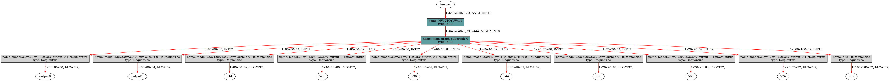
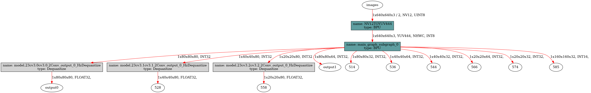

[English](./README.md) | 简体中文

# YOLO11 Instance Segmentation

- [YOLO11 Instance Segmentation](#yolo11-instance-segmentation)
  - [YOLO介绍](#yolo介绍)
  - [步骤参考](#步骤参考)
    - [环境、项目准备](#环境项目准备)
    - [导出为onnx](#导出为onnx)
    - [准备校准数据](#准备校准数据)
    - [PTQ方案量化转化](#ptq方案量化转化)
    - [移除Bounding Box信息3个输出头和Mask Coefficients信息3个输出头的反量化节点](#移除bounding-box信息3个输出头和mask-coefficients信息3个输出头的反量化节点)
    - [使用hb\_perf命令对bin模型进行可视化, hrt\_model\_exec命令检查bin模型的输入输出情况](#使用hb_perf命令对bin模型进行可视化-hrt_model_exec命令检查bin模型的输入输出情况)
  - [使用TROS高效部署YOLO11-Seg](#使用tros高效部署yolo11-seg)
    - [安装或更新tros-humble-hobot-dnn等功能包](#安装或更新tros-humble-hobot-dnn等功能包)
    - [拷贝tros-humble-hobot-dnn 的配置文件](#拷贝tros-humble-hobot-dnn-的配置文件)
    - [运行YOLOv8-Seg的推理节点](#运行yolov8-seg的推理节点)
    - [部分编译日志参考](#部分编译日志参考)
  - [模型训练](#模型训练)
  - [性能数据](#性能数据)
    - [RDK X5 \& RDK X5 Module](#rdk-x5--rdk-x5-module)
    - [测试方法](#测试方法)
  - [精度数据](#精度数据)
    - [RDK X5 \& RDK X5 Module](#rdk-x5--rdk-x5-module-1)
    - [测试方法](#测试方法-1)
  - [反馈](#反馈)
  - [参考](#参考)


## YOLO介绍


YOLO(You Only Look Once)是一种流行的物体检测和图像分割模型,由华盛顿大学的约瑟夫-雷德蒙(Joseph Redmon)和阿里-法哈迪(Ali Farhadi)开发。YOLO 于 2015 年推出,因其高速度和高精确度而迅速受到欢迎。

 - 2016 年发布的YOLOv2 通过纳入批量归一化、锚框和维度集群改进了原始模型。
2018 年推出的YOLOv3 使用更高效的骨干网络、多锚和空间金字塔池进一步增强了模型的性能。
 - YOLOv4于 2020 年发布,引入了 Mosaic 数据增强、新的无锚检测头和新的损失函数等创新技术。
 - YOLOv5进一步提高了模型的性能,并增加了超参数优化、集成实验跟踪和自动导出为常用导出格式等新功能。
 - YOLOv6于 2022 年由美团开源,目前已用于该公司的许多自主配送机器人。
 - YOLOv7增加了额外的任务,如 COCO 关键点数据集的姿势估计。
 - YOLO11是YOLO 的最新版本,由Ultralytics 提供。YOLO11 支持全方位的视觉 AI 任务,包括检测、分割、姿态估计、跟踪和分类。这种多功能性使用户能够在各种应用和领域中利用YOLO11 的功能。
 - YOLOv9 引入了可编程梯度信息(PGI)和广义高效层聚合网络(GELAN)等创新方法。
 - YOLOv10是由清华大学的研究人员使用该软件包创建的。 UltralyticsPython 软件包创建的。该版本通过引入端到端头(End-to-End head), 消除了非最大抑制(NMS)要求, 实现了实时目标检测的进步.
 - YOLO11 NEW 🚀：Ultralytics的最新YOLO模型在多个任务上实现了最先进的（SOTA）性能。
 - YOLO12构建以注意力为核心的YOLO框架，通过创新方法和架构改进，打破CNN模型在YOLO系列中的主导地位，实现具有快速推理速度和更高检测精度的实时目标检测。


## 步骤参考

注：任何No such file or directory, No module named "xxx", command not found.等报错请仔细检查，请勿逐条复制运行，如果对修改过程不理解请前往开发者社区从YOLOv5开始了解。
### 环境、项目准备
 - 下载`ultralytics/ultralytics`仓库，并参考YOLO11官方文档，配置好环境
```bash
git clone https://github.com/ultralytics/ultralytics.git
```
 - 进入本地仓库，下载官方的预训练权重，这里以340万参数的YOLO11n-Seg模型为例
```bash
cd ultralytics
wget https://github.com/ultralytics/assets/releases/download/v8.3.0/yolo11n-seg.pt
```

### 导出为onnx
 - 卸载yolo相关的命令行命令，这样直接修改`./ultralytics/ultralytics`目录即可生效。
```bash
$ conda list | grep ultralytics
$ pip list | grep ultralytics # 或者
# 如果存在，则卸载
$ conda uninstall ultralytics 
$ pip uninstall ultralytics   # 或者
```

如果不是很顺利，可以通过以下Python命令确认需要修改的`ultralytics`目录的位置:
```bash
>>> import ultralytics
>>> ultralytics.__path__
['/home/wuchao/miniconda3/envs/yolo/lib/python3.11/site-packages/ultralytics']
# 或者
['/home/wuchao/YOLO11/ultralytics_v11/ultralytics']
```

 - 修改优化后的Attntion模块
文件目录：`ultralytics/nn/modules/block.py`, 约第868行, `Attntion`类的`forward`方法替换成以下内容. 主要的优化点是去除了一些无用的数据搬运操作，同时将Reduce的维度变为C维度，对BPU更加友好, 目前可以将BPU吞吐量翻倍, 并且不需要重新训练模型.
注：建议您保留好原本的`forward`方法,例如改一个其他的名字`forward_`, 方便在训练的时候换回来。
```python
class AAttn(nn.Module):
    def forward(self, x):  # RDK
        print(f"{x.shape = }")
        B, C, H, W = x.shape
        N = H * W
        qkv = self.qkv(x)
        q, k, v = qkv.view(B, self.num_heads, self.key_dim * 2 + self.head_dim, N).split(
            [self.key_dim, self.key_dim, self.head_dim], dim=2
        )
        attn = (q.transpose(-2, -1) @ k) * self.scale
        attn = attn.permute(0, 3, 1, 2).contiguous()  # CHW2HWC like
        max_attn = attn.max(dim=1, keepdim=True).values 
        exp_attn = torch.exp(attn - max_attn)
        sum_attn = exp_attn.sum(dim=1, keepdim=True)
        attn = exp_attn / sum_attn
        attn = attn.permute(0, 2, 3, 1).contiguous()  # HWC2CHW like
        x = (v @ attn.transpose(-2, -1)).view(B, C, H, W) + self.pe(v.reshape(B, C, H, W))
        x = self.proj(x)
        return x
```

文件目录：./ultralytics/ultralytics/nn/modules/head.py，约第180行，`Segment`类的`forward`函数替换成以下内容。除了检测部分的6个头外，还有3个`32×(80×80+40×40+20×20)`掩膜系数张量输出头，和一个`32×160×160`的`基底，用于合成结果.
```python
def forward(self, x):  # RDK X5
    result = []
    for i in range(self.nl):
        result.append(self.cv3[i](x[i]).permute(0, 2, 3, 1).contiguous())
        result.append(self.cv2[i](x[i]).permute(0, 2, 3, 1).contiguous())
        result.append(self.cv4[i](x[i]).permute(0, 2, 3, 1).contiguous())
    result.append(self.proto(x[0]).permute(0, 2, 3, 1).contiguous())
    return result

# 如果发现导出后的ONNX顺序不对，则可以通过调整每个self.cv*[i]的顺序来调整顺序。
## 然后再重新导出onnx, 编译为bin模型

def forward(self, x):  # RDK X5
    result = []
    for i in range(self.nl):
        result.append(self.cv2[i](x[i]).permute(0, 2, 3, 1).contiguous())
        result.append(self.cv3[i](x[i]).permute(0, 2, 3, 1).contiguous())
        result.append(self.cv4[i](x[i]).permute(0, 2, 3, 1).contiguous())
    result.append(self.proto(x[0]).permute(0, 2, 3, 1).contiguous())
    return result
```

 - 运行以下Python脚本，如果有**No module named onnxsim**报错，安装一个即可
```python
from ultralytics import YOLO
YOLO('yolo11n-seg.pt').export(imgsz=640, format='onnx', simplify=False, opset=11)
```

### 准备校准数据
参考RDK Model Zoo提供的极简的校准数据准备脚本：`https://github.com/D-Robotics/rdk_model_zoo/blob/main/demos/tools/generate_calibration_data/generate_calibration_data.py `进行校准数据的准备。

### PTQ方案量化转化

 - 参考天工开物工具链手册和OE包，对模型进行检查，所有算子均在BPU上，进行编译即可。对应的yaml文件在`./ptq_yamls`目录下。

```bash
(bpu_docker) $ hb_mapper checker --model-type onnx --march bayes-e --model yolo11n-seg.onnx
```

 - 如果您不对Attention模块进行等价改写，根据模型检查结果，找到手动量化算子Softmax, 应有这样的内容, Softmax算子将模型拆为了两个BPU子图。这里的Softmax算子名称为"/model.10/m/m.0/attn/Softmax". 如果您对已经对Attention模块进行改写, 则这一步不会有Softmax算子出现，可以直接进行模型编译. 

```bash
/model.10/m/m.0/attn/MatMul        BPU  id(0)     HzSQuantizedMatmul         --                 1.0        int8      
/model.10/m/m.0/attn/Mul           BPU  id(0)     HzSQuantizedConv           --                 1.0        int8      
/model.10/m/m.0/attn/Softmax       CPU  --        Softmax                    --                 --         float     
/model.10/m/m.0/attn/Transpose_1   BPU  id(1)     Transpose                  --                 --         int8      
/model.10/m/m.0/attn/MatMul_1      BPU  id(1)     HzSQuantizedMatmul         --                 1.0        int8
```

在对应的yaml文件中修改以下内容:
```yaml
model_parameters:
  node_info: {"/model.10/m/m.0/attn/Softmax": {'ON': 'BPU','InputType': 'int8','OutputType': 'int8'}}
# 如果精度不达标，则考虑使用以下配置，或者直接删除掉node_info配置项，使用FP32去计算Softmax算子。
model_parameters:
  node_info: {"/model.10/m/m.0/attn/Softmax": {'ON': 'BPU','InputType': 'int16','OutputType': 'int16'}}
```
如果是YOLO11-Seg的l和x模型，需要指定两个SoftMax算子到BPU上
```yaml
model_parameters:
  node_info: {"/model.10/m/m.0/attn/Softmax": {'ON': 'BPU','InputType': 'int8','OutputType': 'int8'},
              "/model.10/m/m.1/attn/Softmax": {'ON': 'BPU','InputType': 'int8','OutputType': 'int8'}}
```
  注：这里可以选择使用int8量化softmax算子，在COCO2017数据集的5000张照片的验证集上验证mAP：.50-.95精度一致。如果使用int8无法控制精度掉点，则可以考虑使用int16, 或者不写这一项，使用FP32去计算Softmax。

```bash
(bpu_docker) $ hb_mapper makertbin --model-type onnx --config config_yolo11_seg_bayese_640x640_nv12.yaml
```

### 移除Bounding Box信息3个输出头和Mask Coefficients信息3个输出头的反量化节点

 - 查看Bounding Box信息的3个输出头的反量化节点名称
通过hb_mapper makerbin时的日志，看到大小为[1, 80, 80, 64], [1, 40, 40, 64], [1, 20, 20, 64]的三个输出的名称为output1, 536, 566。

 - 查看Mask Coefficients信息的3个输出头的反量化节点名称
通过hb_mapper makerbin时的日志，看到大小为[1, 80, 80, 32], [1, 40, 40, 32], [1, 20, 20, 32]的三个输出的名称为514, 544, 574。

 - 查看Mask Proto [1, 160, 160, 32]的输出头名称
通过hb_mapper makerbin时的日志，看到大小为[1, 160, 160, 32]的输出头名称为585
```bash
ONNX IR version:          6
Opset version:            ['ai.onnx v11', 'horizon v1']
Producer:                 pytorch v2.6.0
Domain:                   None
Version:                  None
Graph input:
    images:               shape=[1, 3, 640, 640], dtype=FLOAT32
Graph output:
    output0:              shape=[1, 80, 80, 80], dtype=FLOAT32
    output1:              shape=[1, 80, 80, 64], dtype=FLOAT32
    514:                  shape=[1, 80, 80, 32], dtype=FLOAT32
    528:                  shape=[1, 40, 40, 80], dtype=FLOAT32
    536:                  shape=[1, 40, 40, 64], dtype=FLOAT32
    544:                  shape=[1, 40, 40, 32], dtype=FLOAT32
    558:                  shape=[1, 20, 20, 80], dtype=FLOAT32
    566:                  shape=[1, 20, 20, 64], dtype=FLOAT32
    574:                  shape=[1, 20, 20, 32], dtype=FLOAT32
    585:                  shape=[1, 160, 160, 32], dtype=FLOAT32

```

 - 进入编译产物的目录

```bash
$ cd yolo11n_seg_bayese_640x640_nv12
```

 - 查看可以被移除的反量化节点

```bash
$ hb_model_modifier yolo11n_seg_bayese_640x640_nv12
```

 - 在生成的`hb_model_modifier.log`文件中，找到以下信息。主要是找到大小为[1, 64, 80, 80], [1, 64, 40, 40], [1, 64, 20, 20]的三个输出头和[1, 80, 80, 32], [1, 40, 40, 32], [1, 20, 20, 32]三个输出头的名称, 还有[1, 160, 160, 32]的输出头名称。当然，也可以通过netron等工具查看onnx模型，获得输出头的名称。
 此处的名称为：
 > "/model.23/cv2.0/cv2.0.2/Conv_output_0_HzDequantize"
 > "/model.23/cv2.1/cv2.1.2/Conv_output_0_HzDequantize"
 > "/model.23/cv2.2/cv2.2.2/Conv_output_0_HzDequantize"
 > "/model.23/cv4.0/cv4.0.2/Conv_output_0_HzDequantize"
 > "/model.23/cv4.1/cv4.1.2/Conv_output_0_HzDequantize"
 > "/model.23/cv4.2/cv4.2.2/Conv_output_0_HzDequantize"
 > "585_HzDequantize"

```bash
2025-03-05 19:17:24,588 file: hb_model_modifier.py func: hb_model_modifier line No: 409 input: "/model.23/cv2.0/cv2.0.2/Conv_output_0_quantized"
input: "/model.23/cv2.0/cv2.0.2/Conv_x_scale"
output: "output1"
name: "/model.23/cv2.0/cv2.0.2/Conv_output_0_HzDequantize"

2025-03-05 19:17:24,588 file: hb_model_modifier.py func: hb_model_modifier line No: 409 input: "/model.23/cv2.1/cv2.1.2/Conv_output_0_quantized"
input: "/model.23/cv2.1/cv2.1.2/Conv_x_scale"
output: "536"
name: "/model.23/cv2.1/cv2.1.2/Conv_output_0_HzDequantize"

2025-03-05 19:17:24,589 file: hb_model_modifier.py func: hb_model_modifier line No: 409 input: "/model.23/cv2.2/cv2.2.2/Conv_output_0_quantized"
input: "/model.23/cv2.2/cv2.2.2/Conv_x_scale"
output: "566"
name: "/model.23/cv2.2/cv2.2.2/Conv_output_0_HzDequantize"

2025-03-05 19:17:24,588 file: hb_model_modifier.py func: hb_model_modifier line No: 409 input: "/model.23/cv4.0/cv4.0.2/Conv_output_0_quantized"
input: "/model.23/cv4.0/cv4.0.2/Conv_x_scale"
output: "514"
name: "/model.23/cv4.0/cv4.0.2/Conv_output_0_HzDequantize"

2025-03-05 19:17:24,589 file: hb_model_modifier.py func: hb_model_modifier line No: 409 input: "/model.23/cv4.1/cv4.1.2/Conv_output_0_quantized"
input: "/model.23/cv4.1/cv4.1.2/Conv_x_scale"
output: "544"
name: "/model.23/cv4.1/cv4.1.2/Conv_output_0_HzDequantize"

2025-03-05 19:17:24,589 file: hb_model_modifier.py func: hb_model_modifier line No: 409 input: "/model.23/cv4.2/cv4.2.2/Conv_output_0_quantized"
input: "/model.23/cv4.2/cv4.2.2/Conv_x_scale"
output: "574"
name: "/model.23/cv4.2/cv4.2.2/Conv_output_0_HzDequantize"

2025-03-05 20:16:13,855 file: hb_model_modifier.py func: hb_model_modifier line No: 409 input: "/model.23/proto/cv3/act/Mul_output_0_quantized"
input: "/model.23/proto/cv3/act/Mul_output_0_HzCalibration_y_scale"
output: "585"
name: "585_HzDequantize"
```


 - 使用以下命令移除上述三个反量化节点, 注意, 导出时这些名称可能不同, 请仔细确认.

```bash
$ hb_model_modifier yolo11n_seg_bayese_640x640_nv12.bin \
-r /model.23/cv2.0/cv2.0.2/Conv_output_0_HzDequantize \
-r /model.23/cv2.1/cv2.1.2/Conv_output_0_HzDequantize \
-r /model.23/cv2.2/cv2.2.2/Conv_output_0_HzDequantize \
-r /model.23/cv4.0/cv4.0.2/Conv_output_0_HzDequantize \
-r /model.23/cv4.1/cv4.1.2/Conv_output_0_HzDequantize \
-r /model.23/cv4.2/cv4.2.2/Conv_output_0_HzDequantize \
-r 585_HzDequantize
```

 - 移除成功会显示以下日志

```bash
2025-03-05 20:16:58,603 INFO log will be stored in /open_explorer/yolo11nseg_detect_bayese_640x640_nv12/hb_model_modifier.log
2025-03-05 20:16:58,612 INFO Nodes that will be removed from this model: ['/model.23/cv2.0/cv2.0.2/Conv_output_0_HzDequantize', '/model.23/cv2.1/cv2.1.2/Conv_output_0_HzDequantize', '/model.23/cv2.2/cv2.2.2/Conv_output_0_HzDequantize', '/model.23/cv4.0/cv4.0.2/Conv_output_0_HzDequantize', '/model.23/cv4.1/cv4.1.2/Conv_output_0_HzDequantize', '/model.23/cv4.2/cv4.2.2/Conv_output_0_HzDequantize', '585_HzDequantize']
2025-03-05 20:16:58,612 INFO Node '/model.23/cv2.0/cv2.0.2/Conv_output_0_HzDequantize' found, its OP type is 'Dequantize'
2025-03-05 20:16:58,612 INFO scale: /model.23/cv2.0/cv2.0.2/Conv_x_scale; zero point: 0. node info details are stored in hb_model_modifier log file
2025-03-05 20:16:58,613 INFO Node '/model.23/cv2.0/cv2.0.2/Conv_output_0_HzDequantize' is removed
2025-03-05 20:16:58,613 INFO Node '/model.23/cv2.1/cv2.1.2/Conv_output_0_HzDequantize' found, its OP type is 'Dequantize'
2025-03-05 20:16:58,613 INFO scale: /model.23/cv2.1/cv2.1.2/Conv_x_scale; zero point: 0. node info details are stored in hb_model_modifier log file
2025-03-05 20:16:58,614 INFO Node '/model.23/cv2.1/cv2.1.2/Conv_output_0_HzDequantize' is removed
2025-03-05 20:16:58,614 INFO Node '/model.23/cv2.2/cv2.2.2/Conv_output_0_HzDequantize' found, its OP type is 'Dequantize'
2025-03-05 20:16:58,614 INFO scale: /model.23/cv2.2/cv2.2.2/Conv_x_scale; zero point: 0. node info details are stored in hb_model_modifier log file
2025-03-05 20:16:58,615 INFO Node '/model.23/cv2.2/cv2.2.2/Conv_output_0_HzDequantize' is removed
2025-03-05 20:16:58,615 INFO Node '/model.23/cv4.0/cv4.0.2/Conv_output_0_HzDequantize' found, its OP type is 'Dequantize'
2025-03-05 20:16:58,615 INFO scale: /model.23/cv4.0/cv4.0.2/Conv_x_scale; zero point: 0. node info details are stored in hb_model_modifier log file
2025-03-05 20:16:58,616 INFO Node '/model.23/cv4.0/cv4.0.2/Conv_output_0_HzDequantize' is removed
2025-03-05 20:16:58,616 INFO Node '/model.23/cv4.1/cv4.1.2/Conv_output_0_HzDequantize' found, its OP type is 'Dequantize'
2025-03-05 20:16:58,616 INFO scale: /model.23/cv4.1/cv4.1.2/Conv_x_scale; zero point: 0. node info details are stored in hb_model_modifier log file
2025-03-05 20:16:58,616 INFO Node '/model.23/cv4.1/cv4.1.2/Conv_output_0_HzDequantize' is removed
2025-03-05 20:16:58,617 INFO Node '/model.23/cv4.2/cv4.2.2/Conv_output_0_HzDequantize' found, its OP type is 'Dequantize'
2025-03-05 20:16:58,617 INFO scale: /model.23/cv4.2/cv4.2.2/Conv_x_scale; zero point: 0. node info details are stored in hb_model_modifier log file
2025-03-05 20:16:58,617 INFO Node '/model.23/cv4.2/cv4.2.2/Conv_output_0_HzDequantize' is removed
2025-03-05 20:16:58,618 INFO Node '585_HzDequantize' found, its OP type is 'Dequantize'
2025-03-05 20:16:58,618 WARNING node name is 585_HzDequantize, op type is Dequantize, no axis information
2025-03-05 20:16:58,618 INFO scale: /model.23/proto/cv3/act/Mul_output_0_HzCalibration_y_scale; zero point: 0. node info details are stored in hb_model_modifier log file
2025-03-05 20:16:58,618 INFO Node '585_HzDequantize' is removed
2025-03-05 20:16:58,623 INFO modified model saved as yolo11nseg_detect_bayese_640x640_nv12_modified.bin
```
  
### 使用hb_perf命令对bin模型进行可视化, hrt_model_exec命令检查bin模型的输入输出情况

 - 移除反量化系数前的bin模型

```bash
hb_perf yolo11n_seg_bayese_640x640_nv12.bin
```

在`hb_perf_result`目录下可以找到以下结果: 


```bash
hrt_model_exec model_info --model_file yolo11n_seg_bayese_640x640_nv12.bin
```

可以看到这个移除反量化系数前的bin模型的输入输出信息

```bash
[HBRT] set log level as 0. version = 3.15.55.0
[DNN] Runtime version = 1.24.5_(3.15.55 HBRT)
[A][DNN][packed_model.cpp:247][Model](2025-03-05,19:50:16.32.171) [HorizonRT] The model builder version = 1.24.3
Load model to DDR cost 46.552ms.
This model file has 1 model:
[yolo11nseg_detect_bayese_640x640_nv12]
---------------------------------------------------------------------
[model name]: yolo11nseg_detect_bayese_640x640_nv12

input[0]: 
name: images
input source: HB_DNN_INPUT_FROM_PYRAMID
valid shape: (1,3,640,640,)
aligned shape: (1,3,640,640,)
aligned byte size: 614400
tensor type: HB_DNN_IMG_TYPE_NV12
tensor layout: HB_DNN_LAYOUT_NCHW
quanti type: NONE
stride: (0,0,0,0,)

output[0]: 
name: output0
valid shape: (1,80,80,80,)
aligned shape: (1,80,80,80,)
aligned byte size: 2048000
tensor type: HB_DNN_TENSOR_TYPE_F32
tensor layout: HB_DNN_LAYOUT_NHWC
quanti type: NONE
stride: (2048000,25600,320,4,)

output[1]: 
name: output1
valid shape: (1,80,80,64,)
aligned shape: (1,80,80,64,)
aligned byte size: 1638400
tensor type: HB_DNN_TENSOR_TYPE_F32
tensor layout: HB_DNN_LAYOUT_NHWC
quanti type: NONE
stride: (1638400,20480,256,4,)

output[2]: 
name: 514
valid shape: (1,80,80,32,)
aligned shape: (1,80,80,32,)
aligned byte size: 819200
tensor type: HB_DNN_TENSOR_TYPE_F32
tensor layout: HB_DNN_LAYOUT_NHWC
quanti type: NONE
stride: (819200,10240,128,4,)

output[3]: 
name: 528
valid shape: (1,40,40,80,)
aligned shape: (1,40,40,80,)
aligned byte size: 512000
tensor type: HB_DNN_TENSOR_TYPE_F32
tensor layout: HB_DNN_LAYOUT_NHWC
quanti type: NONE
stride: (512000,12800,320,4,)

output[4]: 
name: 536
valid shape: (1,40,40,64,)
aligned shape: (1,40,40,64,)
aligned byte size: 409600
tensor type: HB_DNN_TENSOR_TYPE_F32
tensor layout: HB_DNN_LAYOUT_NHWC
quanti type: NONE
stride: (409600,10240,256,4,)

output[5]: 
name: 544
valid shape: (1,40,40,32,)
aligned shape: (1,40,40,32,)
aligned byte size: 204800
tensor type: HB_DNN_TENSOR_TYPE_F32
tensor layout: HB_DNN_LAYOUT_NHWC
quanti type: NONE
stride: (204800,5120,128,4,)

output[6]: 
name: 558
valid shape: (1,20,20,80,)
aligned shape: (1,20,20,80,)
aligned byte size: 128000
tensor type: HB_DNN_TENSOR_TYPE_F32
tensor layout: HB_DNN_LAYOUT_NHWC
quanti type: NONE
stride: (128000,6400,320,4,)

output[7]: 
name: 566
valid shape: (1,20,20,64,)
aligned shape: (1,20,20,64,)
aligned byte size: 102400
tensor type: HB_DNN_TENSOR_TYPE_F32
tensor layout: HB_DNN_LAYOUT_NHWC
quanti type: NONE
stride: (102400,5120,256,4,)

output[8]: 
name: 574
valid shape: (1,20,20,32,)
aligned shape: (1,20,20,32,)
aligned byte size: 51200
tensor type: HB_DNN_TENSOR_TYPE_F32
tensor layout: HB_DNN_LAYOUT_NHWC
quanti type: NONE
stride: (51200,2560,128,4,)

output[9]: 
name: 585
valid shape: (1,160,160,32,)
aligned shape: (1,160,160,32,)
aligned byte size: 3276800
tensor type: HB_DNN_TENSOR_TYPE_F32
tensor layout: HB_DNN_LAYOUT_NCHW
quanti type: NONE
stride: (3276800,20480,128,4,)
```

 - 移除目标反量化系数后的bin模型
```bash
hb_perf yolo11n_seg_bayese_640x640_nv12_modified.bin
```
在`hb_perf_result`目录下可以找到以下结果。




```bash
hrt_model_exec model_info --model_file yolo11n_seg_bayese_640x640_nv12_modified.bin
```

可以看到这个移除反量化系数前的bin模型的输入输出信息, 以及移除反量化节点的所有反量化系数, 这也说明bin模型中是存储着这些信息的, 可以使用推理库的API获得, 方便我们进行对应的前后处理.

```bash
[HBRT] set log level as 0. version = 3.15.55.0
[DNN] Runtime version = 1.24.5_(3.15.55 HBRT)
[A][DNN][packed_model.cpp:247][Model](2025-03-05,20:21:58.826.95) [HorizonRT] The model builder version = 1.24.3
Load model to DDR cost 30.932ms.
This model file has 1 model:
[yolo11nseg_detect_bayese_640x640_nv12]
---------------------------------------------------------------------
[model name]: yolo11nseg_detect_bayese_640x640_nv12

input[0]: 
name: images
input source: HB_DNN_INPUT_FROM_PYRAMID
valid shape: (1,3,640,640,)
aligned shape: (1,3,640,640,)
aligned byte size: 614400
tensor type: HB_DNN_IMG_TYPE_NV12
tensor layout: HB_DNN_LAYOUT_NCHW
quanti type: NONE
stride: (0,0,0,0,)

output[0]: 
name: output0
valid shape: (1,80,80,80,)
aligned shape: (1,80,80,80,)
aligned byte size: 2048000
tensor type: HB_DNN_TENSOR_TYPE_F32
tensor layout: HB_DNN_LAYOUT_NHWC
quanti type: NONE
stride: (2048000,25600,320,4,)

output[1]: 
name: output1
valid shape: (1,80,80,64,)
aligned shape: (1,80,80,64,)
aligned byte size: 1638400
tensor type: HB_DNN_TENSOR_TYPE_S32
tensor layout: HB_DNN_LAYOUT_NHWC
quanti type: SCALE
stride: (1638400,20480,256,4,)
scale data: 0.000567521,0.000551772,0.00048259,0.000535742,0.000471622,0.000394565,0.00039344,0.000314133,0.000216547,0.000241295,0.000272371,0.000275043,0.0002607,0.000236795,0.000211344,0.000240311,0.00054446,0.000543054,0.000526743,0.000504807,0.000358568,0.000406377,0.000292479,0.000298947,0.000307384,0.000259856,0.000206282,0.000165082,0.000144693,0.000121702,9.75867e-05,0.000200657,0.000601831,0.000584395,0.000515494,0.000489339,0.000523649,0.000423532,0.000399065,0.000288823,0.00030879,0.000289948,0.000245935,0.000207829,0.000202767,0.000184768,0.000159457,0.000251841,0.000685638,0.000629954,0.000495808,0.000463466,0.000411439,0.000362786,0.000413126,0.000334944,0.000246076,0.000277714,0.000273496,0.000248748,0.00022414,0.000202063,0.000180268,0.000199532,
quantizeAxis: 3

output[2]: 
name: 514
valid shape: (1,80,80,32,)
aligned shape: (1,80,80,32,)
aligned byte size: 819200
tensor type: HB_DNN_TENSOR_TYPE_S32
tensor layout: HB_DNN_LAYOUT_NHWC
quanti type: SCALE
stride: (819200,10240,128,4,)
scale data: 0.000111632,1.57675e-05,6.31909e-05,6.75836e-05,5.03754e-05,5.79116e-05,6.82687e-05,5.07784e-05,3.88898e-05,2.72632e-05,2.06035e-05,0.000125979,4.66275e-05,2.82908e-05,5.61786e-05,9.67208e-05,4.12474e-05,6.54477e-05,0.000133636,6.66567e-05,7.66512e-05,0.000114937,5.23501e-05,8.99503e-05,8.16887e-05,9.06757e-05,0.000114775,4.72723e-05,5.39218e-05,3.27239e-05,9.59148e-05,6.72209e-05,
quantizeAxis: 3

output[3]: 
name: 528
valid shape: (1,40,40,80,)
aligned shape: (1,40,40,80,)
aligned byte size: 512000
tensor type: HB_DNN_TENSOR_TYPE_F32
tensor layout: HB_DNN_LAYOUT_NHWC
quanti type: NONE
stride: (512000,12800,320,4,)

output[4]: 
name: 536
valid shape: (1,40,40,64,)
aligned shape: (1,40,40,64,)
aligned byte size: 409600
tensor type: HB_DNN_TENSOR_TYPE_S32
tensor layout: HB_DNN_LAYOUT_NHWC
quanti type: SCALE
stride: (409600,10240,256,4,)
scale data: 0.000592819,0.000590012,0.000499349,0.000411773,0.000401388,0.000352548,0.000401107,0.000337952,0.000335145,0.000279568,0.000206027,0.000199992,0.00023564,0.000243078,0.000233254,0.00030904,0.00059338,0.000595626,0.000447421,0.000446579,0.000408686,0.000518716,0.000523488,0.000327005,0.000359565,0.000289392,0.000213606,0.00019901,0.000217535,0.00020715,0.000185396,0.000280971,0.000688254,0.000661869,0.000561381,0.000508331,0.000437877,0.000443772,0.000438158,0.000315496,0.000362372,0.000255569,0.00023957,0.000268481,0.000278866,0.000274516,0.000258656,0.000305953,0.000645589,0.000590012,0.000476332,0.000440965,0.000467911,0.000446579,0.000433948,0.000344407,0.000343285,0.000243218,0.000202799,0.000250095,0.000258095,0.000243078,0.000215711,0.000266095,
quantizeAxis: 3

output[5]: 
name: 544
valid shape: (1,40,40,32,)
aligned shape: (1,40,40,32,)
aligned byte size: 204800
tensor type: HB_DNN_TENSOR_TYPE_S32
tensor layout: HB_DNN_LAYOUT_NHWC
quanti type: SCALE
stride: (204800,5120,128,4,)
scale data: 9.24463e-05,3.92088e-05,4.64847e-05,3.8757e-05,5.14541e-05,4.63658e-05,4.99799e-05,5.63998e-05,5.59243e-05,3.99459e-05,7.51364e-05,0.000172623,7.00956e-05,6.27722e-05,3.82815e-05,7.98918e-05,4.22285e-05,0.000152365,0.000151699,6.32953e-05,4.47965e-05,0.000140001,3.94228e-05,8.62642e-05,0.000154648,0.000146659,0.000135436,6.92396e-05,7.89883e-05,3.90899e-05,0.00013924,4.64847e-05,
quantizeAxis: 3

output[6]: 
name: 558
valid shape: (1,20,20,80,)
aligned shape: (1,20,20,80,)
aligned byte size: 128000
tensor type: HB_DNN_TENSOR_TYPE_F32
tensor layout: HB_DNN_LAYOUT_NHWC
quanti type: NONE
stride: (128000,6400,320,4,)

output[7]: 
name: 566
valid shape: (1,20,20,64,)
aligned shape: (1,20,20,64,)
aligned byte size: 102400
tensor type: HB_DNN_TENSOR_TYPE_S32
tensor layout: HB_DNN_LAYOUT_NHWC
quanti type: SCALE
stride: (102400,5120,256,4,)
scale data: 0.000761078,0.00073507,0.000752865,0.000627273,0.000563964,0.000587235,0.000485256,0.000418524,0.000487309,0.000554725,0.000474647,0.000405863,0.000424,0.000466092,0.000478754,0.000498602,0.000813779,0.000761762,0.000819254,0.000639593,0.000628984,0.000541721,0.000707693,0.000589288,0.00044111,0.000603319,0.000384988,0.000406889,0.000397992,0.000296526,0.000162037,6.66457e-05,0.000873323,0.000843209,0.000802828,0.000680316,0.000658072,0.000597159,0.000637882,0.000468487,0.000542747,0.000543089,0.000497233,0.000550618,0.000439742,0.000450008,0.000366508,0.000372668,0.000712484,0.000745336,0.000664917,0.000656361,0.000644042,0.000574573,0.000637882,0.000636855,0.000469514,0.000636171,0.000570124,0.000522899,0.000387725,0.000405863,0.000449324,0.000426395,
quantizeAxis: 3

output[8]: 
name: 574
valid shape: (1,20,20,32,)
aligned shape: (1,20,20,32,)
aligned byte size: 51200
tensor type: HB_DNN_TENSOR_TYPE_S32
tensor layout: HB_DNN_LAYOUT_NHWC
quanti type: SCALE
stride: (51200,2560,128,4,)
scale data: 0.000126903,0.000103646,3.16338e-05,2.26898e-05,4.45512e-05,4.98899e-05,1.68601e-05,5.1332e-05,5.12707e-05,7.79339e-05,0.000159427,0.000165073,0.000107021,8.87342e-05,7.56633e-05,8.07567e-05,8.02044e-05,0.000140404,0.000136354,4.56557e-05,1.40833e-05,0.00014789,4.67296e-05,9.08819e-05,0.000126658,0.000111746,0.000125676,9.38888e-05,5.32344e-05,6.89745e-05,0.000129481,1.45819e-05,
quantizeAxis: 3

output[9]: 
name: 585
valid shape: (1,160,160,32,)
aligned shape: (1,160,160,32,)
aligned byte size: 1638400
tensor type: HB_DNN_TENSOR_TYPE_S16
tensor layout: HB_DNN_LAYOUT_NCHW
quanti type: SCALE
stride: (1638400,10240,64,2,)
scale data: 0.000191903,

```

## 使用TROS高效部署YOLO11-Seg

### 安装或更新tros-humble-hobot-dnn等功能包
```bash
sudo apt update # 确保有地瓜apt源
sudo apt install -y tros*-dnn-node* tros*-hobot-usb-cam tros*-hobot-codec
```
### 拷贝tros-humble-hobot-dnn 的配置文件
```bash
cp -r /opt/tros/humble/lib/dnn_node_example/config .
```
配置为以下内容
```json
{
        "model_file": "your_segmentation_model_file.bin",
        "task_num": 4,
        "dnn_Parser": "yolov8_seg",
        "model_output_count": 10,
        "reg_max": 16,
        "num_mask": 32,
        "class_num": 80,
        "cls_names_list": "config/coco.list",
        "strides": [8, 16, 32],
        "score_threshold": 0.4,
        "nms_threshold": 0.5,
        "nms_top_k": 5000
}
```

### 运行YOLOv8-Seg的推理节点
注：YOLOv11-Seg的后处理与YOLOv8-Seg相同，可以直接使用YOLOv8-Seg的推理节点
```bash
# 配置MIPI摄像头
export CAM_TYPE=mipi

# 配置USB摄像头
# export CAM_TYPE=usb

# 启动launch文件
ros2 launch dnn_node_example dnn_node_example.launch.py dnn_example_config_file:=config/my_workconfig.json
```
具体内容请参考TROS手册：https://developer.d-robotics.cc/rdk_doc/Robot_development/boxs/detection/yolo


### 部分编译日志参考

- 可以观察到，所有的算子均在BPU上，整个模型只有1个BPU子图，并且是一个由Conv，BatchMatMul和Lut查表算子组成的模型。
- 编译器预估这个模型的BPU吞吐量为 162.5 FPS，这个数据表示将BPU占用压满后的BPU吞吐量，另外，在板端BPU超频后，可以获得更高的BPU吞吐量。
- 所有的算子均为int8算子，绝大多数的节点余弦相似度>0.99, 输出节点的余弦相似度基本>0.9, 符合转化预期, 后续在板端进行全量精度验证可以得到更准确的精度数据。


```bash
2025-03-05 18:35:11,412 file: prepare.py func: prepare line No: 106 Input ONNX Model Information:
ONNX IR version:          6
Opset version:            ['ai.onnx v11', 'horizon v1']
Producer:                 pytorch v2.6.0
Domain:                   None
Version:                  None
Graph input:
    images:               shape=[1, 3, 640, 640], dtype=FLOAT32
Graph output:
    output0:              shape=[1, 80, 80, 80], dtype=FLOAT32
    output1:              shape=[1, 80, 80, 64], dtype=FLOAT32
    514:                  shape=[1, 80, 80, 32], dtype=FLOAT32
    528:                  shape=[1, 40, 40, 80], dtype=FLOAT32
    536:                  shape=[1, 40, 40, 64], dtype=FLOAT32
    544:                  shape=[1, 40, 40, 32], dtype=FLOAT32
    558:                  shape=[1, 20, 20, 80], dtype=FLOAT32
    566:                  shape=[1, 20, 20, 64], dtype=FLOAT32
    574:                  shape=[1, 20, 20, 32], dtype=FLOAT32
    585:                  shape=[1, 160, 160, 32], dtype=FLOAT32
2025-03-05 18:35:12,115 file: model_builder.py func: model_builder line No: 38 End to prepare the onnx model.
2025-03-05 18:35:12,192 file: model_builder.py func: model_builder line No: 265 Saving model to: yolo11nseg_detect_bayese_640x640_nv12_original_float_model.onnx.
2025-03-05 18:35:12,192 file: model_builder.py func: model_builder line No: 35 Start to optimize the onnx model.
2025-03-05 18:35:12,658 file: constant_folding.py func: constant_folding line No: 66 Summary info for constant_folding:
2025-03-05 18:35:12,658 file: constant_folding.py func: constant_folding line No: 67   After constant_folding, the number of nodes has changed from 351 to 343.
2025-03-05 18:35:12,658 file: constant_folding.py func: constant_folding line No: 71   After constant_folding, the number of parameters has changed from 2868681 to 2868681.
2025-03-05 18:35:12,658 file: constant_folding.py func: constant_folding line No: 76 Detailed info for constant_folding:
2025-03-05 18:35:12,658 file: constant_folding.py func: constant_folding line No: 88 
2025-03-05 18:35:13,368 file: model_builder.py func: model_builder line No: 38 End to optimize the onnx model.
2025-03-05 18:35:13,428 file: model_builder.py func: model_builder line No: 265 Saving model to: yolo11nseg_detect_bayese_640x640_nv12_optimized_float_model.onnx.
2025-03-05 18:35:13,428 file: model_builder.py func: model_builder line No: 35 Start to calibrate the model.
2025-03-05 18:35:13,941 file: calibration_data_set.py func: calibration_data_set line No: 111 input name: images,  number_of_samples: 50
2025-03-05 18:35:13,942 file: calibration_data_set.py func: calibration_data_set line No: 123 There are 50 samples in the data set.
2025-03-05 18:35:13,942 file: infer_thresholds.py func: infer_thresholds line No: 84 Run calibration model with modelwise search method.
2025-03-05 18:35:15,098 file: base.py func: base line No: 138 Calibration using batch 8
2025-03-05 18:35:22,254 file: ort.py func: ort line No: 207 Reset batch_size=1 and execute forward again...
2025-03-05 18:44:31,000 file: base.py func: base line No: 138 Calibration using batch 8
2025-03-05 18:44:33,456 file: ort.py func: ort line No: 207 Reset batch_size=1 and execute forward again...
2025-03-05 18:45:06,358 file: base.py func: base line No: 138 Calibration using batch 8
2025-03-05 18:45:13,160 file: ort.py func: ort line No: 207 Reset batch_size=1 and execute forward again...
2025-03-05 18:55:10,233 file: modelwise_search.py func: modelwise_search line No: 75 Select max-percentile:percentile=0.99995 method.
2025-03-05 18:55:12,967 file: model_builder.py func: model_builder line No: 38 End to calibrate the model.
2025-03-05 18:55:13,322 file: model_builder.py func: model_builder line No: 265 Saving model to: yolo11nseg_detect_bayese_640x640_nv12_calibrated_model.onnx.
2025-03-05 18:55:13,322 file: model_builder.py func: model_builder line No: 35 Start to quantize the model.
2025-03-05 18:55:17,719 file: constant_folding.py func: constant_folding line No: 66 Summary info for constant_folding:
2025-03-05 18:55:17,719 file: constant_folding.py func: constant_folding line No: 67   After constant_folding, the number of nodes has changed from 284 to 284.
2025-03-05 18:55:17,719 file: constant_folding.py func: constant_folding line No: 71   After constant_folding, the number of parameters has changed from 2900194 to 2900194.
2025-03-05 18:55:17,719 file: constant_folding.py func: constant_folding line No: 76 Detailed info for constant_folding:
2025-03-05 18:55:17,719 file: constant_folding.py func: constant_folding line No: 88 
2025-03-05 18:55:18,461 file: model_builder.py func: model_builder line No: 38 End to quantize the model.
2025-03-05 18:55:18,679 file: model_builder.py func: model_builder line No: 265 Saving model to: yolo11nseg_detect_bayese_640x640_nv12_quantized_model.onnx.
2025-03-05 18:55:18,680 file: model_builder.py func: model_builder line No: 35 Start to compile the model with march bayes-e.
2025-03-05 18:55:20,001 file: hybrid_build.py func: hybrid_build line No: 111 Compile submodel: main_graph_subgraph_0
2025-03-05 18:55:20,053 file: hbdk_cc.py func: hbdk_cc line No: 126 hbdk-cc parameters:['--O3', '--core-num', '1', '--fast', '--input-layout', 'NHWC', '--output-layout', 'NHWC', '--input-source', 'pyramid']
2025-03-05 18:55:20,053 file: hbdk_cc.py func: hbdk_cc line No: 127 hbdk-cc command used:hbdk-cc -f hbir -m /tmp/tmpwl7ii9xf/main_graph_subgraph_0.hbir -o /tmp/tmpwl7ii9xf/main_graph_subgraph_0.hbm --march bayes-e --progressbar --O3 --core-num 1 --fast --input-layout NHWC --output-layout NHWC --input-source pyramid
2025-03-05 19:01:09,712 file: tool_utils.py func: tool_utils line No: 326 consumed time 349.62
2025-03-05 19:01:09,878 file: tool_utils.py func: tool_utils line No: 326 FPS=162.5, latency = 6154.0 us, DDR = 17646528 bytes   (see main_graph_subgraph_0.html)
2025-03-05 19:01:09,998 file: model_builder.py func: model_builder line No: 38 End to compile the model with march bayes-e.
2025-03-05 19:01:17,208 file: print_info_dict.py func: print_info_dict line No: 72 The main quantized node information:
======================================================================================================================================
Node                                                ON   Subgraph  Type                       Cosine Similarity  Threshold  DataType  
--------------------------------------------------------------------------------------------------------------------------------------
HZ_PREPROCESS_FOR_images                            BPU  id(0)     HzSQuantizedPreprocess     0.999912           127.0      int8      
/model.0/conv/Conv                                  BPU  id(0)     HzSQuantizedConv           0.999406           1.10366    int8      
/model.0/act/Mul                                    BPU  id(0)     HzLut                      0.998999           47.5452    int8      
/model.1/conv/Conv                                  BPU  id(0)     HzSQuantizedConv           0.995490           46.0491    int8      
/model.1/act/Mul                                    BPU  id(0)     HzLut                      0.995107           81.9537    int8      
/model.2/cv1/conv/Conv                              BPU  id(0)     HzSQuantizedConv           0.994006           76.5655    int8      
/model.2/cv1/act/Mul                                BPU  id(0)     HzLut                      0.994021           49.2743    int8      
/model.2/Split                                      BPU  id(0)     Split                      0.994048           10.6721    int8      
/model.2/m.0/cv1/conv/Conv                          BPU  id(0)     HzSQuantizedConv           0.993309           10.6721    int8      
/model.2/m.0/cv1/act/Mul                            BPU  id(0)     HzLut                      0.995059           7.36832    int8      
/model.2/m.0/cv2/conv/Conv                          BPU  id(0)     HzSQuantizedConv           0.970956           2.04301    int8      
/model.2/m.0/cv2/act/Mul                            BPU  id(0)     HzLut                      0.979220           14.7954    int8      
/model.2/m.0/Add                                    BPU  id(0)     HzSElementwiseAdd          0.989666           10.6721    int8      
/model.2/Split_output_0_calibrated_Requantize       BPU  id(0)     HzRequantize               --                 --         int8      
/model.2/Split_output_1_calibrated_Requantize       BPU  id(0)     HzRequantize               --                 --         int8      
/model.2/Concat                                     BPU  id(0)     Concat                     0.991416           10.6721    int8      
/model.2/cv2/conv/Conv                              BPU  id(0)     HzSQuantizedConv           0.969201           13.6119    int8      
/model.2/cv2/act/Mul                                BPU  id(0)     HzLut                      0.968830           20.1404    int8      
/model.3/conv/Conv                                  BPU  id(0)     HzSQuantizedConv           0.979736           10.0961    int8      
/model.3/act/Mul                                    BPU  id(0)     HzLut                      0.989447           7.01389    int8      
/model.4/cv1/conv/Conv                              BPU  id(0)     HzSQuantizedConv           0.986011           5.25617    int8      
/model.4/cv1/act/Mul                                BPU  id(0)     HzLut                      0.988182           6.14231    int8      
/model.4/Split                                      BPU  id(0)     Split                      0.988857           3.3403     int8      
/model.4/m.0/cv1/conv/Conv                          BPU  id(0)     HzSQuantizedConv           0.986936           3.3403     int8      
/model.4/m.0/cv1/act/Mul                            BPU  id(0)     HzLut                      0.987993           3.79218    int8      
/model.4/m.0/cv2/conv/Conv                          BPU  id(0)     HzSQuantizedConv           0.983745           2.9182     int8      
/model.4/m.0/cv2/act/Mul                            BPU  id(0)     HzLut                      0.985293           4.75314    int8      
/model.4/m.0/Add                                    BPU  id(0)     HzSElementwiseAdd          0.990913           3.3403     int8      
/model.4/Split_output_0_calibrated_Requantize       BPU  id(0)     HzRequantize               --                 --         int8      
/model.4/Split_output_1_calibrated_Requantize       BPU  id(0)     HzRequantize               --                 --         int8      
/model.4/Concat                                     BPU  id(0)     Concat                     0.989878           3.3403     int8      
/model.4/cv2/conv/Conv                              BPU  id(0)     HzSQuantizedConv           0.977334           5.15599    int8      
/model.4/cv2/act/Mul                                BPU  id(0)     HzLut                      0.973399           7.29449    int8      
/model.5/conv/Conv                                  BPU  id(0)     HzSQuantizedConv           0.984485           2.92161    int8      
/model.5/act/Mul                                    BPU  id(0)     HzLut                      0.986664           6.06841    int8      
/model.6/cv1/conv/Conv                              BPU  id(0)     HzSQuantizedConv           0.976658           3.65264    int8      
/model.6/cv1/act/Mul                                BPU  id(0)     HzLut                      0.972922           6.78908    int8      
/model.6/Split                                      BPU  id(0)     Split                      0.973271           4.12443    int8      
/model.6/m.0/cv1/conv/Conv                          BPU  id(0)     HzSQuantizedConv           0.988520           4.12443    int8      
/model.6/m.0/cv1/act/Mul                            BPU  id(0)     HzLut                      0.988587           3.4304     int8      
/model.6/m.0/m/m.0/cv1/conv/Conv                    BPU  id(0)     HzSQuantizedConv           0.986465           2.35206    int8      
/model.6/m.0/m/m.0/cv1/act/Mul                      BPU  id(0)     HzLut                      0.977261           7.46225    int8      
/model.6/m.0/m/m.0/cv2/conv/Conv                    BPU  id(0)     HzSQuantizedConv           0.987856           3.95007    int8      
/model.6/m.0/m/m.0/cv2/act/Mul                      BPU  id(0)     HzLut                      0.987000           4.47497    int8      
/model.6/m.0/m/m.0/Add                              BPU  id(0)     HzSElementwiseAdd          0.991129           2.35206    int8      
/model.6/m.0/m/m.1/cv1/conv/Conv                    BPU  id(0)     HzSQuantizedConv           0.988541           4.46685    int8      
/model.6/m.0/m/m.1/cv1/act/Mul                      BPU  id(0)     HzLut                      0.981431           4.59529    int8      
/model.6/m.0/m/m.1/cv2/conv/Conv                    BPU  id(0)     HzSQuantizedConv           0.994631           3.62435    int8      
/model.6/m.0/m/m.1/cv2/act/Mul                      BPU  id(0)     HzLut                      0.994561           7.03762    int8      
/model.6/m.0/m/m.1/Add                              BPU  id(0)     HzSElementwiseAdd          0.995854           4.46685    int8      
/model.6/m.0/cv2/conv/Conv                          BPU  id(0)     HzSQuantizedConv           0.971968           4.12443    int8      
/model.6/m.0/cv2/act/Mul                            BPU  id(0)     HzLut                      0.963362           9.34816    int8      
/model.6/m.0/Concat                                 BPU  id(0)     Concat                     0.993963           8.10777    int8      
/model.6/m.0/cv3/conv/Conv                          BPU  id(0)     HzSQuantizedConv           0.982162           8.10777    int8      
/model.6/m.0/cv3/act/Mul                            BPU  id(0)     HzLut                      0.975840           6.27624    int8      
/model.6/Split_output_0_calibrated_Requantize       BPU  id(0)     HzRequantize               --                 --         int8      
/model.6/Split_output_1_calibrated_Requantize       BPU  id(0)     HzRequantize               --                 --         int8      
/model.6/Concat                                     BPU  id(0)     Concat                     0.973784           4.12443    int8      
/model.6/cv2/conv/Conv                              BPU  id(0)     HzSQuantizedConv           0.984682           4.29685    int8      
/model.6/cv2/act/Mul                                BPU  id(0)     HzLut                      0.977388           6.15576    int8      
/model.7/conv/Conv                                  BPU  id(0)     HzSQuantizedConv           0.986379           3.90703    int8      
/model.7/act/Mul                                    BPU  id(0)     HzLut                      0.978269           6.5956     int8      
/model.8/cv1/conv/Conv                              BPU  id(0)     HzSQuantizedConv           0.982541           3.60798    int8      
/model.8/cv1/act/Mul                                BPU  id(0)     HzLut                      0.968722           7.06122    int8      
/model.8/Split                                      BPU  id(0)     Split                      0.966428           4.86883    int8      
/model.8/m.0/cv1/conv/Conv                          BPU  id(0)     HzSQuantizedConv           0.987407           4.86883    int8      
/model.8/m.0/cv1/act/Mul                            BPU  id(0)     HzLut                      0.987407           4.81431    int8      
/model.8/m.0/m/m.0/cv1/conv/Conv                    BPU  id(0)     HzSQuantizedConv           0.989478           2.92998    int8      
/model.8/m.0/m/m.0/cv1/act/Mul                      BPU  id(0)     HzLut                      0.980457           6.282      int8      
/model.8/m.0/m/m.0/cv2/conv/Conv                    BPU  id(0)     HzSQuantizedConv           0.989588           5.24881    int8      
/model.8/m.0/m/m.0/cv2/act/Mul                      BPU  id(0)     HzLut                      0.988436           6.15141    int8      
/model.8/m.0/m/m.0/Add                              BPU  id(0)     HzSElementwiseAdd          0.989030           2.92998    int8      
/model.8/m.0/m/m.1/cv1/conv/Conv                    BPU  id(0)     HzSQuantizedConv           0.990401           5.39233    int8      
/model.8/m.0/m/m.1/cv1/act/Mul                      BPU  id(0)     HzLut                      0.986351           7.09195    int8      
/model.8/m.0/m/m.1/cv2/conv/Conv                    BPU  id(0)     HzSQuantizedConv           0.991713           5.59566    int8      
/model.8/m.0/m/m.1/cv2/act/Mul                      BPU  id(0)     HzLut                      0.991215           10.5754    int8      
/model.8/m.0/m/m.1/Add                              BPU  id(0)     HzSElementwiseAdd          0.992103           5.39233    int8      
/model.8/m.0/cv2/conv/Conv                          BPU  id(0)     HzSQuantizedConv           0.968467           4.86883    int8      
/model.8/m.0/cv2/act/Mul                            BPU  id(0)     HzLut                      0.963486           8.35325    int8      
/model.8/m.0/Concat                                 BPU  id(0)     Concat                     0.988012           9.46974    int8      
/model.8/m.0/cv3/conv/Conv                          BPU  id(0)     HzSQuantizedConv           0.983883           9.46974    int8      
/model.8/m.0/cv3/act/Mul                            BPU  id(0)     HzLut                      0.974198           7.36019    int8      
/model.8/Split_output_0_calibrated_Requantize       BPU  id(0)     HzRequantize               --                 --         int8      
/model.8/Split_output_1_calibrated_Requantize       BPU  id(0)     HzRequantize               --                 --         int8      
/model.8/Concat                                     BPU  id(0)     Concat                     0.970105           4.86883    int8      
/model.8/cv2/conv/Conv                              BPU  id(0)     HzSQuantizedConv           0.982847           5.39016    int8      
/model.8/cv2/act/Mul                                BPU  id(0)     HzLut                      0.981394           7.72545    int8      
/model.9/cv1/conv/Conv                              BPU  id(0)     HzSQuantizedConv           0.996838           4.62459    int8      
/model.9/cv1/act/Mul                                BPU  id(0)     HzLut                      0.995839           5.90005    int8      
/model.9/m/MaxPool                                  BPU  id(0)     HzQuantizedMaxPool         0.997942           7.265      int8      
/model.9/m_1/MaxPool                                BPU  id(0)     HzQuantizedMaxPool         0.998428           7.265      int8      
/model.9/m_2/MaxPool                                BPU  id(0)     HzQuantizedMaxPool         0.998677           7.265      int8      
/model.9/Concat                                     BPU  id(0)     Concat                     0.998063           7.265      int8      
/model.9/cv2/conv/Conv                              BPU  id(0)     HzSQuantizedConv           0.992563           7.265      int8      
/model.9/cv2/act/Mul                                BPU  id(0)     HzLut                      0.983591           7.41018    int8      
/model.10/cv1/conv/Conv                             BPU  id(0)     HzSQuantizedConv           0.976797           4.13337    int8      
/model.10/cv1/act/Mul                               BPU  id(0)     HzLut                      0.974876           8.2587     int8      
/model.10/Split                                     BPU  id(0)     Split                      0.959069           7.07666    int8      
/model.10/m/m.0/attn/qkv/conv/Conv                  BPU  id(0)     HzSQuantizedConv           0.978132           7.07666    int8      
/model.10/m/m.0/attn/Reshape                        BPU  id(0)     Reshape                    0.978132           7.17702    int8      
/model.10/m/m.0/attn/Split                          BPU  id(0)     Split                      0.983861           7.17702    int8      
/model.10/m/m.0/attn/Transpose                      BPU  id(0)     Transpose                  0.983862           7.17702    int8      
/model.10/m/m.0/attn/MatMul                         BPU  id(0)     HzSQuantizedMatmul         0.989139           7.17702    int8      
/model.10/m/m.0/attn/Mul                            BPU  id(0)     HzSQuantizedConv           0.989140           78.6594    int8      
/model.10/m/m.0/attn/ReduceMax                      BPU  id(0)     HzQuantizedReduceMax       0.998768           13.9051    int8      
/model.10/m/m.0/attn/Sub                            BPU  id(0)     HzSElementwiseSub          0.995882           13.9051    int8      
/model.10/m/m.0/attn/Exp                            BPU  id(0)     HzLut                      0.959864           27.3281    int8      
/model.10/m/m.0/attn/ReduceSum                      BPU  id(0)     HzSQuantizedReduceSum      0.981513           1.0        int8      
/model.10/m/m.0/attn/Div_reciprocal                 BPU  id(0)     HzLut                      0.952908           144.957    int8      
/model.10/m/m.0/attn/Div_mul                        BPU  id(0)     HzSElementwiseMul          0.952806           1.0        int8      
/model.10/m/m.0/attn/Transpose_2                    BPU  id(0)     Transpose                  0.952808           0.280541   int8      
/model.10/m/m.0/attn/MatMul_1                       BPU  id(0)     HzSQuantizedMatmul         0.977560           7.17702    int8      
/model.10/m/m.0/attn/Reshape_1                      BPU  id(0)     Reshape                    0.977560           5.92932    int8      
/model.10/m/m.0/attn/Reshape_2                      BPU  id(0)     Reshape                    0.974778           7.17702    int8      
/model.10/m/m.0/attn/pe/conv/Conv                   BPU  id(0)     HzSQuantizedConv           0.974643           7.17702    int8      
/model.10/m/m.0/attn/proj/conv/Conv                 BPU  id(0)     HzSQuantizedConv           0.929682           3.09005    int8      
/model.10/m/m.0/ffn/ffn.0/conv/Conv                 BPU  id(0)     HzSQuantizedConv           0.989281           7.25422    int8      
/model.10/m/m.0/ffn/ffn.0/act/Mul                   BPU  id(0)     HzLut                      0.972663           6.0913     int8      
/model.10/m/m.0/ffn/ffn.1/conv/Conv                 BPU  id(0)     HzSQuantizedConv           0.922263           2.50914    int8      
/model.10/Split_output_0_calibrated_Requantize      BPU  id(0)     HzRequantize               --                 --         int8      
/model.10/Concat                                    BPU  id(0)     Concat                     0.959885           7.07666    int8      
/model.10/cv2/conv/Conv                             BPU  id(0)     HzSQuantizedConv           0.979084           7.34167    int8      
/model.10/cv2/act/Mul                               BPU  id(0)     HzLut                      0.965370           7.87276    int8      
/model.11/Resize                                    BPU  id(0)     HzQuantizedResizeUpsample  0.965343           4.42507    int8      
/model.11/Resize_output_0_calibrated_Requantize     BPU  id(0)     HzRequantize               --                 --         int8      
...el.6/cv2/act/Mul_output_0_calibrated_Requantize  BPU  id(0)     HzRequantize               --                 --         int8      
/model.12/Concat                                    BPU  id(0)     Concat                     0.969827           4.42507    int8      
/model.13/cv1/conv/Conv                             BPU  id(0)     HzSQuantizedConv           0.986017           4.31506    int8      
/model.13/cv1/act/Mul                               BPU  id(0)     HzLut                      0.988233           6.46817    int8      
/model.13/Split                                     BPU  id(0)     Split                      0.987918           3.22336    int8      
/model.13/m.0/cv1/conv/Conv                         BPU  id(0)     HzSQuantizedConv           0.983722           3.22336    int8      
/model.13/m.0/cv1/act/Mul                           BPU  id(0)     HzLut                      0.986617           5.13103    int8      
/model.13/m.0/cv2/conv/Conv                         BPU  id(0)     HzSQuantizedConv           0.978314           4.52801    int8      
/model.13/m.0/cv2/act/Mul                           BPU  id(0)     HzLut                      0.984876           6.92346    int8      
/model.13/m.0/Add                                   BPU  id(0)     HzSElementwiseAdd          0.988055           3.22336    int8      
/model.13/Split_output_0_calibrated_Requantize      BPU  id(0)     HzRequantize               --                 --         int8      
/model.13/Split_output_1_calibrated_Requantize      BPU  id(0)     HzRequantize               --                 --         int8      
/model.13/Concat                                    BPU  id(0)     Concat                     0.988037           3.22336    int8      
/model.13/cv2/conv/Conv                             BPU  id(0)     HzSQuantizedConv           0.984488           4.60856    int8      
/model.13/cv2/act/Mul                               BPU  id(0)     HzLut                      0.983901           5.37105    int8      
/model.14/Resize                                    BPU  id(0)     HzQuantizedResizeUpsample  0.983911           2.94766    int8      
/model.14/Resize_output_0_calibrated_Requantize     BPU  id(0)     HzRequantize               --                 --         int8      
...el.4/cv2/act/Mul_output_0_calibrated_Requantize  BPU  id(0)     HzRequantize               --                 --         int8      
/model.15/Concat                                    BPU  id(0)     Concat                     0.979375           2.94766    int8      
/model.16/cv1/conv/Conv                             BPU  id(0)     HzSQuantizedConv           0.993563           2.80257    int8      
/model.16/cv1/act/Mul                               BPU  id(0)     HzLut                      0.996739           5.05919    int8      
/model.16/Split                                     BPU  id(0)     Split                      0.997445           4.14512    int8      
/model.16/m.0/cv1/conv/Conv                         BPU  id(0)     HzSQuantizedConv           0.975490           4.14512    int8      
/model.16/m.0/cv1/act/Mul                           BPU  id(0)     HzLut                      0.980036           3.57341    int8      
/model.16/m.0/cv2/conv/Conv                         BPU  id(0)     HzSQuantizedConv           0.984509           3.24843    int8      
/model.16/m.0/cv2/act/Mul                           BPU  id(0)     HzLut                      0.990938           5.2283     int8      
/model.16/m.0/Add                                   BPU  id(0)     HzSElementwiseAdd          0.992507           4.14512    int8      
/model.16/Split_output_0_calibrated_Requantize      BPU  id(0)     HzRequantize               --                 --         int8      
/model.16/Split_output_1_calibrated_Requantize      BPU  id(0)     HzRequantize               --                 --         int8      
/model.16/Concat                                    BPU  id(0)     Concat                     0.995124           4.14512    int8      
/model.16/cv2/conv/Conv                             BPU  id(0)     HzSQuantizedConv           0.988478           4.11219    int8      
/model.16/cv2/act/Mul                               BPU  id(0)     HzLut                      0.991427           4.30475    int8      
/model.17/conv/Conv                                 BPU  id(0)     HzSQuantizedConv           0.977213           2.49099    int8      
/model.17/act/Mul                                   BPU  id(0)     HzLut                      0.972463           5.36477    int8      
/model.18/Concat                                    BPU  id(0)     Concat                     0.980584           2.94766    int8      
/model.19/cv1/conv/Conv                             BPU  id(0)     HzSQuantizedConv           0.981462           2.94766    int8      
/model.19/cv1/act/Mul                               BPU  id(0)     HzLut                      0.981542           5.11416    int8      
/model.19/Split                                     BPU  id(0)     Split                      0.978859           2.96847    int8      
/model.19/m.0/cv1/conv/Conv                         BPU  id(0)     HzSQuantizedConv           0.975207           2.96847    int8      
/model.19/m.0/cv1/act/Mul                           BPU  id(0)     HzLut                      0.977466           6.00907    int8      
/model.19/m.0/cv2/conv/Conv                         BPU  id(0)     HzSQuantizedConv           0.966514           3.93704    int8      
/model.19/m.0/cv2/act/Mul                           BPU  id(0)     HzLut                      0.967483           7.73581    int8      
/model.19/m.0/Add                                   BPU  id(0)     HzSElementwiseAdd          0.969945           2.96847    int8      
/model.19/Split_output_0_calibrated_Requantize      BPU  id(0)     HzRequantize               --                 --         int8      
/model.19/Split_output_1_calibrated_Requantize      BPU  id(0)     HzRequantize               --                 --         int8      
/model.19/Concat                                    BPU  id(0)     Concat                     0.974890           2.96847    int8      
/model.19/cv2/conv/Conv                             BPU  id(0)     HzSQuantizedConv           0.979793           4.6824     int8      
/model.19/cv2/act/Mul                               BPU  id(0)     HzLut                      0.977476           7.76758    int8      
/model.20/conv/Conv                                 BPU  id(0)     HzSQuantizedConv           0.973853           3.06382    int8      
/model.20/act/Mul                                   BPU  id(0)     HzLut                      0.958545           7.43558    int8      
/model.21/Concat                                    BPU  id(0)     Concat                     0.962975           4.42507    int8      
/model.22/cv1/conv/Conv                             BPU  id(0)     HzSQuantizedConv           0.974923           4.42507    int8      
/model.22/cv1/act/Mul                               BPU  id(0)     HzLut                      0.962848           6.8786     int8      
/model.22/Split                                     BPU  id(0)     Split                      0.962711           4.75884    int8      
/model.22/m.0/cv1/conv/Conv                         BPU  id(0)     HzSQuantizedConv           0.990207           4.75884    int8      
/model.22/m.0/cv1/act/Mul                           BPU  id(0)     HzLut                      0.990720           3.67326    int8      
/model.22/m.0/m/m.0/cv1/conv/Conv                   BPU  id(0)     HzSQuantizedConv           0.985906           1.04089    int8      
/model.22/m.0/m/m.0/cv1/act/Mul                     BPU  id(0)     HzLut                      0.986252           5.41421    int8      
/model.22/m.0/m/m.0/cv2/conv/Conv                   BPU  id(0)     HzSQuantizedConv           0.980964           3.5609     int8      
/model.22/m.0/m/m.0/cv2/act/Mul                     BPU  id(0)     HzLut                      0.980736           7.18788    int8      
/model.22/m.0/m/m.0/Add                             BPU  id(0)     HzSElementwiseAdd          0.980982           1.04089    int8      
/model.22/m.0/m/m.1/cv1/conv/Conv                   BPU  id(0)     HzSQuantizedConv           0.986328           5.35053    int8      
/model.22/m.0/m/m.1/cv1/act/Mul                     BPU  id(0)     HzLut                      0.972261           7.50257    int8      
/model.22/m.0/m/m.1/cv2/conv/Conv                   BPU  id(0)     HzSQuantizedConv           0.975926           5.09824    int8      
/model.22/m.0/m/m.1/cv2/act/Mul                     BPU  id(0)     HzLut                      0.974564           15.1854    int8      
/model.22/m.0/m/m.1/Add                             BPU  id(0)     HzSElementwiseAdd          0.976744           5.35053    int8      
/model.22/m.0/cv2/conv/Conv                         BPU  id(0)     HzSQuantizedConv           0.964449           4.75884    int8      
/model.22/m.0/cv2/act/Mul                           BPU  id(0)     HzLut                      0.959724           6.58849    int8      
/model.22/m.0/Concat                                BPU  id(0)     Concat                     0.974385           13.3853    int8      
/model.22/m.0/cv3/conv/Conv                         BPU  id(0)     HzSQuantizedConv           0.969948           13.3853    int8      
/model.22/m.0/cv3/act/Mul                           BPU  id(0)     HzLut                      0.955741           13.2053    int8      
/model.22/Split_output_0_calibrated_Requantize      BPU  id(0)     HzRequantize               --                 --         int8      
/model.22/Split_output_1_calibrated_Requantize      BPU  id(0)     HzRequantize               --                 --         int8      
/model.22/Concat                                    BPU  id(0)     Concat                     0.959262           4.75884    int8      
/model.22/cv2/conv/Conv                             BPU  id(0)     HzSQuantizedConv           0.975933           5.77476    int8      
/model.22/cv2/act/Mul                               BPU  id(0)     HzLut                      0.953622           7.98954    int8      
/model.23/cv3.0/cv3.0.0/cv3.0.0.0/conv/Conv         BPU  id(0)     HzSQuantizedConv           0.998552           2.49099    int8      
/model.23/cv3.0/cv3.0.0/cv3.0.0.0/act/Mul           BPU  id(0)     HzLut                      0.999038           4.15492    int8      
/model.23/cv3.0/cv3.0.0/cv3.0.0.1/conv/Conv         BPU  id(0)     HzSQuantizedConv           0.987885           3.24426    int8      
/model.23/cv3.0/cv3.0.0/cv3.0.0.1/act/Mul           BPU  id(0)     HzLut                      0.981883           4.68249    int8      
/model.23/cv3.0/cv3.0.1/cv3.0.1.0/conv/Conv         BPU  id(0)     HzSQuantizedConv           0.990817           3.54185    int8      
/model.23/cv3.0/cv3.0.1/cv3.0.1.0/act/Mul           BPU  id(0)     HzLut                      0.991574           4.95215    int8      
/model.23/cv3.0/cv3.0.1/cv3.0.1.1/conv/Conv         BPU  id(0)     HzSQuantizedConv           0.973049           4.63423    int8      
/model.23/cv3.0/cv3.0.1/cv3.0.1.1/act/Mul           BPU  id(0)     HzLut                      0.978178           24.6834    int8      
/model.23/cv3.0/cv3.0.2/Conv                        BPU  id(0)     HzSQuantizedConv           0.999686           23.6502    int8      
/model.23/cv2.0/cv2.0.0/conv/Conv                   BPU  id(0)     HzSQuantizedConv           0.983031           2.49099    int8      
/model.23/cv2.0/cv2.0.0/act/Mul                     BPU  id(0)     HzLut                      0.974870           6.73344    int8      
/model.23/cv2.0/cv2.0.1/conv/Conv                   BPU  id(0)     HzSQuantizedConv           0.964299           3.22987    int8      
/model.23/cv2.0/cv2.0.1/act/Mul                     BPU  id(0)     HzLut                      0.968693           37.1585    int8      
/model.23/cv2.0/cv2.0.2/Conv                        BPU  id(0)     HzSQuantizedConv           0.989376           37.1585    int8      
/model.23/cv4.0/cv4.0.0/conv/Conv                   BPU  id(0)     HzSQuantizedConv           0.970652           2.49099    int8      
/model.23/cv4.0/cv4.0.0/act/Mul                     BPU  id(0)     HzLut                      0.974484           4.8175     int8      
/model.23/cv4.0/cv4.0.1/conv/Conv                   BPU  id(0)     HzSQuantizedConv           0.963307           3.98296    int8      
/model.23/cv4.0/cv4.0.1/act/Mul                     BPU  id(0)     HzLut                      0.970674           8.34679    int8      
/model.23/cv4.0/cv4.0.2/Conv                        BPU  id(0)     HzSQuantizedConv           0.985585           5.32483    int8      
/model.23/cv3.1/cv3.1.0/cv3.1.0.0/conv/Conv         BPU  id(0)     HzSQuantizedConv           0.992947           3.06382    int8      
/model.23/cv3.1/cv3.1.0/cv3.1.0.0/act/Mul           BPU  id(0)     HzLut                      0.993929           5.8069     int8      
/model.23/cv3.1/cv3.1.0/cv3.1.0.1/conv/Conv         BPU  id(0)     HzSQuantizedConv           0.977646           5.43811    int8      
/model.23/cv3.1/cv3.1.0/cv3.1.0.1/act/Mul           BPU  id(0)     HzLut                      0.976029           6.54058    int8      
/model.23/cv3.1/cv3.1.1/cv3.1.1.0/conv/Conv         BPU  id(0)     HzSQuantizedConv           0.984407           5.62795    int8      
/model.23/cv3.1/cv3.1.1/cv3.1.1.0/act/Mul           BPU  id(0)     HzLut                      0.989628           7.58141    int8      
/model.23/cv3.1/cv3.1.1/cv3.1.1.1/conv/Conv         BPU  id(0)     HzSQuantizedConv           0.978052           5.5425     int8      
/model.23/cv3.1/cv3.1.1/cv3.1.1.1/act/Mul           BPU  id(0)     HzLut                      0.982677           40.8113    int8      
/model.23/cv3.1/cv3.1.2/Conv                        BPU  id(0)     HzSQuantizedConv           0.999598           34.0641    int8      
/model.23/cv2.1/cv2.1.0/conv/Conv                   BPU  id(0)     HzSQuantizedConv           0.969659           3.06382    int8      
/model.23/cv2.1/cv2.1.0/act/Mul                     BPU  id(0)     HzLut                      0.958202           9.29246    int8      
/model.23/cv2.1/cv2.1.1/conv/Conv                   BPU  id(0)     HzSQuantizedConv           0.957220           5.42778    int8      
/model.23/cv2.1/cv2.1.1/act/Mul                     BPU  id(0)     HzLut                      0.964547           37.0873    int8      
/model.23/cv2.1/cv2.1.2/Conv                        BPU  id(0)     HzSQuantizedConv           0.988961           37.0873    int8      
/model.23/cv4.1/cv4.1.0/conv/Conv                   BPU  id(0)     HzSQuantizedConv           0.971642           3.06382    int8      
/model.23/cv4.1/cv4.1.0/act/Mul                     BPU  id(0)     HzLut                      0.970232           5.24988    int8      
/model.23/cv4.1/cv4.1.1/conv/Conv                   BPU  id(0)     HzSQuantizedConv           0.974682           2.8946     int8      
/model.23/cv4.1/cv4.1.1/act/Mul                     BPU  id(0)     HzLut                      0.974906           7.3012     int8      
/model.23/cv4.1/cv4.1.2/Conv                        BPU  id(0)     HzSQuantizedConv           0.987946           6.28334    int8      
/model.23/cv3.2/cv3.2.0/cv3.2.0.0/conv/Conv         BPU  id(0)     HzSQuantizedConv           0.967384           5.51577    int8      
/model.23/cv3.2/cv3.2.0/cv3.2.0.0/act/Mul           BPU  id(0)     HzLut                      0.966549           8.27967    int8      
/model.23/cv3.2/cv3.2.0/cv3.2.0.1/conv/Conv         BPU  id(0)     HzSQuantizedConv           0.964534           6.93311    int8      
/model.23/cv3.2/cv3.2.0/cv3.2.0.1/act/Mul           BPU  id(0)     HzLut                      0.963377           11.7375    int8      
/model.23/cv3.2/cv3.2.1/cv3.2.1.0/conv/Conv         BPU  id(0)     HzSQuantizedConv           0.980875           6.59473    int8      
/model.23/cv3.2/cv3.2.1/cv3.2.1.0/act/Mul           BPU  id(0)     HzLut                      0.979402           13.6622    int8      
/model.23/cv3.2/cv3.2.1/cv3.2.1.1/conv/Conv         BPU  id(0)     HzSQuantizedConv           0.974053           13.6621    int8      
/model.23/cv3.2/cv3.2.1/cv3.2.1.1/act/Mul           BPU  id(0)     HzLut                      0.976945           33.4756    int8      
/model.23/cv3.2/cv3.2.2/Conv                        BPU  id(0)     HzSQuantizedConv           0.999381           33.4756    int8      
/model.23/cv2.2/cv2.2.0/conv/Conv                   BPU  id(0)     HzSQuantizedConv           0.966259           5.51577    int8      
/model.23/cv2.2/cv2.2.0/act/Mul                     BPU  id(0)     HzLut                      0.941561           8.92206    int8      
/model.23/cv2.2/cv2.2.1/conv/Conv                   BPU  id(0)     HzSQuantizedConv           0.956646           8.03171    int8      
/model.23/cv2.2/cv2.2.1/act/Mul                     BPU  id(0)     HzLut                      0.966333           45.216     int8      
/model.23/cv2.2/cv2.2.2/Conv                        BPU  id(0)     HzSQuantizedConv           0.987031           45.216     int8      
/model.23/cv4.2/cv4.2.0/conv/Conv                   BPU  id(0)     HzSQuantizedConv           0.973796           5.51577    int8      
/model.23/cv4.2/cv4.2.0/act/Mul                     BPU  id(0)     HzLut                      0.961890           5.35112    int8      
/model.23/cv4.2/cv4.2.1/conv/Conv                   BPU  id(0)     HzSQuantizedConv           0.965112           3.85003    int8      
/model.23/cv4.2/cv4.2.1/act/Mul                     BPU  id(0)     HzLut                      0.964517           9.10354    int8      
/model.23/cv4.2/cv4.2.2/Conv                        BPU  id(0)     HzSQuantizedConv           0.984624           8.10811    int8      
/model.23/proto/cv1/conv/Conv                       BPU  id(0)     HzSQuantizedConv           0.982007           2.49099    int8      
/model.23/proto/cv1/act/Mul                         BPU  id(0)     HzLut                      0.978789           3.83574    int8      
/model.23/proto/upsample/ConvTranspose              BPU  id(0)     HzSQuantizedConvTranspose  0.991248           2.83069    int8      
/model.23/proto/cv2/conv/Conv                       BPU  id(0)     HzSQuantizedConv           0.996777           0.316037   int8      
/model.23/proto/cv2/act/Mul                         BPU  id(0)     HzLut                      0.998215           4.28355    int8      
/model.23/proto/cv3/conv/Conv                       BPU  id(0)     HzSQuantizedConv           0.981578           0.496373   int8      
/model.23/proto/cv3/act/Mul                         BPU  id(0)     HzLut2Layer                0.976148           7.24351    int16
2025-03-05 19:01:17,210 file: print_info_dict.py func: print_info_dict line No: 72 The quantized model output:
=============================================================================
Output      Cosine Similarity  L1 Distance  L2 Distance  Chebyshev Distance  
-----------------------------------------------------------------------------
output0     0.999686           0.298908     0.000559     4.254624            
output1     0.989376           0.202823     0.000510     8.577553            
514         0.985585           0.061662     0.000205     0.757402            
528         0.999598           0.285975     0.001183     4.763296            
536         0.988961           0.178808     0.000982     6.420469            
544         0.987946           0.049904     0.000324     0.705720            
558         0.999381           0.314894     0.002615     8.843863            
566         0.987031           0.175376     0.002049     8.183996            
574         0.984624           0.037742     0.000550     0.722085            
585         0.976146           0.110894     0.000195     1.856431
2025-03-05 19:01:17,224 file: model_builder.py func: model_builder line No: 38 End to Horizon NN Model Convert.
2025-03-05 19:01:17,248 file: hb_mapper_makertbin.py func: hb_mapper_makertbin line No: 601 start convert to *.bin file....
2025-03-05 19:01:17,287 file: onnx2horizonrt.py func: onnx2horizonrt line No: 4326 ONNX model output num : 10
2025-03-05 19:01:17,291 file: layout_util.py func: layout_util line No: 15 set_featuremap_layout start
2025-03-05 19:01:17,291 file: onnx2horizonrt.py func: onnx2horizonrt line No: 4060 model_deps_info: {'hb_mapper_version': '1.24.3', 'hbdk_version': '3.49.15', 'hbdk_runtime_version': ' 3.15.55.0', 'horizon_nn_version': '1.1.0', 'onnx_model': '/open_explorer/pt/pt_seg/yolo11n-seg.onnx', 'march': 'bayes-e', 'layer_out_dump': False, 'log_level': 'DEBUG', 'working_dir': '/open_explorer/yolo11nseg_detect_bayese_640x640_nv12', 'model_prefix': 'yolo11nseg_detect_bayese_640x640_nv12', 'node_info': {'/model.10/m/m.0/attn/Softmax': {'ON': 'BPU', 'InputType': 'int16', 'OutputType': 'int16'}}, 'input_names': ['images'], 'input_type_rt': ['nv12'], 'input_space_and_range': ['regular'], 'input_type_train': ['rgb'], 'input_layout_rt': [''], 'input_layout_train': ['NCHW'], 'norm_type': ['data_scale'], 'scale_value': ['0.003921568627451,'], 'mean_value': [''], 'input_shape': ['1x3x640x640'], 'input_batch': [], 'cal_dir': ['/open_explorer/calibration_data_rgb_f32_640'], 'cal_data_type': ['float32'], 'preprocess_on': False, 'calibration_type': 'default', 'per_channel': 'False', 'hbdk_params': {'hbdk_pass_through_params': '--O3 --core-num 1 --fast ', 'input-source': {'images': 'pyramid', '_default_value': 'ddr'}}, 'debug': False, 'compile_mode': 'latency'}
2025-03-05 19:01:17,291 file: onnx2horizonrt.py func: onnx2horizonrt line No: 4183 ############# model deps info #############
2025-03-05 19:01:17,291 file: onnx2horizonrt.py func: onnx2horizonrt line No: 4184 hb_mapper version   : 1.24.3
2025-03-05 19:01:17,291 file: onnx2horizonrt.py func: onnx2horizonrt line No: 4187 hbdk version        : 3.49.15
2025-03-05 19:01:17,292 file: onnx2horizonrt.py func: onnx2horizonrt line No: 4189 hbdk runtime version: 3.15.55.0
2025-03-05 19:01:17,292 file: onnx2horizonrt.py func: onnx2horizonrt line No: 4192 horizon_nn version  : 1.1.0
2025-03-05 19:01:17,292 file: onnx2horizonrt.py func: onnx2horizonrt line No: 4196 ############# model_parameters info #############
2025-03-05 19:01:17,292 file: onnx2horizonrt.py func: onnx2horizonrt line No: 4202 onnx_model          : /open_explorer/pt/pt_seg/yolo11n-seg.onnx
2025-03-05 19:01:17,292 file: onnx2horizonrt.py func: onnx2horizonrt line No: 4203 BPU march           : bayes-e
2025-03-05 19:01:17,292 file: onnx2horizonrt.py func: onnx2horizonrt line No: 4204 layer_out_dump      : False
2025-03-05 19:01:17,292 file: onnx2horizonrt.py func: onnx2horizonrt line No: 4205 log_level           : DEBUG
2025-03-05 19:01:17,292 file: onnx2horizonrt.py func: onnx2horizonrt line No: 4206 working dir         : /open_explorer/yolo11nseg_detect_bayese_640x640_nv12
2025-03-05 19:01:17,292 file: onnx2horizonrt.py func: onnx2horizonrt line No: 4207 output_model_file_prefix: yolo11nseg_detect_bayese_640x640_nv12
2025-03-05 19:01:17,293 file: onnx2horizonrt.py func: onnx2horizonrt line No: 4226 node info  : {'/model.10/m/m.0/attn/Softmax': {'ON': 'BPU', 'InputType': 'int16', 'OutputType': 'int16'}}
2025-03-05 19:01:17,293 file: onnx2horizonrt.py func: onnx2horizonrt line No: 4228 ############# input_parameters info #############
2025-03-05 19:01:17,293 file: onnx2horizonrt.py func: onnx2horizonrt line No: 4246 ------------------------------------------
2025-03-05 19:01:17,293 file: onnx2horizonrt.py func: onnx2horizonrt line No: 4248 ---------input info : images ---------
2025-03-05 19:01:17,293 file: onnx2horizonrt.py func: onnx2horizonrt line No: 4249 input_name          : images
2025-03-05 19:01:17,293 file: onnx2horizonrt.py func: onnx2horizonrt line No: 4250 input_type_rt       : nv12
2025-03-05 19:01:17,294 file: onnx2horizonrt.py func: onnx2horizonrt line No: 4252 input_space&range   : regular
2025-03-05 19:01:17,294 file: onnx2horizonrt.py func: onnx2horizonrt line No: 4254 input_layout_rt     : None
2025-03-05 19:01:17,294 file: onnx2horizonrt.py func: onnx2horizonrt line No: 4255 input_type_train    : rgb
2025-03-05 19:01:17,294 file: onnx2horizonrt.py func: onnx2horizonrt line No: 4256 input_layout_train  : NCHW
2025-03-05 19:01:17,294 file: onnx2horizonrt.py func: onnx2horizonrt line No: 4257 norm_type           : data_scale
2025-03-05 19:01:17,294 file: onnx2horizonrt.py func: onnx2horizonrt line No: 4258 input_shape         : 1x3x640x640
2025-03-05 19:01:17,294 file: onnx2horizonrt.py func: onnx2horizonrt line No: 4266 scale_value         : 0.003921568627451,
2025-03-05 19:01:17,294 file: onnx2horizonrt.py func: onnx2horizonrt line No: 4268 cal_data_dir        : /open_explorer/calibration_data_rgb_f32_640
2025-03-05 19:01:17,294 file: onnx2horizonrt.py func: onnx2horizonrt line No: 4270 cal_data_type       : float32
2025-03-05 19:01:17,295 file: onnx2horizonrt.py func: onnx2horizonrt line No: 4271 ---------input info : images end -------
2025-03-05 19:01:17,295 file: onnx2horizonrt.py func: onnx2horizonrt line No: 4272 ------------------------------------------
2025-03-05 19:01:17,295 file: onnx2horizonrt.py func: onnx2horizonrt line No: 4274 ############# calibration_parameters info #############
2025-03-05 19:01:17,295 file: onnx2horizonrt.py func: onnx2horizonrt line No: 4275 preprocess_on       : False
2025-03-05 19:01:17,295 file: onnx2horizonrt.py func: onnx2horizonrt line No: 4276 calibration_type:   : default
2025-03-05 19:01:17,295 file: onnx2horizonrt.py func: onnx2horizonrt line No: 4284 per_channel         : False
2025-03-05 19:01:17,295 file: onnx2horizonrt.py func: onnx2horizonrt line No: 4303 ############# compiler_parameters info #############
2025-03-05 19:01:17,295 file: onnx2horizonrt.py func: onnx2horizonrt line No: 4305 debug               : False
2025-03-05 19:01:17,295 file: onnx2horizonrt.py func: onnx2horizonrt line No: 4307 compile_mode        : latency
2025-03-05 19:01:17,296 file: onnx2horizonrt.py func: onnx2horizonrt line No: 4310 hbdk_pass_through_params: --O3 --core-num 1 --fast
2025-03-05 19:01:17,296 file: onnx2horizonrt.py func: onnx2horizonrt line No: 4310 input-source        : {'images': 'pyramid', '_default_value': 'ddr'}
2025-03-05 19:01:17,299 file: hb_mapper_makertbin.py func: hb_mapper_makertbin line No: 783 Convert to runtime bin file successfully!
2025-03-05 19:01:17,300 file: hb_mapper_makertbin.py func: hb_mapper_makertbin line No: 784 End Model Convert

```


## 模型训练

 - 模型训练请参考ultralytics官方文档，这个文档由ultralytics维护，质量非常的高。网络上也有非常多的参考材料，得到一个像官方一样的预训练权重的模型并不困难。
 - 请注意，训练时无需修改任何程序，无需修改forward方法。


## 性能数据

### RDK X5 & RDK X5 Module
实例分割 Instance Segmentation (COCO)
| 模型 | 尺寸(像素) | 类别数 | 参数量(M)/FLOPs(B) |  BPU延迟/BPU吞吐量(线程) |  后处理时间<br/>(C/C++) |
|---------|---------|-------|---------|---------|----------|--------------------|--------------------|
| YOLO11n-seg | 640×640 | 80 | 3.4  M |  |  ms |
| YOLO11s-seg | 640×640 | 80 | 11.8 M | 44.6/36.8 |  | 18.1 ms / 55.1 FPS (1 thread) <br/> 29.4 ms / 67.7 FPS (2 threads) | 6 ms |
| YOLO11m-seg | 640×640 | 80 | 27.3 M | 49.9/40.8 |  | 40.4 ms / 24.7 FPS (1 thread) <br/> 73.8 ms / 27.0 FPS (2 threads) | 6 ms |
| YOLO11l-seg | 640×640 | 80 | 46.0 M | 52.3/42.6 |  | 72.7 ms / 13.7 FPS (1 thread) <br/> 138.2 ms / 14.4 FPS (2 threads) | 6 ms |
| YOLO11x-seg | 640×640 | 80 | 71.8 M | 53.4/43.4 |  | 115.7 ms / 8.6 FPS (1 thread) <br/> 223.8 ms / 8.9 FPS (2 threads) | 6 ms |

### 测试方法
1. BPU延迟与BPU吞吐量。
 - 单线程延迟为单帧,单线程,单BPU核心的延迟,BPU推理一个任务最理想的情况。
 - 多线程帧率为多个线程同时向BPU塞任务, 每个BPU核心可以处理多个线程的任务, 一般工程中4个线程可以控制单帧延迟较小,同时吃满所有BPU到100%,在吞吐量(FPS)和帧延迟间得到一个较好的平衡。X5的BPU整体比较厉害, 一般2个线程就可以将BPU吃满, 帧延迟和吞吐量都非常出色。
 - 表格中一般记录到吞吐量不再随线程数明显增加的数据。
 - BPU延迟和BPU吞吐量使用以下命令在板端测试
```bash
hrt_model_exec perf --thread_num 2 --model_file yolov8n_detect_bayese_640x640_nv12_modified.bin

python3 ../../../../demos/tools/batch_perf/batch_perf.py --max 3 --file ptq_models
```
2. 测试板卡均为最佳状态。
 - X5的状态为最佳状态：CPU为8 × A55@1.8G, 全核心Performance调度, BPU为1 × Bayes-e@10TOPS.
```bash
sudo bash -c "echo 1 > /sys/devices/system/cpu/cpufreq/boost"  # CPU: 1.8Ghz
sudo bash -c "echo performance > /sys/devices/system/cpu/cpufreq/policy0/scaling_governor" # Performance Mode
echo 1200000000 > /sys/kernel/debug/clk/bpu_mclk_2x_clk/clk_rate # BPU: 1.2GHz
```
 - Ultra的状态为最佳状态：CPU为8 × A55@1.2G, 全核心Performance调度, BPU为2 × Bayes@96TOPS.
```bash
sudo bash -c "echo performance > /sys/devices/system/cpu/cpufreq/policy0/scaling_governor"
sudo bash -c "echo performance > /sys/devices/system/cpu/cpufreq/policy1/scaling_governor"
sudo bash -c "echo performance > /sys/devices/system/cpu/cpufreq/policy2/scaling_governor"
sudo bash -c "echo performance > /sys/devices/system/cpu/cpufreq/policy3/scaling_governor"
sudo bash -c "echo performance > /sys/devices/system/cpu/cpufreq/policy4/scaling_governor"
sudo bash -c "echo performance > /sys/devices/system/cpu/cpufreq/policy5/scaling_governor"
sudo bash -c "echo performance > /sys/devices/system/cpu/cpufreq/policy6/scaling_governor"
sudo bash -c "echo performance > /sys/devices/system/cpu/cpufreq/policy7/scaling_governor"
```
 - X3的状态为最佳状态：CPU为4 × A53@1.8G, 全核心Performance调度, BPU为2 × Bernoulli2@5TOPS.
```bash
sudo bash -c "echo 1 > /sys/devices/system/cpu/cpufreq/boost"  # 1.8Ghz
sudo bash -c "echo performance > /sys/devices/system/cpu/cpufreq/policy0/scaling_governor" # Performance Mode
```


## 精度数据
### RDK X5 & RDK X5 Module
实例分割 Instance Segmentation (COCO2017)
| 模型 | Pytorch<br/>BBox / Mask | YUV420SP - Python<br/>BBox / Mask | YUV420SP - C/C++<br/>BBox / Mask | NCHWRGB - C/C++<br/>BBox / Mask |
|---------|---------|-------|---------|---------|
| YOLO11n-Seg | 0.319 / 0.258 | 0.294(92.16%) / 0.226(87.60%) |  |  |
| YOLO11s-Seg | 0.388 / 0.306 | 0.374(96.39%) / 0.291(95.10%) |  |
| YOLO11m-Seg | 0.436 / 0.340 | 0.418(95.87%) / 0.321(94.41%) |  |  |
| YOLO11l-Seg | 0.452 / 0.350 | 0.429(94.91%) / 0.328(93.71%) |  |  |
| YOLO11x-Seg | 0.466 / 0.358 | 0.445(97.64%) / 0.338(94.41%) |  |  |

### 测试方法
```bash
python3 ../../../tools/batch_eval_pycocotools/eval_batch_python.py \
      --eval-script eval_YOLO11_Seg_generate_labels.py \
      --bin-paths ptq_models \
      --str py_coco2017_val_pridect \
      --types nv12
```
1. 所有的精度数据使用微软官方的无修改的`pycocotools`库进行计算，取的精度标准为`Average Precision  (AP) @[ IoU=0.50:0.95 | area=   all | maxDets=100 ]`的数据。
2. 所有的测试数据均使用`COCO2017`数据集的val验证集的5000张照片, 在板端直接推理, dump保存为json文件, 送入第三方测试工具`pycocotools`库进行计算，分数的阈值为0.25, nms的阈值为0.7。
3. pycocotools计算的精度比ultralytics计算的精度会低一些是正常现象, 主要原因是pycocotools是取矩形面积, ultralytics是取梯形面积, 我们主要是关注同样的一套计算方式去测试定点模型和浮点模型的精度, 从而来评估量化过程中的精度损失. 
4. BPU模型在量化NCHW-RGB888输入转换为YUV420SP(nv12)输入后, 也会有一部分精度损失, 这是由于色彩空间转化导致的, 在训练时加入这种色彩空间转化的损失可以避免这种精度损失。
5. Python接口和C/C++接口的精度结果有细微差异, 主要在于Python和C/C++的一些数据结构进行memcpy和转化的过程中, 对浮点数的处理方式不同, 导致的细微差异.
6. 测试脚本请参考RDK Model Zoo的eval部分: https://github.com/D-Robotics/rdk_model_zoo/tree/main/demos/tools/eval_pycocotools
7. 本表格是使用PTQ(训练后量化)使用50张图片进行校准和编译的结果, 用于模拟普通开发者第一次直接编译的精度情况, 并没有进行精度调优或者QAT(量化感知训练), 满足常规使用验证需求, 不代表精度上限.


## 反馈
本文如果有表达不清楚的地方欢迎前往地瓜开发者社区进行提问和交流.

[地瓜机器人开发者社区](developer.d-robotics.cc).

## 参考

[ultralytics](https://docs.ultralytics.com/)