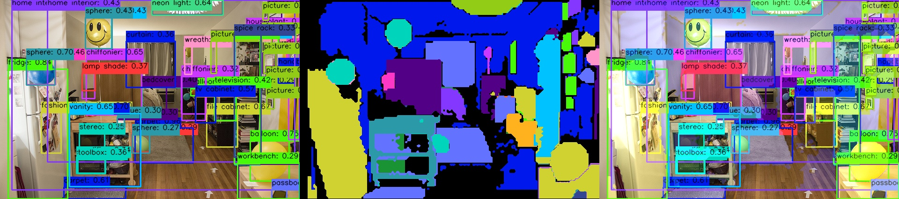
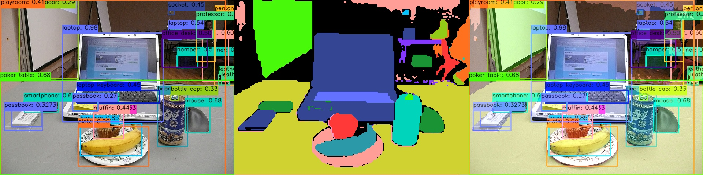
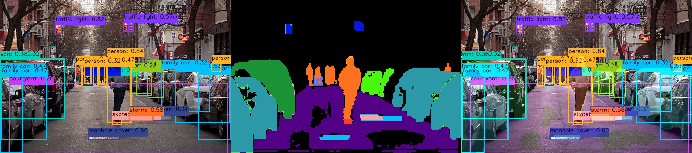

English | [简体中文](./README_cn.md)

# YOLOE-11 Instance Segmentation Prompt Free


[English](./README.md) | Simplified Chinese

# YOLOE-11 Instance Segmentation Prompt Free

- [YOLOE-11 Instance Segmentation Prompt Free](#yoloe-11-instance-segmentation-prompt-free)
- [YOLOE-11 Instance Segmentation Prompt Free](#yoloe-11-instance-segmentation-prompt-free-1)
  - [Introduction to YOLOE](#introduction-to-yoloe)
  - [Step Reference](#step-reference)
    - [Environment, Project Preparation](#environment-project-preparation)
    - [Export to ONNX](#export-to-onnx)
    - [Prepare Calibration Data](#prepare-calibration-data)
    - [PTQ Scheme Quantization Conversion](#ptq-scheme-quantization-conversion)
  - [Model Training](#model-training)
  - [Performance Data](#performance-data)
    - [RDK X5 \& RDK X5 Module](#rdk-x5--rdk-x5-module)
    - [Testing Method](#testing-method)
  - [Feedback](#feedback)
  - [References](#references)


## Introduction to YOLOE


YOLOE (You Only Look Once Everything), a novel advancement in zero-shot, promptable YOLO models designed for open-vocabulary detection and segmentation. Unlike previous YOLO models limited to fixed categories, YOLOE leverages textual, visual, or internal vocabulary prompts to achieve real-time detection of any object category. Built upon YOLOv10 and inspired by YOLO-World, YOLOE achieves state-of-the-art zero-shot performance with minimal impact on speed and accuracy.

Refer to the Tsinghua paper: https://arxiv.org/pdf/2503.07465v1

Demo for RDK X5 & RDK X5 Module 




This directory attempts to export its Prompt Free model, capable of detecting 4585 categories without needing input text prompts, and performs instance segmentation.

Note: This case is exploratory, intended for community reference only, not optimized deeply, does not represent the final effect of any commercial mass production delivery, nor the upper limit of board application development.


## Step Reference

Note: Any errors such as "No such file or directory", "No module named 'xxx'", "command not found" etc., please check carefully. Do not copy commands blindly; if you do not understand the modification process, start learning from YOLOv5 at the developer community.
### Environment, Project Preparation
- Download the `ultralytics/ultralytics` repository and set up the environment according to the official YOLO11 documentation.
```bash
git clone https://github.com/ultralytics/ultralytics.git
```
- Enter the local repository and download the official pre-trained weights. Here we use the yoloe-11s-seg model as an example:
```bash
cd ultralytics
wget https://github.com/ultralytics/assets/releases/download/v8.3.0/yoloe-11s-seg.pt
```

### Export to ONNX
Run the following Python script which automatically replaces relevant modules without retraining.
```bash
python3 cauchy_yoloe11segPF_export.py
```
```python
# Copyright (c) 2025，WuChao D-Robotics.
# Licensed under the Apache License, Version 2.0 (the "License");

from ultralytics import YOLO
from types import MethodType
import torch.nn as nn

# Initialize a YOLOE model
model = YOLO("yoloe-11s-seg-pf.pt")

# replace some module without retraining
def linear2conv(linear):
    assert isinstance(linear, nn.Linear), "Input must be a Linear layer."
    conv = nn.Conv2d(
        in_channels=linear.in_features, 
        out_channels=linear.out_features,
        kernel_size=1,
        stride=1,
        padding=0,
        bias=True if linear.bias is not None else False 
    )
    conv.weight.data = linear.weight.view(linear.out_features, linear.in_features, 1, 1).data
    conv.bias.data = linear.bias.data if linear.bias is not None else conv.bias.data
    return conv

def cauchy_rdk_forward(self, x, text): # RDK
    results = []
    for i in range(self.nl):
        results.append(self.lrpc[i].vocab(self.cv3[i](x[i])).permute(0, 2, 3, 1).contiguous())
        results.append(self.lrpc[i].loc(self.cv2[i](x[i])).permute(0, 2, 3, 1).contiguous())
        results.append(self.cv5[i](x[i]).permute(0, 2, 3, 1).contiguous())
    results.append(self.proto(x[0]).permute(0, 2, 3, 1).contiguous())
    return results

model.model.model[23].lrpc[0].vocab = linear2conv(model.model.model[23].lrpc[0].vocab)
model.model.model[23].lrpc[1].vocab = linear2conv(model.model.model[23].lrpc[1].vocab)
model.model.model[23].forward = MethodType(cauchy_rdk_forward, model.model.model[23])

# save names
names = ""
for value in model.names.values():
    print(value)
    names += f"{value}\n"

with open("model_names.txt", "w", encoding="utf-8") as file:
    file.write(names)
print("model_names.txt saved.")

# export
model.export(imgsz=640, format='onnx', simplify=True, opset=11)
```

### Prepare Calibration Data
Refer to the minimalist calibration data preparation script provided by the RDK Model Zoo: `https://github.com/D-Robotics/rdk_model_zoo/blob/main/demos/tools/generate_calibration_data/generate_calibration_data.py` for preparing calibration data.

### PTQ Scheme Quantization Conversion

```bash
(bpu_docker) $ hb_mapper makertbin --model-type onnx --config config_yolo11e_seg_pf_bayese_640x640_nv12.yaml
```

## Model Training

- For model training, refer to the official ultralytics documentation, maintained with high quality. There are also numerous references available online, making it not difficult to obtain a pre-trained weight model similar to the official one.
- Note that no program modifications or forward method changes are required during training.


## Performance Data

### RDK X5 & RDK X5 Module
Instance Segmentation (COCO)
| Model | Size (pixels) | Number of Classes | Parameters(M)/FLOPs(B) | BPU Latency/BPU Throughput (threads) | Post-processing Time<br/>(Python) |
|---------|---------|-------|---------|---------|----------|
| YOLOE-11S-Seg | 640×640 | 4585 | 13.69 M | 142.9 ms / 7.0 FPS (1 thread  ) <br/> 149.5 ms / 13.3 FPS (2 threads) <br/> 167.4 ms / 17.8 FPS (3 threads)  | 300 ms |

### Testing Method
1. BPU Latency and Throughput.
- Single-thread latency represents single frame, single thread, single BPU core delay, ideal for a single inference task on BPU.
- Multi-thread frame rates involve multiple threads simultaneously feeding tasks to the BPU, where each BPU core handles tasks from multiple threads. Generally, 4 threads can maintain low frame delay while maximizing BPU usage to 100%, achieving a good balance between throughput (FPS) and frame delay. The X5's BPU is generally powerful enough that 2 threads can maximize its performance, offering excellent frame delay and throughput.
- Tables usually record data until throughput no longer significantly increases with more threads.
- BPU latency and throughput are tested on-board using the following commands:
```bash
hrt_model_exec perf --thread_num 2 --model_file yolov8n_detect_bayese_640x640_nv12_modified.bin

python3 ../../../../demos/tools/batch_perf/batch_perf.py --max 3 --file ptq_models
```
2. Test boards are all in their optimal state.
- X5 is in its best state: CPU is 8 × A55@1.8G, full-core Performance scheduling, BPU is 1 × Bayes-e@10TOPS.
```bash
sudo bash -c "echo 1 > /sys/devices/system/cpu/cpufreq/boost"  # CPU: 1.8Ghz
sudo bash -c "echo performance > /sys/devices/system/cpu/cpufreq/policy0/scaling_governor" # 
```

## Feedback
For any unclear expressions, welcome to ask questions and exchange ideas at the Digua Developer Community.

[Digua Robotics Developer Community](developer.d-robotics.cc).

## References

[ultralytics](https://docs.ultralytics.com/)