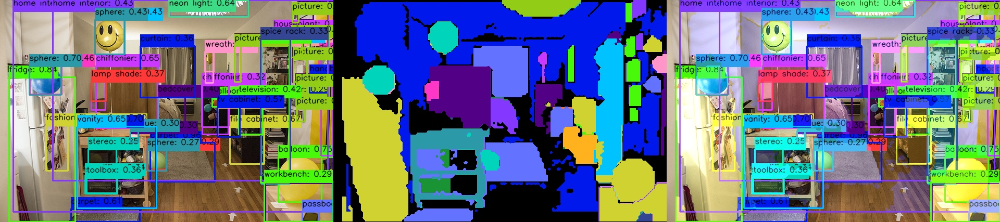
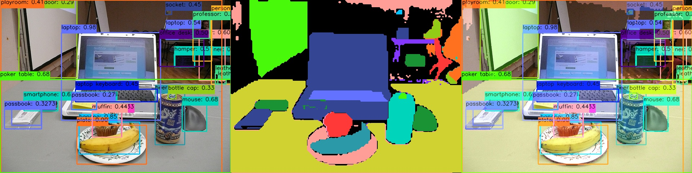
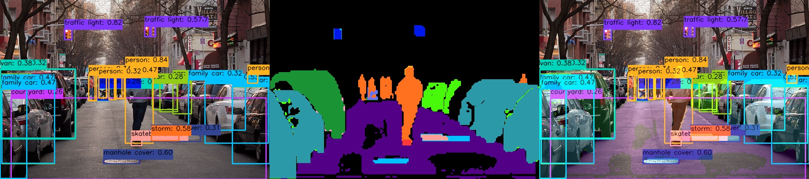

[English](./README.md) | 简体中文

# YOLOE-11 Instance Segmentation Prompt Free

- [YOLOE-11 Instance Segmentation Prompt Free](#yoloe-11-instance-segmentation-prompt-free)
  - [YOLOE介绍](#yoloe介绍)
  - [步骤参考](#步骤参考)
    - [环境、项目准备](#环境项目准备)
    - [导出为onnx](#导出为onnx)
    - [准备校准数据](#准备校准数据)
    - [PTQ方案量化转化](#ptq方案量化转化)
  - [模型训练](#模型训练)
  - [性能数据](#性能数据)
    - [RDK X5 \& RDK X5 Module](#rdk-x5--rdk-x5-module)
    - [测试方法](#测试方法)
  - [反馈](#反馈)
  - [参考](#参考)


## YOLOE介绍


YOLOE（实时看见一切）是零样本、可提示的 YOLO 模型的一项新进展，专为开放词汇检测和分割设计。与以往只能局限于固定类别的 YOLO 模型不同，YOLOE 使用文本、图像或内部词汇提示，能够实现实时检测任何对象类别。YOLOE 基于 YOLOv10 构建，并受到 YOLO-World 的启发，在几乎不影响速度和精度的情况下实现了最先进的零样本性能。

清华的论文: https://arxiv.org/pdf/2503.07465v1

本目录尝试导出其Prompt Free的模型, 不需要输入文本的提示词, 可以检测4585个类别, 并对其进行实例分割, RDK X5 运行效果参考以下图, 可以观察到, 感知到的信息还是非常丰富的.






注: 本案例为探索性案例, 仅供社区参考, 未做深入优化, 不代表任何商业量产交付的最终效果, 不代表板卡应用开发的上限.


## 步骤参考

注：任何No such file or directory, No module named "xxx", command not found.等报错请仔细检查，请勿逐条复制运行，如果对修改过程不理解请前往开发者社区从YOLOv5开始了解。
### 环境、项目准备
 - 下载`ultralytics/ultralytics`仓库，并参考YOLO11官方文档，配置好环境
```bash
git clone https://github.com/ultralytics/ultralytics.git
```
 - 进入本地仓库，下载官方的预训练权重，这里以yoloe-11s-seg模型为例
```bash
cd ultralytics
wget https://github.com/ultralytics/assets/releases/download/v8.3.0/yoloe-11s-seg.pt
```
### 导出为onnx

使用RDK Model Zoo提供的导出脚本：`https://github.com/D-Robotics/rdk_model_zoo/blob/main/demos/Seg/YOLOE-11-Seg-Prompt-Free/YOLOE-11-Seg-Prompt-Free_YUV420SP/cauchy_yoloe11segPF_export.py`，该脚本内会自动等价替换相关模块, 并且不需要重新训练.

```bash
python3 cauchy_yoloe11segPF_export.py
```

### 准备校准数据
参考RDK Model Zoo提供的极简的校准数据准备脚本：`https://github.com/D-Robotics/rdk_model_zoo/blob/main/demos/tools/generate_calibration_data/generate_calibration_data.py `进行校准数据的准备。

### PTQ方案量化转化
在OpenExplore的Docker中, 使用hb_mapper工具进行量化转化.

```bash
(bpu_docker) $ hb_mapper makertbin --model-type onnx --config config_yolo11e_seg_pf_bayese_640x640_nv12.yaml
```

## 模型训练

 - 模型训练请参考ultralytics官方文档，这个文档由ultralytics维护，质量非常的高。网络上也有非常多的参考材料，得到一个像官方一样的预训练权重的模型并不困难。
 - 请注意，训练时无需修改任何程序，无需修改forward方法。


## 性能数据

### RDK X5 & RDK X5 Module
实例分割 Instance Segmentation (COCO)
| 模型 | 尺寸(像素) | 类别数 | 参数量(M)/FLOPs(B) |  BPU延迟/BPU吞吐量(线程) |  后处理时间<br/>(C/C++) |
| 模型 | 尺寸(像素) | 类别数 | 参数量(M)/FLOPs(B) |  BPU延迟/BPU吞吐量(线程) |  后处理时间<br/>(Python) |
|---------|---------|-------|---------|---------|----------|
YOLOE-11S-Seg | 640×640 | 4585 | 13.69 M | 142.9 ms / 7.0 FPS (1 thread  ) <br/> 149.5 ms / 13.3 FPS (2 threads) <br/> 167.4 ms / 17.8 FPS (3 threads)  | 300 ms |

### 测试方法
1. BPU延迟与BPU吞吐量。
 - 单线程延迟为单帧,单线程,单BPU核心的延迟,BPU推理一个任务最理想的情况。
 - 多线程帧率为多个线程同时向BPU塞任务, 每个BPU核心可以处理多个线程的任务, 一般工程中4个线程可以控制单帧延迟较小,同时吃满所有BPU到100%,在吞吐量(FPS)和帧延迟间得到一个较好的平衡。X5的BPU整体比较厉害, 一般2个线程就可以将BPU吃满, 帧延迟和吞吐量都非常出色。
 - 表格中一般记录到吞吐量不再随线程数明显增加的数据。
 - BPU延迟和BPU吞吐量使用以下命令在板端测试
```bash
hrt_model_exec perf --thread_num 2 --model_file yolov8n_detect_bayese_640x640_nv12_modified.bin

python3 ../../../../demos/tools/batch_perf/batch_perf.py --max 3 --file ptq_models
```
2. 测试板卡均为最佳状态。
 - X5的状态为最佳状态：CPU为8 × A55@1.8G, 全核心Performance调度, BPU为1 × Bayes-e@10TOPS.
```bash
sudo bash -c "echo 1 > /sys/devices/system/cpu/cpufreq/boost"  # CPU: 1.8Ghz
sudo bash -c "echo performance > /sys/devices/system/cpu/cpufreq/policy0/scaling_governor" # 
```

## 反馈
本文如果有表达不清楚的地方欢迎前往地瓜开发者社区进行提问和交流.

[地瓜机器人开发者社区](developer.d-robotics.cc).

## 参考

[ultralytics](https://docs.ultralytics.com/)