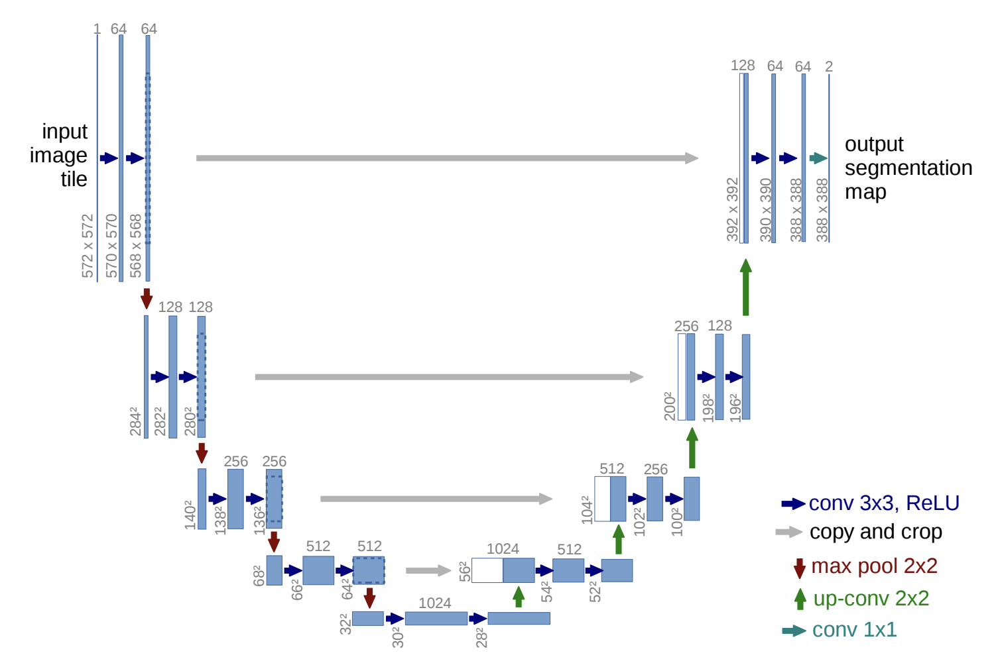

[English](./README.md) | 简体中文

# UNet 语义分割

- [UNet 语义分割](#unet-语义分割)
  - [UNet介绍](#UNet介绍)
  - [输入输出数据](#输入输出数据)
  - [网络结构](#网络结构)
  - [公版处理流程](#公版处理流程)
  - [优化处理流程](#优化处理流程)
  - [步骤参考](#步骤参考)
    - [环境、项目准备](#环境项目准备)
    - [导出为onnx](#导出为onnx)
    - [PTQ方案量化转化](#ptq方案量化转化)
    - [移除输出层的反量化节点](#移除输出层的反量化节点)
    - [使用hb\_perf命令对bin模型进行可视化, hrt\_model\_exec命令检查bin模型的输入输出情况](#使用hb_perf命令对bin模型进行可视化-hrt_model_exec命令检查bin模型的输入输出情况)
    - [部分编译日志参考](#部分编译日志参考)
  - [模型训练](#模型训练)
  - [性能数据](#性能数据)
    - [RDK X5 \& RDK X5 Module](#rdk-x5--rdk-x5-module-1)
    - [RDK X3 \& RDK X3 Module](#rdk-x3--rdk-x3-module-1)
  - [反馈](#反馈)
  - [参考](#参考)


## UNet介绍
UNet是一种用于生物医学图像分割的卷积神经网络，由Olaf Ronneberger、Philipp Fischer和Thomas Brox于2015年在德国弗莱堡大学提出。UNet以其独特的U型结构（编码器-解码器架构配合跳跃连接）和高精度分割能力而闻名。

 - **编码器（Encoder）**：使用卷积和池化操作逐步提取特征并降低空间维度，捕获上下文信息。
 - **解码器（Decoder）**：通过上采样和卷积操作恢复空间分辨率，实现精确定位。
 - **跳跃连接（Skip Connections）**：将编码器中的高分辨率特征与解码器中的特征拼接，保留细节信息，提高分割精度。
 - **应用场景**：最初用于医学图像分割（如细胞分割、肿瘤检测），现已广泛应用于卫星图像分割、工业缺陷检测、自动驾驶场景理解等领域。

## 参考模型下载地址
见: `./model`文件夹

## 输入输出数据
- Input: 1x3x512x512, dtype=UINT8 (支持NV12格式输入)
- Output 0: [1, 512, 512, 21], dtype=INT32 

## 网络结构

UNet采用经典的编码器-解码器架构：

```
输入图像 (3×512×512)
    ↓
编码器路径 (下采样)
  - Conv + ReLU
  - MaxPool (×4次，分辨率减半，通道数倍增)
    ↓
瓶颈层 (Bottleneck)
  - 最深层特征提取
    ↓
解码器路径 (上采样)
  - UpConv/Resize + Concat (跳跃连接)
  - Conv + ReLU (×4次，分辨率倍增，通道数减半)
    ↓
输出层
  - 1×1 Conv (映射到类别数)
  - Softmax/Argmax 
```

## 公版处理流程


标准UNet流程：
1. 图像预处理：归一化、调整尺寸至512×512
2. 网络推理：通过编码器-解码器结构提取特征并生成分割图
3. 后处理：Softmax获取概率图或Argmax获取类别索引
4. 可视化：将分割结果映射为彩色图像

## 步骤参考

注：任何No such file or directory, No module named "xxx", command not found.等报错请仔细检查，请勿逐条复制运行，如果对修改过程不理解请前往开发者社区了解。
### 环境、项目准备
 - 下载UNet实现仓库，这里以标准的PyTorch实现为例
```bash
git clone https://github.com/bubbliiiing/unet-pytorch.git
cd unet-pytorch
```
 - 安装依赖
```bash
pip install -r requirements.txt
```

### 导出为onnx
修改 `predict.py` 中的 `mode`为`export_onnx`

 - 运行导出脚本
```bash
python predict.py
```

### PTQ方案量化转化
 - 参考天工开物工具链手册和OE包，对模型进行检查，所有算子均在BPU上，进行编译即可。对应的yaml文件在`./ptq_yamls`目录下。
```bash
hb_mapper checker --model-type onnx --march bayes-e --model UNet_11.onnx
hb_mapper makertbin --model-type onnx --config unet_bernoulli2.yaml
```

### 移除输出层的反量化节点
 - 查看输出层的反量化节点名称
通过hb_mapper makerbin时的日志，看到大小为[1, 512, 512, 21]的输出的名称为output0。

```bash
ONNX IR version:          6                                                                                                                                                                                       
Opset version:            ['ai.onnx v11', 'horizon v1']                                                                                                                                                           
Producer:                 pytorch v2.10.0                                                                                                                                                                         
Domain:                   None                                                                                                                                                                                    
Model version:            None                                                                                                                                                                                    
Graph input:                                                                                                                                                                                                      
    images:               shape=[1, 3, 512, 512], dtype=FLOAT32                                                                                                                                                   
Graph output:                                                                                                                                                                                                     
    output:               shape=[1, 512, 512, 21], dtype=FLOAT32
```

 - 进入编译产物的目录
```bash
$ cd unet_bernoulli2_512x512_nv12
```
 - 查看可以被移除的反量化节点
```bash
$ hb_model_modifier unet_xxx.bin
```
 - 在生成的hb_model_modifier.log文件中，找到以下信息。主要是找到大小为[1, 512, 512, 21]的输出头的名称。
 此处的名称为：
 > "/final/Conv_output_0_HzDequantize"

```bash
2026-04-20 13:56:27,733 INFO log will be stored in /data/horizon_x3/data/unet/hb_model_modifier.log
2026-04-20 13:56:27,780 INFO Nodes that can be deleted: ['/final/Conv_output_0_HzDequantize']
```
 - 使用以下命令移除上述反量化节点, 注意, 导出时这些名称可能不同, 请仔细确认.
```bash
$ hb_model_modifier unet_cityscapes_bayese_512x512_nv12.bin \
-r "/final/Conv_output_0_HzDequantize"
```
 - 移除成功会显示以下日志
```bash
2026-04-20 14:05:05,063 INFO log will be stored in /data/horizon_x3/data/unet/hb_model_modifier.log
2026-04-20 14:05:05,110 INFO Nodes that will be removed from this model: ['/final/Conv_output_0_HzDequantize']
2026-04-20 14:05:05,110 INFO Node '/final/Conv_output_0_HzDequantize' found, its OP type is 'Dequantize'
2026-04-20 14:05:05,110 INFO scale: /final/Conv_x_scale; zero point: 0. node info details are stored in hb_model_modifier log file
2026-04-20 14:05:05,110 INFO Node '/final/Conv_output_0_HzDequantize' is removed
2026-04-20 14:05:05,337 INFO modified model saved as UNet-resnet-deploy_512x512_nv12_bernoulli/UNet-resnet-deploy_512x512_nv12_x3_modified.bin
```

 - 接下来得到的bin模型名称为UNet-resnet-deploy_512x512_nv12_x3_modified.bin, 这个是最终的模型.
  
### 使用hb_perf命令对bin模型进行可视化, hrt_model_exec命令检查bin模型的输入输出情况
 - 移除反量化系数前的bin模型
```bash
hb_perf UNet-resnet-deploy_512x512_nv12_bernoulli.bin
```
在`hb_perf_result`目录下可以找到可视化结果.

```bash
hrt_model_exec model_info --model_file UNet-resnet-deploy_512x512_nv12_x3.bin
```
可以看到这个移除反量化系数前的bin模型的输入输出信息
```bash
I0000 00:00:00.000000  2055 vlog_is_on.cc:197] RAW: Set VLOG level for "*" to 3
core[0] open!
core[1] open!
[HBRT] set log level as 0. version = 3.15.46.0
[HBRT] hbrtSetGlobalConfig, set bpu march to BERNOULLI2(4272728)
[DNN] Runtime version = 1.23.5_(3.15.46 HBRT)
[A][DNN][packed_model.cpp:248][Model](2026-04-20,14:41:43.540.657) [HorizonRT] The model builder version = 1.23.4
Load model to DDR cost 379.023ms.
This model file has 1 model:
[UNet-resnet-deploy_512x512_nv12_x3]
---------------------------------------------------------------------
[model name]: UNet-resnet-deploy_512x512_nv12_x3

input[0]: 
name: images
input source: HB_DNN_INPUT_FROM_PYRAMID
valid shape: (1,3,512,512,)
aligned shape: (1,3,512,512,)
aligned byte size: 393216
tensor type: HB_DNN_IMG_TYPE_NV12
tensor layout: HB_DNN_LAYOUT_NCHW
quanti type: NONE
stride: (0,0,0,0,)

output[0]: 
name: output
valid shape: (1,21,512,512,)
aligned shape: (1,21,512,512,)
aligned byte size: 22020096
tensor type: HB_DNN_TENSOR_TYPE_F32
tensor layout: HB_DNN_LAYOUT_NCHW
quanti type: NONE
stride: (22020096,1048576,2048,4,)

---------------------------------------------------------------------
```

 - 移除目标反量化系数后的bin模型
```bash
hb_perf UNet-resnet-deploy_512x512_nv12_bernoulli/UNet-resnet-deploy_512x512_nv12_x3_modified.bin
```

```bash
hrt_model_exec model_info --model_info UNet-resnet-deploy_512x512_nv12_bernoulli/UNet-resnet-deploy_512x512_nv12_x3_modified.bin
```
可以看到移除反量化节点后的模型信息, 以及存储的反量化系数.
```bash
I0000 00:00:00.000000  2068 vlog_is_on.cc:197] RAW: Set VLOG level for "*" to 3
core[0] open!
core[1] open!
[HBRT] set log level as 0. version = 3.15.46.0
[HBRT] hbrtSetGlobalConfig, set bpu march to BERNOULLI2(4272728)
[DNN] Runtime version = 1.23.5_(3.15.46 HBRT)
[A][DNN][packed_model.cpp:248][Model](2026-04-20,14:45:15.978.243) [HorizonRT] The model builder version = 1.23.4
Load model to DDR cost 306.635ms.
This model file has 1 model:
[UNet-resnet-deploy_512x512_nv12_x3]
---------------------------------------------------------------------
[model name]: UNet-resnet-deploy_512x512_nv12_x3

input[0]: 
name: images
input source: HB_DNN_INPUT_FROM_PYRAMID
valid shape: (1,3,512,512,)
aligned shape: (1,3,512,512,)
aligned byte size: 393216
tensor type: HB_DNN_IMG_TYPE_NV12
tensor layout: HB_DNN_LAYOUT_NCHW
quanti type: NONE
stride: (0,0,0,0,)

output[0]: 
name: output
valid shape: (1,21,512,512,)
aligned shape: (1,21,512,512,)
aligned byte size: 22020096
tensor type: HB_DNN_TENSOR_TYPE_S32
tensor layout: HB_DNN_LAYOUT_NCHW
quanti type: SCALE
stride: (22020096,1048576,2048,4,)
scale data: 0.00046273,0.00109842,0.00104222,0.000667546,0.000869199,0.00061894,0.000700378,0.000699254,0.000631821,0.000553886,0.000766205,0.00073237,0.000853829,0.000750434,0.000537595,0.000578083,0.000891571,0.000716755,0.000626697,0.000812128,0.00110989,
quantizeAxis: 1

---------------------------------------------------------------------
```


### 部分编译日志参考

可以看到, 这是一个BPU算子率100%的模型.
```bash
====================================================================================================================================
Node                                                ON   Subgraph  Type              Cosine Similarity  Threshold   In/Out DataType  
-------------------------------------------------------------------------------------------------------------------------------------
HZ_PREPROCESS_FOR_images                            BPU  id(0)     HzPreprocess      0.999995           127.000000  int8/int8        
/conv1/Conv                                         BPU  id(0)     Conv              0.999562           1.013355    int8/int8        
/maxpool/MaxPool                                    BPU  id(0)     MaxPool           0.999438           3.359458    int8/int8        
/layer1/layer1.0/conv1/Conv                         BPU  id(0)     Conv              0.998974           3.359458    int8/int8        
/layer1/layer1.0/conv2/Conv                         BPU  id(0)     Conv              0.998197           1.305064    int8/int8        
/layer1/layer1.0/conv3/Conv                         BPU  id(0)     Conv              0.997957           2.030451    int8/int8        
/layer1/layer1.0/downsample/downsample.0/Conv       BPU  id(0)     Conv              0.999356           3.359458    int8/int8        
/layer1/layer1.1/conv1/Conv                         BPU  id(0)     Conv              0.992931           1.898905    int8/int8        
/layer1/layer1.1/conv2/Conv                         BPU  id(0)     Conv              0.987306           1.335431    int8/int8        
/layer1/layer1.1/conv3/Conv                         BPU  id(0)     Conv              0.986722           2.946419    int8/int8        
/layer1/layer1.2/conv1/Conv                         BPU  id(0)     Conv              0.985223           2.319801    int8/int8        
/layer1/layer1.2/conv2/Conv                         BPU  id(0)     Conv              0.982107           1.243415    int8/int8        
/layer1/layer1.2/conv3/Conv                         BPU  id(0)     Conv              0.973119           3.548386    int8/int8        
/layer2/layer2.0/conv1/Conv                         BPU  id(0)     Conv              0.976369           2.157930    int8/int8        
/layer2/layer2.0/conv2/Conv                         BPU  id(0)     Conv              0.984657           1.354403    int8/int8        
/layer2/layer2.0/conv3/Conv                         BPU  id(0)     Conv              0.977477           1.491932    int8/int8        
/layer2/layer2.0/downsample/downsample.0/Conv       BPU  id(0)     Conv              0.988449           2.157930    int8/int8        
/layer2/layer2.1/conv1/Conv                         BPU  id(0)     Conv              0.996199           1.641783    int8/int8        
/layer2/layer2.1/conv2/Conv                         BPU  id(0)     Conv              0.995920           0.884238    int8/int8        
/layer2/layer2.1/conv3/Conv                         BPU  id(0)     Conv              0.994623           1.603424    int8/int8        
/layer2/layer2.2/conv1/Conv                         BPU  id(0)     Conv              0.990412           1.919210    int8/int8        
/layer2/layer2.2/conv2/Conv                         BPU  id(0)     Conv              0.990391           0.914774    int8/int8        
/layer2/layer2.2/conv3/Conv                         BPU  id(0)     Conv              0.986399           0.885644    int8/int8        
/layer2/layer2.3/conv1/Conv                         BPU  id(0)     Conv              0.988771           1.948690    int8/int8        
/layer2/layer2.3/conv2/Conv                         BPU  id(0)     Conv              0.989107           1.000571    int8/int8        
/layer2/layer2.3/conv3/Conv                         BPU  id(0)     Conv              0.986791           1.038042    int8/int8        
/layer3/layer3.0/conv1/Conv                         BPU  id(0)     Conv              0.986691           2.022372    int8/int8        
/layer3/layer3.0/conv2/Conv                         BPU  id(0)     Conv              0.986085           1.551270    int8/int8        
/layer3/layer3.0/conv3/Conv                         BPU  id(0)     Conv              0.978635           1.275543    int8/int8        
/layer3/layer3.0/downsample/downsample.0/Conv       BPU  id(0)     Conv              0.989848           2.022372    int8/int8
...
.../Relu_output_0_calibrated_0.05978_TO_FUSE_SCALE  BPU  id(0)     HzSQuantizedConv                                 int8/int8        
/up_concat3/Concat                                  BPU  id(0)     Concat            0.993853           2.022372    int8/int8        
/up_concat3/conv1/Conv                              BPU  id(0)     Conv              0.998320           7.592683    int8/int8        
/up_concat3/conv2/Conv                              BPU  id(0)     Conv              0.998347           32.350964   int8/int8        
/up_concat2/up/Resize                               BPU  id(0)     Resize            0.997129           18.709902   int8/int8        
.../Relu_output_0_calibrated_0.14732_TO_FUSE_SCALE  BPU  id(0)     HzSQuantizedConv                                 int8/int8        
/up_concat2/Concat                                  BPU  id(0)     Concat            0.996761           2.157930    int8/int8        
/up_concat2/conv1/Conv                              BPU  id(0)     Conv              0.998679           18.709902   int8/int8        
/up_concat2/conv2/Conv                              BPU  id(0)     Conv              0.998735           59.616806   int8/int8        
/up_concat1/up/Resize                               BPU  id(0)     Resize            0.998410           44.007637   int8/int8        
.../Relu_output_0_calibrated_0.34652_TO_FUSE_SCALE  BPU  id(0)     HzSQuantizedConv                                 int8/int8        
/up_concat1/Concat                                  BPU  id(0)     Concat            0.998253           3.359458    int8/int8        
/up_concat1/conv1/Conv                              BPU  id(0)     Conv              0.998826           44.007637   int8/int8        
/up_concat1/conv2/Conv                              BPU  id(0)     Conv              0.998323           55.837200   int8/int8        
/up_conv/up_conv.0/Resize                           BPU  id(0)     Resize            0.998139           67.128563   int8/int8        
/up_conv/up_conv.1/Conv                             BPU  id(0)     Conv              0.998534           67.128563   int8/int8        
/up_conv/up_conv.3/Conv                             BPU  id(0)     Conv              0.998149           74.564735   int8/int8        
/final/Conv                                         BPU  id(0)     Conv              0.998469           54.988548   int8/int32
```


## 模型训练

 - 模型训练请参考原始UNet仓库文档或相关PyTorch教程。UNet训练通常使用交叉熵损失或Dice损失，数据增强包括随机翻转、旋转、弹性形变等。
 - 请注意，训练时无需修改任何程序，保持标准的前向传播逻辑。
 - 对于医学图像分割，建议使用二分类（背景+目标）；对于场景理解（如Cityscapes），使用多分类。

## 性能数据

### RDK X5 & RDK X5 Module
语义分割 Semantic Segmentation (VOC)
| 模型 | 尺寸(像素) | 类别数 | 参数量 | 吞吐量(单线程) <br/> 吞吐量(多线程) | 后处理时间(Python) | 
|---------|---------|-------|---------|--------------------|--------------------|
| UNet-resnet50 | 512×512 | 20 | 43.93 M | 11.23 FPS (1 thread) <br/> 13.23 FPS (2 threads) <br/> 13.23 (8 threads)| 267.08 ms |

### RDK X3 & RDK X3 Module
语义分割 Semantic Segmentation (VOC)
| 模型 | 尺寸(像素) | 类别数 | 参数量 | 吞吐量(单线程) <br/> 吞吐量(多线程) | 后处理时间(Python) | 
|---------|---------|-------|---------|--------------------|--------------------|
| UNet-resnet50 | 512×512 | 20 | 43.93 M | 2.61 FPS (1 thread) <br/> 5.17 FPS (2 threads) <br/> 5.21 FPS (4 threads) | 361.96 ms |

```bash
hrt_model_exec perf --thread_num 8 --model_file UNet-resnet-deploy_512x512_nv12_x3_modified.bin
```
 测试板卡均为最佳状态。
 - X5的状态为最佳状态：CPU为8 × A55@1.8G, 全核心Performance调度, BPU为1 × Bayes-e@10TOPS.
```bash
sudo bash -c "echo 1 > /sys/devices/system/cpu/cpufreq/boost"  # 1.8Ghz
sudo bash -c "echo performance > /sys/devices/system/cpu/cpufreq/policy0/scaling_governor" # Performance Mode
```
 - X3的状态为最佳状态：CPU为4 × A53@1.8G, 全核心Performance调度, BPU为2 × Bernoulli2@5TOPS.
```bash
sudo bash -c "echo 1 > /sys/devices/system/cpu/cpufreq/boost"  # 1.8Ghz
sudo bash -c "echo performance > /sys/devices/system/cpu/cpufreq/policy0/scaling_governor" # Performance Mode
```
关于后处理: 目前在X5上使用Python重构的后处理（包括Softmax和Argmax）, 仅需要单核心单线程串行3-5ms左右即可完成, 也就是说只需要占用1-2个CPU核心, 每分钟可处理数百帧图像的后处理, 后处理不会构成瓶颈.

## 反馈
本文如果有表达不清楚的地方欢迎前往地瓜开发者社区进行提问和交流.

[地瓜机器人开发者社区](developer.d-robotics.cc).

## 参考

[Pytorch-UNet](https://github.com/bubbliiiing/unet-pytorch)
