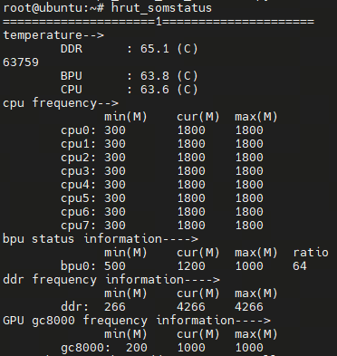
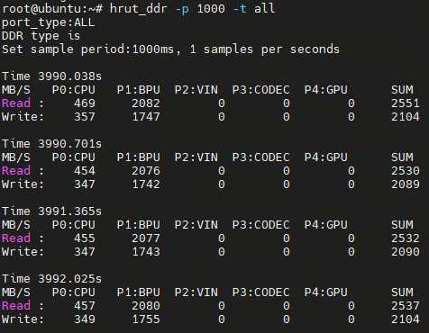
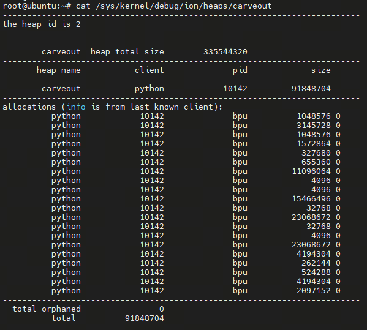

# 1. 模型简介

MODNet（**Mobile-friendly One-stage Deep Image Matting Network**）是一种面向真实应用场景优化设计的高效图像抠图算法，核心目标是在保证抠图质量的前提下，实现低计算量、低延迟和易部署。与传统依赖多阶段处理或人工提供 trimap 的抠图方法不同，MODNet 采用一阶段端到端网络结构，仅输入单张 RGB 图像即可直接预测高质量的 Alpha Matte，大幅降低了使用门槛和系统复杂度。

在网络设计上，MODNet 将语义感知、边缘细节建模和背景建模进行解耦与协同，通过多个子分支分别关注前景语义区域、精细边缘结构以及背景一致性，使模型在复杂背景、光照变化以及细小结构（如头发、毛发、半透明区域）中依然能够保持稳定和自然的抠图效果。同时，其整体架构充分考虑了移动端和嵌入式设备的资源约束，在参数量和计算复杂度上进行了有效控制，具备良好的实时性能。

得益于上述特性，MODNet 非常适合部署在端侧设备、实时视频处理和交互式应用中，已被广泛应用于人像抠图、视频会议虚拟背景、内容创作、智能终端和边缘 AI 等场景，在抠图质量、性能和工程可落地性之间取得了良好的平衡。


# 2. ONNX工具链转换

我们将onnx模型与校准数据放入工具链进行模型转换，从onnx模型转换为bin模型，得到如下结果：


# 3. 板端指标


在完成工具链的步骤后，我们得到.bin格式的模型，该格式为可以在RDK X5上部署的异构模型，支持使用BPU算力。

我们使用hrt\_model\_exec工具进行模型性能测试。

```plain&#x20;text
hrt_model_exec perf --model_file modenet.bin --frame_count 100 --thread_num 1
```

我们使用参数thread\_num来调整线程数，得到不同的结果

最终得到如下表格：

| 线程数 | 总帧数 | 总时延（ms）  | 平均时延（ms） | FPS   |
| --- | --- | -------- | -------- | ----- |
| 1   | 100 | 8988.30  | 89.88    | 11.12 |
| 2   | 100 | 13049.52 | 130.49   | 15.27 |
| 4   | 100 | 25851.13 | 258.51   | 15.28 |
| 8   | 100 | 50692.29 | 506.92   | 15.27 |

**BPU利用率：64%**



**带宽：**



**ION占用率：87.6MB**



# 4. 案例展示

Python推荐使用3.10，我们使用3.10.12，随后进行相关依赖的安装：

```
pip install -r requirements.txt
```

案例运行，只需要运行：

```plain&#x20;text
python main.py
```


随后可以看到上面的界面，我们点击\`选择原图\`按钮，即选择带有人像，需要进行抠图的图片。

随后点击\`选择背景\`按钮，即我们希望合成的背景。

最后点击\`开始合成\`按钮，将抠出来的人像与背景图相结合。

以下是更多参考案例：


