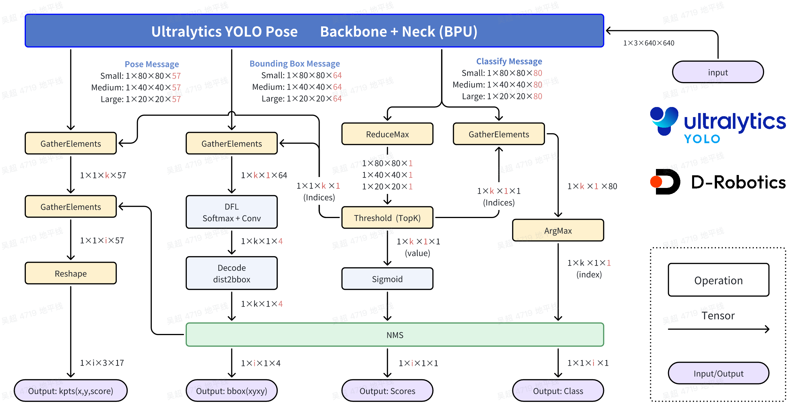

English| [简体中文](./README_cn.md)


# Ultralytics YOLO: You Only Look Once

## Contributors

 - Cauchy @吴超
 - SkyXZ @熊旗
 - Marcelo @马超
 - Suai @苏明超

## Summary
```bash
D-Robotics OpenExplore(RDK X5, Bayes-e BPU) Version: >= 1.2.8
Ultralytics YOLO Version: >= 8.3.0
Ubuntu 22.04
Python 3.10
```

## Suggestions

1. Before reading this article, please ensure you have a basic understanding of Linux systems, some foundational knowledge in machine learning or deep learning, and basic development skills in Python or C/C++. Carefully check for any errors such as `No such file or directory`, `No module named "xxx"`, `command not found`, `permission denied`, `SyntaxError: invalid syntax`, etc. Do not copy and run commands line by line without understanding.

2. Please make sure you have thoroughly read the first three chapters of the RDK manual, and have also experienced the OpenExplore package and the BPU algorithm toolchain manual's introductory sections. Successfully convert 1–2 of your preferred preset ONNX models using the OpenExplore package.

3. Please note that the community code is collaboratively developed with developers over the long term and has not undergone the same rigorous testing as commercial releases. Due to limited author capacity and resources, we cannot currently guarantee long-term stable operation. If you have better ideas, we welcome your issues and pull requests (PRs).

4. Please note that Ultralytics YOLO is licensed under the AGPL-3.0 license. Use it in compliance with the relevant license terms. For more information, please refer to: [https://www.ultralytics.com/license](https://www.ultralytics.com/license)

## Introduction to YOLO


YOLO (You Only Look Once) is a popular object detection and image segmentation model developed by Joseph Redmon and Ali Farhadi of the University of Washington. YOLO was introduced in 2015 and quickly gained popularity due to its high speed and accuracy.

 - YOLOv2, released in 2016, improved upon the original model by incorporating batch normalization, anchor boxes, and dimension clustering.
 - YOLOv3: The third iteration of the YOLO model family, originally by Joseph Redmon, known for its efficient real-time object detection capabilities.
 - YOLOv4: A darknet-native update to YOLOv3, released by Alexey Bochkovskiy in 2020.
 - YOLOv5: An improved version of the YOLO architecture by Ultralytics, offering better performance and speed trade-offs compared to previous versions.
 - YOLOv6: Released by Meituan in 2022, and in use in many of the company's autonomous delivery robots.
 - YOLOv7: Updated YOLO models released in 2022 by the authors of YOLOv4.
 - YOLOv8: The latest version of the YOLO family, featuring enhanced capabilities such as instance segmentation, pose/keypoints estimation, and classification.
 - YOLOv9: An experimental model trained on the Ultralytics YOLOv5 codebase implementing Programmable Gradient Information (PGI).
 - YOLOv10: By Tsinghua University, featuring NMS-free training and efficiency-accuracy driven architecture, delivering state-of-the-art performance and latency.
 - YOLO11 🚀: Ultralytics' latest YOLO models delivering state-of-the-art (SOTA) performance across multiple tasks.
 - YOLO12 builds a YOLO framework centered around attention mechanisms, employing innovative methods and architectural improvements to break the dominance of CNN models within the YOLO series. This enables real-time object detection with faster inference speeds and higher detection accuracy.
 - YOLO13 is a new generation of real-time object detection model developed by the Intelligent Media and Cognition Laboratory at Tsinghua University, featuring excellent performance and efficiency. Its core technologies include HyperACE (Hypergraph-based Adaptive Correlation Enhancement), FullPAD (Full-Pipeline Aggregation-and-Distribution Paradigm), and lightweight convolution replacement. HyperACE explores high-order correlations among pixels through a hypergraph structure, enhancing multi-scale feature fusion. FullPAD achieves fine-grained information flow and representational synergy across the entire network pipeline. The lightweight design reduces computational cost while maintaining the receptive field, thereby accelerating inference speed. Experiments show that YOLOv13 performs exceptionally well on the COCO dataset, outperforming existing models in terms of accuracy, speed, and parameter efficiency.


## Support Models

### Obeject Detection

```bash
- YOLOv5u - Detect, Size: n, s, m, l, x
- YOLOv8  - Detect, Size: n, s, m, l, x
- YOLov9  - Detect, Size: t, s, m, c, e
- YOLOv10 - Detect, Size: n, s, m, b, l, x
- YOLO11  - Detect, Size: n, s, m, l, x
- YOLO12  - Detect, Size: n, s, m, l, x
- YOLO13  - Detect, Size: n, s,    l, x
```

### Instance Segmentation

```bash
YOLOv8 - Seg, Size: n, s, m, l, x
YOLOv9 - Seg, Size:          c, e
YOLO11 - Seg, Size: n, s, m, l, x
```

### Pose Estimation

```bash
YOLOv8 - Pose, Size: n, s, m, l, x
YOLO11 - Pose, Size: n, s, m, l, x
```

### Image Classification

```bash
YOLOv8 - CLS, Size: n, s, m, l, x
YOLO11 - CLS, Size: n, s, m, l, x
```

## Quick Experience

```bash
# Download RDK Model Zoo
https://github.com/D-Robotics/rdk_model_zoo

# Clone this repo (Optional)
git clone https://github.com/D-Robotics/rdk_model_zoo.git

# Make Sure your are in this file
$ cd demos/Vision/ultralytics_YOLO

# Check your workspace
$ tree -L 2
.
├── py
│   ├── eval_batch.py
│   ├── eval_Ultralytics_YOLO_Classify_YUV420SP.py   # Advance Evaluation for Classify
│   ├── eval_Ultralytics_YOLO_Detect_YUV420SP.py     # Advance Evaluation for Detect
│   ├── eval_Ultralytics_YOLO_Pose_YUV420SP.py       # Advance Evaluation for Pose
│   ├── eval_Ultralytics_YOLO_Seg_YUV420SP.py        # Advance Evaluation for Seg
│   ├── Ultralytics_YOLO_Classify_YUV420SP.py        # Quick Start Python for Classify
│   ├── Ultralytics_YOLO_Detect_YUV420SP.py          # Quick Start Python for Detect
│   ├── Ultralytics_YOLO_Pose_YUV420SP.py            # Quick Start Python for Pose
│   └── Ultralytics_YOLO_Seg_YUV420SP.py             # Quick Start Python for Seg
├── README_cn.md    # Chinese Document
├── README.md       # English Document
├── source
│   ├── imgs
│   ├── reference_bin_models   # Reference bin Models: CLS, Detect, Seg, Pose
│   ├── reference_logs         # Reference logs: hb_mapper log, hrt_model_exec log
│   └── reference_yamls        # Reference yaml configs
└── x86
    ├── export_monkey_patch.py
    └── mapper.py
```

### Python Experience
Run it directly and the model file will be downloaded automatically.

```bash
# Classify
$ python3 py/Ultralytics_YOLO_Detect_YUV420SP.py 

# Detect
$ python3 py/Ultralytics_YOLO_Detect_YUV420SP.py 

# Instance Segmentation
$ python3 py/Ultralytics_YOLO_Seg_YUV420SP.py

# Pose Estimation
$ python3 py/Ultralytics_YOLO_Pose_YUV420SP.py 
```

If you want to replace other models or use other pictures, you can modify the parameters in the script file.

```bash
$ python3 py/Ultralytics_YOLO_Detect_YUV420SP.py -h

options:
  -h, --help                     show this help message and exit
  --model-path MODEL_PATH        Path to BPU Quantized *.bin Model. RDK X3(Module): Bernoulli2. RDK Ultra: Bayes. 
                                 RDK X5(Module): Bayes-e. RDK S100: Nash-e. RDK S100P: Nash-m.
  --test-img TEST_IMG            Path to Load Test Image.
  --img-save-path IMG_SAVE_PATH  Path to Load Test Image.
  --classes-num CLASSES_NUM      Classes Num to Detect.
  --nms-thres NMS_THRES          IoU threshold.
  --score-thres SCORE_THRES      confidence threshold.
  --reg REG                      DFL reg layer.
```


### Result Analysis

The program automatically downloads the YOLO11n-CLS BPU *.bin model and performs image classification, printing the top 5 classification results in green text in the terminal.


The program automatically downloads the YOLO13n-Detect BPU *.bin model and completes the object detection task on the image. The visualization result is saved as `py_result.jpg` in the current directory.


The program automatically downloads the YOLO11n-Pose BPU *.bin model and completes the human pose estimation (keypoint detection) task on the image. The visualization result is saved as `py_result.jpg` in the current directory.


The program automatically downloads the YOLO11n-Seg BPU *.bin model and completes the instance segmentation task on the image. The visualization result is saved as `py_result.jpg` in the current directory.


## BenchMark - Performance

### RDK X5

#### Obeject Detection
| Model | Size(Pixels) | Classes |  BPU Task Latency  /<br>BPU Throughput (Threads) | CPU Latency<br>(Single Core) | params(M) | FLOPs(B) |
|----------|---------|----|---------|---------|----------|----------|
| YOLOv5nu | 640×640 | 80 | 6.3 ms / 157.4 FPS (1 thread  ) <br/> 6.8 ms / 291.8 FPS (2 threads)  | 5 ms |  2.6  M  |  7.7   B |  
| YOLOv5su | 640×640 | 80 | 12.3 ms / 81.0 FPS (1 thread  ) <br/> 18.9 ms / 105.6 FPS (2 threads) | 5 ms |  9.1  M  |  24.0  B |  
| YOLOv5mu | 640×640 | 80 | 26.5 ms / 37.7 FPS (1 thread  ) <br/> 47.1 ms / 42.4 FPS (2 threads)  | 5 ms |  25.1 M  |  64.2  B |  
| YOLOv5lu | 640×640 | 80 | 52.7 ms / 19.0 FPS (1 thread  ) <br/> 99.1 ms / 20.1 FPS (2 threads)  | 5 ms |  53.2 M  |  135.0 B |  
| YOLOv5xu | 640×640 | 80 | 91.1 ms / 11.0 FPS (1 thread  ) <br/> 175.7 ms / 11.4 FPS (2 threads) | 5 ms |  97.2 M  |  246.4 B |  
| YOLOv8n  | 640×640 | 80 | 7.0 ms / 141.9 FPS (1 thread  ) <br/> 8.0 ms / 247.2 FPS (2 threads)  | 5 ms |  3.2  M  |  8.7   B |  
| YOLOv8s  | 640×640 | 80 | 13.6 ms / 73.5 FPS (1 thread  ) <br/> 21.4 ms / 93.2 FPS (2 threads)  | 5 ms |  11.2 M  |  28.6  B |  
| YOLOv8m  | 640×640 | 80 | 30.6 ms / 32.6 FPS (1 thread  ) <br/> 55.3 ms / 36.1 FPS (2 threads)  | 5 ms |  25.9 M  |  78.9  B |  
| YOLOv8l  | 640×640 | 80 | 59.4 ms / 16.8 FPS (1 thread  ) <br/> 112.7 ms / 17.7 FPS (2 threads) | 5 ms |  43.7 M  |  165.2 B |  
| YOLOv8x  | 640×640 | 80 | 92.4 ms / 10.8 FPS (1 thread  ) <br/> 178.3 ms / 11.2 FPS (2 threads) | 5 ms |  68.2 M  |  257.8 B |  
| YOLOv9t  | 640×640 | 80 | 6.9 ms / 144.0 FPS (1 thread  ) <br/> 7.9 ms / 250.6 FPS (2 threads)  | 5 ms |  2.1  M  |  8.2   B |  
| YOLOv9s  | 640×640 | 80 | 13.0 ms / 77.0 FPS (1 thread  ) <br/> 20.1 ms / 98.9 FPS (2 threads)  | 5 ms |  7.2  M  |  26.9  B |  
| YOLOv9m  | 640×640 | 80 | 32.5 ms / 30.8 FPS (1 thread  ) <br/> 59.0 ms / 33.8 FPS (2 threads)  | 5 ms |  20.1 M  |  76.8  B |  
| YOLOv9c  | 640×640 | 80 | 40.3 ms / 24.8 FPS (1 thread  ) <br/> 74.6 ms / 26.7 FPS (2 threads)  | 5 ms |  25.3 M  |  102.7 B |  
| YOLOv9e  | 640×640 | 80 | 119.5 ms / 8.4 FPS (1 thread  ) <br/> 232.5 ms / 8.6 FPS (2 threads)  | 5 ms |  57.4 M  |  189.5 B |  
| YOLOv10n | 640×640 | 80 | 8.7 ms / 114.2 FPS (1 thread  ) <br/> 11.6 ms / 171.9 FPS (2 threads) | 5 ms |  2.3  M  |  6.7   B |  
| YOLOv10s | 640×640 | 80 | 14.9 ms / 67.1 FPS (1 thread  ) <br/> 23.8 ms / 83.7 FPS (2 threads)  | 5 ms |  7.2  M  |  21.6  B |  
| YOLOv10m | 640×640 | 80 | 29.4 ms / 34.0 FPS (1 thread  ) <br/> 52.6 ms / 37.9 FPS (2 threads)  | 5 ms |  15.4 M  |  59.1  B |  
| YOLOv10b | 640×640 | 80 | 40.0 ms / 25.0 FPS (1 thread  ) <br/> 74.2 ms / 26.9 FPS (2 threads)  | 5 ms |  19.1 M  |  92.0  B |  
| YOLOv10l | 640×640 | 80 | 49.8 ms / 20.1 FPS (1 thread  ) <br/> 93.6 ms / 21.3 FPS (2 threads)  | 5 ms |  24.4 M  |  120.3 B |
| YOLOv10x | 640×640 | 80 | 68.9 ms / 14.5 FPS (1 thread  ) <br/> 131.5 ms / 15.2 FPS (2 threads) | 5 ms |  29.5 M  |  160.4 B |  
| YOLO11n  | 640×640 | 80 | 8.2 ms / 121.6 FPS (1 thread  ) <br/> 10.5 ms / 188.9 FPS (2 threads) | 5 ms |  2.6  M  |  6.5   B |  
| YOLO11s  | 640×640 | 80 | 15.7 ms / 63.4 FPS (1 thread  ) <br/> 25.6 ms / 77.7 FPS (2 threads)  | 5 ms |  9.4  M  |  21.5  B |  
| YOLO11m  | 640×640 | 80 | 34.5 ms / 29.0 FPS (1 thread  ) <br/> 63.0 ms / 31.7 FPS (2 threads)  | 5 ms |  20.1 M  |  68.0  B |  
| YOLO11l  | 640×640 | 80 | 45.0 ms / 22.2 FPS (1 thread  ) <br/> 84.0 ms / 23.7 FPS (2 threads)  | 5 ms |  25.3 M  |  86.9  B |  
| YOLO11x  | 640×640 | 80 | 95.6 ms / 10.5 FPS (1 thread  ) <br/> 184.8 ms / 10.8 FPS (2 threads) | 5 ms |  56.9 M  |  194.9 B |  
| YOLO12n  | 640×640 | 80 | 39.4 ms / 25.3 FPS (1 thread  ) <br/> 72.7 ms / 27.4 FPS (2 threads)  | 5 ms |  2.6  M  |  6.5   B |  
| YOLO12s  | 640×640 | 80 | 63.4 ms / 15.8 FPS (1 thread  ) <br/> 120.6 ms / 16.5 FPS (2 threads) | 5 ms |  9.3  M  |  21.4  B |  
| YOLO12m  | 640×640 | 80 | 102.3 ms / 9.8 FPS (1 thread  ) <br/> 198.1 ms / 10.1 FPS (2 threads) | 5 ms |  20.2 M  |  67.5  B |  
| YOLO12l  | 640×640 | 80 | 181.6 ms / 5.5 FPS (1 thread  ) <br/> 356.4 ms / 5.6 FPS (2 threads)  | 5 ms |  26.4 M  |  88.9  B |  
| YOLO12x  | 640×640 | 80 | 311.9 ms / 3.2 FPS (1 thread  ) <br/> 616.3 ms / 3.2 FPS (2 threads)  | 5 ms |  59.1 M  |  199.0 B |  
| YOLOv13n | 640×640 | 80 | 44.6 ms / 22.4 FPS (1 thread  ) <br/> 83.1 ms / 24.0 FPS (2 threads)  | 5 ms |  2.5  M  |  6.4   B |  
| YOLOv13s | 640×640 | 80 | 63.6 ms / 15.7 FPS (1 thread  ) <br/> 120.7 ms / 16.5 FPS (2 threads) | 5 ms |  9.0  M  |  20.8  B |  
| YOLOv13l | 640×640 | 80 | 171.6 ms / 5.8 FPS (1 thread  ) <br/> 336.7 ms / 5.9 FPS (2 threads)  | 5 ms |  27.6 M  |  88.4  B |  
| YOLOv13x | 640×640 | 80 | 308.4 ms / 3.2 FPS (1 thread  ) <br/> 609.2 ms / 3.3 FPS (2 threads)  | 5 ms |  64.0 M  |  199.2 B |    

#### Instance Segmentation

| Model | Size(Pixels) | Classes |  BPU Task Latency  /<br>BPU Throughput (Threads) | CPU Latency<br>(Single Core) | params(M) | FLOPs(B) |
|----------|---------|----|---------|---------|----------|----------|
| YOLOv8n-Seg | 640×640 | 80 | 10.4 ms / 96.0 FPS (1 thread  ) <br/> 10.9 ms / 181.9 FPS (2 threads) | 20 ms | 3.4  M | 12.6  B |
| YOLOv8s-Seg | 640×640 | 80 | 19.6 ms / 50.9 FPS (1 thread  ) <br/> 29.0 ms / 68.7 FPS (2 threads)  | 20 ms | 11.8 M | 42.6  B |
| YOLOv8m-Seg | 640×640 | 80 | 40.4 ms / 24.7 FPS (1 thread  ) <br/> 70.4 ms / 28.3 FPS (2 threads)  | 20 ms | 27.3 M | 100.2 B |
| YOLOv8l-Seg | 640×640 | 80 | 74.9 ms / 13.3 FPS (1 thread  ) <br/> 139.4 ms / 14.3 FPS (2 threads) | 20 ms | 46.0 M | 220.5 B |
| YOLOv8x-Seg | 640×640 | 80 | 115.6 ms / 8.6 FPS (1 thread  ) <br/> 221.1 ms / 9.0 FPS (2 threads)  | 20 ms | 71.8 M | 344.1 B |
| YOLOv9c-Seg | 640×640 | 80 | 55.9 ms / 17.9 FPS (1 thread  ) <br/> 101.3 ms / 19.7 FPS (2 threads) | 20 ms | 27.7 M | 158.0 B |
| YOLOv9e-Seg | 640×640 | 80 | 135.4 ms / 7.4 FPS (1 thread  ) <br/> 260.0 ms / 7.7 FPS (2 threads)  | 20 ms | 59.7 M | 244.8 B |
| YOLO11n-Seg | 640×640 | 80 | 11.7 ms / 85.6 FPS (1 thread  ) <br/> 13.0 ms / 152.6 FPS (2 threads) | 20 ms | 2.9  M | 10.4  B |
| YOLO11s-Seg | 640×640 | 80 | 21.7 ms / 46.0 FPS (1 thread  ) <br/> 33.1 ms / 60.3 FPS (2 threads)  | 20 ms | 10.1 M | 35.5  B |
| YOLO11m-Seg | 640×640 | 80 | 50.3 ms / 19.9 FPS (1 thread  ) <br/> 90.2 ms / 22.1 FPS (2 threads)  | 20 ms | 22.4 M | 123.3 B |
| YOLO11l-Seg | 640×640 | 80 | 60.6 ms / 16.5 FPS (1 thread  ) <br/> 110.8 ms / 18.0 FPS (2 threads) | 20 ms | 27.6 M | 142.2 B |
| YOLO11x-Seg | 640×640 | 80 | 129.1 ms / 7.7 FPS (1 thread  ) <br/> 247.4 ms / 8.1 FPS (2 threads)  | 20 ms | 62.1 M | 319.0 B |


#### Pose Estimation
| Model | Size(Pixels) | Classes |  BPU Task Latency  /<br>BPU Throughput (Threads) | CPU Latency<br>(Single Core) | params(M) | FLOPs(B) |
|----------|---------|----|---------|---------|----------|----------|
| YOLOv8n-Pose | 640×640 | 1 | 7.0 ms / 143.1 FPS (1 thread  ) <br/> 8.2 ms / 241.8 FPS (2 threads)  | 10 ms | 3.3  M | 9.2   B |
| YOLOv8s-Pose | 640×640 | 1 | 14.1 ms / 70.6 FPS (1 thread  ) <br/> 22.6 ms / 88.2 FPS (2 threads)  | 10 ms | 11.6 M | 30.2  B |
| YOLOv8m-Pose | 640×640 | 1 | 31.5 ms / 31.7 FPS (1 thread  ) <br/> 57.2 ms / 34.9 FPS (2 threads)  | 10 ms | 26.4 M | 81.0  B |
| YOLOv8l-Pose | 640×640 | 1 | 60.2 ms / 16.6 FPS (1 thread  ) <br/> 114.4 ms / 17.4 FPS (2 threads) | 10 ms | 44.4 M | 168.6 B |
| YOLOv8x-Pose | 640×640 | 1 | 93.9 ms / 10.7 FPS (1 thread  ) <br/> 181.5 ms / 11.0 FPS (2 threads) | 10 ms | 69.4 M | 263.2 B |
| YOLO11n-Pose | 640×640 | 1 | 8.3 ms / 119.8 FPS (1 thread  ) <br/> 10.9 ms / 182.2 FPS (2 threads) | 10 ms | 2.9  M | 7.6   B |
| YOLO11s-Pose | 640×640 | 1 | 16.3 ms / 61.1 FPS (1 thread  ) <br/> 27.0 ms / 73.9 FPS (2 threads)  | 10 ms | 9.9  M | 23.2  B |
| YOLO11m-Pose | 640×640 | 1 | 35.6 ms / 28.0 FPS (1 thread  ) <br/> 65.4 ms / 30.5 FPS (2 threads)  | 10 ms | 20.9 M | 71.7  B |
| YOLO11l-Pose | 640×640 | 1 | 46.3 ms / 21.6 FPS (1 thread  ) <br/> 86.6 ms / 23.0 FPS (2 threads)  | 10 ms | 26.2 M | 90.7  B |
| YOLO11x-Pose | 640×640 | 1 | 97.8 ms / 10.2 FPS (1 thread  ) <br/> 189.4 ms / 10.5 FPS (2 threads) | 10 ms | 58.8 M | 203.3 B |


### Image Classification
| Model | Size(Pixels) | Classes |  BPU Task Latency  /<br>BPU Throughput (Threads) | CPU Latency<br>(Single Core) | params(M) | FLOPs(B) |
|----------|---------|----|---------|---------|----------|----------|
| YOLOv8n-CLS | 224x224 | 1000 | 0.7 ms / 1374.6 FPS (1 thread  ) <br/> 1.0 ms / 2023.2 FPS (2 threads) | 0.5 ms | 2.7  M | 4.3   B |
| YOLOv8s-CLS | 224x224 | 1000 | 1.4 ms / 701.0 FPS (1 thread  ) <br/> 2.3 ms / 848.0 FPS (2 threads)   | 0.5 ms | 6.4  M | 13.5  B |
| YOLOv8m-CLS | 224x224 | 1000 | 3.7 ms / 269.5 FPS (1 thread  ) <br/> 6.9 ms / 290.6 FPS (2 threads)   | 0.5 ms | 17.0 M | 42.7  B |
| YOLOv8l-CLS | 224x224 | 1000 | 7.9 ms / 126.6 FPS (1 thread  ) <br/> 15.2 ms / 130.8 FPS (2 threads)  | 0.5 ms | 37.5 M | 99.7  B |
| YOLOv8x-CLS | 224x224 | 1000 | 13.1 ms / 76.4 FPS (1 thread  ) <br/> 25.5 ms / 78.3 FPS (2 threads)   | 0.5 ms | 57.4 M | 154.8 B |
| YOLO11n-CLS | 224x224 | 1000 | 1.0 ms / 949.5 FPS (1 thread  ) <br/> 1.6 ms / 1238.4 FPS (2 threads)  | 0.5 ms | 2.8  M | 4.2   B |
| YOLO11s-CLS | 224x224 | 1000 | 2.1 ms / 484.3 FPS (1 thread  ) <br/> 3.5 ms / 572.2 FPS (2 threads)   | 0.5 ms | 6.7  M | 13.0  B |
| YOLO11m-CLS | 224x224 | 1000 | 3.8 ms / 262.6 FPS (1 thread  ) <br/> 7.1 ms / 282.2 FPS (2 threads)   | 0.5 ms | 11.6 M | 40.3  B |
| YOLO11l-CLS | 224x224 | 1000 | 5.0 ms / 200.3 FPS (1 thread  ) <br/> 9.4 ms / 211.2 FPS (2 threads)   | 0.5 ms | 14.1 M | 50.4  B |
| YOLO11x-CLS | 224x224 | 1000 | 10.0 ms / 100.2 FPS (1 thread  ) <br/> 19.3 ms / 103.2 FPS (2 threads) | 0.5 ms | 29.6 M | 111.3 B |


### Performance Test Instructions
1. The performance data tested here are all for models with YUV420SP (nv12) input.
2. BPU Latency and BPU Throughput.
- Single-thread latency refers to the delay of processing a single frame by a single thread on a single BPU core, representing the ideal scenario for BPU inference task.
- Multi-thread frame rate means multiple threads simultaneously send tasks to the BPU, where each BPU core can handle tasks from multiple threads. Generally, in engineering projects, controlling the frame delay to be relatively small with 4 threads while fully utilizing the BPU up to 100% can achieve a good balance between throughput (FPS) and frame latency. The BPU of S100/S100P performs quite well, usually requiring only 2 threads to fully utilize the BPU, achieving outstanding frame latency and throughput.
- Data recorded in the table typically reaches a point where throughput does not significantly increase with the number of threads.
- BPU latency and BPU throughput were tested on the board using the following commands:
```bash
hrt_model_exec perf --thread_num 2 --model_file yolov8n_detect_bayese_640x640_nv12_modified.bin

python3 ../../../resource/tools/batch_perf/batch_perf.py --max 3 --file source/reference_hbm_models/
```

3. The test boards were in their optimal state.
- Optimal state for S100P: CPU consists of 6 × A78AE @ 2.0GHz with full-core Performance scheduling, BPU is 1 × Nash-m @ 1.5GHz, delivering 128TOPS at int8.
- Optimal state for S100: CPU consists of 6 × A78AE @ 1.5GHz with full-core Performance scheduling, BPU is 1 × Nash-e @ 1.0GHz, delivering 80TOPS at int8.

```bash
sudo bash -c "echo performance > /sys/devices/system/cpu/cpufreq/policy0/scaling_governor"
sudo bash -c "echo performance > /sys/devices/system/cpu/cpufreq/policy4/scaling_governor"
sudo bash -c "echo performance > /sys/devices/system/bpu/bpu0/devfreq/28108000.bpu/governor"
```

## Benchmark - Accuracy
### RDK X5
#### Object Detection (COCO2017)
| Model | Pytorch | YUV420SP<br/>Python | YUV420SP<br/>C/C++ |
|---------|---------|-------|---------|
| YOLOv5nu | 0.275 | 0.260(94.55%) | (%) |
| YOLOv5su | 0.362 | 0.354(97.79%) | (%) |
| YOLOv5mu | 0.417 | 0.407(97.60%) | (%) |
| YOLOv5lu | 0.449 | 0.442(98.44%) | (%) |
| YOLOv5xu | 0.458 | 0.443(96.72%) | (%) |
| YOLOv8n  | 0.306 | 0.292(95.42%) | (%) |
| YOLOv8s  | 0.384 | 0.372(96.88%) | (%) |
| YOLOv8m  | 0.433 | 0.423(97.69%) | (%) |
| YOLOv8l  | 0.454 | 0.440(96.92%) | (%) |
| YOLOv8x  | 0.465 | 0.448(96.34%) | (%) |
| YOLOv9t  | 0.309 | 0.298(96.44%) | (%) |
| YOLOv9s  | 0.394 | 0.382(96.95%) | (%) |
| YOLOv9m  | 0.441 | 0.427(96.83%) | (%) |
| YOLOv9c  | 0.452 | 0.435(96.24%) | (%) |
| YOLOv9e  | 0.472 | 0.458(97.03%) | (%) |
| YOLOv10n | 0.299 | 0.282(94.31%) | (%) |
| YOLOv10s | 0.381 | 0.364(95.54%) | (%) |
| YOLOv10m | 0.418 | 0.379(90.67%) | (%) |
| YOLOv10b | 0.435 | 0.391(89.89%) | (%) |
| YOLOv10l | 0.438 | 0.396(90.41%) | (%) |
| YOLOv10x | 0.451 | 0.417(92.46%) | (%) |
| YOLO11n  | 0.323 | 0.308(95.36%) | (%) |
| YOLO11s  | 0.394 | 0.380(96.45%) | (%) |
| YOLO11m  | 0.437 | 0.422(96.57%) | (%) |
| YOLO11l  | 0.452 | 0.432(95.58%) | (%) |
| YOLO11x  | 0.466 | 0.446(95.71%) | (%) |
| YOLO12n  | 0.334 | 0.312(93.41%) | (%) |
| YOLO12s  | 0.397 | 0.379(95.47%) | (%) |
| YOLO12m  | 0.444 | 0.428(96.40%) | (%) |
| YOLO12l  | 0.454 | 0.433(95.37%) | (%) |
| YOLO12x  | 0.466 | 0.444(95.28%) | (%) |
| YOLOv13n | 0.342 | 0.254(--.--%)* | (%) |
| YOLOv13s | 0.402 | 0.392(97.51%) | (%) |
| YOLOv13l | 0.458 | 0.447(97.60%) | (%) |
| YOLOv13x | 0.473 | 0.459(97.04%) | (%) |

#### Instance Segmentation (COCO2017)
| Model | Pytorch<br/>BBox / Mask | YUV420SP - Python<br/>BBox / Mask | YUV420SP - C/C++<br/>BBox / Mask |
|---------|---------|-------|---------|
| YOLOv8n-Seg | 0.300 / 0.241 | 0.284(94.67%) / 0.219(90.87%) | (%) / (%) |
| YOLOv8s-Seg | 0.380 / 0.299 | 0.371(97.63%) / 0.287(95.99%) | (%) / (%) |
| YOLOv8m-Seg | 0.423 / 0.330 | 0.408(96.45%) / 0.311(94.24%) | (%) / (%) |
| YOLOv8l-Seg | 0.444 / 0.344 | 0.431(97.07%) / 0.332(96.51%) | (%) / (%) |
| YOLOv8x-Seg | 0.456 / 0.351 | 0.439(96.27%) / 0.336(95.73%) | (%) / (%) |
| YOLOv9c-Seg | 0.446 / 0.345 | 0.423(94.84%) / 0.321(93.04%) | (%) / (%) |
| YOLOv9e-Seg | 0.471 / 0.118 | 0.332(--.--%) / 0.268(--.--%)*| (%) / (%) | 
| YOLO11n-Seg | 0.319 / 0.258 | 0.296(92.79%) / 0.227(87.98%) | (%) / (%) |
| YOLO11s-Seg | 0.388 / 0.306 | 0.377(97.16%) / 0.291(95.10%) | (%) / (%) |
| YOLO11m-Seg | 0.436 / 0.340 | 0.422(96.79%) / 0.322(94.71%) | (%) / (%) |
| YOLO11l-Seg | 0.452 / 0.350 | 0.432(95.58%) / 0.328(93.71%) | (%) / (%) |
| YOLO11x-Seg | 0.466 / 0.358 | 0.447(95.92%) / 0.338(94.41%) | (%) / (%) |


#### Pose Estimation (COCO2017)
| Model | Pytorch | YUV420SP - Python | YUV420SP - C/C++ |
|---------|---------|-------|---------|
| YOLOv8n-Pose | 0.476 | 0.462(97.06%) | (%) |
| YOLOv8s-Pose | 0.578 | 0.553(95.67%) | (%) |
| YOLOv8m-Pose | 0.631 | 0.605(95.88%) | (%) |
| YOLOv8l-Pose | 0.656 | 0.636(96.95%) | (%) |
| YOLOv8x-Pose | 0.670 | 0.655(97.76%) | (%) |
| YOLO11n-Pose | 0.465 | 0.452(97.20%) | (%) |
| YOLO11s-Pose | 0.560 | 0.530(94.64%) | (%) |
| YOLO11m-Pose | 0.626 | 0.600(95.85%) | (%) |
| YOLO11l-Pose | 0.636 | 0.619(97.33%) | (%) |
| YOLO11x-Pose | 0.672 | 0.654(97.32%) | (%) |


#### Classification (ImageNet2012)
| Model | Pytorch | YUV420SP - Python<br/>TOP1 / TOP5 | YUV420SP - C/C++<br/>TOP1 / TOP5 |
|---------|---------|-------|---------|
| YOLOv8n-CLS | 0.690 / 0.883 | 0.525(76.09%) / 0.762(86.30%) | (%) / (%) |
| YOLOv8s-CLS | 0.738 / 0.917 | 0.611(82.79%) / 0.837(91.28%) | (%) / (%) |
| YOLOv8m-CLS | 0.768 / 0.935 | 0.682(88.80%) / 0.883(94.44%) | (%) / (%) |
| YOLOv8l-CLS | 0.768 / 0.935 | 0.724(94.27%) / 0.909(97.22%) | (%) / (%) |
| YOLOv8x-CLS | 0.790 / 0.946 | 0.737(93.29%) / 0.917(96.93%) | (%) / (%) |
| YOLO11n-CLS | 0.700 / 0.894 | 0.495(70.71%) / 0.736(82.33%) | (%) / (%) |
| YOLO11s-CLS | 0.754 / 0.927 | 0.665(88.20%) / 0.873(94.17%) | (%) / (%) |
| YOLO11m-CLS | 0.773 / 0.939 | 0.695(89.91%) / 0.896(95.42%) | (%) / (%) |
| YOLO11l-CLS | 0.783 / 0.943 | 0.707(90.29%) / 0.902(95.65%) | (%) / (%) |
| YOLO11x-CLS | 0.795 / 0.949 | 0.732(92.08%) / 0.917(96.63%) | (%) / (%) |


# Accuracy Test Instructions

1. All accuracy data is calculated using the unmodified official Microsoft `pycocotools` library. For Det and Seg, the accuracy standard used is `Average Precision (AP) @[ IoU=0.50:0.95 | area= all | maxDets=100 ]`, while for Pose, the standard used is `Average Precision (AP) @[ IoU=0.50:0.95 | area= all | maxDets= 20 ]`.
2. All test data uses the 5,000 images from the validation set of the `COCO2017` dataset. Inference is performed directly on the device, and results are dumped and saved as JSON files, which are then fed into the third-party testing tool `pycocotools` library for calculation. The score threshold is 0.25, and the NMS threshold is 0.7.
3. The accuracy calculated by `pycocotools` is slightly lower than that calculated by `ultralytics`. This is normal, primarily because `pycocotools` uses rectangular areas, while `ultralytics` uses trapezoidal areas. Our main focus is on using the same calculation method to test both quantized and floating-point models to assess the accuracy loss during the quantization process.
4. When the BPU model quantizes the NCHW-RGB888 input and converts it to YUV420SP(nv12) input, there is also some accuracy loss due to color space conversion. This accuracy loss can be avoided by incorporating the color space conversion loss during training.
5. There are slight differences between the accuracy results of the Python and C/C++ interfaces, mainly due to different ways of handling floating-point numbers during memcpy and conversion processes of data structures in Python and C/C++.
6. Refer to the eval section of the RDK Model Zoo for the test script: https://github.com/D-Robotics/rdk_model_zoo/tree/main/demos/tools/eval_pycocotools
7. This table presents the results of PTQ (Post-Training Quantization) using 50 images for calibration and compilation, simulating the accuracy scenario for a typical developer's first direct compilation. It does not involve accuracy tuning or QAT (Quantization-Aware Training) and meets regular usage validation needs but does not represent the accuracy upper limit.

## Advanced Development
### High-Performance Computing Process Introduction
#### Object Detection


In the standard processing flow, scores, categories, and xyxy coordinates are fully calculated for all 8,400 bounding boxes to compute the loss function based on ground truth (GT). However, in deployment, we only need qualified bounding boxes, not full calculations for all 8,400 boxes.
The optimized processing flow primarily leverages the monotonicity of the Sigmoid function to achieve filtering before calculation. Simultaneously, using Python's numpy advanced indexing, the DFL and feature decoding parts are also optimized to filter first, then calculate, saving substantial computation. This allows the post-processing, using numpy on the CPU, to achieve 5 milliseconds per frame on a single core with a single thread.

 - Classify part, Dequantize operation
During model compilation, if all dequantization operators are removed, manual dequantization of the three output heads in the Classify part must be performed in the post-processing. There are multiple ways to view the dequantization coefficients; you can check the log output during `hb_combine`, or obtain them through the BPU inference interface API.
Note that the dequantization coefficient for each C dimension is different, with each head having 80 dequantization coefficients, which can be directly multiplied using numpy broadcasting.
This dequantization is implemented in the bin model, so the obtained output is float32.

 - Classify part, ReduceMax operation
The ReduceMax operation finds the maximum value along a specific dimension of a Tensor. This operation is used to find the maximum value among the 80 scores of 8,400 Grid Cells. The operation object is the 80 category values of each Grid Cell, operating on the C dimension. Note, this operation provides the maximum value, not the index of the maximum value among the 80 values.
The activation function Sigmoid has monotonicity, so the relative magnitude relationship of the 80 scores before and after the Sigmoid function remains unchanged.
$$Sigmoid(x)=\frac{1}{1+e^{-x}}$$
$$Sigmoid(x_1) > Sigmoid(x_2) \Leftrightarrow x_1 > x_2$$
In summary, the position of the maximum value output directly by the bin model (after dequantization) is the same as the position of the final score's maximum value. The maximum value output by the bin model, after Sigmoid calculation, is the same as the original maximum value from the onnx model.

 - Classify part, Threshold(TopK) operation
This operation is used to find Grid Cells among 8,400 that meet the requirements. The operation object is the 8,400 Grid Cells, operating on the H and W dimensions. If you have read my program, you will notice that I flatten the H and W dimensions later, which is only for convenience in program design and written expression; there is no essential difference.
We assume the score of a certain category for a certain Grid Cell is $x$, the integer data after the activation function is $y$, and the threshold filtering process provides a threshold denoted as $C$. The **necessary and sufficient condition** for this score to be qualified is:

$$y=Sigmoid(x)=\frac{1}{1+e^{-x}}>C$$

From this, we can derive the **necessary and sufficient condition** for this score to be qualified:

$$x > -ln\left(\frac{1}{C}-1\right)$$

This operation will obtain the indices of the qualified Grid Cells and their corresponding maximum values. After Sigmoid calculation, this maximum value becomes the score of the category for this Grid Cell.

 - Classify part, GatherElements operation and ArgMax operation
Using the indices of the qualified Grid Cells obtained from the Threshold(TopK) operation, the GatherElements operation retrieves the qualified Grid Cells, and the ArgMax operation determines which of the 80 categories is the largest, obtaining the category of this qualified Grid Cell.

 - Bounding Box part, GatherElements operation and Dequantize operation
Using the indices of the qualified Grid Cells obtained from the Threshold(TopK) operation, the GatherElements operation retrieves the qualified Grid Cells. Here, the dequantization coefficient for each C dimension is different, with each head having 64 dequantization coefficients, which can be directly multiplied using numpy broadcasting, resulting in 1×64×k×1 bbox information.

 - Bounding Box part, DFL: SoftMax+Conv operation
Each Grid Cell will have 4 numbers to determine the position of this box. The DFL structure provides 16 estimates for the offset of a certain edge of the box based on the anchor position. SoftMax is applied to the 16 estimates, and then a convolution operation is used to calculate the expectation. This is the core design of Anchor Free, meaning each Grid Cell is only responsible for predicting 1 Bounding box. Assuming in the prediction of the offset of a certain edge, these 16 numbers are $ l_p $ or $(t_p, t_p, b_p)$, where $p = 0,1,...,15$, the calculation formula for the offset is:

$$\hat{l} = \sum_{p=0}^{15}{\frac{p·e^{l_p}}{S}}, S =\sum_{p=0}^{15}{e^{l_p}}$$

 - Bounding Box part, Decode: dist2bbox(ltrb2xyxy) operation
This operation decodes the ltrb description of each Bounding Box into an xyxy description. ltrb represents the distance of the left, top, right, and bottom edges relative to the center of the Grid Cell. After restoring the relative position to absolute position and multiplying by the sampling factor of the corresponding feature layer, the xyxy coordinates can be restored. xyxy represents the predicted coordinates of the top-left and bottom-right corners of the Bounding Box.


The input image size is $Size=640$. For the $i$th feature map $(i=1, 2, 3)$ of the Bounding box prediction branch, the corresponding downsampling factor is denoted as $Stride(i)$. In YOLOv8 - Detect, $Stride(1)=8, Stride(2)=16, Stride(3)=32$, corresponding to feature map sizes of $n_i = {Size}/{Stride(i)}$, i.e., sizes of $n_1 = 80, n_2 = 40 ,n_3 = 20$ for three feature maps, totaling $n_1^2+n_2^2+n_3^3=8400$ Grid Cells, responsible for predicting 8,400 Bounding Boxes.
For feature map i, the $x$th row and $y$th column are responsible for predicting the detection box of the corresponding scale Bounding Box, where $x,y \in [0, n_i)\bigcap{Z}$, $Z$ is the set of integers. The DFL structure's Bounding Box detection box description is in ltrb format, while we need the $xyxy$ format. The specific transformation relationship is as follows:

$$x_1 = (x+0.5-l)\times{Stride(i)}$$

$$y_1 = (y+0.5-t)\times{Stride(i)}$$

$$x_2 = (x+0.5+r)\times{Stride(i)}$$

$$y_1 = (y+0.5+b)\times{Stride(i)}$$

The final detection results include category (id), score, and position (xyxy).

#### Instance Segmentation


 - Mask Coefficients part, two GatherElements operations,
used to obtain the Mask Coefficients information of the final qualified Grid Cell, i.e., the 32 coefficients.
These 32 coefficients are linearly combined with the Mask Protos part, or can be considered as a weighted sum, to obtain the Mask information of the target corresponding to this Grid Cell.

#### Pose Estimation


The keypoints of Ultralytics YOLO Pose are based on object detection. The definition of kpt is as follows:
```python
COCO_keypoint_indexes = {
    0: 'nose',
    1: 'left_eye',
    2: 'right_eye',
    3: 'left_ear',
    4: 'right_ear',
    5: 'left_shoulder',
    6: 'right_shoulder',
    7: 'left_elbow',
    8: 'right_elbow',
    9: 'left_wrist',
    10: 'right_wrist',
    11: 'left_hip',
    12: 'right_hip',
    13: 'left_knee',
    14: 'right_knee',
    15: 'left_ankle',
    16: 'right_ankle'
}
```

The object detection part of the Ultralytics YOLO Pose model is consistent with Ultralytics YOLO Detect, with an additional feature map of Channel = 57 corresponding to 17 Key Points, which are the coordinates x, y relative to the feature map's downsampling factor and the score of this point.

After determining through the object detection part that the Key Points at a certain location meet the requirements, multiplying them by the downsampling factor of the corresponding receptive field yields the Key Points coordinates based on the input size.

### Environment Preparation and Model Training

Note: This operation is performed on an x86 machine. It is recommended to use a machine with hardware acceleration, such as a GPU supporting CUDA, where torch.cuda.is_available() is True. It is recommended to use Ubuntu 22.04 with a Python 3.10 environment.

Download the ultralytics/ultralytics repository and refer to the ultralytics official documentation to configure the environment.
```bash
git clone https://github.com/ultralytics/ultralytics.git
```

For model training, refer to the ultralytics official documentation, which is maintained by ultralytics and of very high quality. There are also numerous reference materials available online, making it not difficult to obtain a pre-trained model similar to the official one. Note that no program modifications are needed during training, and the forward method should not be modified.

Ultralytics YOLO Official Documentation:

- Quick Start: [https://docs.ultralytics.com/quickstart/](https://docs.ultralytics.com/quickstart/)
- Model Training: [https://docs.ultralytics.com/modes/train/](https://docs.ultralytics.com/modes/train/)

### Model Export

Note: This operation is performed on an x86 machine. It is recommended to use Ubuntu 22.04 with a Python 3.10 environment.

Enter the local repository and download the pre-trained weights from the ultralytics official site. Here, we take the YOLO11n-Detect model as an example.
```bash
cd ultralytics
wget https://github.com/ultralytics/assets/releases/download/v8.3.0/yolo11n.pt
```

In the Ultralytics YOLO training environment, run the one-click YOLO export script provided by RDK Model Zoo `https://github.com/D-Robotics/rdk_model_zoo/blob/main/demos/Vision/ultralytics_YOLO/x86/export_monkey_patch.py` to export the model. This script uses the `ultralytics.YOLO` class to load the YOLO `pt` model, applies a monkey patch to replace the model at the PyTorch level, and then calls the `ultralytics.YOLO.export` method to export the model. The exported ONNX model will be saved in the same directory as the pt model.

```bash
python3 export_monkey_patch.py --pt yolo11n.pt
```

### Model Compilation

Install the RDK X5 OpenExplore toolchain environment. Two installation methods are provided here:

- Docker Installation (Recommended)

RDK X5 OpenExplore version 1.2.8
```bash
docker pull openexplorer/ai_toolchain_ubuntu_20_x5_cpu:v1.2.8
```

Or obtain the offline version of the Docker image from the Digua Developer Community: [https://forum.d-robotics.cc/t/topic/28035](https://forum.d-robotics.cc/t/topic/28035)

- pip Installation of the Trimmed Toolchain (Alternative)

Note: This operation is performed on an x86 machine. It is recommended to use Ubuntu 22.04 with a Python 3.10 environment. Note that model conversion and compilation involve various optimization strategies and programs; do not install and run them on the device.
```bash
pip install rdkx5-yolo-mapper
```

If you encounter download failures from PyPI, you can use the Alibaba source to install:
```bash
pip install rdkx5-yolo-mapper -i https://mirrors.aliyun.com/pypi/simple/ --trusted-host mirrors.aliyun.com
```

Common Issue: The following issue generally occurs when installing larger packages, such as torch, due to unstable network connections. In this case, simply re-run the installation command. Already installed packages will be automatically skipped and not reinstalled.
```bash
error: incomplete-download

× Download failed because not enough bytes were received (552.3 MB/594.3 MB)
╰─> URL: https://...

note: This is an issue with network connectivity, not pip.
hint: Consider using --resume-retries to enable download resumption
```

Enter the hb_mapper command to verify successful installation
```bash
$ hb_mapper --version
hb_mapper, version 1.24.3
```

Run the one-click YOLO conversion script provided by RDK Model Zoo `https://github.com/D-Robotics/rdk_model_zoo/blob/main/demos/Vision/ultralytics_YOLO/x86/mapper.py` in the OpenExplore toolchain environment.
For this script, you need to prepare calibration images and the ONNX model. Then, it normally prepares the calibration data and the compilation yaml configuration file for you. Finally, the converted bin model will be in the same directory as the onnx model.

```bash
python3 mapper.py --onnx [*.onnx] --cal-images [cal images path]
```

This script exposes some common parameters, with default values already satisfying most requirements.

```bash
$ python3 mapper.py -h
usage: mapper.py [-h] [--cal-images CAL_IMAGES] [--onnx ONNX] [--quantized QUANTIZED] [--jobs JOBS] [--optimize-level OPTIMIZE_LEVEL]
                 [--cal-sample CAL_SAMPLE] [--cal-sample-num CAL_SAMPLE_NUM] [--save-cache SAVE_CACHE] [--cal CAL] [--ws WS]

options:
  -h, --help                        show this help message and exit
  --cal-images CAL_IMAGES           *.jpg, *.png calibration images path, 20 ~ 50 pictures is OK.
  --onnx ONNX                       origin float onnx model path.
  --quantized QUANTIZED             int8 first / int16 first
  --jobs JOBS                       model combine jobs.
  --optimize-level OPTIMIZE_LEVEL   O0, O1, O2, O3
  --cal-sample CAL_SAMPLE           sample calibration data or not.
  --cal-sample-num CAL_SAMPLE_NUM   num of sample calibration data.
  --save-cache SAVE_CACHE           remove bpu output files or not.
  --cal CAL                         calibration_data_temporary_folder
  --ws WS                           temporary workspace
```

### Model Deployment

#### Python Program Deployment

Note: This operation is performed on the board, using the board's global Python interpreter. Ensure you are using the latest RDK X5 system image and miniboot provided by [Digua Developer Community](developer.d-robotics.cc).

Use the scripts in `https://github.com/D-Robotics/rdk_model_zoo/tree/main/demos/Vision/ultralytics_YOLO/py`. The running effect refers to the quick experience section of this document.

## References

[ultralytics](https://docs.ultralytics.com/)

[Github: yolo12](https://github.com/sunsmarterjie/yolo12)

[YOLOv12: Attention-Centric Real-Time Object Detectors](https://arxiv.org/abs/2502.12524)
