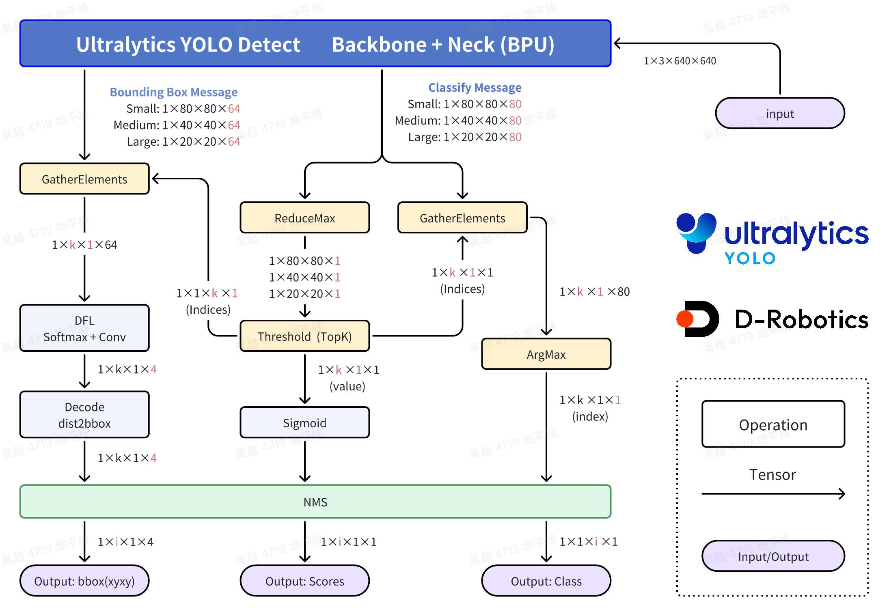
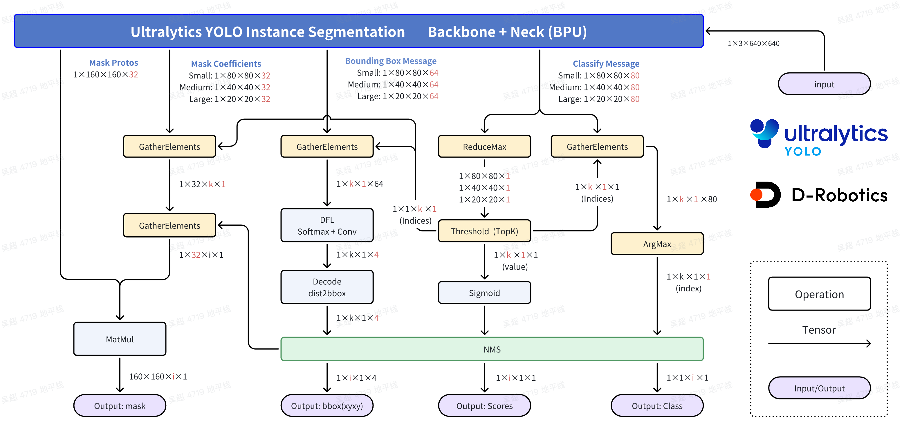

[English](./README.md) | 简体中文

# Ultralytics YOLO: 你只需要看一次

```bash
D-Robotics OpenExplore(RDK X5, Bayes-e BPU) Version: >= 1.2.8
Ultralytics YOLO Version: >= 8.3.0
```

## Contributors

 - Cauchy: 吴超
 - SkyXZ: 熊旗

## 阅读建议

1. 阅读本文前, 请您确保您已经掌握基本的Linux系统使用, 有一定的机器学习或深度学习基础知识, 掌握基本的Python或者C/C++开发的基础知识.

2. 请确保您已经通读了RDK手册的前3章, 同时也体验了OpenExplore包和BPU算法工具链手册的基础章节, 成功使用OpenExplore包转化过1～2个您喜欢的预置的ONNX模型.

3. 请注意, 社区的代码本身就是长期和开发者共建的, 没有商业发布物那样严格测试过, 作者能力和精力有限, 暂时无法承诺可以直接长期稳定运行. 如果您有更好的idea, 欢迎给我们issue和PR.

4. 请注意, Ultralytics YOLO采用AGPL-3.0协议, 请遵循相关协议约定使用, 更多请参考: [https://www.ultralytics.com/license](https://www.ultralytics.com/license)

## YOLO介绍


YOLO(You Only Look Once)是一种流行的物体检测和图像分割模型,由华盛顿大学的约瑟夫-雷德蒙(Joseph Redmon)和阿里-法哈迪(Ali Farhadi)开发. YOLO 于 2015 年推出,因其高速度和高精确度而迅速受到欢迎. 


 - 2016 年发布的YOLOv2 通过纳入批量归一化、锚框和维度集群改进了原始模型. 
2018 年推出的YOLOv3 使用更高效的骨干网络、多锚和空间金字塔池进一步增强了模型的性能. 
 - YOLOv4于 2020 年发布, 引入了 Mosaic 数据增强、新的无锚检测头和新的损失函数等创新技术. 
 - YOLOv5进一步提高了模型的性能, 并增加了超参数优化、集成实验跟踪和自动导出为常用导出格式等新功能. 
 - YOLOv6于 2022 年由美团开源, 目前已用于该公司的许多自主配送机器人. 
 - YOLOv7增加了额外的任务, 如 COCO 关键点数据集的姿势估计. 
 - YOLOv8是YOLO 的最新版本, 由Ultralytics 提供. YOLOv8支持全方位的视觉 AI 任务, 包括检测、分割、姿态估计、跟踪和分类. 这种多功能性使用户能够在各种应用和领域中利用YOLOv8 的功能. 
 - YOLOv9 引入了可编程梯度信息(PGI) 和广义高效层聚合网络(GELAN)等创新方法. 
 - YOLOv10是由清华大学的研究人员使用Ultralytics Python 软件包创建的. 该版本通过引入端到端头(End-to-End head),消除了非最大抑制(NMS)要求, 实现了实时目标检测的进步. 
 - YOLO11 NEW 🚀: Ultralytics的最新YOLO模型在多个任务上实现了最先进的（SOTA）性能. 
 - YOLO12构建以注意力为核心的YOLO框架, 通过创新方法和架构改进, 打破CNN模型在YOLO系列中的主导地位, 实现具有快速推理速度和更高检测精度的实时目标检测. 

## Support Models

### 目标检测 (Obeject Detection）

```bash
- YOLOv5u - Detect, Size: n, s, m, l, x
- YOLOv8  - Detect, Size: n, s, m, l, x
- YOLov9  - Detect, Size: t, s, m, c, e
- YOLOv10 - Detect, Size: n, s, m, b, l, x
- YOLO11  - Detect, Size: n, s, m, l, x
- YOLO12  - Detect, Size: n, s, m, l, x
- YOLO13  - Detect, Size: n, s,    l, x
```

### 实例分割 (Instance Segmentation)

```bash
YOLOv8 - Seg: n, s, m, l, x
YOLOv9 - Seg:          c, e
YOLO11 - Seg: n, s, m, l, x
```

### 姿态估计 (Pose Estimation)

```bash
YOLOv8 - Pose: n, s, m, l, x
YOLO11 - Pose: n, s, m, l, x
```

### 图像分类

```bash
# TODO
YOLOv8 - CLS: n, s, m, l, x
YOLO11 - CLS: n, s, m, l, x
```

### 定向边框对象检测 (Oriented Bounding Boxes Object Detection)

```bash
YOLOv8 - OBB: n, s, m, l, x
YOLO11 - OBB: n, s, m, l, x
```


## 快速体验

```bash
# Make Sure your are in this file
$ cd demos/Vision/ultralytics_YOLO

# Check your workspace
$ tree -L 2
.
|-- README.md     # English Document
|-- README_cn.md  # Chinese Document
|-- py
|   |-- eval_ultralytics_YOLO_Detect_YUV420SP.py # Advance Evaluation
|   `-- ultralytics_YOLO_Detect_YUV420SP.py      # Quick Start Python
|-- cpp
|   |   |-- CMakeLists.txt # infer C++ CmakeList
|   |   `-- main.cc # Quick Start C++
`-- source
|   |-- imgs
|   |-- reference_hbm_models    # Reference HBM Models
|   |-- reference_logs          # Reference logs
|   `-- reference_yamls         # Reference yaml configs
```
### Python 体验
直接运行, 会自动下载模型文件.

```bash
$ python3 py/ultralytics_YOLO_Detect_YUV420SP.py 
```

如果您想替换其他的模型, 或者使用其他的图片, 可以修改脚本文件内的参数.
```bash
$ python3 py/ultralytics_YOLO_Detect_YUV420SP.py -h

options:
  -h, --help            show this help message and exit
  --model-path MODEL_PATH
                        Path to BPU Quantized *.bin Model. RDK X3(Module): Bernoulli2. RDK Ultra: Bayes. RDK X5(Module): Bayes-e. RDK S100: Nash-e. RDK S100P: Nash-m.
  --test-img TEST_IMG   Path to Load Test Image.
  --img-save-path IMG_SAVE_PATH
                        Path to Load Test Image.
  --classes-num CLASSES_NUM
                        Classes Num to Detect.
  --nms-thres NMS_THRES
                        IoU threshold.
  --score-thres SCORE_THRES
                        confidence threshold.
  --reg REG             DFL reg layer.
```


## BenchMark - Performance

### RDK X5

#### 目标检测 (Obeject Detection)
| Model | Size(Pixels) | Classes |  BPU Task Latency  /<br>BPU Throughput (Threads) | CPU Latency<br>(Single Core) | params(M) | FLOPs(B) |
|----------|---------|----|---------|---------|----------|----------|
| YOLOv5nu | 640×640 | 80 | 6.3 ms / 157.4 FPS (1 thread  ) <br/> 6.8 ms / 291.8 FPS (2 threads)  | 5 ms |  2.6  M  |  7.7   B |  
| YOLOv5su | 640×640 | 80 | 12.3 ms / 81.0 FPS (1 thread  ) <br/> 18.9 ms / 105.6 FPS (2 threads) | 5 ms |  9.1  M  |  24.0  B |  
| YOLOv5mu | 640×640 | 80 | 26.5 ms / 37.7 FPS (1 thread  ) <br/> 47.1 ms / 42.4 FPS (2 threads)  | 5 ms |  25.1 M  |  64.2  B |  
| YOLOv5lu | 640×640 | 80 | 52.7 ms / 19.0 FPS (1 thread  ) <br/> 99.1 ms / 20.1 FPS (2 threads)  | 5 ms |  53.2 M  |  135.0 B |  
| YOLOv5xu | 640×640 | 80 | 91.1 ms / 11.0 FPS (1 thread  ) <br/> 175.7 ms / 11.4 FPS (2 threads) | 5 ms |  97.2 M  |  246.4 B |  
| YOLOv8n  | 640×640 | 80 | 7.0 ms / 141.9 FPS (1 thread  ) <br/> 8.0 ms / 247.2 FPS (2 threads)  | 5 ms |  3.2  M  |  8.7   B |  
| YOLOv8s  | 640×640 | 80 | 13.6 ms / 73.5 FPS (1 thread  ) <br/> 21.4 ms / 93.2 FPS (2 threads)  | 5 ms |  11.2 M  |  28.6  B |  
| YOLOv8m  | 640×640 | 80 | 30.6 ms / 32.6 FPS (1 thread  ) <br/> 55.3 ms / 36.1 FPS (2 threads)  | 5 ms |  25.9 M  |  78.9  B |  
| YOLOv8l  | 640×640 | 80 | 59.4 ms / 16.8 FPS (1 thread  ) <br/> 112.7 ms / 17.7 FPS (2 threads) | 5 ms |  43.7 M  |  165.2 B |  
| YOLOv8x  | 640×640 | 80 | 92.4 ms / 10.8 FPS (1 thread  ) <br/> 178.3 ms / 11.2 FPS (2 threads) | 5 ms |  68.2 M  |  257.8 B |  
| YOLOv9t  | 640×640 | 80 | 6.9 ms / 144.0 FPS (1 thread  ) <br/> 7.9 ms / 250.6 FPS (2 threads)  | 5 ms |  2.1  M  |  8.2   B |  
| YOLOv9s  | 640×640 | 80 | 13.0 ms / 77.0 FPS (1 thread  ) <br/> 20.1 ms / 98.9 FPS (2 threads)  | 5 ms |  7.2  M  |  26.9  B |  
| YOLOv9m  | 640×640 | 80 | 32.5 ms / 30.8 FPS (1 thread  ) <br/> 59.0 ms / 33.8 FPS (2 threads)  | 5 ms |  20.1 M  |  76.8  B |  
| YOLOv9c  | 640×640 | 80 | 40.3 ms / 24.8 FPS (1 thread  ) <br/> 74.6 ms / 26.7 FPS (2 threads)  | 5 ms |  25.3 M  |  102.7 B |  
| YOLOv9e  | 640×640 | 80 | 119.5 ms / 8.4 FPS (1 thread  ) <br/> 232.5 ms / 8.6 FPS (2 threads)  | 5 ms |  57.4 M  |  189.5 B |  
| YOLOv10n | 640×640 | 80 | 8.7 ms / 114.2 FPS (1 thread  ) <br/> 11.6 ms / 171.9 FPS (2 threads) | 5 ms |  2.3  M  |  6.7   B |  
| YOLOv10s | 640×640 | 80 | 14.9 ms / 67.1 FPS (1 thread  ) <br/> 23.8 ms / 83.7 FPS (2 threads)  | 5 ms |  7.2  M  |  21.6  B |  
| YOLOv10m | 640×640 | 80 | 29.4 ms / 34.0 FPS (1 thread  ) <br/> 52.6 ms / 37.9 FPS (2 threads)  | 5 ms |  15.4 M  |  59.1  B |  
| YOLOv10b | 640×640 | 80 | 40.0 ms / 25.0 FPS (1 thread  ) <br/> 74.2 ms / 26.9 FPS (2 threads)  | 5 ms |  19.1 M  |  92.0  B |  
| YOLOv10l | 640×640 | 80 | 49.8 ms / 20.1 FPS (1 thread  ) <br/> 93.6 ms / 21.3 FPS (2 threads)  | 5 ms |  24.4 M  |  120.3 B |
| YOLOv10x | 640×640 | 80 | 68.9 ms / 14.5 FPS (1 thread  ) <br/> 131.5 ms / 15.2 FPS (2 threads) | 5 ms |  29.5 M  |  160.4 B |  
| YOLO11n  | 640×640 | 80 | 8.2 ms / 121.6 FPS (1 thread  ) <br/> 10.5 ms / 188.9 FPS (2 threads) | 5 ms |  2.6  M  |  6.5   B |  
| YOLO11s  | 640×640 | 80 | 15.7 ms / 63.4 FPS (1 thread  ) <br/> 25.6 ms / 77.7 FPS (2 threads)  | 5 ms |  9.4  M  |  21.5  B |  
| YOLO11m  | 640×640 | 80 | 34.5 ms / 29.0 FPS (1 thread  ) <br/> 63.0 ms / 31.7 FPS (2 threads)  | 5 ms |  20.1 M  |  68.0  B |  
| YOLO11l  | 640×640 | 80 | 45.0 ms / 22.2 FPS (1 thread  ) <br/> 84.0 ms / 23.7 FPS (2 threads)  | 5 ms |  25.3 M  |  86.9  B |  
| YOLO11x  | 640×640 | 80 | 95.6 ms / 10.5 FPS (1 thread  ) <br/> 184.8 ms / 10.8 FPS (2 threads) | 5 ms |  56.9 M  |  194.9 B |  
| YOLO12n  | 640×640 | 80 | 39.4 ms / 25.3 FPS (1 thread  ) <br/> 72.7 ms / 27.4 FPS (2 threads)  | 5 ms |  2.6  M  |  6.5   B |  
| YOLO12s  | 640×640 | 80 | 63.4 ms / 15.8 FPS (1 thread  ) <br/> 120.6 ms / 16.5 FPS (2 threads) | 5 ms |  9.3  M  |  21.4  B |  
| YOLO12m  | 640×640 | 80 | 102.3 ms / 9.8 FPS (1 thread  ) <br/> 198.1 ms / 10.1 FPS (2 threads) | 5 ms |  20.2 M  |  67.5  B |  
| YOLO12l  | 640×640 | 80 | 181.6 ms / 5.5 FPS (1 thread  ) <br/> 356.4 ms / 5.6 FPS (2 threads)  | 5 ms |  26.4 M  |  88.9  B |  
| YOLO12x  | 640×640 | 80 | 311.9 ms / 3.2 FPS (1 thread  ) <br/> 616.3 ms / 3.2 FPS (2 threads)  | 5 ms |  59.1 M  |  199.0 B |  
| YOLOv13n | 640×640 | 80 | 44.6 ms / 22.4 FPS (1 thread  ) <br/> 83.1 ms / 24.0 FPS (2 threads)  | 5 ms |  2.5  M  |  6.4   B |  
| YOLOv13s | 640×640 | 80 | 63.6 ms / 15.7 FPS (1 thread  ) <br/> 120.7 ms / 16.5 FPS (2 threads) | 5 ms |  9.0  M  |  20.8  B |  
| YOLOv13l | 640×640 | 80 | 171.6 ms / 5.8 FPS (1 thread  ) <br/> 336.7 ms / 5.9 FPS (2 threads)  | 5 ms |  27.6 M  |  88.4  B |  
| YOLOv13x | 640×640 | 80 | 308.4 ms / 3.2 FPS (1 thread  ) <br/> 609.2 ms / 3.3 FPS (2 threads)  | 5 ms |  64.0 M  |  199.2 B |    

#### 实例分割 (Instance Segmentation)

| Model | Size(Pixels) | Classes |  BPU Task Latency  /<br>BPU Throughput (Threads) | CPU Latency<br>(Single Core) | params(M) | FLOPs(B) |
|----------|---------|----|---------|---------|----------|----------|
| YOLOv8n-Seg | 640×640 | 80 | 10.4 ms / 96.0 FPS (1 thread  ) <br/> 10.9 ms / 181.9 FPS (2 threads) | 20 ms | 3.4  M | 12.6  B |
| YOLOv8s-Seg | 640×640 | 80 | 19.6 ms / 50.9 FPS (1 thread  ) <br/> 29.0 ms / 68.7 FPS (2 threads)  | 20 ms | 11.8 M | 42.6  B |
| YOLOv8m-Seg | 640×640 | 80 | 40.4 ms / 24.7 FPS (1 thread  ) <br/> 70.4 ms / 28.3 FPS (2 threads)  | 20 ms | 27.3 M | 100.2 B |
| YOLOv8l-Seg | 640×640 | 80 | 74.9 ms / 13.3 FPS (1 thread  ) <br/> 139.4 ms / 14.3 FPS (2 threads) | 20 ms | 46.0 M | 220.5 B |
| YOLOv8x-Seg | 640×640 | 80 | 115.6 ms / 8.6 FPS (1 thread  ) <br/> 221.1 ms / 9.0 FPS (2 threads)  | 20 ms | 71.8 M | 344.1 B |
| YOLOv9c-Seg | 640×640 | 80 | 55.9 ms / 17.9 FPS (1 thread  ) <br/> 101.3 ms / 19.7 FPS (2 threads) | 20 ms | 27.7 M | 158.0 B |
| YOLOv9e-Seg | 640×640 | 80 | 135.4 ms / 7.4 FPS (1 thread  ) <br/> 260.0 ms / 7.7 FPS (2 threads)  | 20 ms | 59.7 M | 244.8 B |
| YOLO11n-Seg | 640×640 | 80 | 11.7 ms / 85.6 FPS (1 thread  ) <br/> 13.0 ms / 152.6 FPS (2 threads) | 20 ms | 2.9  M | 10.4  B |
| YOLO11s-Seg | 640×640 | 80 | 21.7 ms / 46.0 FPS (1 thread  ) <br/> 33.1 ms / 60.3 FPS (2 threads)  | 20 ms | 10.1 M | 35.5  B |
| YOLO11m-Seg | 640×640 | 80 | 50.3 ms / 19.9 FPS (1 thread  ) <br/> 90.2 ms / 22.1 FPS (2 threads)  | 20 ms | 22.4 M | 123.3 B |
| YOLO11l-Seg | 640×640 | 80 | 60.6 ms / 16.5 FPS (1 thread  ) <br/> 110.8 ms / 18.0 FPS (2 threads) | 20 ms | 27.6 M | 142.2 B |
| YOLO11x-Seg | 640×640 | 80 | 129.1 ms / 7.7 FPS (1 thread  ) <br/> 247.4 ms / 8.1 FPS (2 threads)  | 20 ms | 62.1 M | 319.0 B |


#### 姿态估计 (Pose Estimation)
| Model | Size(Pixels) | Classes |  BPU Task Latency  /<br>BPU Throughput (Threads) | CPU Latency<br>(Single Core) | params(M) | FLOPs(B) |
|----------|---------|----|---------|---------|----------|----------|
| YOLOv8n-Pose | 640×640 | 1 | 7.0 ms / 143.1 FPS (1 thread  ) <br/> 8.2 ms / 241.8 FPS (2 threads)  | 10 ms | 3.3  M | 9.2   B |
| YOLOv8s-Pose | 640×640 | 1 | 14.1 ms / 70.6 FPS (1 thread  ) <br/> 22.6 ms / 88.2 FPS (2 threads)  | 10 ms | 11.6 M | 30.2  B |
| YOLOv8m-Pose | 640×640 | 1 | 31.5 ms / 31.7 FPS (1 thread  ) <br/> 57.2 ms / 34.9 FPS (2 threads)  | 10 ms | 26.4 M | 81.0  B |
| YOLOv8l-Pose | 640×640 | 1 | 60.2 ms / 16.6 FPS (1 thread  ) <br/> 114.4 ms / 17.4 FPS (2 threads) | 10 ms | 44.4 M | 168.6 B |
| YOLOv8x-Pose | 640×640 | 1 | 93.9 ms / 10.7 FPS (1 thread  ) <br/> 181.5 ms / 11.0 FPS (2 threads) | 10 ms | 69.4 M | 263.2 B |
| YOLO11n-Pose | 640×640 | 1 | 8.3 ms / 119.8 FPS (1 thread  ) <br/> 10.9 ms / 182.2 FPS (2 threads) | 10 ms | 2.9  M | 7.6   B |
| YOLO11s-Pose | 640×640 | 1 | 16.3 ms / 61.1 FPS (1 thread  ) <br/> 27.0 ms / 73.9 FPS (2 threads)  | 10 ms | 9.9  M | 23.2  B |
| YOLO11m-Pose | 640×640 | 1 | 35.6 ms / 28.0 FPS (1 thread  ) <br/> 65.4 ms / 30.5 FPS (2 threads)  | 10 ms | 20.9 M | 71.7  B |
| YOLO11l-Pose | 640×640 | 1 | 46.3 ms / 21.6 FPS (1 thread  ) <br/> 86.6 ms / 23.0 FPS (2 threads)  | 10 ms | 26.2 M | 90.7  B |
| YOLO11x-Pose | 640×640 | 1 | 97.8 ms / 10.2 FPS (1 thread  ) <br/> 189.4 ms / 10.5 FPS (2 threads) | 10 ms | 58.8 M | 203.3 B |

#### 定向边框对象检测 (Oriented Bounding Boxes Object Detection)

| Model | Size(Pixels) | Classes |  BPU Task Latency  /<br>BPU Throughput (Threads) | CPU Latency<br>(Single Core) | params(M) | FLOPs(B) |
|----------|---------|----|---------|---------|----------|----------|
| YOLOv8n-OBB | 1024×1024 | 15 | 13.9 ms / 71.9 FPS (1 thread  ) <br/> 18.3 ms / 109.1 FPS (2 threads) | 100 ms | 3.08 M | 8.3   B |
| YOLOv8s-OBB | 1024×1024 | 15 | 30.6 ms / 32.7 FPS (1 thread  ) <br/> 51.6 ms / 38.6 FPS (2 threads)  | 100 ms | 11.4 M | 29.4  B |
| YOLOv8m-OBB | 1024×1024 | 15 | 73.9 ms / 13.5 FPS (1 thread  ) <br/> 138.2 ms / 14.4 FPS (2 threads) | 100 ms | 26.4 M | 80.9  B |
| YOLOv8l-OBB | 1024×1024 | 15 | 144.6 ms / 6.9 FPS (1 thread  ) <br/> 279.2 ms / 7.1 FPS (2 threads)  | 100 ms | 44.5 M | 168.6 B |
| YOLOv8x-OBB | 1024×1024 | 15 | 230.7 ms / 4.3 FPS (1 thread  ) <br/> 450.8 ms / 4.4 FPS (2 threads)  | 100 ms | 69.5 M | 263.2 B |
| YOLO11n-OBB | 1024×1024 | 15 | 19.7 ms / 50.6 FPS (1 thread  ) <br/> 30.2 ms / 65.9 FPS (2 threads)  | 100 ms | 2.7  M | 6.6   B |
| YOLO11s-OBB | 1024×1024 | 15 | 38.6 ms / 25.9 FPS (1 thread  ) <br/> 67.7 ms / 29.5 FPS (2 threads)  | 100 ms | 9.7  M | 22.3  B |
| YOLO11m-OBB | 1024×1024 | 15 | 87.7 ms / 11.4 FPS (1 thread  ) <br/> 165.5 ms / 12.1 FPS (2 threads) | 100 ms | 20.9 M | 71.4  B |
| YOLO11l-OBB | 1024×1024 | 15 | 115.3 ms / 8.7 FPS (1 thread  ) <br/> 220.5 ms / 9.0 FPS (2 threads)  | 100 ms | 26.1 M | 90.3  B |
| YOLO11x-OBB | 1024×1024 | 15 | 267.9 ms / 3.7 FPS (1 thread  ) <br/> 525.2 ms / 3.8 FPS (2 threads)  | 100 ms | 58.8 M | 202.8 B |


### 图像分类

| Model | Size(Pixels) | Classes |  BPU Task Latency  /<br>BPU Throughput (Threads) | CPU Latency<br>(Single Core) | params(M) | FLOPs(B) |
|----------|---------|----|---------|---------|----------|----------|
| YOLOv8n-CLS | 224x224 | 1000 | 0.7 ms / 1374.6 FPS (1 thread  ) <br/> 1.0 ms / 2023.2 FPS (2 threads) | 0.5 ms | 2.7  M | 4.3   B |
| YOLOv8s-CLS | 224x224 | 1000 | 1.4 ms / 701.0 FPS (1 thread  ) <br/> 2.3 ms / 848.0 FPS (2 threads)   | 0.5 ms | 6.4  M | 13.5  B |
| YOLOv8m-CLS | 224x224 | 1000 | 3.7 ms / 269.5 FPS (1 thread  ) <br/> 6.9 ms / 290.6 FPS (2 threads)   | 0.5 ms | 17.0 M | 42.7  B |
| YOLOv8l-CLS | 224x224 | 1000 | 7.9 ms / 126.6 FPS (1 thread  ) <br/> 15.2 ms / 130.8 FPS (2 threads)  | 0.5 ms | 37.5 M | 99.7  B |
| YOLOv8x-CLS | 224x224 | 1000 | 13.1 ms / 76.4 FPS (1 thread  ) <br/> 25.5 ms / 78.3 FPS (2 threads)   | 0.5 ms | 57.4 M | 154.8 B |
| YOLO11n-CLS | 224x224 | 1000 | 1.0 ms / 949.5 FPS (1 thread  ) <br/> 1.6 ms / 1238.4 FPS (2 threads)  | 0.5 ms | 2.8  M | 4.2   B |
| YOLO11s-CLS | 224x224 | 1000 | 2.1 ms / 484.3 FPS (1 thread  ) <br/> 3.5 ms / 572.2 FPS (2 threads)   | 0.5 ms | 6.7  M | 13.0  B |
| YOLO11m-CLS | 224x224 | 1000 | 3.8 ms / 262.6 FPS (1 thread  ) <br/> 7.1 ms / 282.2 FPS (2 threads)   | 0.5 ms | 11.6 M | 40.3  B |
| YOLO11l-CLS | 224x224 | 1000 | 5.0 ms / 200.3 FPS (1 thread  ) <br/> 9.4 ms / 211.2 FPS (2 threads)   | 0.5 ms | 14.1 M | 50.4  B |
| YOLO11x-CLS | 224x224 | 1000 | 10.0 ms / 100.2 FPS (1 thread  ) <br/> 19.3 ms / 103.2 FPS (2 threads) | 0.5 ms | 29.6 M | 111.3 B |


### Performance Test Instructions
1. 此处测试的均为YUV420SP (nv12) 输入的模型的性能数据. NCHWRGB输入的模型的性能数据与其无明显差距.
2. BPU延迟与BPU吞吐量. 
 - 单线程延迟为单帧,单线程,单BPU核心的延迟,BPU推理一个任务最理想的情况. 
 - 多线程帧率为多个线程同时向BPU塞任务, 每个BPU核心可以处理多个线程的任务, 一般工程中2个线程可以控制单帧延迟较小,同时吃满所有BPU到100%,在吞吐量(FPS)和帧延迟间得到一个较好的平衡.
 - 表格中一般记录到吞吐量不再随线程数明显增加的数据. 
 - BPU延迟和BPU吞吐量使用以下命令在板端测试
```bash
hrt_model_exec perf --thread_num 2 --model_file yolov8n_detect_bayese_640x640_nv12_modified.bin

python3 ../../tools/batch_perf/batch_perf.py --max 3 --file source/reference_bin_models/
```
3. 测试板卡为最佳状态. 
 - RDK X5 状态: CPU为8 × A55 @ 1.5GHz, 全核心Performance调度, BPU为1 × Bayes-e @ 1.0GHz, 10 TOPS @ int8.


## Benchmark - Accuracy

### RDK X5

#### Object Detection (COCO2017)
| Model | Pytorch | YUV420SP<br/>Python | YUV420SP<br/>C/C++ |
|---------|---------|-------|---------|
| YOLOv5nu | 0.275 | 0.260(94.55%) | (%) |
| YOLOv5su | 0.362 | 0.354(97.79%) | (%) |
| YOLOv5mu | 0.417 | 0.407(97.60%) | (%) |
| YOLOv5lu | 0.449 | 0.442(98.44%) | (%) |
| YOLOv5xu | 0.458 | 0.443(96.72%) | (%) |
| YOLOv8n  | 0.306 | 0.292(95.42%) | (%) |
| YOLOv8s  | 0.384 | 0.372(96.88%) | (%) |
| YOLOv8m  | 0.433 | 0.423(97.69%) | (%) |
| YOLOv8l  | 0.454 | 0.440(96.92%) | (%) |
| YOLOv8x  | 0.465 | 0.448(96.34%) | (%) |
| YOLOv9t  | 0.309 | 0.298(96.44%) | (%) |
| YOLOv9s  | 0.394 | 0.382(96.95%) | (%) |
| YOLOv9m  | 0.441 | 0.427(96.83%) | (%) |
| YOLOv9c  | 0.452 | 0.435(96.24%) | (%) |
| YOLOv9e  | 0.472 | 0.458(97.03%) | (%) |
| YOLOv10n | 0.299 | 0.282(94.31%) | (%) |
| YOLOv10s | 0.381 | 0.364(95.54%) | (%) |
| YOLOv10m | 0.418 | 0.379(90.67%) | (%) |
| YOLOv10b | 0.435 | 0.391(89.89%) | (%) |
| YOLOv10l | 0.438 | 0.396(90.41%) | (%) |
| YOLOv10x | 0.451 | 0.417(92.46%) | (%) |
| YOLO11n  | 0.323 | 0.308(95.36%) | (%) |
| YOLO11s  | 0.394 | 0.380(96.45%) | (%) |
| YOLO11m  | 0.437 | 0.422(96.57%) | (%) |
| YOLO11l  | 0.452 | 0.432(95.58%) | (%) |
| YOLO11x  | 0.466 | 0.446(95.71%) | (%) |
| YOLO12n  | 0.334 | 0.312(93.41%) | (%) |
| YOLO12s  | 0.397 | 0.379(95.47%) | (%) |
| YOLO12m  | 0.444 | 0.428(96.40%) | (%) |
| YOLO12l  | 0.454 | 0.433(95.37%) | (%) |
| YOLO12x  | 0.466 | 0.444(95.28%) | (%) |
| YOLOv13n | 0.342 | 0.254(--.--%)* | (%) |
| YOLOv13s | 0.402 | 0.392(97.51%) | (%) |
| YOLOv13l | 0.458 | 0.447(97.60%) | (%) |
| YOLOv13x | 0.473 | 0.459(97.04%) | (%) |

#### Instance Segmentation (COCO2017)

| Model | Pytorch<br/>BBox / Mask | YUV420SP - Python<br/>BBox / Mask | YUV420SP - C/C++<br/>BBox / Mask |
|---------|---------|-------|---------|
| YOLOv8n-Seg | 0.300 / 0.241 | 0.284(94.67%) / 0.219(90.87%) | (%) / (%) |
| YOLOv8s-Seg | 0.380 / 0.299 | 0.371(97.63%) / 0.287(95.99%) | (%) / (%) |
| YOLOv8m-Seg | 0.423 / 0.330 | 0.408(96.45%) / 0.311(94.24%) | (%) / (%) |
| YOLOv8l-Seg | 0.444 / 0.344 | 0.431(97.07%) / 0.332(96.51%) | (%) / (%) |
| YOLOv8x-Seg | 0.456 / 0.351 | 0.439(96.27%) / 0.336(95.73%) | (%) / (%) |
| YOLOv9c-Seg | 0.446 / 0.345 | 0.423(94.84%) / 0.321(93.04%) | (%) / (%) |
| YOLOv9e-Seg | 0.471 / 0.118 | 0.332(--.--%) / 0.268(--.--%)*| (%) / (%) | 
| YOLO11n-Seg | 0.319 / 0.258 | 0.296(92.79%) / 0.227(87.98%) | (%) / (%) |
| YOLO11s-Seg | 0.388 / 0.306 | 0.377(97.16%) / 0.291(95.10%) | (%) / (%) |
| YOLO11m-Seg | 0.436 / 0.340 | 0.422(96.79%) / 0.322(94.71%) | (%) / (%) |
| YOLO11l-Seg | 0.452 / 0.350 | 0.432(95.58%) / 0.328(93.71%) | (%) / (%) |
| YOLO11x-Seg | 0.466 / 0.358 | 0.447(95.92%) / 0.338(94.41%) | (%) / (%) |


#### Pose Estimation (COCO2017)

| Model | Pytorch | YUV420SP - Python | YUV420SP - C/C++ |
|---------|---------|-------|---------|
| YOLOv8n-Pose | 0.476 | 0.462(97.06%) | (%) |
| YOLOv8s-Pose | 0.578 | 0.553(95.67%) | (%) |
| YOLOv8m-Pose | 0.631 | 0.605(95.88%) | (%) |
| YOLOv8l-Pose | 0.656 | 0.636(96.95%) | (%) |
| YOLOv8x-Pose | 0.670 | 0.655(97.76%) | (%) |
| YOLO11n-Pose | 0.465 | 0.452(97.20%) | (%) |
| YOLO11s-Pose | 0.560 | 0.530(94.64%) | (%) |
| YOLO11m-Pose | 0.626 | 0.600(95.85%) | (%) |
| YOLO11l-Pose | 0.636 | 0.619(97.33%) | (%) |
| YOLO11x-Pose | 0.672 | 0.654(97.32%) | (%) |


#### Classification (ImageNet2012)

| Model | Pytorch | YUV420SP - Python<br/>TOP1 / TOP5 | YUV420SP - C/C++<br/>TOP1 / TOP5 |
|---------|---------|-------|---------|
| YOLOv8n-CLS | 0.690 / 0.883 | 0.525(76.09%) / 0.762(86.30%) | (%) / (%) |
| YOLOv8s-CLS | 0.738 / 0.917 | 0.611(82.79%) / 0.837(91.28%) | (%) / (%) |
| YOLOv8m-CLS | 0.768 / 0.935 | 0.682(88.80%) / 0.883(94.44%) | (%) / (%) |
| YOLOv8l-CLS | 0.768 / 0.935 | 0.724(94.27%) / 0.909(97.22%) | (%) / (%) |
| YOLOv8x-CLS | 0.790 / 0.946 | 0.737(93.29%) / 0.917(96.93%) | (%) / (%) |
| YOLO11n-CLS | 0.700 / 0.894 | 0.495(70.71%) / 0.736(82.33%) | (%) / (%) |
| YOLO11s-CLS | 0.754 / 0.927 | 0.665(88.20%) / 0.873(94.17%) | (%) / (%) |
| YOLO11m-CLS | 0.773 / 0.939 | 0.695(89.91%) / 0.896(95.42%) | (%) / (%) |
| YOLO11l-CLS | 0.783 / 0.943 | 0.707(90.29%) / 0.902(95.65%) | (%) / (%) |
| YOLO11x-CLS | 0.795 / 0.949 | 0.732(92.08%) / 0.917(96.63%) | (%) / (%) |

#### Oriented Bounding Boxes Object Detection

TODO: 如果您愿意补充这部分，欢迎您PR.

### Accuracy Test Instructions

1. 所有的精度数据使用微软官方的无修改的`pycocotools`库进行计算, Det和Seg取的精度标准为`Average Precision  (AP) @[ IoU=0.50:0.95 | area=   all | maxDets=100 ]`的数据, Pose取的精度标准为`Average Precision  (AP) @[ IoU=0.50:0.95 | area=   all | maxDets= 20 ]`的数据. 
2. 所有的测试数据均使用`COCO2017`数据集的val验证集的5000张照片, 在板端直接推理, dump保存为json文件, 送入第三方测试工具`pycocotools`库进行计算, 分数的阈值为0.25, nms的阈值为0.7. 
3. pycocotools计算的精度比ultralytics计算的精度会低一些是正常现象, 主要原因是pycocotools是取矩形面积, ultralytics是取梯形面积, 我们主要是关注同样的一套计算方式去测试定点模型和浮点模型的精度, 从而来评估量化过程中的精度损失. 
4. BPU模型在量化NCHW-RGB888输入转换为YUV420SP(nv12)输入后, 也会有一部分精度损失, 这是由于色彩空间转化导致的, 在训练时加入这种色彩空间转化的损失可以避免这种精度损失. 
5. Python接口和C/C++接口的精度结果有细微差异, 主要在于Python和C/C++的一些数据结构进行memcpy和转化的过程中, 对浮点数的处理方式不同, 导致的细微差异.
6. 测试脚本请参考RDK Model Zoo的eval部分: https://github.com/D-Robotics/rdk_model_zoo/tree/main/demos/tools/eval_pycocotools
7. 本表格是使用PTQ(训练后量化)使用50张图片进行校准和编译的结果, 用于模拟普通开发者第一次直接编译的精度情况, 并没有进行精度调优或者QAT(量化感知训练), 满足常规使用验证需求, 不代表精度上限.

## 进阶开发

### 高性能计算流程介绍

#### 目标检测 (Obeject Detection）


公版处理流程中, 是会对8400个bbox完全计算分数, 类别和xyxy坐标, 这样才能根据GT去计算损失函数. 但是我们在部署中, 只需要合格的bbox就好了, 并不需要对8400个bbox完全计算. 
优化处理流程中, 主要就是利用Sigmoid函数单调性做到了先筛选, 再计算. 同时利用Python的numpy的高级索引, 对DFL和特征解码的部分也做到了先筛选, 再计算, 节约了大量的计算, 从而后处理在CPU上, 利用numpy, 可以做到单核单帧单线程5毫秒. 

 - Classify部分,Dequantize操作
在模型编译时,如果选择了移除所有的反量化算子,这里需要在后处理中手动对Classify部分的三个输出头进行反量化在. 查看反量化系数的方式有多种, 可以查看`hb_combine`时产物的日志, 也可通过BPU推理接口的API来获取. 
注意,这里每一个C维度的反量化系数都是不同的,每个头都有80个反量化系数,可以使用numpy的广播直接乘. 
此处反量化在bin模型中实现,所以拿到的输出是float32的. 

 - Classify部分,ReduceMax操作
ReduceMax操作是沿着Tensor的某一个维度找到最大值,此操作用于找到8400个Grid Cell的80个分数的最大值. 操作对象是每个Grid Cell的80类别的值,在C维度操作. 注意,这步操作给出的是最大值,并不是80个值中最大值的索引. 
激活函数Sigmoid具有单调性,所以Sigmoid作用前的80个分数的大小关系和Sigmoid作用后的80个分数的大小关系不会改变. 
$$Sigmoid(x)=\frac{1}{1+e^{-x}}$$
$$Sigmoid(x_1) > Sigmoid(x_2) \Leftrightarrow x_1 > x_2$$
综上,bin模型直接输出的最大值(反量化完成)的位置就是最终分数最大值的位置,bin模型输出的最大值经过Sigmoid计算后就是原来onnx模型的最大值. 

 - Classify部分,Threshold（TopK）操作
此操作用于找到8400个Grid Cell中,符合要求的Grid Cell. 操作对象为8400个Grid Cell,在H和W的维度操作. 如果您有阅读我的程序,你会发现我将后面H和W维度拉平了,这样只是为了程序设计和书面表达的方便,它们并没有本质上的不同. 
我们假设某一个Grid Cell的某一个类别的分数记为$x$,激活函数作用完的整型数据为$y$,阈值筛选的过程会给定一个阈值,记为$C$,那么此分数合格的**充分必要条件**为: 

$$y=Sigmoid(x)=\frac{1}{1+e^{-x}}>C$$

由此可以得出此分数合格的**充分必要条件**为: 

$$x > -ln\left(\frac{1}{C}-1\right)$$

此操作会符合条件的Grid Cell的索引（indices）和对应Grid Cell的最大值,这个最大值经过Sigmoid计算后就是这个Grid Cell对应类别的分数了. 

 - Classify部分,GatherElements操作和ArgMax操作
使用Threshold(TopK)操作得到的符合条件的Grid Cell的索引(indices),在GatherElements操作中获得符合条件的Grid Cell,使用ArgMax操作得到具体是80个类别中哪一个最大,得到这个符合条件的Grid Cell的类别. 

 - Bounding Box部分,GatherElements操作和Dequantize操作
使用Threshold(TopK)操作得到的符合条件的Grid Cell的索引(indices),在GatherElements操作中获得符合条件的Grid Cell,这里每一个C维度的反量化系数都是不同的,每个头都有64个反量化系数,可以使用numpy的广播直接乘,得到1×64×k×1的bbox信息. 

 - Bounding Box部分,DFL: SoftMax+Conv操作
每一个Grid Cell会有4个数字来确定这个框框的位置,DFL结构会对每个框的某条边基于anchor的位置给出16个估计,对16个估计求SoftMax,然后通过一个卷积操作来求期望,这也是Anchor Free的核心设计,即每个Grid Cell仅仅负责预测1个Bounding box. 假设在对某一条边偏移量的预测中,这16个数字为 $ l_p $ 或者$(t_p, t_p, b_p)$,其中$p = 0,1,...,15$那么偏移量的计算公式为: 

$$\hat{l} = \sum_{p=0}^{15}{\frac{p·e^{l_p}}{S}}, S =\sum_{p=0}^{15}{e^{l_p}}$$

 - Bounding Box部分,Decode: dist2bbox(ltrb2xyxy)操作
此操作将每个Bounding Box的ltrb描述解码为xyxy描述,ltrb分别表示左上右下四条边距离相对于Grid Cell中心的距离,相对位置还原成绝对位置后,再乘以对应特征层的采样倍数,即可还原成xyxy坐标,xyxy表示Bounding Box的左上角和右下角两个点坐标的预测值. 


图片输入为$Size=640$,对于Bounding box预测分支的第$i$个特征图$(i=1, 2, 3)$,对应的下采样倍数记为$Stride(i)$,在YOLOv8 - Detect中,$Stride(1)=8, Stride(2)=16, Stride(3)=32$,对应特征图的尺寸记为$n_i = {Size}/{Stride(i)}$,即尺寸为$n_1 = 80, n_2 = 40 ,n_3 = 20$三个特征图,一共有$n_1^2+n_2^2+n_3^3=8400$个Grid Cell,负责预测8400个Bounding Box. 
对特征图i,第x行y列负责预测对应尺度Bounding Box的检测框,其中$x,y \in [0, n_i)\bigcap{Z}$,$Z$为整数的集合. DFL结构后的Bounding Box检测框描述为$ltrb$描述,而我们需要的是$xyxy$描述,具体的转化关系如下: 

$$x_1 = (x+0.5-l)\times{Stride(i)}$$

$$y_1 = (y+0.5-t)\times{Stride(i)}$$

$$x_2 = (x+0.5+r)\times{Stride(i)}$$

$$y_1 = (y+0.5+b)\times{Stride(i)}$$

最终的检测结果,包括类别(id),分数(score)和位置(xyxy). 

#### 实例分割 (Instance Segmentation)


 - Mask Coefficients 部分, 两次GatherElements操作,
用于得到最终符合要求的Grid Cell的Mask Coefficients信息，也就是32个系数.
这32个系数与Mask Protos部分作一个线性组合，也可以认为是加权求和，就可以得到这个Grid Cell对应目标的Mask信息。

#### 姿态估计 (Pose Estimation)


Ultralytics YOLO Pose 的关键点基于目标检测，kpt的定义参考如下
```python
COCO_keypoint_indexes = {
    0: 'nose',
    1: 'left_eye',
    2: 'right_eye',
    3: 'left_ear',
    4: 'right_ear',
    5: 'left_shoulder',
    6: 'right_shoulder',
    7: 'left_elbow',
    8: 'right_elbow',
    9: 'left_wrist',
    10: 'right_wrist',
    11: 'left_hip',
    12: 'right_hip',
    13: 'left_knee',
    14: 'right_knee',
    15: 'left_ankle',
    16: 'right_ankle'
}
```

Ultralytics YOLO Pose 模型的目标检测部分与 Ultralytics YOLO Detect一致, 对应的感受野会多出Channel = 57的特征图, 对应着17个Key Points, 分别是相对于特征图下采样倍数的坐标x, y和这个点对应的分数score.

我们通过目标检测部分, 得知在某个位置的Key Points符合要求后, 将其乘以对应感受野的下采样倍数，即可得到基于输入尺寸的Key Points坐标.


### 环境、项目准备

注: 任何No such file or directory, No module named "xxx", command not found.等报错请仔细检查, 请勿逐条复制运行, 如果对修改过程不理解请前往开发者社区从YOLOv5开始了解. 

 - 下载ultralytics/ultralytics仓库, 并参考ultralytics官方文档, 配置好环境.
```bash
git clone https://github.com/ultralytics/ultralytics.git
```
 - 进入本地仓库, 下载ultralytics官方的预训练权重, 这里以YOLO11n-Detect模型为例.
```bash
cd ultralytics
wget https://github.com/ultralytics/assets/releases/download/v8.3.0/yolo11n.pt
```

### 模型训练

 - 模型训练请参考ultralytics官方文档, 这个文档由ultralytics维护, 质量非常的高. 网络上也有非常多的参考材料, 得到一个像官方一样的预训练权重的模型并不困难. 
 - 请注意, 训练时无需修改任何程序, 无需修改forward方法. 

Ultralytics YOLO 官方文档: https://docs.ultralytics.com/modes/train/


### 导出为onnx

使用x86文件内Python脚本进行ONNX导出
如果有**No module named onnxsim**报错, 安装一个即可. 注意, 如果生成的onnx模型显示ir版本过高, 可以将simplify=False. 两种设置对最终bin模型没有影响, 打开后可以提升onnx模型在netron中的可读性.

```python
from ultralytics import YOLO
YOLO('yolov11n.pt').export(imgsz=640, format='onnx', simplify=False, opset=19)
```


### 模型编译
```bash
(bpu_docker) $ hb_compile --config config.yaml
```

### 异常处理


## 参考

[ultralytics](https://docs.ultralytics.com/)

[Github: yolo12](https://github.com/sunsmarterjie/yolo12)

[YOLOv12: Attention-Centric Real-Time Object Detectors](https://arxiv.org/abs/2502.12524)

