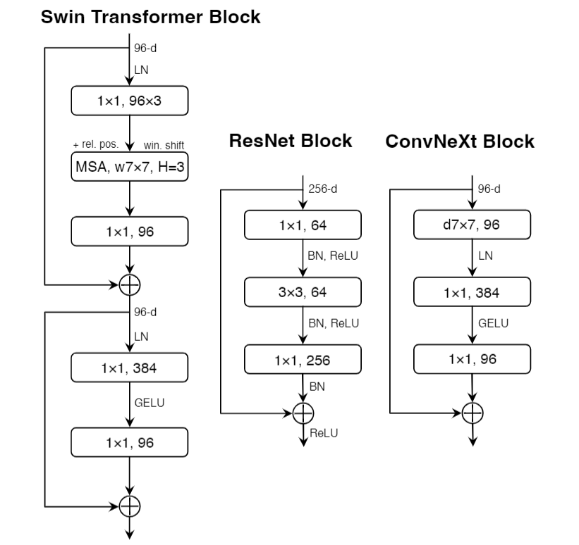
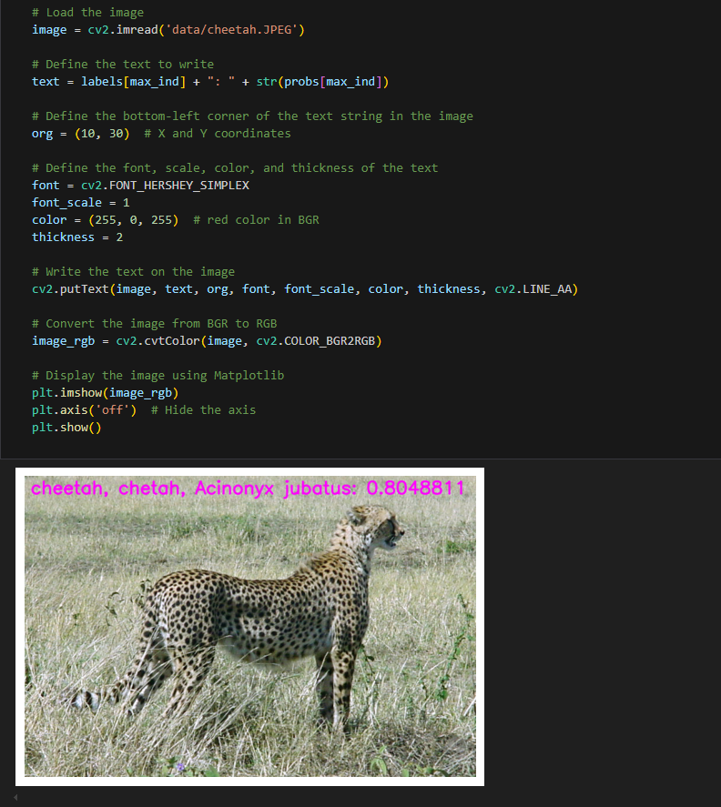

English | [简体中文](./README_cn.md)

# CNN - ConvNeXt

- [CNN - ConvNeXt](#cnn---convnext)
  - [1. Introduction](#1-introduction)
  - [2. Model performance data](#2-model-performance-data)
  - [3. Model download](#3-model-download)
  - [4. Deployment Testing](#4-deployment-testing)
  - [5. Model Quantitation Experiment](#5-model-quantitation-experiment)


## 1. Introduction

- **Paper**: [A ConvNet for the 2020s](https://arxiv.org/abs/2201.03545)

- **GitHub repository**: [facebookresearch/ConvNeXt: Code release for ConvNeXt model (github.com)](https://github.com/facebookresearch/ConvNeXt)

ConvNeXt network starts from the original ResNet and gradually improves the model by borrowing the design of Swin Transformer. ConvNeXt does not have a particularly complex or innovative structure. Every network detail has been adopted in more than one network, achieving the effect of SOTA by stacking various deep model structure designs. The network structure uses larger convolution cores (7x7), ReLU replaced with GELU activation function, fewer activation functions, LayerNorm replaced BatchNorm, and reduced downsampling frequency. These changes make ConvNeXt have better expressive ability while retaining the efficiency of convolution network. Its design is simple and efficient, suitable for various visual tasks.



**ConvNeXt model features**:

- **Large kernel convolution**: ConvNeXt uses large kernel (7x7) convolution instead of traditional 3x3 convolution. Large kernel convolution helps to expand the receptive field while reducing the need for network depth
- **Depthwise convolution**: ConvNeXt introduces depthwise convolution, similar to [MobileNet](../MobileNetV1/README.md) and [EfficientNet](../EfficientNet/README.md), which can significantly reduce the number of parameters and computational costs
- **Normalization Layer**: ConvNeXt replaces traditional BatchNorm with LayerNorm, which makes the network more adaptable to small batches of data while simplifying model design
- **Simplified residual connections**: ConvNeXt simplifies the design of fully connected layers, removing the bottleneck structure in ResNet and replacing it with simpler convolution operations and fully connected layers

## 2. Model performance data

The following table shows the performance data obtained from actual testing on RDK X5 & RDK X5 Module. You can weigh the size of the model according to your own reasoning about the actual performance and accuracy required

| Model        | Size    | Categories | Parameter | Floating point precision | Quantization accuracy | Latency/throughput (single-threaded) | Latency/throughput (multi-threaded) | Frame rate(FPS) |
| ------------ | ------- | ---- | ------ | ----- | ----- | ----------- | ----------- | ------- |
| ConvNeXt_nano  | 224x224 | 1000 | 15.59  | 77.37 | 71.75 | 5.71        | 19.80       | 200.18 |
| ConvNeXt_pico  | 224x224 | 1000 | 9.04   | 77.25 | 71.03 | 3.37        | 10.88       | 364.07 |
| ConvNeXt_femto | 224x224 | 1000 | 5.22   | 73.75 | 72.25 | 2.46        | 7.11        | 556.02 |
| ConvNeXt_atto  | 224x224 | 1000 | 3.69   | 73.25 | 69.75 | 1.96        | 5.39        | 732.10 |


Description:
1. X5 is in the best state: CPU is 8xA55@1.8G, full core Performance scheduling, BPU is 1xBayes-e@1G, a total of 10TOPS equivalent int8 computing power.
2. Single-threaded delay is the ideal situation for single frame, single-threaded, and single-BPU core delay, and BPU inference for a task.
3. The frame rate of a 4-thread project is when 4 threads simultaneously send tasks to a dual-core BPU. In a typical project, 4 threads can control the single frame delay to be small, while consuming all BPUs to 100%, achieving a good balance between throughput (FPS) and frame delay.
4. The maximum frame rate of 8 threads is for 8 threads to simultaneously load tasks into the dual-core BPU of X3. The purpose is to test the maximum performance of the BPU. Generally, 4 cores are already full. If 8 threads are much better than 4 threads, it indicates that the model structure needs to improve the "calculation/memory access" ratio or optimize the DDR bandwidth when compiling.
5. Floating-point/fixed-point precision: Floating-point accuracy uses the Top-1 inference accuracy Level of onnx before the model is quantized, while quantized accuracy is the accuracy Level of the actual inference of the model after quantization.


## 3. Model download

**.Bin file download** :

You can use the script [download.sh](./model/download.sh) to download all .bin model files for this model structure with one click, making it easy to change models directly. Alternatively, use one of the following command lines to select a single model for download:

```shell
wget https://archive.d-robotics.cc/downloads/rdk_model_zoo/rdk_x5/ConvNeXt_atto_224x224_nv12.bin
wget https://archive.d-robotics.cc/downloads/rdk_model_zoo/rdk_x5/ConvNeXt_femto_224x224_nv12.bin
wget https://archive.d-robotics.cc/downloads/rdk_model_zoo/rdk_x5/ConvNeXt_nano_224x224_nv12.bin
wget https://archive.d-robotics.cc/downloads/rdk_model_zoo/rdk_x5/ConvNeXt_pico_224x224_nv12.bin
```

**ONNX file download** :


The onnx model is transformed using models from the timm library (PyTorch Image Models). Install the required packages using the following command:

```shell
pip install timm onnx
```

Model transformation takes convnext_atto as an example, and the other three models are the same:

```Python
import torch
import torch.onnx
import onnx
from onnxsim import simplify
from timm.models import create_model

from timm.models.convnext import convnext_atto, convnext_femto, convnext_pico, convnext_tiny

def count_parameters(onnx_model_path):
    # Load the ONNX model
    model = onnx.load(onnx_model_path)
    # Get the initializers (weights in the model)
    initializer = model.graph.initializer
    
    # Calculate the total number of parameters
    total_params = 0
    for tensor in initializer:
        # Get the dimensions of each weight
        dims = tensor.dims
        # Calculate the number of parameters in this weight (product of all dimensions)
        params = 1
        for dim in dims:
            params *= dim
        total_params += params
    
    return total_params

if __name__ == "__main__":
    device = torch.device("cuda" if torch.cuda.is_available() else "cpu")
    model = create_model('convnext_atto', pretrained=True)
    model.eval()

    # print the model structure

    dummy_input = torch.randn(1, 3, 224, 224, device="cpu")
    onnx_file_path = "convnext_atto.onnx"

    torch.onnx.export(
        model,
        dummy_input,
        onnx_file_path,
        opset_version=11,
        verbose=True,
        input_names=["data"],  # Input name
        output_names=["output"],  # Output name
    )
    
    # Simplify the ONNX model
    model_simp, check = simplify(onnx_file_path)

    if check:
        print("Simplified model is valid.")
        simplified_onnx_file_path = "convnext_atto.onnx"
        onnx.save(model_simp, simplified_onnx_file_path)
        print(f"Simplified model saved to {simplified_onnx_file_path}")
    else:
        print("Simplified model is invalid!")
        
    onnx_model_path = simplified_onnx_file_path  # Replace with your ONNX model path
    total_params = count_parameters(onnx_model_path)
    print(f"Total number of parameters in the model: {total_params}")
```

## 4. Deployment Testing

After downloading the .bin file, you can execute the ConvNeXt model jupyter script file of the test_ConvNeXt_*.ipynb series to experience the actual test effect on the board. If you need to change the test picture, you can download the dataset separately and put it in the data folder and change the path of the picture in the jupyter file



## 5. Model Quantitation Experiment

If you want to further advance the learning of model quantization, such as selecting quantization accuracy, selecting model nodes, configuring model input and output formats, etc., you can execute the shell file under the mapper folder in the Tiangong Kaiwu toolchain (note that it is on the PC side, not the board side) in order to optimize the model quantization. Here only gives the yaml configuration file (in the yaml folder), if you need to carry out quantization experiments, you can replace the yaml file corresponding to different sizes of models