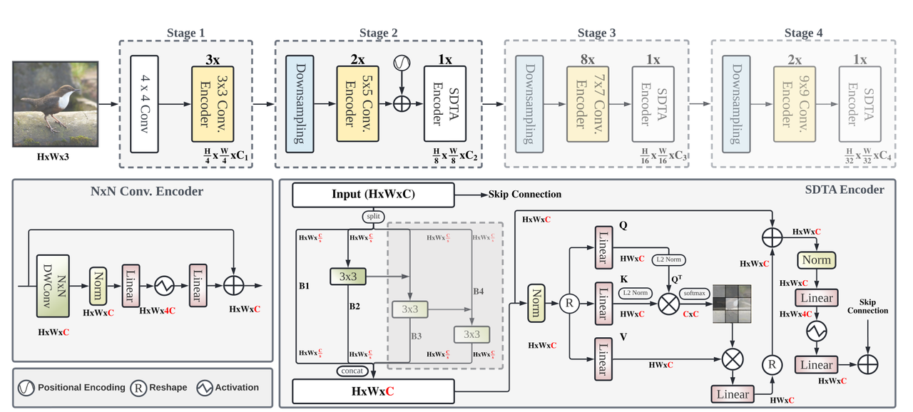
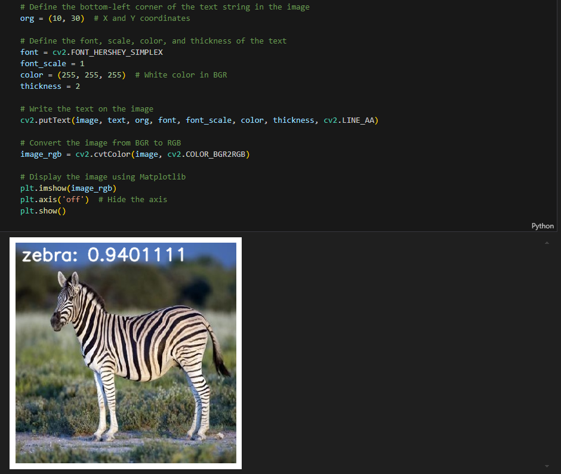

English | [简体中文](./README_cn.md)

# Transformer - EdgeNeXt

- [Transformer - EdgeNeXt](#transformer---edgenext)
  - [1. Introduction](#1-introduction)
  - [2. Model performance data](#2-model-performance-data)
  - [3. Model download](#3-model-download)
  - [4. Deployment Testing](#4ment-testing)
  - [5. Model Quantitation Experiment](#5-model-quantitation-experiment)

## 1. Introduction

- **Paper**: [EdgeNeXt: Efficiently Amalgamated CNN-Transformer Architecture for Mobile Vision Applications](https://arxiv.org/abs/2206.10589)

- **GitHub repository**: [EdgeNeXt](https://github.com/mmaaz60/EdgeNeXt)




EdgeNeXt network designs a hybrid architecture of convolution and transformer from the perspective of lightweighted, taking into account model performance and model size/inference speed.

The overall architecture adopts the standard "four-stage" pyramid paradigm design, which includes two important modules: convolution encoder and SDTA encoder. In the convolution encoder, the design of Self-Adaptation kernel size is applied, which echoes the idea of multi-scale receptive fields in SDTA. In the SDTA encoder, the feature encoding part uses a fixed 3x3 convolution, but realizes the fusion of multi-scale receptive fields through hierarchical cascade. Whether using convolution kernels of different sizes will bring better results remains to be verified.

In the self-attention calculation section, by applying dot product operation to the channel dimension, an output that takes into account both computational complexity and global attention is obtained, which is a core point supporting the network. From the perspective of classification performance, the effect is indeed good, but when combined with detection and segmentation tasks, there are slightly fewer models for comparison, and only some lightweight network comparisons are provided.

**EdgeNeXt model features**:

- The hybrid structure of Transformer and CNN maintains the accuracy of Transformer while maintaining the inference speed of CNN.
- Four-stage structure pyramid, quantitative deployment is more friendly
- By increasing the receptive field and encoding multi-scale features through channel group segmentation and reasonable attention mechanisms, resource utilization can be improved

## 2. Model performance data

The following table shows the performance data obtained from actual testing on RDK X5 & RDK X5 Module. You can weigh the size of the model according to your own reasoning about the actual performance and accuracy required

| Model              | Size    | Categories | Parameter | Floating point precision | Quantization accuracy | Latency/throughput (single-threaded) | Latency/throughput (multi-threaded) | Frame rate(FPS) |
| ----------------- | ------- | ---- | ------ | ----- | ----- | ----------- | ----------- | ------ |
| EdgeNeXt_base     | 224x224 | 1000 | 18.51  | 78.21 | 74.52 | 8.80        | 32.31       | 113.35 |
| EdgeNeXt_small    | 224x224 | 1000 | 5.59   | 76.50 | 71.75 | 4.41        | 14.93       | 226.15 |
| EdgeNeXt_x_small  | 224x224 | 1000 | 2.34   | 71.75 | 66.25 | 2.88        | 9.63        | 345.73 |
| EdgeNeXt_xx_small | 224x224 | 1000 | 1.33   | 69.50 | 64.25 | 2.47        | 7.24        | 403.49 |

Description:
1. X5 is in the best state: CPU is 8xA55@1.8G, full core Performance scheduling, BPU is 1xBayes-e@1G, a total of 10TOPS equivalent int8 computing power.
2. Single-threaded delay is the ideal situation for single frame, single-threaded, and single-BPU core delay, and BPU inference for a task.
3. The frame rate of a 4-thread project is when 4 threads simultaneously send tasks to a dual-core BPU. In a typical project, 4 threads can control the single frame delay to be small, while consuming all BPUs to 100%, achieving a good balance between throughput (FPS) and frame delay.
4. The maximum frame rate of 8 threads is for 8 threads to simultaneously load tasks into the dual-core BPU of X3. The purpose is to test the maximum performance of the BPU. Generally, 4 cores are already full. If 8 threads are much better than 4 threads, it indicates that the model structure needs to improve the "calculation/memory access" ratio or optimize the DDR bandwidth when compiling.
5. Floating-point/fixed-point precision: Floating-point accuracy uses the Top-1 inference Confidence Level of onnx before the model is quantized, while quantized accuracy is the Confidence Level of the actual inference of the model after quantization.

## 3. Model download

**.Bin file download** :

You can use the script [download_bin.sh](./model/download_bin.sh) to download all .bin model files for this model structure with one click, making it easy to change models directly. Alternatively, use one of the following command lines to select a single model for download:

```shell
wget https://archive.d-robotics.cc/downloads/rdk_model_zoo/rdk_x5/EdgeNeXt_base_224x224_nv12.bin
wget https://archive.d-robotics.cc/downloads/rdk_model_zoo/rdk_x5/EdgeNeXt_small_224x224_nv12.bin
wget https://archive.d-robotics.cc/downloads/rdk_model_zoo/rdk_x5/EdgeNeXt_x_small_224x224_nv12.bin
wget https://archive.d-robotics.cc/downloads/rdk_model_zoo/rdk_x5/EdgeNeXt_xx_small_224x224_nv12.bin
```

**ONNX file download** :

Similarly to the .bin file, use [download_onnx.sh](./model/download_onnx.sh) to download all .onnx model files of this model structure with one click, or download a single .onnx model for quantization experiments:

```shell
wget https://archive.d-robotics.cc/downloads/rdk_model_zoo/rdk_x5/edgenext_base.onnx
wget https://archive.d-robotics.cc/downloads/rdk_model_zoo/rdk_x5/edgenext_small.onnx
wget https://archive.d-robotics.cc/downloads/rdk_model_zoo/rdk_x5/edgenext_x_small.onnx
wget https://archive.d-robotics.cc/downloads/rdk_model_zoo/rdk_x5/edgenext_xx_small.onnx
```

## 4. Deployment Testing

After downloading the .bin file, you can execute the EdgeNeXt model jupyter script file of the test_EdgeNeXt_ * .ipynb series to experience the actual test effect on the board. If you need to change the test picture, you can download the dataset separately and put it in the data folder and change the path of the picture in the jupyter file



## 5. Model Quantitation Experiment

If you want to further advance the learning of model quantization, such as selecting quantization accuracy, selecting model nodes, configuring model input and output formats, etc., you can execute the shell file under the mapper folder in the Tiangong Kaiwu toolchain (note that it is on the PC side, not the board side) in order to optimize the model quantization.

EdgeNeXt due to the internal softmax node, Tiangong Kaiwu toolchain default softmax node on the CPU execution, need to be in the yaml configuration file under the model_parameters parameter node_info softmax quantization in BPU. Here only gives the yaml configuration file (in the yaml folder), if you need to carry out quantization experiments, you can replace the yaml file corresponding to different sizes of models