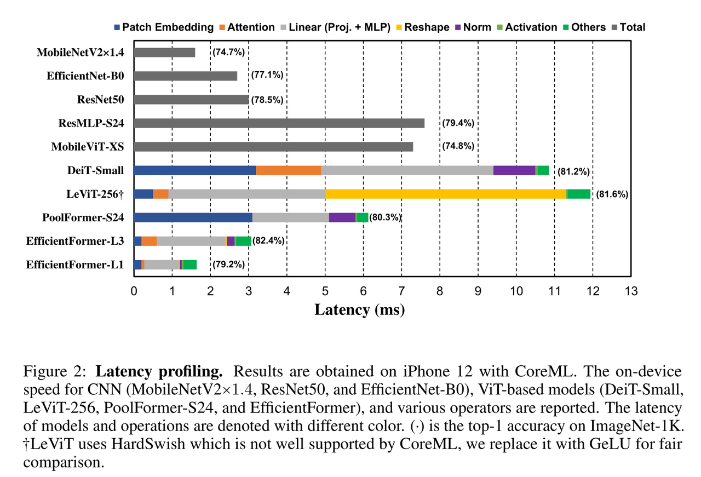
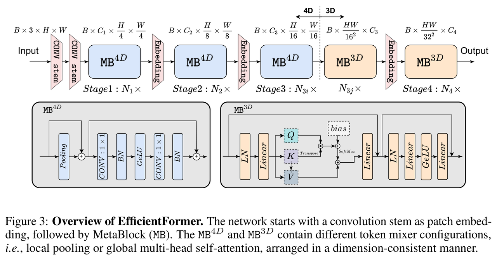
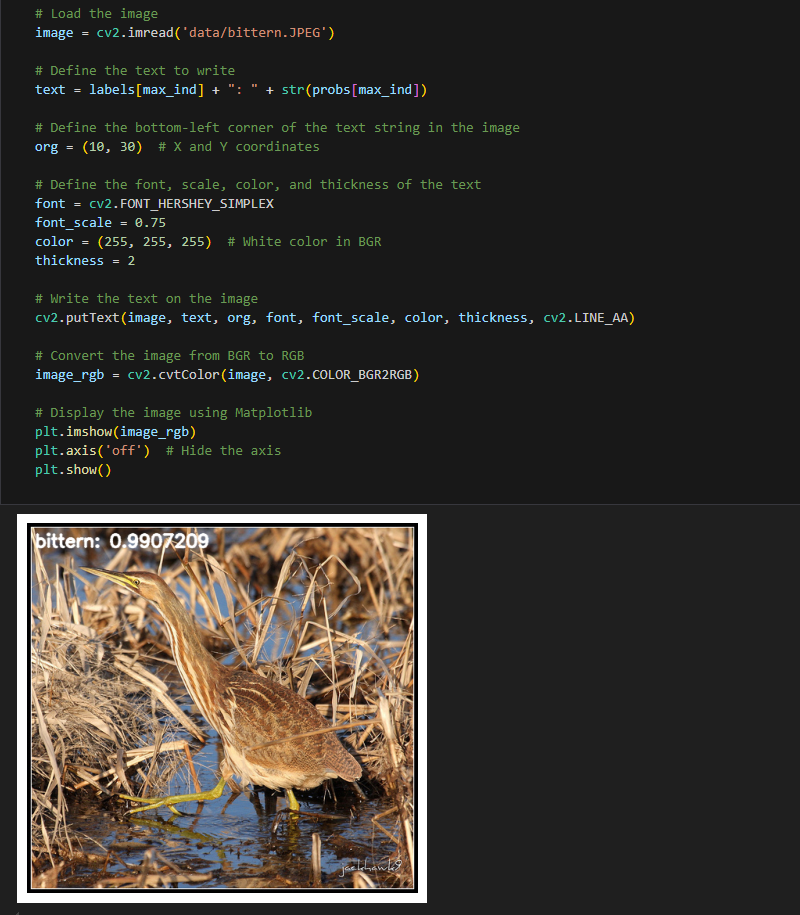

[English](./README.md) | 简体中文

# Transformer X5 - EfficientFormer

## 目录

- [Transformer X5 - EfficientFormer](#transformer-x5---efficientformer)
  - [目录](#目录)
  - [1. 简介](#1-简介)
  - [2. 模型性能数据](#2-模型性能数据)
  - [3. 模型下载](#3-模型下载)
  - [4. 部署测试](#4-部署测试)
  - [5. 量化实验](#5-量化实验)

## 1. 简介

- **论文地址**: [EfficientFormer: Vision Transformers at MobileNet Speed](https://arxiv.org/abs/2206.01191)

- **Github 仓库**: [EfficientFormer](https://github.com/snap-research/EfficientFormer)

Transformer推理速度慢，难以部署在移动端。前面尽管做了许多工作，但还是没有很好的解决这个问题。图中作者作者对不同模型在端侧运行进行了一些分析，主要是分为 ViT 对图像进行分块的 Patch Embedding、Transformer 中的 Attention 和 MLP，另外还有 LeViT 提出的 Reshape 和一些激活等。基于下面这个表，提出了几个猜想，然后设计出了 EfficientFormer 结构。



EfficientFormer 可以在移动设备上以 MobileNet 的速度运行，在一系列ViT架构中识别出低效的算子，从而来指导新设计范式，性能优于MobileViT等轻量化网络。EfficientFormer模型优于现有Transformer模型，同时比最具竞争力的CNN更快。ViT结构的延迟驱动分析和实验结果验证了作者的说法：**强大的视觉Transformer可以在边缘实现超快的推理速度**。



**EfficientFormer 模型特点**：

- 通过延迟分析重新探讨ViT及其变体的设计原则。在现有工作的基础上，使用iPhone 12作为测试平台，使用公开的CoreML作为编译器，因为移动设备被广泛使用，结果可以很容易地复现。
- 其次，确定了ViT中的低效设计和操作，并为视觉Transformer提出了一种新的维度一致性设计范式。
- 从一个具有新设计范式的超网开始，提出了一种简单而有效的延迟驱动瘦身方法，以获得一个新的模型，即EfficientFormer直接优化推理速度。


## 2. 模型性能数据

以下表格是在 RDK X5 & RDK X5 Module 上实际测试得到的性能数据，可以根据自己推理实际需要的性能和精度，对模型的大小做权衡取舍

| 模型                 | 尺寸(像素)  | 类别数  | 参数量(M) | 浮点精度  | 量化精度  | 延迟/吞吐量(单线程) | 延迟/吞吐量(多线程) | 帧率      |
| ------------------ | ------- | ---- | ------ | ----- | ----- | ----------- | ----------- | ------- |
| EfficientFormer_l3 | 224x224 | 1000 | 31.3   | 76.75 | 76.05 | 17.55       | 65.56       | 60.52   |
| EfficientFormer_l1 | 224x224 | 1000 | 12.3   | 76.12 | 65.38 | 5.88        | 20.69       | 191.605 |


说明: 
1. X5的状态为最佳状态：CPU为8xA55@1.8G, 全核心Performance调度, BPU为1xBayes-e@1G, 共10TOPS等效int8算力。
2. 单线程延迟为单帧，单线程，单BPU核心的延迟，BPU推理一个任务最理想的情况。
3. 4线程工程帧率为4个线程同时向双核心BPU塞任务，一般工程中4个线程可以控制单帧延迟较小，同时吃满所有BPU到100%，在吞吐量(FPS)和帧延迟间得到一个较好的平衡。
4. 8线程极限帧率为8个线程同时向X3的双核心BPU塞任务，目的是为了测试BPU的极限性能，一般来说4核心已经占满，如果8线程比4线程还要好很多，说明模型结构需要提高"计算/访存"比，或者编译时选择优化DDR带宽。
5. 浮点/定点精度：浮点精度使用的是模型未量化前onnx的 Top-1 推理置信度，量化精度则为量化后模型实际推理的置信度。


## 3. 模型下载

**.bin 文件下载**：

可以使用脚本 [download_bin.sh](./model/download_bin.sh) 一键下载所有此模型结构的 .bin 模型文件，方便直接更换模型。或者使用以下命令行中的一个，选取单个模型进行下载：

```shell
wget https://archive.d-robotics.cc/downloads/rdk_model_zoo/rdk_x5/EfficientFormer_l1-deploy_224x224_nv12.bin
wget https://archive.d-robotics.cc/downloads/rdk_model_zoo/rdk_x5/EfficientFormer_l1-deploy_224x224_nv12.bin
```

**ONNX文件下载**：

与.bin文件同理，使用 [download_onnx.sh](./model/download_onnx.sh)一键下载所有此模型结构的 .onnx 模型文件，或下载单个 .onnx 模型进行量化实验：

```shell
wget https://archive.d-robotics.cc/downloads/rdk_model_zoo/rdk_x5/efficientformer_l1_deploy.onnx
wget https://archive.d-robotics.cc/downloads/rdk_model_zoo/rdk_x5/efficientformer_l3_deploy.onnx
```

## 4. 部署测试

在下载完毕 .bin 文件后，可以执行 test_EfficientFormer_*.ipynb 系列的 EfficientFormer 模型 jupyter 脚本文件，在板端实际运行体验实际测试效果。需要更改测试图片，可额外下载数据集后，放入到data文件夹下并更改 jupyter 文件中图片的路径



## 5. 量化实验

若想要进一步进阶对模型量化过程中的学习，如选取量化精度、对模型节点进行取舍、模型输入输出格式配置等，可以按顺序在天工开物工具链（注意是在pc端，不是板端）中执行 mapper 文件夹下的shell文件，对模型进行量化调优。

EfficientFormer 由于内部带有 softmax 结点，天工开物工具链默认将 softmax 结点放在CPU上执行，需要在yaml配置文件中的 model_parameters 参数下的 node_info 将 softmax 在BPU中进行量化。这里仅仅给出 yaml 的配置文件（在yaml文件夹中），如需进行量化实验可将对应不同大小模型的yaml文件自行替换