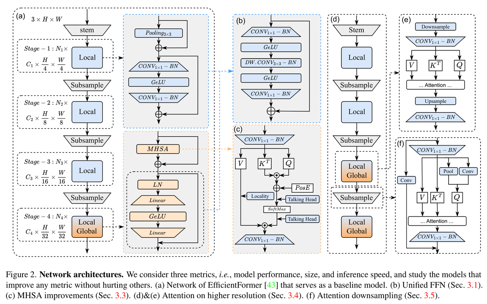
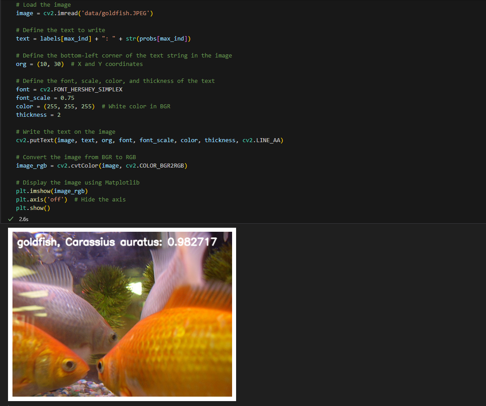

[English](./README.md) | 简体中文

# Transformer X5 - EfficientFormerV2

- [Transformer X5 - EfficientFormerV2](#transformer-x5---efficientformerv2)
  - [1. 简介](#1-简介)
  - [2. 模型性能数据](#2-模型性能数据)
  - [3. 模型下载](#3-模型下载)
  - [4. 部署测试](#4-部署测试)
  - [5. 量化实验](#5-量化实验)

## 1. 简介

- **论文地址**: [EfficientFormerV2: Rethinking Vision Transformers for MobileNet Size and Speed](https://arxiv.org/abs/2212.08059)

- **Github 仓库**: [EfficientFormer](https://github.com/snap-research/EfficientFormer)



EfficientFormerV2 使用混合视觉骨干网络并适用于移动设备，提出了一种针对大小和速度的细粒度联合搜索。该模型既轻量又在推理速度上极快。论文采用了四阶段分层设计，其获得的特征尺寸为输入分辨率的 {1/4，1/8，1/16，1/32}。EfficientFormerV2从一个小的内核卷积stem开始嵌入输入图像，而不是使用非重叠patch的低效嵌入。

EfficientFormerV2 直接将原来的 Pooling 层删掉了(下采样越大，理论感受野越大)，而是直接替换成 BottleNeck 的形式，先用 1×1 卷积降维压缩，再嵌入 3×3 的深度可分离卷积提取局部信息，最后再通过 1×1 的卷积升维。这样做的一个好处是，这种修改有利于后续直接采用超参搜索技术搜索出具体模块数量的网络深度，以便在网络的后期阶段中提取局部和全局信息。

**EfficientFormerV2 模型特点**：

- 提出了**一种新的超网络设计方法**，该方法在**维护较高的准确性的同时，可以在移动设备上运行**
- 提出了**一种细粒度的联合搜索策略**，该策略可以**同时优化延迟和参数数量**，从而找到高效的架构
- EfficientFormerV2 模型在 ImageNet-1K 数据集上的准确性**比 MobileNetV2 和 MobileNetV2×1.4高出约 4%，同时具有相似的延迟和参数**

## 2. 模型性能数据

以下表格是在 RDK X5 & RDK X5 Module 上实际测试得到的性能数据，可以根据自己推理实际需要的性能和精度，对模型的大小做权衡取舍


| 模型  | 尺寸(像素)   | 类别数   | 参数量(M) | 浮点精度   | 量化精度   | 延迟/吞吐量(单线程) | 延迟/吞吐量(多线程) | 帧率     |
| -------------------- | -------- | ----- | ------ | ------ | ------ | ----------- | ----------- | ------ |
| EfficientFormerv2_s2 | 224x224  | 1000  | 12.6   | 77.50  | 70.75  | 6.99        | 26.01       | 152.40 |
| EfficientFormerv2_s1 | 224x224  | 1000  | 6.1    | 77.25  | 68.75  | 4.24        | 14.35       | 275.95 |
| EfficientFormerv2_s0 | 224x224  | 1000  | 3.5    | 74.25  | 68.50  | 5.79        | 19.96       | 198.45 |


说明: 
1. X5的状态为最佳状态：CPU为8xA55@1.8G, 全核心Performance调度, BPU为1xBayes-e@1G, 共10TOPS等效int8算力。
2. 单线程延迟为单帧，单线程，单BPU核心的延迟，BPU推理一个任务最理想的情况。
3. 4线程工程帧率为4个线程同时向双核心BPU塞任务，一般工程中4个线程可以控制单帧延迟较小，同时吃满所有BPU到100%，在吞吐量(FPS)和帧延迟间得到一个较好的平衡。
4. 8线程极限帧率为8个线程同时向X3的双核心BPU塞任务，目的是为了测试BPU的极限性能，一般来说4核心已经占满，如果8线程比4线程还要好很多，说明模型结构需要提高"计算/访存"比，或者编译时选择优化DDR带宽。
5. 浮点/定点精度：浮点精度使用的是模型未量化前onnx的 Top-1 推理置信度，量化精度则为量化后模型实际推理的置信度。


## 3. 模型下载

**.bin 文件下载**：

可以使用脚本 [download_bin.sh](./model/download_bin.sh) 一键下载所有此模型结构的 .bin 模型文件，方便直接更换模型。或者使用以下命令行中的一个，选取单个模型进行下载：

```shell
wget https://archive.d-robotics.cc/downloads/rdk_model_zoo/rdk_x5/EfficientFormerv2_s2_224x224_nv12.bin
wget https://archive.d-robotics.cc/downloads/rdk_model_zoo/rdk_x5/EfficientFormerv2_s1_224x224_nv12.bin
wget https://archive.d-robotics.cc/downloads/rdk_model_zoo/rdk_x5/EfficientFormerv2_s0_224x224_nv12.bin
```

**ONNX文件下载**：

与.bin文件同理，使用 [download_onnx.sh](./model/download_onnx.sh)一键下载所有此模型结构的 .onnx 模型文件，或下载单个 .onnx 模型进行量化实验：

```shell
wget https://archive.d-robotics.cc/downloads/rdk_model_zoo/rdk_x5/efficientformerv2_s2_deploy.onnx
wget https://archive.d-robotics.cc/downloads/rdk_model_zoo/rdk_x5/efficientformerv2_s1_deploy.onnx
wget https://archive.d-robotics.cc/downloads/rdk_model_zoo/rdk_x5/efficientformerv2_s0_deploy.onnx
```

## 4. 部署测试

在下载完毕 .bin 文件后，可以执行 test_EfficientFormerV2_*.ipynb 系列的 EfficientFormerV2 模型 jupyter 脚本文件，在板端实际运行体验实际测试效果。需要更改测试图片，可额外下载数据集后，放入到data文件夹下并更改 jupyter 文件中图片的路径




## 5. 量化实验

若想要进一步进阶对模型量化过程中的学习，如选取量化精度、对模型节点进行取舍、模型输入输出格式配置等，可以按顺序在天工开物工具链（注意是在pc端，不是板端）中执行 mapper 文件夹下的shell文件，对模型进行量化调优。

EfficientFormerV2 由于内部带有 softmax 结点，天工开物工具链默认将 softmax 结点放在CPU上执行，需要在yaml配置文件中的 model_parameters 参数下的 node_info 将 softmax 在BPU中进行量化。这里仅仅给出 yaml 的配置文件（在yaml文件夹中），如需进行量化实验可将对应不同大小模型的yaml文件自行替换