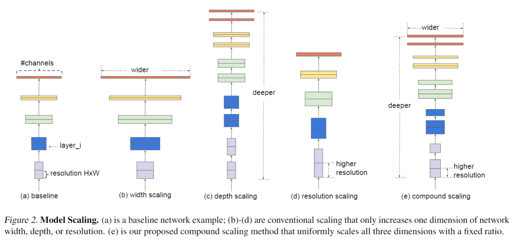
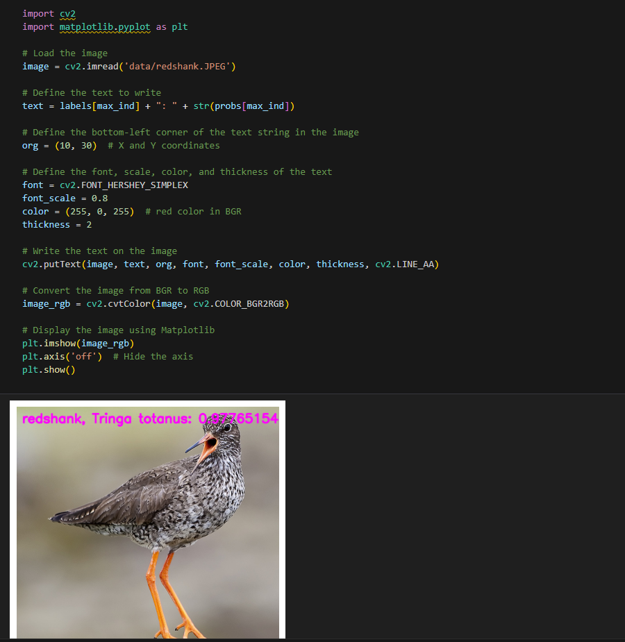

English | [简体中文](./README_cn.md)

# CNN X5 - EfficientNet

- [CNN X5 - EfficientNet](#cnn-x5---efficientnet)
  - [1. Introduction](#1-introduction)
  - [2. Model performance data](#2-model-performance-data)
  - [3. Model download](#3-model-download)
  - [4. Deployment Testing](#4-deployment-testing)
  - [5. Model Quantitation Experiment](#5-model-quantitation-experiment)


## 1. Introduction

- **Paper**: [EfficientNet: Rethinking Model Scaling for Convolutional Neural Networks](https://arxiv.org/abs/1905.11946)

- **GitHub repository**: [lukemelas/EfficientNet-PyTorch: A PyTorch implementation of EfficientNet (github.com)](https://github.com/lukemelas/EfficientNet-PyTorch)


EfficientNet is an innovative network structure that balances the resolution, depth, and width of convolution neural networks (CNNs). Its core feature is to systematically optimize network performance and efficiency through the Compound Scaling method. Traditional network designs usually only adjust a single dimension of the network, such as width, depth, or resolution of the input image. However, EfficientNet unifies these three key dimensions through a simple and efficient composite coefficient. This method determines the optimal proportion of each dimension through grid search, thereby maximizing the overall performance of the network under given resource constraints.

EfficientNet combines AutoML technology to automatically search for the best network parameter combination, which greatly reduces the number of parameters and computing resources while maintaining high accuracy. For example, EfficientNet-B7 achieves a top-1 accuracy of 84.3% on the ImageNet dataset, with only 1/8.4 of the parameters of GPipe, and inference speed is increased by 6.1 times.

**EfficientNet model features**:

- **Compound scaling method**: Maximize model performance and efficiency by uniformly adjusting the three dimensions of resolution, depth, and width, instead of adjusting a single dimension separately.
- **AutoML technology**: Using AutoML to automatically search for the best network parameter combination, the model can significantly reduce the number of parameters and computational resource consumption while maintaining high accuracy.
- **Efficient and lightweight network structure**: With an optimized compound scaling strategy, EfficientNet achieves fewer parameters and faster inference speed, but may consume more video memory when processing larger models.

## 2. Model performance data

The following table shows the performance data obtained from actual testing on RDK X5 & RDK X5 Module. You can weigh the size of the model according to your own reasoning about the actual performance and accuracy required


| Model        | Size    | Categories | Parameter | Floating point precision | Quantization accuracy | Latency/throughput (single-threaded) | Latency/throughput (multi-threaded) | Frame rate(FPS) |
| ------------ | ------- | ---- | ------ | ----- | ----- | ----------- | ----------- | ------- |
| Efficientnet_B4   | 224x224     | 1000     | 19.27     | 74.25     | 71.75     | 5.44        | 18.63       | 212.75      |
| Efficientnet_B3   | 224x224     | 1000     | 12.19     | 76.22     | 74.05     | 3.96        | 12.76       | 310.30      |
| Efficientnet_B2   | 224x224     | 1000     | 9.07      | 76.50     | 73.25     | 3.31        | 10.51       | 376.77      |


Description:
1. X5 is in the best state: CPU is 8xA55@1.8G, full core Performance scheduling, BPU is 1xBayes-e@1G, a total of 10TOPS equivalent int8 computing power.
2. Single-threaded delay is the ideal situation for single frame, single-threaded, and single-BPU core delay, and BPU inference for a task.
3. The frame rate of a 4-thread project is when 4 threads simultaneously send tasks to a dual-core BPU. In a typical project, 4 threads can control the single frame delay to be small, while consuming all BPUs to 100%, achieving a good balance between throughput (FPS) and frame delay.
4. The maximum frame rate of 8 threads is for 8 threads to simultaneously load tasks into the dual-core BPU of X3. The purpose is to test the maximum performance of the BPU. Generally, 4 cores are already full. If 8 threads are much better than 4 threads, it indicates that the model structure needs to improve the "calculation/memory access" ratio or optimize the DDR bandwidth when compiling.
5. Floating-point/fixed-point precision: Floating-point accuracy uses the Top-1 inference accuracy Level of onnx before the model is quantized, while quantized accuracy is the accuracy Level of the actual inference of the model after quantization.


## 3. Model download

**.Bin file download** :

You can use the script [download_bin.sh](./model/download_bin.sh) to download all .bin model files for this model structure with one click, making it easy to change models directly. Alternatively, use one of the following command lines to select a single model for download:

```shell
wget https://archive.d-robotics.cc/downloads/rdk_model_zoo/rdk_x5/EfficientNet_B2_224x224_nv12.bin
wget https://archive.d-robotics.cc/downloads/rdk_model_zoo/rdk_x5/EfficientNet_B3_224x224_nv12.bin
wget https://archive.d-robotics.cc/downloads/rdk_model_zoo/rdk_x5/EfficientNet_B4_224x224_nv12.bin
```

**ONNX file download** :

Similarly to the .bin file, use [download_onnx.sh](./model/download_onnx.sh) to download all .onnx model files of this model structure with one click, or download a single .onnx model for quantization experiments:

```shell
wget https://archive.d-robotics.cc/downloads/rdk_model_zoo/rdk_x5/EfficientNet_B2_224x224_nv12.bin
wget https://archive.d-robotics.cc/downloads/rdk_model_zoo/rdk_x5/EfficientNet_B3_224x224_nv12.bin
wget https://archive.d-robotics.cc/downloads/rdk_model_zoo/rdk_x5/EfficientNet_B4_224x224_nv12.bin
```

## 4. Deployment Testing

After downloading the .bin file, you can execute the EfficientNet model jupyter script file of the test_EfficientNet_*.ipynb series to experience the actual test effect on the board. If you need to change the test picture, you can download the dataset separately and put it in the data folder and change the path of the picture in the jupyter file



## 5. Model Quantitation Experiment

If you want to further advance the learning of model quantization, such as selecting quantization accuracy, selecting model nodes, configuring model input and output formats, etc., you can execute the shell file under the mapper folder in the Tiangong Kaiwu toolchain (note that it is on the PC side, not the board side) in order to optimize the model quantization. Here only gives the yaml configuration file (in the yaml folder), if you need to carry out quantization experiments, you can replace the yaml file corresponding to different sizes of models