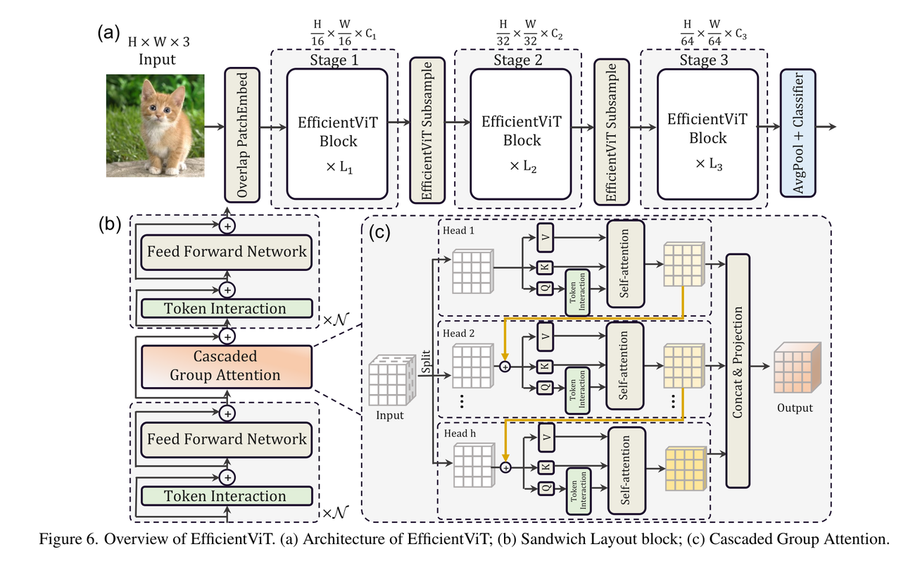
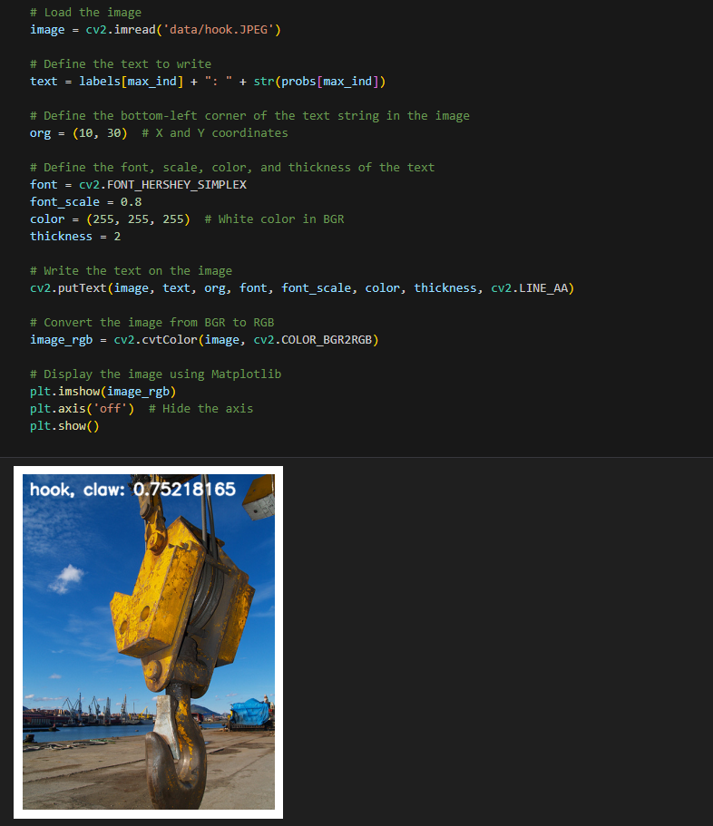

English | [简体中文](./README_cn.md)

# Transformer - EfficientViT_MSRA

- [Transformer - EfficientViT\_MSRA](#transformer---efficientvit_msra)
  - [1. Introduction](#1-introduction)
  - [2. Model performance data](#2-model-performance-data)
  - [3. Model download](#3-model-download)
  - [4. Deployment Testing](#4-deployment-testing)
  - [5. Model Quantitation Experiment](#5-model-quantitation-experiment)

## 1. Introduction

- **Paper**: [EfficientViT: Memory Efficient Vision Transformer with Cascaded Group Attention](https://arxiv.org/abs/2305.07027)

- **GitHub repository**: [EfficientViT_MSRA](https://github.com/microsoft/Cream/tree/main/EfficientViT)

Transformer requires a large amount of computation and is not suitable for real-time inference applications. In addition, many practical application scenarios require high real-time inference capabilities of the model, but most lightweight ViT still cannot achieve speeds comparable to lightweight CNNs (such as MobileNet) in multiple deployment scenarios (GPU, CPU, ONNX, mobile end, etc.).


In ViT, multi-head self-attention (MHSA) and feedforward neural network (FFN) are usually two indispensable components and are arranged alternately. However, a large number of operations in MHSA, such as reshape, element-wise addition, and normalization, are non-computationally intensive, so more time is wasted on data reading operations, resulting in only a small part of the inference process being used for tensor calculations, as shown in Figure 2.


Although some works have proposed simplifying traditional self-attention to achieve acceleration, the expressive ability of the model has also been affected, leading to performance degradation. Therefore, the author of this article starts by exploring the optimal module arrangement to reduce the use of inefficient MHSA modules in the model. By reducing MHSA and FFN blocks, the author constructed multiple Swin-T and DeiT-T sub-networks with 1.25 and 1.5 times acceleration, each with a different MHSA block ratio. After training these sub-networks, the author found that the original Transformer's 1:1 design paradigm of MHSA and FFN could not achieve the optimal speed-accuracy trade-off, while sub-networks with fewer MHSA module ratios (20%~ 40%) could achieve higher accuracy.



EfficientViT uses overlap patch embedding to enhance the low-level visual representation ability of the model. Since BN can be fused with linear and convolution layers for acceleration during inference, the normalization layer in the network uses BN to replace LN. Similar to MobileNetv3 and LeViT, the network has fewer layers at large scales and uses a width expansion coefficient of less than 2 at each stage to reduce deep redundancy.

**EfficientViT_msra model features**：

- The speed bottleneck of ViT was analyzed from three dimensions, including the large amount of memory access time caused by multi-head self-attention (MHSA), computational redundancy between attention heads, and inefficient model parameter allocation
- Using the EfficientViT block as the basic module, each block consists of a sandwich layout and a cascaded group attention (CGA)


## 2. Model performance data

The following table shows the performance data obtained from actual testing on RDK X5 & RDK X5 Module.

| Model                | Size    | Categories | Parameter | Floating point precision | Quantization accuracy | Latency/throughput (single-threaded) | Latency/throughput (multi-threaded) | Frame rate(FPS) |
| -------------------- | ------- | ---- | ------ | ----- | ----- | ----------- | ----------- | ------ |
| EfficientViT_MSRA_m5 | 224x224 | 1000 | 12.4   | 73.75 | 72.50 | 6.34        | 22.69       | 174.70 |

Description:
1. X5 is in the best state: CPU is 8xA55@1.8G, full core Performance scheduling, BPU is 1xBayes-e@1G, a total of 10TOPS equivalent int8 computing power.
2. Single-threaded delay is the ideal situation for single frame, single-threaded, and single-BPU core delay, and BPU inference for a task.
3. The frame rate of a 4-thread project is when 4 threads simultaneously send tasks to a dual-core BPU. In a typical project, 4 threads can control the single frame delay to be small, while consuming all BPUs to 100%, achieving a good balance between throughput (FPS) and frame delay.
4. The maximum frame rate of 8 threads is for 8 threads to simultaneously load tasks into the dual-core BPU of X3. The purpose is to test the maximum performance of the BPU. Generally, 4 cores are already full. If 8 threads are much better than 4 threads, it indicates that the model structure needs to improve the "calculation/memory access" ratio or optimize the DDR bandwidth when compiling.
5. Floating-point/fixed-point precision: Floating-point accuracy uses the Top-1 inference accuracy Level of onnx before the model is quantized, while quantized accuracy is the accuracy Level of the actual inference of the model after quantization.

## 3. Model download

**.Bin file download**:

You can use the script [download_bin.sh](./model/download_bin.sh) to download all .bin model files for this model structure with one click, making it easy to change models directly. Alternatively, use one of the following command lines to select a single model for download:

```shell
wget https://archive.d-robotics.cc/downloads/rdk_model_zoo/rdk_x5/EfficientViT_m5_224x224_nv12.bin
```

**ONNX file download**:

The onnx model is transformed using models from the timm library (PyTorch Image Models). Install the required packages using the following command:

```shell
pip install timm onnx
```

Model transformation takes efficientvit_m5 as an example:

```Python
import torch
import torch.onnx
import onnx
from onnxsim import simplify
from timm.models import create_model

from timm.models.efficientvit_msra import efficientvit_m5

def count_parameters(onnx_model_path):
    # Load the ONNX model
    model = onnx.load(onnx_model_path)
    # Get the initializers (weights in the model)
    initializer = model.graph.initializer
    
    # Calculate the total number of parameters
    total_params = 0
    for tensor in initializer:
        # Get the dimensions of each weight
        dims = tensor.dims
        # Calculate the number of parameters in this weight (product of all dimensions)
        params = 1
        for dim in dims:
            params *= dim
        total_params += params
    
    return total_params

if __name__ == "__main__":
    device = torch.device("cuda" if torch.cuda.is_available() else "cpu")
    model = create_model('efficientvit_m5', pretrained=True)
    model.eval()

    # print the model structure

    dummy_input = torch.randn(1, 3, 224, 224, device="cpu")
    onnx_file_path = "efficientvit_m5.onnx"

    torch.onnx.export(
        model,
        dummy_input,
        onnx_file_path,
        opset_version=11,
        verbose=True,
        input_names=["data"],  # Input name
        output_names=["output"],  # Output name
    )
    
    # Simplify the ONNX model
    model_simp, check = simplify(onnx_file_path)

    if check:
        print("Simplified model is valid.")
        simplified_onnx_file_path = "efficientvit_m5.onnx"
        onnx.save(model_simp, simplified_onnx_file_path)
        print(f"Simplified model saved to {simplified_onnx_file_path}")
    else:
        print("Simplified model is invalid!")
        
    onnx_model_path = simplified_onnx_file_path  # Replace with your ONNX model path
    total_params = count_parameters(onnx_model_path)
    print(f"Total number of parameters in the model: {total_params}")
```

## 4. Deployment Testing

After downloading the .bin file, you can execute the EfficientViT_msra model jupyter script file of the test_EfficientViT_msra_ * .ipynb series to experience the actual test effect on the board. If you need to change the test picture, you can download the dataset separately and put it in the data folder and change the path of the picture in the jupyter file



## 5. Model Quantitation Experiment

If you want to further advance the learning of model quantization, such as selecting quantization accuracy, selecting model nodes, configuring model input and output formats, etc., you can execute the shell file under the mapper folder in the Tiangong Kaiwu toolchain (note that it is on the PC side, not the board side) in order to optimize the model quantization.

EfficientViT_msra due to the internal softmax node, Tiangong Kaiwu toolchain default softmax node on the CPU execution, need to be in the yaml configuration file under the model_parameters parameter node_info softmax quantization in BPU. Here only gives the yaml configuration file (in the yaml folder), if you need to carry out quantization experiments, you can replace the yaml file corresponding to different sizes of models.