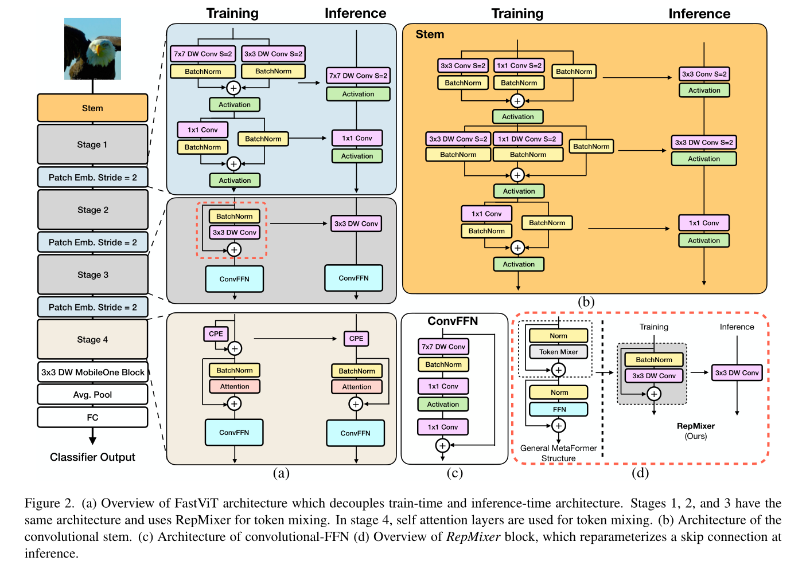
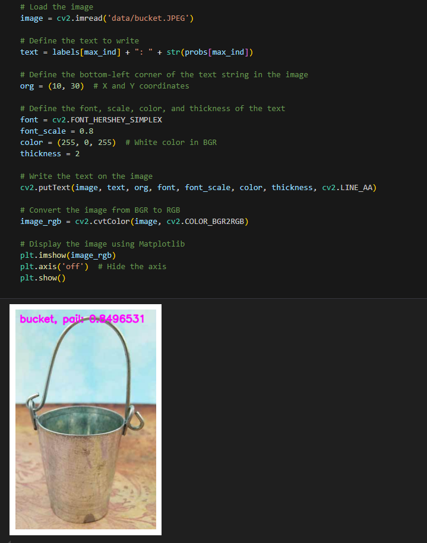

[English](./README.md) | 简体中文

# Transformer - FastViT

- [Transformer - FastViT](#transformer---fastvit)
  - [1. 简介](#1-简介)
  - [2. 模型性能数据](#2-模型性能数据)
  - [3. 模型下载](#3-模型下载)
  - [4. 部署测试](#4-部署测试)
  - [5. 量化实验](#5-量化实验)

## 1. 简介

- **论文地址**: [FastViT: A Fast Hybrid Vision Transformer using Structural Reparameterization](http://arxiv.org/abs/2303.14189)

- **Github 仓库**: [apple/ml-fastvit: This repository contains the official implementation of the research paper, "FastViT: A Fast Hybrid Vision Transformer using Structural Reparameterization" ICCV 2023 (github.com)](https://github.com/apple/ml-fastvit)



FastViT 引入了一种新的 token mixer(RepMixer)，使用结构重新参数化技术通过删除网络中的残差连接来降低内存访问成本，并使用使用大核卷积提升精度。为进一步改善效率与性能，作者将stem与下采样模块的稠密卷积进行拆解并引入重参数机制。自注意力机制在高分辨率阶段计算度过高，作者采用大核卷积作为替代，仅在第4阶段使用自注意力。

**FastViT 模型特点**：

- 提出了一种新的Token Mixing操作RepMixer作为FastViT的基础部件，它采用**结构重参数机制**移除跳过连接以降低访存占用
- 引入重参数机制与大核卷积进一步提升模型性能，在网络中使用了大核卷积在前几个阶段替换掉 Self-Attention


## 2. 模型性能数据

以下表格是在 RDK X5 & RDK X5 Module 上实际测试得到的性能数据，可以根据自己推理实际需要的性能和精度，对模型的大小做权衡取舍。


| 模型           | 尺寸(像素)  | 类别数  | 参数量(M) | 浮点Top-1  | 量化Top-1  | 延迟/吞吐量(单线程) | 延迟/吞吐量(多线程) | 帧率     |
| ------------ | ------- | ---- | ------ | ----- | ----- | ----------- | ----------- | ------ |
| FastViT_SA12 | 224x224 | 1000 | 10.9   | 78.25 | 74.50 | 11.56       | 42.45       | 93.44  |
| FastViT_S12  | 224x224 | 1000 | 8.8    | 76.50 | 72.0  | 5.86        | 20.45       | 193.87 |
| FastViT_T12  | 224x224 | 1000 | 6.8    | 74.75 | 70.43 | 4.97        | 16.87       | 234.78 |
| FastViT_T8   | 224x224 | 1000 | 3.6    | 73.50 | 68.50 | 2.09        | 5.93        | 667.21 |


说明: 
1. X5的状态为最佳状态：CPU为8xA55@1.8G, 全核心Performance调度, BPU为1xBayes-e@1G, 共10TOPS等效int8算力。
2. 单线程延迟为单帧，单线程，单BPU核心的延迟，BPU推理一个任务最理想的情况。
3. 4线程工程帧率为4个线程同时向双核心BPU塞任务，一般工程中4个线程可以控制单帧延迟较小，同时吃满所有BPU到100%，在吞吐量(FPS)和帧延迟间得到一个较好的平衡。
4. 8线程极限帧率为8个线程同时向X3的双核心BPU塞任务，目的是为了测试BPU的极限性能，一般来说4核心已经占满，如果8线程比4线程还要好很多，说明模型结构需要提高"计算/访存"比，或者编译时选择优化DDR带宽。
5. 浮点/定点Top-1：浮点Top-1使用的是模型未量化前onnx的 Top-1 推理精度，量化Top-1则为量化后模型实际推理的精度。

## 3. 模型下载

**.bin 文件下载**：

可以使用脚本 [download.sh](./model/download.sh) 一键下载所有此模型结构的 .bin 模型文件，方便直接更换模型。或者使用以下命令行中的一个，选取单个模型进行下载：

```shell
wget https://archive.d-robotics.cc/downloads/rdk_model_zoo/rdk_x5/FastViT_SA12_224x224_nv12.bin
wget https://archive.d-robotics.cc/downloads/rdk_model_zoo/rdk_x5/FastViT_S12_224x224_nv12.bin
wget https://archive.d-robotics.cc/downloads/rdk_model_zoo/rdk_x5/FastViT_T12_224x224_nv12.bin
wget https://archive.d-robotics.cc/downloads/rdk_model_zoo/rdk_x5/FastViT_T8_224x224_nv12.bin
```

**ONNX文件下载**：

onnx 模型使用的是 timm 库 (PyTorch Image Models) 中的模型进行转换的，使用以下命令安装所需要的包：

```shell
pip install timm onnx
```

模型转换以 fastvit_t8 为例，其余三个模型同理：

```Python
import torch
import torch.onnx
import onnx
from onnxsim import simplify
from timm.models import create_model

from timm.models.fastvit import fastvit_s12, fastvit_sa12, fastvit_t8, fastvit_t12

def count_parameters(onnx_model_path):
    # Load the ONNX model
    model = onnx.load(onnx_model_path)
    # Get the initializers (weights in the model)
    initializer = model.graph.initializer
    
    # Calculate the total number of parameters
    total_params = 0
    for tensor in initializer:
        # Get the dimensions of each weight
        dims = tensor.dims
        # Calculate the number of parameters in this weight (product of all dimensions)
        params = 1
        for dim in dims:
            params *= dim
        total_params += params
    
    return total_params

if __name__ == "__main__":
    device = torch.device("cuda" if torch.cuda.is_available() else "cpu")
    model = create_model('fastvit_t8', pretrained=True)
    model.eval()

    # print the model structure

    dummy_input = torch.randn(1, 3, 224, 224, device="cpu")
    onnx_file_path = "fastvit_t8.onnx"

    torch.onnx.export(
        model,
        dummy_input,
        onnx_file_path,
        opset_version=11,
        verbose=True,
        input_names=["data"],  # Input name
        output_names=["output"],  # Output name
    )
    
    # Simplify the ONNX model
    model_simp, check = simplify(onnx_file_path)

    if check:
        print("Simplified model is valid.")
        simplified_onnx_file_path = "fastvit_t8.onnx"
        onnx.save(model_simp, simplified_onnx_file_path)
        print(f"Simplified model saved to {simplified_onnx_file_path}")
    else:
        print("Simplified model is invalid!")
        
    onnx_model_path = simplified_onnx_file_path  # Replace with your ONNX model path
    total_params = count_parameters(onnx_model_path)
    print(f"Total number of parameters in the model: {total_params}")
```

## 4. 部署测试

在下载完毕 .bin 文件后，可以执行 test_FastViT_*.ipynb 系列的 FastViT 模型 jupyter 脚本文件，在板端实际运行体验实际测试效果。需要更改测试图片，可额外下载数据集后，放入到 data 文件夹下并更改 jupyter 文件中图片的路径



## 5. 量化实验

若想要进一步进阶对模型量化过程中的学习，如选取量化精度、对模型节点进行取舍、模型输入输出格式配置等，可以按顺序在天工开物工具链（注意是在pc端，不是板端）中执行 mapper 文件夹下的shell文件，对模型进行量化调优。这里仅仅给出 yaml 的配置文件（在yaml文件夹中），如需进行量化实验可将对应不同大小模型的yaml文件自行替换
