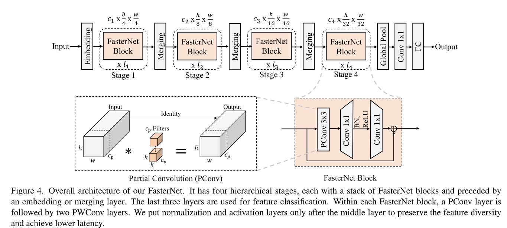
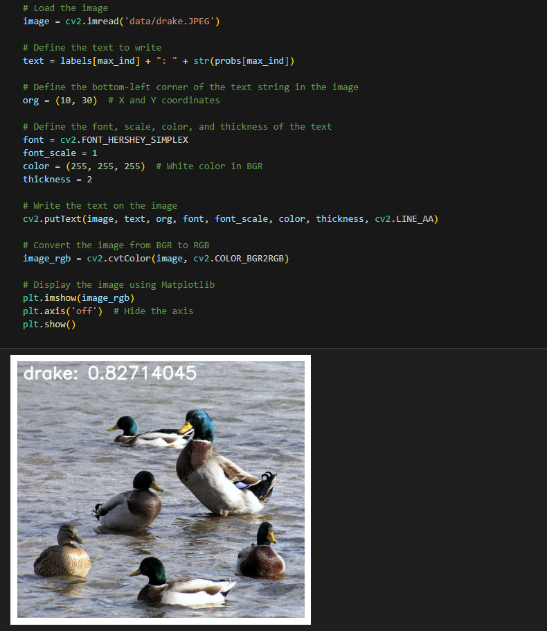

[English](./README.md) | 简体中文

# CNN - FasterNet

- [CNN - FasterNet](#cnn---fasternet)
  - [1. 简介](#1-简介)
  - [2. 模型性能数据](#2-模型性能数据)
  - [3. 模型下载](#3-模型下载)
  - [4. 部署测试](#4-部署测试)
  - [5. 量化实验](#5-量化实验)

## 1. 简介

- **论文地址**: [Run, Don't Walk: Chasing Higher FLOPS for Faster Neural Networks](http://arxiv.org/abs/2303.03667)

- **Github 仓库**: [GitHub - JierunChen/FasterNet: [CVPR 2023] Code release for PConv and FasterNet](https://github.com/JierunChen/FasterNet)

其他轻量化网络性能的评估是基于FLOPs的运算次数，采用组卷积或深度可分离卷积作为其网络组件提取网络特征，但却增加了内存访问和计算量（concatenation，shuffling，pooling）。而ViT结构也需要底层硬件支持。论文调研了几种常见网络的FLOPs，发现都低于ResNet，即其计算速度低下


FasterNet 通过减少冗余计算和内存访问有效提高空间特征，并实现比其他网络更快的运行速度；提出了基于partial convolution（PConv）的 FasterNet 网络骨架，使得特征提取更加有效




**FasterNet 模型特点**：

- 提出用于评估计算延迟的公式，指出了实现更高FLOPS的重要性，而不仅仅是为了更快的神经网络而减少FLOPs
- 采用了组卷积和深度可分离卷积两种常用的轻量化网络结构，对各种任务进行了广泛的实验，并验证了PConv和FasterNet的高速性和有效性


## 2. 模型性能数据

以下表格是在 RDK X5 & RDK X5 Module 上实际测试得到的性能数据，可以根据自己推理实际需要的性能和精度，对模型的大小做权衡取舍。


| 模型           | 尺寸(像素)  | 类别数  | 参数量(M) | 浮点Top-1  | 量化Top-1  | 延迟/吞吐量(单线程) | 延迟/吞吐量(多线程) | 帧率      |
| ------------ | ------- | ---- | ------ | ----- | ----- | ----------- | ----------- | ------- |
| FasterNet_S  | 224x224 | 1000 | 31.1   | 77.04 | 76.15 | 6.73        | 24.34       | 162.83  |
| FasterNet_T2 | 224x224 | 1000 | 15.0   | 76.50 | 76.05 | 3.39        | 11.56       | 342.48  |
| FasterNet_T1 | 224x224 | 1000 | 7.6    | 74.29 | 71.25 | 1.96        | 5.58        | 708.40  |
| FasterNet_T0 | 224x224 | 1000 | 3.9    | 71.75 | 68.50 | 1.41        | 3.48        | 1135.13 |


说明: 
1. X5的状态为最佳状态：CPU为8xA55@1.8G, 全核心Performance调度, BPU为1xBayes-e@1G, 共10TOPS等效int8算力。
2. 单线程延迟为单帧，单线程，单BPU核心的延迟，BPU推理一个任务最理想的情况。
3. 4线程工程帧率为4个线程同时向双核心BPU塞任务，一般工程中4个线程可以控制单帧延迟较小，同时吃满所有BPU到100%，在吞吐量(FPS)和帧延迟间得到一个较好的平衡。
4. 8线程极限帧率为8个线程同时向X3的双核心BPU塞任务，目的是为了测试BPU的极限性能，一般来说4核心已经占满，如果8线程比4线程还要好很多，说明模型结构需要提高"计算/访存"比，或者编译时选择优化DDR带宽。
5. 浮点/定点Top-1：浮点Top-1使用的是模型未量化前onnx的 Top-1 推理精度，量化Top-1则为量化后模型实际推理的精度。

## 3. 模型下载

**.bin 文件下载**：

可以使用脚本 [download.sh](./model/download.sh) 一键下载所有此模型结构的 .bin 模型文件，方便直接更换模型。或者使用以下命令行中的一个，选取单个模型进行下载：

```shell
wget https://archive.d-robotics.cc/downloads/rdk_model_zoo/rdk_x5/FasterNet_S_224x224_nv12.bin
wget https://archive.d-robotics.cc/downloads/rdk_model_zoo/rdk_x5/FasterNet_T0_224x224_nv12.bin
wget https://archive.d-robotics.cc/downloads/rdk_model_zoo/rdk_x5/FasterNet_T1_224x224_nv12.bin
wget https://archive.d-robotics.cc/downloads/rdk_model_zoo/rdk_x5/FasterNet_T2_224x224_nv12.bin
```

**ONNX文件下载**：

onnx 模型使用的是 FasterNet 模型源码进行转换的，使用以下命令安装所需要的包：

```shell
pip install timm onnx
```

模型源码下载使用以下命令：

```shell
git clone https://github.com/JierunChen/FasterNet.git
```

模型转换以 fasternet_t2 为例，其余三个模型同理：

```Python
import torch
import torch.onnx
import onnx
from onnxsim import simplify

from models.fasternet import *

def count_parameters(onnx_model_path):
    # Load the ONNX model
    model = onnx.load(onnx_model_path)
    # Get the initializers (weights in the model)
    initializer = model.graph.initializer
    
    # Calculate the total number of parameters
    total_params = 0
    for tensor in initializer:
        # Get the dimensions of each weight
        dims = tensor.dims
        # Calculate the number of parameters in this weight (product of all dimensions)
        params = 1
        for dim in dims:
            params *= dim
        total_params += params
    
    return total_params

if __name__ == "__main__":
    device = torch.device("cuda" if torch.cuda.is_available() else "cpu")
    model_path = "fasternet_t2-epoch.289-val_acc1.78.8860.pth"
    model = fasternet_t2()
    model.load_state_dict(torch.load(model_path, map_location=device))
    model.eval()

    # print(model)

    dummy_input = torch.randn(1, 3, 224, 224, device="cpu")
    onnx_file_path = "fasternet_t2.onnx"

    torch.onnx.export(
        model,
        dummy_input,
        onnx_file_path,
        opset_version=11,
        verbose=True,
        input_names=["data"],  # 输入名
        output_names=["output"],  # 输出名
    )
    
    # Simplify the ONNX model
    model_simp, check = simplify(onnx_file_path)

    if check:
        print("Simplified model is valid.")
        simplified_onnx_file_path = "fasternet_t2.onnx"
        onnx.save(model_simp, simplified_onnx_file_path)
        print(f"Simplified model saved to {simplified_onnx_file_path}")
    else:
        print("Simplified model is invalid!")
        
    onnx_model_path = simplified_onnx_file_path  # Replace with your ONNX model path
    total_params = count_parameters(onnx_model_path)
    print(f"Total number of parameters in the model: {total_params}")
```

## 4. 部署测试

在下载完毕 .bin 文件后，可以执行 test_FasterNet_*.ipynb 系列的 FasterNet 模型 jupyter 脚本文件，在板端实际运行体验实际测试效果。需要更改测试图片，可额外下载数据集后，放入到data文件夹下并更改 jupyter 文件中图片的路径



## 5. 量化实验

若想要进一步进阶对模型量化过程中的学习，如选取量化精度、对模型节点进行取舍、模型输入输出格式配置等，可以按顺序在天工开物工具链（注意是在pc端，不是板端）中执行 mapper 文件夹下的shell文件，对模型进行量化调优。这里仅仅给出 yaml 的配置文件（在yaml文件夹中），如需进行量化实验可将对应不同大小模型的yaml文件自行替换
