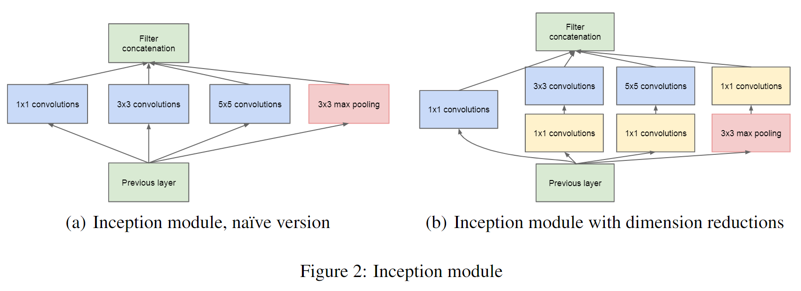
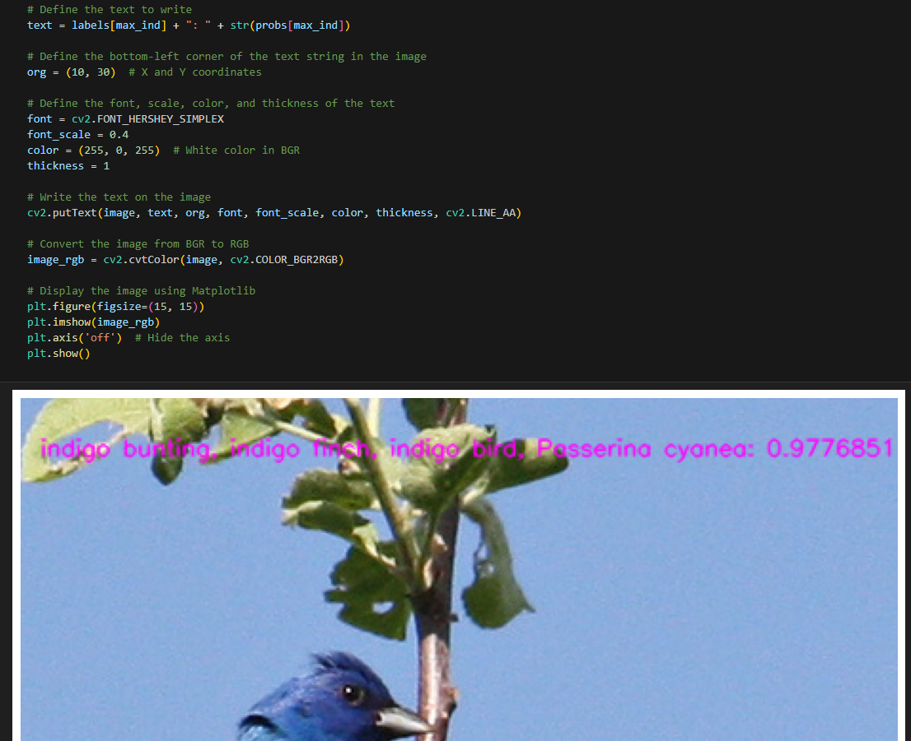

[English](./README.md) | 简体中文

# CNN - GoogLeNet

- [CNN - GoogLeNet](#cnn---googlenet)
  - [1. 简介](#1-简介)
  - [2. 模型性能数据](#2-模型性能数据)
  - [3. 模型下载](#3-模型下载)
  - [4. 部署测试](#4-部署测试)

## 1. 简介

- **论文地址**: [Going Deeper with Convolutions](https://arxiv.org/abs/1409.4842)

- **Github 仓库**: [vision/torchvision/models/googlenet.py at main · pytorch/vision (github.com)](https://github.com/pytorch/vision/blob/main/torchvision/models/googlenet.py)

GoogLeNet 是 google 推出的基于Inception模块的深度神经网络模型，在2014年的ImageNet竞赛中夺得了冠军，在随后的两年中一直在改进，形成了Inception V2、Inception V3、Inception V4等版本

一般来说，提升网络性能最直接的办法就是增加网络深度和宽度，但一味地增加，会带来诸多问题：
1. 参数太多，如果训练数据集有限，很容易产生过拟合；
2. 网络越大、参数越多，计算复杂度越大，难以应用；
3. 网络越深，容易出现梯度弥散问题（梯度越往后穿越容易消失），难以优化模型。

我们希望在增加网络深度和宽度的同时减少参数，为了减少参数，自然就想到将全连接变成稀疏连接。但是在实现上，全连接变成稀疏连接后实际计算量并不会有质的提升，因为大部分硬件是针对密集矩阵计算优化的，稀疏矩阵虽然数据量少，但是计算所消耗的时间却很难减少。在这种需求和形势下，Google研究人员提出了Inception的方法



**GoogLeNet 模型特点**：

- **模块化设计**：GoogleNet引入了名为 `Inception模块` 的创新结构，通过在每个层次上并行使用不同尺寸的卷积核（1x1、3x3、5x5）和池化层，来提取多尺度特征。这种模块化设计有效地减少了参数量，提升了计算效率。
- **参数量小**：GoogleNet的参数量约为 6.8 million，显著小于同类的深度网络（如VGG16）。这使得它在内存占用和推理速度上具有优势。
- **深度较深**：尽管参数量较少，GoogleNet的网络深度依然较深，总共有 22 层（不包括池化层）。
- **高效的计算**：通过使用1x1卷积进行维度缩减，GoogleNet在减少计算成本的同时保持了较高的模型表现。


## 2. 模型性能数据

以下表格是在 RDK X3 & RDK X3 Module 上实际测试得到的性能数据


| 模型          | 尺寸(像素)  | 类别数  | 参数量(M) | 浮点Top-1  | 量化Top-1  | 延迟/吞吐量(单线程) | 延迟/吞吐量(多线程) | 帧率     |
| ----------- | ------- | ---- | ------ | ----- | ----- | ----------- | ----------- | ------ |
| GoogLeNet    | 224x224     | 1000     | 6.81      | 68.72     | 67.71     | 8.34        | 16.29        | 243.51      |


说明: 
1. X3的状态为最佳状态：CPU为4xA53@1.5G, 全核心Performance调度, BPU为2xBernoulli@1G, 共5TOPS等效int8算力。
2. 单线程延迟为单帧，单线程，单BPU核心的延迟，BPU推理一个任务最理想的情况。
3. 4线程工程帧率为4个线程同时向双核心BPU塞任务，一般工程中4个线程可以控制单帧延迟较小，同时吃满所有BPU到100%，在吞吐量(FPS)和帧延迟间得到一个较好的平衡。
4. 8线程极限帧率为8个线程同时向X3的双核心BPU塞任务，目的是为了测试BPU的极限性能，一般来说4核心已经占满，如果8线程比4线程还要好很多，说明模型结构需要提高"计算/访存"比，或者编译时选择优化DDR带宽。
5. 浮点/定点Top-1：浮点Top-1使用的是模型未量化前onnx的 Top-1 推理精度，量化Top-1则为量化后模型实际推理的精度。

## 3. 模型下载

**.bin 文件下载**：

进入model文件夹，使用以下命令行中对 GoogLeNet 模型进行下载：

```shell
wget https://archive.d-robotics.cc/downloads/rdk_model_zoo/rdk_x3/googlenet_224x224_nv12.bin
```

由于此模型是由地平线参考算法进行模型量化后得到的产出物，故该模型不提供 onnx 格式文件。若需要 GoogLeNet 模型量化转换，可以参考本仓库其他模型的转换步骤。

## 4. 部署测试

在下载完毕 .bin 文件后，可以执行 test_GoogLeNet.ipynb GoogLeNet 模型 jupyter 脚本文件，在板端实际运行体验实际测试效果。需要更改测试图片，可额外下载数据集后，放入到data文件夹下并更改 jupyter 文件中图片的路径



