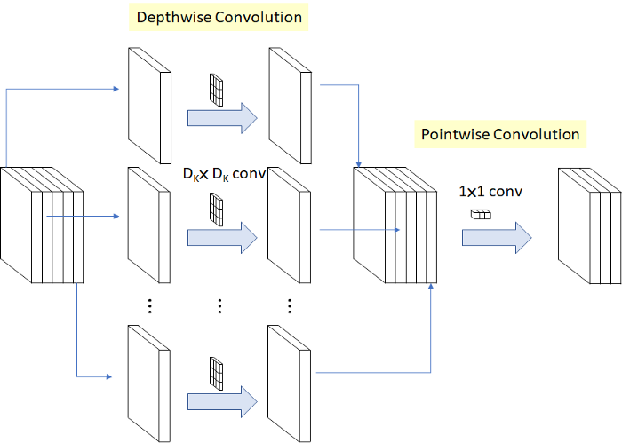
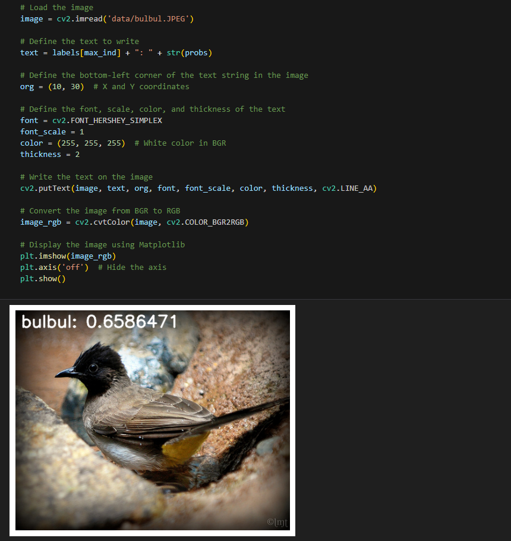

English | [简体中文](./README_cn.md)

# CNN - MobileNetV1

- [CNN - MobileNetV1](#cnn---mobilenetv1)
  - [1. Introduction](#1-introduction)
  - [2. Model performance data](#2-model-performance-data)
  - [3. Model download](#3-model-download)
  - [4. Deployment Testing](#4-deployment-testing)


## 1. Introduction

- **Paper**: [MobileNets: Efficient Convolutional Neural Networks for Mobile Vision Applications](https://arxiv.org/abs/1704.04861)

- **GitHub repository**: [models/research/slim/nets/mobilenet_v1.md at master · tensorflow/models (github.com)](https://github.com/tensorflow/models/blob/master/research/slim/nets/mobilenet_v1.md)

MobileNetV1 proposes a lightweight neural networks for embedded devices. Lightweight deep neural networks are constructed using depthwise convolution. The core idea is to cleverly decompose standard convolution into **depthwise convolution** and **pointwise convolution**. By separating standard convolution, the number of intermediate output feature mappings of two-step convolution operations can be reduced, effectively reducing network parameters.



**MobileNetV1 model features**:

- **Depthwise convolution**: The MobileNet model is based on depthwise convolution, which is a form of factorization convolution that decomposes a standard convolution into a deep convolution and a 1x1 convolution called a point-state convolution, which first appeared in InceptionV3.
- **Hyperparameters**: Reduce computation and number of parameters by width factor $ \alpha $ and resolution factor $ \rho $.

## 2. Model performance data

The following table shows the performance data obtained from actual testing on RDK X3 & RDK X3 Module. 

| Model       | Size    | Categories | Parameter | Floating point precision | Quantization accuracy | Latency/throughput (single-threaded) | Latency/throughput (multi-threaded) | Frame rate(FPS) |
| ----------- | ------- | ---- | ------ | ----- | ----- | ----------- | ----------- | ------ |
| MobileNetv1 | 224x224 | 1000 | 1.33   | 71.74 | 65.36 | 3.44        | 6.10        | 647.83 |

Description:
1. X3 is in the best state: CPU is 4xA53@1.5G, full core Performance scheduling, BPU is 2xBernoulli@1G, a total of 5TOPS equivalent int8 computing power.
2. Single-threaded delay is the ideal situation for single frame, single-threaded, and single-BPU core delay, and BPU inference for a task.
3. The frame rate of a 4-thread project is when 4 threads simultaneously send tasks to a dual-core BPU. In a typical project, 4 threads can control the single frame delay to be small, while consuming all BPUs to 100%, achieving a good balance between throughput (FPS) and frame delay.
4. The maximum frame rate of 8 threads is for 8 threads to simultaneously load tasks into the dual-core BPU of X3. The purpose is to test the maximum performance of the BPU. Generally, 4 cores are already full. If 8 threads are much better than 4 threads, it indicates that the model structure needs to improve the "calculation/memory access" ratio or optimize the DDR bandwidth when compiling.
5. Floating-point/fixed-point precision: Floating-point accuracy uses the Top-1 inference accuracy Level of onnx before the model is quantized, while quantized accuracy is the accuracy Level of the actual inference of the model after quantization.


## 3. Model download

**.Bin file download** :

Go into the model folder and use the following command line to download the MobileNetV1 model:

```shell
wget https://archive.d-robotics.cc/downloads/rdk_model_zoo/rdk_x3/mobilenetv1_224x224_nv12.bin
```

Due to the fact that this model is the output obtained by model quantization by the Horizon Reference algorithm, the model does not provide onnx format files. If you need MobileNetV1 model quantization conversion, you can refer to the conversion steps of other models in this repository.

## 4. Deployment Testing

After downloading the .bin file, you can execute the MobileNetV1 model jupyter script file of the test_MobileNetV1.ipynb to experience the actual test effect on the board. If you need to change the test picture, you can download the dataset separately and put it in the data folder and change the path of the picture in the jupyter file



