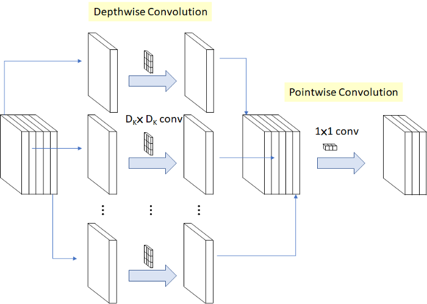
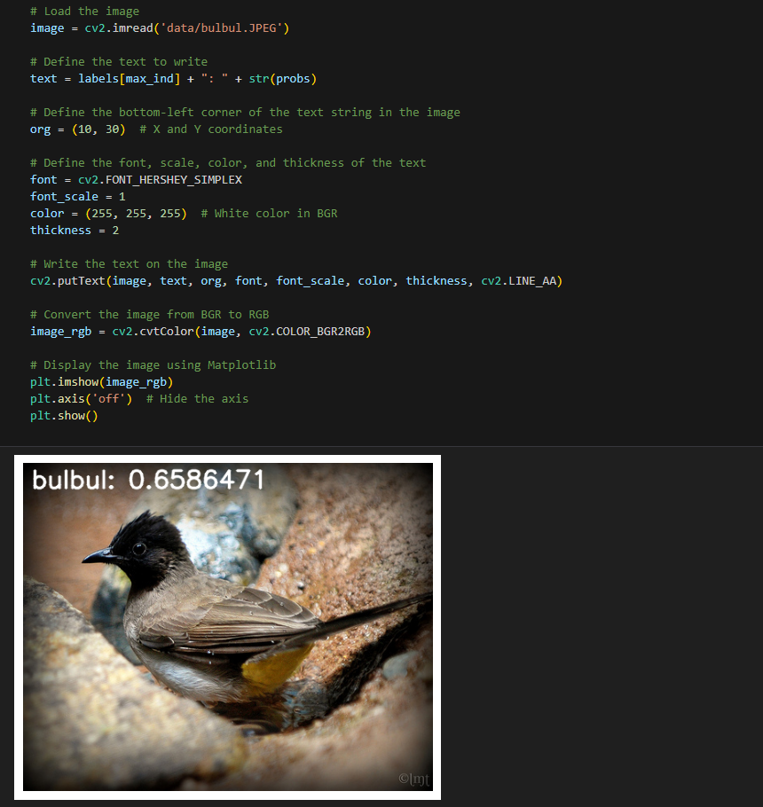

[English](./README.md) | 简体中文

# CNN X5 - MobilenetV1

- [CNN X5 - MobilenetV1](#cnn-x5---mobilenetv1)
  - [1. 简介](#1-简介)
  - [2. 模型性能数据](#2-模型性能数据)
  - [3. 模型下载](#3-模型下载)
  - [4. 部署测试](#4-部署测试)

## 1. 简介

- **论文地址**: [MobileNets: Efficient Convolutional Neural Networks for Mobile Vision Applications](https://arxiv.org/abs/1704.04861)

- **Github 仓库**: [models/research/slim/nets/mobilenet_v1.md at master · tensorflow/models (github.com)](https://github.com/tensorflow/models/blob/master/research/slim/nets/mobilenet_v1.md)

Mobilenetv1 提出了一种用于嵌入式设备的轻量级神经网络。利用深度可分离卷积构造轻量级深度神经网络。其核心思想是巧妙地将标准卷积分解为 **深度可分类卷积（depthwise convolution）** 和 **点态卷积（pointwise convolution）** 。通过分离标准卷积，可以减少两步卷积操作的中间输出特征映射的数量，从而有效地减少网络参数。



**MobilenetV1 模型特点**：

- **深度可分离卷积**：MobileNet 模型是基于深度可分离卷积，这是一种**因式分解卷积**的形式，它将一个标准卷积分解为深度卷积和一种称为点态卷积的 1×1 卷积，最早出现在 InceptionV3 中
- **超参数**。通过宽度因子 $\alpha$ 和分辨率因子 $\rho$ 降低计算量和参数量。


## 2. 模型性能数据

以下表格是在 RDK X5 & RDK X5 Module 上实际测试得到的性能数据


| 模型          | 尺寸(像素)  | 类别数  | 参数量(M) | 浮点精度  | 量化精度  | 延迟/吞吐量(单线程) | 延迟/吞吐量(多线程) | 帧率     |
| ----------- | ------- | ---- | ------ | ----- | ----- | ----------- | ----------- | ------ |
| MobileNetv1 | 224x224 | 1000 | 1.33   | 71.74 | 65.36 | 1.27        | 2.90        | 1356.25 |


说明: 
1. X5的状态为最佳状态：CPU为8xA55@1.8G, 全核心Performance调度, BPU为1xBayes-e@1G, 共10TOPS等效int8算力。
2. 单线程延迟为单帧，单线程，单BPU核心的延迟，BPU推理一个任务最理想的情况。
3. 4线程工程帧率为4个线程同时向双核心BPU塞任务，一般工程中4个线程可以控制单帧延迟较小，同时吃满所有BPU到100%，在吞吐量(FPS)和帧延迟间得到一个较好的平衡。
4. 8线程极限帧率为8个线程同时向X3的双核心BPU塞任务，目的是为了测试BPU的极限性能，一般来说4核心已经占满，如果8线程比4线程还要好很多，说明模型结构需要提高"计算/访存"比，或者编译时选择优化DDR带宽。
5. 浮点/定点精度：浮点精度使用的是模型未量化前onnx的 Top-1 推理精度，量化精度则为量化后模型实际推理的精度。

## 3. 模型下载

**.bin 文件下载**：

进入model文件夹，使用以下命令行中对 MobileNetV1 模型进行下载：

```shell
wget https://archive.d-robotics.cc/downloads/rdk_model_zoo/rdk_x5/mobilenetv1_224x224_nv12.bin
```

由于此模型是由地平线参考算法进行模型量化后得到的产出物，故该模型不提供 onnx 格式文件。若需要 MobileNetV1 模型量化转换，可以参考本仓库其他模型的转换步骤。

## 4. 部署测试

在下载完毕 .bin 文件后，可以执行 test_MobileNetV1.ipynb MobileNetV1 模型 jupyter 脚本文件，在板端实际运行体验实际测试效果。需要更改测试图片，可额外下载数据集后，放入到data文件夹下并更改 jupyter 文件中图片的路径



