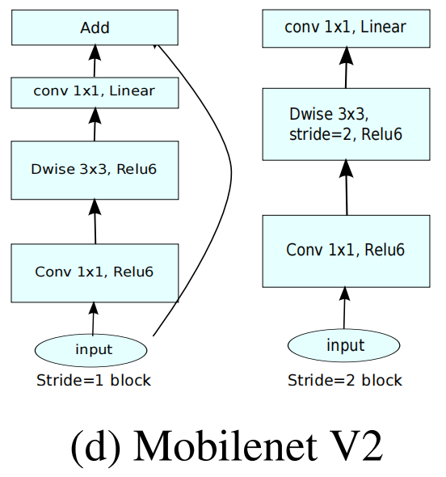

[English](./README.md) | 简体中文

# CNN X5 - MobilenetV2

- [CNN X5 - MobilenetV2](#cnn-x5---mobilenetv2)
  - [1. 简介](#1-简介)
  - [2. 模型性能数据](#2-模型性能数据)
  - [3. 模型下载](#3-模型下载)
  - [4. 部署测试](#4-部署测试)

## 1. 简介

- **论文地址**: [MobileNetV2: Inverted Residuals and Linear Bottlenecks](https://arxiv.org/abs/1801.04381)

- **Github 仓库**: [timm/docs/models/mobilenet-v2.md at master · pprp/timm (github.com)](https://github.com/pprp/timm/blob/master/docs/models/mobilenet-v2.md)


Mobilenetv2 是对 [Mobilenet](../MobileNet/README_cn.md) 的改进，同样是一种轻量级的神经网络。Mobilenetv2 为了防止非线性层ReLU损失一部分信息，引入了**线性瓶颈层(Linear Bottleneck)**；另外借鉴 [Resnet](../ResNet/README_cn.md) 等一系列网络采用了残差网络得到了很好的效果，作者结合点态卷积的特点，提出了**倒残差 (Inverted Residual)结构**。论文在ImageNet classification, MS COCO object detection, VOC image segmentation上做了对比实验，验证了该架构的有效性。

Mobilenetv2 在深度卷积前新加了一个点态卷积。这么做的原因，是因为深度卷积由于本身的计算特性，决定其自身没有改变通道数的能力，上一层给它多少通道，它就只能输出多少通道。所以如果上一层给的通道数本身很少的话，深度卷积也只能在低维空间提特征，因此效果不够好。为了改善这个问题，Mobilenetv2 给每个深度卷积之前都配备了一个点态卷积专门用来升维。





**MobilenetV2 模型特点**：

- 使用深度可分离卷积。与 [Mobilenet](../Mobilenet/README_cn.md) 一样，使用深度可分离卷积减少参数量，但网络结构上略有不同。
- 采用线性瓶颈层(Linear Bottlenecks)和倒残差(Inverted residuals)结构


## 2. 模型性能数据

以下表格是在 RDK X5 & RDK X5 Module 上实际测试得到的性能数据


| 模型          | 尺寸(像素)  | 类别数  | 参数量(M) | 浮点精度  | 量化精度  | 延迟/吞吐量(单线程) | 延迟/吞吐量(多线程) | 帧率     |
| ----------- | ------- | ---- | ------ | ----- | ----- | ----------- | ----------- | ------ |
| Mobilenetv2 | 224x224 | 1000 | 3.4    | 72.0 | 68.17 | 1.42        | 3.43        | 1152.07 |


说明: 
1. X5的状态为最佳状态：CPU为8xA55@1.8G, 全核心Performance调度, BPU为1xBayes-e@1G, 共10TOPS等效int8算力。
2. 单线程延迟为单帧，单线程，单BPU核心的延迟，BPU推理一个任务最理想的情况。
3. 4线程工程帧率为4个线程同时向双核心BPU塞任务，一般工程中4个线程可以控制单帧延迟较小，同时吃满所有BPU到100%，在吞吐量(FPS)和帧延迟间得到一个较好的平衡。
4. 8线程极限帧率为8个线程同时向X3的双核心BPU塞任务，目的是为了测试BPU的极限性能，一般来说4核心已经占满，如果8线程比4线程还要好很多，说明模型结构需要提高"计算/访存"比，或者编译时选择优化DDR带宽。
5. 浮点/定点精度：浮点精度使用的是模型未量化前onnx的 Top-1 推理精度，量化精度则为量化后模型实际推理的精度。

## 3. 模型下载

**.bin 文件下载**：

进入model文件夹，使用以下命令行中对 MobileNetV2 模型进行下载：

```shell
wget https://archive.d-robotics.cc/downloads/rdk_model_zoo/rdk_x5/mobilenetv2_224x224_nv12.bin
```

由于此模型是由地平线参考算法进行模型量化后得到的产出物，故该模型不提供 onnx 格式文件。若需要 MobileNetV2 模型量化转换，可以参考本仓库其他模型的转换步骤。

## 4. 部署测试

在下载完毕 .bin 文件后，可以执行 test_MobileNetV2.ipynb MobilenetV2 模型 jupyter 脚本文件，在板端实际运行体验实际测试效果。需要更改测试图片，可额外下载数据集后，放入到data文件夹下并更改 jupyter 文件中图片的路径


