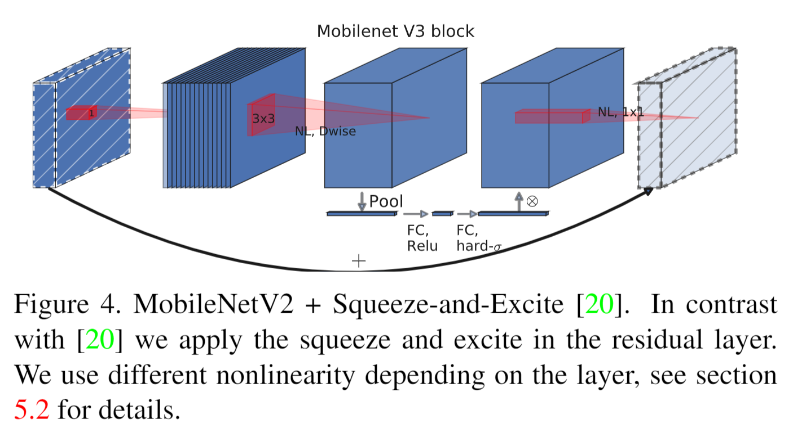
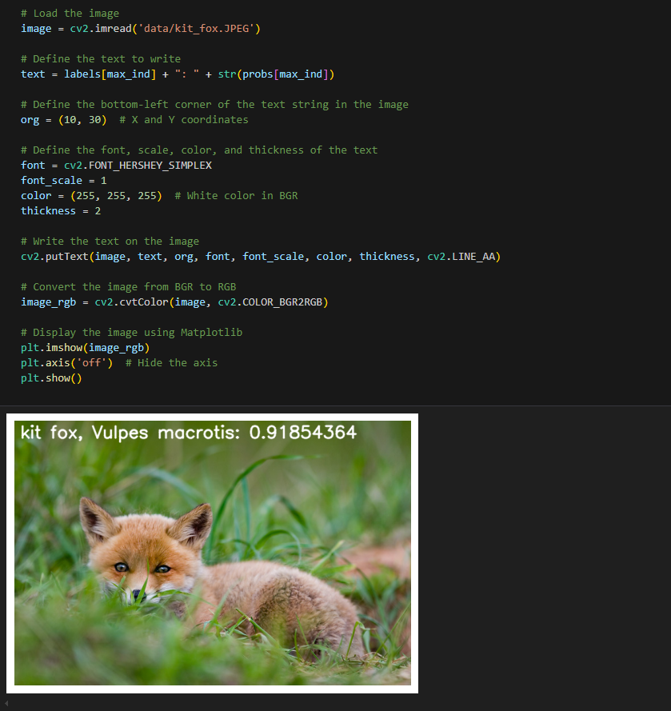

English | [简体中文](./README_cn.md)

# CNN X5 - MobileNetV3

- [CNN X5 - MobileNetV3](#cnn-x5---mobilenetv3)
  - [1. Introduction](#1-introduction)
  - [2. Model performance data](#2-model-performance-data)
  - [3. Model download](#3-model-download)
  - [4. Deployment Testing](#4-deployment-testing)
  - [5. Model Quantitation Experiment](#5-model-quantitation-experiment)


## 1. Introduction

- **Paper**: [Searching for MobileNetV3](https://arxiv.org/abs/1905.02244)

- **GitHub repository**: [pytorch-image-models/timm/models/mobilenetv3.py at main · huggingface/pytorch-image-models (github.com)](https://github.com/huggingface/pytorch-image-models/blob/main/timm/models/mobilenetv3.py)



MobileNetV3 is an improvement on [MobileNetV2](../MobileNetV2/README_cn.md) , which is also a lightweight neural network. MobileNetV3 optimizes the network by using **network architecture search (NAS)** and NetAdapt. At the same time, the paper proposes two different networks, MobileNetV3-Large and MobileNetV3-Small, to cope with different practical use cases. Compared with [MobileNetV2](../MobileNetV2/README_cn.md) MobileNetV3-Large has a 3.2% higher accuracy in ImageNet dataset recognition, while reducing latency by 15%, while MobileNetV3-Small has a 4.6% higher accuracy and reduces latency by 5%. The detection accuracy of MobileNetV3-Large in MS COCO dataset is roughly 25% faster than [MobileNetV2](../MobileNetV2/README_cn.md).

**MobileNetV3 model features**:

- **Depthwise Separable Convolutions**: MobileNetV3 retains the depthwise separable convolutions from MobileNetV2, splitting standard convolutions into depthwise and pointwise convolutions to significantly reduce computation and parameter count
- **Inverted Residuals**: Similar to MobileNetV2, MobileNetV3 uses inverted residual blocks, which consist of expansion, depthwise, and pointwise convolutions, with skip connections between the input and output
- **Squeeze-and-Excitation (SE) Modules**: MobileNetV3 introduces SE modules, which use global pooling and channel attention mechanisms to recalibrate channel weights, enhancing feature representation.
- **H-Swish Activation Function**: MobileNetV3 employs the H-Swish (Hard-Swish) activation function, a computationally efficient variant of the Swish activation, providing a good balance between accuracy and efficiency.
- **Neural Architecture Search (NAS)**: Parts of MobileNetV3's architecture were optimized using NAS, which automates the design process to find the best trade-off between performance and efficiency under various device constraints.

## 2. Model performance data

The following table shows the performance data obtained from actual testing on RDK X5 & RDK X5 Module. You can weigh the size of the model according to your own reasoning about the actual performance and accuracy required


| Model        | Size    | Categories | Parameter | Floating point precision | Quantization accuracy | Latency/throughput (single-threaded) | Latency/throughput (multi-threaded) | Frame rate(FPS) |
| ------------ | ------- | ---- | ------ | ----- | ----- | ----------- | ----------- | ------- |
| Mobilenetv3_large_100   | 224x224 | 1000 | 5.47   | 74.75 | 64.75 | 2.02        | 5.53        | 714.22 |


Description:
1. X5 is in the best state: CPU is 8xA55@1.8G, full core Performance scheduling, BPU is 1xBayes-e@1G, a total of 10TOPS equivalent int8 computing power.
2. Single-threaded delay is the ideal situation for single frame, single-threaded, and single-BPU core delay, and BPU inference for a task.
3. The frame rate of a 4-thread project is when 4 threads simultaneously send tasks to a dual-core BPU. In a typical project, 4 threads can control the single frame delay to be small, while consuming all BPUs to 100%, achieving a good balance between throughput (FPS) and frame delay.
4. The maximum frame rate of 8 threads is for 8 threads to simultaneously load tasks into the dual-core BPU of X3. The purpose is to test the maximum performance of the BPU. Generally, 4 cores are already full. If 8 threads are much better than 4 threads, it indicates that the model structure needs to improve the "calculation/memory access" ratio or optimize the DDR bandwidth when compiling.
5. Floating-point/fixed-point precision: Floating-point accuracy uses the Top-1 inference accuracy Level of onnx before the model is quantized, while quantized accuracy is the accuracy Level of the actual inference of the model after quantization.


## 3. Model download

**.Bin file download** :

You can use the script [download_bin.sh](./model/download_bin.sh) to download all .bin model files for this model structure with one click, making it easy to change models directly. Alternatively, use one of the following command lines to select a single model for download:

```shell
wget https://archive.d-robotics.cc/downloads/rdk_model_zoo/rdk_x5/MobileNetV3_224x224_nv12.bin
```

**ONNX file download** :

Similarly to the .bin file, use [download_onnx.sh](./model/download_onnx.sh) to download all .onnx model files of this model structure with one click, or download a single .onnx model for quantization experiments:

```shell
wget https://archive.d-robotics.cc/downloads/rdk_model_zoo/rdk_x5/mobilenetv3_large_100.onnx
```

## 4. Deployment Testing

After downloading the .bin file, you can execute the MobileNetV3 model jupyter script file of the test_MobileNetV3.ipynb series to experience the actual test effect on the board. If you need to change the test picture, you can download the dataset separately and put it in the data folder and change the path of the picture in the jupyter file



## 5. Model Quantitation Experiment

If you want to further advance the learning of model quantization, such as selecting quantization accuracy, selecting model nodes, configuring model input and output formats, etc., you can execute the shell file under the mapper folder in the Tiangong Kaiwu toolchain (note that it is on the PC side, not the board side) in order to optimize the model quantization. Here only gives the yaml configuration file (in the yaml folder), if you need to carry out quantization experiments, you can replace the yaml file corresponding to different sizes of models