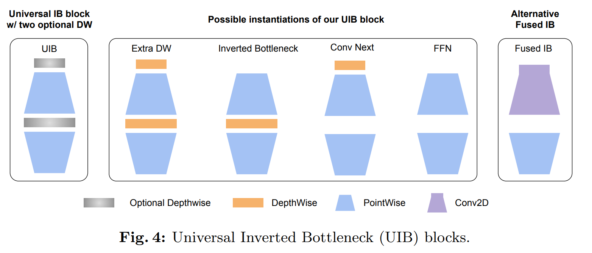
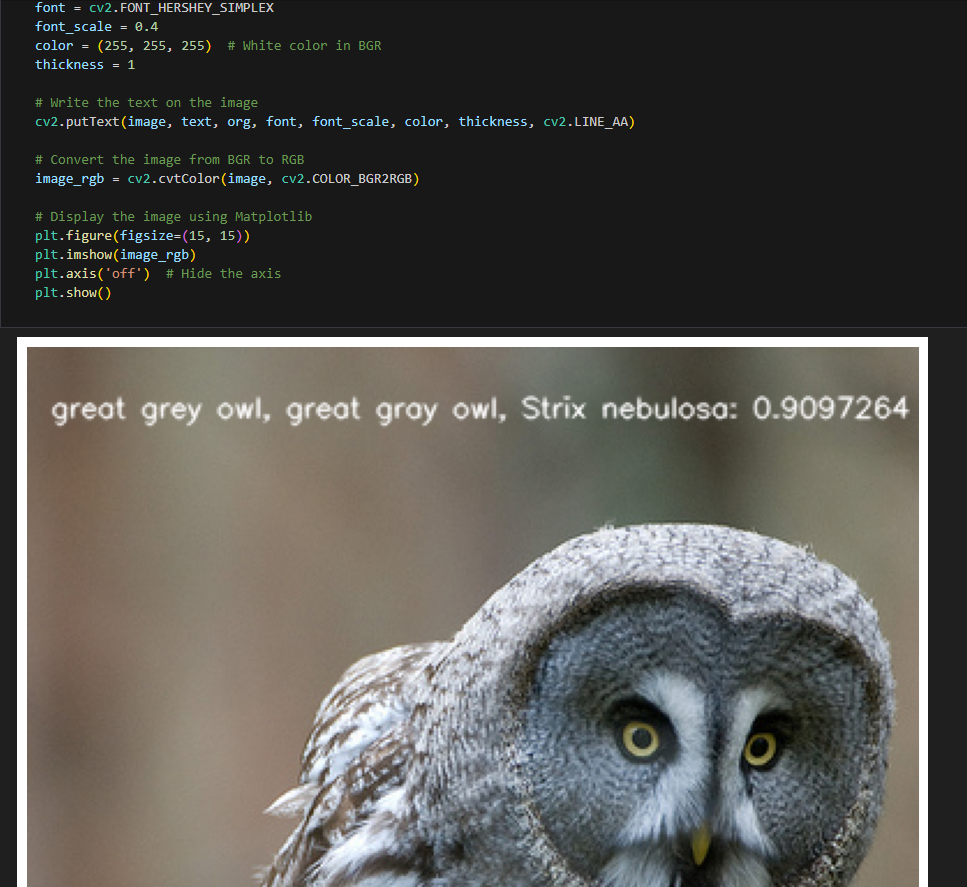

English | [简体中文](./README_cn.md)

# CNN - MobileNetV4

- [CNN - MobileNetV4](#cnn---mobilenetv4)
  - [1. Introduction](#1-introduction)
  - [2. Model performance data](#2-model-performance-data)
  - [3. Model download](#3-model-download)
  - [4. Deployment Testing](#4-deployment-testing)
  - [5. Model Quantitation Experiment](#5-model-quantitation-experiment)


## 1. Introduction

- **Paper**: [MobileNetV4 -- Universal Models for the Mobile Ecosystem](https://arxiv.org/abs/2404.10518)

- **GitHub repository**: [pytorch-image-models/timm/models/MobileNetV4.py at main · huggingface/pytorch-image-models (github.com)](https://github.com/huggingface/pytorch-image-models/blob/main/timm/models/MobileNetV4.py)



MobileNetV4 is based on classic components of MobileNet, such as separable deep convolution (DW) and point-by-point (PW) expansion and projection inverted bottleneck block, introducing the **Universal Inverted Neck Structure** (UIB). This structure is quite simple, introducing two optional deep convolutions (DW) in the inverted bottleneck block, one located before the extension layer and the other located between the extension layer and the projection layer. The existence or non-existence of these two deep convolutions is part of the neural architecture search (NAS) optimization process, which ultimately generates novel network architectures. Although this modification seems simple, the author cleverly unifies several important modules, including the original inverted neck structure, ConvNext, and FFN in ViT. In addition, UIB has introduced a new variant: ExtraDW. With the enhancement of this technology, the MNv4-Hybrid-Large model achieved an accuracy of 87% on ImageNet-1K and a running time of only 3.8ms on Pixel 8 EdgeTPU.

**MobileNetV4 model features**:

- Introduced the Universal Inverted Bottleneck (UIB) search block, a unified and flexible structure that combines Inverted Bottleneck (IB), ConvNext, Feedforward Networks (FFN), and a new Extra Depth convolution (Extra Depthwise) variant.
- A mobile version of Multi-Head Attention (Mobile MQA) optimized for mobile accelerators is proposed, which provides 39% inference acceleration compared to traditional Multi-Head Self-Attention (MHSA). An optimized neural architecture search (NAS) method is introduced, which improves the effectiveness of MNv4 search.

## 2. Model performance data

The following table shows the performance data obtained from actual testing on RDK X5 & RDK X5 Module. You can weigh the size of the model according to your own reasoning about the actual performance and accuracy required


| Model        | Size    | Categories | Parameter | Floating point precision | Quantization accuracy | Latency/throughput (single-threaded) | Latency/throughput (multi-threaded) | Frame rate(FPS) |
| ------------ | ------- | ---- | ------ | ----- | ----- | ----------- | ----------- | ------- |
| Mobilenetv4_conv_medium | 224x224 | 1000 | 9.68   | 76.75 | 75.14 | 2.42        | 6.91        | 572.36  |
| Mobilenetv4_conv_small  | 224x224 | 1000 | 3.76   | 70.75 | 68.75 | 1.18        | 2.74        | 1436.22 |


Description:
1. X5 is in the best state: CPU is 8xA55@1.8G, full core Performance scheduling, BPU is 1xBayes-e@1G, a total of 10TOPS equivalent int8 computing power.
2. Single-threaded delay is the ideal situation for single frame, single-threaded, and single-BPU core delay, and BPU inference for a task.
3. The frame rate of a 4-thread project is when 4 threads simultaneously send tasks to a dual-core BPU. In a typical project, 4 threads can control the single frame delay to be small, while consuming all BPUs to 100%, achieving a good balance between throughput (FPS) and frame delay.
4. The maximum frame rate of 8 threads is for 8 threads to simultaneously load tasks into the dual-core BPU of X3. The purpose is to test the maximum performance of the BPU. Generally, 4 cores are already full. If 8 threads are much better than 4 threads, it indicates that the model structure needs to improve the "calculation/memory access" ratio or optimize the DDR bandwidth when compiling.
5. Floating-point/fixed-point precision: Floating-point accuracy uses the Top-1 inference accuracy Level of onnx before the model is quantized, while quantized accuracy is the accuracy Level of the actual inference of the model after quantization.


## 3. Model download

**.Bin file download** :

You can use the script [download.sh](./model/download.sh) to download all .bin model files for this model structure with one click, making it easy to change models directly. Alternatively, use one of the following command lines to select a single model for download:

```shell
wget https://archive.d-robotics.cc/downloads/rdk_model_zoo/rdk_x5/MobileNetV4_conv_medium_224x224_nv12.bin
wget https://archive.d-robotics.cc/downloads/rdk_model_zoo/rdk_x5/MobileNetV4_conv_small_224x224_nv12.bin
```

**ONNX file download** :

The onnx model is transformed using models from the timm library (PyTorch Image Models). Install the required packages using the following command:

```shell
pip install timm onnx
```

Model transformation takes mobilenetv4_conv_small as an example:

```Python
import torch
import torch.onnx
import onnx
from onnxsim import simplify
from timm.models import create_model

from timm.models.mobilenetv3 import mobilenetv4_conv_medium, mobilenetv4_conv_small

def count_parameters(onnx_model_path):
    # Load the ONNX model
    model = onnx.load(onnx_model_path)
    # Get the initializers (weights in the model)
    initializer = model.graph.initializer
    
    # Calculate the total number of parameters
    total_params = 0
    for tensor in initializer:
        # Get the dimensions of each weight
        dims = tensor.dims
        # Calculate the number of parameters in this weight (product of all dimensions)
        params = 1
        for dim in dims:
            params *= dim
        total_params += params
    
    return total_params

if __name__ == "__main__":
    device = torch.device("cuda" if torch.cuda.is_available() else "cpu")
    model = create_model('mobilenetv4_conv_small', pretrained=True)
    model.eval()

    # print the model structure

    dummy_input = torch.randn(1, 3, 224, 224, device="cpu")
    onnx_file_path = "mobilenetv4_conv_small.onnx"

    torch.onnx.export(
        model,
        dummy_input,
        onnx_file_path,
        opset_version=11,
        verbose=True,
        input_names=["data"],  # Input name
        output_names=["output"],  # Output name
    )
    
    # Simplify the ONNX model
    model_simp, check = simplify(onnx_file_path)

    if check:
        print("Simplified model is valid.")
        simplified_onnx_file_path = "mobilenetv4_conv_small.onnx"
        onnx.save(model_simp, simplified_onnx_file_path)
        print(f"Simplified model saved to {simplified_onnx_file_path}")
    else:
        print("Simplified model is invalid!")
        
    onnx_model_path = simplified_onnx_file_path  # Replace with your ONNX model path
    total_params = count_parameters(onnx_model_path)
    print(f"Total number of parameters in the model: {total_params}")

```

## 4. Deployment Testing

After downloading the .bin file, you can execute the MobileNetV4 model jupyter script file of the test_MobileNetV4_*.ipynb series to experience the actual test effect on the board. If you need to change the test picture, you can download the dataset separately and put it in the data folder and change the path of the picture in the jupyter file



## 5. Model Quantitation Experiment

If you want to further advance the learning of model quantization, such as selecting quantization accuracy, selecting model nodes, configuring model input and output formats, etc., you can execute the shell file under the mapper folder in the Tiangong Kaiwu toolchain (note that it is on the PC side, not the board side) in order to optimize the model quantization. Here only gives the yaml configuration file (in the yaml folder), if you need to carry out quantization experiments, you can replace the yaml file corresponding to different sizes of models