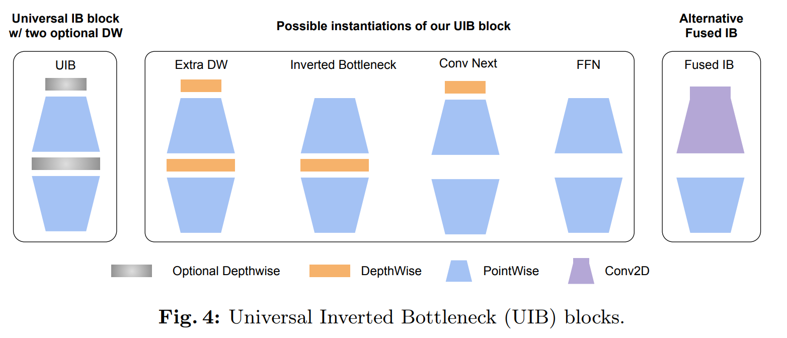
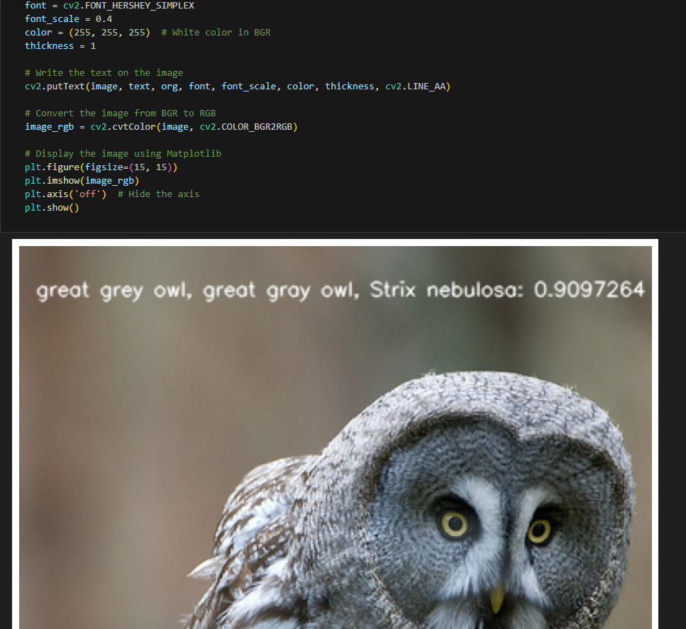

[English](./README.md) | 简体中文

# CNN - MobileNetV4

- [CNN - MobileNetV4](#cnn---mobilenetv4)
  - [1. 简介](#1-简介)
  - [2. 模型性能数据](#2-模型性能数据)
  - [3. 模型下载](#3-模型下载)
  - [4. 部署测试](#4-部署测试)
  - [5. 量化实验](#5-量化实验)

## 1. 简介

- **论文地址**: [MobileNetV4 -- Universal Models for the Mobile Ecosystem](https://arxiv.org/abs/2404.10518)

- **Github 仓库**: [pytorch-image-models/timm/models/MobileNetV4.py at main · huggingface/pytorch-image-models (github.com)](https://github.com/huggingface/pytorch-image-models/blob/main/timm/models/MobileNetV4.py)



MobileNetV4 基于MobileNet的经典组件如可分离的深度卷积（DW）和逐点（PW）扩展及投影倒置瓶颈块，引入了**通用倒置颈结构**（UIB）。这个结构相当简单，在倒置瓶颈块中引入了两个可选的深度卷积（DW），一个位于扩展层之前，另一个位于扩展层和投影层之间。这两个深度卷积的存在与否是神经架构搜索（NAS）优化过程的一部分，最终会生成新颖的网络架构。尽管这个修改看似简单，但作者却巧妙地统一了几个重要的模块，包括原始的倒置颈结构、ConvNext以及ViT中的FFN。此外，UIB还引入了一个新的变体：ExtraDW。通过这种技术的增强，MNv4-Hybrid-Large模型在ImageNet-1K准确率达到了87%，在Pixel 8 EdgeTPU上的运行时间仅为3.8ms。

**MobileNetV4 模型特点**：

- 引入了Universal Inverted Bottleneck(UIB)搜索块，这是一种统一灵活的结构，合并了Inverted Bottleneck(IB)、ConvNext、前馈网络(FFN)和一种新的额外深度卷积(Extra Depthwise)变体。
- 提出了针对移动加速器优化的移动版多头注意力(Mobile MQA)，相比传统多头自注意力(MHSA)提供39%的推理加速。介绍了一种优化的神经架构搜索(NAS)方法，提高了MNv4搜索的有效性


## 2. 模型性能数据

以下表格是在 RDK X3 & RDK X3 Module 上实际测试得到的性能数据，可以根据自己推理实际需要的性能和精度，对模型的大小做权衡取舍。


| 模型           | 尺寸(像素)  | 类别数  | 参数量(M) | 浮点Top-1  | 量化Top-1  | 延迟/吞吐量(单线程) | 延迟/吞吐量(多线程) | 帧率      |
| ------------ | ------- | ---- | ------ | ----- | ----- | ----------- | ----------- | ------- |
| Mobilenetv4 | 224x224 | 1000 | 3.76   | 70.50 | 70.26 | 1.43        | 2.96        | 1309.17 |


说明: 
1. X3的状态为最佳状态：CPU为4xA53@1.5G, 全核心Performance调度, BPU为2xBernoulli@1G, 共5TOPS等效int8算力。
2. 单线程延迟为单帧，单线程，单BPU核心的延迟，BPU推理一个任务最理想的情况。
3. 4线程工程帧率为4个线程同时向双核心BPU塞任务，一般工程中4个线程可以控制单帧延迟较小，同时吃满所有BPU到100%，在吞吐量(FPS)和帧延迟间得到一个较好的平衡。
4. 8线程极限帧率为8个线程同时向X3的双核心BPU塞任务，目的是为了测试BPU的极限性能，一般来说4核心已经占满，如果8线程比4线程还要好很多，说明模型结构需要提高"计算/访存"比，或者编译时选择优化DDR带宽。
5. 浮点/定点Top-1：浮点Top-1使用的是模型未量化前onnx的 Top-1 推理精度，量化Top-1则为量化后模型实际推理的精度。

## 3. 模型下载

**.bin 文件下载**：

可以使用脚本 [download.sh](./model/download.sh) 一键下载所有此模型结构的 .bin 模型文件，方便直接更换模型。或者使用以下命令行中的一个，选取单个模型进行下载：

```shell
wget https://archive.d-robotics.cc/downloads/rdk_model_zoo/rdk_x3/MobileNetV4_224x224_nv12.bin
```

**ONNX文件下载**：

onnx 模型使用的是 timm 库 (PyTorch Image Models) 中的模型进行转换的，使用以下命令安装所需要的包：

```shell
pip install timm onnx
```

模型转换以 mobilenetv4_conv_small 为例：

```Python
import torch
import torch.onnx
import onnx
from onnxsim import simplify
from timm.models import create_model

from timm.models.mobilenetv3 import mobilenetv4_conv_medium, mobilenetv4_conv_small

def count_parameters(onnx_model_path):
    # Load the ONNX model
    model = onnx.load(onnx_model_path)
    # Get the initializers (weights in the model)
    initializer = model.graph.initializer
    
    # Calculate the total number of parameters
    total_params = 0
    for tensor in initializer:
        # Get the dimensions of each weight
        dims = tensor.dims
        # Calculate the number of parameters in this weight (product of all dimensions)
        params = 1
        for dim in dims:
            params *= dim
        total_params += params
    
    return total_params

if __name__ == "__main__":
    device = torch.device("cuda" if torch.cuda.is_available() else "cpu")
    model = create_model('mobilenetv4_conv_small', pretrained=True)
    model.eval()

    # print the model structure

    dummy_input = torch.randn(1, 3, 224, 224, device="cpu")
    onnx_file_path = "mobilenetv4_conv_small.onnx"

    torch.onnx.export(
        model,
        dummy_input,
        onnx_file_path,
        opset_version=11,
        verbose=True,
        input_names=["data"],  # Input name
        output_names=["output"],  # Output name
    )
    
    # Simplify the ONNX model
    model_simp, check = simplify(onnx_file_path)

    if check:
        print("Simplified model is valid.")
        simplified_onnx_file_path = "mobilenetv4_conv_small.onnx"
        onnx.save(model_simp, simplified_onnx_file_path)
        print(f"Simplified model saved to {simplified_onnx_file_path}")
    else:
        print("Simplified model is invalid!")
        
    onnx_model_path = simplified_onnx_file_path  # Replace with your ONNX model path
    total_params = count_parameters(onnx_model_path)
    print(f"Total number of parameters in the model: {total_params}")
```

## 4. 部署测试

在下载完毕 .bin 文件后，可以执行 test_MobileNetV4_*.ipynb 系列的 MobileNetV4 模型 jupyter 脚本文件，在板端实际运行体验实际测试效果。需要更改测试图片，可额外下载数据集后，放入到data文件夹下并更改 jupyter 文件中图片的路径



## 5. 量化实验

若想要进一步进阶对模型量化过程中的学习，如选取量化精度、对模型节点进行取舍、模型输入输出格式配置等，可以按顺序在天工开物工具链（注意是在pc端，不是板端）中执行 mapper 文件夹下的shell文件，对模型进行量化调优。这里仅仅给出 yaml 的配置文件（在yaml文件夹中），如需进行量化实验可将对应不同大小模型的yaml文件自行替换
