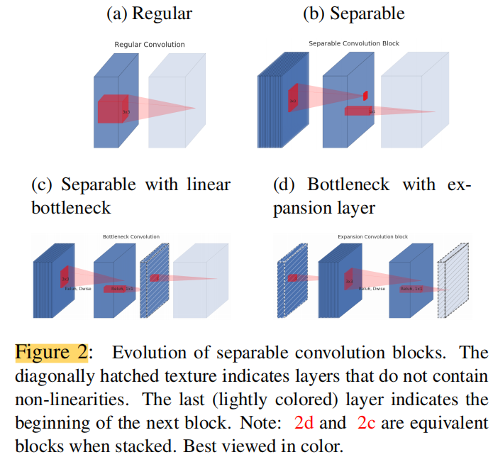
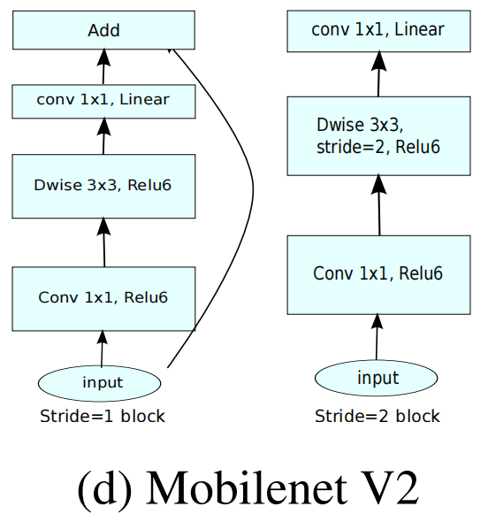
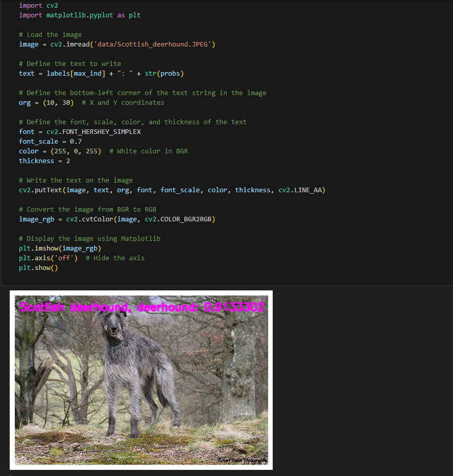

English | [简体中文](./README_cn.md)

# CNN X5 - MobilenetV2

- [CNN X5 - MobilenetV2](#cnn-x5---mobilenetv2)
  - [1. Introduction](#1-introduction)
  - [2. Model performance data](#2-model-performance-data)
  - [3. Model download](#3-model-download)
  - [4. Deployment Testing](#4-deployment-testing)


## 1. Introduction

- **Paper**: [MobileNetV2: Inverted Residuals and Linear Bottlenecks](https://arxiv.org/abs/1801.04381)

- **GitHub repository**: [timm/docs/models/mobilenet-v2.md at master · pprp/timm (github.com)](https://github.com/pprp/timm/blob/master/docs/models/mobilenet-v2.md)

Mobilenetv2 is an improvement on [Mobilenet](../MobileNet/README.md), which is also a lightweight neural network. In order to prevent the loss of some information in the nonlinear layer ReLU, Mobilenetv2 introduces a linear bottleneck layer (Linear Bottleneck) ; in addition, a series of networks such as [Resnet](../ResNet/README.md) are used, and the residual network has achieved good results. The author combines the characteristics of point-state convolution and proposes an inverted residual (Inverted Residual) structure . The paper conducts comparative experiments on ImageNet classification, MS COCO object detection, and VOC image segmentation to verify the effectiveness of the architecture.

Mobilenetv2 adds a point-state convolution before deep convolution. The reason for this is that deep convolution, due to its computational characteristics, does not have the ability to change the number of channels. It can only output as many channels as the previous layer gives it. Therefore, if the number of channels given by the previous layer is itself small, deep convolution can only extract features in low-dimensional space, so the effect is not good enough. To improve this problem, Mobilenetv2 equips each deep convolution with a point-state convolution specifically for dimensionality enhancement.




**MobilenetV2 model features**:


- use depth separable convolution. Like [MobileNet](../Mobilenet/README.md), use depth separable convolution to reduce the number of parameters, but the network structure is slightly different.
- Adopting Linear Bottlenecks and Inverted residuals structures


## 2. Model performance data

The following table shows the performance data obtained from actual testing on RDK X5 & RDK X5 Module. 

| Model       | Size    | Categories | Parameter | Floating point precision | Quantization accuracy | Latency/throughput (single-threaded) | Latency/throughput (multi-threaded) | Frame rate(FPS) |
| ----------- | ------- | ---------- | --------- | ------------------------ | --------------------- | ------------------------------------ | ----------------------------------- | --------------- |
| Mobilenetv2 | 224x224 | 1000 | 3.4    | 72.0 | 68.17 | 1.42        | 3.43        | 1152.07 |

Description:
1. X5 is in the best state: CPU is 8xA55@1.8G, full core Performance scheduling, BPU is 1xBayes-e@1G, a total of 10TOPS equivalent int8 computing power.
2. Single-threaded delay is the ideal situation for single frame, single-threaded, and single-BPU core delay, and BPU inference for a task.
3. The frame rate of a 4-thread project is when 4 threads simultaneously send tasks to a dual-core BPU. In a typical project, 4 threads can control the single frame delay to be small, while consuming all BPUs to 100%, achieving a good balance between throughput (FPS) and frame delay.
4. The maximum frame rate of 8 threads is for 8 threads to simultaneously load tasks into the dual-core BPU of X3. The purpose is to test the maximum performance of the BPU. Generally, 4 cores are already full. If 8 threads are much better than 4 threads, it indicates that the model structure needs to improve the "calculation/memory access" ratio or optimize the DDR bandwidth when compiling.
5. Floating-point/fixed-point precision: Floating-point accuracy uses the Top-1 inference Confidence Level of onnx before the model is quantized, while quantized accuracy is the Confidence Level of the actual inference of the model after quantization.


## 3. Model download

**.Bin file download** :

Go into the model folder and use the following command line to download the MobileNetV2 model:

```shell
wget https://archive.d-robotics.cc/downloads/rdk_model_zoo/rdk_x5/mobilenetv2_224x224_nv12.bin
```

Due to the fact that this model is the output obtained by model quantization by the Horizon Reference algorithm, the model does not provide onnx format files. If you need MobileNetV2 model quantization conversion, you can refer to the conversion steps of other models in this repository.

## 4. Deployment Testing

After downloading the .bin file, you can execute the MobileNetV2 model jupyter script file of the test_MobileNetV2.ipynb to experience the actual test effect on the board. If you need to change the test picture, you can download the dataset separately and put it in the data folder and change the path of the picture in the jupyter file



