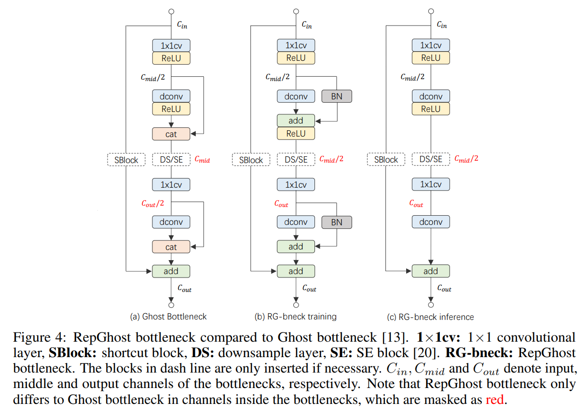
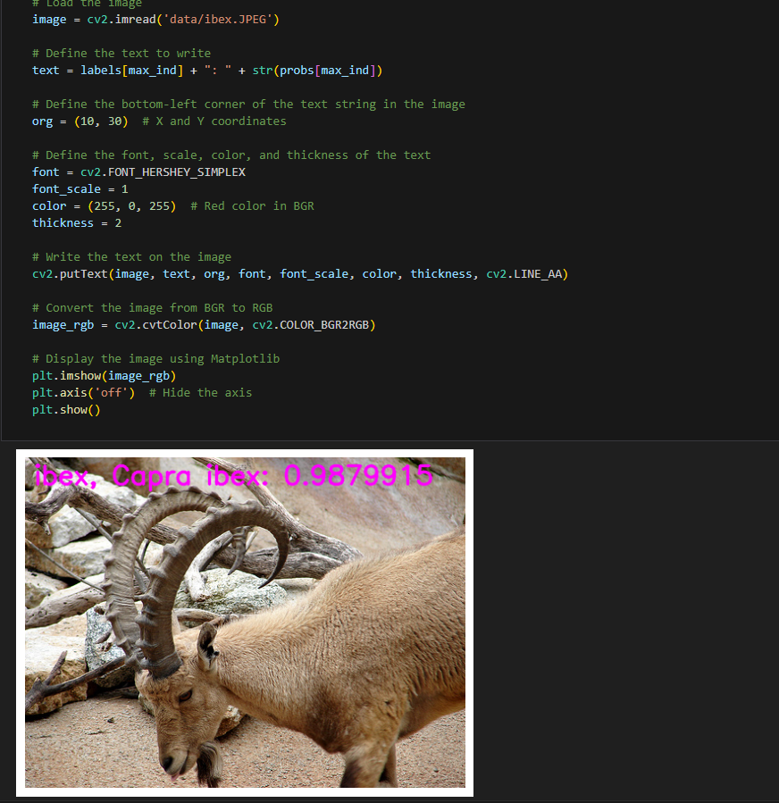

English | [简体中文](./README_cn.md)

# CNN X5 - RepGhost

- [CNN X5 - RepGhost](#cnn-x5---repghost)
  - [1. Introduction](#1-introduction)
  - [2. Model performance data](#2-model-performance-data)
  - [3. Model download](#3-model-download)
  - [4. Deployment Testing](#4-deployment-testing)
  - [5. Model Quantitation Experiment](#5-model-quantitation-experiment)


## 1. Introduction

- **Paper**: [RepGhost: A Hardware-Efficient Ghost Module via Re-parameterization](https://arxiv.org/abs/2211.06088)

- **GitHub repository**: [RepGhost: A Hardware-Efficient Ghost Module via Re-parameterization (github.com)](https://github.com/ChengpengChen/RepGhost)



The feature-to-reuse technique extends the feature space by connecting feature maps of different layers. For example, in DenseNet, the feature maps of early layers are repurposed and passed to subsequent layers, while GhostNet generates more feature maps through inexpensive operations and connects them with the original feature maps (Concat), thereby expanding the number of channels and network capacity while maintaining low FLOPs. Although the Concat operation does not increase the number of parameters and FLOPs, in hardware, due to complex memory replication, the computational efficiency of Concat is lower than that of addition operations. Therefore, it is necessary to explore more efficient feature-to-reuse methods.

To this end, RepGhost introduces structural reparameterization technology, which improves model performance by using complex structures during training, and then converts them into simplified structures during inference, thereby achieving efficient feature to reuse. In this way, feature to reuse is transferred from feature space to weight space, removing the Concat operation and improving hardware efficiency。


**RepGhost model features**:

- **Structural re-parameterization**: RepGhost uses complex structures during the training phase to improve performance, and then converts them into simpler and more efficient structures during the inference phase.
- I**mplicit feature reuse**: By structural re-parameterization, the feature to reuse process is transferred from the feature space to the weight space, removing the Concat operation and improving hardware efficiency.
- **Efficient computing**: Compared with the traditional feature to reuse method, the RepGhost module reduces memory copy operations, reduces hardware computing costs, and adapts to low computing resource environments.
- **Network lightweighted**: while maintaining network performance, reducing the number of FLOPs and parameters of the model, suitable for mobile devices and embedded systems.


## 2. Model performance data

The following table shows the performance data obtained from actual testing on RDK X5 & RDK X5 Module. You can weigh the size of the model according to your own reasoning about the actual performance and accuracy required

| Model       | Size    | Categories | Parameter | Floating point precision | Quantization accuracy | Latency/throughput (single-threaded) | Latency/throughput (multi-threaded) | Frame rate(FPS) |
| ----------- | ------- | ---------- | --------- | ------------------------ | --------------------- | ------------------------------------ | ----------------------------------- | --------------- |
| RepGhost_200 | 224x224 | 1000 | 9.79   | 76.43 | 75.25 | 2.89        | 8.76        | 451.42 |
| RepGhost_150 | 224x224 | 1000 | 6.57   | 74.75 | 73.50 | 2.20        | 6.30        | 626.60 |
| RepGhost_130 | 224x224 | 1000 | 5.48   | 75.00 | 73.57 | 1.87        | 5.30        | 743.56 |
| RepGhost_111 | 224x224 | 1000 | 4.54   | 72.75 | 71.25 | 1.71        | 4.47        | 881.19 |
| RepGhost_100 | 224x224 | 1000 | 4.07   | 72.50 | 72.25 | 1.55        | 4.08        | 964.69 |

Description:
1. X5 is in the best state: CPU is 8xA55@1.8G, full core Performance scheduling, BPU is 1xBayes-e@1G, a total of 10TOPS equivalent int8 computing power.
2. Single-threaded delay is the ideal situation for single frame, single-threaded, and single-BPU core delay, and BPU inference for a task.
3. The frame rate of a 4-thread project is when 4 threads simultaneously send tasks to a dual-core BPU. In a typical project, 4 threads can control the single frame delay to be small, while consuming all BPUs to 100%, achieving a good balance between throughput (FPS) and frame delay.
4. The maximum frame rate of 8 threads is for 8 threads to simultaneously load tasks into the dual-core BPU of X3. The purpose is to test the maximum performance of the BPU. Generally, 4 cores are already full. If 8 threads are much better than 4 threads, it indicates that the model structure needs to improve the "calculation/memory access" ratio or optimize the DDR bandwidth when compiling.
5. Floating-point/fixed-point precision: Floating-point accuracy uses the Top-1 inference accuracy Level of onnx before the model is quantized, while quantized accuracy is the accuracy Level of the actual inference of the model after quantization.


## 3. Model download

**.Bin file download** :

You can use the script [download_bin.sh](./model/download_bin.sh) to download all .bin model files for this model structure with one click, making it easy to change models directly. Alternatively, use one of the following command lines to select a single model for download:

```shell
wget https://archive.d-robotics.cc/downloads/rdk_model_zoo/rdk_x5/RepGhost_100_224x224_nv12.bin
wget https://archive.d-robotics.cc/downloads/rdk_model_zoo/rdk_x5/RepGhost_111_224x224_nv12.bin
wget https://archive.d-robotics.cc/downloads/rdk_model_zoo/rdk_x5/RepGhost_130_224x224_nv12.bin
wget https://archive.d-robotics.cc/downloads/rdk_model_zoo/rdk_x5/RepGhost_150_224x224_nv12.bin
wget https://archive.d-robotics.cc/downloads/rdk_model_zoo/rdk_x5/RepGhost_200_224x224_nv12.bin
```

**ONNX file download** :

The onnx model is transformed using models from the timm library (PyTorch Image Models). Install the required packages using the following command:

```shell
pip install timm onnx
```

Download the model source code using the following command:

```shell
git clone https://github.com/apple/ml-mobileone.git
```

Model transformation takes repghostnet_100 as an example, and the other five models are the same:

```Python
import torch
import torch.onnx
import onnx
from onnxsim import simplify
from timm.models import create_model

from timm.models.repghost import repghostnet_100, repghostnet_111, repghostnet_130, repghostnet_150, repghostnet_200

def count_parameters(onnx_model_path):
    # Load the ONNX model
    model = onnx.load(onnx_model_path)
    # Get the initializers (weights in the model)
    initializer = model.graph.initializer
    
    # Calculate the total number of parameters
    total_params = 0
    for tensor in initializer:
        # Get the dimensions of each weight
        dims = tensor.dims
        # Calculate the number of parameters in this weight (product of all dimensions)
        params = 1
        for dim in dims:
            params *= dim
        total_params += params
    
    return total_params

if __name__ == "__main__":
    device = torch.device("cuda" if torch.cuda.is_available() else "cpu")
    model = create_model('repghostnet_100', pretrained=True)
    model.eval()

    # print the model structure

    dummy_input = torch.randn(1, 3, 224, 224, device="cpu")
    onnx_file_path = "repghostnet_100.onnx"

    torch.onnx.export(
        model,
        dummy_input,
        onnx_file_path,
        opset_version=11,
        verbose=True,
        input_names=["data"],  # Input name
        output_names=["output"],  # Output name
    )
    
    # Simplify the ONNX model
    model_simp, check = simplify(onnx_file_path)

    if check:
        print("Simplified model is valid.")
        simplified_onnx_file_path = "repghostnet_100.onnx"
        onnx.save(model_simp, simplified_onnx_file_path)
        print(f"Simplified model saved to {simplified_onnx_file_path}")
    else:
        print("Simplified model is invalid!")
        
    onnx_model_path = simplified_onnx_file_path  # Replace with your ONNX model path
    total_params = count_parameters(onnx_model_path)
    print(f"Total number of parameters in the model: {total_params}")
```

## 4. Deployment Testing

After downloading the .bin file, you can execute the EdgeNeXt model jupyter script file of the test_EdgeNeXt_ * .ipynb series to experience the actual test effect on the board. If you need to change the test picture, you can download the dataset separately and put it in the data folder and change the path of the picture in the jupyter file



## 5. Model Quantitation Experiment

If you want to further advance the learning of model quantization, such as selecting quantization accuracy, selecting model nodes, configuring model input and output formats, etc., you can execute the shell file under the mapper folder in the Tiangong Kaiwu toolchain (note that it is on the PC side, not the board side) in order to optimize the model quantization. Here only gives the yaml configuration file (in the yaml folder), if you need to carry out quantization experiments, you can replace the yaml file corresponding to different sizes of models