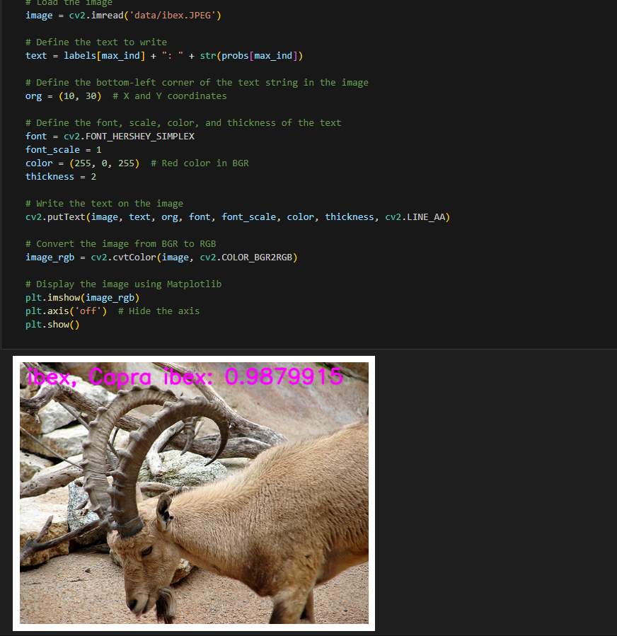

[English](./README.md) | 简体中文

# CNN X5 - RepGhost

- [CNN X5 - RepGhost](#cnn-x5---repghost)
  - [1. 简介](#1-简介)
  - [2. 模型性能数据](#2-模型性能数据)
  - [3. 模型下载](#3-模型下载)
  - [4. 部署测试](#4-部署测试)
  - [5. 量化实验](#5-量化实验)

## 1. 简介

- **论文地址**: [RepGhost: A Hardware-Efficient Ghost Module via Re-parameterization](https://arxiv.org/abs/2211.06088)

- **Github 仓库**: [RepGhost: A Hardware-Efficient Ghost Module via Re-parameterization (github.com)](https://github.com/ChengpengChen/RepGhost)


特征复用技术通过连接不同层的特征图来扩展特征空间。例如，DenseNet 中早期层的特征图被重复利用并传递到后续层，GhostNet 则通过廉价操作生成更多特征图并与原始特征图进行连接（Concat），从而扩大 channel 数量和网络容量，同时保持较低的 FLOPs。虽然 Concat 操作不会增加参数量和 FLOPs，但在硬件上，由于复杂的内存复制，Concat 的计算效率低于加法操作。因此，有必要探索更高效的特征复用方法。

为此，RepGhost 引入了结构重参数化技术，通过在训练期间使用复杂结构，提升模型性能，然后在推理时转换为简化的结构，从而实现高效的特征复用。通过这种方式，特征复用从特征空间转移到权重空间，去除 Concat 操作，提高了硬件效率


**RepGhost 模型特点**：

- **结构重参数化**：RepGhost 在训练阶段使用复杂结构，提升性能，然后在推理阶段将其转换为更简单、高效的结构。
- **特征隐式重用**：通过结构重参数化，将特征复用过程从特征空间转移到权重空间，去除 Concat 操作，提升硬件效率。
- **高效计算**：相比传统的特征复用方法，RepGhost 模块减少了内存复制操作，降低了硬件计算成本，适配低计算资源环境。
- **网络轻量化**：在保持网络性能的同时，减少了模型的 FLOPs 和参数量，适用于移动设备和嵌入式系统。


## 2. 模型性能数据

以下表格是在 RDK X5 & RDK X5 Module 上实际测试得到的性能数据，可以根据自己推理实际需要的性能和精度，对模型的大小做权衡取舍。


| 模型           | 尺寸(像素)  | 类别数  | 参数量(M) | 浮点Top-1  | 量化Top-1  | 延迟/吞吐量(单线程) | 延迟/吞吐量(多线程) | 帧率      |
| ------------ | ------- | ---- | ------ | ----- | ----- | ----------- | ----------- | ------- |
| RepGhost_200 | 224x224 | 1000 | 9.79   | 76.43 | 75.25 | 2.89        | 8.76        | 451.42 |
| RepGhost_150 | 224x224 | 1000 | 6.57   | 74.75 | 73.50 | 2.20        | 6.30        | 626.60 |
| RepGhost_130 | 224x224 | 1000 | 5.48   | 75.00 | 73.57 | 1.87        | 5.30        | 743.56 |
| RepGhost_111 | 224x224 | 1000 | 4.54   | 72.75 | 71.25 | 1.71        | 4.47        | 881.19 |
| RepGhost_100 | 224x224 | 1000 | 4.07   | 72.50 | 72.25 | 1.55        | 4.08        | 964.69 |


说明: 
1. X5的状态为最佳状态：CPU为8xA55@1.8G, 全核心Performance调度, BPU为1xBayes-e@1G, 共10TOPS等效int8算力。
2. 单线程延迟为单帧，单线程，单BPU核心的延迟，BPU推理一个任务最理想的情况。
3. 4线程工程帧率为4个线程同时向双核心BPU塞任务，一般工程中4个线程可以控制单帧延迟较小，同时吃满所有BPU到100%，在吞吐量(FPS)和帧延迟间得到一个较好的平衡。
4. 8线程极限帧率为8个线程同时向X3的双核心BPU塞任务，目的是为了测试BPU的极限性能，一般来说4核心已经占满，如果8线程比4线程还要好很多，说明模型结构需要提高"计算/访存"比，或者编译时选择优化DDR带宽。
5. 浮点/定点Top-1：浮点Top-1使用的是模型未量化前onnx的 Top-1 推理精度，量化Top-1则为量化后模型实际推理的精度。

## 3. 模型下载

**.bin 文件下载**：

可以使用脚本 [download.sh](./model/download.sh) 一键下载所有此模型结构的 .bin 模型文件，方便直接更换模型。或者使用以下命令行中的一个，选取单个模型进行下载：

```shell
wget https://archive.d-robotics.cc/downloads/rdk_model_zoo/rdk_x5/RepGhost_100_224x224_nv12.bin
wget https://archive.d-robotics.cc/downloads/rdk_model_zoo/rdk_x5/RepGhost_111_224x224_nv12.bin
wget https://archive.d-robotics.cc/downloads/rdk_model_zoo/rdk_x5/RepGhost_130_224x224_nv12.bin
wget https://archive.d-robotics.cc/downloads/rdk_model_zoo/rdk_x5/RepGhost_150_224x224_nv12.bin
wget https://archive.d-robotics.cc/downloads/rdk_model_zoo/rdk_x5/RepGhost_200_224x224_nv12.bin
```

**ONNX文件下载**：

onnx 模型使用的是 timm 库 (PyTorch Image Models) 中的模型进行转换的，使用以下命令安装所需要的包：

```shell
pip install timm onnx
```

模型转换以 repghostnet_100 为例，其余四个模型同理：

```Python
import torch
import torch.onnx
import onnx
from onnxsim import simplify
from timm.models import create_model

from timm.models.repghost import repghostnet_100, repghostnet_111, repghostnet_130, repghostnet_150, repghostnet_200

def count_parameters(onnx_model_path):
    # Load the ONNX model
    model = onnx.load(onnx_model_path)
    # Get the initializers (weights in the model)
    initializer = model.graph.initializer
    
    # Calculate the total number of parameters
    total_params = 0
    for tensor in initializer:
        # Get the dimensions of each weight
        dims = tensor.dims
        # Calculate the number of parameters in this weight (product of all dimensions)
        params = 1
        for dim in dims:
            params *= dim
        total_params += params
    
    return total_params

if __name__ == "__main__":
    device = torch.device("cuda" if torch.cuda.is_available() else "cpu")
    model = create_model('repghostnet_100', pretrained=True)
    model.eval()

    # print the model structure

    dummy_input = torch.randn(1, 3, 224, 224, device="cpu")
    onnx_file_path = "repghostnet_100.onnx"

    torch.onnx.export(
        model,
        dummy_input,
        onnx_file_path,
        opset_version=11,
        verbose=True,
        input_names=["data"],  # Input name
        output_names=["output"],  # Output name
    )
    
    # Simplify the ONNX model
    model_simp, check = simplify(onnx_file_path)

    if check:
        print("Simplified model is valid.")
        simplified_onnx_file_path = "repghostnet_100.onnx"
        onnx.save(model_simp, simplified_onnx_file_path)
        print(f"Simplified model saved to {simplified_onnx_file_path}")
    else:
        print("Simplified model is invalid!")
        
    onnx_model_path = simplified_onnx_file_path  # Replace with your ONNX model path
    total_params = count_parameters(onnx_model_path)
    print(f"Total number of parameters in the model: {total_params}")
```

## 4. 部署测试

在下载完毕 .bin 文件后，可以执行 test_RepGhost_*.ipynb 系列的 RepGhost 模型 jupyter 脚本文件，在板端实际运行体验实际测试效果。需要更改测试图片，可额外下载数据集后，放入到data文件夹下并更改 jupyter 文件中图片的路径



## 5. 量化实验

若想要进一步进阶对模型量化过程中的学习，如选取量化精度、对模型节点进行取舍、模型输入输出格式配置等，可以按顺序在天工开物工具链（注意是在pc端，不是板端）中执行 mapper 文件夹下的shell文件，对模型进行量化调优。这里仅仅给出 yaml 的配置文件（在yaml文件夹中），如需进行量化实验可将对应不同大小模型的yaml文件自行替换
