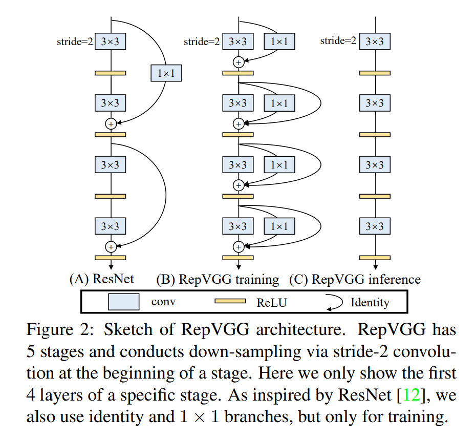
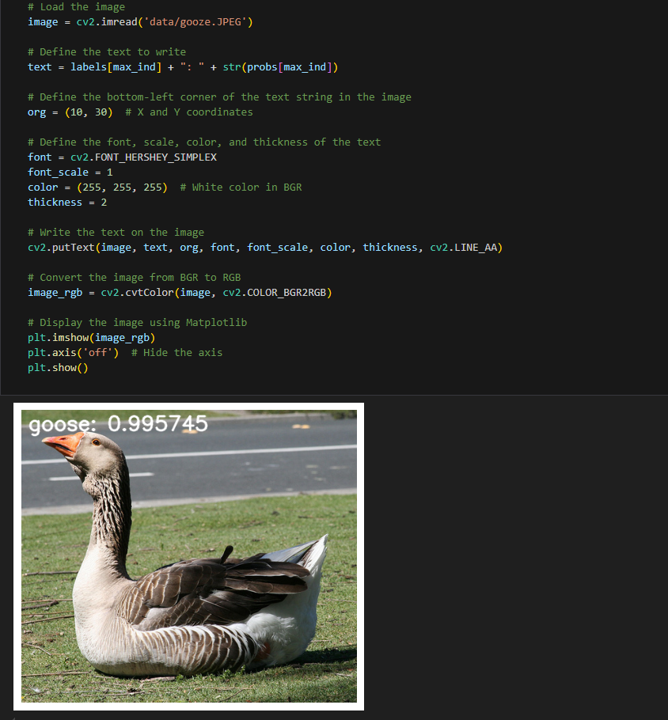

English | [简体中文](./README_cn.md)

# CNN - RepVGG

- [CNN - RepVGG](#cnn---repvgg)
  - [1. Introduction](#1-introduction)
  - [2. Model performance data](#2-model-performance-data)
  - [3. Model download](#3-model-download)
  - [4. Deployment Testing](#4-deployment-testing)
  - [5. Model Quantitation Experiment](#5-model-quantitation-experiment)


## 1. Introduction

- **Paper**: [RepVGG: Making VGG-style ConvNets Great Again](https://arxiv.org/abs/2101.03697)

- **GitHub repository**: [RepVGG](https://github.com/DingXiaoH/RepVGG)



RepVGG stacks 20 layers of 3x3 convolutions and divides them into 5 stages. The first layer of each stage is downsampling with stride = 2. Each convolution layer uses ReLU as the activation function and does not use maximum pooling. For classification tasks, global pooling and fully connected layers are used after the classification layer. The 5 stages of RepVGG-A have [1, 2, 4, 14, 1] layers, while the 5 stages of RepVGG-B have [1, 4, 6, 16, 1] layers, with widths several times that of [64, 128, 256, 512]. The multiples here are arbitrarily specified "neat" numbers such as 1.5 and 2.5, without fine-tuning

The design of the number of layers in each stage is shown in the table above. Except for the first and last stages using a single layer, the number of layers in each stage gradually increases. The width of each stage is adjusted by scaling factors a and b to ensure that richer features can be extracted in the last stage. In order to avoid using too large convolution in the first stage, a min (64, 64a) setting was made.

In order to further compress the parameters, the paper directly adds grouped convolution to specific layers, achieving a trade-off between speed and accuracy, such as the 3rd, 5th, 7th,..., 21st layers of RepVGG-A and the 23rd, 25th, and 27th layers of RepVGG-B.


**RepVGG model features**:

- The model is similar to VGG, without any branches, no need to save too many intermediate results, and low memory usage.
- The model only contains 3x3 convolution and ReLU, and the calculation speed is fast.
- The specific network structure (including depth and width) does not require complex means such as automatic search, manual adjustment, and compound scaling for design, and is very flexible.


## 2. Model performance data

The following table shows the performance data obtained from actual testing on RDK X5 & RDK X5 Module. You can weigh the size of the model according to your own reasoning about the actual performance and accuracy required

| Model       | Size    | Categories | Parameter | Floating point precision | Quantization accuracy | Latency/throughput (single-threaded) | Latency/throughput (multi-threaded) | Frame rate(FPS) |
| ----------- | ------- | ---------- | --------- | ------------------------ | --------------------- | ------------------------------------ | ----------------------------------- | --------------- |
| RepVGG_B1g2 | 224x224 | 1000       | 41.36     | 77.78                    | 68.25                 | 9.77                                 | 36.19                               | 109.61          |
| RepVGG_B1g4 | 224x224 | 1000       | 36.12     | 77.58                    | 62.75                 | 7.58                                 | 27.47                               | 144.39          |
| RepVGG_B0   | 224x224 | 1000       | 14.33     | 75.14                    | 60.36                 | 3.07                                 | 9.65                                | 410.55          |
| RepVGG_A2   | 224x224 | 1000       | 25.49     | 76.48                    | 62.97                 | 6.07                                 | 21.31                               | 186.04          |
| RepVGG_A1   | 224x224 | 1000       | 12.78     | 74.46                    | 62.78                 | 2.67                                 | 8.21                                | 482.20          |
| RepVGG_A0   | 224x224 | 1000       | 8.30      | 72.41                    | 51.75                 | 1.85                                 | 5.21                                | 757.73          |

Description:
1. X5 is in the best state: CPU is 8xA55@1.8G, full core Performance scheduling, BPU is 1xBayes-e@1G, a total of 10TOPS equivalent int8 computing power.
2. Single-threaded delay is the ideal situation for single frame, single-threaded, and single-BPU core delay, and BPU inference for a task.
3. The frame rate of a 4-thread project is when 4 threads simultaneously send tasks to a dual-core BPU. In a typical project, 4 threads can control the single frame delay to be small, while consuming all BPUs to 100%, achieving a good balance between throughput (FPS) and frame delay.
4. The maximum frame rate of 8 threads is for 8 threads to simultaneously load tasks into the dual-core BPU of X3. The purpose is to test the maximum performance of the BPU. Generally, 4 cores are already full. If 8 threads are much better than 4 threads, it indicates that the model structure needs to improve the "calculation/memory access" ratio or optimize the DDR bandwidth when compiling.
5. Floating-point/fixed-point precision: Floating-point accuracy uses the Top-1 inference accuracy Level of onnx before the model is quantized, while quantized accuracy is the accuracy Level of the actual inference of the model after quantization.


## 3. Model download

**.Bin file download** :

You can use the script [download.sh](./model/download.sh) to download all .bin model files for this model structure with one click, making it easy to change models directly. Alternatively, use one of the following command lines to select a single model for download:

```shell
wget https://archive.d-robotics.cc/downloads/rdk_model_zoo/rdk_x5/RepVGG_A0_224x224_nv12.bin
wget https://archive.d-robotics.cc/downloads/rdk_model_zoo/rdk_x5/RepVGG_A1_224x224_nv12.bin
wget https://archive.d-robotics.cc/downloads/rdk_model_zoo/rdk_x5/RepVGG_A2_224x224_nv12.bin
wget https://archive.d-robotics.cc/downloads/rdk_model_zoo/rdk_x5/RepVGG_B0_224x224_nv12.bin
wget https://archive.d-robotics.cc/downloads/rdk_model_zoo/rdk_x5/RepVGG_B1g2_224x224_nv12.bin
wget https://archive.d-robotics.cc/downloads/rdk_model_zoo/rdk_x5/RepVGG_B1g4_224x224_nv12.bin
```

**ONNX file download** :

The onnx model is transformed using models from the timm library (PyTorch Image Models). Install the required packages using the following command:

```shell
pip install timm onnx
```

Download the model source code using the following command:

```shell
git clone https://github.com/DingXiaoH/RepVGG.git
```

Model transformation takes RepVGG-B1g2 as an example, and the other five models are the same:

```Python
from repvgg import *
import torch
import onnx
import torch.onnx

def count_parameters(onnx_model_path):
    # Load the ONNX model
    model = onnx.load(onnx_model_path)
    # Get the initializers (weights in the model)
    initializer = model.graph.initializer
    
    # Calculate the total number of parameters
    total_params = 0
    for tensor in initializer:
        # Get the dimensions of each weight
        dims = tensor.dims
        # Calculate the number of parameters in this weight (product of all dimensions)
        params = 1
        for dim in dims:
            params *= dim
        total_params += params
    
    return total_params

if __name__ == "__main__":
    model_path = "RepVGG-B1g2-train.pth"
    device = torch.device("cuda" if torch.cuda.is_available() else "cpu")
    model = create_RepVGG_B1g2(deploy=False)
    model.load_state_dict(torch.load(model_path, map_location=device))
    model.eval()
    model = repvgg_model_convert(model)

    dummy_input = torch.randn(1, 3, 224, 224, device="cpu")
    onnx_file_path = "RepVGG-B1g2.onnx"

    torch.onnx.export(
        model,
        dummy_input,
        onnx_file_path,
        opset_version=11,
        verbose=True,
        input_names=["data"],  # input name
        output_names=["output"],  # output name
    )
    
    param_count = count_parameters(onnx_file_path)
    print(f'Total number of parameters: {param_count}')
```

## 4. Deployment Testing

After downloading the .bin file, you can execute the EdgeNeXt model jupyter script file of the test_EdgeNeXt_ * .ipynb series to experience the actual test effect on the board. If you need to change the test picture, you can download the dataset separately and put it in the data folder and change the path of the picture in the jupyter file



## 5. Model Quantitation Experiment

If you want to further advance the learning of model quantization, such as selecting quantization accuracy, selecting model nodes, configuring model input and output formats, etc., you can execute the shell file under the mapper folder in the Tiangong Kaiwu toolchain (note that it is on the PC side, not the board side) in order to optimize the model quantization. Here only gives the yaml configuration file (in the yaml folder), if you need to carry out quantization experiments, you can replace the yaml file corresponding to different sizes of models