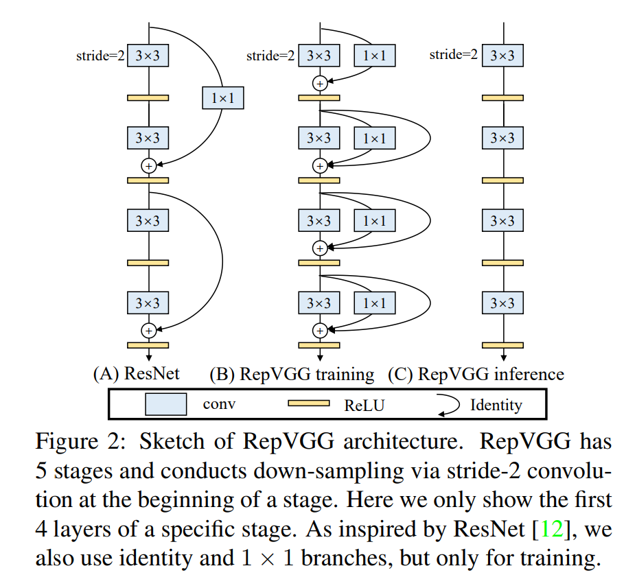
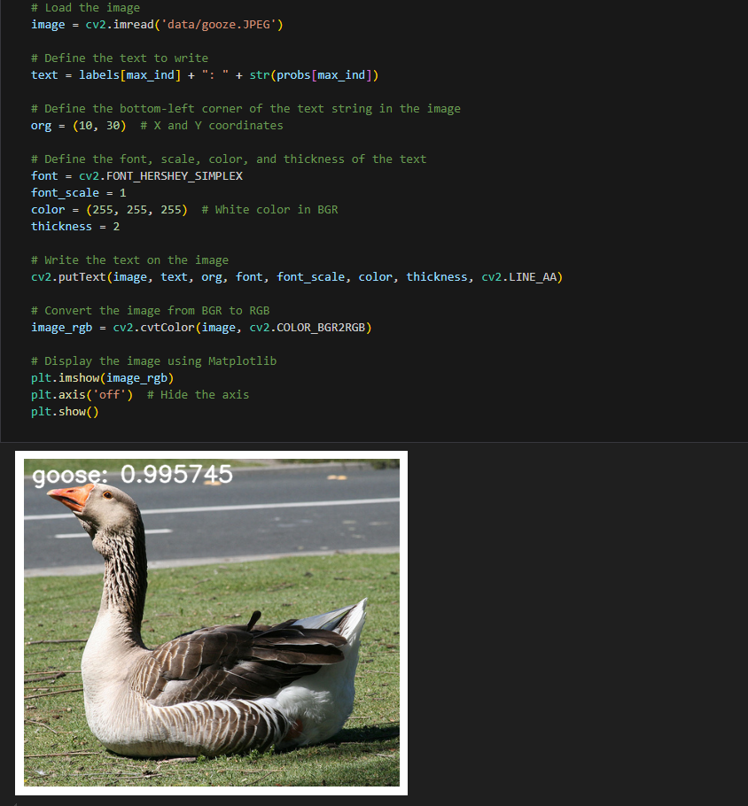

[English](./README.md) | 简体中文

# CNN X5 - RepVGG

- [CNN X5 - RepVGG](#cnn-x5---repvgg)
  - [1. 简介](#1-简介)
  - [2. 模型性能数据](#2-模型性能数据)
  - [3. 模型下载](#3-模型下载)
  - [4. 部署测试](#4-部署测试)
  - [5. 量化实验](#5-量化实验)

## 1. 简介

- **论文地址**: [RepVGG: Making VGG-style ConvNets Great Again](https://arxiv.org/abs/2101.03697)

- **Github 仓库**: [RepVGG](https://github.com/DingXiaoH/RepVGG)



RepVGG 将20多层3x3卷积堆起来，分成5个stage，每个stage的第一层是stride=2的降采样，每个卷积层用ReLU作为激活函数，且不使用最大池化。对于分类任务，在分类层后使用全局池化和全连接层。RepVGG-A的5个stage分别有[1, 2, 4, 14, 1]层，RepVGG-B的5个stage分别有[1, 4, 6, 16, 1]层，宽度是[64, 128, 256, 512]的若干倍。这里的倍数是随意指定的诸如1.5,2.5这样的“工整”的数字，没有经过细调

每个阶段的层数的设计如上表所示，除首尾两个阶段使用单层外，每个阶段的层数逐渐增加。而每个阶段的宽度则通过缩放因子a和b进行调整，保证最后一个阶段能够提取更丰富的特征。为了避免第一阶段采用过大的卷积，进行了min(64,64a)的设置。

为了进一步压缩参数，论文直接在特定的层加入分组卷积，从而达到速度和准确率之间的trade-off，比如RepVGG-A的3rd, 5th, 7th, ..., 21st层以及RepVGG-B的23rd, 25th和27th层。

**RepVGG 模型特点**：

- 模型跟VGG类似，不包含任何分支，无需保存过多的中间结果，内存占用少。
- 模型仅包含3×3卷积和ReLU，计算速度快。
- 具体的网络结构(包括深度和宽度)不需要依靠自动搜索、人工调整以及复合缩放等复杂手段进行设计，十分灵活。


## 2. 模型性能数据

以下表格是在 RDK X5 & RDK X5 Module 上实际测试得到的性能数据，可以根据自己推理实际需要的性能和精度，对模型的大小做权衡取舍。


| 模型          | 尺寸(像素)  | 类别数  | 参数量(M) | 浮点精度  | 量化精度  | 延迟/吞吐量(单线程) | 延迟/吞吐量(多线程) | 帧率     |
| ----------- | ------- | ---- | ------ | ----- | ----- | ----------- | ----------- | ------ |
| RepVGG_B1g2 | 224x224 | 1000 | 41.36  | 77.78 | 68.25 | 9.77        | 36.19       | 109.61 |
| RepVGG_B1g4 | 224x224 | 1000 | 36.12  | 77.58 | 62.75 | 7.58        | 27.47       | 144.39 |
| RepVGG_B0   | 224x224 | 1000 | 14.33  | 75.14 | 60.36 | 3.07        | 9.65        | 410.55 |
| RepVGG_A2   | 224x224 | 1000 | 25.49  | 76.48 | 62.97 | 6.07        | 21.31       | 186.04 |
| RepVGG_A1   | 224x224 | 1000 | 12.78  | 74.46 | 62.78 | 2.67        | 8.21        | 482.20 |
| RepVGG_A0   | 224x224 | 1000 | 8.30   | 72.41 | 51.75 | 1.85        | 5.21        | 757.73 |


说明: 
1. X5的状态为最佳状态：CPU为8xA55@1.8G, 全核心Performance调度, BPU为1xBayes-e@1G, 共10TOPS等效int8算力。
2. 单线程延迟为单帧，单线程，单BPU核心的延迟，BPU推理一个任务最理想的情况。
3. 4线程工程帧率为4个线程同时向双核心BPU塞任务，一般工程中4个线程可以控制单帧延迟较小，同时吃满所有BPU到100%，在吞吐量(FPS)和帧延迟间得到一个较好的平衡。
4. 8线程极限帧率为8个线程同时向X3的双核心BPU塞任务，目的是为了测试BPU的极限性能，一般来说4核心已经占满，如果8线程比4线程还要好很多，说明模型结构需要提高"计算/访存"比，或者编译时选择优化DDR带宽。
5. 浮点/定点精度：浮点精度使用的是模型未量化前onnx的 Top-1 推理精度，量化精度则为量化后模型实际推理的精度。

## 3. 模型下载

**.bin 文件下载**：

可以使用脚本 [download_bin.sh](./model/download_bin.sh) 一键下载所有此模型结构的 .bin 模型文件，方便直接更换模型。或者使用以下命令行中的一个，选取单个模型进行下载：

```shell
wget https://archive.d-robotics.cc/downloads/rdk_model_zoo/rdk_x5/RepVGG_A0_224x224_nv12.bin
wget https://archive.d-robotics.cc/downloads/rdk_model_zoo/rdk_x5/RepVGG_A1_224x224_nv12.bin
wget https://archive.d-robotics.cc/downloads/rdk_model_zoo/rdk_x5/RepVGG_A2_224x224_nv12.bin
wget https://archive.d-robotics.cc/downloads/rdk_model_zoo/rdk_x5/RepVGG_B0_224x224_nv12.bin
wget https://archive.d-robotics.cc/downloads/rdk_model_zoo/rdk_x5/RepVGG_B1g2_224x224_nv12.bin
wget https://archive.d-robotics.cc/downloads/rdk_model_zoo/rdk_x5/RepVGG_B1g4_224x224_nv12.bin
```

**ONNX文件下载**：

与.bin文件同理，使用 [download_onnx.sh](./model/download_onnx.sh)一键下载所有此模型结构的 .onnx 模型文件，或下载单个 .onnx 模型进行量化实验：

```shell
wget https://archive.d-robotics.cc/downloads/rdk_model_zoo/rdk_x5/RepVGG_A0_224x224_nv12.onnx
wget https://archive.d-robotics.cc/downloads/rdk_model_zoo/rdk_x5/RepVGG_A1_224x224_nv12.onnx
wget https://archive.d-robotics.cc/downloads/rdk_model_zoo/rdk_x5/RepVGG_A2_224x224_nv12.onnx
wget https://archive.d-robotics.cc/downloads/rdk_model_zoo/rdk_x5/RepVGG_B0_224x224_nv12.onnx
wget https://archive.d-robotics.cc/downloads/rdk_model_zoo/rdk_x5/RepVGG_B1g2_224x224_nv12.onnx
wget https://archive.d-robotics.cc/downloads/rdk_model_zoo/rdk_x5/RepVGG_B1g4_224x224_nv12.onnx
```

## 4. 部署测试

在下载完毕 .bin 文件后，可以执行 test_RepVGG_*.ipynb 系列的 RepVGG 模型 jupyter 脚本文件，在板端实际运行体验实际测试效果。需要更改测试图片，可额外下载数据集后，放入到data文件夹下并更改 jupyter 文件中图片的路径



## 5. 量化实验

若想要进一步进阶对模型量化过程中的学习，如选取量化精度、对模型节点进行取舍、模型输入输出格式配置等，可以按顺序在天工开物工具链（注意是在pc端，不是板端）中执行 mapper 文件夹下的shell文件，对模型进行量化调优。这里仅仅给出 yaml 的配置文件（在yaml文件夹中），如需进行量化实验可将对应不同大小模型的yaml文件自行替换
