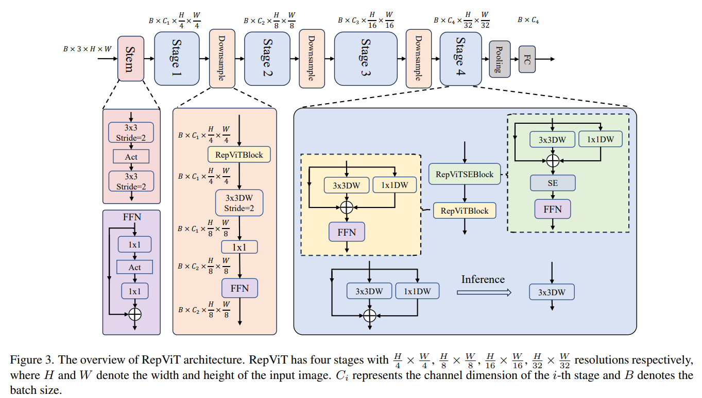
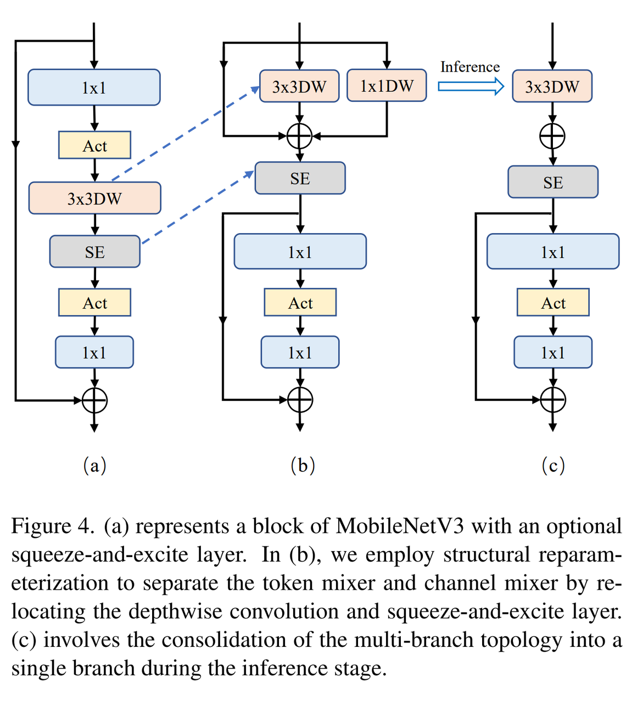
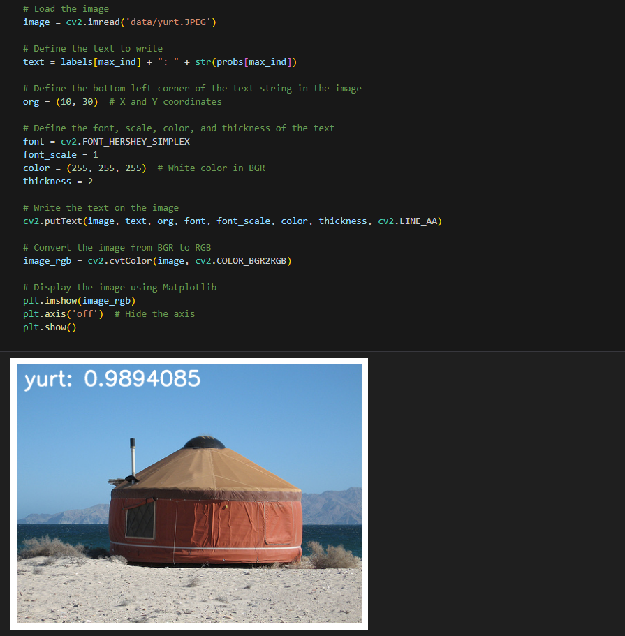

English | [简体中文](./README_cn.md)

# CNN X5 - RepViT

- [CNN X5 - RepViT](#cnn-x5---repvit)
  - [1. Introduction](#1-introduction)
  - [2. Model performance data](#2-model-performance-data)
  - [3. Model download](#3-model-download)
  - [4. Deployment Testing](#4ment-testing)
  - [5. Model Quantitation Experiment](#5-model-quantitation-experiment)


## 1. Introduction

- **Paper**: [RepViT: Revisiting Mobile CNN From ViT Perspective](http://arxiv.org/abs/2307.09283)

- **GitHub repository**: [THU-MIG/RepViT: RepViT: Revisiting Mobile CNN From ViT Perspective (github.com)](https://github.com/THU-MIG/RepViT)



**Structural reparameterization** and ViT methods are adopted on MobileNetv3 to integrate the effective architecture selection of lightweight ViTs with a pure CNN structure. Lightweight ViTs usually perform better than lightweight CNNs in visual tasks, mainly due to their multi-head self-attention module (MSHA), which allows the model to learn global representations. However, the architectural differences between lightweight ViTs and lightweight CNNs have not been fully studied, and ViT structures are relatively slower in inference speed than CNNs, making deployment more difficult.

RepViT has improved the block structure of MobileNetV3-L by separating the token mixer and channel mixer. The original MobileNetV3 block structure consisted of a 1x1 expansion convolution, followed by a depth convolution and a 1x1 projection layer, and then connected the input and output through residual connections. Based on this, RepViT advances the depth convolution so that the channel mixer and token mixer can be separated.



**RepViT model features**:

- The model borrows the operation of separating patches from ViT and replaces it with a convolution layer.
- The method of structural reparameterization is used, and some operators in the BN layer are integrated to make inference faster.


## 2. Model performance data

The following table shows the performance data obtained from actual testing on RDK X5 & RDK X5 Module. You can weigh the size of the model according to your own reasoning about the actual performance and accuracy required

| Model       | Size    | Categories | Parameter | Floating point precision | Quantization accuracy | Latency/throughput (single-threaded) | Latency/throughput (multi-threaded) | Frame rate(FPS) |
| ----------- | ------- | ---------- | --------- | ------------------------ | --------------------- | ------------------------------------ | ----------------------------------- | --------------- |
| RepViT_m1_1 | 224x224 | 1000       | 8.2       | 77.73                    | 77.50                 | 2.32                                 | 6.69                                | 590.42          |
| RepViT_m1_0 | 224x224 | 1000       | 6.8       | 76.75                    | 76.50                 | 1.97                                 | 5.71                                | 692.29          |
| RepViT_m0_9 | 224x224 | 1000       | 5.1       | 76.32                    | 75.75                 | 1.65                                 | 4.37                                | 902.69          |

Description:
1. X5 is in the best state: CPU is 8xA55@1.8G, full core Performance scheduling, BPU is 1xBayes-e@1G, a total of 10TOPS equivalent int8 computing power.
2. Single-threaded delay is the ideal situation for single frame, single-threaded, and single-BPU core delay, and BPU inference for a task.
3. The frame rate of a 4-thread project is when 4 threads simultaneously send tasks to a dual-core BPU. In a typical project, 4 threads can control the single frame delay to be small, while consuming all BPUs to 100%, achieving a good balance between throughput (FPS) and frame delay.
4. The maximum frame rate of 8 threads is for 8 threads to simultaneously load tasks into the dual-core BPU of X3. The purpose is to test the maximum performance of the BPU. Generally, 4 cores are already full. If 8 threads are much better than 4 threads, it indicates that the model structure needs to improve the "calculation/memory access" ratio or optimize the DDR bandwidth when compiling.
5. Floating-point/fixed-point precision: Floating-point accuracy uses the Top-1 inference Confidence Level of onnx before the model is quantized, while quantized accuracy is the Confidence Level of the actual inference of the model after quantization.


## 3. Model download

**.Bin file download** :

You can use the script [download_bin.sh](./model/download_bin.sh) to download all .bin model files for this model structure with one click, making it easy to change models directly. Alternatively, use one of the following command lines to select a single model for download:

```shell
wget https://archive.d-robotics.cc/downloads/rdk_model_zoo/rdk_x5/RepViT_m0_9_224x224_nv12.bin
wget https://archive.d-robotics.cc/downloads/rdk_model_zoo/rdk_x5/RepViT_m1_0_224x224_nv12.bin
wget https://archive.d-robotics.cc/downloads/rdk_model_zoo/rdk_x5/RepViT_m1_1_224x224_nv12.bin
```

**ONNX file download** :

Similarly to the .bin file, use [download_onnx.sh](./model/download_onnx.sh) to download all .onnx model files of this model structure with one click, or download a single .onnx model for quantization experiments:

```shell
wget https://archive.d-robotics.cc/downloads/rdk_model_zoo/rdk_x5/repvit_m0_9_deploy.onnx
wget https://archive.d-robotics.cc/downloads/rdk_model_zoo/rdk_x5/repvit_m1_0_deploy.onnx
wget https://archive.d-robotics.cc/downloads/rdk_model_zoo/rdk_x5/repvit_m1_1_deploy.onnx
```

## 4. Deployment Testing

After downloading the .bin file, you can execute the RepViT model jupyter script file of the test_RepViT_ * .ipynb series to experience the actual test effect on the board. If you need to change the test picture, you can download the dataset separately and put it in the data folder and change the path of the picture in the jupyter file



## 5. Model Quantitation Experiment

If you want to further advance the learning of model quantization, such as selecting quantization accuracy, selecting model nodes, configuring model input and output formats, etc., you can execute the shell file under the mapper folder in the Tiangong Kaiwu toolchain (note that it is on the PC side, not the board side) in order to optimize the model quantization. Here only gives the yaml configuration file (in the yaml folder), if you need to carry out quantization experiments, you can replace the yaml file corresponding to different sizes of models