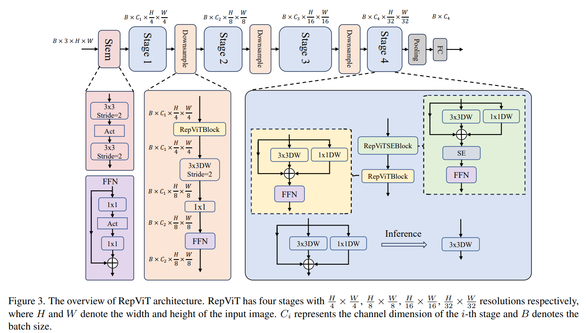
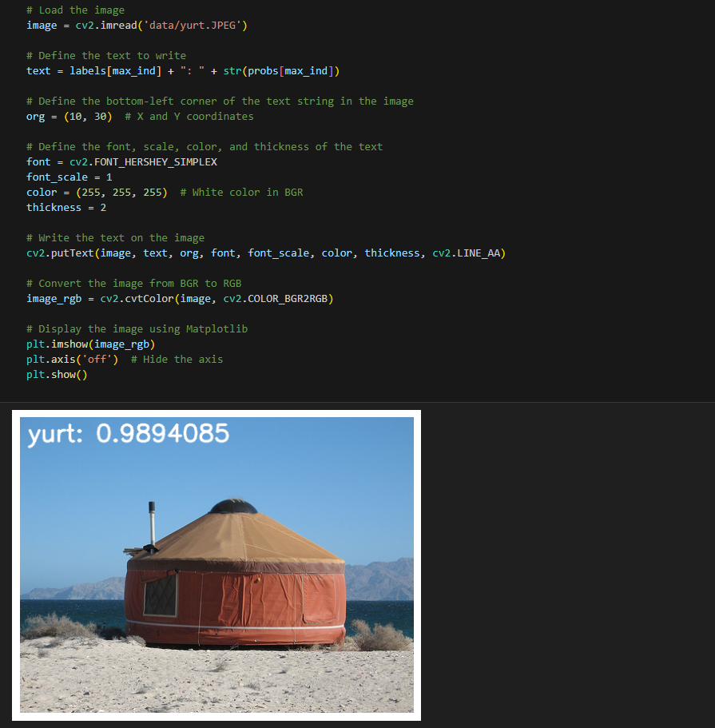

[English](./README.md) | 简体中文

# CNN X5 - RepViT

- [CNN X5 - RepViT](#cnn-x5---repvit)
  - [1. 简介](#1-简介)
  - [2. 模型性能数据](#2-模型性能数据)
  - [3. 模型下载](#3-模型下载)
  - [4. 部署测试](#4-部署测试)
  - [5. 量化实验](#5-量化实验)

## 1. 简介

- **论文地址**: [RepViT: Revisiting Mobile CNN From ViT Perspective](http://arxiv.org/abs/2307.09283)

- **Github 仓库**: [THU-MIG/RepViT: RepViT: Revisiting Mobile CNN From ViT Perspective (github.com)](https://github.com/THU-MIG/RepViT)



在 MobileNetv3 上采用结构重参数化和ViT方法，整合轻量级 ViTs 的有效架构选择，纯CNN结构。轻量级 ViTs 通常比轻量级 CNNs 在视觉任务上表现得更好，这主要归功于它们的多头自注意力模块(MSHA)可以让模型学习全局表示。然而，轻量级 ViTs 和轻量级 CNNs 之间的架构差异尚未得到充分研究，且 ViT 结构相对来说推理速度比 CNN 要慢，部署比较困难。

RepViT 对 MobileNetV3-L 的块结构进行了改进，分离了令牌混合器和通道混合器。原来的 MobileNetV3 块结构包含一个 1x1 扩张卷积，然后是一个深度卷积和一个 1x1 的投影层，然后通过残差连接连接输入和输出。在此基础上，RepViT 将深度卷积提前，使得通道混合器和令牌混合器能够被分开。


**RepViT 模型特点**：

- 模型借鉴了 ViT 的分离 Patch 的操作，将其用卷积层替代；
- 使用了结构重参数化的方法，融合了 BN 层中的部分算子使得在推理的时候更加快速；


## 2. 模型性能数据

以下表格是在 RDK X5 & RDK X5 Module 上实际测试得到的性能数据，可以根据自己推理实际需要的性能和精度，对模型的大小做权衡取舍。


| 模型          | 尺寸(像素)  | 类别数  | 参数量(M) | 浮点精度  | 量化精度  | 延迟/吞吐量(单线程) | 延迟/吞吐量(多线程) | 帧率     |
| ----------- | ------- | ---- | ------ | ----- | ----- | ----------- | ----------- | ------ |
| RepViT_m1_1 | 224x224 | 1000 | 8.2    | 77.73 | 77.50 | 2.32        | 6.69        | 590.42 |
| RepViT_m1_0 | 224x224 | 1000 | 6.8    | 76.75 | 76.50 | 1.97        | 5.71        | 692.29 |
| RepViT_m0_9 | 224x224 | 1000 | 5.1    | 76.32 | 75.75 | 1.65        | 4.37        | 902.69 |


说明: 
1. X5的状态为最佳状态：CPU为8xA55@1.8G, 全核心Performance调度, BPU为1xBayes-e@1G, 共10TOPS等效int8算力。
2. 单线程延迟为单帧，单线程，单BPU核心的延迟，BPU推理一个任务最理想的情况。
3. 4线程工程帧率为4个线程同时向双核心BPU塞任务，一般工程中4个线程可以控制单帧延迟较小，同时吃满所有BPU到100%，在吞吐量(FPS)和帧延迟间得到一个较好的平衡。
4. 8线程极限帧率为8个线程同时向X3的双核心BPU塞任务，目的是为了测试BPU的极限性能，一般来说4核心已经占满，如果8线程比4线程还要好很多，说明模型结构需要提高"计算/访存"比，或者编译时选择优化DDR带宽。
5. 浮点/定点精度：浮点精度使用的是模型未量化前onnx的 Top-1 推理置信度，量化精度则为量化后模型实际推理的置信度。

## 3. 模型下载

**.bin 文件下载**：

可以使用脚本 [download_bin.sh](./model/download_bin.sh) 一键下载所有此模型结构的 .bin 模型文件，方便直接更换模型。或者使用以下命令行中的一个，选取单个模型进行下载：

```shell
wget https://archive.d-robotics.cc/downloads/rdk_model_zoo/rdk_x5/RepViT_m0_9_224x224_nv12.bin
wget https://archive.d-robotics.cc/downloads/rdk_model_zoo/rdk_x5/RepViT_m1_0_224x224_nv12.bin
wget https://archive.d-robotics.cc/downloads/rdk_model_zoo/rdk_x5/RepViT_m1_1_224x224_nv12.bin
```

**ONNX文件下载**：

与.bin文件同理，使用 [download_onnx.sh](./model/download_onnx.sh)一键下载所有此模型结构的 .onnx 模型文件，或下载单个 .onnx 模型进行量化实验：

```shell
wget https://archive.d-robotics.cc/downloads/rdk_model_zoo/rdk_x5/repvit_m0_9_deploy.onnx
wget https://archive.d-robotics.cc/downloads/rdk_model_zoo/rdk_x5/repvit_m1_0_deploy.onnx
wget https://archive.d-robotics.cc/downloads/rdk_model_zoo/rdk_x5/repvit_m1_1_deploy.onnx
```

## 4. 部署测试

在下载完毕 .bin 文件后，可以执行 test_RepViT_*.ipynb 系列的 RepViT 模型 jupyter 脚本文件，在板端实际运行体验实际测试效果。需要更改测试图片，可额外下载数据集后，放入到data文件夹下并更改 jupyter 文件中图片的路径



## 5. 量化实验

若想要进一步进阶对模型量化过程中的学习，如选取量化精度、对模型节点进行取舍、模型输入输出格式配置等，可以按顺序在天工开物工具链（注意是在pc端，不是板端）中执行 mapper 文件夹下的shell文件，对模型进行量化调优。这里仅仅给出 yaml 的配置文件（在yaml文件夹中），如需进行量化实验可将对应不同大小模型的yaml文件自行替换
