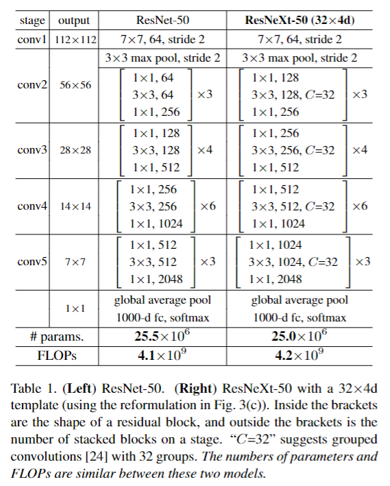
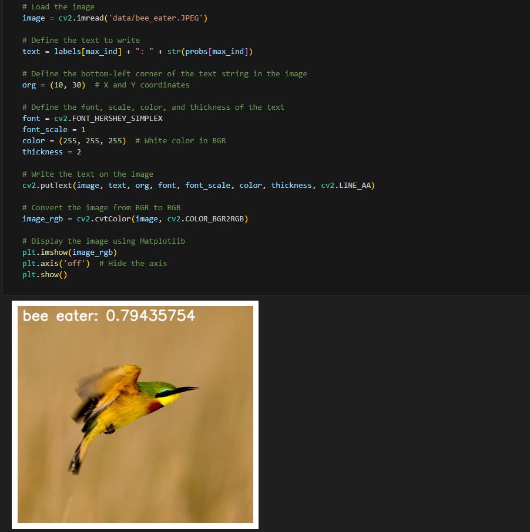

[English](./README.md) | 简体中文

# CNN X5 - ResNeXt

- [CNN X5 - ResNeXt](#cnn-x5---resnext)
  - [1. 简介](#1-简介)
  - [2. 模型性能数据](#2-模型性能数据)
  - [3. 模型下载](#3-模型下载)
  - [4. 部署测试](#4-部署测试)
  - [5. 量化实验](#5-量化实验)

## 1. 简介

- **论文地址**: [Aggregated Residual Transformations for Deep Neural Networks](https://arxiv.org/abs/1611.05431)

- **Github 仓库**: [facebookresearch/ResNeXt: Implementation of a classification framework from the paper Aggregated Residual Transformations for Deep Neural Networks (github.com)](https://github.com/facebookresearch/ResNeXt)

ResNeXt 提出了一个简单架构，采用 VGG/ResNets 重复相同网络层的策略，以一种简单可扩展的方式延续 Split-Transform-Merge 策略。将ResNet中高维特征图分组为多个相同的低维特征图，然后在卷积操作之后，将多组结构进行求和，最后得到ResNeXt模型。

ResNeXt 的关键特点在于引入了“卡片结构”（cardinality）的概念。ResNeXt 模块可以看作是多个独立的路径（即多个并行的卷积通道）的组合。相比于 ResNet 直接增加网络的深度和宽度，ResNeXt 通过增加这些并行路径的数量来提高模型的表达能力



表1.（左）ResNet-50。（右）带有32×4d模板的ResNeXt-50（使用图3（c）中的重新格式）。括号内是残留块的形状，括号外是舞台上堆叠的块的数量。“C = 32” 建议将卷积[24]分为32组。这两个模型之间的参数和FLOP数量相似。


**ResNeXt50_32x4d 模型特点**：

- **卡片结构** (Cardinality)：这是 ResNeXt 的核心创新点。卡片数指的是并行路径的数量。增加卡片数可以在不显著增加参数和计算量的前提下提高网络的性能。
- **组卷积** (Grouped Convolution)：ResNeXt 使用了组卷积，多个组内的卷积操作相互独立，这使得网络结构在计算效率和准确率之间达到了更好的平衡。
- **模块化设计**：ResNeXt 的模块设计非常简洁，每个模块由多个并行路径组成，这些路径共享相同的超参数，比如卷积核大小、步幅等。


## 2. 模型性能数据

以下表格是在 RDK X5 & RDK X5 Module 上实际测试得到的性能数据


| 模型          | 尺寸(像素)  | 类别数  | 参数量(M) | 浮点Top-1  | 量化Top-1  | 延迟/吞吐量(单线程) | 延迟/吞吐量(多线程) | 帧率     |
| ----------- | ------- | ---- | ------ | ----- | ----- | ----------- | ----------- | ------ |
| ResNeXt50_32x4d  | 224x224 | 1000 | 24.99  | 76.25 | 76.00 | 5.89   | 20.90       | 189.61 |


说明: 
1. X5的状态为最佳状态：CPU为8xA55@1.8G, 全核心Performance调度, BPU为1xBayes-e@1G, 共10TOPS等效int8算力。
2. 单线程延迟为单帧，单线程，单BPU核心的延迟，BPU推理一个任务最理想的情况。
3. 4线程工程帧率为4个线程同时向双核心BPU塞任务，一般工程中4个线程可以控制单帧延迟较小，同时吃满所有BPU到100%，在吞吐量(FPS)和帧延迟间得到一个较好的平衡。
4. 8线程极限帧率为8个线程同时向X3的双核心BPU塞任务，目的是为了测试BPU的极限性能，一般来说4核心已经占满，如果8线程比4线程还要好很多，说明模型结构需要提高"计算/访存"比，或者编译时选择优化DDR带宽。
5. 浮点/定点Top-1：浮点Top-1使用的是模型未量化前onnx的 Top-1 推理精度，量化Top-1则为量化后模型实际推理的精度。

## 3. 模型下载

**.bin 文件下载**：

进入model文件夹，使用以下命令行中对 ResNeXt50_32x4d 模型进行下载：

```shell
wget https://archive.d-robotics.cc/downloads/rdk_model_zoo/rdk_x5/ResNeXt50_32x4d_224x224_nv12.bin
```

**ONNX文件下载**：

onnx 模型使用的是 timm 库 (PyTorch Image Models) 中的模型进行转换的，使用以下命令安装所需要的包：

```shell
pip install timm onnx
```

模型转换以 resnext50_32x4d 为例：

```Python
import torch
import torch.onnx
import onnx
from onnxsim import simplify
from timm.models import create_model

from timm.models.resnet import resnext50_32x4d

def count_parameters(onnx_model_path):
    # Load the ONNX model
    model = onnx.load(onnx_model_path)
    # Get the initializers (weights in the model)
    initializer = model.graph.initializer
    
    # Calculate the total number of parameters
    total_params = 0
    for tensor in initializer:
        # Get the dimensions of each weight
        dims = tensor.dims
        # Calculate the number of parameters in this weight (product of all dimensions)
        params = 1
        for dim in dims:
            params *= dim
        total_params += params
    
    return total_params

if __name__ == "__main__":
    device = torch.device("cuda" if torch.cuda.is_available() else "cpu")
    model = create_model('resnext50_32x4d', pretrained=True)
    model.eval()

    # print the model structure

    dummy_input = torch.randn(1, 3, 224, 224, device="cpu")
    onnx_file_path = "resnext50_32x4d.onnx"

    torch.onnx.export(
        model,
        dummy_input,
        onnx_file_path,
        opset_version=11,
        verbose=True,
        input_names=["data"],  # Input name
        output_names=["output"],  # Output name
    )
    
    # Simplify the ONNX model
    model_simp, check = simplify(onnx_file_path)

    if check:
        print("Simplified model is valid.")
        simplified_onnx_file_path = "resnext50_32x4d.onnx"
        onnx.save(model_simp, simplified_onnx_file_path)
        print(f"Simplified model saved to {simplified_onnx_file_path}")
    else:
        print("Simplified model is invalid!")
        
    onnx_model_path = simplified_onnx_file_path  # Replace with your ONNX model path
    total_params = count_parameters(onnx_model_path)
    print(f"Total number of parameters in the model: {total_params}")
```

## 4. 部署测试

在下载完毕 .bin 文件后，可以执行 test_ResNeXt50_32x4d.ipynb ResNeXt50_32x4d 模型 jupyter 脚本文件，在板端实际运行体验实际测试效果。需要更改测试图片，可额外下载数据集后，放入到data文件夹下并更改 jupyter 文件中图片的路径



## 5. 量化实验

若想要进一步进阶对模型量化过程中的学习，如选取量化精度、对模型节点进行取舍、模型输入输出格式配置等，可以按顺序在天工开物工具链（注意是在pc端，不是板端）中执行 mapper 文件夹下的shell文件，对模型进行量化调优。这里仅仅给出 yaml 的配置文件（在yaml文件夹中），如需进行量化实验可将对应不同大小模型的yaml文件自行替换