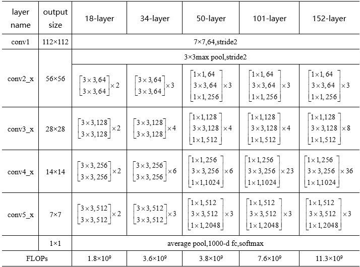
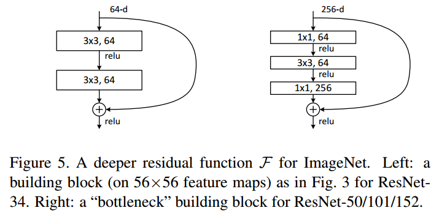
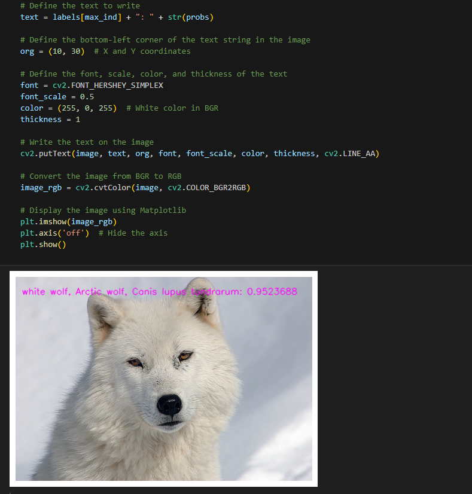

[English](./README.md) | 简体中文

# CNN - ResNet

- [CNN - ResNet](#cnn---resnet)
  - [1. 简介](#1-简介)
  - [2. 模型性能数据](#2-模型性能数据)
  - [3. 模型下载](#3-模型下载)
  - [4. 部署测试](#4-部署测试)

## 1. 简介

- **论文地址**: [Deep Residual Learning for Image Recognition](http://arxiv.org/abs/2307.09283)

- **Github 仓库**: [vision/resnet.py at main · pytorch/vision (github.com)](https://github.com/pytorch/vision/blob/main/torchvision/models/resnet.py)


`ResNet`是由微软研究院的何恺明、张祥雨、任少卿、孙剑等人提出的，并在`2015`年的ILSVRC（ImageNet Large Scale Visual Recognition Challenge）中取得了冠军，在top5上的错误率为3.57%，同时参数量比VGGNet低，效果非常突出，是卷积神经网络图像史上的一件里程碑事件。作者何凯明也因此摘得`CVPR2016`最佳论文奖。

`ResNet`的主要贡献是发现了**退化现象（Degradation）**，并针对退化现象使用**快捷连接（Shortcut connection）**，极大的消除了深度过大的神经网络训练困难问题，并使**神经网络的“深度”首次突破了100层、最大的神经网络甚至超过了1000层**。`ResNet`的结构可以**极快的加速神经网络的训练**，模型的准确率也有比较大的提升。同时`ResNet`的推广性非常好，甚至可以直接用到`InceptionNet`网络中。

`ResNet` 网络是参考了 `VGG19` 网络，在其基础上进行了修改，并通过快捷连接加入了残差单元。变化主要体现在 `ResNet` 直接使用步长=2的卷积做下采样，并且用全局平均池化层替换了全连接层。`ResNet` 的一个重要设计原则是：**当特征映射大小降低一半时，特征映射的数量增加一倍，这保持了网络层的复杂度**。从图中可以看到，`ResNet` 相比普通网络每两层间增加了短路机制，这就形成了残差学习，其中虚线表示特征映射数量发生了改变。图展示的34层的ResNet，还可以构建更深的网络如表所示。从表中可以看到，对于18层和34层的 `ResNet` ,其进行的两层间的残差学习，当网络更深时，其进行的是三层间的残差学习，三层卷积核分别是 `1x1` 、`3x3` 和 `1x1` ，一个值得注意的是隐含层的特征映射数量是比较小的，并且是输出特征映射数量的1/4。





**ResNet 模型特点**：

- 残差结构人为构造了恒等映射，就能让整个结构朝着恒等映射的方向去收敛，确保最终的错误率不会因为深度的变大而越来越大 
- ResNet的动机在于解决“退化”问题，残差块的设计让学习恒等映射变得容易，即使堆叠了过量的block，ResNet可以让冗余的block学习成恒等映射，性能也不会下降。 
- 网络的“实际深度”是在训练过程中决定的，即ResNet具有某种深度自适应的能力


## 2. 模型性能数据

以下表格是在 RDK X3 & RDK X3 Module 上实际测试得到的性能数据


| 模型          | 尺寸(像素)  | 类别数  | 参数量(M) | 浮点Top-1  | 量化Top-1  | 延迟/吞吐量(单线程) | 延迟/吞吐量(多线程) | 帧率     |
| ----------- | ------- | ---- | ------ | ----- | ----- | ----------- | ----------- | ------ |
| ResNet18 | 224x224 | 1000 | 11.2    | 71.49 | 70.50 | 8.87        | 17.07        | 232.74 |


说明: 
1. X3的状态为最佳状态：CPU为4xA53@1.5G, 全核心Performance调度, BPU为2xBernoulli@1G, 共5TOPS等效int8算力。
2. 单线程延迟为单帧，单线程，单BPU核心的延迟，BPU推理一个任务最理想的情况。
3. 4线程工程帧率为4个线程同时向双核心BPU塞任务，一般工程中4个线程可以控制单帧延迟较小，同时吃满所有BPU到100%，在吞吐量(FPS)和帧延迟间得到一个较好的平衡。
4. 8线程极限帧率为8个线程同时向X3的双核心BPU塞任务，目的是为了测试BPU的极限性能，一般来说4核心已经占满，如果8线程比4线程还要好很多，说明模型结构需要提高"计算/访存"比，或者编译时选择优化DDR带宽。
5. 浮点/定点Top-1：浮点Top-1使用的是模型未量化前onnx的 Top-1 推理精度，量化Top-1则为量化后模型实际推理的精度。

## 3. 模型下载

**.bin 文件下载**：

进入model文件夹，使用以下命令行中对 ResNet18 模型进行下载：

```shell
wget https://archive.d-robotics.cc/downloads/rdk_model_zoo/rdk_x3/resnet18_224x224_nv12.bin
```

由于此模型是由地平线参考算法进行模型量化后得到的产出物，故该模型不提供 onnx 格式文件。若需要 ResNet 模型量化转换，可以参考本仓库其他模型的转换步骤。

## 4. 部署测试

在下载完毕 .bin 文件后，可以执行 test_ResNet18.ipynb ResNet 模型 jupyter 脚本文件，在板端实际运行体验实际测试效果。需要更改测试图片，可额外下载数据集后，放入到data文件夹下并更改 jupyter 文件中图片的路径



