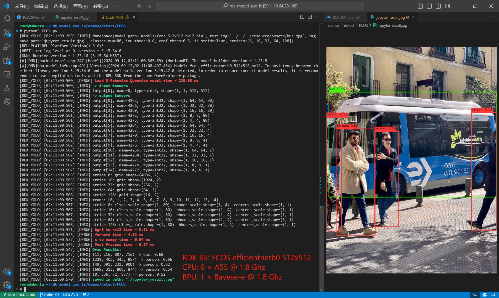

# FCOS
- [FCOS](#fcos)
  - [Introduction to FCOS](#introduction-to-fcos)
  - [Performance Data (in brief)](#performance-data-in-brief)
    - [RDK X5 \& RDK X5 Module](#rdk-x5--rdk-x5-module)
    - [RDK X3 \& RDK X3 Module](#rdk-x3--rdk-x3-module)
  - [Model training and export](#model-training-and-export)
    - [Visualizing the bin model with hb\_perf](#visualizing-the-bin-model-with-hb_perf)
      - [Bayes-e: RDK X5 \& RDK X5 Module](#bayes-e-rdk-x5--rdk-x5-module)
      - [Bernoulli2: RDK X3 \& RDK X3 Module](#bernoulli2-rdk-x3--rdk-x3-module)
    - [Inspecting bin model inputs and outputs with hrt\_model\_exec](#inspecting-bin-model-inputs-and-outputs-with-hrt_model_exec)
  - [Performance data](#performance-data)
    - [RDK X5 \& RDK X5 Module](#rdk-x5--rdk-x5-module-1)
    - [RDK X3 \& RDK X3 Module](#rdk-x3--rdk-x3-module-1)
  - [References](#references)


## Introduction to FCOS


FCOS is a classical one-stage anchor-free object detection algorithm, which does not need to generate anchors in advance.

Paper: Fully Convolutional One-Stage Object Detection
The thesis links: https://arxiv.org/pdf/1904.01355.pdf
Code link: https://github.com/tianzhi0549/FCOS

## Performance Data (in brief)
### RDK X5 & RDK X5 Module

Object Detection (COCO)
| model (public) | size (pixels) | number of classes | number of parameters | BPU throughput | post-processing time (Python) |
|---------|---------|-------|---------|---------|----------|
| fcos_efficientnetb0 | 512×512 | 80 | - | 323.0 FPS | 9 ms |
| fcos_efficientnetb2 | 768×768 | 80 | - | 70.9 FPS | 16 ms |
| fcos_efficientnetb3 | 896×896 | 80 | - | 38.7 FPS | 20 ms |

### RDK X3 & RDK X3 Module
Object Detection (COCO)
| model (public) | size (pixels) | number of classes | number of parameters | BPU throughput | post-processing time (Python) |
|---------|---------|-------|---------|---------|----------|
| fcos | 512×512 | 80 | - | 173.9 FPS | 5 ms |

## Model training and export
See HAT chart platform for toolchain Docker.

### Visualizing the bin model with hb_perf
#### Bayes-e: RDK X5 & RDK X5 Module
```bash
hb_perf fcos_efficientnetb0_512x512_nv12.bin
```
The following results can be found in the 'hb_perf_result' directory:
! [](imgs/fcos_efficientnetb0_512x512_nv12.png)


```bash
hb_perf fcos_efficientnetb2_768x768_nv12.bin
```
The following results can be found in the 'hb_perf_result' directory:
! [](imgs/fcos_efficientnetb2_768x768_nv12.png)


```bash
hb_perf fcos_efficientnetb3_896x896_nv12.bin
```
The following results can be found in the 'hb_perf_result' directory:
! [](imgs/fcos_efficientnetb3_896x896_nv12.png)

#### Bernoulli2: RDK X3 & RDK X3 Module
```bash
hb_perf fcos_512x512_nv12.bin
```
The following results can be found in the 'hb_perf_result' directory:
! [](imgs/fcos_512x512_nv12.png)

Note: In the bin model of X5, all the inverse quantization nodes are removed, so this part of the calculation will be in the post-processing, so the post-processing time is longer than X3. But overall, this part of the inverse quantization calculation can be traversal calculation, screening calculation, shortening the overall end-to-end delay and calculation, saving CPU occupation.

### Inspecting bin model inputs and outputs with hrt_model_exec
References:
```bash
hrt_model_exec model_info --model_file fcos_512x512_nv12.bin
```
Output:
slightly


## Performance data

### RDK X5 & RDK X5 Module
Object Detection (COCO)
| Model | size (pixels) | number of classes | BPU latency /BPU throughput (threads) | post-processing time (Python) |
|---------|---------|-------|------------------------|--------------------|
| fcos_efficientnetb0 | 512×512 | 80 |  3.3 ms / 298.0 FPS (1 thread) <br/> 6.2 ms / 323.0 FPS (2 threads) | 9 ms |
| fcos_efficientnetb2 | 768×768 | 80 | 14.4 ms / 69.5 FPS (1 thread) <br/> 28.1 ms / 70.9 FPS (2 threads) | 16 ms |
| fcos_efficientnetb3 | 896×896 | 80 |  26.1 ms / 38.2 FPS (1 thread) <br/> 51.6 ms / 38.7 FPS (2 threads) | 20 ms |

### RDK X3 & RDK X3 Module
Object Detection (COCO)
| Model | size (pixels) | number of classes | BPU latency /BPU throughput (threads) | post-processing time (Python) |
|---------|---------|-------|------------------------|--------------------|
| fcos | 512×512 | 80 |  13.1 ms / 76.5 FPS (1 thread) <br/> 13.6 ms / 146.6 FPS (2 threads) <br/> 17.2 ms / 173.9 FPS (3 threads) | 5 ms |


## References

[article on target detection: read FCOS CVPR (2019)](https://blog.csdn.net/weixin_46142822/article/details/123958529)