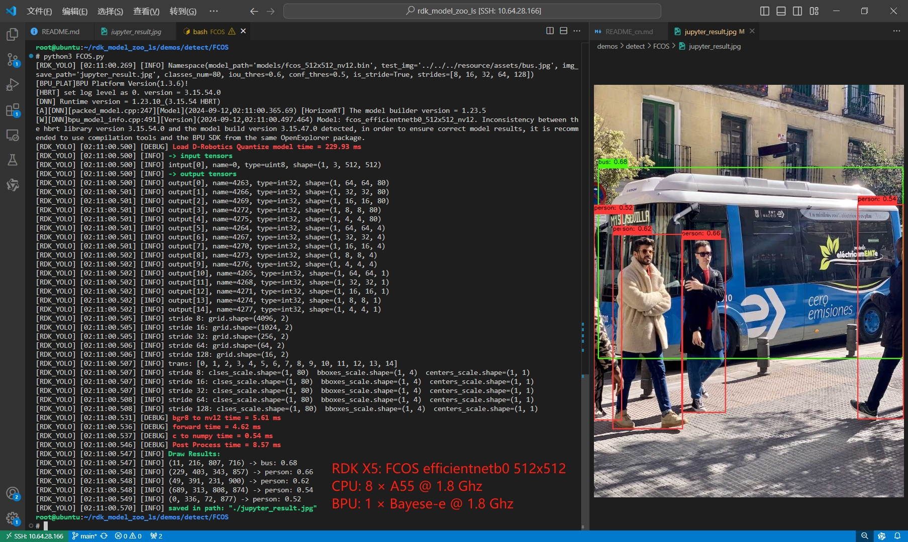

# FCOS
- [FCOS](#fcos)
  - [FCOS介绍](#fcos介绍)
  - [性能数据(简要)](#性能数据简要)
    - [RDK X5 \& RDK X5 Module](#rdk-x5--rdk-x5-module)
    - [RDK X3 \& RDK X3 Module](#rdk-x3--rdk-x3-module)
  - [模型训练和导出](#模型训练和导出)
    - [使用hb\_perf 对bin模型进行可视化](#使用hb_perf-对bin模型进行可视化)
      - [Bayes-e: RDK X5 \& RDK X5 Module](#bayes-e-rdk-x5--rdk-x5-module)
      - [Bernoulli2: RDK X3 \& RDK X3 Module](#bernoulli2-rdk-x3--rdk-x3-module)
    - [使用hrt\_model\_exec命令检查bin模型的输入输出情况](#使用hrt_model_exec命令检查bin模型的输入输出情况)
  - [性能数据](#性能数据)
    - [RDK X5 \& RDK X5 Module](#rdk-x5--rdk-x5-module-1)
    - [RDK X3 \& RDK X3 Module](#rdk-x3--rdk-x3-module-1)
  - [参考](#参考)


## FCOS介绍



FCOS 是anchor-free的目标检测经典单阶段的 anchor-free 目标检测算法，无需事先生成anchor.

论文：Fully Convolutional One-Stage Object Detection
论文链接：https://arxiv.org/pdf/1904.01355.pdf
代码链接：https://github.com/tianzhi0549/FCOS


## 性能数据(简要)
### RDK X5 & RDK X5 Module

目标检测 Detection (COCO)
| 模型(公版) | 尺寸(像素) | 类别数 | 参数量 | BPU吞吐量 | 后处理时间(Python) |
|---------|---------|-------|---------|---------|----------|
| fcos_efficientnetb0 | 512×512 | 80 | - | 323.0 FPS | 9 ms |
| fcos_efficientnetb2 | 768×768 | 80 | - | 70.9 FPS | 16 ms |
| fcos_efficientnetb3 | 896×896 | 80 | - | 38.7 FPS | 20 ms |

### RDK X3 & RDK X3 Module
| 模型(公版) | 尺寸(像素) | 类别数 | 参数量 | BPU吞吐量 | 后处理时间(Python) |
|---------|---------|-------|---------|---------|----------|
| fcos | 512×512 | 80 | - | 173.9 FPS | 5 ms |

## 模型训练和导出
请参考工具链Docker的HAT海图平台。

### 使用hb_perf 对bin模型进行可视化
#### Bayes-e: RDK X5 & RDK X5 Module
```bash
hb_perf fcos_efficientnetb0_512x512_nv12.bin
```
在`hb_perf_result`目录下可以找到以下结果：


```bash
hb_perf fcos_efficientnetb2_768x768_nv12.bin
```
在`hb_perf_result`目录下可以找到以下结果：


```bash
hb_perf fcos_efficientnetb3_896x896_nv12.bin
```
在`hb_perf_result`目录下可以找到以下结果：


#### Bernoulli2: RDK X3 & RDK X3 Module
```bash
hb_perf fcos_512x512_nv12.bin
```
在`hb_perf_result`目录下可以找到以下结果：


注: 在X5的bin模型中, 移除了所有的反量化节点, 所以这部分的计算会在后处理中, 所以后处理时间比X3长. 但是整体来看, 这部分反量化的计算可以一起遍历计算, 筛选计算, 缩短了整体的端到端延迟和计算量, 节约了CPU占用.

### 使用hrt_model_exec命令检查bin模型的输入输出情况
参考: 
```bash
hrt_model_exec model_info --model_file fcos_512x512_nv12.bin
```
输出结果:
略


## 性能数据

### RDK X5 & RDK X5 Module
目标检测 Detection (COCO)
| 模型 | 尺寸(像素) | 类别数 | BPU延迟/BPU吞吐量(线程) | 后处理时间(Python) |
|---------|---------|-------|------------------------|--------------------|
| fcos_efficientnetb0 | 512×512 | 80 |  3.3 ms / 298.0 FPS (1 thread) <br/> 6.2 ms / 323.0 FPS (2 threads) | 9 ms |
| fcos_efficientnetb2 | 768×768 | 80 | 14.4 ms / 69.5 FPS (1 thread) <br/> 28.1 ms / 70.9 FPS (2 threads) | 16 ms |
| fcos_efficientnetb3 | 896×896 | 80 |  26.1 ms / 38.2 FPS (1 thread) <br/> 51.6 ms / 38.7 FPS (2 threads) | 20 ms |

### RDK X3 & RDK X3 Module
目标检测 Detection (COCO)
| 模型 | 尺寸(像素) | 类别数 | BPU延迟/BPU吞吐量(线程) | 后处理时间(Python) |
|---------|---------|-------|------------------------|--------------------|
| fcos | 512×512 | 80 |  13.1 ms / 76.5 FPS (1 thread) <br/> 13.6 ms / 146.6 FPS (2 threads) <br/> 17.2 ms / 173.9 FPS (3 threads) | 5 ms |

说明: 
1. BPU延迟与BPU吞吐量。
 - 单线程延迟为单帧,单线程,单BPU核心的延迟,BPU推理一个任务最理想的情况。
 - 多线程帧率为多个线程同时向BPU塞任务, 每个BPU核心可以处理多个线程的任务, 一般工程中4个线程可以控制单帧延迟较小,同时吃满所有BPU到100%,在吞吐量(FPS)和帧延迟间得到一个较好的平衡。X5的BPU整体比较厉害, 一般2个线程就可以将BPU吃满, 帧延迟和吞吐量都非常出色。
 - 表格中一般记录到吞吐量不再随线程数明显增加的数据。
 - BPU延迟和BPU吞吐量使用以下命令在板端测试
```bash
hrt_model_exec perf --thread_num 2 --model_file yolov8n_detect_bayese_640x640_nv12_modified.bin
```
1. 测试板卡均为最佳状态。
 - X5的状态为最佳状态：CPU为8 × A55@1.8G, 全核心Performance调度, BPU为1 × Bayes-e@10TOPS.
```bash
sudo bash -c "echo 1 > /sys/devices/system/cpu/cpufreq/boost"  # 1.8Ghz
sudo bash -c "echo performance > /sys/devices/system/cpu/cpufreq/policy0/scaling_governor" # Performance Mode
```
 - X3的状态为最佳状态：CPU为4 × A53@1.8G, 全核心Performance调度, BPU为2 × Bernoulli2@5TOPS.
```bash
sudo bash -c "echo 1 > /sys/devices/system/cpu/cpufreq/boost"  # 1.8Ghz
sudo bash -c "echo performance > /sys/devices/system/cpu/cpufreq/policy0/scaling_governor" # Performance Mode
```
3. 浮点/定点mAP：50-95精度使用pycocotools计算,来自于COCO数据集,可以参考微软的论文,此处用于评估板端部署的精度下降程度。
4. 关于后处理: 目前在X5上使用Python重构的后处理, 仅需要单核心单线程串行10ms左右即可完成, 也就是说只需要占用2个CPU核心(200%的CPU占用, 最大800%的CPU占用), 每分钟可完成200帧图像的后处理, 后处理不会构成瓶颈.

## 参考

[目标检测: 一文读懂 FCOS (CVPR 2019)](https://blog.csdn.net/weixin_46142822/article/details/123958529)