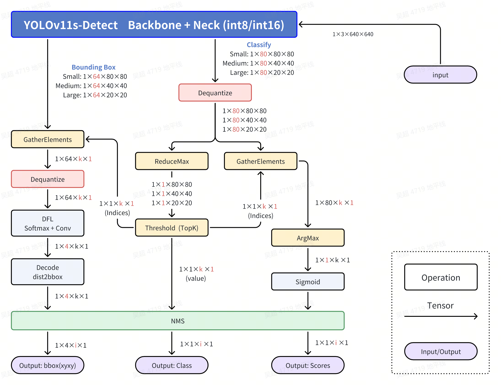

[English](./README.md) | 简体中文

# YOLOv11 Detect
- [YOLOv11 Detect](#yolov11-detect)
  - [YOLO介绍](#yolo介绍)
  - [公版处理流程](#公版处理流程)
  - [优化处理流程](#优化处理流程)
  - [步骤参考](#步骤参考)
    - [环境、项目准备](#环境项目准备)
    - [导出为onnx](#导出为onnx)
    - [准备校准数据](#准备校准数据)
    - [PTQ方案量化转化](#ptq方案量化转化)
    - [移除bbox信息3个输出头的反量化节点](#移除bbox信息3个输出头的反量化节点)
    - [使用hb\_perf命令对bin模型进行可视化, hrt\_model\_exec命令检查bin模型的输入输出情况](#使用hb_perf命令对bin模型进行可视化-hrt_model_exec命令检查bin模型的输入输出情况)
  - [使用TROS高效部署YOLO11](#使用tros高效部署yolo11)
    - [安装或更新tros-humble-hobot-dnn等功能包](#安装或更新tros-humble-hobot-dnn等功能包)
    - [拷贝tros-humble-hobot-dnn 的配置文件](#拷贝tros-humble-hobot-dnn-的配置文件)
    - [运行YOLOv8的推理节点](#运行yolov8的推理节点)
  - [部分编译日志参考](#部分编译日志参考)
  - [模型训练](#模型训练)
  - [性能数据](#性能数据)
    - [RDK Ultra \& RDK Ultra Module](#rdk-ultra--rdk-ultra-module)
    - [RDK X5 \& RDK X5 Module](#rdk-x5--rdk-x5-module)
    - [测试方法](#测试方法)
  - [精度数据](#精度数据)
    - [RDK X5 \& RDK X5 Module](#rdk-x5--rdk-x5-module-1)
    - [测试方法](#测试方法-1)
  - [反馈](#反馈)
  - [参考](#参考)


## YOLO介绍


YOLO(You Only Look Once)是一种流行的物体检测和图像分割模型，由华盛顿大学的约瑟夫-雷德蒙（Joseph Redmon）和阿里-法哈迪（Ali Farhadi）开发。YOLO 于 2015 年推出，因其高速度和高精确度而迅速受到欢迎。

 - 2016 年发布的YOLOv2 通过纳入批量归一化、锚框和维度集群改进了原始模型。
2018 年推出的YOLOv3 使用更高效的骨干网络、多锚和空间金字塔池进一步增强了模型的性能。
 - YOLOv4于 2020 年发布，引入了 Mosaic 数据增强、新的无锚检测头和新的损失函数等创新技术。
 - YOLOv5进一步提高了模型的性能，并增加了超参数优化、集成实验跟踪和自动导出为常用导出格式等新功能。
 - YOLOv6于 2022 年由美团开源，目前已用于该公司的许多自主配送机器人。
 - YOLOv7增加了额外的任务，如 COCO 关键点数据集的姿势估计。
 - YOLOv8是YOLO 的最新版本，由Ultralytics 提供。YOLOv8 YOLOv8 支持全方位的视觉 AI 任务，包括检测、分割、姿态估计、跟踪和分类。这种多功能性使用户能够在各种应用和领域中利用YOLOv8 的功能。
 - YOLOv9 引入了可编程梯度信息(PGI) 和广义高效层聚合网络(GELAN)等创新方法。
 - YOLOv10是由清华大学的研究人员使用该软件包创建的。 UltralyticsPython 软件包创建的。该版本通过引入端到端头(End-to-End head),消除了非最大抑制(NMS)要求，实现了实时目标检测的进步。
 - YOLO11 NEW 🚀：Ultralytics的最新YOLO模型在多个任务上实现了最先进的（SOTA）性能。


## 公版处理流程


## 优化处理流程


公版处理流程中，是会对8400个bbox完全计算分数，类别和xyxy坐标，这样才能根据GT去计算损失函数。但是我们在部署中，只需要合格的bbox就好了，并不需要对8400个bbox完全计算。
优化处理流程中，主要就是利用Sigmoid函数单调性做到了先筛选，再计算。同时利用Python的numpy的高级索引，对DFL和特征解码的部分也做到了先筛选，再计算，节约了大量的计算，从而后处理在CPU上，利用numpy，可以做到单核单帧单线程5毫秒。

 - Classify部分,Dequantize操作
在模型编译时,如果选择了移除所有的反量化算子,这里需要在后处理中手动对Classify部分的三个输出头进行反量化。查看反量化系数的方式有多种,可以查看`hb_mapper`时产物的日志,也可通过BPU推理接口的API来获取。
注意,这里每一个C维度的反量化系数都是不同的,每个头都有80个反量化系数,可以使用numpy的广播直接乘。
此处反量化在bin模型中实现,所以拿到的输出是float32的。

 - Classify部分,ReduceMax操作
ReduceMax操作是沿着Tensor的某一个维度找到最大值,此操作用于找到8400个Grid Cell的80个分数的最大值。操作对象是每个Grid Cell的80类别的值,在C维度操作。注意,这步操作给出的是最大值,并不是80个值中最大值的索引。
激活函数Sigmoid具有单调性,所以Sigmoid作用前的80个分数的大小关系和Sigmoid作用后的80个分数的大小关系不会改变。
$$Sigmoid(x)=\frac{1}{1+e^{-x}}$$
$$Sigmoid(x_1) > Sigmoid(x_2) \Leftrightarrow x_1 > x_2$$
综上,bin模型直接输出的最大值(反量化完成)的位置就是最终分数最大值的位置,bin模型输出的最大值经过Sigmoid计算后就是原来onnx模型的最大值。

 - Classify部分,Threshold（TopK）操作
此操作用于找到8400个Grid Cell中,符合要求的Grid Cell。操作对象为8400个Grid Cell,在H和W的维度操作。如果您有阅读我的程序,你会发现我将后面H和W维度拉平了,这样只是为了程序设计和书面表达的方便,它们并没有本质上的不同。
我们假设某一个Grid Cell的某一个类别的分数记为$x$,激活函数作用完的整型数据为$y$,阈值筛选的过程会给定一个阈值,记为$C$,那么此分数合格的**充分必要条件**为：

$$y=Sigmoid(x)=\frac{1}{1+e^{-x}}>C$$

由此可以得出此分数合格的**充分必要条件**为：

$$x > -ln\left(\frac{1}{C}-1\right)$$

此操作会符合条件的Grid Cell的索引（indices）和对应Grid Cell的最大值,这个最大值经过Sigmoid计算后就是这个Grid Cell对应类别的分数了。

 - Classify部分,GatherElements操作和ArgMax操作
使用Threshold(TopK)操作得到的符合条件的Grid Cell的索引(indices),在GatherElements操作中获得符合条件的Grid Cell,使用ArgMax操作得到具体是80个类别中哪一个最大,得到这个符合条件的Grid Cell的类别。

 - Bounding Box部分,GatherElements操作和Dequantize操作
使用Threshold(TopK)操作得到的符合条件的Grid Cell的索引(indices),在GatherElements操作中获得符合条件的Grid Cell,这里每一个C维度的反量化系数都是不同的,每个头都有64个反量化系数,可以使用numpy的广播直接乘,得到1×64×k×1的bbox信息。

 - Bounding Box部分,DFL：SoftMax+Conv操作
每一个Grid Cell会有4个数字来确定这个框框的位置,DFL结构会对每个框的某条边基于anchor的位置给出16个估计,对16个估计求SoftMax,然后通过一个卷积操作来求期望,这也是Anchor Free的核心设计,即每个Grid Cell仅仅负责预测1个Bounding box。假设在对某一条边偏移量的预测中,这16个数字为 $ l_p $ 或者$(t_p, t_p, b_p)$,其中$p = 0,1,...,15$那么偏移量的计算公式为：

$$\hat{l} = \sum_{p=0}^{15}{\frac{p·e^{l_p}}{S}}, S =\sum_{p=0}^{15}{e^{l_p}}$$

 - Bounding Box部分,Decode：dist2bbox(ltrb2xyxy)操作
此操作将每个Bounding Box的ltrb描述解码为xyxy描述,ltrb分别表示左上右下四条边距离相对于Grid Cell中心的距离,相对位置还原成绝对位置后,再乘以对应特征层的采样倍数,即可还原成xyxy坐标,xyxy表示Bounding Box的左上角和右下角两个点坐标的预测值。


图片输入为$Size=640$,对于Bounding box预测分支的第$i$个特征图$(i=1, 2, 3)$,对应的下采样倍数记为$Stride(i)$,在YOLOv8 - Detect中,$Stride(1)=8, Stride(2)=16, Stride(3)=32$,对应特征图的尺寸记为$n_i = {Size}/{Stride(i)}$,即尺寸为$n_1 = 80, n_2 = 40 ,n_3 = 20$三个特征图,一共有$n_1^2+n_2^2+n_3^3=8400$个Grid Cell,负责预测8400个Bounding Box。
对特征图i,第x行y列负责预测对应尺度Bounding Box的检测框,其中$x,y \in [0, n_i)\bigcap{Z}$,$Z$为整数的集合。DFL结构后的Bounding Box检测框描述为$ltrb$描述,而我们需要的是$xyxy$描述,具体的转化关系如下：

$$x_1 = (x+0.5-l)\times{Stride(i)}$$

$$y_1 = (y+0.5-t)\times{Stride(i)}$$

$$x_2 = (x+0.5+r)\times{Stride(i)}$$

$$y_1 = (y+0.5+b)\times{Stride(i)}$$

YOLOv8,v9,v11,会有一个nms操作去去掉重复识别的目标,YOLOv10不需要。最终的检测结果了,包括类别(id),分数(score)和位置(xyxy)。


## 步骤参考

注：任何No such file or directory, No module named "xxx", command not found.等报错请仔细检查，请勿逐条复制运行，如果对修改过程不理解请前往开发者社区从YOLOv5开始了解。
### 环境、项目准备
 - 下载ultralytics/ultralytics仓库，并参考ultralytics官方文档，配置好环境
```bash
git clone https://github.com/ultralytics/ultralytics.git
```
 - 进入本地仓库，下载官方的预训练权重，这里以260万参数的YOLO11n-Detect模型为例
```bash
cd ultralytics
wget https://github.com/ultralytics/assets/releases/download/v8.3.0/yolo11n.pt
```

### 导出为onnx
 - 卸载yolo相关的命令行命令，这样直接修改`./ultralytics/ultralytics`目录即可生效。
```bash
$ conda list | grep ultralytics
$ pip list | grep ultralytics # 或者
# 如果存在，则卸载
$ conda uninstall ultralytics 
$ pip uninstall ultralytics   # 或者
```
如果不是很顺利，可以通过以下Python命令确认需要修改的`ultralytics`目录的位置:
```bash
>>> import ultralytics
>>> ultralytics.__path__
['/home/wuchao/miniconda3/envs/yolo/lib/python3.11/site-packages/ultralytics']
# 或者
['/home/wuchao/YOLO11/ultralytics_v11/ultralytics']
```
 - 修改优化后的Attntion模块
文件目录：`ultralytics/nn/modules/block.py`, 约第868行, `Attntion`类的`forward`方法替换成以下内容. 主要的优化点是去除了一些无用的数据搬运操作，同时将Reduce的维度变为C维度，对BPU更加友好, 目前可以将BPU吞吐量翻倍, 并且不需要重新训练模型.
注：建议您保留好原本的`forward`方法,例如改一个其他的名字`forward_`, 方便在训练的时候换回来。
```python
class Attention(nn.Module):   # RDK
        print(f"{x.shape = }")
        B, C, H, W = x.shape
        N = H * W
        qkv = self.qkv(x)
        q, k, v = qkv.view(B, self.num_heads, self.key_dim * 2 + self.head_dim, N).split(
            [self.key_dim, self.key_dim, self.head_dim], dim=2
        )
        attn = (q.transpose(-2, -1) @ k) * self.scale
        attn = attn.permute(0, 3, 1, 2).contiguous()  # CHW2HWC like
        max_attn = attn.max(dim=1, keepdim=True).values 
        exp_attn = torch.exp(attn - max_attn)
        sum_attn = exp_attn.sum(dim=1, keepdim=True)
        attn = exp_attn / sum_attn
        attn = attn.permute(0, 2, 3, 1).contiguous()  # HWC2CHW like
        x = (v @ attn.transpose(-2, -1)).view(B, C, H, W) + self.pe(v.reshape(B, C, H, W))
        x = self.proj(x)
        return x
```

 - 修改Detect的输出头，直接将三个特征层的Bounding Box信息和Classify信息分开输出，一共6个输出头。

文件目录：./ultralytics/ultralytics/nn/modules/head.py，约第58行，`Detect`类的forward方法替换成以下内容.
注：建议您保留好原本的`forward`方法，例如改一个其他的名字`forward_`, 方便在训练的时候换回来。
```python
def forward(self, x):
    result = []
    for i in range(self.nl):
        result.append(self.cv3[i](x[i]).permute(0, 2, 3, 1).contiguous())
        result.append(self.cv2[i](x[i]).permute(0, 2, 3, 1).contiguous())
    return result

## 如果输出头顺序刚好是bbox和cls反的, 可以使用如下修改方式, 调换cv2和cv3的append顺序
## 然后再重新导出onnx, 编译为bin模型
def forward(self, x):
    result = []
    for i in range(self.nl):
        result.append(self.cv2[i](x[i]).permute(0, 2, 3, 1).contiguous())
        result.append(self.cv3[i](x[i]).permute(0, 2, 3, 1).contiguous())
    return result
```

 - 运行以下Python脚本，如果有**No module named onnxsim**报错，安装一个即可
 - 注意，如果生成的onnx模型显示ir版本过高，可以将simplify=False。两种设置对最终bin模型没有影响，打开后可以提升onnx模型在netron中的可读性。
```python
from ultralytics import YOLO
YOLO('yolov11n.pt').export(imgsz=640, format='onnx', simplify=False, opset=11)
```

### 准备校准数据
参考RDK Model Zoo提供的极简的校准数据准备脚本：`https://github.com/D-Robotics/rdk_model_zoo/blob/main/demos/tools/generate_calibration_data/generate_calibration_data.py `进行校准数据的准备。

### PTQ方案量化转化

 - 参考天工开物工具链手册和OE包，对模型进行检查，所有算子均在BPU上，进行编译即可。

```bash
(bpu_docker) $ hb_mapper checker --model-type onnx --march bayes-e --model yolo11n.onnx
```
 - 如果您不对Attention模块进行等价改写，根据模型检查结果，找到手动量化算子Softmax, 应有这样的内容, Softmax算子将模型拆为了两个BPU子图。这里的Softmax算子名称为"/model.10/m/m.0/attn/Softmax". 如果您对已经对Attention模块进行改写, 则这一步不会有Softmax算子出现，可以直接进行模型编译. 
```bash
/model.10/m/m.0/attn/MatMul      BPU  id(0)  HzSQuantizedMatmul   --   1.0  int8      
/model.10/m/m.0/attn/Mul         BPU  id(0)  HzSQuantizedConv     --   1.0  int8      
/model.10/m/m.0/attn/Softmax     CPU  --     Softmax              --   --   float     
/model.10/m/m.0/attn/Transpose_1 BPU  id(1)  Transpose            --   --   int8      
/model.10/m/m.0/attn/MatMul_1    BPU  id(1)  HzSQuantizedMatmul   --   1.0  int8      
```
在对应的yaml文件中修改以下内容:
```yaml
model_parameters:
  node_info: {"/model.10/m/m.0/attn/Softmax": {'ON': 'BPU','InputType': 'int8','OutputType': 'int8'}}
# 如果精度不达标，则考虑使用以下配置，或者直接删除掉node_info配置项，使用FP32去计算Softmax算子。
model_parameters:
  node_info: {"/model.10/m/m.0/attn/Softmax": {'ON': 'BPU','InputType': 'int16','OutputType': 'int16'}}
```
如果是YOLO11的l和x模型，需要指定两个SoftMax算子到BPU上
```yaml
model_parameters:
  node_info: {"/model.10/m/m.0/attn/Softmax": {'ON': 'BPU','InputType': 'int8','OutputType': 'int8'},
              "/model.10/m/m.1/attn/Softmax": {'ON': 'BPU','InputType': 'int8','OutputType': 'int8'}}
```
  注：这里可以选择使用int8量化softmax算子，在COCO2017数据集的5000张照片的验证集上验证mAP：.50-.95精度一致。如果使用int8无法控制精度掉点，则可以考虑使用int16, 或者不写这一项，使用FP32去计算Softmax。文末以YOLO11n模型为例，给出了这三种配置方式的性能数据。
 
 - 模型编译:
```bash
(bpu_docker) $ hb_mapper makertbin --model-type onnx --config yolo11_detect_bayese_640x640_nv12.yaml
```

### 移除bbox信息3个输出头的反量化节点
 - 查看bbox信息的3个输出头的反量化节点名称
通过hb_mapper makerbin时的日志,看到大小为[1, 80, 80, 64], [1, 40, 40, 64], [1, 20, 20, 64]的三个输出的名称为475, 497, 519.
```bash
ONNX IR version:          9
Opset version:            ['ai.onnx v11', 'horizon v1']
Producer:                 pytorch v2.1.1
Domain:                   None
Version:                  None
Graph input:
    images:               shape=[1, 3, 640, 640], dtype=FLOAT32
Graph output:
    output0:              shape=[1, 80, 80, 80], dtype=FLOAT32
    475:                  shape=[1, 80, 80, 64], dtype=FLOAT32
    489:                  shape=[1, 40, 40, 80], dtype=FLOAT32
    497:                  shape=[1, 40, 40, 64], dtype=FLOAT32
    511:                  shape=[1, 20, 20, 80], dtype=FLOAT32
    519:                  shape=[1, 20, 20, 64], dtype=FLOAT32

```

 - 进入编译产物的目录
```bash
$ cd yolo11n_detect_bayese_640x640_nv12
```
 - 查看可以被移除的反量化节点
```bash
$ hb_model_modifier yolo11n_detect_bayese_640x640_nv12.bin
```
 - 在生成的hb_model_modifier.log文件中,找到以下信息。主要是找到大小为[1, 80, 80, 64], [1, 40, 40, 64], [1, 20, 20, 64]的三个输出头的名称。当然,也可以通过netron等工具查看onnx模型,获得输出头的名称。
 此处的名称为:
 > "/model.23/cv2.0/cv2.0.2/Conv_output_0_HzDequantize"
 > "/model.23/cv2.1/cv2.1.2/Conv_output_0_HzDequantize"
 > "/model.23/cv2.2/cv2.2.2/Conv_output_0_HzDequantize"

```bash
2024-10-24 14:03:23,588 file: hb_model_modifier.py func: hb_model_modifier line No: 409 input: "/model.23/cv2.0/cv2.0.2/Conv_output_0_quantized"
input: "/model.23/cv2.0/cv2.0.2/Conv_x_scale"
output: "475"
name: "/model.23/cv2.0/cv2.0.2/Conv_output_0_HzDequantize"
op_type: "Dequantize"

2024-10-24 14:03:23,588 file: hb_model_modifier.py func: hb_model_modifier line No: 409 input: "/model.23/cv2.1/cv2.1.2/Conv_output_0_quantized"
input: "/model.23/cv2.1/cv2.1.2/Conv_x_scale"
output: "497"
name: "/model.23/cv2.1/cv2.1.2/Conv_output_0_HzDequantize"
op_type: "Dequantize"

2024-10-24 14:03:23,588 file: hb_model_modifier.py func: hb_model_modifier line No: 409 input: "/model.23/cv2.2/cv2.2.2/Conv_output_0_quantized"
input: "/model.23/cv2.2/cv2.2.2/Conv_x_scale"
output: "519"
name: "/model.23/cv2.2/cv2.2.2/Conv_output_0_HzDequantize"
op_type: "Dequantize"
```
 - 使用以下命令移除上述三个反量化节点,注意,导出时这些名称可能不同,请仔细确认。
```bash
$ hb_model_modifier yolo11n_detect_bayese_640x640_nv12.bin \
-r /model.23/cv2.0/cv2.0.2/Conv_output_0_HzDequantize \
-r /model.23/cv2.1/cv2.1.2/Conv_output_0_HzDequantize \
-r /model.23/cv2.2/cv2.2.2/Conv_output_0_HzDequantize
```
 - 移除成功会显示以下日志
```bash
2024-10-24 14:19:59,425 INFO log will be stored in /open_explorer/bin_dir/yolo11n_detect_bayese_640x640_nv12/hb_model_modifier.log
2024-10-24 14:19:59,430 INFO Nodes that will be removed from this model: ['/model.23/cv2.0/cv2.0.2/Conv_output_0_HzDequantize', '/model.23/cv2.1/cv2.1.2/Conv_output_0_HzDequantize', '/model.23/cv2.2/cv2.2.2/Conv_output_0_HzDequantize']
2024-10-24 14:19:59,431 INFO Node '/model.23/cv2.0/cv2.0.2/Conv_output_0_HzDequantize' found, its OP type is 'Dequantize'
2024-10-24 14:19:59,431 INFO scale: /model.23/cv2.0/cv2.0.2/Conv_x_scale; zero point: 0. node info details are stored in hb_model_modifier log file
2024-10-24 14:19:59,431 INFO Node '/model.23/cv2.0/cv2.0.2/Conv_output_0_HzDequantize' is removed
2024-10-24 14:19:59,431 INFO Node '/model.23/cv2.1/cv2.1.2/Conv_output_0_HzDequantize' found, its OP type is 'Dequantize'
2024-10-24 14:19:59,432 INFO scale: /model.23/cv2.1/cv2.1.2/Conv_x_scale; zero point: 0. node info details are stored in hb_model_modifier log file
2024-10-24 14:19:59,432 INFO Node '/model.23/cv2.1/cv2.1.2/Conv_output_0_HzDequantize' is removed
2024-10-24 14:19:59,432 INFO Node '/model.23/cv2.2/cv2.2.2/Conv_output_0_HzDequantize' found, its OP type is 'Dequantize'
2024-10-24 14:19:59,433 INFO scale: /model.23/cv2.2/cv2.2.2/Conv_x_scale; zero point: 0. node info details are stored in hb_model_modifier log file
2024-10-24 14:19:59,433 INFO Node '/model.23/cv2.2/cv2.2.2/Conv_output_0_HzDequantize' is removed
2024-10-24 14:19:59,436 INFO modified model saved as yolo11n_detect_bayese_640x640_nv12_modified.bin
```

 - 接下来得到的bin模型名称为yolo11n_detect_bayese_640x640_nv12_modified.bin, 这个是最终的模型。
 - NCHW输入的模型可以使用OpenCV和numpy来准备输入数据。
 - nv12输入的模型可以使用codec, jpu, vpu, gpu等硬件设备来准备输入数据，或者直接给TROS对应的功能包使用。


### 使用hb_perf命令对bin模型进行可视化, hrt_model_exec命令检查bin模型的输入输出情况

 - 移除反量化系数前的bin模型
```bash
hb_perf yolo11n_detect_bayese_640x640_nv12.bin
```
在`hb_perf_result`目录下可以找到以下结果：


```bash
hrt_model_exec model_info --model_file yolo11n_detect_bayese_640x640_nv12.bin
```
可以看到这个移除反量化系数前的bin模型的输入输出信息
```bash
[HBRT] set log level as 0. version = 3.15.55.0
[DNN] Runtime version = 1.24.5_(3.15.55 HBRT)
[A][DNN][packed_model.cpp:247][Model](2024-10-24,14:27:27.649.970) [HorizonRT] The model builder version = 1.24.3
Load model to DDR cost 32.671ms.
This model file has 1 model:
[yolo11n_detect_bayese_640x640_nv12]
---------------------------------------------------------------------
[model name]: yolo11n_detect_bayese_640x640_nv12

input[0]: 
name: images
input source: HB_DNN_INPUT_FROM_PYRAMID
valid shape: (1,3,640,640,)
aligned shape: (1,3,640,640,)
aligned byte size: 614400
tensor type: HB_DNN_IMG_TYPE_NV12
tensor layout: HB_DNN_LAYOUT_NCHW
quanti type: NONE
stride: (0,0,0,0,)

output[0]: 
name: output0
valid shape: (1,80,80,80,)
aligned shape: (1,80,80,80,)
aligned byte size: 2048000
tensor type: HB_DNN_TENSOR_TYPE_F32
tensor layout: HB_DNN_LAYOUT_NHWC
quanti type: NONE
stride: (2048000,25600,320,4,)

output[1]: 
name: 475
valid shape: (1,80,80,64,)
aligned shape: (1,80,80,64,)
aligned byte size: 1638400
tensor type: HB_DNN_TENSOR_TYPE_F32
tensor layout: HB_DNN_LAYOUT_NHWC
quanti type: NONE
stride: (1638400,20480,256,4,)

output[2]: 
name: 489
valid shape: (1,40,40,80,)
aligned shape: (1,40,40,80,)
aligned byte size: 512000
tensor type: HB_DNN_TENSOR_TYPE_F32
tensor layout: HB_DNN_LAYOUT_NHWC
quanti type: NONE
stride: (512000,12800,320,4,)

output[3]: 
name: 497
valid shape: (1,40,40,64,)
aligned shape: (1,40,40,64,)
aligned byte size: 409600
tensor type: HB_DNN_TENSOR_TYPE_F32
tensor layout: HB_DNN_LAYOUT_NHWC
quanti type: NONE
stride: (409600,10240,256,4,)

output[4]: 
name: 511
valid shape: (1,20,20,80,)
aligned shape: (1,20,20,80,)
aligned byte size: 128000
tensor type: HB_DNN_TENSOR_TYPE_F32
tensor layout: HB_DNN_LAYOUT_NHWC
quanti type: NONE
stride: (128000,6400,320,4,)

output[5]: 
name: 519
valid shape: (1,20,20,64,)
aligned shape: (1,20,20,64,)
aligned byte size: 102400
tensor type: HB_DNN_TENSOR_TYPE_F32
tensor layout: HB_DNN_LAYOUT_NHWC
quanti type: NONE
stride: (102400,5120,256,4,)
```

 - 移除目标反量化系数后的bin模型
```bash
hb_perf yolo11n_detect_bayese_640x640_nv12_modified.bin
```
在`hb_perf_result`目录下可以找到以下结果。


```bash
hrt_model_exec model_info --model_file yolo11n_detect_bayese_640x640_nv12_modified.bin
```
可以看到这个移除反量化系数前的bin模型的输入输出信息, 以及移除反量化节点的所有反量化系数, 这也说明bin模型中是存储着这些信息的, 可以使用推理库的API获得, 方便我们进行对应的前后处理.
```bash
[HBRT] set log level as 0. version = 3.15.55.0
[DNN] Runtime version = 1.24.5_(3.15.55 HBRT)
[A][DNN][packed_model.cpp:247][Model](2024-10-24,14:27:47.191.283) [HorizonRT] The model builder version = 1.24.3
Load model to DDR cost 26.723ms.
This model file has 1 model:
[yolo11n_detect_bayese_640x640_nv12]
---------------------------------------------------------------------
[model name]: yolo11n_detect_bayese_640x640_nv12

input[0]: 
name: images
input source: HB_DNN_INPUT_FROM_PYRAMID
valid shape: (1,3,640,640,)
aligned shape: (1,3,640,640,)
aligned byte size: 614400
tensor type: HB_DNN_IMG_TYPE_NV12
tensor layout: HB_DNN_LAYOUT_NCHW
quanti type: NONE
stride: (0,0,0,0,)

output[0]: 
name: output0
valid shape: (1,80,80,80,)
aligned shape: (1,80,80,80,)
aligned byte size: 2048000
tensor type: HB_DNN_TENSOR_TYPE_F32
tensor layout: HB_DNN_LAYOUT_NHWC
quanti type: NONE
stride: (2048000,25600,320,4,)

output[1]: 
name: 475
valid shape: (1,80,80,64,)
aligned shape: (1,80,80,64,)
aligned byte size: 1638400
tensor type: HB_DNN_TENSOR_TYPE_S32
tensor layout: HB_DNN_LAYOUT_NHWC
quanti type: SCALE
stride: (1638400,20480,256,4,)
scale data: 0.000562654,0.000563576,0.000520224,0.000490708,0.000394319,0.000409077,0.000273487,0.000322834,0.000290781,0.000224716,0.0001839,0.000253425,0.000245584,0.000213301,0.000184822,0.000230596,0.000426833,0.000469723,0.000417609,0.000438362,0.000391782,0.000347508,0.000300697,0.000262418,0.000196583,0.000230596,0.000243048,0.000228751,0.000205115,0.000179403,0.000153577,0.000170871,0.000506388,0.000524836,0.000505927,0.00034059,0.000308768,0.000404465,0.000313841,0.000359499,0.000293548,0.00023613,0.000253886,0.000228174,0.000198312,0.000175137,0.000157958,0.000210995,0.000551124,0.000522069,0.000512845,0.000378869,0.000458885,0.000320067,0.000335747,0.000299313,0.000355348,0.000298852,0.000203155,0.000186437,0.000162109,0.000139395,0.000123138,0.000208574,
quantizeAxis: 3

output[2]: 
name: 489
valid shape: (1,40,40,80,)
aligned shape: (1,40,40,80,)
aligned byte size: 512000
tensor type: HB_DNN_TENSOR_TYPE_F32
tensor layout: HB_DNN_LAYOUT_NHWC
quanti type: NONE
stride: (512000,12800,320,4,)

output[3]: 
name: 497
valid shape: (1,40,40,64,)
aligned shape: (1,40,40,64,)
aligned byte size: 409600
tensor type: HB_DNN_TENSOR_TYPE_S32
tensor layout: HB_DNN_LAYOUT_NHWC
quanti type: SCALE
stride: (409600,10240,256,4,)
scale data: 0.000606957,0.000609319,0.000573893,0.000428649,0.000335125,0.000327568,0.000299228,0.000375038,0.000271359,0.000310091,0.00026144,0.000226369,0.000198737,0.000197792,0.000187637,0.000247742,0.000555944,0.000539413,0.000461949,0.0004662,0.000497374,0.000392515,0.000368662,0.000314342,0.000262621,0.000224007,0.000236288,0.000221528,0.000200627,0.000178308,0.00015481,0.000162485,0.000624434,0.000620655,0.00051863,0.000449668,0.000437623,0.000371023,0.000345281,0.000274902,0.000324498,0.000285057,0.000224598,0.000184685,0.000227078,0.000243491,0.000239358,0.000305368,0.000515323,0.000524298,0.000455808,0.000439749,0.000389445,0.000483204,0.000369134,0.000284585,0.000360159,0.000290017,0.000231801,0.000187637,0.000180906,0.000190235,0.000183977,0.000234517,
quantizeAxis: 3

output[4]: 
name: 511
valid shape: (1,20,20,80,)
aligned shape: (1,20,20,80,)
aligned byte size: 128000
tensor type: HB_DNN_TENSOR_TYPE_F32
tensor layout: HB_DNN_LAYOUT_NHWC
quanti type: NONE
stride: (128000,6400,320,4,)

output[5]: 
name: 519
valid shape: (1,20,20,64,)
aligned shape: (1,20,20,64,)
aligned byte size: 102400
tensor type: HB_DNN_TENSOR_TYPE_S32
tensor layout: HB_DNN_LAYOUT_NHWC
quanti type: SCALE
stride: (102400,5120,256,4,)
scale data: 0.000758878,0.000750577,0.000652753,0.000580126,0.000583387,0.000641489,0.00064801,0.00067469,0.00054159,0.000423608,0.000500385,0.000371731,0.000463627,0.000396632,0.000415901,0.000483784,0.000732791,0.000820536,0.000659868,0.000661054,0.000562933,0.000596134,0.000448212,0.000432205,0.000445544,0.000504831,0.000355131,0.000350092,0.000324005,0.000273759,0.00017801,8.41139e-05,0.000806307,0.000808086,0.000591095,0.00062726,0.000571826,0.00054159,0.000581609,0.000391,0.000415308,0.000553447,0.000406711,0.000471038,0.000344459,0.000296585,0.000320152,0.000345941,0.000716191,0.000649789,0.000591984,0.000567676,0.000583091,0.000597616,0.000638524,0.000523803,0.00056738,0.000534772,0.000559376,0.000401375,0.000401672,0.000345941,0.00037766,0.000407304,
quantizeAxis: 3
```


## 使用TROS高效部署YOLO11

### 安装或更新tros-humble-hobot-dnn等功能包
```bash
sudo apt update # 确保有地瓜apt源
sudo apt install -y tros*-dnn-node* tros*-hobot-usb-cam tros*-hobot-codec
```
### 拷贝tros-humble-hobot-dnn 的配置文件
```bash
cp -r /opt/tros/humble/lib/dnn_node_example/config .
```
配置为以下内容
```json
{
        "model_file": "yourself.bin",
        "dnn_Parser": "yolov8",
        "model_output_count": 6,
        "reg_max": 16,
        "class_num": 80,
        "cls_names_list": "config/coco.list",
        "strides": [8, 16, 32],
        "score_threshold": 0.25,
        "nms_threshold": 0.7,
        "nms_top_k": 300
}
```

### 运行YOLOv8的推理节点
注：YOLOv11的后处理与YOLOv8相同，可以直接使用YOLOv8的推理节点
```bash
# 配置MIPI摄像头
export CAM_TYPE=mipi

# 配置USB摄像头
# export CAM_TYPE=usb

# 启动launch文件
ros2 launch dnn_node_example dnn_node_example.launch.py dnn_example_config_file:=config/my_workconfig.json
```
具体内容请参考TROS手册：https://developer.d-robotics.cc/rdk_doc/Robot_development/boxs/detection/yolo

## 部分编译日志参考

- 可以观察到，所有的算子均在BPU上，整个模型只有1个BPU子图，并且是一个由Conv，BatchMatMul和Lut查表算子组成的模型。
- 编译器预估这个模型的BPU吞吐量为181.43 FPS，这个数据表示将BPU占用压满后的BPU吞吐量，另外，在板端BPU超频后，可以获得更高的BPU吞吐量。
- 所有的算子均为int8算子，绝大多数的节点余弦相似度>0.99, 输出节点的余弦相似度基本>0.9, 符合转化预期, 后续在板端进行全量精度验证可以得到更准确的精度数据。

```bash
2025-02-27 12:15:25,761 file: quantization_config.py func: quantization_config line No: 305 The activation calibration parameters:
    calibration_type:     ['max', 'kl']
    max_percentile:       [0.99995, 1.0]
    per_channel:          [True, False]
    asymmetric:           [True, False]
The modelwise search parameters:
    similarity:           0.995
    metric:               cosine-similarity
2025-02-27 12:15:25,761 file: input_dict_parser.py func: input_dict_parser line No: 240 input images is from pyramid. Its layout is set to NHWC
2025-02-27 12:15:25,761 file: model_builder.py func: model_builder line No: 197 The specified model compilation architecture: bayes-e.
2025-02-27 12:15:25,761 file: model_builder.py func: model_builder line No: 207 The specified model compilation optimization parameters: [].
2025-02-27 12:15:25,761 file: model_builder.py func: model_builder line No: 35 Start to prepare the onnx model.
2025-02-27 12:15:25,790 file: prepare.py func: prepare line No: 106 Input ONNX Model Information:
ONNX IR version:          6
Opset version:            ['ai.onnx v11', 'horizon v1']
Producer:                 pytorch v2.5.1
Domain:                   None
Version:                  None
Graph input:
    images:               shape=[1, 3, 640, 640], dtype=FLOAT32
Graph output:
    output0:              shape=[1, 80, 80, 80], dtype=FLOAT32
    480:                  shape=[1, 80, 80, 64], dtype=FLOAT32
    494:                  shape=[1, 40, 40, 80], dtype=FLOAT32
    502:                  shape=[1, 40, 40, 64], dtype=FLOAT32
    516:                  shape=[1, 20, 20, 80], dtype=FLOAT32
    524:                  shape=[1, 20, 20, 64], dtype=FLOAT32
2025-02-27 12:15:26,083 file: model_builder.py func: model_builder line No: 38 End to prepare the onnx model.
2025-02-27 12:15:26,109 file: model_builder.py func: model_builder line No: 265 Saving model to: yolo11n_detect_bayese_640x640_nv12_original_float_model.onnx.
2025-02-27 12:15:26,109 file: model_builder.py func: model_builder line No: 35 Start to optimize the onnx model.
2025-02-27 12:15:26,273 file: constant_folding.py func: constant_folding line No: 66 Summary info for constant_folding:
2025-02-27 12:15:26,273 file: constant_folding.py func: constant_folding line No: 67   After constant_folding, the number of nodes has changed from 308 to 308.
2025-02-27 12:15:26,273 file: constant_folding.py func: constant_folding line No: 71   After constant_folding, the number of parameters has changed from 2616257 to 2616257.
2025-02-27 12:15:26,273 file: constant_folding.py func: constant_folding line No: 76 Detailed info for constant_folding:
2025-02-27 12:15:26,273 file: constant_folding.py func: constant_folding line No: 88 
2025-02-27 12:15:26,542 file: model_builder.py func: model_builder line No: 38 End to optimize the onnx model.
2025-02-27 12:15:26,564 file: model_builder.py func: model_builder line No: 265 Saving model to: yolo11n_detect_bayese_640x640_nv12_optimized_float_model.onnx.
2025-02-27 12:15:26,565 file: model_builder.py func: model_builder line No: 35 Start to calibrate the model.
2025-02-27 12:15:26,771 file: calibration_data_set.py func: calibration_data_set line No: 111 input name: images,  number_of_samples: 50
2025-02-27 12:15:26,771 file: calibration_data_set.py func: calibration_data_set line No: 123 There are 50 samples in the data set.
2025-02-27 12:15:26,771 file: infer_thresholds.py func: infer_thresholds line No: 84 Run calibration model with modelwise search method.
2025-02-27 12:15:27,187 file: base.py func: base line No: 138 Calibration using batch 8
2025-02-27 12:15:30,441 file: ort.py func: ort line No: 207 Reset batch_size=1 and execute forward again...
2025-02-27 12:19:48,723 file: modelwise_search.py func: modelwise_search line No: 75 Select max-percentile:percentile=0.99995 method.
2025-02-27 12:19:49,655 file: model_builder.py func: model_builder line No: 38 End to calibrate the model.
2025-02-27 12:19:49,757 file: model_builder.py func: model_builder line No: 265 Saving model to: yolo11n_detect_bayese_640x640_nv12_calibrated_model.onnx.
2025-02-27 12:19:49,757 file: model_builder.py func: model_builder line No: 35 Start to quantize the model.
2025-02-27 12:19:51,444 file: constant_folding.py func: constant_folding line No: 66 Summary info for constant_folding:
2025-02-27 12:19:51,445 file: constant_folding.py func: constant_folding line No: 67   After constant_folding, the number of nodes has changed from 258 to 258.
2025-02-27 12:19:51,445 file: constant_folding.py func: constant_folding line No: 71   After constant_folding, the number of parameters has changed from 2645181 to 2645181.
2025-02-27 12:19:51,445 file: constant_folding.py func: constant_folding line No: 76 Detailed info for constant_folding:
2025-02-27 12:19:51,445 file: constant_folding.py func: constant_folding line No: 88 
2025-02-27 12:19:51,683 file: model_builder.py func: model_builder line No: 38 End to quantize the model.
2025-02-27 12:19:51,757 file: model_builder.py func: model_builder line No: 265 Saving model to: yolo11n_detect_bayese_640x640_nv12_quantized_model.onnx.
2025-02-27 12:19:51,758 file: model_builder.py func: model_builder line No: 35 Start to compile the model with march bayes-e.
2025-02-27 12:19:52,278 file: hybrid_build.py func: hybrid_build line No: 111 Compile submodel: main_graph_subgraph_0
2025-02-27 12:19:52,305 file: hbdk_cc.py func: hbdk_cc line No: 126 hbdk-cc parameters:['--O3', '--debug', '--core-num', '1', '--fast', '--jobs', '4', '--advice', '1', '--input-layout', 'NHWC', '--output-layout', 'NHWC', '--input-source', 'pyramid']
2025-02-27 12:19:52,305 file: hbdk_cc.py func: hbdk_cc line No: 127 hbdk-cc command used:hbdk-cc -f hbir -m /tmp/tmp_z9jmvf0/main_graph_subgraph_0.hbir -o /tmp/tmp_z9jmvf0/main_graph_subgraph_0.hbm --march bayes-e --progressbar --O3 --debug --core-num 1 --fast --jobs 4 --advice 1 --input-layout NHWC --output-layout NHWC --input-source pyramid
2025-02-27 12:19:52,380 file: tool_utils.py func: tool_utils line No: 326 advice: Layer "/model.10/m/m.0/attn/Mul" becomes slow (0ms -> 0.017ms). input & output channels per group is 1, recommend multiples of 4 & 8
2025-02-27 12:19:52,756 file: tool_utils.py func: tool_utils line No: 326 advice: Layer "/model.7/act/Mul" becomes slow (0.001ms -> 0.002ms). Output is aligned from 1x20x20x256 to 1x20x24x256 (+20%).
2025-02-27 12:19:52,756 file: tool_utils.py func: tool_utils line No: 326 advice: Layer "/model.8/cv1/act/Mul" becomes slow (0.001ms -> 0.002ms). Output is aligned from 1x20x20x256 to 1x20x24x256 (+20%).
2025-02-27 12:19:52,757 file: tool_utils.py func: tool_utils line No: 326 advice: Layer "/model.8/m.0/m/m.0/Add" becomes slow (0ms -> 0.001ms). Output is aligned from 1x20x20x64 to 1x20x24x64 (+20%).
2025-02-27 12:19:52,758 file: tool_utils.py func: tool_utils line No: 326 advice: Layer "/model.8/m.0/m/m.0/Add" becomes slow (0ms -> 0.001ms). Output is aligned from 1x20x20x64 to 1x20x24x64 (+20%).
2025-02-27 12:19:52,758 file: tool_utils.py func: tool_utils line No: 326 advice: Layer "/model.8/m.0/m/m.1/Add" becomes slow (0ms -> 0.001ms). Output is aligned from 1x20x20x64 to 1x20x24x64 (+20%).
2025-02-27 12:19:52,759 file: tool_utils.py func: tool_utils line No: 326 advice: Layer "/model.8/m.0/m/m.1/Add" becomes slow (0ms -> 0.001ms). Output is aligned from 1x20x20x64 to 1x20x24x64 (+20%).
2025-02-27 12:19:52,759 file: tool_utils.py func: tool_utils line No: 326 advice: Layer "/model.8/cv2/act/Mul" becomes slow (0.001ms -> 0.002ms). Output is aligned from 1x20x20x256 to 1x20x24x256 (+20%).
2025-02-27 12:19:52,760 file: tool_utils.py func: tool_utils line No: 326 advice: Layer "/model.9/cv2/act/Mul" becomes slow (0.001ms -> 0.002ms). Output is aligned from 1x20x20x256 to 1x20x24x256 (+20%).
2025-02-27 12:19:52,760 file: tool_utils.py func: tool_utils line No: 326 advice: Layer "/model.10/cv1/act/Mul" becomes slow (0.001ms -> 0.002ms). Output is aligned from 1x20x20x256 to 1x20x24x256 (+20%).
2025-02-27 12:19:52,761 file: tool_utils.py func: tool_utils line No: 326 advice: Layer "/model.10/m/m.0/attn/ReduceMaxchannel_max" becomes slow (0.003ms -> 0.006ms). Output is aligned from 1x2x400x1 to 1x2x512x1 (+28%).
2025-02-27 12:19:52,762 file: tool_utils.py func: tool_utils line No: 326 advice: Layer "/model.10/m/m.0/attn/ReduceSum" becomes slow (0.003ms -> 0.006ms). Output is aligned from 1x2x400x1 to 1x2x448x1 (+12%).
2025-02-27 12:19:52,762 file: tool_utils.py func: tool_utils line No: 326 advice: Layer "/model.10/m/m.0/ffn/ffn.0/act/Mul" becomes slow (0.001ms -> 0.002ms). Output is aligned from 1x20x20x256 to 1x20x24x256 (+20%).
2025-02-27 12:19:52,763 file: tool_utils.py func: tool_utils line No: 326 advice: Layer "/model.10/cv2/act/Mul" becomes slow (0.001ms -> 0.002ms). Output is aligned from 1x20x20x256 to 1x20x24x256 (+20%).
2025-02-27 12:19:52,763 file: tool_utils.py func: tool_utils line No: 326 advice: Layer "/model.22/cv1/act/Mul" becomes slow (0.001ms -> 0.002ms). Output is aligned from 1x20x20x256 to 1x20x24x256 (+20%).
2025-02-27 12:19:52,764 file: tool_utils.py func: tool_utils line No: 326 advice: Layer "/model.22/m.0/m/m.0/Add" becomes slow (0ms -> 0.001ms). Output is aligned from 1x20x20x64 to 1x20x24x64 (+20%).
2025-02-27 12:19:52,764 file: tool_utils.py func: tool_utils line No: 326 advice: Layer "/model.22/m.0/m/m.0/Add" becomes slow (0ms -> 0.001ms). Output is aligned from 1x20x20x64 to 1x20x24x64 (+20%).
2025-02-27 12:19:52,765 file: tool_utils.py func: tool_utils line No: 326 advice: Layer "/model.22/m.0/m/m.1/Add" becomes slow (0ms -> 0.001ms). Output is aligned from 1x20x20x64 to 1x20x24x64 (+20%).
2025-02-27 12:19:52,766 file: tool_utils.py func: tool_utils line No: 326 advice: Layer "/model.22/m.0/m/m.1/Add" becomes slow (0ms -> 0.001ms). Output is aligned from 1x20x20x64 to 1x20x24x64 (+20%).
2025-02-27 12:19:52,766 file: tool_utils.py func: tool_utils line No: 326 advice: Layer "/model.22/cv2/act/Mul" becomes slow (0.001ms -> 0.002ms). Output is aligned from 1x20x20x256 to 1x20x24x256 (+20%).
2025-02-27 12:19:52,767 file: tool_utils.py func: tool_utils line No: 326 advice: Layer "/model.23/cv3.2/cv3.2.0/cv3.2.0.0/act/Mul" becomes slow (0.001ms -> 0.002ms). Output is aligned from 1x20x20x256 to 1x20x24x256 (+20%).
2025-02-27 12:19:52,768 file: tool_utils.py func: tool_utils line No: 326 advice: Layer "/model.23/cv3.2/cv3.2.0/cv3.2.0.1/act/Mul" becomes slow (0ms -> 0.001ms). Output is aligned from 1x20x20x80 to 1x20x24x80 (+20%).
2025-02-27 12:19:52,768 file: tool_utils.py func: tool_utils line No: 326 advice: Layer "/model.23/cv3.2/cv3.2.1/cv3.2.1.0/act/Mul" becomes slow (0ms -> 0.001ms). Output is aligned from 1x20x20x80 to 1x20x24x80 (+20%).
2025-02-27 12:19:52,769 file: tool_utils.py func: tool_utils line No: 326 advice: Layer "/model.23/cv3.2/cv3.2.1/cv3.2.1.1/act/Mul" becomes slow (0ms -> 0.001ms). Output is aligned from 1x20x20x80 to 1x20x24x80 (+20%).
2025-02-27 12:23:44,661 file: tool_utils.py func: tool_utils line No: 326 consumed time 232.336
2025-02-27 12:23:44,749 file: tool_utils.py func: tool_utils line No: 326 FPS=181.43, latency = 5511.7 us, DDR = 17733104 bytes   (see main_graph_subgraph_0.html)
2025-02-27 12:23:44,820 file: model_builder.py func: model_builder line No: 38 End to compile the model with march bayes-e.
2025-02-27 12:23:47,862 file: print_info_dict.py func: print_info_dict line No: 72 The main quantized node information:
======================================================================================================================================
Node                                                ON   Subgraph  Type                       Cosine Similarity  Threshold  DataType  
--------------------------------------------------------------------------------------------------------------------------------------
HZ_PREPROCESS_FOR_images                            BPU  id(0)     HzSQuantizedPreprocess     0.999912           127.0      int8      
/model.0/conv/Conv                                  BPU  id(0)     HzSQuantizedConv           0.999618           1.10366    int8      
/model.0/act/Mul                                    BPU  id(0)     HzLut                      0.999407           41.6911    int8      
/model.1/conv/Conv                                  BPU  id(0)     HzSQuantizedConv           0.994664           38.2476    int8      
/model.1/act/Mul                                    BPU  id(0)     HzLut                      0.994214           69.922     int8      
/model.2/cv1/conv/Conv                              BPU  id(0)     HzSQuantizedConv           0.990178           63.0749    int8      
/model.2/cv1/act/Mul                                BPU  id(0)     HzLut                      0.989842           52.6963    int8      
/model.2/Split                                      BPU  id(0)     Split                      0.990877           29.5973    int8      
/model.2/m.0/cv1/conv/Conv                          BPU  id(0)     HzSQuantizedConv           0.994520           29.5973    int8      
/model.2/m.0/cv1/act/Mul                            BPU  id(0)     HzLut                      0.997172           9.20477    int8      
/model.2/m.0/cv2/conv/Conv                          BPU  id(0)     HzSQuantizedConv           0.979189           2.23251    int8      
/model.2/m.0/cv2/act/Mul                            BPU  id(0)     HzLut                      0.985110           23.7256    int8      
/model.2/m.0/Add                                    BPU  id(0)     HzSElementwiseAdd          0.989551           29.5973    int8      
/model.2/Split_output_0_calibrated_Requantize       BPU  id(0)     HzRequantize               --                 --         int8      
/model.2/Split_output_1_calibrated_Requantize       BPU  id(0)     HzRequantize               --                 --         int8      
/model.2/Concat                                     BPU  id(0)     Concat                     0.989659           29.5973    int8      
/model.2/cv2/conv/Conv                              BPU  id(0)     HzSQuantizedConv           0.981713           29.2445    int8      
/model.2/cv2/act/Mul                                BPU  id(0)     HzLut                      0.979325           30.6714    int8      
/model.3/conv/Conv                                  BPU  id(0)     HzSQuantizedConv           0.979817           10.6244    int8      
/model.3/act/Mul                                    BPU  id(0)     HzLut                      0.989318           11.1189    int8      
/model.4/cv1/conv/Conv                              BPU  id(0)     HzSQuantizedConv           0.988700           8.57203    int8      
/model.4/cv1/act/Mul                                BPU  id(0)     HzLut                      0.989336           8.52448    int8      
/model.4/Split                                      BPU  id(0)     Split                      0.989558           3.60227    int8      
/model.4/m.0/cv1/conv/Conv                          BPU  id(0)     HzSQuantizedConv           0.985542           3.60227    int8      
/model.4/m.0/cv1/act/Mul                            BPU  id(0)     HzLut                      0.988936           3.79288    int8      
/model.4/m.0/cv2/conv/Conv                          BPU  id(0)     HzSQuantizedConv           0.990698           2.97478    int8      
/model.4/m.0/cv2/act/Mul                            BPU  id(0)     HzLut                      0.991240           6.43899    int8      
/model.4/m.0/Add                                    BPU  id(0)     HzSElementwiseAdd          0.993618           3.60227    int8      
/model.4/Split_output_0_calibrated_Requantize       BPU  id(0)     HzRequantize               --                 --         int8      
/model.4/Split_output_1_calibrated_Requantize       BPU  id(0)     HzRequantize               --                 --         int8      
/model.4/Concat                                     BPU  id(0)     Concat                     0.992516           3.60227    int8      
/model.4/cv2/conv/Conv                              BPU  id(0)     HzSQuantizedConv           0.979130           5.81361    int8      
/model.4/cv2/act/Mul                                BPU  id(0)     HzLut                      0.977123           6.28507    int8      
/model.5/conv/Conv                                  BPU  id(0)     HzSQuantizedConv           0.986539           3.07679    int8      
/model.5/act/Mul                                    BPU  id(0)     HzLut                      0.989583           5.66572    int8      
/model.6/cv1/conv/Conv                              BPU  id(0)     HzSQuantizedConv           0.982729           3.45772    int8      
/model.6/cv1/act/Mul                                BPU  id(0)     HzLut                      0.976383           8.08708    int8      
/model.6/Split                                      BPU  id(0)     Split                      0.974097           4.61006    int8      
/model.6/m.0/cv1/conv/Conv                          BPU  id(0)     HzSQuantizedConv           0.988792           4.61006    int8      
/model.6/m.0/cv2/conv/Conv                          BPU  id(0)     HzSQuantizedConv           0.969256           4.61006    int8      
/model.6/m.0/cv1/act/Mul                            BPU  id(0)     HzLut                      0.990463           3.39465    int8      
/model.6/m.0/cv2/act/Mul                            BPU  id(0)     HzLut                      0.960967           7.425      int8      
/model.6/m.0/m/m.0/cv1/conv/Conv                    BPU  id(0)     HzSQuantizedConv           0.982901           2.59475    int8      
/model.6/m.0/m/m.0/cv1/act/Mul                      BPU  id(0)     HzLut                      0.977105           4.70574    int8      
/model.6/m.0/m/m.0/cv2/conv/Conv                    BPU  id(0)     HzSQuantizedConv           0.989487           3.94052    int8      
/model.6/m.0/m/m.0/cv2/act/Mul                      BPU  id(0)     HzLut                      0.990053           5.23805    int8      
/model.6/m.0/m/m.0/Add                              BPU  id(0)     HzSElementwiseAdd          0.992727           2.59475    int8      
/model.6/m.0/m/m.1/cv1/conv/Conv                    BPU  id(0)     HzSQuantizedConv           0.988716           4.95615    int8      
/model.6/m.0/m/m.1/cv1/act/Mul                      BPU  id(0)     HzLut                      0.982558           5.10015    int8      
/model.6/m.0/m/m.1/cv2/conv/Conv                    BPU  id(0)     HzSQuantizedConv           0.993926           3.5303     int8      
/model.6/m.0/m/m.1/cv2/act/Mul                      BPU  id(0)     HzLut                      0.993747           7.77361    int8      
/model.6/m.0/m/m.1/Add                              BPU  id(0)     HzSElementwiseAdd          0.995632           4.95615    int8      
/model.6/m.0/Concat                                 BPU  id(0)     Concat                     0.993608           8.25258    int8      
/model.6/m.0/cv3/conv/Conv                          BPU  id(0)     HzSQuantizedConv           0.981051           8.25258    int8      
/model.6/m.0/cv3/act/Mul                            BPU  id(0)     HzLut                      0.971052           6.45749    int8      
/model.6/Split_output_0_calibrated_Requantize       BPU  id(0)     HzRequantize               --                 --         int8      
/model.6/Split_output_1_calibrated_Requantize       BPU  id(0)     HzRequantize               --                 --         int8      
/model.6/Concat                                     BPU  id(0)     Concat                     0.974628           4.61006    int8      
/model.6/cv2/conv/Conv                              BPU  id(0)     HzSQuantizedConv           0.983991           4.62337    int8      
/model.6/cv2/act/Mul                                BPU  id(0)     HzLut                      0.980395           6.412      int8      
/model.7/conv/Conv                                  BPU  id(0)     HzSQuantizedConv           0.987785           3.9335     int8      
/model.7/act/Mul                                    BPU  id(0)     HzLut                      0.976623           6.6144     int8      
/model.8/cv1/conv/Conv                              BPU  id(0)     HzSQuantizedConv           0.981743           4.18496    int8      
/model.8/cv1/act/Mul                                BPU  id(0)     HzLut                      0.973729           7.54031    int8      
/model.8/Split                                      BPU  id(0)     Split                      0.974008           5.2084     int8      
/model.8/m.0/cv1/conv/Conv                          BPU  id(0)     HzSQuantizedConv           0.988409           5.2084     int8      
/model.8/m.0/cv2/conv/Conv                          BPU  id(0)     HzSQuantizedConv           0.971732           5.2084     int8      
/model.8/m.0/cv1/act/Mul                            BPU  id(0)     HzLut                      0.986709           6.96715    int8      
/model.8/m.0/cv2/act/Mul                            BPU  id(0)     HzLut                      0.968788           8.51485    int8      
/model.8/m.0/m/m.0/cv1/conv/Conv                    BPU  id(0)     HzSQuantizedConv           0.989577           3.18106    int8      
/model.8/m.0/m/m.0/cv1/act/Mul                      BPU  id(0)     HzLut                      0.981529           6.49385    int8      
/model.8/m.0/m/m.0/cv2/conv/Conv                    BPU  id(0)     HzSQuantizedConv           0.990724           5.7055     int8      
/model.8/m.0/m/m.0/cv2/act/Mul                      BPU  id(0)     HzLut                      0.988811           7.0223     int8      
/model.8/m.0/m/m.0/Add                              BPU  id(0)     HzSElementwiseAdd          0.989007           3.18106    int8      
/model.8/m.0/m/m.1/cv1/conv/Conv                    BPU  id(0)     HzSQuantizedConv           0.988728           6.24645    int8      
/model.8/m.0/m/m.1/cv1/act/Mul                      BPU  id(0)     HzLut                      0.987037           7.36729    int8      
/model.8/m.0/m/m.1/cv2/conv/Conv                    BPU  id(0)     HzSQuantizedConv           0.991417           6.28401    int8      
/model.8/m.0/m/m.1/cv2/act/Mul                      BPU  id(0)     HzLut                      0.991640           9.96473    int8      
/model.8/m.0/m/m.1/Add                              BPU  id(0)     HzSElementwiseAdd          0.993160           6.24645    int8      
/model.8/m.0/Concat                                 BPU  id(0)     Concat                     0.990198           9.4571     int8      
/model.8/m.0/cv3/conv/Conv                          BPU  id(0)     HzSQuantizedConv           0.986056           9.4571     int8      
/model.8/m.0/cv3/act/Mul                            BPU  id(0)     HzLut                      0.978625           7.42135    int8      
/model.8/Split_output_0_calibrated_Requantize       BPU  id(0)     HzRequantize               --                 --         int8      
/model.8/Split_output_1_calibrated_Requantize       BPU  id(0)     HzRequantize               --                 --         int8      
/model.8/Concat                                     BPU  id(0)     Concat                     0.975148           5.2084     int8      
/model.8/cv2/conv/Conv                              BPU  id(0)     HzSQuantizedConv           0.983192           5.5119     int8      
/model.8/cv2/act/Mul                                BPU  id(0)     HzLut                      0.981316           8.07485    int8      
/model.9/cv1/conv/Conv                              BPU  id(0)     HzSQuantizedConv           0.997272           5.02262    int8      
/model.9/cv1/act/Mul                                BPU  id(0)     HzLut                      0.996457           6.06922    int8      
/model.9/m/MaxPool                                  BPU  id(0)     HzQuantizedMaxPool         0.998392           6.99912    int8      
/model.9/m_1/MaxPool                                BPU  id(0)     HzQuantizedMaxPool         0.998818           6.99912    int8      
/model.9/m_2/MaxPool                                BPU  id(0)     HzQuantizedMaxPool         0.999066           6.99912    int8      
/model.9/Concat                                     BPU  id(0)     Concat                     0.998501           6.99912    int8      
/model.9/cv2/conv/Conv                              BPU  id(0)     HzSQuantizedConv           0.994172           6.99912    int8      
/model.9/cv2/act/Mul                                BPU  id(0)     HzLut                      0.982862           7.21831    int8      
/model.10/cv1/conv/Conv                             BPU  id(0)     HzSQuantizedConv           0.977301           4.31574    int8      
/model.10/cv1/act/Mul                               BPU  id(0)     HzLut                      0.979172           8.36365    int8      
/model.10/Split                                     BPU  id(0)     Split                      0.965742           7.72644    int8      
/model.10/m/m.0/attn/qkv/conv/Conv                  BPU  id(0)     HzSQuantizedConv           0.980780           7.72644    int8      
/model.10/m/m.0/attn/Reshape                        BPU  id(0)     Reshape                    0.980780           7.06234    int8      
/model.10/m/m.0/attn/Split                          BPU  id(0)     Split                      0.987310           7.06234    int8      
/model.10/m/m.0/attn/Transpose                      BPU  id(0)     Transpose                  0.987310           7.06234    int8      
/model.10/m/m.0/attn/Reshape_2                      BPU  id(0)     Reshape                    0.976609           7.06234    int8      
/model.10/m/m.0/attn/MatMul                         BPU  id(0)     HzSQuantizedMatmul         0.991030           7.06234    int8      
/model.10/m/m.0/attn/Mul                            BPU  id(0)     HzSQuantizedConv           0.991030           69.9075    int8      
/model.10/m/m.0/attn/ReduceMax                      BPU  id(0)     HzQuantizedReduceMax       0.998632           12.358     int8      
/model.10/m/m.0/attn/Sub                            BPU  id(0)     HzSElementwiseSub          0.996399           12.358     int8      
/model.10/m/m.0/attn/Exp                            BPU  id(0)     HzLut                      0.971659           23.1526    int8      
/model.10/m/m.0/attn/ReduceSum                      BPU  id(0)     HzSQuantizedReduceSum      0.989040           1.0        int8      
/model.10/m/m.0/attn/Div_reciprocal                 BPU  id(0)     HzLut                      0.928718           158.521    int8      
/model.10/m/m.0/attn/Div_mul                        BPU  id(0)     HzSElementwiseMul          0.947678           1.0        int8      
/model.10/m/m.0/attn/Transpose_2                    BPU  id(0)     Transpose                  0.947706           0.267149   int8      
/model.10/m/m.0/attn/MatMul_1                       BPU  id(0)     HzSQuantizedMatmul         0.981265           7.06234    int8      
/model.10/m/m.0/attn/Reshape_1                      BPU  id(0)     Reshape                    0.981265           5.83508    int8      
/model.10/m/m.0/attn/pe/conv/Conv                   BPU  id(0)     HzSQuantizedConv           0.976464           7.06234    int8      
/model.10/m/m.0/attn/proj/conv/Conv                 BPU  id(0)     HzSQuantizedConv           0.942065           3.27137    int8      
/model.10/m/m.0/ffn/ffn.0/conv/Conv                 BPU  id(0)     HzSQuantizedConv           0.991778           7.68358    int8      
/model.10/m/m.0/ffn/ffn.0/act/Mul                   BPU  id(0)     HzLut                      0.983717           6.05626    int8      
/model.10/m/m.0/ffn/ffn.1/conv/Conv                 BPU  id(0)     HzSQuantizedConv           0.950222           2.85175    int8      
/model.10/Split_output_0_calibrated_Requantize      BPU  id(0)     HzRequantize               --                 --         int8      
/model.10/Concat                                    BPU  id(0)     Concat                     0.968295           7.72644    int8      
/model.10/cv2/conv/Conv                             BPU  id(0)     HzSQuantizedConv           0.985570           7.83103    int8      
/model.10/cv2/act/Mul                               BPU  id(0)     HzLut                      0.976874           8.18484    int8      
/model.11/Resize                                    BPU  id(0)     HzQuantizedResizeUpsample  0.976865           4.4287     int8      
/model.11/Resize_output_0_calibrated_Requantize     BPU  id(0)     HzRequantize               --                 --         int8      
...el.6/cv2/act/Mul_output_0_calibrated_Requantize  BPU  id(0)     HzRequantize               --                 --         int8      
/model.12/Concat                                    BPU  id(0)     Concat                     0.978350           4.4287     int8      
/model.13/cv1/conv/Conv                             BPU  id(0)     HzSQuantizedConv           0.988826           4.33237    int8      
/model.13/cv1/act/Mul                               BPU  id(0)     HzLut                      0.988292           5.79197    int8      
/model.13/Split                                     BPU  id(0)     Split                      0.987254           3.48389    int8      
/model.13/m.0/cv1/conv/Conv                         BPU  id(0)     HzSQuantizedConv           0.989167           3.48389    int8      
/model.13/m.0/cv1/act/Mul                           BPU  id(0)     HzLut                      0.989813           4.27392    int8      
/model.13/m.0/cv2/conv/Conv                         BPU  id(0)     HzSQuantizedConv           0.986197           3.30111    int8      
/model.13/m.0/cv2/act/Mul                           BPU  id(0)     HzLut                      0.989540           6.29098    int8      
/model.13/m.0/Add                                   BPU  id(0)     HzSElementwiseAdd          0.990585           3.48389    int8      
/model.13/Split_output_0_calibrated_Requantize      BPU  id(0)     HzRequantize               --                 --         int8      
/model.13/Split_output_1_calibrated_Requantize      BPU  id(0)     HzRequantize               --                 --         int8      
/model.13/Concat                                    BPU  id(0)     Concat                     0.989416           3.48389    int8      
/model.13/cv2/conv/Conv                             BPU  id(0)     HzSQuantizedConv           0.989231           4.58459    int8      
/model.13/cv2/act/Mul                               BPU  id(0)     HzLut                      0.985323           5.49486    int8      
/model.14/Resize                                    BPU  id(0)     HzQuantizedResizeUpsample  0.985339           3.06747    int8      
/model.14/Resize_output_0_calibrated_Requantize     BPU  id(0)     HzRequantize               --                 --         int8      
...el.4/cv2/act/Mul_output_0_calibrated_Requantize  BPU  id(0)     HzRequantize               --                 --         int8      
/model.15/Concat                                    BPU  id(0)     Concat                     0.980852           3.06747    int8      
/model.16/cv1/conv/Conv                             BPU  id(0)     HzSQuantizedConv           0.993623           2.91141    int8      
/model.16/cv1/act/Mul                               BPU  id(0)     HzLut                      0.996166           5.08831    int8      
/model.16/Split                                     BPU  id(0)     Split                      0.996639           2.392      int8      
/model.16/m.0/cv1/conv/Conv                         BPU  id(0)     HzSQuantizedConv           0.987253           2.392      int8      
/model.16/m.0/cv1/act/Mul                           BPU  id(0)     HzLut                      0.992025           3.47814    int8      
/model.16/m.0/cv2/conv/Conv                         BPU  id(0)     HzSQuantizedConv           0.984439           3.19551    int8      
/model.16/m.0/cv2/act/Mul                           BPU  id(0)     HzLut                      0.989536           6.22944    int8      
/model.16/m.0/Add                                   BPU  id(0)     HzSElementwiseAdd          0.990999           2.392      int8      
/model.16/Split_output_0_calibrated_Requantize      BPU  id(0)     HzRequantize               --                 --         int8      
/model.16/Split_output_1_calibrated_Requantize      BPU  id(0)     HzRequantize               --                 --         int8      
/model.16/Concat                                    BPU  id(0)     Concat                     0.993609           2.392      int8      
/model.16/cv2/conv/Conv                             BPU  id(0)     HzSQuantizedConv           0.989895           3.65698    int8      
/model.16/cv2/act/Mul                               BPU  id(0)     HzLut                      0.992034           5.85471    int8      
/model.17/conv/Conv                                 BPU  id(0)     HzSQuantizedConv           0.985185           3.11611    int8      
/model.23/cv3.0/cv3.0.0/cv3.0.0.0/conv/Conv         BPU  id(0)     HzSQuantizedConv           0.997900           3.11611    int8      
/model.23/cv2.0/cv2.0.0/conv/Conv                   BPU  id(0)     HzSQuantizedConv           0.983918           3.11611    int8      
/model.17/act/Mul                                   BPU  id(0)     HzLut                      0.980690           5.39644    int8      
/model.23/cv3.0/cv3.0.0/cv3.0.0.0/act/Mul           BPU  id(0)     HzLut                      0.998670           6.03153    int8      
/model.23/cv2.0/cv2.0.0/act/Mul                     BPU  id(0)     HzLut                      0.981227           7.56815    int8      
/model.18/Concat                                    BPU  id(0)     Concat                     0.983574           3.06747    int8      
/model.23/cv3.0/cv3.0.0/cv3.0.0.1/conv/Conv         BPU  id(0)     HzSQuantizedConv           0.987386           4.35335    int8      
/model.23/cv2.0/cv2.0.1/conv/Conv                   BPU  id(0)     HzSQuantizedConv           0.969939           3.4363     int8      
/model.19/cv1/conv/Conv                             BPU  id(0)     HzSQuantizedConv           0.986347           3.06747    int8      
/model.23/cv3.0/cv3.0.0/cv3.0.0.1/act/Mul           BPU  id(0)     HzLut                      0.984985           5.473      int8      
/model.23/cv2.0/cv2.0.1/act/Mul                     BPU  id(0)     HzLut                      0.971549           32.027     int8      
/model.19/cv1/act/Mul                               BPU  id(0)     HzLut                      0.986042           5.28902    int8      
/model.23/cv3.0/cv3.0.1/cv3.0.1.0/conv/Conv         BPU  id(0)     HzSQuantizedConv           0.996347           5.1591     int8      
/model.23/cv2.0/cv2.0.2/Conv                        BPU  id(0)     HzSQuantizedConv           0.989138           32.0075    int8      
/model.19/Split                                     BPU  id(0)     Split                      0.983560           3.62738    int8      
/model.19/m.0/cv1/conv/Conv                         BPU  id(0)     HzSQuantizedConv           0.984993           3.62738    int8      
/model.23/cv3.0/cv3.0.1/cv3.0.1.0/act/Mul           BPU  id(0)     HzLut                      0.996355           5.58318    int8      
/model.23/cv3.0/cv3.0.1/cv3.0.1.1/conv/Conv         BPU  id(0)     HzSQuantizedConv           0.981988           4.87501    int8      
/model.19/m.0/cv1/act/Mul                           BPU  id(0)     HzLut                      0.989592           5.97402    int8      
/model.19/m.0/cv2/conv/Conv                         BPU  id(0)     HzSQuantizedConv           0.976007           4.25021    int8      
/model.23/cv3.0/cv3.0.1/cv3.0.1.1/act/Mul           BPU  id(0)     HzLut                      0.986833           24.1108    int8      
/model.23/cv3.0/cv3.0.2/Conv                        BPU  id(0)     HzSQuantizedConv           0.999811           22.1108    int8      
/model.19/m.0/cv2/act/Mul                           BPU  id(0)     HzLut                      0.974893           8.5761     int8      
/model.19/m.0/Add                                   BPU  id(0)     HzSElementwiseAdd          0.975871           3.62738    int8      
/model.19/Split_output_0_calibrated_Requantize      BPU  id(0)     HzRequantize               --                 --         int8      
/model.19/Split_output_1_calibrated_Requantize      BPU  id(0)     HzRequantize               --                 --         int8      
/model.19/Concat                                    BPU  id(0)     Concat                     0.979758           3.62738    int8      
/model.19/cv2/conv/Conv                             BPU  id(0)     HzSQuantizedConv           0.983894           5.59806    int8      
/model.19/cv2/act/Mul                               BPU  id(0)     HzLut                      0.980951           7.39717    int8      
/model.20/conv/Conv                                 BPU  id(0)     HzSQuantizedConv           0.983659           3.9364     int8      
/model.23/cv3.1/cv3.1.0/cv3.1.0.0/conv/Conv         BPU  id(0)     HzSQuantizedConv           0.993498           3.9364     int8      
/model.23/cv2.1/cv2.1.0/conv/Conv                   BPU  id(0)     HzSQuantizedConv           0.976243           3.9364     int8      
/model.20/act/Mul                                   BPU  id(0)     HzLut                      0.976104           6.72432    int8      
/model.23/cv3.1/cv3.1.0/cv3.1.0.0/act/Mul           BPU  id(0)     HzLut                      0.994196           6.77578    int8      
/model.23/cv2.1/cv2.1.0/act/Mul                     BPU  id(0)     HzLut                      0.965473           12.27      int8      
/model.21/Concat                                    BPU  id(0)     Concat                     0.976584           4.4287     int8      
/model.23/cv3.1/cv3.1.0/cv3.1.0.1/conv/Conv         BPU  id(0)     HzSQuantizedConv           0.981949           6.25569    int8      
/model.23/cv2.1/cv2.1.1/conv/Conv                   BPU  id(0)     HzSQuantizedConv           0.968777           6.43511    int8      
/model.22/cv1/conv/Conv                             BPU  id(0)     HzSQuantizedConv           0.980184           4.4287     int8      
/model.23/cv3.1/cv3.1.0/cv3.1.0.1/act/Mul           BPU  id(0)     HzLut                      0.971296           8.45417    int8      
/model.23/cv2.1/cv2.1.1/act/Mul                     BPU  id(0)     HzLut                      0.974639           32.3954    int8      
/model.22/cv1/act/Mul                               BPU  id(0)     HzLut                      0.968117           7.16444    int8      
/model.23/cv3.1/cv3.1.1/cv3.1.1.0/conv/Conv         BPU  id(0)     HzSQuantizedConv           0.992340           6.18738    int8      
/model.23/cv2.1/cv2.1.2/Conv                        BPU  id(0)     HzSQuantizedConv           0.990984           32.3954    int8      
/model.22/Split                                     BPU  id(0)     Split                      0.956044           5.11924    int8      
/model.22/m.0/cv1/conv/Conv                         BPU  id(0)     HzSQuantizedConv           0.993318           5.11924    int8      
/model.22/m.0/cv2/conv/Conv                         BPU  id(0)     HzSQuantizedConv           0.980257           5.11924    int8      
/model.23/cv3.1/cv3.1.1/cv3.1.1.0/act/Mul           BPU  id(0)     HzLut                      0.993673           6.52583    int8      
/model.23/cv3.1/cv3.1.1/cv3.1.1.1/conv/Conv         BPU  id(0)     HzSQuantizedConv           0.982372           5.49568    int8      
/model.22/m.0/cv1/act/Mul                           BPU  id(0)     HzLut                      0.994027           3.91364    int8      
/model.22/m.0/cv2/act/Mul                           BPU  id(0)     HzLut                      0.975682           6.54458    int8      
/model.22/m.0/m/m.0/cv1/conv/Conv                   BPU  id(0)     HzSQuantizedConv           0.989985           1.24306    int8      
/model.23/cv3.1/cv3.1.1/cv3.1.1.1/act/Mul           BPU  id(0)     HzLut                      0.984933           38.9095    int8      
/model.23/cv3.1/cv3.1.2/Conv                        BPU  id(0)     HzSQuantizedConv           0.999605           36.8187    int8      
/model.22/m.0/m/m.0/cv1/act/Mul                     BPU  id(0)     HzLut                      0.985498           5.81468    int8      
/model.22/m.0/m/m.0/cv2/conv/Conv                   BPU  id(0)     HzSQuantizedConv           0.989922           4.29115    int8      
/model.22/m.0/m/m.0/cv2/act/Mul                     BPU  id(0)     HzLut                      0.990747           6.95099    int8      
/model.22/m.0/m/m.0/Add                             BPU  id(0)     HzSElementwiseAdd          0.990233           1.24306    int8      
/model.22/m.0/m/m.1/cv1/conv/Conv                   BPU  id(0)     HzSQuantizedConv           0.994189           5.38192    int8      
/model.22/m.0/m/m.1/cv1/act/Mul                     BPU  id(0)     HzLut                      0.989787           7.60392    int8      
/model.22/m.0/m/m.1/cv2/conv/Conv                   BPU  id(0)     HzSQuantizedConv           0.988121           4.98843    int8      
/model.22/m.0/m/m.1/cv2/act/Mul                     BPU  id(0)     HzLut                      0.987797           14.7491    int8      
/model.22/m.0/m/m.1/Add                             BPU  id(0)     HzSElementwiseAdd          0.988799           5.38192    int8      
/model.22/m.0/Concat                                BPU  id(0)     Concat                     0.987114           13.1374    int8      
/model.22/m.0/cv3/conv/Conv                         BPU  id(0)     HzSQuantizedConv           0.985735           13.1374    int8      
/model.22/m.0/cv3/act/Mul                           BPU  id(0)     HzLut                      0.979723           13.2998    int8      
/model.22/Split_output_0_calibrated_Requantize      BPU  id(0)     HzRequantize               --                 --         int8      
/model.22/Split_output_1_calibrated_Requantize      BPU  id(0)     HzRequantize               --                 --         int8      
/model.22/Concat                                    BPU  id(0)     Concat                     0.973050           5.11924    int8      
/model.22/cv2/conv/Conv                             BPU  id(0)     HzSQuantizedConv           0.985029           6.51155    int8      
/model.22/cv2/act/Mul                               BPU  id(0)     HzLut                      0.977083           9.9189     int8      
/model.23/cv3.2/cv3.2.0/cv3.2.0.0/conv/Conv         BPU  id(0)     HzSQuantizedConv           0.985111           7.28144    int8      
/model.23/cv2.2/cv2.2.0/conv/Conv                   BPU  id(0)     HzSQuantizedConv           0.985097           7.28144    int8      
/model.23/cv3.2/cv3.2.0/cv3.2.0.0/act/Mul           BPU  id(0)     HzLut                      0.984294           10.7455    int8      
/model.23/cv2.2/cv2.2.0/act/Mul                     BPU  id(0)     HzLut                      0.979017           11.5034    int8      
/model.23/cv3.2/cv3.2.0/cv3.2.0.1/conv/Conv         BPU  id(0)     HzSQuantizedConv           0.985509           8.55936    int8      
/model.23/cv2.2/cv2.2.1/conv/Conv                   BPU  id(0)     HzSQuantizedConv           0.980641           9.19791    int8      
/model.23/cv3.2/cv3.2.0/cv3.2.0.1/act/Mul           BPU  id(0)     HzLut                      0.983281           17.9084    int8      
/model.23/cv2.2/cv2.2.1/act/Mul                     BPU  id(0)     HzLut                      0.982802           42.4369    int8      
/model.23/cv3.2/cv3.2.1/cv3.2.1.0/conv/Conv         BPU  id(0)     HzSQuantizedConv           0.994891           7.68576    int8      
/model.23/cv2.2/cv2.2.2/Conv                        BPU  id(0)     HzSQuantizedConv           0.994277           42.4369    int8      
/model.23/cv3.2/cv3.2.1/cv3.2.1.0/act/Mul           BPU  id(0)     HzLut                      0.993973           11.6541    int8      
/model.23/cv3.2/cv3.2.1/cv3.2.1.1/conv/Conv         BPU  id(0)     HzSQuantizedConv           0.984634           11.197     int8      
/model.23/cv3.2/cv3.2.1/cv3.2.1.1/act/Mul           BPU  id(0)     HzLut                      0.986341           38.471     int8      
/model.23/cv3.2/cv3.2.2/Conv                        BPU  id(0)     HzSQuantizedConv           0.999611           38.471     int8
2025-02-27 12:23:47,862 file: print_info_dict.py func: print_info_dict line No: 72 The quantized model output:
=============================================================================
Output      Cosine Similarity  L1 Distance  L2 Distance  Chebyshev Distance  
-----------------------------------------------------------------------------
output0     0.999810           0.228208     0.000431     4.588360            
480         0.989138           0.221990     0.000536     6.459379            
494         0.999605           0.301231     0.001177     5.285418            
502         0.990984           0.187429     0.000940     7.725389            
516         0.999611           0.272458     0.002070     4.603681            
524         0.994276           0.146582     0.001503     4.381800
2025-02-27 12:23:47,869 file: model_builder.py func: model_builder line No: 38 End to Horizon NN Model Convert.
2025-02-27 12:23:47,882 file: hb_mapper_makertbin.py func: hb_mapper_makertbin line No: 601 start convert to *.bin file....
2025-02-27 12:23:47,904 file: onnx2horizonrt.py func: onnx2horizonrt line No: 4326 ONNX model output num : 6
2025-02-27 12:23:47,905 file: layout_util.py func: layout_util line No: 15 set_featuremap_layout start
2025-02-27 12:23:47,906 file: onnx2horizonrt.py func: onnx2horizonrt line No: 4060 model_deps_info: {'hb_mapper_version': '1.24.3', 'hbdk_version': '3.49.15', 'hbdk_runtime_version': ' 3.15.55.0', 'horizon_nn_version': '1.1.0', 'onnx_model': '/open_explorer/pt/yolo11n.onnx', 'march': 'bayes-e', 'layer_out_dump': False, 'log_level': 'DEBUG', 'working_dir': '/open_explorer/mapper_ws_nv12/yolo11n_detect_bayese_640x640_nv12', 'model_prefix': 'yolo11n_detect_bayese_640x640_nv12', 'input_names': ['images'], 'input_type_rt': ['nv12'], 'input_space_and_range': ['regular'], 'input_type_train': ['rgb'], 'input_layout_rt': [''], 'input_layout_train': ['NCHW'], 'norm_type': ['data_scale'], 'scale_value': ['0.003921568627451,'], 'mean_value': [''], 'input_shape': ['1x3x640x640'], 'input_batch': [], 'cal_dir': ['/open_explorer/calibration_data_rgb_f32_640'], 'cal_data_type': ['float32'], 'preprocess_on': False, 'calibration_type': 'default', 'per_channel': 'False', 'hbdk_params': {'hbdk_pass_through_params': '--O3 --debug --core-num 1 --fast --jobs 4 --advice 1 ', 'input-source': {'images': 'pyramid', '_default_value': 'ddr'}}, 'debug': True, 'compile_mode': 'latency'}
2025-02-27 12:23:47,906 file: onnx2horizonrt.py func: onnx2horizonrt line No: 4183 ############# model deps info #############
2025-02-27 12:23:47,906 file: onnx2horizonrt.py func: onnx2horizonrt line No: 4184 hb_mapper version   : 1.24.3
2025-02-27 12:23:47,906 file: onnx2horizonrt.py func: onnx2horizonrt line No: 4187 hbdk version        : 3.49.15
2025-02-27 12:23:47,906 file: onnx2horizonrt.py func: onnx2horizonrt line No: 4189 hbdk runtime version: 3.15.55.0
2025-02-27 12:23:47,906 file: onnx2horizonrt.py func: onnx2horizonrt line No: 4192 horizon_nn version  : 1.1.0
2025-02-27 12:23:47,906 file: onnx2horizonrt.py func: onnx2horizonrt line No: 4196 ############# model_parameters info #############
2025-02-27 12:23:47,906 file: onnx2horizonrt.py func: onnx2horizonrt line No: 4202 onnx_model          : /open_explorer/pt/yolo11n.onnx
2025-02-27 12:23:47,907 file: onnx2horizonrt.py func: onnx2horizonrt line No: 4203 BPU march           : bayes-e
2025-02-27 12:23:47,907 file: onnx2horizonrt.py func: onnx2horizonrt line No: 4204 layer_out_dump      : False
2025-02-27 12:23:47,907 file: onnx2horizonrt.py func: onnx2horizonrt line No: 4205 log_level           : DEBUG
2025-02-27 12:23:47,907 file: onnx2horizonrt.py func: onnx2horizonrt line No: 4206 working dir         : /open_explorer/mapper_ws_nv12/yolo11n_detect_bayese_640x640_nv12
2025-02-27 12:23:47,907 file: onnx2horizonrt.py func: onnx2horizonrt line No: 4207 output_model_file_prefix: yolo11n_detect_bayese_640x640_nv12
2025-02-27 12:23:47,907 file: onnx2horizonrt.py func: onnx2horizonrt line No: 4228 ############# input_parameters info #############
2025-02-27 12:23:47,907 file: onnx2horizonrt.py func: onnx2horizonrt line No: 4246 ------------------------------------------
2025-02-27 12:23:47,907 file: onnx2horizonrt.py func: onnx2horizonrt line No: 4248 ---------input info : images ---------
2025-02-27 12:23:47,907 file: onnx2horizonrt.py func: onnx2horizonrt line No: 4249 input_name          : images
2025-02-27 12:23:47,907 file: onnx2horizonrt.py func: onnx2horizonrt line No: 4250 input_type_rt       : nv12
2025-02-27 12:23:47,908 file: onnx2horizonrt.py func: onnx2horizonrt line No: 4252 input_space&range   : regular
2025-02-27 12:23:47,908 file: onnx2horizonrt.py func: onnx2horizonrt line No: 4254 input_layout_rt     : None
2025-02-27 12:23:47,908 file: onnx2horizonrt.py func: onnx2horizonrt line No: 4255 input_type_train    : rgb
2025-02-27 12:23:47,908 file: onnx2horizonrt.py func: onnx2horizonrt line No: 4256 input_layout_train  : NCHW
2025-02-27 12:23:47,908 file: onnx2horizonrt.py func: onnx2horizonrt line No: 4257 norm_type           : data_scale
2025-02-27 12:23:47,908 file: onnx2horizonrt.py func: onnx2horizonrt line No: 4258 input_shape         : 1x3x640x640
2025-02-27 12:23:47,908 file: onnx2horizonrt.py func: onnx2horizonrt line No: 4266 scale_value         : 0.003921568627451,
2025-02-27 12:23:47,908 file: onnx2horizonrt.py func: onnx2horizonrt line No: 4268 cal_data_dir        : /open_explorer/calibration_data_rgb_f32_640
2025-02-27 12:23:47,908 file: onnx2horizonrt.py func: onnx2horizonrt line No: 4270 cal_data_type       : float32
2025-02-27 12:23:47,908 file: onnx2horizonrt.py func: onnx2horizonrt line No: 4271 ---------input info : images end -------
2025-02-27 12:23:47,909 file: onnx2horizonrt.py func: onnx2horizonrt line No: 4272 ------------------------------------------
2025-02-27 12:23:47,909 file: onnx2horizonrt.py func: onnx2horizonrt line No: 4274 ############# calibration_parameters info #############
2025-02-27 12:23:47,909 file: onnx2horizonrt.py func: onnx2horizonrt line No: 4275 preprocess_on       : False
2025-02-27 12:23:47,909 file: onnx2horizonrt.py func: onnx2horizonrt line No: 4276 calibration_type:   : default
2025-02-27 12:23:47,909 file: onnx2horizonrt.py func: onnx2horizonrt line No: 4284 per_channel         : False
2025-02-27 12:23:47,909 file: onnx2horizonrt.py func: onnx2horizonrt line No: 4303 ############# compiler_parameters info #############
2025-02-27 12:23:47,909 file: onnx2horizonrt.py func: onnx2horizonrt line No: 4305 debug               : True
2025-02-27 12:23:47,909 file: onnx2horizonrt.py func: onnx2horizonrt line No: 4307 compile_mode        : latency
2025-02-27 12:23:47,909 file: onnx2horizonrt.py func: onnx2horizonrt line No: 4310 hbdk_pass_through_params: --O3 --debug --core-num 1 --fast --jobs 4 --advice 1
2025-02-27 12:23:47,910 file: onnx2horizonrt.py func: onnx2horizonrt line No: 4310 input-source        : {'images': 'pyramid', '_default_value': 'ddr'}
2025-02-27 12:23:47,912 file: hb_mapper_makertbin.py func: hb_mapper_makertbin line No: 783 Convert to runtime bin file successfully!
2025-02-27 12:23:47,912 file: hb_mapper_makertbin.py func: hb_mapper_makertbin line No: 784 End Model Convert

```


## 模型训练

 - 模型训练请参考ultralytics官方文档，这个文档由ultralytics维护，质量非常的高。网络上也有非常多的参考材料，得到一个像官方一样的预训练权重的模型并不困难。
 - 请注意，训练时无需修改任何程序，无需修改forward方法。

## 性能数据

### RDK Ultra & RDK Ultra Module
目标检测 Detection (COCO)
| 模型 | 尺寸(像素) | 类别数 | 参数量(M)/FLOPs(B) | 浮点精度<br/>(mAP:50-95) | 量化精度<br/>(mAP:50-95) | BPU延迟/BPU吞吐量(线程) |  后处理时间<br/>(Python) |
|---------|---------|-------|---------|---------|----------|--------------------|--------------------|
| YOLOv11n | 640×640 | 80 | 2.6 M  / 6.5 B  | 39.5 | - | 6.8 ms / 145.8 FPS (1 thread) <br/> 7.0 ms / 283.5 FPS (2 threads) <br/> 7.0 ms / 421.8 FPS (3 threads) <br/> 8.8 ms / 450.0 FPS (4 threads) | 6 ms |
| YOLOv11s | 640×640 | 80 | 9.4 M  / 21.5 B | 47.0 | - | 9.6 ms / 104.2 FPS (1 thread) <br/> 9.9 ms / 202.3 FPS (2 threads) <br/> 11.1 ms / 266.8 FPS (3 threads) <br/> 15.1 ms / 262.2 FPS (4 threads) | 6 ms |
| YOLOv11m | 640×640 | 80 | 20.1 M / 68.0 B | 51.5 | - | 14.1 ms / 70.8 FPS (1 thread) <br/> 15.0 ms / 133.2 FPS (2 threads) <br/> 19.8 ms / 150.6 FPS (3 threads) <br/> 24.8 ms / 159.9 FPS (4 threads) | 6 ms |
| YOLOv11l | 640×640 | 80 | 25.3 M / 86.9 B | 53.4 | - | 20.0 ms / 49.9 FPS (1 thread) <br/> 21.1 ms / 94.6 FPS (2 threads) <br/> 29.0 ms / 103.1 FPS (3 threads) <br/> 37.6 ms / 105.6 FPS (4 threads) | 6 ms |
| YOLOv11x | 640×640 | 80 | 56.9 M / 194.9 B| 54.7 | - | 35.8 ms / 27.9 FPS (1 thread) <br/> 38.1 ms / 52.4 FPS (2 threads) <br/> 54.0 ms / 55.3 FPS (3 threads) <br/> 69.8 ms / 57.0 FPS (4 threads) | 6 ms |


### RDK X5 & RDK X5 Module
目标检测 Detection (COCO2017)
| 模型 | 尺寸(像素) | 类别数 | 参数量(M)/FLOPs(B) |  BPU延迟/BPU吞吐量(线程) |  后处理时间<br/>(C/C++) |
|---------|---------|-------|---------|---------|----------|
| YOLO11n_fp32softmax | 640×640 | 80 | 2.6 M  / 6.5 B | 23.3 ms / 42.9 FPS (1 thread  ) <br/> 24.0 ms / 83.3 FPS (2 threads) <br/> 38.8 ms / 201.6 FPS (7 threads) | 3 ms |
| YOLOv11n_int16softmax | 640×640 | 80 | 2.6 M  / 6.5 B  | 8.0 ms / 125.0 FPS (1 thread  ) <br/> 12.2 ms / 163.1 FPS (2 threads) | 3 ms |
| YOLO11n | 640×640 | 80 | 2.6 M  / 6.5 B  | 6.7 ms / 148.5 FPS (1 thread  ) <br/> 9.7 ms / 204.3 FPS (2 threads) | 3 ms |
| YOLO11s | 640×640 | 80 | 9.4 M  / 21.5 B  | 13.0 ms / 77.0 FPS (1 thread  ) <br/> 22.1 ms / 90.3 FPS (2 threads) | 3 ms |
| YOLO11m | 640×640 | 80 | 20.1 M / 68.0 B  | 28.6 ms / 34.9 FPS (1 thread  ) <br/> 53.3 ms / 37.4 FPS (2 threads) | 3 ms |
| YOLO11l | 640×640 | 80 | 25.3 M / 86.9 B  | 37.6 ms / 26.6 FPS (1 thread  ) <br/> 71.2 ms / 28.0 FPS (2 threads) | 3 ms |
| YOLO11x | 640×640 | 80 | 56.9 M / 194.9 B | 80.4 ms / 12.4 FPS (1 thread  ) <br/> 156.4 ms / 12.7 FPS (2 threads) | 3 ms |

### 测试方法
1. BPU延迟与BPU吞吐量。
 - 单线程延迟为单帧,单线程,单BPU核心的延迟,BPU推理一个任务最理想的情况。
 - 多线程帧率为多个线程同时向BPU塞任务, 每个BPU核心可以处理多个线程的任务, 一般工程中4个线程可以控制单帧延迟较小,同时吃满所有BPU到100%,在吞吐量(FPS)和帧延迟间得到一个较好的平衡。X5的BPU整体比较厉害, 一般2个线程就可以将BPU吃满, 帧延迟和吞吐量都非常出色。
 - 表格中一般记录到吞吐量不再随线程数明显增加的数据。
 - BPU延迟和BPU吞吐量使用以下命令在板端测试
```bash
hrt_model_exec perf --thread_num 2 --model_file yolov8n_detect_bayese_640x640_nv12_modified.bin

python3 ../../../../demos/tools/batch_perf/batch_perf.py --max 3 --file ptq_models
```
2. 测试板卡均为最佳状态。
 - X5的状态为最佳状态：CPU为8 × A55@1.8G, 全核心Performance调度, BPU为1 × Bayes-e@10TOPS.
```bash
sudo bash -c "echo 1 > /sys/devices/system/cpu/cpufreq/boost"  # CPU: 1.8Ghz
sudo bash -c "echo performance > /sys/devices/system/cpu/cpufreq/policy0/scaling_governor" # Performance Mode
echo 1200000000 > /sys/kernel/debug/clk/bpu_mclk_2x_clk/clk_rate # BPU: 1.2GHz
```
 - Ultra的状态为最佳状态：CPU为8 × A55@1.2G, 全核心Performance调度, BPU为2 × Bayes@96TOPS.
```bash
sudo bash -c "echo performance > /sys/devices/system/cpu/cpufreq/policy0/scaling_governor"
sudo bash -c "echo performance > /sys/devices/system/cpu/cpufreq/policy1/scaling_governor"
sudo bash -c "echo performance > /sys/devices/system/cpu/cpufreq/policy2/scaling_governor"
sudo bash -c "echo performance > /sys/devices/system/cpu/cpufreq/policy3/scaling_governor"
sudo bash -c "echo performance > /sys/devices/system/cpu/cpufreq/policy4/scaling_governor"
sudo bash -c "echo performance > /sys/devices/system/cpu/cpufreq/policy5/scaling_governor"
sudo bash -c "echo performance > /sys/devices/system/cpu/cpufreq/policy6/scaling_governor"
sudo bash -c "echo performance > /sys/devices/system/cpu/cpufreq/policy7/scaling_governor"
```
 - X3的状态为最佳状态：CPU为4 × A53@1.8G, 全核心Performance调度, BPU为2 × Bernoulli2@5TOPS.
```bash
sudo bash -c "echo 1 > /sys/devices/system/cpu/cpufreq/boost"  # 1.8Ghz
sudo bash -c "echo performance > /sys/devices/system/cpu/cpufreq/policy0/scaling_governor" # Performance Mode
```


## 精度数据
### RDK X5 & RDK X5 Module
目标检测 Detection (COCO2017)
| 模型 | Pytorch | YUV420SP<br/>Python | YUV420SP<br/>C/C++ | NCHWRGB<br/>C/C++ |
|---------|---------|-------|---------|---------|
| YOLO11n | 0.323 | 0.308（95.36%） | 0.310（95.98%） | 0.311（96.28%） |
| YOLO11s | 0.394 | 0.375（95.18%） | 0.379（96.19%） | 0.381（96.70%） |
| YOLO11m | 0.436 | 0.418（95.87%） | 0.422（96.79%） | 0.428（98.17%） |
| YOLO11l | 0.452 | 0.429（94.91%） | 0.434（96.02%） | 0.444（98.23%） |
| YOLO11x | 0.466 | 0.445（95.49%） | 0.449（96.35%） | 0.456（97.85%） |

### 测试方法
1. 所有的精度数据使用微软官方的无修改的`pycocotools`库进行计算，取的精度标准为`Average Precision  (AP) @[ IoU=0.50:0.95 | area=   all | maxDets=100 ]`的数据。
2. 所有的测试数据均使用`COCO2017`数据集的val验证集的5000张照片, 在板端直接推理, dump保存为json文件, 送入第三方测试工具`pycocotools`库进行计算，分数的阈值为0.25, nms的阈值为0.7。
3. pycocotools计算的精度比ultralytics计算的精度会低一些是正常现象, 主要原因是pycocotools是取矩形面积, ultralytics是取梯形面积, 我们主要是关注同样的一套计算方式去测试定点模型和浮点模型的精度, 从而来评估量化过程中的精度损失. 
4. BPU模型在量化NCHW-RGB888输入转换为YUV420SP(nv12)输入后, 也会有一部分精度损失, 这是由于色彩空间转化导致的, 在训练时加入这种色彩空间转化的损失可以避免这种精度损失。
5. Python接口和C/C++接口的精度结果有细微差异, 主要在于Python和C/C++的一些数据结构进行memcpy和转化的过程中, 对浮点数的处理方式不同, 导致的细微差异.
6. 测试脚本请参考RDK Model Zoo的eval部分: https://github.com/D-Robotics/rdk_model_zoo/tree/main/demos/tools/eval_pycocotools
7. 本表格是使用PTQ(训练后量化)使用50张图片进行校准和编译的结果, 用于模拟普通开发者第一次直接编译的精度情况, 并没有进行精度调优或者QAT(量化感知训练), 满足常规使用验证需求, 不代表精度上限.

## 反馈
本文如果有表达不清楚的地方欢迎前往地瓜开发者社区进行提问和交流.

[地瓜机器人开发者社区](developer.d-robotics.cc).

## 参考

[ultralytics](https://docs.ultralytics.com/)