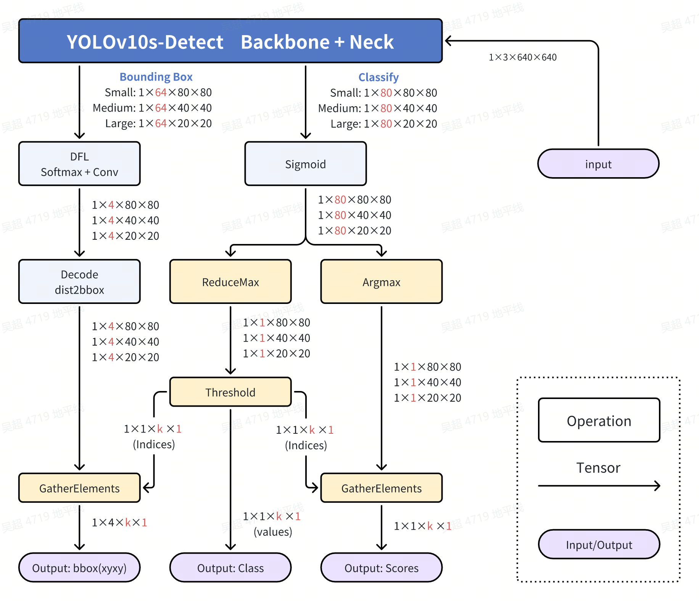
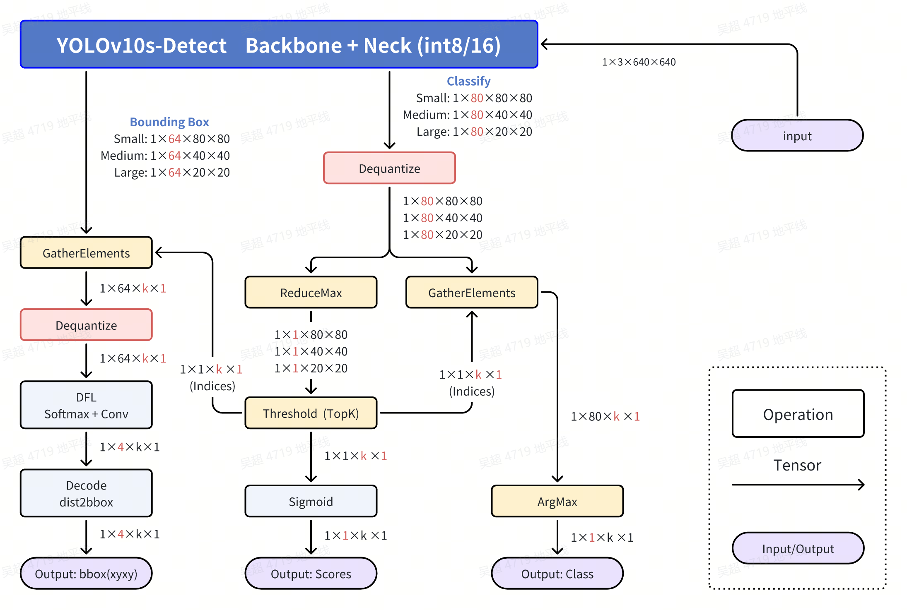

English | [简体中文](./README_cn.md)

# YOLOv10 Detect
- [YOLOv10 Detect](#yolov10-detect)
  - [Introduction to YOLO](#introduction-to-yolo)
  - [Performance Data (Summary)](#performance-data-summary)
  - [Model download](#model-download)
  - [Input / Output Data](#input--output-data)
  - [Original Processing Flow](#original-processing-flow)
  - [Optimized Processing Flow](#optimized-processing-flow)
  - [Steps Reference](#steps-reference)
    - [Environment and Project Preparation](#environment-and-project-preparation)
    - [Export to ONNX](#export-to-onnx)
    - [PTQ Quantization Transformation](#ptq-quantization-transformation)
    - [Remove Dequantize Nodes for the Three Bounding Box Output Heads](#remove-dequantize-nodes-for-the-three-bounding-box-output-heads)
    - [Partial Compilation Log Reference](#partial-compilation-log-reference)
  - [Model Training](#model-training)
  - [Performance Data](#performance-data)
  - [FAQ](#faq)
  - [Reference](#reference)


## Introduction to YOLO


YOLO (You Only Look Once), a popular object detection and image segmentation model, was developed by Joseph Redmon and Ali Farhadi at the University of Washington. Launched in 2015, YOLO quickly gained popularity for its high speed and accuracy.

 - YOLOv2, released in 2016, improved the original model by incorporating batch normalization, anchor boxes, and dimension clusters.
 - YOLOv3, launched in 2018, further enhanced the model's performance using a more efficient backbone network, multiple anchors and spatial pyramid pooling.
 - YOLOv4 was released in 2020, introducing innovations like Mosaic data augmentation, a new anchor-free detection head, and a new loss function.
 - YOLOv5 further improved the model's performance and added new features such as hyperparameter optimization, integrated experiment tracking and automatic export to popular export formats.
 - YOLOv6 was open-sourced by Meituan in 2022 and is in use in many of the company's autonomous delivery robots.
 - YOLOv7 added additional tasks such as pose estimation on the COCO keypoints dataset.
 - YOLOv8 is the latest version of YOLO by Ultralytics. As a cutting-edge, state-of-the-art (SOTA) model, YOLOv8 builds on the success of previous versions, introducing new features and improvements for enhanced performance, flexibility, and efficiency. YOLOv8 supports a full range of vision AI tasks, including detection, segmentation, pose estimation, tracking, and classification. This versatility allows users to leverage YOLOv8's capabilities across diverse applications and domains.
 - YOLOv9 introduces innovative methods like Programmable Gradient Information (PGI) and the Generalized Efficient Layer Aggregation Network (GELAN).
 - YOLOv10 is created by researchers from Tsinghua University using the Ultralytics Python package. This version provides real-time object detection advancements by introducing an End-to-End head that eliminates Non-Maximum Suppression (NMS) requirements.

## Performance Data (Summary)
RDK X5 & RDK X5 Module
Object Detection (COCO)
| Model (Official) | Size (px) | Classes | Params (M) | Throughput (FPS) | Post Process Time (Python) |
|---------|---------|-------|-------------------|--------------------|---|
| YOLOv10n | 640×640 | 80 | 6.7  | 132.7 | 4.5 ms | 
| YOLOv10s | 640×640 | 80 | 21.6 | 71.0 | 4.5 ms |  
| YOLOv10m | 640×640 | 80 | 59.1 | 34.5 | 4.5 ms |  
| YOLOv10b | 640×640 | 80 | 92.0 | 25.4 | 4.5 ms |  
| YOLOv10l | 640×640 | 80 | 120.3 | 20.0 | 4.5 ms |  
| YOLOv10x | 640×640 | 80 | 160.4 | 14.5 | 4.5 ms |  


## Model download
Reference to `./model/download.md`

## Input / Output Data
- Input: 1x3x640x640, dtype=UINT8
- Output 0: [1, 80, 80, 64], dtype=INT32
- Output 1: [1, 40, 40, 64], dtype=INT32
- Output 2: [1, 20, 20, 64], dtype=INT32
- Output 3: [1, 80, 80, 80], dtype=FLOAT32
- Output 4: [1, 40, 40, 80], dtype=FLOAT32
- Output 5: [1, 20, 20, 80], dtype=FLOAT32

## Original Processing Flow


## Optimized Processing Flow


Refer to the YOLOv8 Detect section for the following:

- Dequantize operation in the Classify part.
- ReduceMax operation in the Classify part.
- Threshold (TopK) operation in the Classify part.
- GatherElements and ArgMax operations in the Classify part.
- GatherElements and Dequantize operations in the Bounding Box part.
- DFL: SoftMax + Conv operation in the Bounding Box part.
- Decode: dist2bbox(ltrb2xyxy) operation in the Bounding Box part.
- nms operation: YOLOv10 does not require nms.

## Steps Reference

Note: For any errors such as "No such file or directory," "No module named 'xxx'," or "command not found," please carefully check your steps. Do not blindly copy and run each command. If you do not understand the modification process, visit the developer community and start with YOLOv5.

### Environment and Project Preparation
- Download the ultralytics/ultralytics repository and follow the ultralytics official documentation to set up your environment.
```bash
git clone https://github.com/ultralytics/ultralytics.git
```
- Enter the local repository and download the official pre-trained weights. Here we use the 3.2 million parameter YOLOv8n-Detect model as an example.
```bash
cd ultralytics
wget https://github.com/ultralytics/assets/releases/download/v8.2.0/yolov10n.pt
```

### Export to ONNX
- Uninstall yolo-related command-line commands so that modifying the `./ultralytics/ultralytics` directory directly takes effect.
```bash
$ conda list | grep ultralytics
$ pip list | grep ultralytics # or
# If installed, uninstall
$ conda uninstall ultralytics 
$ pip uninstall ultralytics   # or
```
- Modify the Detect output head to separate the three feature layers' Bounding Box information and Classify information into six output heads.

File location: `./ultralytics/ultralytics/nn/modules/head.py`, around line 51, replace the `v10Detect` class's forward method with the following content.
Note: It is recommended to keep the original `forward` method, e.g., rename it to `forward_` to easily revert during training.
```python
def forward_(self, x):
    bboxes = [self.one2one_cv2[i](x[i]).permute(0, 2, 3, 1).contiguous() for i in range(self.nl)]
    clses = [self.one2one_cv3[i](x[i]).permute(0, 2, 3, 1).contiguous() for i in range(self.nl)]
    return (bboxes, clses)
```

- Run the Python script below. If you encounter a **No module named onnxsim** error, install it.
```python
from ultralytics import YOLO
YOLO('yolov10n.pt').export(imgsz=640, format='onnx', simplify=True, opset=11)
```

### PTQ Quantization Transformation
- Refer to the Tian Gong Kai Wu toolchain manual and OE package to inspect the model. Ensure all operators are on the BPU, then proceed with compilation. The corresponding YAML file is located in the `./ptq_yamls` directory.
```bash
(bpu_docker) $ hb_mapper checker --model-type onnx --march bayes-e --model yolov10n.onnx
```
- Based on the model inspection results, find the manual quantization operator Softmax, which should have the following content. The Softmax operator splits the model into two BPU subgraphs. Here, the Softmax operator name is "/model.10/attn/Softmax".

```bash
/model.10/attn/MatMul                               BPU  id(0)     HzSQuantizedMatmul         int8/int8        
/model.10/attn/Mul                                  BPU  id(0)     HzSQuantizedConv           int8/int32       
/model.10/attn/Softmax                              CPU  --        Softmax                    float/float      
/model.10/attn/Transpose_1                          BPU  id(1)     Transpose                  int8/int8        
/model.10/attn/MatMul_1                             BPU  id(1)     HzSQuantizedMatmul         int8/int8 
```
Modify the following in the corresponding YAML file:
```yaml
model_parameters:
  node_info: {"/model.10/attn/Softmax": {'ON': 'BPU','InputType': 'int16','OutputType': 'int16'}}
```

- Compile the model:
```bash
(bpu_docker) $ hb_mapper checker --model-type onnx --march bayes-e --model yolov10n.onnx
(bpu_docker) $ hb_mapper makertbin --model-type onnx --config yolov10_detect_bayese_640x640_nv12.yaml
```

### Remove Dequantize Nodes for the Three Bounding Box Output Heads
- Identify the names of the dequantize nodes for the three Bounding Box output heads.
Through the `hb_mapper makerbin` logs, identify the names of the outputs with sizes `[1, 80, 80, 64]`, `[1, 40, 40, 64]`, and `[1, 20, 20, 64]`. These are named `output0`, `479`, and `487`.
```bash
ONNX IR version:          9
Opset version:            ['ai.onnx v11', 'horizon v1']
Producer:                 pytorch v2.1.1
Domain:                   None
Model version:            None
Graph input:
    images:               shape=[1, 3, 640, 640], dtype=FLOAT32
Graph output:
    output0:              shape=[1, 80, 80, 64], dtype=FLOAT32
    479:                  shape=[1, 40, 40, 64], dtype=FLOAT32
    487:                  shape=[1, 20, 20, 64], dtype=FLOAT32
    501:                  shape=[1, 80, 80, 80], dtype=FLOAT32
    515:                  shape=[1, 40, 40, 80], dtype=FLOAT32
    529:                  shape=[1, 20, 20, 80], dtype=FLOAT32
```

- Navigate to the compiled artifact directory.
```bash
$ cd yolov10n_detect_bayese_640x640_nchw
```
- Identify the dequantize nodes that can be removed.
```bash
$ hb_model_modifier yolov10n_detect_bayese_640x640_nchw.bin
```
- In the generated `hb_model_modifier.log` file, find the following information. Specifically, find the names of the three output heads with sizes `[1, 64, 80, 80]`, `[1, 64, 40, 40]`, and `[1, 64, 20, 20]`. Alternatively, you can use tools like Netron to view the ONNX model and obtain the output head names.
The names are:
> "/model.23/one2one_cv2.0/one2one_cv2.0.2/Conv_output_0_HzDequantize"
> "/model.23/one2one_cv2.1/one2one_cv2.1.2/Conv_output_0_HzDequantize"
> "/model.23/one2one_cv2.2/one2one_cv2.2.2/Conv_output_0_HzDequantize"

```bash
2024-08-16 18:30:20,014 file: hb_model_modifier.py func: hb_model_modifier line No: 409 input: "/model.23/one2one_cv2.0/one2one_cv2.0.2/Conv_output_0_quantized"
input: "/model.23/one2one_cv2.0/one2one_cv2.0.2/Conv_x_scale"
output: "output0"
name: "/model.23/one2one_cv2.0/one2one_cv2.0.2/Conv_output_0_HzDequantize"
op_type: "Dequantize"

2024-08-16 18:30:20,014 file: hb_model_modifier.py func: hb_model_modifier line No: 409 input: "/model.23/one2one_cv2.1/one2one_cv2.1.2/Conv_output_0_quantized"
input: "/model.23/one2one_cv2.1/one2one_cv2.1.2/Conv_x_scale"
output: "479"
name: "/model.23/one2one_cv2.1/one2one_cv2.1.2/Conv_output_0_HzDequantize"
op_type: "Dequantize"

2024-08-16 18:30:20,014 file: hb_model_modifier.py func: hb_model_modifier line No: 409 input: "/model.23/one2one_cv2.2/one2one_cv2.2.2/Conv_output_0_quantized"
input: "/model.23/one2one_cv2.2/one2one_cv2.2.2/Conv_x_scale"
output: "487"
name: "/model.23/one2one_cv2.2/one2one_cv2.2.2/Conv_output_0_HzDequantize"
op_type: "Dequantize"
```
- Use the following command to remove the above three dequantize nodes. Note that the names may differ when exporting, so carefully confirm them.
```bash
$ hb_model_modifier yolov10n_detect_bayese_640x640_nchw.bin \
-r "/model.23/one2one_cv2.0/one2one_cv2.0.2/Conv_output_0_HzDequantize" \
-r "/model.23/one2one_cv2.1/one2one_cv2.1.2/Conv_output_0_HzDequantize" \
-r "/model.23/one2one_cv2.2/one2one_cv2.2.2/Conv_output_0_HzDequantize"
```
- Successful removal will display the following logs:
```bash
2024-08-16 18:36:57,561 INFO log will be stored in /open_explorer/yolov10n_detect_bayese_640x640_nchw/hb_model_modifier.log
2024-08-16 18:36:57,566 INFO Nodes that will be removed from this model: ['/model.23/one2one_cv2.0/one2one_cv2.0.2/Conv_output_0_HzDequantize', '/model.23/one2one_cv2.1/one2one_cv2.1.2/Conv_output_0_HzDequantize', '/model.23/one2one_cv2.2/one2one_cv2.2.2/Conv_output_0_HzDequantize']
2024-08-16 18:36:57,566 INFO Node '/model.23/one2one_cv2.0/one2one_cv2.0.2/Conv_output_0_HzDequantize' found, its OP type is 'Dequantize'
2024-08-16 18:36:57,566 INFO scale: /model.23/one2one_cv2.0/one2one_cv2.0.2/Conv_x_scale; zero point: 0. node info details are stored in hb_model_modifier log file
2024-08-16 18:36:57,567 INFO Node '/model.23/one2one_cv2.0/one2one_cv2.0.2/Conv_output_0_HzDequantize' is removed
2024-08-16 18:36:57,567 INFO Node '/model.23/one2one_cv2.1/one2one_cv2.1.2/Conv_output_0_HzDequantize' found, its OP type is 'Dequantize'
2024-08-16 18:36:57,567 INFO scale: /model.23/one2one_cv2.1/one2one_cv2.1.2/Conv_x_scale; zero point: 0. node info details are stored in hb_model_modifier log file
2024-08-16 18:36:57,567 INFO Node '/model.23/one2one_cv2.1/one2one_cv2.1.2/Conv_output_0_HzDequantize' is removed
2024-08-16 18:36:57,567 INFO Node '/model.23/one2one_cv2.2/one2one_cv2.2.2/Conv_output_0_HzDequantize' found, its OP type is 'Dequantize'
2024-08-16 18:36:57,568 INFO scale: /model.23/one2one_cv2.2/one2one_cv2.2.2/Conv_x_scale; zero point: 0. node info details are stored in hb_model_modifier log file
2024-08-16 18:36:57,568 INFO Node '/model.23/one2one_cv2.2/one2one_cv2.2.2/Conv_output_0_HzDequantize' is removed
2024-08-16 18:36:57,571 INFO modified model saved as yolov10n_detect_bayese_640x640_nchw_modified.bin
```

- The resulting bin model is named `yolov8n_instance_seg_bayese_640x640_nchw_modified.bin`, which is the final model.
- An NCHW input model can prepare input data using OpenCV and numpy.
- An NV12 input model can prepare input data using hardware devices such as codec, JPU, VPU, GPU, or directly use the corresponding TROS functionality packages.

### Partial Compilation Log Reference

It can be observed that the SoftMax operator is now supported by the BPU, with cosine similarity maintained above 0.9, and the entire bin model consists of only one BPU subgraph.

```bash
2024-08-16 17:34:04,753 file: build.py func: build line No: 36 Start to Horizon NN Model Convert.
2024-08-16 17:34:04,753 file: model_debug.py func: model_debug line No: 61 Loading horizon_nn debug methods:[]
2024-08-16 17:34:04,753 file: cali_dict_parser.py func: cali_dict_parser line No: 40 Parsing the calibration parameter
2024-08-16 17:34:04,754 file: node_attribute.py func: node_attribute line No: 36 There are 1 nodes designated to run on the bpu: ['/model.10/attn/Softmax'].
2024-08-16 17:34:04,754 file: build.py func: build line No: 146 The specified model compilation architecture: bayes-e.
2024-08-16 17:34:04,754 file: build.py func: build line No: 148 The specified model compilation optimization parameters: [].
2024-08-16 17:34:04,776 file: build.py func: build line No: 36 Start to prepare the onnx model.
2024-08-16 17:34:04,776 file: utils.py func: utils line No: 53 Input ONNX Model Information:
ONNX IR version:          9
Opset version:            ['ai.onnx v11', 'horizon v1']
Producer:                 pytorch v2.1.1
Domain:                   None
Model version:            None
Graph input:
    images:               shape=[1, 3, 640, 640], dtype=FLOAT32
Graph output:
    output0:              shape=[1, 80, 80, 64], dtype=FLOAT32
    479:                  shape=[1, 40, 40, 64], dtype=FLOAT32
    487:                  shape=[1, 20, 20, 64], dtype=FLOAT32
    501:                  shape=[1, 80, 80, 80], dtype=FLOAT32
    515:                  shape=[1, 40, 40, 80], dtype=FLOAT32
    529:                  shape=[1, 20, 20, 80], dtype=FLOAT32
2024-08-16 17:34:04,953 file: build.py func: build line No: 39 End to prepare the onnx model.
2024-08-16 17:34:05,187 file: build.py func: build line No: 186 Saving model: yolov10n_detect_bayese_640x640_nchw_original_float_model.onnx.
2024-08-16 17:34:05,188 file: build.py func: build line No: 36 Start to optimize the model.
2024-08-16 17:34:05,446 file: build.py func: build line No: 39 End to optimize the model.
2024-08-16 17:34:05,458 file: build.py func: build line No: 186 Saving model: yolov10n_detect_bayese_640x640_nchw_optimized_float_model.onnx.
2024-08-16 17:34:05,458 file: build.py func: build line No: 36 Start to calibrate the model.
2024-08-16 17:34:05,767 file: calibration_data_set.py func: calibration_data_set line No: 82 input name: images,  number_of_samples: 50
2024-08-16 17:34:05,767 file: calibration_data_set.py func: calibration_data_set line No: 93 There are 50 samples in the calibration data set.
2024-08-16 17:34:05,770 file: default_calibrater.py func: default_calibrater line No: 122 Run calibration model with default calibration method.
2024-08-16 17:34:07,219 file: calibrater.py func: calibrater line No: 235 Calibration using batch 8
2024-08-16 17:34:11,596 file: ort.py func: ort line No: 179 Reset batch_size=1 and execute forward again...
2024-08-16 17:37:57,981 file: calibrater.py func: calibrater line No: 235 Calibration using batch 8
2024-08-16 17:37:58,957 file: ort.py func: ort line No: 179 Reset batch_size=1 and execute forward again...
2024-08-16 17:38:10,479 file: calibrater.py func: calibrater line No: 235 Calibration using batch 8
2024-08-16 17:38:12,340 file: ort.py func: ort line No: 179 Reset batch_size=1 and execute forward again...
2024-08-16 17:38:48,924 file: default_calibrater.py func: default_calibrater line No: 211 Select kl:num_bins=1024 method.
2024-08-16 17:38:53,280 file: build.py func: build line No: 39 End to calibrate the model.
2024-08-16 17:38:53,317 file: build.py func: build line No: 186 Saving model: yolov10n_detect_bayese_640x640_nchw_calibrated_model.onnx.
2024-08-16 17:38:53,317 file: build.py func: build line No: 36 Start to quantize the model.
2024-08-16 17:38:54,516 file: build.py func: build line No: 39 End to quantize the model.
2024-08-16 17:38:54,597 file: build.py func: build line No: 186 Saving model: yolov10n_detect_bayese_640x640_nchw_quantized_model.onnx.
2024-08-16 17:38:54,824 file: build.py func: build line No: 36 Start to compile the model with march bayes-e.
2024-08-16 17:38:54,964 file: hybrid_build.py func: hybrid_build line No: 133 Compile submodel: main_graph_subgraph_0
2024-08-16 17:38:55,119 file: hbdk_cc.py func: hbdk_cc line No: 115 hbdk-cc parameters:['--O3', '--core-num', '1', '--fast', '--input-layout', 'NHWC', '--output-layout', 'NHWC', '--input-source', 'ddr']
2024-08-16 17:38:55,120 file: hbdk_cc.py func: hbdk_cc line No: 116 hbdk-cc command used:hbdk-cc -f hbir -m /tmp/tmptfp5gbft/main_graph_subgraph_0.hbir -o /tmp/tmptfp5gbft/main_graph_subgraph_0.hbm --march bayes-e --progressbar --O3 --core-num 1 --fast --input-layout NHWC --output-layout NHWC --input-source ddr
2024-08-16 17:38:55,120 file: tool_utils.py func: tool_utils line No: 317 Can not find the scale for node HZ_PREPROCESS_FOR_images_NCHW2NHWC_LayoutConvert_Input0
2024-08-16 17:42:36,250 file: tool_utils.py func: tool_utils line No: 322 consumed time 221.109
2024-08-16 17:42:36,344 file: tool_utils.py func: tool_utils line No: 322 FPS=129.09, latency = 7746.7 us, DDR = 19285696 bytes   (see main_graph_subgraph_0.html)
2024-08-16 17:42:36,412 file: build.py func: build line No: 39 End to compile the model with march bayes-e.
2024-08-16 17:42:36,442 file: print_node_info.py func: print_node_info line No: 57 The converted model node information:
================================================================================================================================
Node                                                ON   Subgraph  Type          Cosine Similarity  Threshold   In/Out DataType  
---------------------------------------------------------------------------------------------------------------------------------
HZ_PREPROCESS_FOR_images                            BPU  id(0)     HzPreprocess  0.999779           127.000000  int8/int8        
/model.0/conv/Conv                                  BPU  id(0)     Conv          0.998270           0.995605    int8/int8        
/model.0/act/Mul                                    BPU  id(0)     HzSwish       0.997878           10.603966   int8/int8        
/model.1/conv/Conv                                  BPU  id(0)     Conv          0.984483           8.673835    int8/int8        
/model.1/act/Mul                                    BPU  id(0)     HzSwish       0.979556           30.013716   int8/int8        
/model.2/cv1/conv/Conv                              BPU  id(0)     Conv          0.982836           18.365402   int8/int8        
/model.2/cv1/act/Mul                                BPU  id(0)     HzSwish       0.995462           13.615964   int8/int8        
/model.2/Split                                      BPU  id(0)     Split         0.998296           6.394294    int8/int8        
/model.2/m.0/cv1/conv/Conv                          BPU  id(0)     Conv          0.979835           6.394294    int8/int8        
/model.2/m.0/cv1/act/Mul                            BPU  id(0)     HzSwish       0.986137           5.394912    int8/int8        
/model.2/m.0/cv2/conv/Conv                          BPU  id(0)     Conv          0.983792           5.073148    int8/int8        
/model.2/m.0/cv2/act/Mul                            BPU  id(0)     HzSwish       0.985896           7.789621    int8/int8        
UNIT_CONV_FOR_/model.2/m.0/Add                      BPU  id(0)     Conv          0.998296           6.394294    int8/int8        
/model.2/Split_output_0_calibrated_Requantize       BPU  id(0)     HzRequantize                                 int8/int8        
/model.2/Split_output_1_calibrated_Requantize       BPU  id(0)     HzRequantize                                 int8/int8        
/model.2/Concat                                     BPU  id(0)     Concat        0.994953           6.394294    int8/int8        
/model.2/cv2/conv/Conv                              BPU  id(0)     Conv          0.983636           8.365657    int8/int8        
/model.2/cv2/act/Mul                                BPU  id(0)     HzSwish       0.990088           8.100873    int8/int8        
/model.3/conv/Conv                                  BPU  id(0)     Conv          0.988301           5.377353    int8/int8        
/model.3/act/Mul                                    BPU  id(0)     HzSwish       0.992076           5.424640    int8/int8        
/model.4/cv1/conv/Conv                              BPU  id(0)     Conv          0.989007           5.688507    int8/int8        
/model.4/cv1/act/Mul                                BPU  id(0)     HzSwish       0.990244           4.164920    int8/int8        
/model.4/Split                                      BPU  id(0)     Split         0.995551           2.224742    int8/int8        
/model.4/m.0/cv1/conv/Conv                          BPU  id(0)     Conv          0.985632           2.224742    int8/int8        
/model.4/m.0/cv1/act/Mul                            BPU  id(0)     HzSwish       0.986047           4.467528    int8/int8        
/model.4/m.0/cv2/conv/Conv                          BPU  id(0)     Conv          0.991723           3.448012    int8/int8        
/model.4/m.0/cv2/act/Mul                            BPU  id(0)     HzSwish       0.993127           4.670990    int8/int8        
UNIT_CONV_FOR_/model.4/m.0/Add                      BPU  id(0)     Conv          0.995551           2.224742    int8/int8        
/model.4/m.1/cv1/conv/Conv                          BPU  id(0)     Conv          0.992123           3.380925    int8/int8        
/model.4/m.1/cv1/act/Mul                            BPU  id(0)     HzSwish       0.993438           3.713458    int8/int8        
/model.4/m.1/cv2/conv/Conv                          BPU  id(0)     Conv          0.989381           2.662815    int8/int8        
/model.4/m.1/cv2/act/Mul                            BPU  id(0)     HzSwish       0.991482           6.437428    int8/int8        
UNIT_CONV_FOR_/model.4/m.1/Add                      BPU  id(0)     Conv          0.995955           3.380925    int8/int8        
/model.4/Split_output_0_calibrated_Requantize       BPU  id(0)     HzRequantize                                 int8/int8        
/model.4/Split_output_1_calibrated_Requantize       BPU  id(0)     HzRequantize                                 int8/int8        
/model.4/m.0/Add_output_0_calibrated_Requantize     BPU  id(0)     HzRequantize                                 int8/int8        
/model.4/Concat                                     BPU  id(0)     Concat        0.994967           2.224742    int8/int8        
/model.4/cv2/conv/Conv                              BPU  id(0)     Conv          0.990687           5.684978    int8/int8        
/model.4/cv2/act/Mul                                BPU  id(0)     HzSwish       0.991007           4.640128    int8/int8        
/model.5/cv1/conv/Conv                              BPU  id(0)     Conv          0.990364           2.622323    int8/int8        
/model.5/cv1/act/Mul                                BPU  id(0)     HzSwish       0.971344           7.331495    int8/int8        
/model.5/cv2/conv/Conv                              BPU  id(0)     Conv          0.966769           2.117791    int8/int8        
/model.6/cv1/conv/Conv                              BPU  id(0)     Conv          0.975072           8.549481    int8/int8        
/model.6/cv1/act/Mul                                BPU  id(0)     HzSwish       0.975069           7.051415    int8/int8        
/model.6/Split                                      BPU  id(0)     Split         0.983371           3.504654    int8/int8        
/model.6/m.0/cv1/conv/Conv                          BPU  id(0)     Conv          0.979234           3.504654    int8/int8        
/model.6/m.0/cv1/act/Mul                            BPU  id(0)     HzSwish       0.938951           7.225185    int8/int8        
/model.6/m.0/cv2/conv/Conv                          BPU  id(0)     Conv          0.956522           1.429943    int8/int8        
/model.6/m.0/cv2/act/Mul                            BPU  id(0)     HzSwish       0.956711           5.600646    int8/int8        
UNIT_CONV_FOR_/model.6/m.0/Add                      BPU  id(0)     Conv          0.983371           3.504654    int8/int8        
/model.6/m.1/cv1/conv/Conv                          BPU  id(0)     Conv          0.981077           4.064888    int8/int8        
/model.6/m.1/cv1/act/Mul                            BPU  id(0)     HzSwish       0.965567           6.363821    int8/int8        
/model.6/m.1/cv2/conv/Conv                          BPU  id(0)     Conv          0.969873           2.145753    int8/int8        
/model.6/m.1/cv2/act/Mul                            BPU  id(0)     HzSwish       0.968186           8.400377    int8/int8        
UNIT_CONV_FOR_/model.6/m.1/Add                      BPU  id(0)     Conv          0.975839           4.064888    int8/int8        
/model.6/Split_output_0_calibrated_Requantize       BPU  id(0)     HzRequantize                                 int8/int8        
/model.6/Split_output_1_calibrated_Requantize       BPU  id(0)     HzRequantize                                 int8/int8        
/model.6/m.0/Add_output_0_calibrated_Requantize     BPU  id(0)     HzRequantize                                 int8/int8        
/model.6/Concat                                     BPU  id(0)     Concat        0.977647           3.504654    int8/int8        
/model.6/cv2/conv/Conv                              BPU  id(0)     Conv          0.969809           6.438043    int8/int8        
/model.6/cv2/act/Mul                                BPU  id(0)     HzSwish       0.972988           8.041522    int8/int8        
/model.7/cv1/conv/Conv                              BPU  id(0)     Conv          0.984554           3.157327    int8/int8        
/model.7/cv1/act/Mul                                BPU  id(0)     HzSwish       0.967383           7.064945    int8/int8        
/model.7/cv2/conv/Conv                              BPU  id(0)     Conv          0.955257           3.176519    int8/int8        
/model.8/cv1/conv/Conv                              BPU  id(0)     Conv          0.964391           6.597043    int8/int8        
/model.8/cv1/act/Mul                                BPU  id(0)     HzSwish       0.958399           7.813031    int8/int8        
/model.8/Split                                      BPU  id(0)     Split         0.955191           3.325485    int8/int8        
/model.8/m.0/cv1/conv/Conv                          BPU  id(0)     Conv          0.975019           3.325485    int8/int8        
/model.8/m.0/cv1/act/Mul                            BPU  id(0)     HzSwish       0.954413           8.182122    int8/int8        
/model.8/m.0/cv2/conv/Conv                          BPU  id(0)     Conv          0.956983           2.017900    int8/int8        
/model.8/m.0/cv2/act/Mul                            BPU  id(0)     HzSwish       0.956910           10.418705   int8/int8        
UNIT_CONV_FOR_/model.8/m.0/Add                      BPU  id(0)     Conv          0.968653           3.325485    int8/int8        
/model.8/Split_output_0_calibrated_Requantize       BPU  id(0)     HzRequantize                                 int8/int8        
/model.8/Split_output_1_calibrated_Requantize       BPU  id(0)     HzRequantize                                 int8/int8        
/model.8/Concat                                     BPU  id(0)     Concat        0.954300           3.325485    int8/int8        
/model.8/cv2/conv/Conv                              BPU  id(0)     Conv          0.958738           3.372330    int8/int8        
/model.8/cv2/act/Mul                                BPU  id(0)     HzSwish       0.950081           8.054053    int8/int8        
/model.9/cv1/conv/Conv                              BPU  id(0)     Conv          0.977853           6.169669    int8/int8        
/model.9/cv1/act/Mul                                BPU  id(0)     HzSwish       0.981891           6.056477    int8/int8        
/model.9/m/MaxPool                                  BPU  id(0)     MaxPool       0.992955           6.763361    int8/int8        
/model.9/m_1/MaxPool                                BPU  id(0)     MaxPool       0.995619           6.763361    int8/int8        
/model.9/m_2/MaxPool                                BPU  id(0)     MaxPool       0.996569           6.763361    int8/int8        
/model.9/Concat                                     BPU  id(0)     Concat        0.994307           6.763361    int8/int8        
/model.9/cv2/conv/Conv                              BPU  id(0)     Conv          0.959600           6.763361    int8/int8        
/model.9/cv2/act/Mul                                BPU  id(0)     HzSwish       0.927468           8.180250    int8/int8        
/model.10/cv1/conv/Conv                             BPU  id(0)     Conv          0.926328           2.017437    int8/int8        
/model.10/cv1/act/Mul                               BPU  id(0)     HzSwish       0.925031           9.352364    int8/int8        
/model.10/Split                                     BPU  id(0)     Split         0.885757           5.323861    int8/int8        
/model.10/attn/qkv/conv/Conv                        BPU  id(0)     Conv          0.943905           5.323861    int8/int8        
/model.10/attn/Reshape                              BPU  id(0)     Reshape       0.943905           7.924023    int8/int8        
/model.10/attn/Split                                BPU  id(0)     Split         0.964183           7.924023    int8/int8        
/model.10/attn/Transpose                            BPU  id(0)     Transpose     0.964182           --          int8/int8        
/model.10/attn/Reshape_2                            BPU  id(0)     Reshape       0.929960           --          int8/int8        
/model.10/attn/MatMul                               BPU  id(0)     MatMul        0.958139           7.924023    int8/int8        
/model.10/attn/Mul                                  BPU  id(0)     Conv          0.958141           89.904221   int8/int16       
...0/attn/Softmax_reducemax_FROM_QUANTIZED_SOFTMAX  BPU  id(0)     ReduceMax     0.995906           15.892972   int16/int16      
/model.10/attn/Softmax_sub_FROM_QUANTIZED_SOFTMAX   BPU  id(0)     Sub           0.988598           15.892972   int16/int16      
/model.10/attn/Softmax_exp_FROM_QUANTIZED_SOFTMAX   BPU  id(0)     Exp           0.934911           11.090324   int16/int16      
...0/attn/Softmax_reducesum_FROM_QUANTIZED_SOFTMAX  BPU  id(0)     ReduceSum     0.970950           1.000000    int16/int16      
.../attn/Softmax_reciprocal_FROM_QUANTIZED_SOFTMAX  BPU  id(0)     Reciprocal    0.954017           154.920547  int16/int16      
/model.10/attn/Softmax_mul_FROM_QUANTIZED_SOFTMAX   BPU  id(0)     Mul           0.923754           1.000000    int16/int8       
/model.10/attn/Transpose_1                          BPU  id(0)     Transpose     0.923754           0.136998    int8/int8        
/model.10/attn/MatMul_1                             BPU  id(0)     MatMul        0.922402           0.136998    int8/int8        
/model.10/attn/Reshape_1                            BPU  id(0)     Reshape       0.922402           5.962341    int8/int8        
/model.10/attn/pe/conv/Conv                         BPU  id(0)     Conv          0.933046           7.924023    int8/int8        
/model.10/attn/proj/conv/Conv                       BPU  id(0)     Conv          0.883142           5.235514    int8/int8        
/model.10/ffn/ffn.0/conv/Conv                       BPU  id(0)     Conv          0.906512           8.917325    int8/int8        
/model.10/ffn/ffn.0/act/Mul                         BPU  id(0)     HzSwish       0.843966           8.798843    int8/int8        
/model.10/ffn/ffn.1/conv/Conv                       BPU  id(0)     Conv          0.859181           4.622127    int8/int8        
/model.10/Split_output_0_calibrated_Requantize      BPU  id(0)     HzRequantize                                 int8/int8        
/model.10/Concat                                    BPU  id(0)     Concat        0.899151           5.323861    int8/int8        
/model.10/cv2/conv/Conv                             BPU  id(0)     Conv          0.917233           3.629226    int8/int8        
/model.10/cv2/act/Mul                               BPU  id(0)     HzSwish       0.864065           8.974898    int8/int8        
/model.11/Resize                                    BPU  id(0)     Resize        0.864060           2.635198    int8/int8        
/model.11/Resize_output_0_calibrated_Requantize     BPU  id(0)     HzRequantize                                 int8/int8        
/model.12/Concat                                    BPU  id(0)     Concat        0.911233           2.635198    int8/int8        
/model.13/cv1/conv/Conv                             BPU  id(0)     Conv          0.957063           3.157327    int8/int8        
/model.13/cv1/act/Mul                               BPU  id(0)     HzSwish       0.946216           7.360564    int8/int8        
/model.13/Split                                     BPU  id(0)     Split         0.968129           1.736766    int8/int8        
/model.13/m.0/cv1/conv/Conv                         BPU  id(0)     Conv          0.970430           1.736766    int8/int8        
/model.13/m.0/cv1/act/Mul                           BPU  id(0)     HzSwish       0.940039           6.535757    int8/int8        
/model.13/m.0/cv2/conv/Conv                         BPU  id(0)     Conv          0.949822           3.729291    int8/int8        
/model.13/m.0/cv2/act/Mul                           BPU  id(0)     HzSwish       0.939619           6.101533    int8/int8        
/model.13/Concat                                    BPU  id(0)     Concat        0.944175           1.736766    int8/int8        
/model.13/cv2/conv/Conv                             BPU  id(0)     Conv          0.939836           1.736766    int8/int8        
/model.13/cv2/act/Mul                               BPU  id(0)     HzSwish       0.930296           7.232765    int8/int8        
/model.14/Resize                                    BPU  id(0)     Resize        0.930296           3.190812    int8/int8        
...el.4/cv2/act/Mul_output_0_calibrated_Requantize  BPU  id(0)     HzRequantize                                 int8/int8        
/model.15/Concat                                    BPU  id(0)     Concat        0.967072           3.190812    int8/int8        
/model.16/cv1/conv/Conv                             BPU  id(0)     Conv          0.985251           3.190812    int8/int8        
/model.16/cv1/act/Mul                               BPU  id(0)     HzSwish       0.988765           6.394931    int8/int8        
/model.16/Split                                     BPU  id(0)     Split         0.993388           2.141448    int8/int8        
/model.16/m.0/cv1/conv/Conv                         BPU  id(0)     Conv          0.983419           2.141448    int8/int8        
/model.16/m.0/cv1/act/Mul                           BPU  id(0)     HzSwish       0.985318           5.820910    int8/int8        
/model.16/m.0/cv2/conv/Conv                         BPU  id(0)     Conv          0.982261           2.331356    int8/int8        
/model.16/m.0/cv2/act/Mul                           BPU  id(0)     HzSwish       0.987834           5.858522    int8/int8        
/model.16/Split_output_0_calibrated_Requantize      BPU  id(0)     HzRequantize                                 int8/int8        
/model.16/Split_output_1_calibrated_Requantize      BPU  id(0)     HzRequantize                                 int8/int8        
/model.16/Concat                                    BPU  id(0)     Concat        0.988411           2.141448    int8/int8        
/model.16/cv2/conv/Conv                             BPU  id(0)     Conv          0.983385           2.395487    int8/int8        
/model.16/cv2/act/Mul                               BPU  id(0)     HzSwish       0.988149           6.229319    int8/int8        
/model.17/conv/Conv                                 BPU  id(0)     Conv          0.952232           2.382120    int8/int8        
/model.23/one2one_cv2.0/one2one_cv2.0.0/conv/Conv   BPU  id(0)     Conv          0.970563           2.382120    int8/int8        
...3.0/one2one_cv3.0.0/one2one_cv3.0.0.0/conv/Conv  BPU  id(0)     Conv          0.998945           2.382120    int8/int8        
/model.17/act/Mul                                   BPU  id(0)     HzSwish       0.937657           6.560148    int8/int8        
/model.23/one2one_cv2.0/one2one_cv2.0.0/act/Mul     BPU  id(0)     HzSwish       0.967019           11.006473   int8/int8        
...cv3.0/one2one_cv3.0.0/one2one_cv3.0.0.0/act/Mul  BPU  id(0)     HzSwish       0.998681           3.569149    int8/int8        
/model.18/Concat                                    BPU  id(0)     Concat        0.932330           3.190812    int8/int8        
/model.23/one2one_cv2.0/one2one_cv2.0.1/conv/Conv   BPU  id(0)     Conv          0.945215           4.088514    int8/int8        
...3.0/one2one_cv3.0.0/one2one_cv3.0.0.1/conv/Conv  BPU  id(0)     Conv          0.981223           3.510941    int8/int8        
/model.19/cv1/conv/Conv                             BPU  id(0)     Conv          0.927528           3.190812    int8/int8        
/model.23/one2one_cv2.0/one2one_cv2.0.1/act/Mul     BPU  id(0)     HzSwish       0.947358           27.335110   int8/int8        
...cv3.0/one2one_cv3.0.0/one2one_cv3.0.0.1/act/Mul  BPU  id(0)     HzSwish       0.974823           5.289838    int8/int8        
/model.19/cv1/act/Mul                               BPU  id(0)     HzSwish       0.920491           7.167810    int8/int8        
/model.23/one2one_cv2.0/one2one_cv2.0.2/Conv        BPU  id(0)     Conv          0.988992           11.636202   int8/int32       
...3.0/one2one_cv3.0.1/one2one_cv3.0.1.0/conv/Conv  BPU  id(0)     Conv          0.982968           2.674858    int8/int8        
/model.19/Split                                     BPU  id(0)     Split         0.930839           2.987007    int8/int8        
/model.19/m.0/cv1/conv/Conv                         BPU  id(0)     Conv          0.962431           2.987007    int8/int8        
...cv3.0/one2one_cv3.0.1/one2one_cv3.0.1.0/act/Mul  BPU  id(0)     HzSwish       0.981376           5.826365    int8/int8        
...3.0/one2one_cv3.0.1/one2one_cv3.0.1.1/conv/Conv  BPU  id(0)     Conv          0.956472           2.970755    int8/int8        
/model.19/m.0/cv1/act/Mul                           BPU  id(0)     HzSwish       0.926298           7.250287    int8/int8        
/model.19/m.0/cv2/conv/Conv                         BPU  id(0)     Conv          0.915416           2.247598    int8/int8        
...cv3.0/one2one_cv3.0.1/one2one_cv3.0.1.1/act/Mul  BPU  id(0)     HzSwish       0.965275           27.485249   int8/int8        
/model.23/one2one_cv3.0/one2one_cv3.0.2/Conv        BPU  id(0)     Conv          0.999432           44.006672   int8/int32       
/model.19/m.0/cv2/act/Mul                           BPU  id(0)     HzSwish       0.904141           9.066823    int8/int8        
/model.19/Split_output_0_calibrated_Requantize      BPU  id(0)     HzRequantize                                 int8/int8        
/model.19/Split_output_1_calibrated_Requantize      BPU  id(0)     HzRequantize                                 int8/int8        
/model.19/Concat                                    BPU  id(0)     Concat        0.913236           2.987007    int8/int8        
/model.19/cv2/conv/Conv                             BPU  id(0)     Conv          0.923298           4.169190    int8/int8        
/model.19/cv2/act/Mul                               BPU  id(0)     HzSwish       0.920483           9.177308    int8/int8        
/model.20/cv1/conv/Conv                             BPU  id(0)     Conv          0.911498           2.309886    int8/int8        
/model.23/one2one_cv2.1/one2one_cv2.1.0/conv/Conv   BPU  id(0)     Conv          0.941168           2.309886    int8/int8        
...3.1/one2one_cv3.1.0/one2one_cv3.1.0.0/conv/Conv  BPU  id(0)     Conv          0.969385           2.309886    int8/int8        
/model.20/cv1/act/Mul                               BPU  id(0)     HzSwish       0.871221           7.872035    int8/int8        
/model.23/one2one_cv2.1/one2one_cv2.1.0/act/Mul     BPU  id(0)     HzSwish       0.937789           13.438343   int8/int8        
...cv3.1/one2one_cv3.1.0/one2one_cv3.1.0.0/act/Mul  BPU  id(0)     HzSwish       0.969118           7.788738    int8/int8        
/model.20/cv2/conv/Conv                             BPU  id(0)     Conv          0.882901           4.240702    int8/int8        
/model.23/one2one_cv2.1/one2one_cv2.1.1/conv/Conv   BPU  id(0)     Conv          0.934215           4.444287    int8/int8        
...3.1/one2one_cv3.1.0/one2one_cv3.1.0.1/conv/Conv  BPU  id(0)     Conv          0.958680           7.788737    int8/int8        
/model.21/Concat                                    BPU  id(0)     Concat        0.869392           2.635198    int8/int8        
/model.22/cv1/conv/Conv                             BPU  id(0)     Conv          0.872874           2.635198    int8/int8        
/model.23/one2one_cv2.1/one2one_cv2.1.1/act/Mul     BPU  id(0)     HzSwish       0.943696           24.260267   int8/int8        
...cv3.1/one2one_cv3.1.0/one2one_cv3.1.0.1/act/Mul  BPU  id(0)     HzSwish       0.946590           13.584941   int8/int8        
/model.23/one2one_cv2.1/one2one_cv2.1.2/Conv        BPU  id(0)     Conv          0.985716           41.404373   int8/int32       
...3.1/one2one_cv3.1.1/one2one_cv3.1.1.0/conv/Conv  BPU  id(0)     Conv          0.903468           3.631684    int8/int8        
/model.22/cv1/act/Mul                               BPU  id(0)     HzSwish       0.854948           7.503721    int8/int8        
/model.22/Split                                     BPU  id(0)     Split         0.906026           2.796731    int8/int8        
...cv3.1/one2one_cv3.1.1/one2one_cv3.1.1.0/act/Mul  BPU  id(0)     HzSwish       0.904703           16.311018   int8/int8        
/model.22/m.0/cv1/cv1.0/conv/Conv                   BPU  id(0)     Conv          0.920342           2.796731    int8/int8        
...3.1/one2one_cv3.1.1/one2one_cv3.1.1.1/conv/Conv  BPU  id(0)     Conv          0.939913           6.574324    int8/int8        
/model.22/m.0/cv1/cv1.0/act/Mul                     BPU  id(0)     HzSwish       0.911485           6.698623    int8/int8        
...cv3.1/one2one_cv3.1.1/one2one_cv3.1.1.1/act/Mul  BPU  id(0)     HzSwish       0.950459           50.715145   int8/int8        
/model.22/m.0/cv1/cv1.1/conv/Conv                   BPU  id(0)     Conv          0.883911           5.590483    int8/int8        
/model.23/one2one_cv3.1/one2one_cv3.1.2/Conv        BPU  id(0)     Conv          0.998491           45.058029   int8/int32       
/model.22/m.0/cv1/cv1.1/act/Mul                     BPU  id(0)     HzSwish       0.873500           5.918747    int8/int8        
/model.22/m.0/cv1/cv1.2/conv/Conv                   BPU  id(0)     Conv          0.906973           3.918176    int8/int8        
/model.22/m.0/cv1/cv1.2/act/Mul                     BPU  id(0)     HzSwish       0.900139           11.114021   int8/int8        
/model.22/m.0/cv1/cv1.3/conv/Conv                   BPU  id(0)     Conv          0.878716           4.137039    int8/int8        
/model.22/m.0/cv1/cv1.3/act/Mul                     BPU  id(0)     HzSwish       0.872436           8.790598    int8/int8        
/model.22/m.0/cv1/cv1.4/conv/Conv                   BPU  id(0)     Conv          0.884580           5.088044    int8/int8        
/model.22/m.0/cv1/cv1.4/act/Mul                     BPU  id(0)     HzSwish       0.879342           9.508633    int8/int8        
UNIT_CONV_FOR_/model.22/m.0/Add                     BPU  id(0)     Conv          0.906026           2.796731    int8/int8        
/model.22/Split_output_0_calibrated_Requantize      BPU  id(0)     HzRequantize                                 int8/int8        
/model.22/Split_output_1_calibrated_Requantize      BPU  id(0)     HzRequantize                                 int8/int8        
/model.22/Concat                                    BPU  id(0)     Concat        0.866978           2.796731    int8/int8        
/model.22/cv2/conv/Conv                             BPU  id(0)     Conv          0.853498           13.280812   int8/int8        
/model.22/cv2/act/Mul                               BPU  id(0)     HzSwish       0.836353           8.961614    int8/int8        
/model.23/one2one_cv2.2/one2one_cv2.2.0/conv/Conv   BPU  id(0)     Conv          0.865065           4.120993    int8/int8        
...3.2/one2one_cv3.2.0/one2one_cv3.2.0.0/conv/Conv  BPU  id(0)     Conv          0.857857           4.120993    int8/int8        
/model.23/one2one_cv2.2/one2one_cv2.2.0/act/Mul     BPU  id(0)     HzSwish       0.879805           9.944433    int8/int8        
...cv3.2/one2one_cv3.2.0/one2one_cv3.2.0.0/act/Mul  BPU  id(0)     HzSwish       0.841405           10.132360   int8/int8        
/model.23/one2one_cv2.2/one2one_cv2.2.1/conv/Conv   BPU  id(0)     Conv          0.870142           6.913608    int8/int8        
...3.2/one2one_cv3.2.0/one2one_cv3.2.0.1/conv/Conv  BPU  id(0)     Conv          0.879809           12.896649   int8/int8        
/model.23/one2one_cv2.2/one2one_cv2.2.1/act/Mul     BPU  id(0)     HzSwish       0.882873           31.428568   int8/int8        
...cv3.2/one2one_cv3.2.0/one2one_cv3.2.0.1/act/Mul  BPU  id(0)     HzSwish       0.865068           9.924242    int8/int8        
/model.23/one2one_cv2.2/one2one_cv2.2.2/Conv        BPU  id(0)     Conv          0.969894           13.934072   int8/int32       
...3.2/one2one_cv3.2.1/one2one_cv3.2.1.0/conv/Conv  BPU  id(0)     Conv          0.636159           4.638824    int8/int8        
...cv3.2/one2one_cv3.2.1/one2one_cv3.2.1.0/act/Mul  BPU  id(0)     HzSwish       0.779163           22.766069   int8/int8        
...3.2/one2one_cv3.2.1/one2one_cv3.2.1.1/conv/Conv  BPU  id(0)     Conv          0.866428           5.616152    int8/int8        
...cv3.2/one2one_cv3.2.1/one2one_cv3.2.1.1/act/Mul  BPU  id(0)     HzSwish       0.907194           35.950649   int8/int8        
/model.23/one2one_cv3.2/one2one_cv3.2.2/Conv        BPU  id(0)     Conv          0.997476           17.939869   int8/int32

```


## Model Training

- Model training should refer to the ultralytics official documentation, which is maintained by ultralytics and is of very high quality. There are also numerous reference materials available online, making it relatively easy to obtain a model with pre-trained weights similar to the official ones.
- Note that no program modifications are required for training, including no changes to the `forward` method.

## Performance Data

RDK X5 & RDK X5 Module  
Object Detection (COCO)  
| Model | Size (px) | Num Classes | FLOPs (G) | FP Precision | INT8 Precision (box/mask) | Latency/Throughput (Single-threaded) | Latency/Throughput (Multi-threaded) | Post Process Time(Python) |
|---------|---------|------------|---------|-------------|---------------------------|-------------------------------------|-------------------------------------|--|
| YOLOv10n | 640×640 | 80 | 6.7  | 38.5 |  | 9.3 ms / 107.0 FPS (1 thread) | 15.0 ms / 132.7 FPS (2 threads) | 4.5 ms |
| YOLOv10s | 640×640 | 80 | 21.6 | 46.3 |  | 15.8 ms / 63.0 FPS (1 thread) | 28.1 ms / 71.0 FPS (2 threads) | 4.5 ms |
| YOLOv10m | 640×640 | 80 | 59.1 | 51.1 |  | 30.8 ms / 32.4 FPS (1 thread) | 51.8 ms / 34.5 FPS (2 threads) | 4.5 ms |
| YOLOv10b | 640×640 | 80 | 92.0 | 52.3 |  | 41.1 ms / 24.3 FPS (1 thread) | 78.4 ms / 25.4 FPS (2 threads) | 4.5 ms |
| YOLOv10l | 640×640 | 80 | 120.3 | 53.2 |  | 52.0 ms / 19.2 FPS (1 thread) | 100.0 ms / 20.0 FPS (2 threads) | 4.5 ms |
| YOLOv10x | 640×640 | 80 | 160.4 | 54.4 |  | 70.7 ms / 14.1 FPS (1 thread) | 137.3 ms / 14.5 FPS (2 threads) | 4.5 ms |

Notes:  
1. The X5 is in its optimal state: CPU is 8 × A55 @ 1.8G with full-core Performance scheduling, BPU is 1 × Bayes-e @ 1G with a total equivalent int8 computing power of 10 TOPS.
2. Single-threaded latency is for a single frame, single thread, and single BPU core, representing the ideal delay for BPU inference of a single task.
3. Four-thread engineering frame rate is when four threads simultaneously feed tasks to the dual-core BPU. In general engineering scenarios, four threads can minimize single-frame latency while fully utilizing all BPU cores at 100%, achieving a good balance between throughput (FPS) and frame latency. X5 BPU overall is more powerful, generally 2 threads can eat BPU full, frame delay and throughput are very good.
4. Eight-thread extreme frame rate is when eight threads simultaneously feed tasks to the dual-core BPU on the X3, aiming to test the BPU’s extreme performance. Typically, four cores are already saturated; if eight threads perform significantly better than four, it suggests that the model structure needs to improve the "compute/memory access" ratio, or that DDR bandwidth optimization should be selected during compilation.
5. FP/Q mAP: 50-95 precision is calculated using pycocotools and comes from the COCO dataset. This can refer to Microsoft’s paper, and is used here to assess the degree of accuracy degradation for deployment on the board.
6. Run the following command to test the bin model throughput on the board
```bash
hrt_model_exec perf --thread_num 2 --model_file yolov8n_detect_bayese_640x640_nv12_modified.bin
```
7. Regarding post-processing: At present, the post-processing of Python reconstruction on X5 only requires a single-core single-thread serial about 5ms to complete, that is, it only needs to occupy 2 CPU cores (200% CPU usage, maximum 800% CPU usage), and can complete 400 frames of image post-processing per minute, and post-processing will not constitute a bottleneck.

## FAQ

[D-Robotics Developer Community](developer.d-robotics.cc)

## Reference

[ultralytics](https://docs.ultralytics.com/)