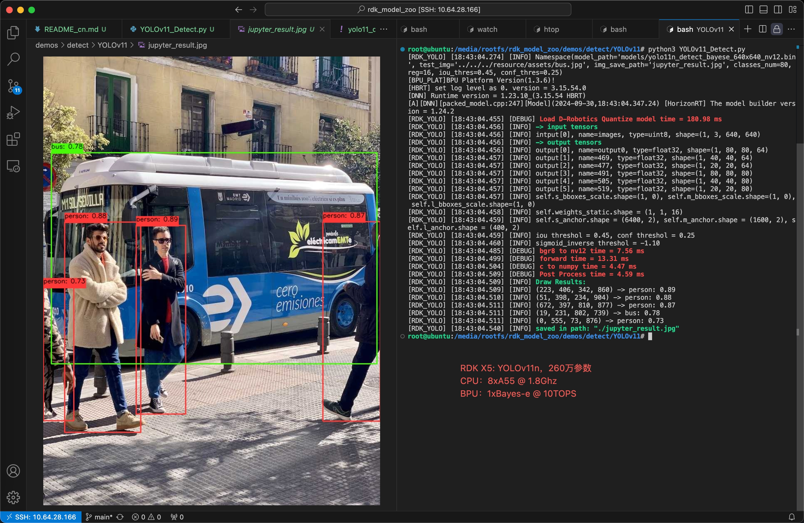
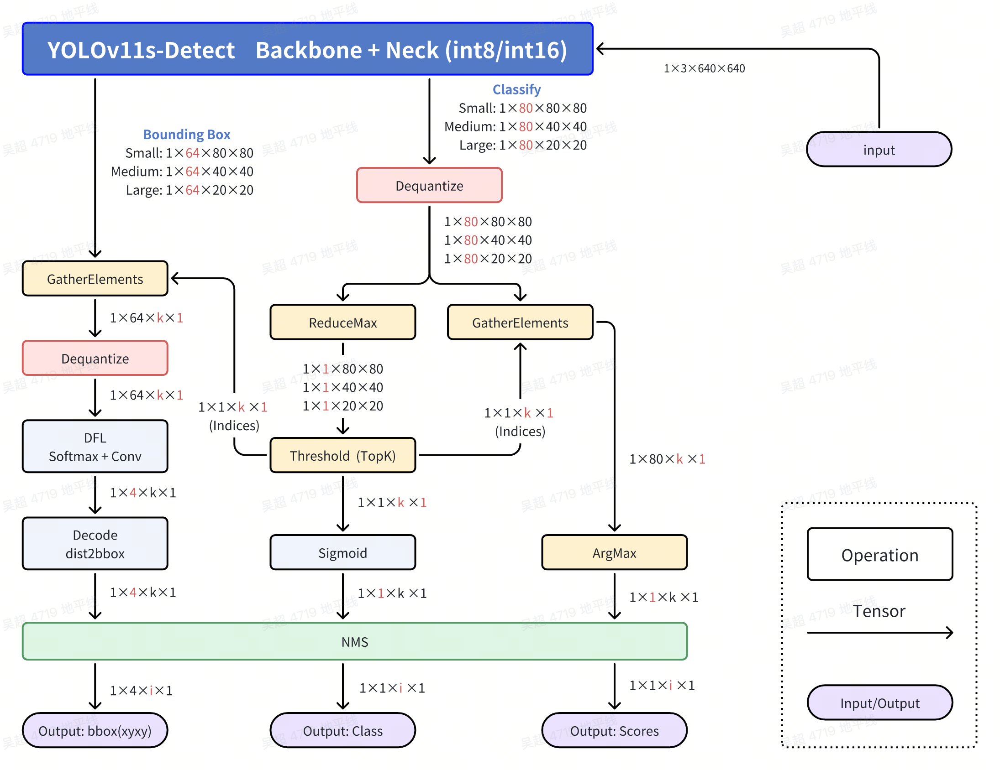
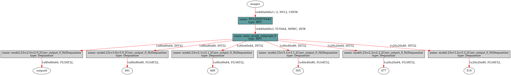

[English](./README.md) | 简体中文

# YOLOv10 Detect
- [YOLOv10 Detect](#yolov10-detect)
  - [YOLO介绍](#yolo介绍)
  - [性能数据 (简要)](#性能数据-简要)
    - [RDK X5 \& RDK X5 Module](#rdk-x5--rdk-x5-module)
  - [模型下载地址](#模型下载地址)
  - [输入输出数据](#输入输出数据)
  - [公版处理流程](#公版处理流程)
  - [优化处理流程](#优化处理流程)
  - [步骤参考](#步骤参考)
    - [环境、项目准备](#环境项目准备)
    - [导出为onnx](#导出为onnx)
    - [PTQ方案量化转化](#ptq方案量化转化)
    - [使用hb\_perf命令对bin模型进行可视化, hrt\_model\_exec命令检查bin模型的输入输出情况](#使用hb_perf命令对bin模型进行可视化-hrt_model_exec命令检查bin模型的输入输出情况)
  - [使用TROS高效部署YOLOv11](#使用tros高效部署yolov11)
    - [安装或更新tros-humble-hobot-dnn等功能包](#安装或更新tros-humble-hobot-dnn等功能包)
    - [拷贝tros-humble-hobot-dnn 的配置文件](#拷贝tros-humble-hobot-dnn-的配置文件)
    - [运行YOLOv8的推理节点](#运行yolov8的推理节点)
  - [部分编译日志参考](#部分编译日志参考)
  - [模型训练](#模型训练)
  - [性能数据](#性能数据)
    - [RDK X5 \& RDK X5 Module](#rdk-x5--rdk-x5-module-1)
    - [RDK X3 \& RDK X3 Module](#rdk-x3--rdk-x3-module)
  - [反馈](#反馈)
  - [参考](#参考)


## YOLO介绍



YOLO(You Only Look Once)是一种流行的物体检测和图像分割模型，由华盛顿大学的约瑟夫-雷德蒙（Joseph Redmon）和阿里-法哈迪（Ali Farhadi）开发。YOLO 于 2015 年推出，因其高速度和高精确度而迅速受到欢迎。

 - 2016 年发布的YOLOv2 通过纳入批量归一化、锚框和维度集群改进了原始模型。
2018 年推出的YOLOv3 使用更高效的骨干网络、多锚和空间金字塔池进一步增强了模型的性能。
 - YOLOv4于 2020 年发布，引入了 Mosaic 数据增强、新的无锚检测头和新的损失函数等创新技术。
 - YOLOv5进一步提高了模型的性能，并增加了超参数优化、集成实验跟踪和自动导出为常用导出格式等新功能。
 - YOLOv6于 2022 年由美团开源，目前已用于该公司的许多自主配送机器人。
 - YOLOv7增加了额外的任务，如 COCO 关键点数据集的姿势估计。
 - YOLOv8是YOLO 的最新版本，由Ultralytics 提供。YOLOv8 YOLOv8 支持全方位的视觉 AI 任务，包括检测、分割、姿态估计、跟踪和分类。这种多功能性使用户能够在各种应用和领域中利用YOLOv8 的功能。
 - YOLOv9 引入了可编程梯度信息(PGI) 和广义高效层聚合网络(GELAN)等创新方法。
 - YOLOv10是由清华大学的研究人员使用该软件包创建的。 UltralyticsPython 软件包创建的。该版本通过引入端到端头(End-to-End head),消除了非最大抑制(NMS)要求，实现了实时目标检测的进步。
 - YOLO11 NEW 🚀：Ultralytics的最新YOLO模型在多个任务上实现了最先进的（SOTA）性能。
  
## 性能数据 (简要)
### RDK X5 & RDK X5 Module
目标检测 Detection (COCO)
| 模型(公版) | 尺寸(像素) | 类别数 | 参数量(M)/FLOPs(B) | BPU吞吐量 | 后处理时间(Python) |
|---------|---------|-------|---------|---------|----------|
| YOLOv11n | 640×640 | 80 | 2.6 M  / 6.5 B  | 39.5 | 138.9 FPS | 5 ms |
| YOLOv11s | 640×640 | 80 | 9.4 M  / 21.5 B | 47.0 | 66.4 FPS | 5 ms |
| YOLOv11m | 640×640 | 80 | 20.1 M / 68.0 B | 51.5 | 29.2 FPS | 5 ms |
| YOLOv11l | 640×640 | 80 | 25.3 M / 86.9 B | 53.4 | 21.6 FPS | 5 ms |
| YOLOv11x | 640×640 | 80 | 56.9 M / 194.9 B| 54.7 | 10.2 FPS | 5 ms |


## 模型下载地址
请参考`./model/download.md`

## 输入输出数据
- Input: 1x3x640x640, dtype=UINT8
- Output 0: [1, 80, 80, 64], dtype=FLOAT32
- Output 1: [1, 40, 40, 64], dtype=FLOAT32
- Output 2: [1, 20, 20, 64], dtype=FLOAT32
- Output 3: [1, 80, 80, 80], dtype=FLOAT32
- Output 4: [1, 40, 40, 80], dtype=FLOAT32
- Output 5: [1, 20, 20, 80], dtype=FLOAT32


## 公版处理流程


## 优化处理流程


公版处理流程中，是会对8400个bbox完全计算分数，类别和xyxy坐标，这样才能根据GT去计算损失函数。但是我们在部署中，只需要合格的bbox就好了，并不需要对8400个bbox完全计算。
优化处理流程中，主要就是利用Sigmoid函数单调性做到了先筛选，再计算。同时利用Python的numpy的高级索引，对DFL和特征解码的部分也做到了先筛选，再计算，节约了大量的计算，从而后处理在CPU上，利用numpy，可以做到单核单帧单线程5毫秒。

 - Classify部分,Dequantize操作
在模型编译时,如果选择了移除所有的反量化算子,这里需要在后处理中手动对Classify部分的三个输出头进行反量化。查看反量化系数的方式有多种,可以查看`hb_mapper`时产物的日志,也可通过BPU推理接口的API来获取。
注意,这里每一个C维度的反量化系数都是不同的,每个头都有80个反量化系数,可以使用numpy的广播直接乘。
此处反量化在bin模型中实现,所以拿到的输出是float32的。

 - Classify部分,ReduceMax操作
ReduceMax操作是沿着Tensor的某一个维度找到最大值,此操作用于找到8400个Grid Cell的80个分数的最大值。操作对象是每个Grid Cell的80类别的值,在C维度操作。注意,这步操作给出的是最大值,并不是80个值中最大值的索引。
激活函数Sigmoid具有单调性,所以Sigmoid作用前的80个分数的大小关系和Sigmoid作用后的80个分数的大小关系不会改变。
$$Sigmoid(x)=\frac{1}{1+e^{-x}}$$
$$Sigmoid(x_1) > Sigmoid(x_2) \Leftrightarrow x_1 > x_2$$
综上,bin模型直接输出的最大值(反量化完成)的位置就是最终分数最大值的位置,bin模型输出的最大值经过Sigmoid计算后就是原来onnx模型的最大值。

 - Classify部分,Threshold（TopK）操作
此操作用于找到8400个Grid Cell中,符合要求的Grid Cell。操作对象为8400个Grid Cell,在H和W的维度操作。如果您有阅读我的程序,你会发现我将后面H和W维度拉平了,这样只是为了程序设计和书面表达的方便,它们并没有本质上的不同。
我们假设某一个Grid Cell的某一个类别的分数记为$x$,激活函数作用完的整型数据为$y$,阈值筛选的过程会给定一个阈值,记为$C$,那么此分数合格的**充分必要条件**为：
$$y=Sigmoid(x)=\frac{1}{1+e^{-x}}>C$$
由此可以得出此分数合格的**充分必要条件**为：
$$x > -ln\left(\frac{1}{C}-1\right)$$
此操作会符合条件的Grid Cell的索引（indices）和对应Grid Cell的最大值,这个最大值经过Sigmoid计算后就是这个Grid Cell对应类别的分数了。

 - Classify部分,GatherElements操作和ArgMax操作
使用Threshold(TopK)操作得到的符合条件的Grid Cell的索引(indices),在GatherElements操作中获得符合条件的Grid Cell,使用ArgMax操作得到具体是80个类别中哪一个最大,得到这个符合条件的Grid Cell的类别。

 - Bounding Box部分,GatherElements操作和Dequantize操作
使用Threshold(TopK)操作得到的符合条件的Grid Cell的索引(indices),在GatherElements操作中获得符合条件的Grid Cell,这里每一个C维度的反量化系数都是不同的,每个头都有64个反量化系数,可以使用numpy的广播直接乘,得到1×64×k×1的bbox信息。

 - Bounding Box部分,DFL：SoftMax+Conv操作
每一个Grid Cell会有4个数字来确定这个框框的位置,DFL结构会对每个框的某条边基于anchor的位置给出16个估计,对16个估计求SoftMax,然后通过一个卷积操作来求期望,这也是Anchor Free的核心设计,即每个Grid Cell仅仅负责预测1个Bounding box。假设在对某一条边偏移量的预测中,这16个数字为 $ l_p $ 或者$(t_p, t_p, b_p)$,其中$p = 0,1,...,15$那么偏移量的计算公式为：
$$\hat{l} = \sum_{p=0}^{15}{\frac{p·e^{l_p}}{S}}, S =\sum_{p=0}^{15}{e^{l_p}}$$

 - Bounding Box部分,Decode：dist2bbox(ltrb2xyxy)操作
此操作将每个Bounding Box的ltrb描述解码为xyxy描述,ltrb分别表示左上右下四条边距离相对于Grid Cell中心的距离,相对位置还原成绝对位置后,再乘以对应特征层的采样倍数,即可还原成xyxy坐标,xyxy表示Bounding Box的左上角和右下角两个点坐标的预测值。


图片输入为$Size=640$,对于Bounding box预测分支的第$i$个特征图$(i=1, 2, 3)$,对应的下采样倍数记为$Stride(i)$,在YOLOv8 - Detect中,$Stride(1)=8, Stride(2)=16, Stride(3)=32$,对应特征图的尺寸记为$n_i = {Size}/{Stride(i)}$,即尺寸为$n_1 = 80, n_2 = 40 ,n_3 = 20$三个特征图,一共有$n_1^2+n_2^2+n_3^3=8400$个Grid Cell,负责预测8400个Bounding Box。
对特征图i,第x行y列负责预测对应尺度Bounding Box的检测框,其中$x,y \in [0, n_i)\bigcap{Z}$,$Z$为整数的集合。DFL结构后的Bounding Box检测框描述为$ltrb$描述,而我们需要的是$xyxy$描述,具体的转化关系如下：
$$x_1 = (x+0.5-l)\times{Stride(i)}$$
$$y_1 = (y+0.5-t)\times{Stride(i)}$$
$$x_2 = (x+0.5+r)\times{Stride(i)}$$
$$y_1 = (y+0.5+b)\times{Stride(i)}$$

YOLOv8,v9,v11,会有一个nms操作去去掉重复识别的目标,YOLOv10不需要。最终的检测结果了,包括类别(id),分数(score)和位置(xyxy)。


## 步骤参考

注：任何No such file or directory, No module named "xxx", command not found.等报错请仔细检查，请勿逐条复制运行，如果对修改过程不理解请前往开发者社区从YOLOv5开始了解。
### 环境、项目准备
 - 下载ultralytics/ultralytics仓库，并参考ultralytics官方文档，配置好环境
```bash
git clone https://github.com/ultralytics/ultralytics.git
```
 - 进入本地仓库，下载官方的预训练权重，这里以260万参数的YOLO11n-Detect模型为例
```bash
cd ultralytics
wget https://github.com/ultralytics/assets/releases/download/v8.3.0/yolo11n.pt
```

### 导出为onnx
 - 卸载yolo相关的命令行命令，这样直接修改`./ultralytics/ultralytics`目录即可生效。
```bash
$ conda list | grep ultralytics
$ pip list | grep ultralytics # 或者
# 如果存在，则卸载
$ conda uninstall ultralytics 
$ pip uninstall ultralytics   # 或者
```
 - 修改Detect的输出头，直接将三个特征层的Bounding Box信息和Classify信息分开输出，一共6个输出头。

文件目录：./ultralytics/ultralytics/nn/modules/head.py，约第58行，`=Detect`类的forward方法替换成以下内容.
注：建议您保留好原本的`forward`方法，例如改一个其他的名字`forward_`, 方便在训练的时候换回来。
```python
def forward(self, x):
    bboxes = [self.cv2[i](x[i]).permute(0, 2, 3, 1).contiguous() for i in range(self.nl)]
    clses = [self.cv3[i](x[i]).permute(0, 2, 3, 1).contiguous() for i in range(self.nl)]
    return (bboxes, clses)
```

 - 运行以下Python脚本，如果有**No module named onnxsim**报错，安装一个即可
 - 注意，如果生成的onnx模型显示ir版本过高，可以将simplify=False。两种设置对最终bin模型没有影响，打开后可以提升onnx模型在netron中的可读性。
```python
from ultralytics import YOLO
YOLO('yolov10n.pt').export(imgsz=640, format='onnx', simplify=True, opset=11)
```

### PTQ方案量化转化
 - 参考天工开物工具链手册和OE包，对模型进行检查，所有算子均在BPU上，进行编译即可。对应的yaml文件在`./ptq_yamls`目录下。
```bash
(bpu_docker) $ hb_mapper checker --model-type onnx --march bayes-e --model yolo11n.onnx
```
 - 根据模型检查结果，找到手动量化算子Softmax, 应有这样的内容, Softmax算子将模型拆为了两个BPU子图。这里的Softmax算子名称为"/model.10/m/m.0/attn/Softmax".
```bash
/model.10/m/m.0/attn/MatMul                  BPU  id(0)     HzSQuantizedMatmul         --                 1.0        int8      
/model.10/m/m.0/attn/Mul                     BPU  id(0)     HzSQuantizedConv           --                 1.0        int8      
/model.10/m/m.0/attn/Softmax                 CPU  --        Softmax                    --                 --         float     
/model.10/m/m.0/attn/Transpose_1             BPU  id(1)     Transpose                  --                 --         int8      
/model.10/m/m.0/attn/MatMul_1                BPU  id(1)     HzSQuantizedMatmul         --                 1.0        int8      
```
在对应的yaml文件中修改以下内容:
```yaml
model_parameters:
  node_info: {"/model.10/m/m.0/attn/Softmax": {'ON': 'BPU','InputType': 'int16','OutputType': 'int16'}}
```
如果是YOLOv11的l和x模型，需要指定两个SoftMax算子到BPU上
```yaml
model_parameters:
  node_info: {"/model.10/m/m.0/attn/Softmax": {'ON': 'BPU','InputType': 'int16','OutputType': 'int16'},
              "/model.10/m/m.1/attn/Softmax": {'ON': 'BPU','InputType': 'int16','OutputType': 'int16'}}
```
 
 - 模型编译:
```bash
(bpu_docker) $ hb_mapper makertbin --model-type onnx --config yolo11_detect_bayese_640x640_nv12.yaml
```
 - 接下来得到的bin模型名称为yolov8n_instance_seg_bayese_640x640_nchw_modified.bin, 这个是最终的模型。
 - NCHW输入的模型可以使用OpenCV和numpy来准备输入数据。
 - nv12输入的模型可以使用codec, jpu, vpu, gpu等硬件设备来准备输入数据，或者直接给TROS对应的功能包使用。


### 使用hb_perf命令对bin模型进行可视化, hrt_model_exec命令检查bin模型的输入输出情况
 - hb_perf
```bash
hb_perf yolo11n_detect_bayese_640x640_nv12.bin
```
在`hb_perf_result`目录下可以找到以下结果, 可以看到，模型一共6个输出头，每个输出头会有一个CPU算子，用于作反量化计算。输入有一个YUV420转YUV444的算子，这是编译器自动帮我们实现的nv12转化算子，NCHW-YUV444会通过一个卷积算子转化为NCHW-RGB，这里对应着onnx模型的输入。

 
 - hrt_model_exec
```bash
hrt_model_exec model_info --model_file yolo11n_detect_bayese_640x640_nv12.bin
```
可以看到这个bin模型的输入输出信息
```bash
[HBRT] set log level as 0. version = 3.15.54.0
[DNN] Runtime version = 1.24.4_(3.15.54 HBRT)
[A][DNN][packed_model.cpp:247][Model](2024-09-30,20:26:23.164.884) [HorizonRT] The model builder version = 1.24.2
Load model to DDR cost 47.974ms.
This model file has 1 model:
[yolo11n_detect_bayese_640x640_nv12]
---------------------------------------------------------------------
[model name]: yolo11n_detect_bayese_640x640_nv12

input[0]: 
name: images
input source: HB_DNN_INPUT_FROM_PYRAMID
valid shape: (1,3,640,640,)
aligned shape: (1,3,640,640,)
aligned byte size: 614400
tensor type: HB_DNN_IMG_TYPE_NV12
tensor layout: HB_DNN_LAYOUT_NCHW
quanti type: NONE
stride: (0,0,0,0,)

output[0]: 
name: output0
valid shape: (1,80,80,64,)
aligned shape: (1,80,80,64,)
aligned byte size: 1638400
tensor type: HB_DNN_TENSOR_TYPE_F32
tensor layout: HB_DNN_LAYOUT_NHWC
quanti type: NONE
stride: (1638400,20480,256,4,)

output[1]: 
name: 469
valid shape: (1,40,40,64,)
aligned shape: (1,40,40,64,)
aligned byte size: 409600
tensor type: HB_DNN_TENSOR_TYPE_F32
tensor layout: HB_DNN_LAYOUT_NHWC
quanti type: NONE
stride: (409600,10240,256,4,)

output[2]: 
name: 477
valid shape: (1,20,20,64,)
aligned shape: (1,20,20,64,)
aligned byte size: 102400
tensor type: HB_DNN_TENSOR_TYPE_F32
tensor layout: HB_DNN_LAYOUT_NHWC
quanti type: NONE
stride: (102400,5120,256,4,)

output[3]: 
name: 491
valid shape: (1,80,80,80,)
aligned shape: (1,80,80,80,)
aligned byte size: 2048000
tensor type: HB_DNN_TENSOR_TYPE_F32
tensor layout: HB_DNN_LAYOUT_NHWC
quanti type: NONE
stride: (2048000,25600,320,4,)

output[4]: 
name: 505
valid shape: (1,40,40,80,)
aligned shape: (1,40,40,80,)
aligned byte size: 512000
tensor type: HB_DNN_TENSOR_TYPE_F32
tensor layout: HB_DNN_LAYOUT_NHWC
quanti type: NONE
stride: (512000,12800,320,4,)

output[5]: 
name: 519
valid shape: (1,20,20,80,)
aligned shape: (1,20,20,80,)
aligned byte size: 128000
tensor type: HB_DNN_TENSOR_TYPE_F32
tensor layout: HB_DNN_LAYOUT_NHWC
quanti type: NONE
stride: (128000,6400,320,4,)
```

## 使用TROS高效部署YOLOv11

### 安装或更新tros-humble-hobot-dnn等功能包
```bash
sudo apt update # 确保有地瓜apt源
sudo apt install -y tros*-dnn-node* tros*-hobot-usb-cam tros*-hobot-codec
```
### 拷贝tros-humble-hobot-dnn 的配置文件
```bash
cp -r /opt/tros/humble/lib/dnn_node_example/config .
```
配置为以下内容
```json
{
        "model_file": "yourself.bin",
        "dnn_Parser": "yolov8",
        "model_output_count": 6,
        "reg_max": 16,
        "class_num": 80,
        "cls_names_list": "config/coco.list",
        "strides": [8, 16, 32],
        "score_threshold": 0.25,
        "nms_threshold": 0.7,
        "nms_top_k": 300
}
```

### 运行YOLOv8的推理节点
注：YOLOv11的后处理与YOLOv8相同，可以直接使用YOLOv8的推理节点
```bash
# 配置MIPI摄像头
export CAM_TYPE=mipi

# 配置USB摄像头
# export CAM_TYPE=usb

# 启动launch文件
ros2 launch dnn_node_example dnn_node_example.launch.py dnn_example_config_file:=config/my_workconfig.json
```
具体内容请参考TROS手册：https://developer.d-robotics.cc/rdk_doc/Robot_development/boxs/detection/yolo

## 部分编译日志参考

可以观察到, SoftMax算子已经被BPU支持, 余弦相似度保持在0.95以上, 整个bin模型只有一个BPU子图。
```bash
2024-09-30 12:47:28,752 file: model_builder.py func: model_builder line No: 32 Start to Horizon NN Model Convert.
2024-09-30 12:47:28,859 file: model_debugger.py func: model_debugger line No: 66 Loading horizon_nn debug methods:[]
2024-09-30 12:47:28,859 file: quantization_config.py func: quantization_config line No: 294 The input of node /model.10/m/m.0/attn/Softmax are set to : int16
2024-09-30 12:47:28,859 file: quantization_config.py func: quantization_config line No: 315 The output of node /model.10/m/m.0/attn/Softmax are set to : int16
2024-09-30 12:47:28,859 file: quantization_config.py func: quantization_config line No: 327 There are 1 nodes designated to run on the bpu: ['/model.10/m/m.0/attn/Softmax'].
2024-09-30 12:47:28,860 file: input_dict_parser.py func: input_dict_parser line No: 240 input images is from pyramid. Its layout is set to NHWC
2024-09-30 12:47:28,860 file: model_builder.py func: model_builder line No: 189 The specified model compilation architecture: bayes-e.
2024-09-30 12:47:28,860 file: model_builder.py func: model_builder line No: 193 The specified model compilation optimization parameters: [].
2024-09-30 12:47:28,860 file: model_builder.py func: model_builder line No: 32 Start to prepare the onnx model.
2024-09-30 12:47:28,936 file: prepare.py func: prepare line No: 145 Input ONNX Model Information:
ONNX IR version:          9
Opset version:            ['ai.onnx v11', 'horizon v1']
Producer:                 pytorch v2.1.1
Domain:                   None
Model version:            None
Graph input:
    images:               shape=[1, 3, 640, 640], dtype=FLOAT32
Graph output:
    output0:              shape=[1, 80, 80, 64], dtype=FLOAT32
    469:                  shape=[1, 40, 40, 64], dtype=FLOAT32
    477:                  shape=[1, 20, 20, 64], dtype=FLOAT32
    491:                  shape=[1, 80, 80, 80], dtype=FLOAT32
    505:                  shape=[1, 40, 40, 80], dtype=FLOAT32
    519:                  shape=[1, 20, 20, 80], dtype=FLOAT32
2024-09-30 12:47:29,251 file: model_builder.py func: model_builder line No: 35 End to prepare the onnx model.
2024-09-30 12:47:29,285 file: model_builder.py func: model_builder line No: 239 Saving model to: yolo11n_detect_bayese_640x640_nv12_original_float_model.onnx.
2024-09-30 12:47:29,285 file: model_builder.py func: model_builder line No: 32 Start to optimize the onnx model.
2024-09-30 12:47:29,470 file: constant_folding.py func: constant_folding line No: 66 Summary info for constant_folding:
2024-09-30 12:47:29,471 file: constant_folding.py func: constant_folding line No: 67   After constant_folding, the number of nodes has changed from 303 to 303.
2024-09-30 12:47:29,471 file: constant_folding.py func: constant_folding line No: 71   After constant_folding, the number of parameters has changed from 2616265 to 2616265.
2024-09-30 12:47:29,471 file: constant_folding.py func: constant_folding line No: 76 Detailed info for constant_folding:
2024-09-30 12:47:29,471 file: constant_folding.py func: constant_folding line No: 88 
2024-09-30 12:47:29,815 file: model_builder.py func: model_builder line No: 35 End to optimize the onnx model.
2024-09-30 12:47:29,843 file: model_builder.py func: model_builder line No: 239 Saving model to: yolo11n_detect_bayese_640x640_nv12_optimized_float_model.onnx.
2024-09-30 12:47:29,843 file: model_builder.py func: model_builder line No: 32 Start to calibrate the model.
2024-09-30 12:47:30,007 file: tool_utils.py func: tool_utils line No: 321 The input1 of Node(name:/model.10/m/m.0/attn/MatMul_1, type:MatMul) does not support data type: int16
2024-09-30 12:47:30,056 file: calibration_data_set.py func: calibration_data_set line No: 82 input name: images,  number_of_samples: 50
2024-09-30 12:47:30,056 file: calibration_data_set.py func: calibration_data_set line No: 96 There are 50 samples in the calibration data set.
2024-09-30 12:47:30,056 file: infer_thresholds.py func: infer_thresholds line No: 84 Run calibration model with default calibration method.
2024-09-30 12:47:30,654 file: base.py func: base line No: 138 Calibration using batch 8
2024-09-30 12:47:35,004 file: ort.py func: ort line No: 212 Reset batch_size=1 and execute forward again...
2024-09-30 12:53:12,061 file: modelwise_search.py func: modelwise_search line No: 75 Select max-percentile:percentile=0.99995 method.
2024-09-30 12:53:12,943 file: model_builder.py func: model_builder line No: 35 End to calibrate the model.
2024-09-30 12:53:13,097 file: model_builder.py func: model_builder line No: 239 Saving model to: yolo11n_detect_bayese_640x640_nv12_calibrated_model.onnx.
2024-09-30 12:53:13,098 file: model_builder.py func: model_builder line No: 32 Start to quantize the model.
2024-09-30 12:53:16,002 file: constant_folding.py func: constant_folding line No: 66 Summary info for constant_folding:
2024-09-30 12:53:16,002 file: constant_folding.py func: constant_folding line No: 67   After constant_folding, the number of nodes has changed from 257 to 257.
2024-09-30 12:53:16,002 file: constant_folding.py func: constant_folding line No: 71   After constant_folding, the number of parameters has changed from 2644673 to 2644673.
2024-09-30 12:53:16,002 file: constant_folding.py func: constant_folding line No: 76 Detailed info for constant_folding:
2024-09-30 12:53:16,002 file: constant_folding.py func: constant_folding line No: 88 
2024-09-30 12:53:16,852 file: model_builder.py func: model_builder line No: 35 End to quantize the model.
2024-09-30 12:53:17,108 file: model_builder.py func: model_builder line No: 239 Saving model to: yolo11n_detect_bayese_640x640_nv12_quantized_model.onnx.
2024-09-30 12:53:17,108 file: model_builder.py func: model_builder line No: 32 Start to compile the model with march bayes-e.
2024-09-30 12:53:18,199 file: hybrid_build.py func: hybrid_build line No: 110 Compile submodel: main_graph_subgraph_0
2024-09-30 12:53:18,386 file: hbdk_cc.py func: hbdk_cc line No: 126 hbdk-cc parameters:['--O3', '--core-num', '1', '--fast', '--input-layout', 'NHWC', '--output-layout', 'NHWC', '--input-source', 'pyramid']
2024-09-30 12:53:18,386 file: hbdk_cc.py func: hbdk_cc line No: 127 hbdk-cc command used:hbdk-cc -f hbir -m /tmp/tmpm3dpo46c/main_graph_subgraph_0.hbir -o /tmp/tmpm3dpo46c/main_graph_subgraph_0.hbm --march bayes-e --progressbar --O3 --core-num 1 --fast --input-layout NHWC --output-layout NHWC --input-source pyramid
2024-09-30 12:57:10,610 file: tool_utils.py func: tool_utils line No: 326 consumed time 232.202
2024-09-30 12:57:10,702 file: tool_utils.py func: tool_utils line No: 326 FPS=141.88, latency = 7048.0 us, DDR = 21471792 bytes   (see main_graph_subgraph_0.html)
2024-09-30 12:57:10,780 file: model_builder.py func: model_builder line No: 35 End to compile the model with march bayes-e.
2024-09-30 12:57:14,450 file: print_info_dict.py func: print_info_dict line No: 72 The main quantized node information:
======================================================================================================================================
Node                                                ON   Subgraph  Type                       Cosine Similarity  Threshold  DataType  
--------------------------------------------------------------------------------------------------------------------------------------
HZ_PREPROCESS_FOR_images                            BPU  id(0)     HzSQuantizedPreprocess     0.999761           127.0      int8      
/model.0/conv/Conv                                  BPU  id(0)     HzSQuantizedConv           0.999393           1.11671    int8      
/model.0/act/Mul                                    BPU  id(0)     HzLut                      0.999238           39.4061    int8      
/model.1/conv/Conv                                  BPU  id(0)     HzSQuantizedConv           0.996447           37.3642    int8      
/model.1/act/Mul                                    BPU  id(0)     HzLut                      0.995745           71.8498    int8      
/model.2/cv1/conv/Conv                              BPU  id(0)     HzSQuantizedConv           0.992530           63.9338    int8      
/model.2/cv1/act/Mul                                BPU  id(0)     HzLut                      0.991512           59.0739    int8      
/model.2/Split                                      BPU  id(0)     Split                      0.992257           30.3099    int8      
/model.2/m.0/cv1/conv/Conv                          BPU  id(0)     HzSQuantizedConv           0.995727           30.3099    int8      
/model.2/m.0/cv1/act/Mul                            BPU  id(0)     HzLut                      0.997227           9.43394    int8      
/model.2/m.0/cv2/conv/Conv                          BPU  id(0)     HzSQuantizedConv           0.986904           2.17591    int8      
/model.2/m.0/cv2/act/Mul                            BPU  id(0)     HzLut                      0.991174           22.4394    int8      
/model.2/m.0/Add                                    BPU  id(0)     HzSElementwiseAdd          0.992888           30.3099    int8      
/model.2/Split_output_0_calibrated_Requantize       BPU  id(0)     HzRequantize               --                 --         int8      
/model.2/Split_output_1_calibrated_Requantize       BPU  id(0)     HzRequantize               --                 --         int8      
/model.2/Concat                                     BPU  id(0)     Concat                     0.992446           30.3099    int8      
/model.2/cv2/conv/Conv                              BPU  id(0)     HzSQuantizedConv           0.985694           30.4676    int8      
/model.2/cv2/act/Mul                                BPU  id(0)     HzLut                      0.982677           30.847     int8      
/model.3/conv/Conv                                  BPU  id(0)     HzSQuantizedConv           0.985608           10.3835    int8      
/model.3/act/Mul                                    BPU  id(0)     HzLut                      0.992435           10.6253    int8      
/model.4/cv1/conv/Conv                              BPU  id(0)     HzSQuantizedConv           0.991213           8.33849    int8      
/model.4/cv1/act/Mul                                BPU  id(0)     HzLut                      0.991021           8.73138    int8      
/model.4/Split                                      BPU  id(0)     Split                      0.991060           3.63883    int8      
/model.4/m.0/cv1/conv/Conv                          BPU  id(0)     HzSQuantizedConv           0.990568           3.63883    int8      
/model.4/m.0/cv1/act/Mul                            BPU  id(0)     HzLut                      0.992781           3.8372     int8      
/model.4/m.0/cv2/conv/Conv                          BPU  id(0)     HzSQuantizedConv           0.994086           3.15783    int8      
/model.4/m.0/cv2/act/Mul                            BPU  id(0)     HzLut                      0.994592           6.25757    int8      
/model.4/m.0/Add                                    BPU  id(0)     HzSElementwiseAdd          0.995804           3.63883    int8      
/model.4/Split_output_0_calibrated_Requantize       BPU  id(0)     HzRequantize               --                 --         int8      
/model.4/Split_output_1_calibrated_Requantize       BPU  id(0)     HzRequantize               --                 --         int8      
/model.4/Concat                                     BPU  id(0)     Concat                     0.994580           3.63883    int8      
/model.4/cv2/conv/Conv                              BPU  id(0)     HzSQuantizedConv           0.986469           5.84502    int8      
/model.4/cv2/act/Mul                                BPU  id(0)     HzLut                      0.983731           6.30494    int8      
/model.5/conv/Conv                                  BPU  id(0)     HzSQuantizedConv           0.988337           3.07891    int8      
/model.5/act/Mul                                    BPU  id(0)     HzLut                      0.990836           6.11488    int8      
/model.6/cv1/conv/Conv                              BPU  id(0)     HzSQuantizedConv           0.983886           3.6477     int8      
/model.6/cv1/act/Mul                                BPU  id(0)     HzLut                      0.978171           8.083      int8      
/model.6/Split                                      BPU  id(0)     Split                      0.975499           4.7098     int8      
/model.6/m.0/cv1/conv/Conv                          BPU  id(0)     HzSQuantizedConv           0.992811           4.7098     int8      
/model.6/m.0/cv2/conv/Conv                          BPU  id(0)     HzSQuantizedConv           0.976340           4.7098     int8      
/model.6/m.0/cv1/act/Mul                            BPU  id(0)     HzLut                      0.993426           3.78941    int8      
/model.6/m.0/cv2/act/Mul                            BPU  id(0)     HzLut                      0.969798           8.62786    int8      
/model.6/m.0/m/m.0/cv1/conv/Conv                    BPU  id(0)     HzSQuantizedConv           0.990157           2.98076    int8      
/model.6/m.0/m/m.0/cv1/act/Mul                      BPU  id(0)     HzLut                      0.983061           5.0287     int8      
/model.6/m.0/m/m.0/cv2/conv/Conv                    BPU  id(0)     HzSQuantizedConv           0.992061           4.10316    int8      
/model.6/m.0/m/m.0/cv2/act/Mul                      BPU  id(0)     HzLut                      0.992884           5.47468    int8      
/model.6/m.0/m/m.0/Add                              BPU  id(0)     HzSElementwiseAdd          0.994587           2.98076    int8      
/model.6/m.0/m/m.1/cv1/conv/Conv                    BPU  id(0)     HzSQuantizedConv           0.993124           5.51232    int8      
/model.6/m.0/m/m.1/cv1/act/Mul                      BPU  id(0)     HzLut                      0.987975           5.07841    int8      
/model.6/m.0/m/m.1/cv2/conv/Conv                    BPU  id(0)     HzSQuantizedConv           0.995504           3.77094    int8      
/model.6/m.0/m/m.1/cv2/act/Mul                      BPU  id(0)     HzLut                      0.995514           7.72941    int8      
/model.6/m.0/m/m.1/Add                              BPU  id(0)     HzSElementwiseAdd          0.996780           5.51232    int8      
/model.6/m.0/Concat                                 BPU  id(0)     Concat                     0.994634           8.68742    int8      
/model.6/m.0/cv3/conv/Conv                          BPU  id(0)     HzSQuantizedConv           0.985882           8.68742    int8      
/model.6/m.0/cv3/act/Mul                            BPU  id(0)     HzLut                      0.980573           6.90464    int8      
/model.6/Split_output_0_calibrated_Requantize       BPU  id(0)     HzRequantize               --                 --         int8      
/model.6/Split_output_1_calibrated_Requantize       BPU  id(0)     HzRequantize               --                 --         int8      
/model.6/Concat                                     BPU  id(0)     Concat                     0.978892           4.7098     int8      
/model.6/cv2/conv/Conv                              BPU  id(0)     HzSQuantizedConv           0.986743           5.60187    int8      
/model.6/cv2/act/Mul                                BPU  id(0)     HzLut                      0.983158           6.36244    int8      
/model.7/conv/Conv                                  BPU  id(0)     HzSQuantizedConv           0.988712           4.15027    int8      
/model.7/act/Mul                                    BPU  id(0)     HzLut                      0.979654           6.59553    int8      
/model.8/cv1/conv/Conv                              BPU  id(0)     HzSQuantizedConv           0.984628           4.18316    int8      
/model.8/cv1/act/Mul                                BPU  id(0)     HzLut                      0.977260           7.46315    int8      
/model.8/Split                                      BPU  id(0)     Split                      0.975370           5.29825    int8      
/model.8/m.0/cv1/conv/Conv                          BPU  id(0)     HzSQuantizedConv           0.990732           5.29825    int8      
/model.8/m.0/cv2/conv/Conv                          BPU  id(0)     HzSQuantizedConv           0.976388           5.29825    int8      
/model.8/m.0/cv1/act/Mul                            BPU  id(0)     HzLut                      0.987156           8.14473    int8      
/model.8/m.0/cv2/act/Mul                            BPU  id(0)     HzLut                      0.973784           9.31657    int8      
/model.8/m.0/m/m.0/cv1/conv/Conv                    BPU  id(0)     HzSQuantizedConv           0.986798           3.67307    int8      
/model.8/m.0/m/m.0/cv1/act/Mul                      BPU  id(0)     HzLut                      0.969238           8.79014    int8      
/model.8/m.0/m/m.0/cv2/conv/Conv                    BPU  id(0)     HzSQuantizedConv           0.978663           7.52313    int8      
/model.8/m.0/m/m.0/cv2/act/Mul                      BPU  id(0)     HzLut                      0.977486           8.67875    int8      
/model.8/m.0/m/m.0/Add                              BPU  id(0)     HzSElementwiseAdd          0.982365           3.67307    int8      
/model.8/m.0/m/m.1/cv1/conv/Conv                    BPU  id(0)     HzSQuantizedConv           0.983665           7.23272    int8      
/model.8/m.0/m/m.1/cv1/act/Mul                      BPU  id(0)     HzLut                      0.982238           8.44175    int8      
/model.8/m.0/m/m.1/cv2/conv/Conv                    BPU  id(0)     HzSQuantizedConv           0.985959           7.07258    int8      
/model.8/m.0/m/m.1/cv2/act/Mul                      BPU  id(0)     HzLut                      0.987920           10.85      int8      
/model.8/m.0/m/m.1/Add                              BPU  id(0)     HzSElementwiseAdd          0.988832           7.23272    int8      
/model.8/m.0/Concat                                 BPU  id(0)     Concat                     0.987048           10.4405    int8      
/model.8/m.0/cv3/conv/Conv                          BPU  id(0)     HzSQuantizedConv           0.983713           10.4405    int8      
/model.8/m.0/cv3/act/Mul                            BPU  id(0)     HzLut                      0.975618           8.00525    int8      
/model.8/Split_output_0_calibrated_Requantize       BPU  id(0)     HzRequantize               --                 --         int8      
/model.8/Split_output_1_calibrated_Requantize       BPU  id(0)     HzRequantize               --                 --         int8      
/model.8/Concat                                     BPU  id(0)     Concat                     0.976311           5.29825    int8      
/model.8/cv2/conv/Conv                              BPU  id(0)     HzSQuantizedConv           0.982802           5.81138    int8      
/model.8/cv2/act/Mul                                BPU  id(0)     HzLut                      0.980165           8.45778    int8      
/model.9/cv1/conv/Conv                              BPU  id(0)     HzSQuantizedConv           0.997046           5.28638    int8      
/model.9/cv1/act/Mul                                BPU  id(0)     HzLut                      0.996124           6.04329    int8      
/model.9/m/MaxPool                                  BPU  id(0)     HzQuantizedMaxPool         0.998007           7.38902    int8      
/model.9/m_1/MaxPool                                BPU  id(0)     HzQuantizedMaxPool         0.998716           7.38902    int8      
/model.9/m_2/MaxPool                                BPU  id(0)     HzQuantizedMaxPool         0.999092           7.38902    int8      
/model.9/Concat                                     BPU  id(0)     Concat                     0.998372           7.38902    int8      
/model.9/cv2/conv/Conv                              BPU  id(0)     HzSQuantizedConv           0.994232           7.38902    int8      
/model.9/cv2/act/Mul                                BPU  id(0)     HzLut                      0.982942           7.53176    int8      
/model.10/cv1/conv/Conv                             BPU  id(0)     HzSQuantizedConv           0.978277           4.93845    int8      
/model.10/cv1/act/Mul                               BPU  id(0)     HzLut                      0.978161           8.91998    int8      
/model.10/Split                                     BPU  id(0)     Split                      0.969536           7.72851    int8      
/model.10/m/m.0/attn/qkv/conv/Conv                  BPU  id(0)     HzSQuantizedConv           0.980026           7.72851    int8      
/model.10/m/m.0/attn/Reshape                        BPU  id(0)     Reshape                    0.980026           7.32172    int8      
/model.10/m/m.0/attn/Split                          BPU  id(0)     Split                      0.984775           7.32172    int8      
/model.10/m/m.0/attn/Transpose                      BPU  id(0)     Transpose                  0.984775           --         int8      
/model.10/m/m.0/attn/Reshape_2                      BPU  id(0)     Reshape                    0.978787           --         int8      
/model.10/m/m.0/attn/MatMul                         BPU  id(0)     HzSQuantizedMatmul         0.980598           7.32172    int8      
/model.10/m/m.0/attn/Mul                            BPU  id(0)     HzSQuantizedConv           0.980595           71.25      int8      
...0/attn/Softmax_reducemax_FROM_QUANTIZED_SOFTMAX  BPU  id(0)     HzQuantizedReduceMax       0.996334           12.5953    int16     
...0/m/m.0/attn/Softmax_sub_FROM_QUANTIZED_SOFTMAX  BPU  id(0)     HzSElementwiseSub          0.985975           12.5953    int16     
...0/m/m.0/attn/Softmax_exp_FROM_QUANTIZED_SOFTMAX  BPU  id(0)     HzLut2Layer                0.965891           11.0903    int16     
...0/attn/Softmax_reducesum_FROM_QUANTIZED_SOFTMAX  BPU  id(0)     HzSQuantizedReduceSum      0.987287           1.0        int16     
.../attn/Softmax_reciprocal_FROM_QUANTIZED_SOFTMAX  BPU  id(0)     HzLut2Layer                0.962614           154.198    int16     
...0/m/m.0/attn/Softmax_mul_FROM_QUANTIZED_SOFTMAX  BPU  id(0)     HzSElementwiseMul          0.955308           1.0        int16     
/model.10/m/m.0/attn/Transpose_1                    BPU  id(0)     Transpose                  0.955309           0.319208   int8      
/model.10/m/m.0/attn/MatMul_1                       BPU  id(0)     HzSQuantizedMatmul         0.983485           0.319208   int8      
/model.10/m/m.0/attn/Reshape_1                      BPU  id(0)     Reshape                    0.983485           6.21897    int8      
/model.10/m/m.0/attn/pe/conv/Conv                   BPU  id(0)     HzSQuantizedConv           0.978828           7.32172    int8      
/model.10/m/m.0/attn/proj/conv/Conv                 BPU  id(0)     HzSQuantizedConv           0.958753           3.48163    int8      
/model.10/m/m.0/ffn/ffn.0/conv/Conv                 BPU  id(0)     HzSQuantizedConv           0.991027           8.64989    int8      
/model.10/m/m.0/ffn/ffn.0/act/Mul                   BPU  id(0)     HzLut                      0.976932           6.566      int8      
/model.10/m/m.0/ffn/ffn.1/conv/Conv                 BPU  id(0)     HzSQuantizedConv           0.960973           3.14943    int8      
/model.10/Split_output_0_calibrated_Requantize      BPU  id(0)     HzRequantize               --                 --         int8      
/model.10/Concat                                    BPU  id(0)     Concat                     0.969161           7.72851    int8      
/model.10/cv2/conv/Conv                             BPU  id(0)     HzSQuantizedConv           0.987433           8.20165    int8      
/model.10/cv2/act/Mul                               BPU  id(0)     HzLut                      0.974811           8.95916    int8      
/model.11/Resize                                    BPU  id(0)     HzQuantizedResizeUpsample  0.974816           4.94341    int8      
/model.11/Resize_output_0_calibrated_Requantize     BPU  id(0)     HzRequantize               --                 --         int8      
...el.6/cv2/act/Mul_output_0_calibrated_Requantize  BPU  id(0)     HzRequantize               --                 --         int8      
/model.12/Concat                                    BPU  id(0)     Concat                     0.977764           4.94341    int8      
/model.13/cv1/conv/Conv                             BPU  id(0)     HzSQuantizedConv           0.988461           4.78533    int8      
/model.13/cv1/act/Mul                               BPU  id(0)     HzLut                      0.986347           6.07126    int8      
/model.13/Split                                     BPU  id(0)     Split                      0.989110           3.71593    int8      
/model.13/m.0/cv1/conv/Conv                         BPU  id(0)     HzSQuantizedConv           0.988744           3.71593    int8      
/model.13/m.0/cv1/act/Mul                           BPU  id(0)     HzLut                      0.988606           4.50702    int8      
/model.13/m.0/cv2/conv/Conv                         BPU  id(0)     HzSQuantizedConv           0.985706           3.77763    int8      
/model.13/m.0/cv2/act/Mul                           BPU  id(0)     HzLut                      0.988462           6.59945    int8      
/model.13/m.0/Add                                   BPU  id(0)     HzSElementwiseAdd          0.989222           3.71593    int8      
/model.13/Split_output_0_calibrated_Requantize      BPU  id(0)     HzRequantize               --                 --         int8      
/model.13/Split_output_1_calibrated_Requantize      BPU  id(0)     HzRequantize               --                 --         int8      
/model.13/Concat                                    BPU  id(0)     Concat                     0.987876           3.71593    int8      
/model.13/cv2/conv/Conv                             BPU  id(0)     HzSQuantizedConv           0.988880           4.75513    int8      
/model.13/cv2/act/Mul                               BPU  id(0)     HzLut                      0.983813           5.73944    int8      
/model.14/Resize                                    BPU  id(0)     HzQuantizedResizeUpsample  0.983803           3.30647    int8      
/model.14/Resize_output_0_calibrated_Requantize     BPU  id(0)     HzRequantize               --                 --         int8      
...el.4/cv2/act/Mul_output_0_calibrated_Requantize  BPU  id(0)     HzRequantize               --                 --         int8      
/model.15/Concat                                    BPU  id(0)     Concat                     0.983539           3.30647    int8      
/model.16/cv1/conv/Conv                             BPU  id(0)     HzSQuantizedConv           0.993958           2.99206    int8      
/model.16/cv1/act/Mul                               BPU  id(0)     HzLut                      0.996099           5.27966    int8      
/model.16/Split                                     BPU  id(0)     Split                      0.995161           2.46678    int8      
/model.16/m.0/cv1/conv/Conv                         BPU  id(0)     HzSQuantizedConv           0.989346           2.46678    int8      
/model.16/m.0/cv1/act/Mul                           BPU  id(0)     HzLut                      0.993471           3.61891    int8      
/model.16/m.0/cv2/conv/Conv                         BPU  id(0)     HzSQuantizedConv           0.987653           3.35749    int8      
/model.16/m.0/cv2/act/Mul                           BPU  id(0)     HzLut                      0.991904           6.57569    int8      
/model.16/m.0/Add                                   BPU  id(0)     HzSElementwiseAdd          0.992828           2.46678    int8      
/model.16/Split_output_0_calibrated_Requantize      BPU  id(0)     HzRequantize               --                 --         int8      
/model.16/Split_output_1_calibrated_Requantize      BPU  id(0)     HzRequantize               --                 --         int8      
/model.16/Concat                                    BPU  id(0)     Concat                     0.994546           2.46678    int8      
/model.16/cv2/conv/Conv                             BPU  id(0)     HzSQuantizedConv           0.991002           3.72278    int8      
/model.16/cv2/act/Mul                               BPU  id(0)     HzLut                      0.993470           5.90382    int8      
/model.17/conv/Conv                                 BPU  id(0)     HzSQuantizedConv           0.986840           3.22176    int8      
/model.23/cv2.0/cv2.0.0/conv/Conv                   BPU  id(0)     HzSQuantizedConv           0.987314           3.22176    int8      
/model.23/cv3.0/cv3.0.0/cv3.0.0.0/conv/Conv         BPU  id(0)     HzSQuantizedConv           0.998249           3.22176    int8      
/model.17/act/Mul                                   BPU  id(0)     HzLut                      0.983275           5.51073    int8      
/model.23/cv2.0/cv2.0.0/act/Mul                     BPU  id(0)     HzLut                      0.985141           7.79426    int8      
/model.23/cv3.0/cv3.0.0/cv3.0.0.0/act/Mul           BPU  id(0)     HzLut                      0.998788           6.10244    int8      
/model.18/Concat                                    BPU  id(0)     Concat                     0.983579           3.30647    int8      
/model.23/cv2.0/cv2.0.1/conv/Conv                   BPU  id(0)     HzSQuantizedConv           0.974319           3.42345    int8      
/model.23/cv3.0/cv3.0.0/cv3.0.0.1/conv/Conv         BPU  id(0)     HzSQuantizedConv           0.987381           4.65344    int8      
/model.19/cv1/conv/Conv                             BPU  id(0)     HzSQuantizedConv           0.986139           3.30647    int8      
/model.23/cv2.0/cv2.0.1/act/Mul                     BPU  id(0)     HzLut                      0.977009           30.4902    int8      
/model.23/cv3.0/cv3.0.0/cv3.0.0.1/act/Mul           BPU  id(0)     HzLut                      0.983935           5.92542    int8      
/model.19/cv1/act/Mul                               BPU  id(0)     HzLut                      0.985027           5.54872    int8      
/model.23/cv2.0/cv2.0.2/Conv                        BPU  id(0)     HzSQuantizedConv           0.992660           30.4683    int8      
/model.23/cv3.0/cv3.0.1/cv3.0.1.0/conv/Conv         BPU  id(0)     HzSQuantizedConv           0.995845           5.5708     int8      
/model.19/Split                                     BPU  id(0)     Split                      0.982556           3.96869    int8      
/model.19/m.0/cv1/conv/Conv                         BPU  id(0)     HzSQuantizedConv           0.987297           3.96869    int8      
/model.23/cv3.0/cv3.0.1/cv3.0.1.0/act/Mul           BPU  id(0)     HzLut                      0.995598           5.85514    int8      
/model.23/cv3.0/cv3.0.1/cv3.0.1.1/conv/Conv         BPU  id(0)     HzSQuantizedConv           0.980190           5.20921    int8      
/model.19/m.0/cv1/act/Mul                           BPU  id(0)     HzLut                      0.990751           6.38543    int8      
/model.19/m.0/cv2/conv/Conv                         BPU  id(0)     HzSQuantizedConv           0.976757           4.74476    int8      
/model.23/cv3.0/cv3.0.1/cv3.0.1.1/act/Mul           BPU  id(0)     HzLut                      0.985263           26.1784    int8      
/model.23/cv3.0/cv3.0.2/Conv                        BPU  id(0)     HzSQuantizedConv           0.999806           23.8909    int8      
/model.19/m.0/cv2/act/Mul                           BPU  id(0)     HzLut                      0.976339           9.16109    int8      
/model.19/m.0/Add                                   BPU  id(0)     HzSElementwiseAdd          0.976811           3.96869    int8      
/model.19/Split_output_0_calibrated_Requantize      BPU  id(0)     HzRequantize               --                 --         int8      
/model.19/Split_output_1_calibrated_Requantize      BPU  id(0)     HzRequantize               --                 --         int8      
/model.19/Concat                                    BPU  id(0)     Concat                     0.979973           3.96869    int8      
/model.19/cv2/conv/Conv                             BPU  id(0)     HzSQuantizedConv           0.984651           5.91035    int8      
/model.19/cv2/act/Mul                               BPU  id(0)     HzLut                      0.981582           7.7809     int8      
/model.20/conv/Conv                                 BPU  id(0)     HzSQuantizedConv           0.984363           4.14417    int8      
/model.23/cv2.1/cv2.1.0/conv/Conv                   BPU  id(0)     HzSQuantizedConv           0.979823           4.14417    int8      
/model.23/cv3.1/cv3.1.0/cv3.1.0.0/conv/Conv         BPU  id(0)     HzSQuantizedConv           0.993887           4.14417    int8      
/model.20/act/Mul                                   BPU  id(0)     HzLut                      0.976112           6.96854    int8      
/model.23/cv2.1/cv2.1.0/act/Mul                     BPU  id(0)     HzLut                      0.965504           13.0348    int8      
/model.23/cv3.1/cv3.1.0/cv3.1.0.0/act/Mul           BPU  id(0)     HzLut                      0.994163           7.11306    int8      
/model.21/Concat                                    BPU  id(0)     Concat                     0.975206           4.94341    int8      
/model.23/cv2.1/cv2.1.1/conv/Conv                   BPU  id(0)     HzSQuantizedConv           0.967981           6.49638    int8      
/model.23/cv3.1/cv3.1.0/cv3.1.0.1/conv/Conv         BPU  id(0)     HzSQuantizedConv           0.981275           6.67258    int8      
/model.22/cv1/conv/Conv                             BPU  id(0)     HzSQuantizedConv           0.979492           4.94341    int8      
/model.23/cv2.1/cv2.1.1/act/Mul                     BPU  id(0)     HzLut                      0.971353           31.211     int8      
/model.23/cv3.1/cv3.1.0/cv3.1.0.1/act/Mul           BPU  id(0)     HzLut                      0.973697           8.84567    int8      
/model.22/cv1/act/Mul                               BPU  id(0)     HzLut                      0.961878           7.79788    int8      
/model.23/cv2.1/cv2.1.2/Conv                        BPU  id(0)     HzSQuantizedConv           0.991685           31.2049    int8      
/model.23/cv3.1/cv3.1.1/cv3.1.1.0/conv/Conv         BPU  id(0)     HzSQuantizedConv           0.987852           6.83263    int8      
/model.22/Split                                     BPU  id(0)     Split                      0.971116           5.70576    int8      
/model.22/m.0/cv1/conv/Conv                         BPU  id(0)     HzSQuantizedConv           0.992612           5.70576    int8      
/model.22/m.0/cv2/conv/Conv                         BPU  id(0)     HzSQuantizedConv           0.972329           5.70576    int8      
/model.23/cv3.1/cv3.1.1/cv3.1.1.0/act/Mul           BPU  id(0)     HzLut                      0.991579           7.24524    int8      
/model.23/cv3.1/cv3.1.1/cv3.1.1.1/conv/Conv         BPU  id(0)     HzSQuantizedConv           0.978544           6.00108    int8      
/model.22/m.0/cv1/act/Mul                           BPU  id(0)     HzLut                      0.993224           4.15775    int8      
/model.22/m.0/cv2/act/Mul                           BPU  id(0)     HzLut                      0.968365           7.04795    int8      
/model.22/m.0/m/m.0/cv1/conv/Conv                   BPU  id(0)     HzSQuantizedConv           0.991794           1.37206    int8      
/model.23/cv3.1/cv3.1.1/cv3.1.1.1/act/Mul           BPU  id(0)     HzLut                      0.982657           44.3523    int8      
/model.23/cv3.1/cv3.1.2/Conv                        BPU  id(0)     HzSQuantizedConv           0.999583           41.5078    int8      
/model.22/m.0/m/m.0/cv1/act/Mul                     BPU  id(0)     HzLut                      0.986903           6.18452    int8      
/model.22/m.0/m/m.0/cv2/conv/Conv                   BPU  id(0)     HzSQuantizedConv           0.991221           4.43837    int8      
/model.22/m.0/m/m.0/cv2/act/Mul                     BPU  id(0)     HzLut                      0.991373           6.98196    int8      
/model.22/m.0/m/m.0/Add                             BPU  id(0)     HzSElementwiseAdd          0.991040           1.37206    int8      
/model.22/m.0/m/m.1/cv1/conv/Conv                   BPU  id(0)     HzSQuantizedConv           0.994866           5.65649    int8      
/model.22/m.0/m/m.1/cv1/act/Mul                     BPU  id(0)     HzLut                      0.991482           7.78787    int8      
/model.22/m.0/m/m.1/cv2/conv/Conv                   BPU  id(0)     HzSQuantizedConv           0.988682           5.20532    int8      
/model.22/m.0/m/m.1/cv2/act/Mul                     BPU  id(0)     HzLut                      0.987986           15.1068    int8      
/model.22/m.0/m/m.1/Add                             BPU  id(0)     HzSElementwiseAdd          0.988952           5.65649    int8      
/model.22/m.0/Concat                                BPU  id(0)     Concat                     0.986167           13.814     int8      
/model.22/m.0/cv3/conv/Conv                         BPU  id(0)     HzSQuantizedConv           0.983978           13.814     int8      
/model.22/m.0/cv3/act/Mul                           BPU  id(0)     HzLut                      0.977430           13.4401    int8      
/model.22/Split_output_0_calibrated_Requantize      BPU  id(0)     HzRequantize               --                 --         int8      
/model.22/Split_output_1_calibrated_Requantize      BPU  id(0)     HzRequantize               --                 --         int8      
/model.22/Concat                                    BPU  id(0)     Concat                     0.968646           5.70576    int8      
/model.22/cv2/conv/Conv                             BPU  id(0)     HzSQuantizedConv           0.982940           6.71757    int8      
/model.22/cv2/act/Mul                               BPU  id(0)     HzLut                      0.973625           10.2932    int8      
/model.23/cv2.2/cv2.2.0/conv/Conv                   BPU  id(0)     HzSQuantizedConv           0.982796           7.29855    int8      
/model.23/cv3.2/cv3.2.0/cv3.2.0.0/conv/Conv         BPU  id(0)     HzSQuantizedConv           0.982890           7.29855    int8      
/model.23/cv2.2/cv2.2.0/act/Mul                     BPU  id(0)     HzLut                      0.975357           11.0742    int8      
/model.23/cv3.2/cv3.2.0/cv3.2.0.0/act/Mul           BPU  id(0)     HzLut                      0.980544           10.9172    int8      
/model.23/cv2.2/cv2.2.1/conv/Conv                   BPU  id(0)     HzSQuantizedConv           0.979640           8.60664    int8      
/model.23/cv3.2/cv3.2.0/cv3.2.0.1/conv/Conv         BPU  id(0)     HzSQuantizedConv           0.982564           8.95003    int8      
/model.23/cv2.2/cv2.2.1/act/Mul                     BPU  id(0)     HzLut                      0.982324           39.1678    int8      
/model.23/cv3.2/cv3.2.0/cv3.2.0.1/act/Mul           BPU  id(0)     HzLut                      0.981057           18.3423    int8      
/model.23/cv2.2/cv2.2.2/Conv                        BPU  id(0)     HzSQuantizedConv           0.995127           39.1678    int8      
/model.23/cv3.2/cv3.2.1/cv3.2.1.0/conv/Conv         BPU  id(0)     HzSQuantizedConv           0.995427           7.98731    int8      
/model.23/cv3.2/cv3.2.1/cv3.2.1.0/act/Mul           BPU  id(0)     HzLut                      0.994932           12.8399    int8      
/model.23/cv3.2/cv3.2.1/cv3.2.1.1/conv/Conv         BPU  id(0)     HzSQuantizedConv           0.984494           12.2868    int8      
/model.23/cv3.2/cv3.2.1/cv3.2.1.1/act/Mul           BPU  id(0)     HzLut                      0.987047           40.0072    int8      
/model.23/cv3.2/cv3.2.2/Conv                        BPU  id(0)     HzSQuantizedConv           0.999681           40.0072    int8
2024-09-30 12:57:14,451 file: print_info_dict.py func: print_info_dict line No: 72 The quantized model output:
=============================================================================
Output      Cosine Similarity  L1 Distance  L2 Distance  Chebyshev Distance  
-----------------------------------------------------------------------------
output0     0.992659           0.179470     0.000446     5.521544            
469         0.991685           0.165712     0.000868     5.761001            
477         0.995127           0.128040     0.001322     5.555207            
491         0.999806           0.245257     0.000457     3.454550            
505         0.999583           0.297463     0.001200     11.744269           
519         0.999681           0.255511     0.001975     4.547106
2024-09-30 12:57:14,460 file: model_builder.py func: model_builder line No: 35 End to Horizon NN Model Convert.
2024-09-30 12:57:14,495 file: hb_mapper_makertbin.py func: hb_mapper_makertbin line No: 601 start convert to *.bin file....
2024-09-30 12:57:14,520 file: onnx2horizonrt.py func: onnx2horizonrt line No: 4326 ONNX model output num : 6
2024-09-30 12:57:14,521 file: layout_util.py func: layout_util line No: 15 set_featuremap_layout start
2024-09-30 12:57:14,521 file: onnx2horizonrt.py func: onnx2horizonrt line No: 4060 model_deps_info: {'hb_mapper_version': '1.24.2', 'hbdk_version': '3.49.14', 'hbdk_runtime_version': ' 3.15.54.0', 'horizon_nn_version': '1.0.9', 'onnx_model': '/open_explorer/weights/detect/yolo11n.onnx', 'march': 'bayes-e', 'layer_out_dump': False, 'log_level': 'DEBUG', 'working_dir': '/open_explorer/bin_dir/yolo11n_detect_bayese_640x640_nv12', 'model_prefix': 'yolo11n_detect_bayese_640x640_nv12', 'node_info': {'/model.10/m/m.0/attn/Softmax': {'ON': 'BPU', 'InputType': 'int16', 'OutputType': 'int16'}}, 'input_names': ['images'], 'input_type_rt': ['nv12'], 'input_space_and_range': ['regular'], 'input_type_train': ['rgb'], 'input_layout_rt': [''], 'input_layout_train': ['NCHW'], 'norm_type': ['data_scale'], 'scale_value': ['0.003921568627451,'], 'mean_value': [''], 'input_shape': ['1x3x640x640'], 'input_batch': [], 'cal_dir': ['/open_explorer/calibration_data_rgb_f32_coco_640'], 'cal_data_type': ['float32'], 'preprocess_on': False, 'calibration_type': 'default', 'per_channel': 'False', 'hbdk_params': {'hbdk_pass_through_params': '--O3 --core-num 1 --fast ', 'input-source': {'images': 'pyramid', '_default_value': 'ddr'}}, 'debug': False, 'compile_mode': 'latency'}
2024-09-30 12:57:14,522 file: onnx2horizonrt.py func: onnx2horizonrt line No: 4183 ############# model deps info #############
2024-09-30 12:57:14,522 file: onnx2horizonrt.py func: onnx2horizonrt line No: 4184 hb_mapper version   : 1.24.2
2024-09-30 12:57:14,522 file: onnx2horizonrt.py func: onnx2horizonrt line No: 4187 hbdk version        : 3.49.14
2024-09-30 12:57:14,522 file: onnx2horizonrt.py func: onnx2horizonrt line No: 4189 hbdk runtime version: 3.15.54.0
2024-09-30 12:57:14,522 file: onnx2horizonrt.py func: onnx2horizonrt line No: 4192 horizon_nn version  : 1.0.9
2024-09-30 12:57:14,522 file: onnx2horizonrt.py func: onnx2horizonrt line No: 4196 ############# model_parameters info #############
2024-09-30 12:57:14,522 file: onnx2horizonrt.py func: onnx2horizonrt line No: 4202 onnx_model          : /open_explorer/weights/detect/yolo11n.onnx
2024-09-30 12:57:14,522 file: onnx2horizonrt.py func: onnx2horizonrt line No: 4203 BPU march           : bayes-e
2024-09-30 12:57:14,523 file: onnx2horizonrt.py func: onnx2horizonrt line No: 4204 layer_out_dump      : False
2024-09-30 12:57:14,523 file: onnx2horizonrt.py func: onnx2horizonrt line No: 4205 log_level           : DEBUG
2024-09-30 12:57:14,523 file: onnx2horizonrt.py func: onnx2horizonrt line No: 4206 working dir         : /open_explorer/bin_dir/yolo11n_detect_bayese_640x640_nv12
2024-09-30 12:57:14,523 file: onnx2horizonrt.py func: onnx2horizonrt line No: 4207 output_model_file_prefix: yolo11n_detect_bayese_640x640_nv12
2024-09-30 12:57:14,523 file: onnx2horizonrt.py func: onnx2horizonrt line No: 4226 node info  : {'/model.10/m/m.0/attn/Softmax': {'ON': 'BPU', 'InputType': 'int16', 'OutputType': 'int16'}}
2024-09-30 12:57:14,523 file: onnx2horizonrt.py func: onnx2horizonrt line No: 4228 ############# input_parameters info #############
2024-09-30 12:57:14,523 file: onnx2horizonrt.py func: onnx2horizonrt line No: 4246 ------------------------------------------
2024-09-30 12:57:14,523 file: onnx2horizonrt.py func: onnx2horizonrt line No: 4248 ---------input info : images ---------
2024-09-30 12:57:14,523 file: onnx2horizonrt.py func: onnx2horizonrt line No: 4249 input_name          : images
2024-09-30 12:57:14,524 file: onnx2horizonrt.py func: onnx2horizonrt line No: 4250 input_type_rt       : nv12
2024-09-30 12:57:14,524 file: onnx2horizonrt.py func: onnx2horizonrt line No: 4252 input_space&range   : regular
2024-09-30 12:57:14,524 file: onnx2horizonrt.py func: onnx2horizonrt line No: 4254 input_layout_rt     : None
2024-09-30 12:57:14,524 file: onnx2horizonrt.py func: onnx2horizonrt line No: 4255 input_type_train    : rgb
2024-09-30 12:57:14,524 file: onnx2horizonrt.py func: onnx2horizonrt line No: 4256 input_layout_train  : NCHW
2024-09-30 12:57:14,524 file: onnx2horizonrt.py func: onnx2horizonrt line No: 4257 norm_type           : data_scale
2024-09-30 12:57:14,524 file: onnx2horizonrt.py func: onnx2horizonrt line No: 4258 input_shape         : 1x3x640x640
2024-09-30 12:57:14,524 file: onnx2horizonrt.py func: onnx2horizonrt line No: 4266 scale_value         : 0.003921568627451,
2024-09-30 12:57:14,524 file: onnx2horizonrt.py func: onnx2horizonrt line No: 4268 cal_data_dir        : /open_explorer/calibration_data_rgb_f32_coco_640
2024-09-30 12:57:14,525 file: onnx2horizonrt.py func: onnx2horizonrt line No: 4270 cal_data_type       : float32
2024-09-30 12:57:14,525 file: onnx2horizonrt.py func: onnx2horizonrt line No: 4271 ---------input info : images end -------
2024-09-30 12:57:14,525 file: onnx2horizonrt.py func: onnx2horizonrt line No: 4272 ------------------------------------------
2024-09-30 12:57:14,525 file: onnx2horizonrt.py func: onnx2horizonrt line No: 4274 ############# calibration_parameters info #############
2024-09-30 12:57:14,525 file: onnx2horizonrt.py func: onnx2horizonrt line No: 4275 preprocess_on       : False
2024-09-30 12:57:14,525 file: onnx2horizonrt.py func: onnx2horizonrt line No: 4276 calibration_type:   : default
2024-09-30 12:57:14,525 file: onnx2horizonrt.py func: onnx2horizonrt line No: 4284 per_channel         : False
2024-09-30 12:57:14,525 file: onnx2horizonrt.py func: onnx2horizonrt line No: 4303 ############# compiler_parameters info #############
2024-09-30 12:57:14,525 file: onnx2horizonrt.py func: onnx2horizonrt line No: 4305 debug               : False
2024-09-30 12:57:14,526 file: onnx2horizonrt.py func: onnx2horizonrt line No: 4307 compile_mode        : latency
2024-09-30 12:57:14,526 file: onnx2horizonrt.py func: onnx2horizonrt line No: 4310 hbdk_pass_through_params: --O3 --core-num 1 --fast
2024-09-30 12:57:14,526 file: onnx2horizonrt.py func: onnx2horizonrt line No: 4310 input-source        : {'images': 'pyramid', '_default_value': 'ddr'}
2024-09-30 12:57:14,528 file: hb_mapper_makertbin.py func: hb_mapper_makertbin line No: 783 Convert to runtime bin file successfully!
2024-09-30 12:57:14,528 file: hb_mapper_makertbin.py func: hb_mapper_makertbin line No: 784 End Model Convert
```


## 模型训练

 - 模型训练请参考ultralytics官方文档，这个文档由ultralytics维护，质量非常的高。网络上也有非常多的参考材料，得到一个像官方一样的预训练权重的模型并不困难。
 - 请注意，训练时无需修改任何程序，无需修改forward方法。

## 性能数据

### RDK X5 & RDK X5 Module
目标检测 Detection (COCO)
| 模型 | 尺寸(像素) | 类别数 | 参数量(M)/FLOPs(B) | 浮点精度<br/>(mAP:50-95) | 量化精度<br/>(mAP:50-95) | BPU延迟/BPU吞吐量(线程) |  后处理时间<br/>(Python) |
|---------|---------|-------|---------|---------|----------|--------------------|--------------------|
| YOLOv11n | 640×640 | 80 | 2.6 M  / 6.5 B  | 39.5 | - | 10.3 ms / 97.1 FPS (1 thread) <br/> 14.3 ms / 138.9 FPS (2 threads) | 5 ms |
| YOLOv11s | 640×640 | 80 | 9.4 M  / 21.5 B | 47.0 | - | 18.0 ms / 55.5 FPS (1 thread) <br/> 30.0 ms / 66.4 FPS (2 threads) | 5 ms |
| YOLOv11m | 640×640 | 80 | 20.1 M / 68.0 B | 51.5 | - | 37.3 ms / 26.8 FPS (1 thread) <br/> 68.2 ms / 29.2 FPS (2 threads) | 5 ms |
| YOLOv11l | 640×640 | 80 | 25.3 M / 86.9 B | 53.4 | - | 49.4 ms / 20.2 FPS (1 thread) <br/> 92.5 ms / 21.6 FPS (2 threads) | 5 ms |
| YOLOv11x | 640×640 | 80 | 56.9 M / 194.9 B| 54.7 | - | 100.8 ms / 9.9 FPS (1 thread) <br/> 194.8 ms / 10.2 FPS (2 threads) | 5 ms |

### RDK X3 & RDK X3 Module
目标检测 Detection (COCO)
| 模型 | 尺寸(像素) | 类别数 | FLOPs (G) | 浮点精度<br/>(mAP:50-95) | 量化精度<br/>(mAP:50-95) | BPU延迟/BPU吞吐量(线程) |  后处理时间<br/>(Python) |
|---------|---------|-------|---------|---------|----------|--------------------|--------------------|


说明: 
1. BPU延迟与BPU吞吐量。
 - 单线程延迟为单帧,单线程,单BPU核心的延迟,BPU推理一个任务最理想的情况。
 - 多线程帧率为多个线程同时向BPU塞任务, 每个BPU核心可以处理多个线程的任务, 一般工程中4个线程可以控制单帧延迟较小,同时吃满所有BPU到100%,在吞吐量(FPS)和帧延迟间得到一个较好的平衡。X5的BPU整体比较厉害, 一般2个线程就可以将BPU吃满, 帧延迟和吞吐量都非常出色。
 - 表格中一般记录到吞吐量不再随线程数明显增加的数据。
 - BPU延迟和BPU吞吐量使用以下命令在板端测试
```bash
hrt_model_exec perf --thread_num 2 --model_file yolov8n_detect_bayese_640x640_nv12_modified.bin
```
2. 测试板卡均为最佳状态。
 - X5的状态为最佳状态：CPU为8 × A55@1.8G, 全核心Performance调度, BPU为1 × Bayes-e@10TOPS.
```bash
sudo bash -c "echo 1 > /sys/devices/system/cpu/cpufreq/boost"  # 1.8Ghz
sudo bash -c "echo performance > /sys/devices/system/cpu/cpufreq/policy0/scaling_governor" # Performance Mode
```
 - X3的状态为最佳状态：CPU为4 × A53@1.8G, 全核心Performance调度, BPU为2 × Bernoulli2@5TOPS.
```bash
sudo bash -c "echo 1 > /sys/devices/system/cpu/cpufreq/boost"  # 1.8Ghz
sudo bash -c "echo performance > /sys/devices/system/cpu/cpufreq/policy0/scaling_governor" # Performance Mode
```
3. 浮点/定点mAP：50-95精度使用pycocotools计算,来自于COCO数据集,可以参考微软的论文,此处用于评估板端部署的精度下降程度。
4. 关于后处理: 目前在X5上使用Python重构的后处理, 仅需要单核心单线程串行5ms左右即可完成, 也就是说只需要占用2个CPU核心(200%的CPU占用, 最大800%的CPU占用), 每分钟可完成400帧图像的后处理, 后处理不会构成瓶颈.

## 反馈
本文如果有表达不清楚的地方欢迎前往地瓜开发者社区进行提问和交流.

[地瓜机器人开发者社区](developer.d-robotics.cc).

## 参考

[ultralytics](https://docs.ultralytics.com/)