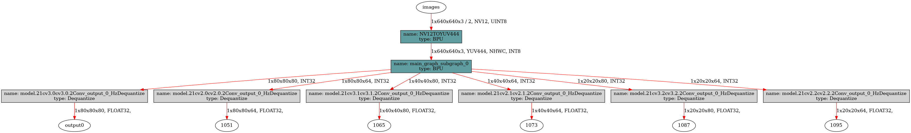
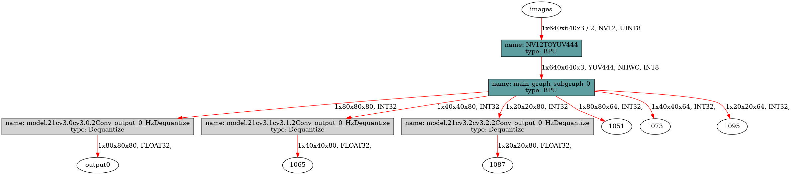

[English](./README.md) | 简体中文

# YOLOv12 Detect
- [YOLOv12 Detect](#yolov12-detect)
  - [YOLO介绍](#yolo介绍)
  - [步骤参考](#步骤参考)
    - [环境、项目准备](#环境项目准备)
    - [导出为onnx](#导出为onnx)
    - [准备校准数据](#准备校准数据)
    - [PTQ方案量化转化](#ptq方案量化转化)
    - [移除bbox信息3个输出头的反量化节点](#移除bbox信息3个输出头的反量化节点)
    - [使用hb\_perf命令对bin模型进行可视化, hrt\_model\_exec命令检查bin模型的输入输出情况](#使用hb_perf命令对bin模型进行可视化-hrt_model_exec命令检查bin模型的输入输出情况)
    - [部分编译日志参考](#部分编译日志参考)
  - [使用TROS高效部署YOLOv12](#使用tros高效部署yolov12)
    - [安装或更新tros-humble-hobot-dnn等功能包](#安装或更新tros-humble-hobot-dnn等功能包)
    - [拷贝tros-humble-hobot-dnn 的配置文件](#拷贝tros-humble-hobot-dnn-的配置文件)
    - [运行YOLOv8的推理节点](#运行yolov8的推理节点)
  - [模型训练](#模型训练)
  - [性能数据](#性能数据)
    - [RDK X5 \& RDK X5 Module (临时方案，不代表最终Area Attention优化后的性能数据)](#rdk-x5--rdk-x5-module-临时方案不代表最终area-attention优化后的性能数据)
  - [反馈](#反馈)
  - [参考](#参考)


## YOLO介绍

YOLO(You Only Look Once)是一种流行的物体检测和图像分割模型,由华盛顿大学的约瑟夫-雷德蒙(Joseph Redmon)和阿里-法哈迪(Ali Farhadi)开发。YOLO 于 2015 年推出,因其高速度和高精确度而迅速受到欢迎。

 - 2016 年发布的YOLOv2 通过纳入批量归一化、锚框和维度集群改进了原始模型。
2018 年推出的YOLOv3 使用更高效的骨干网络、多锚和空间金字塔池进一步增强了模型的性能。
 - YOLOv4于 2020 年发布,引入了 Mosaic 数据增强、新的无锚检测头和新的损失函数等创新技术。
 - YOLOv5进一步提高了模型的性能,并增加了超参数优化、集成实验跟踪和自动导出为常用导出格式等新功能。
 - YOLOv6于 2022 年由美团开源,目前已用于该公司的许多自主配送机器人。
 - YOLOv7增加了额外的任务,如 COCO 关键点数据集的姿势估计。
 - YOLOv8是YOLO 的最新版本,由Ultralytics 提供。YOLOv8 支持全方位的视觉 AI 任务,包括检测、分割、姿态估计、跟踪和分类。这种多功能性使用户能够在各种应用和领域中利用YOLOv8 的功能。
 - YOLOv9 引入了可编程梯度信息(PGI)和广义高效层聚合网络(GELAN)等创新方法。
 - YOLOv10是由清华大学的研究人员使用该软件包创建的。 UltralyticsPython 软件包创建的。该版本通过引入端到端头(End-to-End head), 消除了非最大抑制(NMS)要求, 实现了实时目标检测的进步.
 - YOLO11 NEW 🚀：Ultralytics的最新YOLO模型在多个任务上实现了最先进的（SOTA）性能。
 - YOLOv12构建以注意力为核心的YOLO框架，通过创新方法和架构改进，打破CNN模型在YOLO系列中的主导地位，实现具有快速推理速度和更高检测精度的实时目标检测。

YOLOv12论文：https://arxiv.org/abs/2502.12524 (发布时间：18 Feb 2025 04:20:14 UTC)
YOLOv12代码仓库：https://github.com/sunsmarterjie/yolov12

## 步骤参考

注：任何No such file or directory, No module named "xxx", command not found.等报错请仔细检查,请勿逐条复制运行,如果对修改过程不理解请前往开发者社区从YOLOv5开始了解。
### 环境、项目准备
 - 下载sunsmarterjie/yolov12，未来可能是ultralytics/ultralytics仓库, 参考YOLO11官方文档, 配置好环境. 注意，导出时可以先不按照作者的 requirements.txt 准备环境, 只需要ultralytics所需要的环境.
```bash
git clone https://github.com/sunsmarterjie/yolov12.git
```
 - 进入本地仓库,下载官方的预训练权重,这里以YOLOv12n-Detect模型为例
```bash
cd yolov12
wget https://github.com/sunsmarterjie/yolov12/releases/download/v1.0/yolov12n.pt
```

### 导出为onnx
 - 卸载yolo相关的命令行命令,这样直接修改`./ultralytics/ultralytics`目录即可生效。
```bash
$ conda list | grep ultralytics
$ pip list | grep ultralytics # 或者
# 如果存在,则卸载
$ conda uninstall ultralytics 
$ pip uninstall ultralytics   # 或者
```

如果不是很顺利，可以通过以下Python命令确认需要修改的`ultralytics`目录的位置:
```bash
>>> import ultralytics
>>> ultralytics.__path__
['/home/wuchao/miniconda3/envs/yolo/lib/python3.11/site-packages/ultralytics']
# 或者
['/home/wuchao/YOLO11/ultralytics_v11/ultralytics']
```

 - 注释掉FlashAttention模块的导入
文件目录：`yolov12/ultralytics/nn/modules/block.py`, 约第1160行，注释掉以下内容，我们在训练时可以按照原作者的意图去使用Flash Attention，导出时可以不使用。
```python
# try:
#     from flash_attn.flash_attn_interface import flash_attn_func
# except Exception:
#     assert False, "import FlashAttention error! Please install FlashAttention first."
# from timm.models.layers import trunc_normal_
```

 - 修改优化后的AAttn模块
文件目录：`ultralytics/nn/modules/block.py`, 约第1166行, `AAttn`类的`forward`方法替换成以下内容. 主要的优化点是去除了一些无用的数据搬运操作，同时将Reduce的维度变为C维度，对BPU更加友好。并且不需要重新训练模型。
目前可以将BPU吞吐量优化到超过30FPS，从而实现实时目标检测。未来Bayes BPU会专门针对 Area Attention 结构进行优化，从而实现YOLOv8那样近300FPS的吞吐量。
注：建议您保留好原本的`forward`方法,例如改一个其他的名字`forward_`, 方便在训练的时候换回来。
```python
class AAttn(nn.Module):
    def forward(self, x): # RDK X5
        B, C, H, W = x.shape
        N = H * W
        qkv = self.qkv(x).flatten(2).transpose(1, 2)
        if self.area > 1:
            qkv = qkv.reshape(B * self.area, N // self.area, C * 3)
            B, N, _ = qkv.shape
        q, k, v = qkv.view(B, N, self.num_heads, self.head_dim * 3).split(
            [self.head_dim, self.head_dim, self.head_dim], dim=3
        )
        q = q.permute(0, 2, 3, 1)
        k = k.permute(0, 2, 3, 1)
        v = v.permute(0, 2, 3, 1)
        attn = (q.transpose(-2, -1) @ k) * (self.head_dim ** -0.5)
        attn = attn.permute(0, 3, 1, 2).contiguous()  # CHW2HWC like
        max_attn = attn.max(dim=1, keepdim=True).values 
        exp_attn = torch.exp(attn - max_attn)
        sum_attn = exp_attn.sum(dim=1, keepdim=True)
        attn = exp_attn / sum_attn
        attn = attn.permute(0, 2, 3, 1).contiguous()  # HWC2CHW like
        x = (v @ attn.transpose(-2, -1))
        x = x.permute(0, 3, 1, 2)
        v = v.permute(0, 3, 1, 2)
        if self.area > 1:
            x = x.reshape(B // self.area, N * self.area, C)
            v = v.reshape(B // self.area, N * self.area, C)
            B, N, _ = x.shape
        x = x.reshape(B, H, W, C).permute(0, 3, 1, 2)
        v = v.reshape(B, H, W, C).permute(0, 3, 1, 2)
        x = x + self.pe(v)
        x = self.proj(x)
        return x

```

 - 修改Detect的输出头,直接将三个特征层的Bounding Box信息和Classify信息分开输出,一共6个输出头。
文件目录：`./ultralytics/ultralytics/nn/modules/head.py`,约第51行,`Detect`类的`forward`方法替换成以下内容.
注：建议您保留好原本的`forward`方法,例如改一个其他的名字`forward_`, 方便在训练的时候换回来。

注: 输出头顺序不能乱, 否则会报错. 另外不同版本的依赖库内部细节有一些不同, 如果发现输出头顺序与README的不同, 可以尝试修改append的顺序, 从而调转onnx输出头的顺序

```python
def forward(self, x):
    result = []
    for i in range(self.nl):
        result.append(self.cv3[i](x[i]).permute(0, 2, 3, 1).contiguous())
        result.append(self.cv2[i](x[i]).permute(0, 2, 3, 1).contiguous())
    return result

## 如果输出头顺序刚好是bbox和cls反的, 可以使用如下修改方式, 调换cv2和cv3的append顺序
## 然后再重新导出onnx, 编译为bin模型
def forward(self, x):
    result = []
    for i in range(self.nl):
        result.append(self.cv2[i](x[i]).permute(0, 2, 3, 1).contiguous())
        result.append(self.cv3[i](x[i]).permute(0, 2, 3, 1).contiguous())
    return result
```

 - 运行以下Python脚本,如果有**No module named onnxsim**报错,安装一个即可
```python
from ultralytics import YOLO
YOLO('yolov12n.pt').export(imgsz=640, format='onnx', simplify=False, opset=11)
```

### 准备校准数据
参考RDK Model Zoo提供的极简的校准数据准备脚本：`https://github.com/D-Robotics/rdk_model_zoo/blob/main/demos/tools/generate_calibration_data/generate_calibration_data.py `进行校准数据的准备。

### PTQ方案量化转化
 - 参考天工开物工具链手册和OE包(OpenExplore), 对模型进行检查, 所有算子均在BPU上, 进行编译即可.
```bash
(bpu_docker) $ hb_mapper checker --model-type onnx --march bayes-e --model yolov12n.onnx
(bpu_docker) $ hb_mapper makertbin --model-type onnx --config config_yolov12_detect_nv12.yaml
```

### 移除bbox信息3个输出头的反量化节点
 - 查看bbox信息的3个输出头的反量化节点名称
通过hb_mapper makerbin时的日志,看到大小为[1, 80, 80, 64], [1, 40, 40, 64], [1, 20, 20, 64]的三个输出的名称为1051, 1073, 1095。
 - 这里有一个小口诀, 就是带64的都移除. 这里的64 = 4 * REG, REG = 16.
```bash
ONNX IR version:          6
Opset version:            ['ai.onnx v11', 'horizon v1']
Producer:                 pytorch v2.5.1
Domain:                   None
Version:                  None
Graph input:
    images:               shape=[1, 3, 640, 640], dtype=FLOAT32
Graph output:
    output0:              shape=[1, 80, 80, 80], dtype=FLOAT32
    1051:                 shape=[1, 80, 80, 64], dtype=FLOAT32
    1065:                 shape=[1, 40, 40, 80], dtype=FLOAT32
    1073:                 shape=[1, 40, 40, 64], dtype=FLOAT32
    1087:                 shape=[1, 20, 20, 80], dtype=FLOAT32
    1095:                 shape=[1, 20, 20, 64], dtype=FLOAT32
```

 - 进入编译产物的目录
```bash
$ cd yolov12n_detect_bayese_640x640_nv12
```
 - 查看可以被移除的反量化节点
```bash
$ hb_model_modifier yolov12n_detect_bayese_640x640_nv12.bin
```
 - 在生成的hb_model_modifier.log文件中,找到以下信息。主要是找到大小为[1, 80, 80, 64], [1, 40, 40, 64], [1, 20, 20, 64]的三个输出头的名称。当然, 也可以通过netron等工具查看onnx模型,获得输出头的名称。
 此处的名称为:
 > "/model.21/cv2.0/cv2.0.2/Conv_output_0_HzDequantize"
 > "/model.21/cv2.1/cv2.1.2/Conv_output_0_HzDequantize"
 > "/model.21/cv2.2/cv2.2.2/Conv_output_0_HzDequantize"

```bash
2025-02-20 01:50:19,816 file: hb_model_modifier.py func: hb_model_modifier line No: 409 input: "/model.21/cv2.0/cv2.0.2/Conv_output_0_quantized"
input: "/model.21/cv2.0/cv2.0.2/Conv_x_scale"
output: "1051"
name: "/model.21/cv2.0/cv2.0.2/Conv_output_0_HzDequantize"
op_type: "Dequantize"

2025-02-20 01:50:19,816 file: hb_model_modifier.py func: hb_model_modifier line No: 409 input: "/model.21/cv2.1/cv2.1.2/Conv_output_0_quantized"
input: "/model.21/cv2.1/cv2.1.2/Conv_x_scale"
output: "1073"
name: "/model.21/cv2.1/cv2.1.2/Conv_output_0_HzDequantize"
op_type: "Dequantize"

2025-02-20 01:50:19,816 file: hb_model_modifier.py func: hb_model_modifier line No: 409 input: "/model.21/cv2.2/cv2.2.2/Conv_output_0_quantized"
input: "/model.21/cv2.2/cv2.2.2/Conv_x_scale"
output: "1095"
name: "/model.21/cv2.2/cv2.2.2/Conv_output_0_HzDequantize"
op_type: "Dequantize"
```
 - 使用以下命令移除上述三个反量化节点,注意,导出时这些名称可能不同,请仔细确认。
```bash
$ hb_model_modifier yolov12n_detect_bayese_640x640_nv12.bin \
-r /model.21/cv2.0/cv2.0.2/Conv_output_0_HzDequantize \
-r /model.21/cv2.1/cv2.1.2/Conv_output_0_HzDequantize \
-r /model.21/cv2.2/cv2.2.2/Conv_output_0_HzDequantize
```
 - 移除成功会显示以下日志
```bash
2025-02-20 02:00:57,469 INFO log will be stored in /open_explorer/yolov12n_detect_bayese_640x640_nv12/hb_model_modifier.log
2025-02-20 02:00:57,474 INFO Nodes that will be removed from this model: ['/model.21/cv2.0/cv2.0.2/Conv_output_0_HzDequantize', '/model.21/cv2.1/cv2.1.2/Conv_output_0_HzDequantize', '/model.21/cv2.2/cv2.2.2/Conv_output_0_HzDequantize']
2025-02-20 02:00:57,474 INFO Node '/model.21/cv2.0/cv2.0.2/Conv_output_0_HzDequantize' found, its OP type is 'Dequantize'
2025-02-20 02:00:57,475 INFO scale: /model.21/cv2.0/cv2.0.2/Conv_x_scale; zero point: 0. node info details are stored in hb_model_modifier log file
2025-02-20 02:00:57,475 INFO Node '/model.21/cv2.0/cv2.0.2/Conv_output_0_HzDequantize' is removed
2025-02-20 02:00:57,475 INFO Node '/model.21/cv2.1/cv2.1.2/Conv_output_0_HzDequantize' found, its OP type is 'Dequantize'
2025-02-20 02:00:57,475 INFO scale: /model.21/cv2.1/cv2.1.2/Conv_x_scale; zero point: 0. node info details are stored in hb_model_modifier log file
2025-02-20 02:00:57,476 INFO Node '/model.21/cv2.1/cv2.1.2/Conv_output_0_HzDequantize' is removed
2025-02-20 02:00:57,476 INFO Node '/model.21/cv2.2/cv2.2.2/Conv_output_0_HzDequantize' found, its OP type is 'Dequantize'
2025-02-20 02:00:57,476 INFO scale: /model.21/cv2.2/cv2.2.2/Conv_x_scale; zero point: 0. node info details are stored in hb_model_modifier log file
2025-02-20 02:00:57,476 INFO Node '/model.21/cv2.2/cv2.2.2/Conv_output_0_HzDequantize' is removed
2025-02-20 02:00:57,481 INFO modified model saved as yolov12n_detect_bayese_640x640_nv12_modified.bin
```

 - 接下来得到的bin模型名称为yolov8n_bayese_640x640_nchw_modified.bin, 这个是最终的模型。
 - NCHW输入的模型可以使用OpenCV和numpy来准备输入数据。
 - nv12输入的模型可以使用codec, jpu, vpu, gpu等硬件设备来准备输入数据,或者直接给TROS对应的功能包使用。

### 使用hb_perf命令对bin模型进行可视化, hrt_model_exec命令检查bin模型的输入输出情况
 - 移除反量化系数前的bin模型
```bash
hb_perf yolov12n_detect_bayese_640x640_nv12.bin
```
在`hb_perf_result`目录下可以找到以下结果：


```bash
hrt_model_exec model_info --model_file yolov12n_detect_bayese_640x640_nv12.bin
```
可以看到这个移除反量化系数前的bin模型的输入输出信息
```bash
[HBRT] set log level as 0. version = 3.15.55.0
[DNN] Runtime version = 1.24.5_(3.15.55 HBRT)
[A][DNN][packed_model.cpp:247][Model](2025-02-20,02:07:03.901.572) [HorizonRT] The model builder version = 1.24.3
Load model to DDR cost 36.964ms.
This model file has 1 model:
[yolov12n_detect_bayese_640x640_nv12]
---------------------------------------------------------------------
[model name]: yolov12n_detect_bayese_640x640_nv12

input[0]: 
name: images
input source: HB_DNN_INPUT_FROM_PYRAMID
valid shape: (1,3,640,640,)
aligned shape: (1,3,640,640,)
aligned byte size: 614400
tensor type: HB_DNN_IMG_TYPE_NV12
tensor layout: HB_DNN_LAYOUT_NCHW
quanti type: NONE
stride: (0,0,0,0,)

output[0]: 
name: output0
valid shape: (1,80,80,80,)
aligned shape: (1,80,80,80,)
aligned byte size: 2048000
tensor type: HB_DNN_TENSOR_TYPE_F32
tensor layout: HB_DNN_LAYOUT_NHWC
quanti type: NONE
stride: (2048000,25600,320,4,)

output[1]: 
name: 1051
valid shape: (1,80,80,64,)
aligned shape: (1,80,80,64,)
aligned byte size: 1638400
tensor type: HB_DNN_TENSOR_TYPE_F32
tensor layout: HB_DNN_LAYOUT_NHWC
quanti type: NONE
stride: (1638400,20480,256,4,)

output[2]: 
name: 1065
valid shape: (1,40,40,80,)
aligned shape: (1,40,40,80,)
aligned byte size: 512000
tensor type: HB_DNN_TENSOR_TYPE_F32
tensor layout: HB_DNN_LAYOUT_NHWC
quanti type: NONE
stride: (512000,12800,320,4,)

output[3]: 
name: 1073
valid shape: (1,40,40,64,)
aligned shape: (1,40,40,64,)
aligned byte size: 409600
tensor type: HB_DNN_TENSOR_TYPE_F32
tensor layout: HB_DNN_LAYOUT_NHWC
quanti type: NONE
stride: (409600,10240,256,4,)

output[4]: 
name: 1087
valid shape: (1,20,20,80,)
aligned shape: (1,20,20,80,)
aligned byte size: 128000
tensor type: HB_DNN_TENSOR_TYPE_F32
tensor layout: HB_DNN_LAYOUT_NHWC
quanti type: NONE
stride: (128000,6400,320,4,)

output[5]: 
name: 1095
valid shape: (1,20,20,64,)
aligned shape: (1,20,20,64,)
aligned byte size: 102400
tensor type: HB_DNN_TENSOR_TYPE_F32
tensor layout: HB_DNN_LAYOUT_NHWC
quanti type: NONE
stride: (102400,5120,256,4,)
```

 - 移除目标反量化系数后的bin模型
```bash
hb_perf yolov12n_detect_bayese_640x640_nv12_modified.bin
```
在`hb_perf_result`目录下可以找到以下结果。



```bash
hrt_model_exec model_info --model_file yolov12n_detect_bayese_640x640_nv12_modified.bin
```
可以看到这个移除反量化系数后的bin模型的输入输出信息, 以及移除反量化节点的所有反量化系数, 这也说明bin模型中是存储着这些信息的, 可以使用推理库的API获得, 方便我们进行对应的前后处理.
```bash
[HBRT] set log level as 0. version = 3.15.55.0
[DNN] Runtime version = 1.24.5_(3.15.55 HBRT)
[A][DNN][packed_model.cpp:247][Model](2025-02-20,02:07:20.123.684) [HorizonRT] The model builder version = 1.24.3
Load model to DDR cost 29.838ms.
This model file has 1 model:
[yolov12n_detect_bayese_640x640_nv12]
---------------------------------------------------------------------
[model name]: yolov12n_detect_bayese_640x640_nv12

input[0]: 
name: images
input source: HB_DNN_INPUT_FROM_PYRAMID
valid shape: (1,3,640,640,)
aligned shape: (1,3,640,640,)
aligned byte size: 614400
tensor type: HB_DNN_IMG_TYPE_NV12
tensor layout: HB_DNN_LAYOUT_NCHW
quanti type: NONE
stride: (0,0,0,0,)

output[0]: 
name: output0
valid shape: (1,80,80,80,)
aligned shape: (1,80,80,80,)
aligned byte size: 2048000
tensor type: HB_DNN_TENSOR_TYPE_F32
tensor layout: HB_DNN_LAYOUT_NHWC
quanti type: NONE
stride: (2048000,25600,320,4,)

output[1]: 
name: 1051
valid shape: (1,80,80,64,)
aligned shape: (1,80,80,64,)
aligned byte size: 1638400
tensor type: HB_DNN_TENSOR_TYPE_S32
tensor layout: HB_DNN_LAYOUT_NHWC
quanti type: SCALE
stride: (1638400,20480,256,4,)
scale data: 0.000383288,0.000321971,0.000334189,0.00031903,0.000286901,0.000331248,0.0002912,0.000217551,0.000201713,0.000177842,0.000153858,0.000132929,0.000123313,0.000119693,0.000106739,0.000165285,0.00041044,0.000372201,0.000372654,0.000347765,0.000296177,0.000287579,0.000299798,0.000191531,0.000247531,0.000196283,0.000141188,0.000119919,0.000120711,0.000108832,9.46908e-05,0.000171394,0.00039347,0.000394601,0.000378311,0.000270836,0.000263596,0.000297309,0.000289163,0.000172978,0.000121277,0.000146392,0.000162569,0.00016438,0.000155442,0.000139378,0.000120145,0.00016404,0.000375143,0.000361341,0.000326723,0.000351612,0.000262691,0.000342561,0.000213818,0.000280565,0.000207143,0.000127951,0.000163248,0.000172525,0.000164266,0.000144808,0.000122295,0.000178973,
quantizeAxis: 3

output[2]: 
name: 1065
valid shape: (1,40,40,80,)
aligned shape: (1,40,40,80,)
aligned byte size: 512000
tensor type: HB_DNN_TENSOR_TYPE_F32
tensor layout: HB_DNN_LAYOUT_NHWC
quanti type: NONE
stride: (512000,12800,320,4,)

output[3]: 
name: 1073
valid shape: (1,40,40,64,)
aligned shape: (1,40,40,64,)
aligned byte size: 409600
tensor type: HB_DNN_TENSOR_TYPE_S32
tensor layout: HB_DNN_LAYOUT_NHWC
quanti type: SCALE
stride: (409600,10240,256,4,)
scale data: 0.000500503,0.000480531,0.000416524,0.000398718,0.000342411,0.000375377,0.000414599,0.000267336,0.000325808,0.000289233,0.000182275,0.000204412,0.000208262,0.000196832,0.000179868,0.000203209,0.000402087,0.000392462,0.000368399,0.00039559,0.000423984,0.000306558,0.000455987,0.000395349,0.000369602,0.000211631,0.000227512,0.000206337,0.000174574,0.000138841,0.000106417,0.000151113,0.000566435,0.000559697,0.000366474,0.000346021,0.000335433,0.000304633,0.000442753,0.000303671,0.000317386,0.000185282,0.000131623,0.000136796,0.000151234,0.00014991,0.000141849,0.000170364,0.000439865,0.000410268,0.000360218,0.000366715,0.000358774,0.000314017,0.00037634,0.000451656,0.000317146,0.000222339,0.000167957,0.000155445,0.000186245,0.000181914,0.000163385,0.00020754,
quantizeAxis: 3

output[4]: 
name: 1087
valid shape: (1,20,20,80,)
aligned shape: (1,20,20,80,)
aligned byte size: 128000
tensor type: HB_DNN_TENSOR_TYPE_F32
tensor layout: HB_DNN_LAYOUT_NHWC
quanti type: NONE
stride: (128000,6400,320,4,)

output[5]: 
name: 1095
valid shape: (1,20,20,64,)
aligned shape: (1,20,20,64,)
aligned byte size: 102400
tensor type: HB_DNN_TENSOR_TYPE_S32
tensor layout: HB_DNN_LAYOUT_NHWC
quanti type: SCALE
stride: (102400,5120,256,4,)
scale data: 0.000544121,0.000516699,0.000455214,0.000472823,0.000438472,0.000557977,0.000539214,0.000424328,0.000467338,0.000479462,0.000353895,0.000305401,0.00030338,0.000304535,0.000267442,0.00024305,0.000491008,0.000509771,0.000512369,0.000575296,0.000496781,0.000519008,0.000606183,0.000597523,0.000473977,0.000415668,0.000332246,0.000303669,0.000217071,0.000119216,4.82781e-05,4.57163e-05,0.000566925,0.000551915,0.000468781,0.000484946,0.000428081,0.0004734,0.000463008,0.000495049,0.000459833,0.000343504,0.000399503,0.000342926,0.000324164,0.00028938,0.0003487,0.000366596,0.000542389,0.000498802,0.00042173,0.000417112,0.000472245,0.000480039,0.000476864,0.000357937,0.000465318,0.000414802,0.000427503,0.000450019,0.000341772,0.000299628,0.000323586,0.000317813,
quantizeAxis: 3
```

### 部分编译日志参考

可以看到: 
 - 尾部的transpose节点满足被动量化逻辑, 支持被BPU加速, 同时不影响其父节点Conv卷积算子以int32高精度输出.
 - 所有节点的余弦相似度均 > 0.9, 绝大多数节点的余弦相似度 > 0.99, 符合预期.
 - 所有算子均在BPU上, 整个bin模型只有1个BPU子图.

```bash
ONNX IR version:          6
Opset version:            ['ai.onnx v11', 'horizon v1']
Producer:                 pytorch v2.5.1
Domain:                   None
Version:                  None
Graph input:
    images:               shape=[1, 3, 640, 640], dtype=FLOAT32
Graph output:
    output0:              shape=[1, 80, 80, 80], dtype=FLOAT32
    1051:                 shape=[1, 80, 80, 64], dtype=FLOAT32
    1065:                 shape=[1, 40, 40, 80], dtype=FLOAT32
    1073:                 shape=[1, 40, 40, 64], dtype=FLOAT32
    1087:                 shape=[1, 20, 20, 80], dtype=FLOAT32
    1095:                 shape=[1, 20, 20, 64], dtype=FLOAT32
2025-02-20 01:32:30,405 file: model_builder.py func: model_builder line No: 38 End to prepare the onnx model.
2025-02-20 01:32:30,454 file: model_builder.py func: model_builder line No: 265 Saving model to: yolov12n_detect_bayese_640x640_nv12_original_float_model.onnx.
2025-02-20 01:32:30,454 file: model_builder.py func: model_builder line No: 35 Start to optimize the onnx model.
2025-02-20 01:32:30,873 file: constant_folding.py func: constant_folding line No: 66 Summary info for constant_folding:
2025-02-20 01:32:30,873 file: constant_folding.py func: constant_folding line No: 67   After constant_folding, the number of nodes has changed from 635 to 531.
2025-02-20 01:32:30,873 file: constant_folding.py func: constant_folding line No: 71   After constant_folding, the number of parameters has changed from 2591000 to 2590992.
2025-02-20 01:32:30,873 file: constant_folding.py func: constant_folding line No: 76 Detailed info for constant_folding:
2025-02-20 01:32:30,873 file: constant_folding.py func: constant_folding line No: 88   After folding node (op_name: /model.6/m.0/m.0.0/attn/Concat, op_type: Concat), the number of increased parameters is 0.
  After folding node (op_name: /model.6/m.0/m.0.1/attn/Concat, op_type: Concat), the number of increased parameters is 0.
  After folding node (op_name: /model.6/m.1/m.1.0/attn/Concat, op_type: Concat), the number of increased parameters is 0.
  After folding node (op_name: /model.6/m.1/m.1.1/attn/Concat, op_type: Concat), the number of increased parameters is 0.
  After folding node (op_name: /model.8/m.0/m.0.0/attn/Concat, op_type: Concat), the number of increased parameters is 0.
  After folding node (op_name: /model.8/m.0/m.0.1/attn/Concat, op_type: Concat), the number of increased parameters is 0.
  After folding node (op_name: /model.8/m.1/m.1.0/attn/Concat, op_type: Concat), the number of increased parameters is 0.
  After folding node (op_name: /model.8/m.1/m.1.1/attn/Concat, op_type: Concat), the number of increased parameters is 0.
  After folding node (op_name: /model.6/m.0/m.0.0/attn/Slice, op_type: Slice), the number of increased parameters is -5.
  After folding node (op_name: /model.6/m.0/m.0.1/attn/Slice, op_type: Slice), the number of increased parameters is -5.
  After folding node (op_name: /model.6/m.1/m.1.0/attn/Slice, op_type: Slice), the number of increased parameters is -5.
  After folding node (op_name: /model.6/m.1/m.1.1/attn/Slice, op_type: Slice), the number of increased parameters is -5.
  After folding node (op_name: /model.8/m.0/m.0.0/attn/Slice, op_type: Slice), the number of increased parameters is -5.
  After folding node (op_name: /model.8/m.0/m.0.1/attn/Slice, op_type: Slice), the number of increased parameters is -5.
  After folding node (op_name: /model.8/m.1/m.1.0/attn/Slice, op_type: Slice), the number of increased parameters is -5.
  After folding node (op_name: /model.8/m.1/m.1.1/attn/Slice, op_type: Slice), the number of increased parameters is -5.
2025-02-20 01:32:31,253 file: model_builder.py func: model_builder line No: 38 End to optimize the onnx model.
2025-02-20 01:32:31,288 file: model_builder.py func: model_builder line No: 265 Saving model to: yolov12n_detect_bayese_640x640_nv12_optimized_float_model.onnx.
2025-02-20 01:32:31,288 file: model_builder.py func: model_builder line No: 35 Start to calibrate the model.
2025-02-20 01:32:31,689 file: calibration_data_set.py func: calibration_data_set line No: 111 input name: images,  number_of_samples: 50
2025-02-20 01:32:31,690 file: calibration_data_set.py func: calibration_data_set line No: 123 There are 50 samples in the data set.
2025-02-20 01:32:31,690 file: infer_thresholds.py func: infer_thresholds line No: 84 Run calibration model with modelwise search method.
2025-02-20 01:32:32,401 file: base.py func: base line No: 138 Calibration using batch 8
2025-02-20 01:32:35,015 file: ort.py func: ort line No: 207 Reset batch_size=1 and execute forward again...
2025-02-20 01:38:44,031 file: base.py func: base line No: 138 Calibration using batch 8
2025-02-20 01:38:44,975 file: ort.py func: ort line No: 207 Reset batch_size=1 and execute forward again...
2025-02-20 01:39:01,740 file: base.py func: base line No: 138 Calibration using batch 8
2025-02-20 01:39:04,503 file: ort.py func: ort line No: 207 Reset batch_size=1 and execute forward again...
2025-02-20 01:45:45,908 file: modelwise_search.py func: modelwise_search line No: 75 Select max-percentile:percentile=0.99995,per_channel method.
2025-02-20 01:45:45,908 file: modelwise_search.py func: modelwise_search line No: 79 Perchannel quantization is enabled.
2025-02-20 01:45:47,569 file: model_builder.py func: model_builder line No: 38 End to calibrate the model.
2025-02-20 01:45:47,732 file: model_builder.py func: model_builder line No: 265 Saving model to: yolov12n_detect_bayese_640x640_nv12_calibrated_model.onnx.
2025-02-20 01:45:47,732 file: model_builder.py func: model_builder line No: 35 Start to quantize the model.
2025-02-20 01:45:50,972 file: constant_folding.py func: constant_folding line No: 66 Summary info for constant_folding:
2025-02-20 01:45:50,972 file: constant_folding.py func: constant_folding line No: 67   After constant_folding, the number of nodes has changed from 440 to 440.
2025-02-20 01:45:50,972 file: constant_folding.py func: constant_folding line No: 71   After constant_folding, the number of parameters has changed from 2628155 to 2628155.
2025-02-20 01:45:50,972 file: constant_folding.py func: constant_folding line No: 76 Detailed info for constant_folding:
2025-02-20 01:45:50,972 file: constant_folding.py func: constant_folding line No: 88 
2025-02-20 01:45:51,346 file: model_builder.py func: model_builder line No: 38 End to quantize the model.
2025-02-20 01:45:51,487 file: model_builder.py func: model_builder line No: 265 Saving model to: yolov12n_detect_bayese_640x640_nv12_quantized_model.onnx.
2025-02-20 01:45:51,487 file: model_builder.py func: model_builder line No: 35 Start to compile the model with march bayes-e.
2025-02-20 01:45:52,289 file: hybrid_build.py func: hybrid_build line No: 111 Compile submodel: main_graph_subgraph_0
2025-02-20 01:45:52,325 file: hbdk_cc.py func: hbdk_cc line No: 126 hbdk-cc parameters:['--O3', '--core-num', '1', '--fast', '--input-layout', 'NHWC', '--output-layout', 'NHWC', '--input-source', 'pyramid']
2025-02-20 01:45:52,325 file: hbdk_cc.py func: hbdk_cc line No: 127 hbdk-cc command used:hbdk-cc -f hbir -m /tmp/tmpnms6ibnw/main_graph_subgraph_0.hbir -o /tmp/tmpnms6ibnw/main_graph_subgraph_0.hbm --march bayes-e --progressbar --O3 --core-num 1 --fast --input-layout NHWC --output-layout NHWC --input-source pyramid
2025-02-20 01:49:52,707 file: tool_utils.py func: tool_utils line No: 326 consumed time 240.364
2025-02-20 01:49:52,831 file: tool_utils.py func: tool_utils line No: 326 FPS=54.28, latency = 18423.3 us, DDR = 69137136 bytes   (see main_graph_subgraph_0.html)
2025-02-20 01:49:52,918 file: model_builder.py func: model_builder line No: 38 End to compile the model with march bayes-e.
2025-02-20 01:49:59,068 file: print_info_dict.py func: print_info_dict line No: 72 The main quantized node information:
======================================================================================================================================
Node                                                ON   Subgraph  Type                       Cosine Similarity  Threshold  DataType  
--------------------------------------------------------------------------------------------------------------------------------------
HZ_PREPROCESS_FOR_images                            BPU  id(0)     HzSQuantizedPreprocess     0.999761           127.0      int8      
/model.0/conv/Conv                                  BPU  id(0)     HzSQuantizedConv           0.999263           1.11671    int8      
/model.0/act/Mul                                    BPU  id(0)     HzLut                      0.998640           39.9803    int8      
/model.1/conv/Conv                                  BPU  id(0)     HzSQuantizedConv           0.996558           37.5172    int8      
/model.1/act/Mul                                    BPU  id(0)     HzLut                      0.995958           60.5783    int8      
/model.2/cv1/conv/Conv                              BPU  id(0)     HzSQuantizedConv           0.992474           55.0255    int8      
/model.2/cv1/act/Mul                                BPU  id(0)     HzLut                      0.991721           60.0506    int8      
/model.2/Split                                      BPU  id(0)     Split                      0.992019           18.821     int8      
/model.2/m.0/cv1/conv/Conv                          BPU  id(0)     HzSQuantizedConv           0.996937           18.821     int8      
/model.2/m.0/cv1/act/Mul                            BPU  id(0)     HzLut                      0.997009           10.764     int8      
/model.2/m.0/cv2/conv/Conv                          BPU  id(0)     HzSQuantizedConv           0.979531           4.32619    int8      
/model.2/m.0/cv2/act/Mul                            BPU  id(0)     HzLut                      0.986718           21.3189    int8      
/model.2/m.0/Add                                    BPU  id(0)     HzSElementwiseAdd          0.991367           18.821     int8      
/model.2/Split_output_0_calibrated_Requantize       BPU  id(0)     HzRequantize               --                 --         int8      
/model.2/Split_output_1_calibrated_Requantize       BPU  id(0)     HzRequantize               --                 --         int8      
/model.2/Concat                                     BPU  id(0)     Concat                     0.991228           18.821     int8      
/model.2/cv2/conv/Conv                              BPU  id(0)     HzSQuantizedConv           0.974776           18.096     int8      
/model.2/cv2/act/Mul                                BPU  id(0)     HzLut                      0.970959           23.6256    int8      
/model.3/conv/Conv                                  BPU  id(0)     HzSQuantizedConv           0.980584           8.9605     int8      
/model.3/act/Mul                                    BPU  id(0)     HzLut                      0.990114           6.77134    int8      
/model.4/cv1/conv/Conv                              BPU  id(0)     HzSQuantizedConv           0.986557           5.77031    int8      
/model.4/cv1/act/Mul                                BPU  id(0)     HzLut                      0.987362           6.23352    int8      
/model.4/Split                                      BPU  id(0)     Split                      0.984971           3.40003    int8      
/model.4/m.0/cv1/conv/Conv                          BPU  id(0)     HzSQuantizedConv           0.988986           3.40003    int8      
/model.4/m.0/cv1/act/Mul                            BPU  id(0)     HzLut                      0.992626           3.95427    int8      
/model.4/m.0/cv2/conv/Conv                          BPU  id(0)     HzSQuantizedConv           0.989792           3.03118    int8      
/model.4/m.0/cv2/act/Mul                            BPU  id(0)     HzLut                      0.990566           5.51406    int8      
/model.4/m.0/Add                                    BPU  id(0)     HzSElementwiseAdd          0.993532           3.40003    int8      
/model.4/Split_output_0_calibrated_Requantize       BPU  id(0)     HzRequantize               --                 --         int8      
/model.4/Split_output_1_calibrated_Requantize       BPU  id(0)     HzRequantize               --                 --         int8      
/model.4/Concat                                     BPU  id(0)     Concat                     0.991439           3.40003    int8      
/model.4/cv2/conv/Conv                              BPU  id(0)     HzSQuantizedConv           0.982271           5.00101    int8      
/model.4/cv2/act/Mul                                BPU  id(0)     HzLut                      0.979179           6.17235    int8      
/model.5/conv/Conv                                  BPU  id(0)     HzSQuantizedConv           0.987544           3.15218    int8      
/model.5/act/Mul                                    BPU  id(0)     HzLut                      0.986527           6.33787    int8      
/model.6/cv1/conv/Conv                              BPU  id(0)     HzSQuantizedConv           0.986240           3.59684    int8      
/model.6/cv1/act/Mul                                BPU  id(0)     HzLut                      0.985648           8.97539    int8      
/model.6/m.0/m.0.0/attn/qkv/conv/Conv               BPU  id(0)     HzSQuantizedConv           0.949889           7.82223    int8      
/model.6/m.0/m.0.0/attn/Reshape                     BPU  id(0)     Reshape                    0.949889           8.26466    int8      
/model.6/m.0/m.0.0/attn/Transpose                   BPU  id(0)     Transpose                  0.949897           8.26466    int8      
/model.6/m.0/m.0.0/attn/Reshape_1                   BPU  id(0)     Reshape                    0.949897           8.26466    int8      
/model.6/m.0/m.0.0/attn/Split                       BPU  id(0)     Split                      0.949827           8.26466    int8      
/model.6/m.0/m.0.0/attn/Transpose_3                 BPU  id(0)     Transpose                  0.949827           8.26466    int8      
/model.6/m.0/m.0.0/attn/MatMul                      BPU  id(0)     HzSQuantizedMatmul         0.976425           8.26466    int8      
/model.6/m.0/m.0.0/attn/Mul                         BPU  id(0)     HzSElementwiseMul          0.976425           55.1994    int8      
/model.6/m.0/m.0.0/attn/ReduceMax                   BPU  id(0)     HzQuantizedReduceMax       0.992110           9.75798    int8      
/model.6/m.0/m.0.0/attn/Sub                         BPU  id(0)     HzSElementwiseSub          0.989671           9.75798    int8      
/model.6/m.0/m.0.0/attn/Exp                         BPU  id(0)     HzLut                      0.966661           16.0135    int8      
/model.6/m.0/m.0.0/attn/ReduceSum                   BPU  id(0)     HzSQuantizedReduceSum      0.988765           1.0        int8      
/model.6/m.0/m.0.0/attn/Div_reciprocal              BPU  id(0)     HzLut                      0.944800           237.883    int8      
/model.6/m.0/m.0.0/attn/Div_mul                     BPU  id(0)     HzSElementwiseMul          0.940439           1.0        int8      
/model.6/m.0/m.0.0/attn/Transpose_5                 BPU  id(0)     Transpose                  0.940425           0.182149   int8      
/model.6/m.0/m.0.0/attn/MatMul_1                    BPU  id(0)     HzSQuantizedMatmul         0.952914           8.26466    int8      
/model.6/m.0/m.0.0/attn/Transpose_6                 BPU  id(0)     Transpose                  0.952918           6.51295    int8      
/model.6/m.0/m.0.0/attn/Reshape_3                   BPU  id(0)     Reshape                    0.952918           6.51295    int8      
/model.6/m.0/m.0.0/attn/Reshape_4                   BPU  id(0)     Reshape                    0.954994           8.26466    int8      
/model.6/m.0/m.0.0/attn/pe/conv/Conv                BPU  id(0)     HzSQuantizedConv           0.944411           8.26466    int8      
/model.6/m.0/m.0.0/attn/proj/conv/Conv              BPU  id(0)     HzSQuantizedConv           0.943099           5.11705    int8      
/model.6/m.0/m.0.0/mlp/mlp.0/conv/Conv              BPU  id(0)     HzSQuantizedConv           0.978632           7.61283    int8      
/model.6/m.0/m.0.0/mlp/mlp.0/act/Mul                BPU  id(0)     HzLut                      0.952695           6.03865    int8      
/model.6/m.0/m.0.0/mlp/mlp.1/conv/Conv              BPU  id(0)     HzSQuantizedConv           0.852836           2.31089    int8      
/model.6/m.0/m.0.1/attn/qkv/conv/Conv               BPU  id(0)     HzSQuantizedConv           0.928506           7.55908    int8      
/model.6/m.0/m.0.1/attn/Reshape                     BPU  id(0)     Reshape                    0.928506           6.76044    int8      
/model.6/m.0/m.0.1/attn/Transpose                   BPU  id(0)     Transpose                  0.928507           6.76044    int8      
/model.6/m.0/m.0.1/attn/Reshape_1                   BPU  id(0)     Reshape                    0.928507           6.76044    int8      
/model.6/m.0/m.0.1/attn/Split                       BPU  id(0)     Split                      0.942031           6.76044    int8      
/model.6/m.0/m.0.1/attn/Transpose_3                 BPU  id(0)     Transpose                  0.942031           6.76044    int8      
/model.6/m.0/m.0.1/attn/MatMul                      BPU  id(0)     HzSQuantizedMatmul         0.963639           6.76044    int8      
/model.6/m.0/m.0.1/attn/Mul                         BPU  id(0)     HzSElementwiseMul          0.963639           106.046    int8      
/model.6/m.0/m.0.1/attn/ReduceMax                   BPU  id(0)     HzQuantizedReduceMax       0.986943           18.7465    int8      
/model.6/m.0/m.0.1/attn/Sub                         BPU  id(0)     HzSElementwiseSub          0.981969           18.7465    int8      
/model.6/m.0/m.0.1/attn/Exp                         BPU  id(0)     HzLut                      0.931749           34.5614    int8      
/model.6/m.0/m.0.1/attn/ReduceSum                   BPU  id(0)     HzSQuantizedReduceSum      0.983025           1.0        int8      
/model.6/m.0/m.0.1/attn/Div_reciprocal              BPU  id(0)     HzLut                      0.961381           192.696    int8      
/model.6/m.0/m.0.1/attn/Div_mul                     BPU  id(0)     HzSElementwiseMul          0.932277           1.0        int8      
/model.6/m.0/m.0.1/attn/Transpose_5                 BPU  id(0)     Transpose                  0.932276           0.672294   int8      
/model.6/m.0/m.0.1/attn/MatMul_1                    BPU  id(0)     HzSQuantizedMatmul         0.860546           6.76044    int8      
/model.6/m.0/m.0.1/attn/Transpose_6                 BPU  id(0)     Transpose                  0.860547           5.09177    int8      
/model.6/m.0/m.0.1/attn/Reshape_3                   BPU  id(0)     Reshape                    0.860547           5.09177    int8      
/model.6/m.0/m.0.1/attn/Reshape_4                   BPU  id(0)     Reshape                    0.899771           6.76044    int8      
/model.6/m.0/m.0.1/attn/pe/conv/Conv                BPU  id(0)     HzSQuantizedConv           0.893992           6.76044    int8      
/model.6/m.0/m.0.1/attn/proj/conv/Conv              BPU  id(0)     HzSQuantizedConv           0.836461           2.94758    int8      
/model.6/m.0/m.0.1/mlp/mlp.0/conv/Conv              BPU  id(0)     HzSQuantizedConv           0.967829           7.90098    int8      
/model.6/m.0/m.0.1/mlp/mlp.0/act/Mul                BPU  id(0)     HzLut                      0.928758           6.75616    int8      
/model.6/m.0/m.0.1/mlp/mlp.1/conv/Conv              BPU  id(0)     HzSQuantizedConv           0.841874           3.19698    int8      
/model.6/m.1/m.1.0/attn/qkv/conv/Conv               BPU  id(0)     HzSQuantizedConv           0.905192           7.62772    int8      
/model.6/m.1/m.1.0/attn/Reshape                     BPU  id(0)     Reshape                    0.905192           7.76085    int8      
/model.6/m.1/m.1.0/attn/Transpose                   BPU  id(0)     Transpose                  0.905189           7.76085    int8      
/model.6/m.1/m.1.0/attn/Reshape_1                   BPU  id(0)     Reshape                    0.905189           7.76085    int8      
/model.6/m.1/m.1.0/attn/Split                       BPU  id(0)     Split                      0.918469           7.76085    int8      
/model.6/m.1/m.1.0/attn/Transpose_3                 BPU  id(0)     Transpose                  0.918468           7.76085    int8      
/model.6/m.1/m.1.0/attn/MatMul                      BPU  id(0)     HzSQuantizedMatmul         0.899024           7.76085    int8      
/model.6/m.1/m.1.0/attn/Mul                         BPU  id(0)     HzSElementwiseMul          0.899024           43.2978    int8      
/model.6/m.1/m.1.0/attn/ReduceMax                   BPU  id(0)     HzQuantizedReduceMax       0.981655           7.65405    int8      
/model.6/m.1/m.1.0/attn/Sub                         BPU  id(0)     HzSElementwiseSub          0.978036           7.65405    int8      
/model.6/m.1/m.1.0/attn/Exp                         BPU  id(0)     HzLut                      0.922001           12.65      int8      
/model.6/m.1/m.1.0/attn/ReduceSum                   BPU  id(0)     HzSQuantizedReduceSum      0.971859           1.0        int8      
/model.6/m.1/m.1.0/attn/Div_reciprocal              BPU  id(0)     HzLut                      0.922367           295.065    int8      
/model.6/m.1/m.1.0/attn/Div_mul                     BPU  id(0)     HzSElementwiseMul          0.916821           1.0        int8      
/model.6/m.1/m.1.0/attn/Transpose_5                 BPU  id(0)     Transpose                  0.916821           0.265863   int8      
/model.6/m.1/m.1.0/attn/MatMul_1                    BPU  id(0)     HzSQuantizedMatmul         0.900055           7.76085    int8      
/model.6/m.1/m.1.0/attn/Transpose_6                 BPU  id(0)     Transpose                  0.900055           4.18921    int8      
/model.6/m.1/m.1.0/attn/Reshape_3                   BPU  id(0)     Reshape                    0.900055           4.18921    int8      
/model.6/m.1/m.1.0/attn/Reshape_4                   BPU  id(0)     Reshape                    0.903510           7.76085    int8      
/model.6/m.1/m.1.0/attn/pe/conv/Conv                BPU  id(0)     HzSQuantizedConv           0.896833           7.76085    int8      
/model.6/m.1/m.1.0/attn/proj/conv/Conv              BPU  id(0)     HzSQuantizedConv           0.894019           5.4704     int8      
/model.6/m.1/m.1.0/mlp/mlp.0/conv/Conv              BPU  id(0)     HzSQuantizedConv           0.968532           7.95999    int8      
/model.6/m.1/m.1.0/mlp/mlp.0/act/Mul                BPU  id(0)     HzLut                      0.944979           5.96626    int8      
/model.6/m.1/m.1.0/mlp/mlp.1/conv/Conv              BPU  id(0)     HzSQuantizedConv           0.862223           2.72638    int8      
/model.6/m.1/m.1.1/attn/qkv/conv/Conv               BPU  id(0)     HzSQuantizedConv           0.915527           8.29573    int8      
/model.6/m.1/m.1.1/attn/Reshape                     BPU  id(0)     Reshape                    0.915527           8.08552    int8      
/model.6/m.1/m.1.1/attn/Transpose                   BPU  id(0)     Transpose                  0.915525           8.08552    int8      
/model.6/m.1/m.1.1/attn/Reshape_1                   BPU  id(0)     Reshape                    0.915525           8.08552    int8      
/model.6/m.1/m.1.1/attn/Split                       BPU  id(0)     Split                      0.929535           8.08552    int8      
/model.6/m.1/m.1.1/attn/Transpose_3                 BPU  id(0)     Transpose                  0.929535           8.08552    int8      
/model.6/m.1/m.1.1/attn/MatMul                      BPU  id(0)     HzSQuantizedMatmul         0.928315           8.08552    int8      
/model.6/m.1/m.1.1/attn/Mul                         BPU  id(0)     HzSElementwiseMul          0.928315           94.1535    int8      
/model.6/m.1/m.1.1/attn/ReduceMax                   BPU  id(0)     HzQuantizedReduceMax       0.985320           16.6441    int8      
/model.6/m.1/m.1.1/attn/Sub                         BPU  id(0)     HzSElementwiseSub          0.980855           16.6441    int8      
/model.6/m.1/m.1.1/attn/Exp                         BPU  id(0)     HzLut                      0.924758           31.9968    int8      
/model.6/m.1/m.1.1/attn/ReduceSum                   BPU  id(0)     HzSQuantizedReduceSum      0.963404           1.0        int8      
/model.6/m.1/m.1.1/attn/Div_reciprocal              BPU  id(0)     HzLut                      0.938866           263.219    int8      
/model.6/m.1/m.1.1/attn/Div_mul                     BPU  id(0)     HzSElementwiseMul          0.909976           1.0        int8      
/model.6/m.1/m.1.1/attn/Transpose_5                 BPU  id(0)     Transpose                  0.909976           0.97091    int8      
/model.6/m.1/m.1.1/attn/MatMul_1                    BPU  id(0)     HzSQuantizedMatmul         0.849266           8.08552    int8      
/model.6/m.1/m.1.1/attn/Transpose_6                 BPU  id(0)     Transpose                  0.849266           7.38827    int8      
/model.6/m.1/m.1.1/attn/Reshape_3                   BPU  id(0)     Reshape                    0.849266           7.38827    int8      
/model.6/m.1/m.1.1/attn/Reshape_4                   BPU  id(0)     Reshape                    0.914498           8.08552    int8      
/model.6/m.1/m.1.1/attn/pe/conv/Conv                BPU  id(0)     HzSQuantizedConv           0.909540           8.08552    int8      
/model.6/m.1/m.1.1/attn/proj/conv/Conv              BPU  id(0)     HzSQuantizedConv           0.843838           5.38561    int8      
/model.6/m.1/m.1.1/mlp/mlp.0/conv/Conv              BPU  id(0)     HzSQuantizedConv           0.979820           9.50589    int8      
/model.6/m.1/m.1.1/mlp/mlp.0/act/Mul                BPU  id(0)     HzLut                      0.980003           5.27996    int8      
/model.6/m.1/m.1.1/mlp/mlp.1/conv/Conv              BPU  id(0)     HzSQuantizedConv           0.887700           2.19781    int8      
...el.6/cv1/act/Mul_output_0_calibrated_Requantize  BPU  id(0)     HzRequantize               --                 --         int8      
.../m.0/m.0.1/Add_1_output_0_calibrated_Requantize  BPU  id(0)     HzRequantize               --                 --         int8      
/model.6/Concat                                     BPU  id(0)     Concat                     0.964243           7.82223    int8      
/model.6/cv2/conv/Conv                              BPU  id(0)     HzSQuantizedConv           0.953220           9.10745    int8      
/model.6/cv2/act/Mul                                BPU  id(0)     HzLut                      0.918525           5.64547    int8      
/model.7/conv/Conv                                  BPU  id(0)     HzSQuantizedConv           0.917116           3.67958    int8      
/model.7/act/Mul                                    BPU  id(0)     HzLut                      0.880694           6.55691    int8      
/model.8/cv1/conv/Conv                              BPU  id(0)     HzSQuantizedConv           0.869201           4.69061    int8      
/model.8/cv1/act/Mul                                BPU  id(0)     HzLut                      0.864077           8.04312    int8      
/model.8/m.0/m.0.0/attn/qkv/conv/Conv               BPU  id(0)     HzSQuantizedConv           0.880125           7.7326     int8      
/model.8/m.0/m.0.0/attn/Reshape                     BPU  id(0)     Reshape                    0.880125           7.10734    int8      
/model.8/m.0/m.0.0/attn/Transpose                   BPU  id(0)     Transpose                  0.880128           7.10734    int8      
/model.8/m.0/m.0.0/attn/Reshape_1                   BPU  id(0)     Reshape                    0.880128           7.10734    int8      
/model.8/m.0/m.0.0/attn/Split                       BPU  id(0)     Split                      0.897226           7.10734    int8      
/model.8/m.0/m.0.0/attn/Transpose_3                 BPU  id(0)     Transpose                  0.897225           7.10734    int8      
/model.8/m.0/m.0.0/attn/MatMul                      BPU  id(0)     HzSQuantizedMatmul         0.864210           7.10734    int8      
/model.8/m.0/m.0.0/attn/Mul                         BPU  id(0)     HzSQuantizedConv           0.864210           34.5117    int8      
/model.8/m.0/m.0.0/attn/ReduceMax                   BPU  id(0)     HzQuantizedReduceMax       0.985389           6.10086    int8      
/model.8/m.0/m.0.0/attn/Sub                         BPU  id(0)     HzSElementwiseSub          0.972379           6.10086    int8      
/model.8/m.0/m.0.0/attn/Exp                         BPU  id(0)     HzLut                      0.959014           11.3912    int8      
/model.8/m.0/m.0.0/attn/ReduceSum                   BPU  id(0)     HzSQuantizedReduceSum      0.975597           1.0        int8      
/model.8/m.0/m.0.0/attn/Div_reciprocal              BPU  id(0)     HzLut                      0.957331           328.755    int8      
/model.8/m.0/m.0.0/attn/Div_mul                     BPU  id(0)     HzSElementwiseMul          0.911330           1.0        int8      
/model.8/m.0/m.0.0/attn/Transpose_5                 BPU  id(0)     Transpose                  0.911336           0.124873   int8      
/model.8/m.0/m.0.0/attn/MatMul_1                    BPU  id(0)     HzSQuantizedMatmul         0.836789           7.10734    int8      
/model.8/m.0/m.0.0/attn/Transpose_6                 BPU  id(0)     Transpose                  0.836789           2.86071    int8      
/model.8/m.0/m.0.0/attn/Reshape_2                   BPU  id(0)     Reshape                    0.836789           2.86071    int8      
/model.8/m.0/m.0.0/attn/Reshape_3                   BPU  id(0)     Reshape                    0.866819           7.10734    int8      
/model.8/m.0/m.0.0/attn/pe/conv/Conv                BPU  id(0)     HzSQuantizedConv           0.919996           7.10734    int8      
/model.8/m.0/m.0.0/attn/proj/conv/Conv              BPU  id(0)     HzSQuantizedConv           0.929278           6.59887    int8      
/model.8/m.0/m.0.0/mlp/mlp.0/conv/Conv              BPU  id(0)     HzSQuantizedConv           0.947668           6.03417    int8      
/model.8/m.0/m.0.0/mlp/mlp.0/act/Mul                BPU  id(0)     HzLut                      0.884478           6.42685    int8      
/model.8/m.0/m.0.0/mlp/mlp.1/conv/Conv              BPU  id(0)     HzSQuantizedConv           0.780459           3.04914    int8      
/model.8/m.0/m.0.1/attn/qkv/conv/Conv               BPU  id(0)     HzSQuantizedConv           0.902503           7.73799    int8      
/model.8/m.0/m.0.1/attn/Reshape                     BPU  id(0)     Reshape                    0.902503           6.48655    int8      
/model.8/m.0/m.0.1/attn/Transpose                   BPU  id(0)     Transpose                  0.902503           6.48655    int8      
/model.8/m.0/m.0.1/attn/Reshape_1                   BPU  id(0)     Reshape                    0.902503           6.48655    int8      
/model.8/m.0/m.0.1/attn/Split                       BPU  id(0)     Split                      0.908539           6.48655    int8      
/model.8/m.0/m.0.1/attn/Transpose_3                 BPU  id(0)     Transpose                  0.908540           6.48655    int8      
/model.8/m.0/m.0.1/attn/MatMul                      BPU  id(0)     HzSQuantizedMatmul         0.885193           6.48655    int8      
/model.8/m.0/m.0.1/attn/Mul                         BPU  id(0)     HzSQuantizedConv           0.885193           78.4475    int8      
/model.8/m.0/m.0.1/attn/ReduceMax                   BPU  id(0)     HzQuantizedReduceMax       0.975903           13.8677    int8      
/model.8/m.0/m.0.1/attn/Sub                         BPU  id(0)     HzSElementwiseSub          0.972423           13.8677    int8      
/model.8/m.0/m.0.1/attn/Exp                         BPU  id(0)     HzLut                      0.875437           21.9182    int8      
/model.8/m.0/m.0.1/attn/ReduceSum                   BPU  id(0)     HzSQuantizedReduceSum      0.937307           1.0        int8      
/model.8/m.0/m.0.1/attn/Div_reciprocal              BPU  id(0)     HzLut                      0.942807           221.84     int8      
/model.8/m.0/m.0.1/attn/Div_mul                     BPU  id(0)     HzSElementwiseMul          0.924961           1.0        int8      
/model.8/m.0/m.0.1/attn/Transpose_5                 BPU  id(0)     Transpose                  0.924956           0.486045   int8      
/model.8/m.0/m.0.1/attn/MatMul_1                    BPU  id(0)     HzSQuantizedMatmul         0.880182           6.48655    int8      
/model.8/m.0/m.0.1/attn/Transpose_6                 BPU  id(0)     Transpose                  0.880182           6.07937    int8      
/model.8/m.0/m.0.1/attn/Reshape_2                   BPU  id(0)     Reshape                    0.880182           6.07937    int8      
/model.8/m.0/m.0.1/attn/Reshape_3                   BPU  id(0)     Reshape                    0.904156           6.48655    int8      
/model.8/m.0/m.0.1/attn/pe/conv/Conv                BPU  id(0)     HzSQuantizedConv           0.911806           6.48655    int8      
/model.8/m.0/m.0.1/attn/proj/conv/Conv              BPU  id(0)     HzSQuantizedConv           0.845843           3.74406    int8      
/model.8/m.0/m.0.1/mlp/mlp.0/conv/Conv              BPU  id(0)     HzSQuantizedConv           0.942774           8.37251    int8      
/model.8/m.0/m.0.1/mlp/mlp.0/act/Mul                BPU  id(0)     HzLut                      0.887939           7.95194    int8      
/model.8/m.0/m.0.1/mlp/mlp.1/conv/Conv              BPU  id(0)     HzSQuantizedConv           0.832788           3.93506    int8      
/model.8/m.1/m.1.0/attn/qkv/conv/Conv               BPU  id(0)     HzSQuantizedConv           0.890953           8.83073    int8      
/model.8/m.1/m.1.0/attn/Reshape                     BPU  id(0)     Reshape                    0.890953           6.31208    int8      
/model.8/m.1/m.1.0/attn/Transpose                   BPU  id(0)     Transpose                  0.890952           6.31208    int8      
/model.8/m.1/m.1.0/attn/Reshape_1                   BPU  id(0)     Reshape                    0.890952           6.31208    int8      
/model.8/m.1/m.1.0/attn/Split                       BPU  id(0)     Split                      0.906172           6.31208    int8      
/model.8/m.1/m.1.0/attn/Transpose_3                 BPU  id(0)     Transpose                  0.906172           6.31208    int8      
/model.8/m.1/m.1.0/attn/MatMul                      BPU  id(0)     HzSQuantizedMatmul         0.904029           6.31208    int8      
/model.8/m.1/m.1.0/attn/Mul                         BPU  id(0)     HzSQuantizedConv           0.904029           68.8552    int8      
/model.8/m.1/m.1.0/attn/ReduceMax                   BPU  id(0)     HzQuantizedReduceMax       0.964473           12.172     int8      
/model.8/m.1/m.1.0/attn/Sub                         BPU  id(0)     HzSElementwiseSub          0.960980           12.172     int8      
/model.8/m.1/m.1.0/attn/Exp                         BPU  id(0)     HzLut                      0.896600           20.6858    int8      
/model.8/m.1/m.1.0/attn/ReduceSum                   BPU  id(0)     HzSQuantizedReduceSum      0.948536           1.0        int8      
/model.8/m.1/m.1.0/attn/Div_reciprocal              BPU  id(0)     HzLut                      0.930476           306.153    int8      
/model.8/m.1/m.1.0/attn/Div_mul                     BPU  id(0)     HzSElementwiseMul          0.903348           1.0        int8      
/model.8/m.1/m.1.0/attn/Transpose_5                 BPU  id(0)     Transpose                  0.903357           0.283793   int8      
/model.8/m.1/m.1.0/attn/MatMul_1                    BPU  id(0)     HzSQuantizedMatmul         0.823701           6.31208    int8      
/model.8/m.1/m.1.0/attn/Transpose_6                 BPU  id(0)     Transpose                  0.823701           5.51998    int8      
/model.8/m.1/m.1.0/attn/Reshape_2                   BPU  id(0)     Reshape                    0.823701           5.51998    int8      
/model.8/m.1/m.1.0/attn/Reshape_3                   BPU  id(0)     Reshape                    0.867830           6.31208    int8      
/model.8/m.1/m.1.0/attn/pe/conv/Conv                BPU  id(0)     HzSQuantizedConv           0.905341           6.31208    int8      
/model.8/m.1/m.1.0/attn/proj/conv/Conv              BPU  id(0)     HzSQuantizedConv           0.796501           4.20365    int8      
/model.8/m.1/m.1.0/mlp/mlp.0/conv/Conv              BPU  id(0)     HzSQuantizedConv           0.939062           8.61197    int8      
/model.8/m.1/m.1.0/mlp/mlp.0/act/Mul                BPU  id(0)     HzLut                      0.834331           8.14074    int8      
/model.8/m.1/m.1.0/mlp/mlp.1/conv/Conv              BPU  id(0)     HzSQuantizedConv           0.779649           3.66047    int8      
/model.8/m.1/m.1.1/attn/qkv/conv/Conv               BPU  id(0)     HzSQuantizedConv           0.893438           9.3439     int8      
/model.8/m.1/m.1.1/attn/Reshape                     BPU  id(0)     Reshape                    0.893438           6.28169    int8      
/model.8/m.1/m.1.1/attn/Transpose                   BPU  id(0)     Transpose                  0.893439           6.28169    int8      
/model.8/m.1/m.1.1/attn/Reshape_1                   BPU  id(0)     Reshape                    0.893439           6.28169    int8      
/model.8/m.1/m.1.1/attn/Split                       BPU  id(0)     Split                      0.916437           6.28169    int8      
/model.8/m.1/m.1.1/attn/Transpose_3                 BPU  id(0)     Transpose                  0.916438           6.28169    int8      
/model.8/m.1/m.1.1/attn/MatMul                      BPU  id(0)     HzSQuantizedMatmul         0.921318           6.28169    int8      
/model.8/m.1/m.1.1/attn/Mul                         BPU  id(0)     HzSQuantizedConv           0.921318           60.0212    int8      
/model.8/m.1/m.1.1/attn/ReduceMax                   BPU  id(0)     HzQuantizedReduceMax       0.985894           10.6103    int8      
/model.8/m.1/m.1.1/attn/Sub                         BPU  id(0)     HzSElementwiseSub          0.976020           10.6103    int8      
/model.8/m.1/m.1.1/attn/Exp                         BPU  id(0)     HzLut                      0.865746           18.6618    int8      
/model.8/m.1/m.1.1/attn/ReduceSum                   BPU  id(0)     HzSQuantizedReduceSum      0.944602           1.0        int8      
/model.8/m.1/m.1.1/attn/Div_reciprocal              BPU  id(0)     HzLut                      0.932591           173.257    int8      
/model.8/m.1/m.1.1/attn/Div_mul                     BPU  id(0)     HzSElementwiseMul          0.888304           1.0        int8      
/model.8/m.1/m.1.1/attn/Transpose_5                 BPU  id(0)     Transpose                  0.888325           0.22651    int8      
/model.8/m.1/m.1.1/attn/MatMul_1                    BPU  id(0)     HzSQuantizedMatmul         0.829219           6.28169    int8      
/model.8/m.1/m.1.1/attn/Transpose_6                 BPU  id(0)     Transpose                  0.829219           6.31663    int8      
/model.8/m.1/m.1.1/attn/Reshape_2                   BPU  id(0)     Reshape                    0.829219           6.31663    int8      
/model.8/m.1/m.1.1/attn/Reshape_3                   BPU  id(0)     Reshape                    0.863313           6.28169    int8      
/model.8/m.1/m.1.1/attn/pe/conv/Conv                BPU  id(0)     HzSQuantizedConv           0.875839           6.28169    int8      
/model.8/m.1/m.1.1/attn/proj/conv/Conv              BPU  id(0)     HzSQuantizedConv           0.796583           4.17225    int8      
/model.8/m.1/m.1.1/mlp/mlp.0/conv/Conv              BPU  id(0)     HzSQuantizedConv           0.914260           11.587     int8      
/model.8/m.1/m.1.1/mlp/mlp.0/act/Mul                BPU  id(0)     HzLut                      0.825612           7.27041    int8      
/model.8/m.1/m.1.1/mlp/mlp.1/conv/Conv              BPU  id(0)     HzSQuantizedConv           0.783082           4.48301    int8      
...el.8/cv1/act/Mul_output_0_calibrated_Requantize  BPU  id(0)     HzRequantize               --                 --         int8      
.../m.0/m.0.1/Add_1_output_0_calibrated_Requantize  BPU  id(0)     HzRequantize               --                 --         int8      
/model.8/Concat                                     BPU  id(0)     Concat                     0.854717           7.7326     int8      
/model.8/cv2/conv/Conv                              BPU  id(0)     HzSQuantizedConv           0.919245           10.6573    int8      
/model.8/cv2/act/Mul                                BPU  id(0)     HzLut                      0.792262           7.9901     int8      
/model.9/Resize                                     BPU  id(0)     HzQuantizedResizeUpsample  0.792258           4.4767     int8      
/model.9/Resize_output_0_calibrated_Requantize      BPU  id(0)     HzRequantize               --                 --         int8      
...el.6/cv2/act/Mul_output_0_calibrated_Requantize  BPU  id(0)     HzRequantize               --                 --         int8      
/model.10/Concat                                    BPU  id(0)     Concat                     0.835534           4.4767     int8      
/model.11/cv1/conv/Conv                             BPU  id(0)     HzSQuantizedConv           0.931869           4.33843    int8      
/model.11/cv1/act/Mul                               BPU  id(0)     HzLut                      0.929009           5.25182    int8      
/model.11/m.0/cv1/conv/Conv                         BPU  id(0)     HzSQuantizedConv           0.913487           4.79469    int8      
/model.11/m.0/cv1/act/Mul                           BPU  id(0)     HzLut                      0.897551           4.37755    int8      
/model.11/m.0/m/m.0/cv1/conv/Conv                   BPU  id(0)     HzSQuantizedConv           0.812950           1.95695    int8      
/model.11/m.0/m/m.0/cv1/act/Mul                     BPU  id(0)     HzLut                      0.768384           5.00743    int8      
/model.11/m.0/m/m.0/cv2/conv/Conv                   BPU  id(0)     HzSQuantizedConv           0.783928           4.28402    int8      
/model.11/m.0/m/m.0/cv2/act/Mul                     BPU  id(0)     HzLut                      0.832120           5.60862    int8      
/model.11/m.0/m/m.0/Add                             BPU  id(0)     HzSElementwiseAdd          0.875144           1.95695    int8      
/model.11/m.0/m/m.1/cv1/conv/Conv                   BPU  id(0)     HzSQuantizedConv           0.906362           4.13368    int8      
/model.11/m.0/m/m.1/cv1/act/Mul                     BPU  id(0)     HzLut                      0.889573           6.31358    int8      
/model.11/m.0/m/m.1/cv2/conv/Conv                   BPU  id(0)     HzSQuantizedConv           0.927274           3.49848    int8      
/model.11/m.0/m/m.1/cv2/act/Mul                     BPU  id(0)     HzLut                      0.926586           7.73436    int8      
/model.11/m.0/m/m.1/Add                             BPU  id(0)     HzSElementwiseAdd          0.930052           4.13368    int8      
/model.11/m.0/cv2/conv/Conv                         BPU  id(0)     HzSQuantizedConv           0.810233           4.79469    int8      
/model.11/m.0/cv2/act/Mul                           BPU  id(0)     HzLut                      0.791696           7.14482    int8      
/model.11/m.0/Concat                                BPU  id(0)     Concat                     0.907055           7.53761    int8      
/model.11/m.0/cv3/conv/Conv                         BPU  id(0)     HzSQuantizedConv           0.846183           7.53761    int8      
/model.11/m.0/cv3/act/Mul                           BPU  id(0)     HzLut                      0.831968           5.96765    int8      
...l.11/cv1/act/Mul_output_0_calibrated_Requantize  BPU  id(0)     HzRequantize               --                 --         int8      
/model.11/Concat                                    BPU  id(0)     Concat                     0.910422           4.79469    int8      
/model.11/cv2/conv/Conv                             BPU  id(0)     HzSQuantizedConv           0.888838           4.60841    int8      
/model.11/cv2/act/Mul                               BPU  id(0)     HzLut                      0.844449           4.72279    int8      
/model.12/Resize                                    BPU  id(0)     HzQuantizedResizeUpsample  0.844458           3.08783    int8      
/model.12/Resize_output_0_calibrated_Requantize     BPU  id(0)     HzRequantize               --                 --         int8      
...el.4/cv2/act/Mul_output_0_calibrated_Requantize  BPU  id(0)     HzRequantize               --                 --         int8      
/model.13/Concat                                    BPU  id(0)     Concat                     0.922253           3.08783    int8      
/model.14/cv1/conv/Conv                             BPU  id(0)     HzSQuantizedConv           0.973190           2.99153    int8      
/model.14/cv1/act/Mul                               BPU  id(0)     HzLut                      0.974813           2.80452    int8      
/model.14/m.0/cv1/conv/Conv                         BPU  id(0)     HzSQuantizedConv           0.976554           2.03538    int8      
/model.14/m.0/cv1/act/Mul                           BPU  id(0)     HzLut                      0.989194           2.82164    int8      
/model.14/m.0/m/m.0/cv1/conv/Conv                   BPU  id(0)     HzSQuantizedConv           0.944782           0.994495   int8      
/model.14/m.0/m/m.0/cv1/act/Mul                     BPU  id(0)     HzLut                      0.950319           3.19807    int8      
/model.14/m.0/m/m.0/cv2/conv/Conv                   BPU  id(0)     HzSQuantizedConv           0.951201           2.40526    int8      
/model.14/m.0/m/m.0/cv2/act/Mul                     BPU  id(0)     HzLut                      0.952833           5.10656    int8      
/model.14/m.0/m/m.0/Add                             BPU  id(0)     HzSElementwiseAdd          0.956817           0.994495   int8      
/model.14/m.0/m/m.1/cv1/conv/Conv                   BPU  id(0)     HzSQuantizedConv           0.906661           3.69061    int8      
/model.14/m.0/m/m.1/cv1/act/Mul                     BPU  id(0)     HzLut                      0.886776           4.94518    int8      
/model.14/m.0/m/m.1/cv2/conv/Conv                   BPU  id(0)     HzSQuantizedConv           0.977044           3.26654    int8      
/model.14/m.0/m/m.1/cv2/act/Mul                     BPU  id(0)     HzLut                      0.978908           7.95299    int8      
/model.14/m.0/m/m.1/Add                             BPU  id(0)     HzSElementwiseAdd          0.978571           3.69061    int8      
/model.14/m.0/cv2/conv/Conv                         BPU  id(0)     HzSQuantizedConv           0.867786           2.03538    int8      
/model.14/m.0/cv2/act/Mul                           BPU  id(0)     HzLut                      0.836108           5.87879    int8      
/model.14/m.0/Concat                                BPU  id(0)     Concat                     0.971497           7.9912     int8      
/model.14/m.0/cv3/conv/Conv                         BPU  id(0)     HzSQuantizedConv           0.917422           7.9912     int8      
/model.14/m.0/cv3/act/Mul                           BPU  id(0)     HzLut                      0.947152           4.23292    int8      
...l.14/cv1/act/Mul_output_0_calibrated_Requantize  BPU  id(0)     HzRequantize               --                 --         int8      
/model.14/Concat                                    BPU  id(0)     Concat                     0.963604           2.03538    int8      
/model.14/cv2/conv/Conv                             BPU  id(0)     HzSQuantizedConv           0.965152           2.56639    int8      
/model.14/cv2/act/Mul                               BPU  id(0)     HzLut                      0.973205           4.15928    int8      
/model.15/conv/Conv                                 BPU  id(0)     HzSQuantizedConv           0.916926           2.51084    int8      
/model.15/act/Mul                                   BPU  id(0)     HzLut                      0.884388           5.56355    int8      
/model.16/Concat                                    BPU  id(0)     Concat                     0.857230           3.08783    int8      
/model.17/cv1/conv/Conv                             BPU  id(0)     HzSQuantizedConv           0.850424           3.08783    int8      
/model.17/cv1/act/Mul                               BPU  id(0)     HzLut                      0.853494           4.67934    int8      
/model.17/m.0/cv1/conv/Conv                         BPU  id(0)     HzSQuantizedConv           0.958909           4.52616    int8      
/model.17/m.0/cv1/act/Mul                           BPU  id(0)     HzLut                      0.974340           3.17587    int8      
/model.17/m.0/m/m.0/cv1/conv/Conv                   BPU  id(0)     HzSQuantizedConv           0.923811           0.950605   int8      
/model.17/m.0/m/m.0/cv1/act/Mul                     BPU  id(0)     HzLut                      0.907816           4.46063    int8      
/model.17/m.0/m/m.0/cv2/conv/Conv                   BPU  id(0)     HzSQuantizedConv           0.858674           2.35509    int8      
/model.17/m.0/m/m.0/cv2/act/Mul                     BPU  id(0)     HzLut                      0.875918           5.53728    int8      
/model.17/m.0/m/m.0/Add                             BPU  id(0)     HzSElementwiseAdd          0.878247           0.950605   int8      
/model.17/m.0/m/m.1/cv1/conv/Conv                   BPU  id(0)     HzSQuantizedConv           0.838500           4.14696    int8      
/model.17/m.0/m/m.1/cv1/act/Mul                     BPU  id(0)     HzLut                      0.781075           6.86995    int8      
/model.17/m.0/m/m.1/cv2/conv/Conv                   BPU  id(0)     HzSQuantizedConv           0.900731           3.86227    int8      
/model.17/m.0/m/m.1/cv2/act/Mul                     BPU  id(0)     HzLut                      0.911125           8.65739    int8      
/model.17/m.0/m/m.1/Add                             BPU  id(0)     HzSElementwiseAdd          0.905278           4.14696    int8      
/model.17/m.0/cv2/conv/Conv                         BPU  id(0)     HzSQuantizedConv           0.692213           4.52616    int8      
/model.17/m.0/cv2/act/Mul                           BPU  id(0)     HzLut                      0.633205           7.38137    int8      
/model.17/m.0/Concat                                BPU  id(0)     Concat                     0.858618           8.27161    int8      
/model.17/m.0/cv3/conv/Conv                         BPU  id(0)     HzSQuantizedConv           0.766413           8.27161    int8      
/model.17/m.0/cv3/act/Mul                           BPU  id(0)     HzLut                      0.764852           8.86359    int8      
...l.17/cv1/act/Mul_output_0_calibrated_Requantize  BPU  id(0)     HzRequantize               --                 --         int8      
/model.17/Concat                                    BPU  id(0)     Concat                     0.810665           4.52616    int8      
/model.17/cv2/conv/Conv                             BPU  id(0)     HzSQuantizedConv           0.804440           5.11369    int8      
/model.17/cv2/act/Mul                               BPU  id(0)     HzLut                      0.775891           9.12061    int8      
/model.18/conv/Conv                                 BPU  id(0)     HzSQuantizedConv           0.785847           4.35916    int8      
/model.18/act/Mul                                   BPU  id(0)     HzLut                      0.767370           5.64968    int8      
/model.19/Concat                                    BPU  id(0)     Concat                     0.783937           4.4767     int8      
/model.20/cv1/conv/Conv                             BPU  id(0)     HzSQuantizedConv           0.839450           4.4767     int8      
/model.20/cv1/act/Mul                               BPU  id(0)     HzLut                      0.753681           6.37758    int8      
/model.20/Split                                     BPU  id(0)     Split                      0.766935           5.14695    int8      
/model.20/m.0/cv1/conv/Conv                         BPU  id(0)     HzSQuantizedConv           0.941300           5.14695    int8      
/model.20/m.0/cv1/act/Mul                           BPU  id(0)     HzLut                      0.950236           3.17419    int8      
/model.20/m.0/m/m.0/cv1/conv/Conv                   BPU  id(0)     HzSQuantizedConv           0.909498           1.3069     int8      
/model.20/m.0/m/m.0/cv1/act/Mul                     BPU  id(0)     HzLut                      0.863457           5.26665    int8      
/model.20/m.0/m/m.0/cv2/conv/Conv                   BPU  id(0)     HzSQuantizedConv           0.889002           3.63313    int8      
/model.20/m.0/m/m.0/cv2/act/Mul                     BPU  id(0)     HzLut                      0.882881           6.15343    int8      
/model.20/m.0/m/m.0/Add                             BPU  id(0)     HzSElementwiseAdd          0.897036           1.3069     int8      
/model.20/m.0/m/m.1/cv1/conv/Conv                   BPU  id(0)     HzSQuantizedConv           0.916453           5.13745    int8      
/model.20/m.0/m/m.1/cv1/act/Mul                     BPU  id(0)     HzLut                      0.838347           7.28896    int8      
/model.20/m.0/m/m.1/cv2/conv/Conv                   BPU  id(0)     HzSQuantizedConv           0.867950           5.4296     int8      
/model.20/m.0/m/m.1/cv2/act/Mul                     BPU  id(0)     HzLut                      0.861113           12.2769    int8      
/model.20/m.0/m/m.1/Add                             BPU  id(0)     HzSElementwiseAdd          0.862412           5.13745    int8      
/model.20/m.0/cv2/conv/Conv                         BPU  id(0)     HzSQuantizedConv           0.646957           5.14695    int8      
/model.20/m.0/cv2/act/Mul                           BPU  id(0)     HzLut                      0.635867           5.76255    int8      
/model.20/m.0/Concat                                BPU  id(0)     Concat                     0.824103           11.7658    int8      
/model.20/m.0/cv3/conv/Conv                         BPU  id(0)     HzSQuantizedConv           0.797942           11.7658    int8      
/model.20/m.0/cv3/act/Mul                           BPU  id(0)     HzLut                      0.791153           9.29643    int8      
/model.20/Split_output_0_calibrated_Requantize      BPU  id(0)     HzRequantize               --                 --         int8      
/model.20/Split_output_1_calibrated_Requantize      BPU  id(0)     HzRequantize               --                 --         int8      
/model.20/Concat                                    BPU  id(0)     Concat                     0.768936           5.14695    int8      
/model.20/cv2/conv/Conv                             BPU  id(0)     HzSQuantizedConv           0.754442           5.93185    int8      
/model.20/cv2/act/Mul                               BPU  id(0)     HzLut                      0.688080           8.4523     int8      
/model.21/cv3.0/cv3.0.0/cv3.0.0.0/conv/Conv         BPU  id(0)     HzSQuantizedConv           0.984800           2.51084    int8      
/model.21/cv3.0/cv3.0.0/cv3.0.0.0/act/Mul           BPU  id(0)     HzLut                      0.981564           4.35916    int8      
/model.21/cv3.0/cv3.0.0/cv3.0.0.1/conv/Conv         BPU  id(0)     HzSQuantizedConv           0.882605           3.90407    int8      
/model.21/cv3.0/cv3.0.0/cv3.0.0.1/act/Mul           BPU  id(0)     HzLut                      0.839096           5.36776    int8      
/model.21/cv3.0/cv3.0.1/cv3.0.1.0/conv/Conv         BPU  id(0)     HzSQuantizedConv           0.852754           4.45713    int8      
/model.21/cv3.0/cv3.0.1/cv3.0.1.0/act/Mul           BPU  id(0)     HzLut                      0.846775           6.34929    int8      
/model.21/cv3.0/cv3.0.1/cv3.0.1.1/conv/Conv         BPU  id(0)     HzSQuantizedConv           0.861514           5.61668    int8      
/model.21/cv3.0/cv3.0.1/cv3.0.1.1/act/Mul           BPU  id(0)     HzLut                      0.876494           25.4446    int8      
/model.21/cv3.0/cv3.0.2/Conv                        BPU  id(0)     HzSQuantizedConv           0.998885           24.9767    int8      
/model.21/cv2.0/cv2.0.0/conv/Conv                   BPU  id(0)     HzSQuantizedConv           0.942020           2.51084    int8      
/model.21/cv2.0/cv2.0.0/act/Mul                     BPU  id(0)     HzLut                      0.933212           8.19463    int8      
/model.21/cv2.0/cv2.0.1/conv/Conv                   BPU  id(0)     HzSQuantizedConv           0.880021           3.40829    int8      
/model.21/cv2.0/cv2.0.1/act/Mul                     BPU  id(0)     HzLut                      0.907260           29.9281    int8      
/model.21/cv2.0/cv2.0.2/Conv                        BPU  id(0)     HzSQuantizedConv           0.962691           29.8958    int8      
/model.21/cv3.1/cv3.1.0/cv3.1.0.0/conv/Conv         BPU  id(0)     HzSQuantizedConv           0.854667           4.35916    int8      
/model.21/cv3.1/cv3.1.0/cv3.1.0.0/act/Mul           BPU  id(0)     HzLut                      0.851683           5.69865    int8      
/model.21/cv3.1/cv3.1.0/cv3.1.0.1/conv/Conv         BPU  id(0)     HzSQuantizedConv           0.831362           5.38841    int8      
/model.21/cv3.1/cv3.1.0/cv3.1.0.1/act/Mul           BPU  id(0)     HzLut                      0.794557           8.86448    int8      
/model.21/cv3.1/cv3.1.1/cv3.1.1.0/conv/Conv         BPU  id(0)     HzSQuantizedConv           0.790087           5.56816    int8      
/model.21/cv3.1/cv3.1.1/cv3.1.1.0/act/Mul           BPU  id(0)     HzLut                      0.852858           17.9335    int8      
/model.21/cv3.1/cv3.1.1/cv3.1.1.1/conv/Conv         BPU  id(0)     HzSQuantizedConv           0.906170           11.6093    int8      
/model.21/cv3.1/cv3.1.1/cv3.1.1.1/act/Mul           BPU  id(0)     HzLut                      0.922218           34.1971    int8      
/model.21/cv3.1/cv3.1.2/Conv                        BPU  id(0)     HzSQuantizedConv           0.998879           34.1971    int8      
/model.21/cv2.1/cv2.1.0/conv/Conv                   BPU  id(0)     HzSQuantizedConv           0.829088           4.35916    int8      
/model.21/cv2.1/cv2.1.0/act/Mul                     BPU  id(0)     HzLut                      0.829191           9.80536    int8      
/model.21/cv2.1/cv2.1.1/conv/Conv                   BPU  id(0)     HzSQuantizedConv           0.835685           5.74615    int8      
/model.21/cv2.1/cv2.1.1/act/Mul                     BPU  id(0)     HzLut                      0.870592           31.7937    int8      
/model.21/cv2.1/cv2.1.2/Conv                        BPU  id(0)     HzSQuantizedConv           0.964953           31.7937    int8      
/model.21/cv3.2/cv3.2.0/cv3.2.0.0/conv/Conv         BPU  id(0)     HzSQuantizedConv           0.649975           6.49264    int8      
/model.21/cv3.2/cv3.2.0/cv3.2.0.0/act/Mul           BPU  id(0)     HzLut                      0.732351           7.88073    int8      
/model.21/cv3.2/cv3.2.0/cv3.2.0.1/conv/Conv         BPU  id(0)     HzSQuantizedConv           0.854144           6.37997    int8      
/model.21/cv3.2/cv3.2.0/cv3.2.0.1/act/Mul           BPU  id(0)     HzLut                      0.824711           15.8374    int8      
/model.21/cv3.2/cv3.2.1/cv3.2.1.0/conv/Conv         BPU  id(0)     HzSQuantizedConv           0.778329           5.44782    int8      
/model.21/cv3.2/cv3.2.1/cv3.2.1.0/act/Mul           BPU  id(0)     HzLut                      0.772837           10.4248    int8      
/model.21/cv3.2/cv3.2.1/cv3.2.1.1/conv/Conv         BPU  id(0)     HzSQuantizedConv           0.895221           10.3572    int8      
/model.21/cv3.2/cv3.2.1/cv3.2.1.1/act/Mul           BPU  id(0)     HzLut                      0.921867           29.3847    int8      
/model.21/cv3.2/cv3.2.2/Conv                        BPU  id(0)     HzSQuantizedConv           0.998451           29.2455    int8      
/model.21/cv2.2/cv2.2.0/conv/Conv                   BPU  id(0)     HzSQuantizedConv           0.843470           6.49264    int8      
/model.21/cv2.2/cv2.2.0/act/Mul                     BPU  id(0)     HzLut                      0.762702           8.74596    int8      
/model.21/cv2.2/cv2.2.1/conv/Conv                   BPU  id(0)     HzSQuantizedConv           0.766143           7.60039    int8      
/model.21/cv2.2/cv2.2.1/act/Mul                     BPU  id(0)     HzLut                      0.773633           38.1401    int8      
/model.21/cv2.2/cv2.2.2/Conv                        BPU  id(0)     HzSQuantizedConv           0.924581           38.1401    int8
2025-02-20 01:49:59,069 file: print_info_dict.py func: print_info_dict line No: 72 The quantized model output:
=============================================================================
Output      Cosine Similarity  L1 Distance  L2 Distance  Chebyshev Distance  
-----------------------------------------------------------------------------
output0     0.998886           0.468851     0.001009     4.919658            
1051        0.962690           0.324137     0.000810     4.927746            
1065        0.998879           0.458496     0.001880     8.105179            
1073        0.964953           0.298953     0.001516     4.934404            
1087        0.998451           0.416296     0.003976     7.377398            
1095        0.924581           0.411139     0.004505     5.503676
2025-02-20 01:49:59,080 file: model_builder.py func: model_builder line No: 38 End to Horizon NN Model Convert.
```

## 使用TROS高效部署YOLOv12
### 安装或更新tros-humble-hobot-dnn等功能包
```bash
sudo apt update # 确保有地瓜apt源
sudo apt install -y tros*-dnn-node* tros*-hobot-usb-cam tros*-hobot-codec
```
### 拷贝tros-humble-hobot-dnn 的配置文件
```bash
cp -r /opt/tros/humble/lib/dnn_node_example/config .
```
配置为以下内容
```json
{
        "model_file": "yourself.bin",
        "dnn_Parser": "yolov8",
        "model_output_count": 6,
        "reg_max": 16,
        "class_num": 80,
        "cls_names_list": "config/coco.list",
        "strides": [8, 16, 32],
        "score_threshold": 0.25,
        "nms_threshold": 0.7,
        "nms_top_k": 300
}
```

### 运行YOLOv8的推理节点
注：YOLOv12的后处理与YOLOv8相同，可以直接使用YOLOv8的推理节点
```bash
# 配置MIPI摄像头
export CAM_TYPE=mipi
# 配置USB摄像头
# export CAM_TYPE=usb
# 启动launch文件
ros2 launch dnn_node_example dnn_node_example.launch.py dnn_example_config_file:=config/my_workconfig.json
```
具体内容请参考TROS手册：`https://developer.d-robotics.cc/rdk_doc/Robot_development/boxs/detection/yolo`

同时，您还可以利用TROS轻松实现MIPI Camera, USB Camera, IPC Camera多种数据来源, 多路视频流的AI推理分析。参考RDK Video Solutions: `https://github.com/D-Robotics/rdk_model_zoo/blob/main/demos/solutions/RDK_Video_Solutions/README_cn.md`


## 模型训练

 - 模型训练请参考ultralytics官方文档, 这个文档由ultralytics维护, 质量非常的高。网络上也有非常多的参考材料, 得到一个像官方一样的预训练权重的模型并不困难。
 - 请注意, 训练时无需修改任何程序, 无需修改forward方法。

## 性能数据

### RDK X5 & RDK X5 Module (临时方案，不代表最终Area Attention优化后的性能数据)
目标检测 Detection (COCO)
| 模型 | 尺寸(像素) | 类别数 | 参数量 | BPU任务延迟/BPU吞吐量(线程数) |  后处理时间 |
|---------|---------|---------|----------|--------------------|--------------------|
| YOLOv12n | 640×640 | 80 | 2.6 M  | 17.7 ms / 56.3 FPS (1 thread  ) <br/> 31.6 ms / 63.0 FPS (2 threads) | 3 ms |


说明: 
1. BPU延迟与BPU吞吐量。
 - 单线程延迟为单帧,单线程,单BPU核心的延迟,BPU推理一个任务最理想的情况。
 - 多线程帧率为多个线程同时向BPU塞任务, 每个BPU核心可以处理多个线程的任务, 一般工程中4个线程可以控制单帧延迟较小,同时吃满所有BPU到100%,在吞吐量(FPS)和帧延迟间得到一个较好的平衡。X5的BPU整体比较厉害, 一般2个线程就可以将BPU吃满, 帧延迟和吞吐量都非常出色。
 - 表格中一般记录到吞吐量不再随线程数明显增加的数据。
 - BPU延迟和BPU吞吐量使用以下命令在板端测试
```bash
hrt_model_exec perf --thread_num 2 --model_file yolov12n_detect_bayese_640x640_nv12_modified.bin

python3 ../../../tools/batch_perf/batch_perf.py --max 3 --file ptq_models
```
2. 测试板卡均为最佳状态。
 - X5的状态为最佳状态：CPU为8 × A55@1.8G, 全核心Performance调度, BPU为1 × Bayes-e@10TOPS.
```bash
sudo bash -c "echo 1 > /sys/devices/system/cpu/cpufreq/boost"  # CPU: 1.8Ghz
sudo bash -c "echo performance > /sys/devices/system/cpu/cpufreq/policy0/scaling_governor" # Performance Mode
echo 1200000000 > /sys/kernel/debug/clk/bpu_mclk_2x_clk/clk_rate # BPU: 1.2GHz
```
 - X3的状态为最佳状态：CPU为4 × A53@1.8G, 全核心Performance调度, BPU为2 × Bernoulli2@5TOPS.
```bash
sudo bash -c "echo 1 > /sys/devices/system/cpu/cpufreq/boost"  # 1.8Ghz
sudo bash -c "echo performance > /sys/devices/system/cpu/cpufreq/policy0/scaling_governor" # Performance Mode
```
3. 关于后处理: 目前在X5上使用Python重构的后处理, 仅需要单核心单线程串行5ms左右即可完成, 也就是说只需要占用2个CPU核心(200%的CPU占用, 最大800%的CPU占用), 每分钟可完成400帧图像的后处理, 后处理不会构成瓶颈.

## 反馈
本文如果有表达不清楚的地方欢迎前往地瓜开发者社区进行提问和交流.

[地瓜机器人开发者社区](developer.d-robotics.cc).

## 参考

[ultralytics](https://docs.ultralytics.com/)
[Github: yolov12](https://github.com/sunsmarterjie/yolov12)
[YOLOv12: Attention-Centric Real-Time Object Detectors](https://arxiv.org/abs/2502.12524)