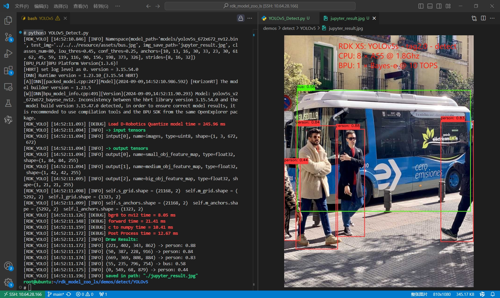
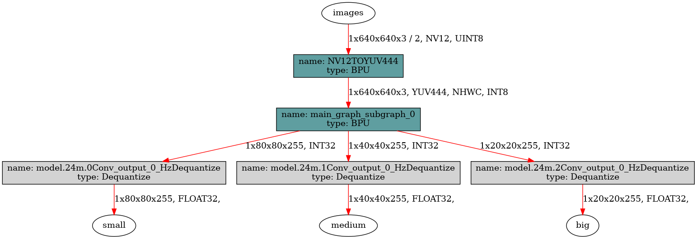

[English](./README.md) | 简体中文

# YOLOv5 Detect

- [YOLOv5 Detect](#yolov5-detect)
  - [YOLO介绍](#yolo介绍)
  - [性能数据 (简要)](#性能数据-简要)
    - [RDK X5 \& RDK X5 Module](#rdk-x5--rdk-x5-module)
    - [RDK X3 \& RDK X3 Module](#rdk-x3--rdk-x3-module)
  - [模型下载地址](#模型下载地址)
  - [输入输出数据](#输入输出数据)
  - [步骤参考](#步骤参考)
    - [YOLOv5 tag v2.0](#yolov5-tag-v20)
      - [环境、项目准备](#环境项目准备)
      - [导出为onnx](#导出为onnx)
      - [PTQ 方案量化转化](#ptq-方案量化转化)
      - [使用hb\_perf命令对bin模型进行可视化](#使用hb_perf命令对bin模型进行可视化)
      - [使用hrt\_model\_exec命令检查bin模型的输入输出情况](#使用hrt_model_exec命令检查bin模型的输入输出情况)
    - [YOLOv5 tag v7.0](#yolov5-tag-v70)
      - [环境、项目准备](#环境项目准备-1)
      - [导出为onnx](#导出为onnx-1)
      - [PTQ 方案量化转化](#ptq-方案量化转化-1)
      - [使用hb\_perf命令对bin模型进行可视化](#使用hb_perf命令对bin模型进行可视化-1)
      - [使用hrt\_model\_exec命令检查bin模型的输入输出情况](#使用hrt_model_exec命令检查bin模型的输入输出情况-1)
    - [部分编译日志参考](#部分编译日志参考)
  - [模型训练](#模型训练)
  - [性能数据](#性能数据)
    - [RDK X5 \& RDK X5 Module](#rdk-x5--rdk-x5-module-1)
    - [RDK X3 \& RDK X3 Module](#rdk-x3--rdk-x3-module-1)
  - [反馈](#反馈)
  - [参考](#参考)
  - [致谢（按照发帖时间）](#致谢按照发帖时间)


## YOLO介绍



YOLO(You Only Look Once)是一种流行的物体检测和图像分割模型,由华盛顿大学的约瑟夫-雷德蒙(Joseph Redmon)和阿里-法哈迪(Ali Farhadi)开发。YOLO 于 2015 年推出,因其高速度和高精确度而迅速受到欢迎。

 - 2016 年发布的YOLOv2 通过纳入批量归一化、锚框和维度集群改进了原始模型。
2018 年推出的YOLOv3 使用更高效的骨干网络、多锚和空间金字塔池进一步增强了模型的性能。
 - YOLOv4于 2020 年发布,引入了 Mosaic 数据增强、新的无锚检测头和新的损失函数等创新技术。
 - YOLOv5进一步提高了模型的性能,并增加了超参数优化、集成实验跟踪和自动导出为常用导出格式等新功能。
 - YOLOv6于 2022 年由美团开源,目前已用于该公司的许多自主配送机器人。
 - YOLOv7增加了额外的任务,如 COCO 关键点数据集的姿势估计。
 - YOLOv8是YOLO 的最新版本,由Ultralytics 提供。YOLOv8 YOLOv8 支持全方位的视觉 AI 任务,包括检测、分割、姿态估计、跟踪和分类。这种多功能性使用户能够在各种应用和领域中利用YOLOv8 的功能。
 - YOLOv9 引入了可编程梯度信息(PGI)和广义高效层聚合网络(GELAN)等创新方法。
 - YOLOv10是由清华大学的研究人员使用该软件包创建的。 UltralyticsPython 软件包创建的。该版本通过引入端到端头(End-to-End head), 消除了非最大抑制(NMS)要求, 实现了实时目标检测的进步.

## 性能数据 (简要)
### RDK X5 & RDK X5 Module
目标检测 Detection (COCO)
| 模型(公版) | 尺寸(像素) | 类别数 | 参数量 | BPU吞吐量 | 后处理时间 |
|---------|---------|-------|---------|---------|----------|
| YOLOv5s_v2.0 | 640×640 | 80 | 7.5 M | 106.8 FPS | 2.3 ms |
| YOLOv5m_v2.0 | 640×640 | 80 | 21.8 M | 45.2 FPS | 2.3 ms |
| YOLOv5l_v2.0 | 640×640 | 80 | 47.8 M | 21.8 FPS | 2.3 ms |
| YOLOv5x_v2.0 | 640×640 | 80 | 89.0 M | 12.3 FPS | 2.3 ms |
| YOLOv5n_v7.0 | 640×640 | 80 | 1.9 M | 277.2 FPS | 2.3 ms |
| YOLOv5s_v7.0 | 640×640 | 80 | 7.2 M | 124.2 FPS | 2.3 ms |
| YOLOv5m_v7.0 | 640×640 | 80 | 21.2 M | 48.4 FPS | 2.3 ms |
| YOLOv5l_v7.0 | 640×640 | 80 | 46.5 M | 23.3 FPS | 2.3 ms |
| YOLOv5x_v7.0 | 640×640 | 80 | 86.7 M | 13.1 FPS | 2.3 ms |

### RDK X3 & RDK X3 Module
目标检测 Detection (COCO)
| 模型(公版) | 尺寸(像素) | 类别数 | 参数量 | BPU吞吐量 | 后处理时间 |
|---------|---------|-------|---------|---------|----------|
| YOLOv5s_v2.0 | 640×640 | 80 | 7.5 M | 38.2 FPS | 3 ms |
| YOLOv5x_v2.0 | 640×640 | 80 | 89.0 M | 3.9 FPS | 3 ms |
| YOLOv5n_v7.0 | 640×640 | 80 | 1.9 M | 37.2 FPS | 3 ms |
| YOLOv5s_v7.0 | 640×640 | 80 | 7.2 M | 20.9 FPS | 3 ms |
| YOLOv5x_v7.0 | 640×640 | 80 | 86.7 M | 3.6 FPS | 3 ms |

注: 详细性能数据见文末.

## 模型下载地址
请参考`./model/download.md`

## 输入输出数据
- Input: 1x3x640x640, dtype=UINT8
- Output 0: [1, 80, 80, 255], dtype=FLOAT32
- Output 1: [1, 40, 40, 255], dtype=FLOAT32
- Output 2: [1, 20, 20, 255], dtype=FLOAT32

## 步骤参考

注：任何No such file or directory, No module named "xxx", command not found.等报错请仔细检查,请勿逐条复制运行,如果对修改过程不理解请前往开发者社区从YOLOv5开始了解。


### YOLOv5 tag v2.0

#### 环境、项目准备
 - 下载ultralytics/yolov5仓库, 并参考ultralytics官方文档, 配置好环境

```bash
$ git clone https://github.com/ultralytics/yolov5.git
```

 - 进入本地仓库, 切换对应的分支

如果需要tag v2.0, 对应LeakyRelu激活函数的版本.

仓库链接: https://github.com/ultralytics/yolov5/tree/v2.0

release链接为: https://github.com/ultralytics/yolov5/releases/tag/v2.0

```bash
# 进入本地仓库
$ cd yolov5
# 切换到v2.0分支
$ git checkout v2.0
# 检查
$ git branch
# 显示内容
* (HEAD detached at v2.0)
```

 - 下载官方的预训练权重, 这里以750万参数的YOLOv5s-v2.0-Detect模型为例, 注意, 对应的tag版本只能使用对应的tag版本的pt模型, 不能混用.

```bash
wget https://github.com/ultralytics/yolov5/releases/download/v2.0/yolov5s.pt -O yolov5s_tag2.0.pt
```

#### 导出为onnx
 - 修改输出头，确保为4维的NHWC输出
修改`./models/yolo.py`文件, `Detect`类, `forward`方法, 约22行.
注：建议您保留好原本的`forward`方法,例如改一个其他的名字`forward_`, 方便在训练的时候换回来。
```bash
def forward(self, x):
    return [self.m[i](x[i]).permute(0,2,3,1).contiguous() for i in range(self.nl)]
```
 - 将`./models/export.py`文件复制到根目录
```bash
cp ./models/export.py export.py
```
 - 在`export.py`文件的14行作如下修改, 修改输入pt文件路径和onnx分辨率.
```python
parser.add_argument('--weights', type=str, default='./yolov5s_tag2.0.pt', help='weights path')
parser.add_argument('--img-size', nargs='+', type=int, default=[640, 640], help='image size')
parser.add_argument('--batch-size', type=int, default=1, help='batch size')
```

 - 注释掉32行，60行导出其他格式的代码，同时修改以下代码块。主要是opset版本，同时加入了一个onnx simplify的程序，作一些图优化，常量折叠的操作。
```python
# ONNX export
try:
    import onnx
    from onnxsim import simplify

    print('\nStarting ONNX export with onnx %s...' % onnx.__version__)
    f = opt.weights.replace('.pt', '.onnx')  # filename
    model.fuse()  # only for ONNX
    torch.onnx.export(model, img, f, verbose=False, opset_version=11, input_names=['images'],
                      output_names=['small', 'medium', 'big'])
    # Checks
    onnx_model = onnx.load(f)  # load onnx model
    onnx.checker.check_model(onnx_model)  # check onnx model
    print(onnx.helper.printable_graph(onnx_model.graph))  # print a human readable model
    # simplify
    onnx_model, check = simplify(
        onnx_model,
        dynamic_input_shape=False,
        input_shapes=None)
    assert check, 'assert check failed'
    onnx.save(onnx_model, f)
    print('ONNX export success, saved as %s' % f)
except Exception as e:
    print('ONNX export failure: %s' % e)
```

 - 运行`export.py`脚本, 导出为onnx.
```bash
$ python3 export.py
```

#### PTQ 方案量化转化
 - 参考天工开物工具链手册和OE包, 对模型进行检查, 所有算子均在BPU上, 进行编译即可. 对应的yaml文件在`./ptq_yamls`目录下. 
```bash
(bpu_docker) $ hb_mapper checker --model-type onnx --march bayes-e --model yolov5s_tag_v2.0_detect.onnx
(bpu_docker) $ hb_mapper makertbin --model-type onnx --config yolov5_detect_bayese_640x640_nv12.yaml
```

#### 使用hb_perf命令对bin模型进行可视化
```bash
hb_perf yolov5s_tag_v2.0_detect_640x640_bayese_nv12.bin
```
在`hb_perf_result`目录下可以找到以下结果：


#### 使用hrt_model_exec命令检查bin模型的输入输出情况
```bash
hrt_model_exec model_info --model_file yolov5s_tag_v2.0_detect_640x640_bayese_nv12.bin
```

显示这个模型输入输出情况
```bash
[BPU_PLAT]BPU Platform Version(1.3.6)!
[HBRT] set log level as 0. version = 3.15.54.0
[DNN] Runtime version = 1.23.10_(3.15.54 HBRT)
[A][DNN][packed_model.cpp:247][Model](2024-09-11,20:21:38.941.75) [HorizonRT] The model builder version = 1.23.8
Load model to DDR cost 249.627ms.
This model file has 1 model:
[yolov5s_tag_v2.0_detect_640x640_bayese_nv12]
---------------------------------------------------------------------
[model name]: yolov5s_tag_v2.0_detect_640x640_bayese_nv12

input[0]: 
name: images
input source: HB_DNN_INPUT_FROM_PYRAMID
valid shape: (1,3,640,640,)
aligned shape: (1,3,640,640,)
aligned byte size: 614400
tensor type: HB_DNN_IMG_TYPE_NV12
tensor layout: HB_DNN_LAYOUT_NCHW
quanti type: NONE
stride: (0,0,0,0,)

output[0]: 
name: small
valid shape: (1,80,80,255,)
aligned shape: (1,80,80,255,)
aligned byte size: 6528000
tensor type: HB_DNN_TENSOR_TYPE_F32
tensor layout: HB_DNN_LAYOUT_NHWC
quanti type: NONE
stride: (6528000,81600,1020,4,)

output[1]: 
name: medium
valid shape: (1,40,40,255,)
aligned shape: (1,40,40,255,)
aligned byte size: 1632000
tensor type: HB_DNN_TENSOR_TYPE_F32
tensor layout: HB_DNN_LAYOUT_NHWC
quanti type: NONE
stride: (1632000,40800,1020,4,)

output[2]: 
name: big
valid shape: (1,20,20,255,)
aligned shape: (1,20,20,255,)
aligned byte size: 408000
tensor type: HB_DNN_TENSOR_TYPE_F32
tensor layout: HB_DNN_LAYOUT_NHWC
quanti type: NONE
stride: (408000,20400,1020,4,)
```

### YOLOv5 tag v7.0 
#### 环境、项目准备
 - 下载ultralytics/yolov5仓库, 并参考ultralytics官方文档, 配置好环境

```bash
$ git clone https://github.com/ultralytics/yolov5.git
```

 - 进入本地仓库

```bash
cd yolov5
```

 - 切换对应的分支
如果需要tag v7.0, 对应Sigmoid激活函数的版本.
仓库链接: https://github.com/ultralytics/yolov5/tree/v7.0
release链接为: https://github.com/ultralytics/yolov5/releases/tag/v7.0
```bash
# 切换
$ checkout v7.0
# 检查
$ git branch
# 显示内容
* (HEAD detached at v7.0)
```

 - 下载官方的预训练权重, 这里以190万参数的YOLOv5n-Detect模型为例, 注意, 对应的tag版本只能使用对应的tag版本的pt模型, 不能混用.

```bash
# tag v7.0
wget https://github.com/ultralytics/yolov5/releases/download/v7.0/yolov5n.pt
```

#### 导出为onnx
打开export.py文件，作如下修改. 建议您在修改前先复制一份留存.
 - 修改输出头，确保为4维的NHWC输出
修改`./models/yolo.py`文件, `Detect`类, `forward`方法, 约22行.
注：建议您保留好原本的`forward`方法,例如改一个其他的名字`forward_`, 方便在训练的时候换回来。
```bash
def forward(self, x):
    return [self.m[i](x[i]).permute(0,2,3,1).contiguous() for i in range(self.nl)]
```
 - 约612行，作如下修改
```python
parser.add_argument('--weights', nargs='+', type=str, default=ROOT / 'yolov5s_tag6.2.pt', help='model.pt path(s)')
parser.add_argument('--imgsz', '--img', '--img-size', nargs='+', type=int, default=[640, 640], help='image (h, w)')
parser.add_argument('--simplify', default=True, action='store_true', help='ONNX: simplify model')
parser.add_argument('--opset', type=int, default=11, help='ONNX: opset version')
parser.add_argument('--include',
                    nargs='+',
                    default=['onnx'],
                    help='torchscript, onnx, openvino, engine, coreml, saved_model, pb, tflite, edgetpu, tfjs')
```

 - 约552行，注释掉以下两行
```python
# shape = tuple((y[0] if isinstance(y, tuple) else y).shape)  # model output shape
# LOGGER.info(f"\n{colorstr('PyTorch:')} starting from {file} with output shape {shape} ({file_size(file):.1f} MB)")
```

 - 约121行，作如下修改
```python
torch.onnx.export(
    model.cpu() if dynamic else model,  # --dynamic only compatible with cpu
    im.cpu() if dynamic else im,
    f,
    verbose=False,
    opset_version=opset,
    do_constant_folding=True,
    input_names=['images'],
    output_names=['small', 'medium', 'big'],
    dynamic_axes=dynamic or None)
```

 - 运行`export.py`脚本, 导出为onnx.
```bash
$ python3 export.py
```

#### PTQ 方案量化转化
 - 参考天工开物工具链手册和OE包, 对模型进行检查, 所有算子均在BPU上, 进行编译即可. 对应的yaml文件在`./ptq_yamls`目录下. 
```bash
(bpu_docker) $ hb_mapper checker --model-type onnx --march bayes-e --model yolov5s_tag_v7.0_detect.onnx
(bpu_docker) $ hb_mapper makertbin --model-type onnx --config yolov5_detect_bayese_640x640_nv12.yaml
```


#### 使用hb_perf命令对bin模型进行可视化

```bash
hb_perf yolov5n_tag_v7.0_detect_640x640_bayese_nv12.bin
```
在`hb_perf_result`目录下可以找到以下结果：


#### 使用hrt_model_exec命令检查bin模型的输入输出情况
```bash
hrt_model_exec model_info --model_file yolov5n_tag_v7.0_detect_640x640_bayese_nv12.bin
```

显示这个模型输入输出情况
```bash
[BPU_PLAT]BPU Platform Version(1.3.6)!
[HBRT] set log level as 0. version = 3.15.54.0
[DNN] Runtime version = 1.23.10_(3.15.54 HBRT)
[A][DNN][packed_model.cpp:247][Model](2024-09-11,20:09:38.351.997) [HorizonRT] The model builder version = 1.23.8
Load model to DDR cost 141.097ms.
This model file has 1 model:
[yolov5n_tag_v7.0_detect_640x640_bayese_nv12]
---------------------------------------------------------------------
[model name]: yolov5n_tag_v7.0_detect_640x640_bayese_nv12

input[0]: 
name: images
input source: HB_DNN_INPUT_FROM_PYRAMID
valid shape: (1,3,640,640,)
aligned shape: (1,3,640,640,)
aligned byte size: 614400
tensor type: HB_DNN_IMG_TYPE_NV12
tensor layout: HB_DNN_LAYOUT_NCHW
quanti type: NONE
stride: (0,0,0,0,)

output[0]: 
name: small
valid shape: (1,80,80,255,)
aligned shape: (1,80,80,255,)
aligned byte size: 6528000
tensor type: HB_DNN_TENSOR_TYPE_F32
tensor layout: HB_DNN_LAYOUT_NHWC
quanti type: NONE
stride: (6528000,81600,1020,4,)

output[1]: 
name: medium
valid shape: (1,40,40,255,)
aligned shape: (1,40,40,255,)
aligned byte size: 1632000
tensor type: HB_DNN_TENSOR_TYPE_F32
tensor layout: HB_DNN_LAYOUT_NHWC
quanti type: NONE
stride: (1632000,40800,1020,4,)

output[2]: 
name: big
valid shape: (1,20,20,255,)
aligned shape: (1,20,20,255,)
aligned byte size: 408000
tensor type: HB_DNN_TENSOR_TYPE_F32
tensor layout: HB_DNN_LAYOUT_NHWC
quanti type: NONE
stride: (408000,20400,1020,4,)
```


### 部分编译日志参考
这里以 `yolov5n_tag_v7.0_detect_640x640_bayese_nv12.bin` 的编译日志为例，可以看到.
 - 工具链估算YOLOv5n_v7.0大约能跑288.9FPS, 实际由于前处理, 量化节点和部分反量化节点在CPU上进行, 会略慢一些. 实测在X5上3个线程可达到277.2FPS的吞吐量. 
 - 尾部的transpose节点满足被动量化逻辑, 支持被BPU加速, 同时不影响其父节点Conv卷积算子以int32高精度输出.
 - 所有节点的余弦相似度均 > 0.9, 绝大多数节点的余弦相似度 > 0.95, 符合预期.
 - 所有算子均在BPU上, 整个bin模型只有1个BPU子图.
```bash
ONNX IR version:          6
Opset version:            ['ai.onnx v11', 'horizon v1']
Producer:                 pytorch v2.1.1
Domain:                   None
Model version:            None
Graph input:
    images:               shape=[1, 3, 640, 640], dtype=FLOAT32
Graph output:
    small:                shape=[1, 80, 80, 255], dtype=FLOAT32
    medium:               shape=[1, 40, 40, 255], dtype=FLOAT32
    big:                  shape=[1, 20, 20, 255], dtype=FLOAT32
2024-09-11 15:44:40,195 file: build.py func: build line No: 39 End to prepare the onnx model.
2024-09-11 15:44:40,450 file: build.py func: build line No: 197 Saving model: yolov5n_tag_v7.0_detect_640x640_bayese_nv12_original_float_model.onnx.
2024-09-11 15:44:40,450 file: build.py func: build line No: 36 Start to optimize the model.
2024-09-11 15:44:40,800 file: build.py func: build line No: 39 End to optimize the model.
2024-09-11 15:44:40,806 file: build.py func: build line No: 197 Saving model: yolov5n_tag_v7.0_detect_640x640_bayese_nv12_optimized_float_model.onnx.
2024-09-11 15:44:40,806 file: build.py func: build line No: 36 Start to calibrate the model.
2024-09-11 15:44:41,009 file: calibration_data_set.py func: calibration_data_set line No: 82 input name: images,  number_of_samples: 50
2024-09-11 15:44:41,009 file: calibration_data_set.py func: calibration_data_set line No: 93 There are 50 samples in the calibration data set.
2024-09-11 15:44:41,012 file: default_calibrater.py func: default_calibrater line No: 122 Run calibration model with default calibration method.
2024-09-11 15:44:42,100 file: calibrater.py func: calibrater line No: 235 Calibration using batch 8
2024-09-11 15:44:46,659 file: ort.py func: ort line No: 179 Reset batch_size=1 and execute forward again...
2024-09-11 15:47:07,752 file: default_calibrater.py func: default_calibrater line No: 140 Select max-percentile:percentile=0.99995 method.
2024-09-11 15:47:10,778 file: build.py func: build line No: 39 End to calibrate the model.
2024-09-11 15:47:10,800 file: build.py func: build line No: 197 Saving model: yolov5n_tag_v7.0_detect_640x640_bayese_nv12_calibrated_model.onnx.
2024-09-11 15:47:10,801 file: build.py func: build line No: 36 Start to quantize the model.
2024-09-11 15:47:12,347 file: build.py func: build line No: 39 End to quantize the model.
2024-09-11 15:47:12,408 file: build.py func: build line No: 197 Saving model: yolov5n_tag_v7.0_detect_640x640_bayese_nv12_quantized_model.onnx.
2024-09-11 15:47:12,732 file: build.py func: build line No: 36 Start to compile the model with march bayes-e.
2024-09-11 15:47:12,867 file: hybrid_build.py func: hybrid_build line No: 133 Compile submodel: main_graph_subgraph_0
2024-09-11 15:47:13,097 file: hbdk_cc.py func: hbdk_cc line No: 115 hbdk-cc parameters:['--O3', '--core-num', '1', '--fast', '--input-layout', 'NHWC', '--output-layout', 'NHWC', '--input-source', 'pyramid']
2024-09-11 15:47:13,097 file: hbdk_cc.py func: hbdk_cc line No: 116 hbdk-cc command used:hbdk-cc -f hbir -m /tmp/tmp_prdnrjp/main_graph_subgraph_0.hbir -o /tmp/tmp_prdnrjp/main_graph_subgraph_0.hbm --march bayes-e --progressbar --O3 --core-num 1 --fast --input-layout NHWC --output-layout NHWC --input-source pyramid
2024-09-11 15:49:27,117 file: tool_utils.py func: tool_utils line No: 326 consumed time 133.975
2024-09-11 15:49:27,211 file: tool_utils.py func: tool_utils line No: 326 FPS=288.9, latency = 3461.4 us, DDR = 16197440 bytes   (see main_graph_subgraph_0.html)
2024-09-11 15:49:27,273 file: build.py func: build line No: 39 End to compile the model with march bayes-e.
2024-09-11 15:49:27,408 file: print_node_info.py func: print_node_info line No: 57 The converted model node information:
================================================================================================================================
Node                                                ON   Subgraph  Type          Cosine Similarity  Threshold   In/Out DataType  
---------------------------------------------------------------------------------------------------------------------------------
HZ_PREPROCESS_FOR_images                            BPU  id(0)     HzPreprocess  0.999967           127.000000  int8/int8        
/model.0/conv/Conv                                  BPU  id(0)     Conv          0.999724           1.127231    int8/int8        
/model.0/act/Mul                                    BPU  id(0)     HzSwish       0.999239           22.935776   int8/int8        
/model.1/conv/Conv                                  BPU  id(0)     Conv          0.996699           20.392370   int8/int8        
/model.1/act/Mul                                    BPU  id(0)     HzSwish       0.995564           69.509407   int8/int8        
/model.2/cv1/conv/Conv                              BPU  id(0)     Conv          0.996266           61.730789   int8/int8        
/model.2/cv1/act/Mul                                BPU  id(0)     HzSwish       0.996379           32.784687   int8/int8        
/model.2/m/m.0/cv1/conv/Conv                        BPU  id(0)     Conv          0.987249           14.013276   int8/int8        
/model.2/m/m.0/cv1/act/Mul                          BPU  id(0)     HzSwish       0.987381           24.406996   int8/int8        
/model.2/m/m.0/cv2/conv/Conv                        BPU  id(0)     Conv          0.983127           10.855639   int8/int8        
/model.2/m/m.0/cv2/act/Mul                          BPU  id(0)     HzSwish       0.987979           15.401920   int8/int8        
UNIT_CONV_FOR_/model.2/m/m.0/Add                    BPU  id(0)     Conv          0.996379           14.013276   int8/int8        
/model.2/cv2/conv/Conv                              BPU  id(0)     Conv          0.992321           61.730789   int8/int8        
/model.2/cv2/act/Mul                                BPU  id(0)     HzSwish       0.993225           62.547588   int8/int8        
/model.2/Concat                                     BPU  id(0)     Concat        0.993569           17.940353   int8/int8        
/model.2/cv3/conv/Conv                              BPU  id(0)     Conv          0.988253           17.940353   int8/int8        
/model.2/cv3/act/Mul                                BPU  id(0)     HzSwish       0.989918           10.508739   int8/int8        
/model.3/conv/Conv                                  BPU  id(0)     Conv          0.982787           7.924888    int8/int8        
/model.3/act/Mul                                    BPU  id(0)     HzSwish       0.988654           8.092022    int8/int8        
/model.4/cv1/conv/Conv                              BPU  id(0)     Conv          0.992336           5.621616    int8/int8        
/model.4/cv1/act/Mul                                BPU  id(0)     HzSwish       0.993258           3.872177    int8/int8        
/model.4/m/m.0/cv1/conv/Conv                        BPU  id(0)     Conv          0.987385           2.466782    int8/int8        
/model.4/m/m.0/cv1/act/Mul                          BPU  id(0)     HzSwish       0.989359           5.410062    int8/int8        
/model.4/m/m.0/cv2/conv/Conv                        BPU  id(0)     Conv          0.982610           4.081088    int8/int8        
/model.4/m/m.0/cv2/act/Mul                          BPU  id(0)     HzSwish       0.989846           5.585560    int8/int8        
UNIT_CONV_FOR_/model.4/m/m.0/Add                    BPU  id(0)     Conv          0.993258           2.466782    int8/int8        
/model.4/m/m.1/cv1/conv/Conv                        BPU  id(0)     Conv          0.980726           4.777254    int8/int8        
/model.4/m/m.1/cv1/act/Mul                          BPU  id(0)     HzSwish       0.983446           4.889826    int8/int8        
/model.4/m/m.1/cv2/conv/Conv                        BPU  id(0)     Conv          0.982318           3.377826    int8/int8        
/model.4/m/m.1/cv2/act/Mul                          BPU  id(0)     HzSwish       0.985909           7.605175    int8/int8        
UNIT_CONV_FOR_/model.4/m/m.1/Add                    BPU  id(0)     Conv          0.992652           4.777254    int8/int8        
/model.4/cv2/conv/Conv                              BPU  id(0)     Conv          0.982260           5.621616    int8/int8        
/model.4/cv2/act/Mul                                BPU  id(0)     HzSwish       0.985327           7.687179    int8/int8        
/model.4/Concat                                     BPU  id(0)     Concat        0.990299           7.244858    int8/int8        
/model.4/cv3/conv/Conv                              BPU  id(0)     Conv          0.982896           7.244858    int8/int8        
/model.4/cv3/act/Mul                                BPU  id(0)     HzSwish       0.981238           5.655891    int8/int8        
/model.5/conv/Conv                                  BPU  id(0)     Conv          0.980117           3.714849    int8/int8        
/model.5/act/Mul                                    BPU  id(0)     HzSwish       0.976186           6.713475    int8/int8        
/model.6/cv1/conv/Conv                              BPU  id(0)     Conv          0.988606           3.879521    int8/int8        
/model.6/cv1/act/Mul                                BPU  id(0)     HzSwish       0.983306           4.371953    int8/int8        
/model.6/m/m.0/cv1/conv/Conv                        BPU  id(0)     Conv          0.973573           1.150585    int8/int8        
/model.6/m/m.0/cv1/act/Mul                          BPU  id(0)     HzSwish       0.964966           5.939588    int8/int8        
/model.6/m/m.0/cv2/conv/Conv                        BPU  id(0)     Conv          0.964386           5.097388    int8/int8        
/model.6/m/m.0/cv2/act/Mul                          BPU  id(0)     HzSwish       0.941962           3.874449    int8/int8        
UNIT_CONV_FOR_/model.6/m/m.0/Add                    BPU  id(0)     Conv          0.983306           1.150585    int8/int8        
/model.6/m/m.1/cv1/conv/Conv                        BPU  id(0)     Conv          0.948590           2.688997    int8/int8        
/model.6/m/m.1/cv1/act/Mul                          BPU  id(0)     HzSwish       0.941272           5.648884    int8/int8        
/model.6/m/m.1/cv2/conv/Conv                        BPU  id(0)     Conv          0.944876           4.614841    int8/int8        
/model.6/m/m.1/cv2/act/Mul                          BPU  id(0)     HzSwish       0.943065           5.309185    int8/int8        
UNIT_CONV_FOR_/model.6/m/m.1/Add                    BPU  id(0)     Conv          0.963641           2.688997    int8/int8        
/model.6/m/m.2/cv1/conv/Conv                        BPU  id(0)     Conv          0.950161           5.153328    int8/int8        
/model.6/m/m.2/cv1/act/Mul                          BPU  id(0)     HzSwish       0.941146           5.703106    int8/int8        
/model.6/m/m.2/cv2/conv/Conv                        BPU  id(0)     Conv          0.933608           4.234711    int8/int8        
/model.6/m/m.2/cv2/act/Mul                          BPU  id(0)     HzSwish       0.939521           6.980769    int8/int8        
UNIT_CONV_FOR_/model.6/m/m.2/Add                    BPU  id(0)     Conv          0.942982           5.153328    int8/int8        
/model.6/cv2/conv/Conv                              BPU  id(0)     Conv          0.964446           3.879521    int8/int8        
/model.6/cv2/act/Mul                                BPU  id(0)     HzSwish       0.967606           6.328825    int8/int8        
/model.6/Concat                                     BPU  id(0)     Concat        0.956309           6.556569    int8/int8        
/model.6/cv3/conv/Conv                              BPU  id(0)     Conv          0.973727           6.556569    int8/int8        
/model.6/cv3/act/Mul                                BPU  id(0)     HzSwish       0.957020           5.989245    int8/int8        
/model.7/conv/Conv                                  BPU  id(0)     Conv          0.948621           4.072040    int8/int8        
/model.7/act/Mul                                    BPU  id(0)     HzSwish       0.904375           6.163434    int8/int8        
/model.8/cv1/conv/Conv                              BPU  id(0)     Conv          0.981177           4.374038    int8/int8        
/model.8/cv1/act/Mul                                BPU  id(0)     HzSwish       0.973906           4.674935    int8/int8        
/model.8/m/m.0/cv1/conv/Conv                        BPU  id(0)     Conv          0.896303           1.916546    int8/int8        
/model.8/m/m.0/cv1/act/Mul                          BPU  id(0)     HzSwish       0.869613           8.486115    int8/int8        
/model.8/m/m.0/cv2/conv/Conv                        BPU  id(0)     Conv          0.839805           8.420576    int8/int8        
/model.8/m/m.0/cv2/act/Mul                          BPU  id(0)     HzSwish       0.865418           8.457147    int8/int8        
UNIT_CONV_FOR_/model.8/m/m.0/Add                    BPU  id(0)     Conv          0.973906           1.916546    int8/int8        
/model.8/cv2/conv/Conv                              BPU  id(0)     Conv          0.911671           4.374038    int8/int8        
/model.8/cv2/act/Mul                                BPU  id(0)     HzSwish       0.893293           7.450050    int8/int8        
/model.8/Concat                                     BPU  id(0)     Concat        0.866763           6.790506    int8/int8        
/model.8/cv3/conv/Conv                              BPU  id(0)     Conv          0.834800           6.790506    int8/int8        
/model.8/cv3/act/Mul                                BPU  id(0)     HzSwish       0.760843           7.942293    int8/int8        
/model.9/cv1/conv/Conv                              BPU  id(0)     Conv          0.927259           4.785241    int8/int8        
/model.9/cv1/act/Mul                                BPU  id(0)     HzSwish       0.932425           5.132613    int8/int8        
/model.9/m/MaxPool                                  BPU  id(0)     MaxPool       0.979879           6.074298    int8/int8        
/model.9/m_1/MaxPool                                BPU  id(0)     MaxPool       0.993464           6.074298    int8/int8        
/model.9/m_2/MaxPool                                BPU  id(0)     MaxPool       0.995697           6.074298    int8/int8        
/model.9/Concat                                     BPU  id(0)     Concat        0.985728           6.074298    int8/int8        
/model.9/cv2/conv/Conv                              BPU  id(0)     Conv          0.931007           6.074298    int8/int8        
/model.9/cv2/act/Mul                                BPU  id(0)     HzSwish       0.844819           6.023237    int8/int8        
/model.10/conv/Conv                                 BPU  id(0)     Conv          0.841115           5.126980    int8/int8        
/model.10/act/Mul                                   BPU  id(0)     HzSwish       0.858535           6.567430    int8/int8        
/model.11/Resize                                    BPU  id(0)     Resize        0.858531           5.970518    int8/int8        
/model.11/Resize_output_0_calibrated_Requantize     BPU  id(0)     HzRequantize                                 int8/int8        
...el.6/cv3/act/Mul_output_0_calibrated_Requantize  BPU  id(0)     HzRequantize                                 int8/int8        
/model.12/Concat                                    BPU  id(0)     Concat        0.902319           5.970518    int8/int8        
/model.13/cv1/conv/Conv                             BPU  id(0)     Conv          0.947352           5.094691    int8/int8        
/model.13/cv1/act/Mul                               BPU  id(0)     HzSwish       0.943633           5.366014    int8/int8        
/model.13/m/m.0/cv1/conv/Conv                       BPU  id(0)     Conv          0.936760           2.916995    int8/int8        
/model.13/m/m.0/cv1/act/Mul                         BPU  id(0)     HzSwish       0.949624           5.177988    int8/int8        
/model.13/m/m.0/cv2/conv/Conv                       BPU  id(0)     Conv          0.935308           3.382976    int8/int8        
/model.13/m/m.0/cv2/act/Mul                         BPU  id(0)     HzSwish       0.944433           5.233689    int8/int8        
/model.13/cv2/conv/Conv                             BPU  id(0)     Conv          0.931966           5.094691    int8/int8        
/model.13/cv2/act/Mul                               BPU  id(0)     HzSwish       0.944159           4.878307    int8/int8        
/model.13/Concat                                    BPU  id(0)     Concat        0.944225           3.718071    int8/int8        
/model.13/cv3/conv/Conv                             BPU  id(0)     Conv          0.941572           3.718071    int8/int8        
/model.13/cv3/act/Mul                               BPU  id(0)     HzSwish       0.918719           6.580989    int8/int8        
/model.14/conv/Conv                                 BPU  id(0)     Conv          0.957411           3.749895    int8/int8        
/model.14/act/Mul                                   BPU  id(0)     HzSwish       0.957810           4.743949    int8/int8        
/model.15/Resize                                    BPU  id(0)     Resize        0.957814           4.288212    int8/int8        
/model.15/Resize_output_0_calibrated_Requantize     BPU  id(0)     HzRequantize                                 int8/int8        
...el.4/cv3/act/Mul_output_0_calibrated_Requantize  BPU  id(0)     HzRequantize                                 int8/int8        
/model.16/Concat                                    BPU  id(0)     Concat        0.962476           4.288212    int8/int8        
/model.17/cv1/conv/Conv                             BPU  id(0)     Conv          0.974061           4.112339    int8/int8        
/model.17/cv1/act/Mul                               BPU  id(0)     HzSwish       0.983879           4.123950    int8/int8        
/model.17/m/m.0/cv1/conv/Conv                       BPU  id(0)     Conv          0.980654           2.366742    int8/int8        
/model.17/m/m.0/cv1/act/Mul                         BPU  id(0)     HzSwish       0.982723           3.656986    int8/int8        
/model.17/m/m.0/cv2/conv/Conv                       BPU  id(0)     Conv          0.964849           2.821121    int8/int8        
/model.17/m/m.0/cv2/act/Mul                         BPU  id(0)     HzSwish       0.959107           7.418919    int8/int8        
/model.17/cv2/conv/Conv                             BPU  id(0)     Conv          0.961160           4.112339    int8/int8        
/model.17/cv2/act/Mul                               BPU  id(0)     HzSwish       0.947822           8.756002    int8/int8        
/model.17/Concat                                    BPU  id(0)     Concat        0.951943           4.927598    int8/int8        
/model.17/cv3/conv/Conv                             BPU  id(0)     Conv          0.924104           4.927598    int8/int8        
/model.17/cv3/act/Mul                               BPU  id(0)     HzSwish       0.948889           20.271854   int8/int8        
/model.18/conv/Conv                                 BPU  id(0)     Conv          0.932838           20.202873   int8/int8        
/model.18/act/Mul                                   BPU  id(0)     HzSwish       0.929389           5.688267    int8/int8        
/model.19/Concat                                    BPU  id(0)     Concat        0.949843           4.288212    int8/int8        
/model.20/cv1/conv/Conv                             BPU  id(0)     Conv          0.908277           4.288212    int8/int8        
/model.20/cv1/act/Mul                               BPU  id(0)     HzSwish       0.917393           4.524426    int8/int8        
/model.20/m/m.0/cv1/conv/Conv                       BPU  id(0)     Conv          0.943680           3.775438    int8/int8        
/model.20/m/m.0/cv1/act/Mul                         BPU  id(0)     HzSwish       0.932270           4.696353    int8/int8        
/model.20/m/m.0/cv2/conv/Conv                       BPU  id(0)     Conv          0.931095           2.750212    int8/int8        
/model.20/m/m.0/cv2/act/Mul                         BPU  id(0)     HzSwish       0.941526           8.871795    int8/int8        
/model.20/cv2/conv/Conv                             BPU  id(0)     Conv          0.914818           4.288212    int8/int8        
/model.20/cv2/act/Mul                               BPU  id(0)     HzSwish       0.897235           5.465163    int8/int8        
/model.20/Concat                                    BPU  id(0)     Concat        0.923493           4.722447    int8/int8        
/model.20/cv3/conv/Conv                             BPU  id(0)     Conv          0.924307           4.722447    int8/int8        
/model.20/cv3/act/Mul                               BPU  id(0)     HzSwish       0.931528           21.215944   int8/int8        
/model.21/conv/Conv                                 BPU  id(0)     Conv          0.892469           21.054279   int8/int8        
/model.21/act/Mul                                   BPU  id(0)     HzSwish       0.886928           7.410546    int8/int8        
/model.22/Concat                                    BPU  id(0)     Concat        0.871830           5.970518    int8/int8        
/model.23/cv1/conv/Conv                             BPU  id(0)     Conv          0.855442           5.970518    int8/int8        
/model.23/cv1/act/Mul                               BPU  id(0)     HzSwish       0.805934           7.578112    int8/int8        
/model.23/m/m.0/cv1/conv/Conv                       BPU  id(0)     Conv          0.879370           5.911558    int8/int8        
/model.23/m/m.0/cv1/act/Mul                         BPU  id(0)     HzSwish       0.848773           7.282393    int8/int8        
/model.23/m/m.0/cv2/conv/Conv                       BPU  id(0)     Conv          0.904308           4.925912    int8/int8        
/model.23/m/m.0/cv2/act/Mul                         BPU  id(0)     HzSwish       0.890898           11.411656   int8/int8        
/model.23/cv2/conv/Conv                             BPU  id(0)     Conv          0.894634           5.970518    int8/int8        
/model.23/cv2/act/Mul                               BPU  id(0)     HzSwish       0.867974           7.260511    int8/int8        
/model.23/Concat                                    BPU  id(0)     Concat        0.878335           6.109259    int8/int8        
/model.23/cv3/conv/Conv                             BPU  id(0)     Conv          0.907323           6.109259    int8/int8        
/model.23/cv3/act/Mul                               BPU  id(0)     HzSwish       0.920191           19.757231   int8/int8        
/model.24/m.0/Conv                                  BPU  id(0)     Conv          0.996857           20.202873   int8/int32       
/model.24/m.1/Conv                                  BPU  id(0)     Conv          0.997903           21.054279   int8/int32       
/model.24/m.2/Conv                                  BPU  id(0)     Conv          0.998209           19.711018   int8/int32
```


## 模型训练
TODO: 训练流程
请参考ultralytics文档和网络上的资源, 得到一个像ultralytics提供的预训练权重的模型并不复杂.

## 性能数据
### RDK X5 & RDK X5 Module
目标检测 Detection (COCO)
| 模型 | 尺寸(像素) | 类别数 | 参数量(M) | 浮点精度<br/>(mAP:50-95) | 量化精度<br/>(mAP:50-95) | BPU延迟/BPU吞吐量(线程) |  后处理时间 |
|---------|---------|-------|---------|---------|----------|--------------------|--------------------|
| YOLOv5s_v2.0 | 640×640 | 80 | 7.5  | - | - | 14.3 ms / 70.0 FPS(1 thread) <br/> 18.7 ms / 106.8 FPS(2 threads) | 2.3 ms |
| YOLOv5m_v2.0 | 640×640 | 80 | 21.8 | - | - | 27.0 ms / 37.0 FPS(1 thread) <br/> 44.1 ms / 45.2 FPS(2 threads) | 2.3 ms |
| YOLOv5l_v2.0 | 640×640 | 80 | 47.8 | - | - | 50.8 ms / 19.7 FPS(1 thread) <br/> 91.5 ms / 21.8 FPS(2 threads) | 2.3 ms |
| YOLOv5x_v2.0 | 640×640 | 80 | 89.0 | - | - | 86.3 ms / 11.6 FPS(1 thread) <br/> 162.1 ms / 12.3 FPS(2 threads) | 2.3 ms |
| YOLOv5n_v7.0 | 640×640 | 80 | 1.9 | 28.0 | - | 8.5 ms / 117.4 FPS(1 thread) <br/> 8.9 ms / 223.0 FPS(2 threads) <br/> 10.7 ms / 277.2 FPS(3 threads) | 2.3 ms |
| YOLOv5s_v7.0 | 640×640 | 80 | 7.2 | 37.4 | - | 13.0 ms / 76.6 FPS(1 thread) <br/> 16.0 ms / 124.2 FPS(2 threads) | 2.3 ms |
| YOLOv5m_v7.0 | 640×640 | 80 | 21.2 | 45.4 | - | 25.7 ms / 38.8 FPS(1 thread) <br/> 41.2 ms / 48.4 FPS(2 threads) | 2.3 ms |
| YOLOv5l_v7.0 | 640×640 | 80 | 46.5 | 49.0 | - | 47.9 ms / 20.9 FPS(1 thread) <br/> 85.7 ms / 23.3 FPS(2 threads) | 2.3 ms |
| YOLOv5x_v7.0 | 640×640 | 80 | 86.7 | 50.7 | - | 81.1 ms / 12.3 FPS(1 thread) <br/> 151.9 ms / 13.1 FPS(2 threads) | 2.3 ms |

### RDK X3 & RDK X3 Module
目标检测 Detection (COCO)
| 模型 | 尺寸(像素) | 类别数 | 参数量(M) | 浮点精度<br/>(mAP:50-95) | 量化精度<br/>(mAP:50-95) | BPU延迟/BPU吞吐量(线程) |  后处理时间 |
|---------|---------|-------|---------|---------|----------|--------------------|--------------------|
| YOLOv5s_v2.0 | 640×640 | 80 | 7.5 M | - | - | 55.7 ms / 17.9 FPS(1 thread) <br/> 61.1 ms / 32.7 FPS(2 threads) <br/> 78.1 ms / 38.2 FPS(3 threads)| 3 ms |
| YOLOv5x_v2.0 | 640×640 | 80 | 89.0 M | - | - | 512.4 ms / 2.0 FPS(1 thread) <br/> 519.7 ms / 3.8 FPS(2 threads) <br/> 762.1 ms / 3.9 FPS(3 threads) | 3 ms |
| YOLOv5n_v7.0 | 640×640 | 80 | 1.9 M | 28.0 | - | 85.4 ms / 11.7 FPS(1 thread) <br/> 88.9 ms / 22.4 FPS(2 threads) <br/> 121.9 ms / 32.7 FPS(4 threads) <br/> 213.0 ms / 37.2 FPS(8 threads) | 3 ms |
| YOLOv5s_v7.0 | 640×640 | 80 | 7.2 M | 37.4 | - | 175.4 ms / 5.7 FPS(1 thread) <br/> 182.3 ms / 11.0 FPS(2 threads) <br/> 217.9 ms / 18.2 FPS(4 threads) <br/> 378.0 ms / 20.9 FPS(8 threads) | 3 ms |
| YOLOv5x_v7.0 | 640×640 | 80 | 86.7 M | 50.7 | - | 1021.5 ms / 1.0 FPS(1 thread) <br/> 1024.3 ms / 2.0 FPS(2 threads) <br/> 1238.0 ms / 3.1 FPS(4 threads)<br/> 2070.0 ms / 3.6 FPS(8 threads) | 3 ms |

说明: 

1. BPU延迟与BPU吞吐量。
 - 单线程延迟为单帧,单线程,单BPU核心的延迟,BPU推理一个任务最理想的情况。
 - 多线程帧率为多个线程同时向BPU塞任务, 每个BPU核心可以处理多个线程的任务, 一般工程中4个线程可以控制单帧延迟较小,同时吃满所有BPU到100%,在吞吐量(FPS)和帧延迟间得到一个较好的平衡。X5的BPU整体比较厉害, 一般2个线程就可以将BPU吃满, 帧延迟和吞吐量都非常出色。
 - 表格中一般记录到吞吐量不再随线程数明显增加的数据。
 - BPU延迟和BPU吞吐量使用以下命令在板端测试
```bash
hrt_model_exec perf --thread_num 2 --model_file yolov8n_detect_bayese_640x640_nv12_modified.bin
```
2. 测试板卡均为最佳状态。
 - X5的状态为最佳状态：CPU为8 × A55@1.8G, 全核心Performance调度, BPU为1 × Bayes-e@1.2G.
```bash
sudo bash -c "echo 1 > /sys/devices/system/cpu/cpufreq/boost"  # CPU: 1.8Ghz
sudo bash -c "echo performance > /sys/devices/system/cpu/cpufreq/policy0/scaling_governor" # Performance Mode
echo 1200000000 > /sys/kernel/debug/clk/bpu_mclk_2x_clk/clk_rate # BPU: 1.2GHz
```
 - X3的状态为最佳状态：CPU为4 × A53@1.8G, 全核心Performance调度, BPU为2 × Bernoulli2@1.0G.
```bash
sudo bash -c "echo 1 > /sys/devices/system/cpu/cpufreq/boost"  # 1.8Ghz
sudo bash -c "echo performance > /sys/devices/system/cpu/cpufreq/policy0/scaling_governor" # Performance Mode
```
1. 浮点/定点mAP：50-95精度使用pycocotools计算,来自于COCO数据集,可以参考微软的论文,此处用于评估板端部署的精度下降程度。
2. 关于后处理: 目前在X5上使用Python重构的后处理, 仅需要单核心单线程串行12ms左右即可完成, 也就是说只需要占用2个CPU核心(200%的CPU占用, 最大800%的CPU占用), 每分钟可完成166帧图像的后处理, 后处理不会构成瓶颈.


## 反馈
本文如果有表达不清楚的地方欢迎前往地瓜开发者社区进行提问和交流.

[地瓜机器人开发者社区](developer.d-robotics.cc).


## 参考
[1] [GitHub: YOLOv5](https://github.com/ultralytics/yolov5)

[2] [GitHub: YOLOv8](https://github.com/ultralytics/ultralytics)

[3] [ultralytics docs](https://docs.ultralytics.com/models/yolov5/) 


## 致谢（按照发帖时间）
从X3派时代开始，众多才华横溢的社区开发者们为YOLOv5在BPU上的成功部署投入了大量心血和智慧，他们的卓越贡献不仅推动了项目的进展，也为后续的研究工作奠定了坚实的基础。在此，我们要衷心感谢每一位参与者的辛勤付出和不懈努力。

 - [[BPU部署教程] 教你搞定YOLOV5部署 (版本_ 6.2)](https://developer.d-robotics.cc/forumDetail/112555549341653639)
 - [yolov5-7.0 实例分割 python 部署代码](https://developer.d-robotics.cc/forumDetail/118363914936418940)
 - [yolov5-7.0 实例分割 cpp 部署代码](https://developer.d-robotics.cc/forumDetail/118363914936418979)
 - [【模型提速】如何在X3pi使用yolov5模型50ms推理](https://developer.d-robotics.cc/forumDetail/163807123501918330)
 - [YOLOv5较新版本的部署方法](https://developer.d-robotics.cc/forumDetail/177840589839214598)
 - [YOLOV5 在地平线RDK X3的高效部署](https://developer.d-robotics.cc/forumDetail/198686198578007656)
 - [RDK X3使用TROS快速部署YOLOv5刷爆 30 fps ](https://developer.d-robotics.cc/forumDetail/198685796998563332)