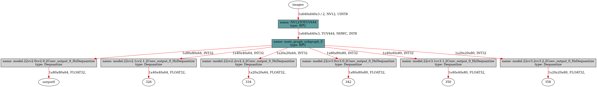
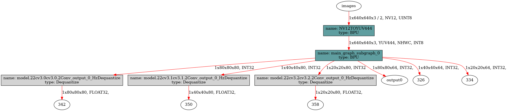

[English](./README.md) | 简体中文

# YOLOv8 Detect
- [YOLOv8 Detect](#yolov8-detect)
  - [YOLO介绍](#yolo介绍)
  - [性能数据 (简要)](#性能数据-简要)
    - [RDK X5 \& RDK X5 Module](#rdk-x5--rdk-x5-module)
    - [RDK X3 \& RDK X3 Module](#rdk-x3--rdk-x3-module)
  - [模型下载地址](#模型下载地址)
  - [输入输出数据](#输入输出数据)
  - [公版处理流程](#公版处理流程)
  - [优化处理流程](#优化处理流程)
  - [步骤参考](#步骤参考)
    - [环境、项目准备](#环境项目准备)
    - [导出为onnx](#导出为onnx)
    - [PTQ方案量化转化](#ptq方案量化转化)
    - [移除bbox信息3个输出头的反量化节点](#移除bbox信息3个输出头的反量化节点)
    - [使用hb\_perf命令对bin模型进行可视化, hrt\_model\_exec命令检查bin模型的输入输出情况](#使用hb_perf命令对bin模型进行可视化-hrt_model_exec命令检查bin模型的输入输出情况)
    - [部分编译日志参考](#部分编译日志参考)
  - [模型训练](#模型训练)
  - [性能数据](#性能数据)
    - [RDK X5 \& RDK X5 Module](#rdk-x5--rdk-x5-module-1)
    - [RDK X3 \& RDK X3 Module](#rdk-x3--rdk-x3-module-1)
  - [反馈](#反馈)
  - [参考](#参考)


## YOLO介绍


YOLO(You Only Look Once)是一种流行的物体检测和图像分割模型,由华盛顿大学的约瑟夫-雷德蒙(Joseph Redmon)和阿里-法哈迪(Ali Farhadi)开发。YOLO 于 2015 年推出,因其高速度和高精确度而迅速受到欢迎。

 - 2016 年发布的YOLOv2 通过纳入批量归一化、锚框和维度集群改进了原始模型。
2018 年推出的YOLOv3 使用更高效的骨干网络、多锚和空间金字塔池进一步增强了模型的性能。
 - YOLOv4于 2020 年发布,引入了 Mosaic 数据增强、新的无锚检测头和新的损失函数等创新技术。
 - YOLOv5进一步提高了模型的性能,并增加了超参数优化、集成实验跟踪和自动导出为常用导出格式等新功能。
 - YOLOv6于 2022 年由美团开源,目前已用于该公司的许多自主配送机器人。
 - YOLOv7增加了额外的任务,如 COCO 关键点数据集的姿势估计。
 - YOLOv8是YOLO 的最新版本,由Ultralytics 提供。YOLOv8 支持全方位的视觉 AI 任务,包括检测、分割、姿态估计、跟踪和分类。这种多功能性使用户能够在各种应用和领域中利用YOLOv8 的功能。
 - YOLOv9 引入了可编程梯度信息(PGI)和广义高效层聚合网络(GELAN)等创新方法。
 - YOLOv10是由清华大学的研究人员使用该软件包创建的。 UltralyticsPython 软件包创建的。该版本通过引入端到端头(End-to-End head), 消除了非最大抑制(NMS)要求, 实现了实时目标检测的进步.

## 性能数据 (简要)
### RDK X5 & RDK X5 Module
目标检测 Detection (COCO)
| 模型(公版) | 尺寸(像素) | 类别数 | 参数量 | BPU吞吐量 | 后处理时间(Python) |
|---------|---------|-------|---------|---------|----------|
| YOLOv8n | 640×640 | 80 | 3.2 M | 263.6 FPS | 5 ms |
| YOLOv8s | 640×640 | 80 | 11.2 M | 194.9 FPS | 5 ms |
| YOLOv8m | 640×640 | 80 | 25.9 M | 35.7 FPS | 5 ms |
| YOLOv8l | 640×640 | 80 | 43.7 M | 17.9 FPS | 5 ms |
| YOLOv8x | 640×640 | 80 | 68.2 M | 11.2 FPS | 5 ms |

### RDK X3 & RDK X3 Module
目标检测 Detection (COCO)
| 模型(公版) | 尺寸(像素) | 类别数 | 参数量 | BPU吞吐量 | 后处理时间(Python) |
|---------|---------|-------|---------|---------|----------|
| YOLOv8n | 640×640 | 80 | 3.2 M | 34.1 FPS | 6 ms |

注: 详细性能数据见文末.

## 模型下载地址
请参考`./model/download.md`

## 输入输出数据
- Input: 1x3x640x640, dtype=UINT8
- Output 0: [1, 80, 80, 64], dtype=INT32
- Output 1: [1, 40, 40, 64], dtype=INT32
- Output 2: [1, 20, 20, 64], dtype=INT32
- Output 3: [1, 80, 80, 80], dtype=FLOAT32
- Output 4: [1, 40, 40, 80], dtype=FLOAT32
- Output 5: [1, 20, 20, 80], dtype=FLOAT32


## 公版处理流程


## 优化处理流程


 - Classify部分,Dequantize操作
在模型编译时,如果选择了移除所有的反量化算子,这里需要在后处理中手动对Classify部分的三个输出头进行反量化。查看反量化系数的方式有多种,可以查看`hb_mapper`时产物的日志,也可通过BPU推理接口的API来获取。
注意,这里每一个C维度的反量化系数都是不同的,每个头都有80个反量化系数,可以使用numpy的广播直接乘。
此处反量化在bin模型中实现,所以拿到的输出是float32的。

 - Classify部分,ReduceMax操作
ReduceMax操作是沿着Tensor的某一个维度找到最大值,此操作用于找到8400个Grid Cell的80个分数的最大值。操作对象是每个Grid Cell的80类别的值,在C维度操作。注意,这步操作给出的是最大值,并不是80个值中最大值的索引。
激活函数Sigmoid具有单调性,所以Sigmoid作用前的80个分数的大小关系和Sigmoid作用后的80个分数的大小关系不会改变。
$$Sigmoid(x)=\frac{1}{1+e^{-x}}$$
$$Sigmoid(x_1) > Sigmoid(x_2) \Leftrightarrow x_1 > x_2$$
综上,bin模型直接输出的最大值(反量化完成)的位置就是最终分数最大值的位置,bin模型输出的最大值经过Sigmoid计算后就是原来onnx模型的最大值。

 - Classify部分,Threshold（TopK）操作
此操作用于找到8400个Grid Cell中,符合要求的Grid Cell。操作对象为8400个Grid Cell,在H和W的维度操作。如果您有阅读我的程序,你会发现我将后面H和W维度拉平了,这样只是为了程序设计和书面表达的方便,它们并没有本质上的不同。
我们假设某一个Grid Cell的某一个类别的分数记为$x$,激活函数作用完的整型数据为$y$,阈值筛选的过程会给定一个阈值,记为$C$,那么此分数合格的**充分必要条件**为：
$$y=Sigmoid(x)=\frac{1}{1+e^{-x}}>C$$
由此可以得出此分数合格的**充分必要条件**为：
$$x > -ln\left(\frac{1}{C}-1\right)$$
此操作会符合条件的Grid Cell的索引（indices）和对应Grid Cell的最大值,这个最大值经过Sigmoid计算后就是这个Grid Cell对应类别的分数了。

 - Classify部分,GatherElements操作和ArgMax操作
使用Threshold(TopK)操作得到的符合条件的Grid Cell的索引(indices),在GatherElements操作中获得符合条件的Grid Cell,使用ArgMax操作得到具体是80个类别中哪一个最大,得到这个符合条件的Grid Cell的类别。

 - Bounding Box部分,GatherElements操作和Dequantize操作
使用Threshold(TopK)操作得到的符合条件的Grid Cell的索引(indices),在GatherElements操作中获得符合条件的Grid Cell,这里每一个C维度的反量化系数都是不同的,每个头都有64个反量化系数,可以使用numpy的广播直接乘,得到1×64×k×1的bbox信息。

 - Bounding Box部分,DFL：SoftMax+Conv操作
每一个Grid Cell会有4个数字来确定这个框框的位置,DFL结构会对每个框的某条边基于anchor的位置给出16个估计,对16个估计求SoftMax,然后通过一个卷积操作来求期望,这也是Anchor Free的核心设计,即每个Grid Cell仅仅负责预测1个Bounding box。假设在对某一条边偏移量的预测中,这16个数字为 $ l_p $ 或者$(t_p, t_p, b_p)$,其中$p = 0,1,...,15$那么偏移量的计算公式为：
$$\hat{l} = \sum_{p=0}^{15}{\frac{p·e^{l_p}}{S}}, S =\sum_{p=0}^{15}{e^{l_p}}$$

 - Bounding Box部分,Decode：dist2bbox(ltrb2xyxy)操作
此操作将每个Bounding Box的ltrb描述解码为xyxy描述,ltrb分别表示左上右下四条边距离相对于Grid Cell中心的距离,相对位置还原成绝对位置后,再乘以对应特征层的采样倍数,即可还原成xyxy坐标,xyxy表示Bounding Box的左上角和右下角两个点坐标的预测值。


图片输入为$Size=640$,对于Bounding box预测分支的第$i$个特征图$(i=1, 2, 3)$,对应的下采样倍数记为$Stride(i)$,在YOLOv8 - Detect中,$Stride(1)=8, Stride(2)=16, Stride(3)=32$,对应特征图的尺寸记为$n_i = {Size}/{Stride(i)}$,即尺寸为$n_1 = 80, n_2 = 40 ,n_3 = 20$三个特征图,一共有$n_1^2+n_2^2+n_3^3=8400$个Grid Cell,负责预测8400个Bounding Box。
对特征图i,第x行y列负责预测对应尺度Bounding Box的检测框,其中$x,y \in [0, n_i)\bigcap{Z}$,$Z$为整数的集合。DFL结构后的Bounding Box检测框描述为$ltrb$描述,而我们需要的是$xyxy$描述,具体的转化关系如下：
$$x_1 = (x+0.5-l)\times{Stride(i)}$$
$$y_1 = (y+0.5-t)\times{Stride(i)}$$
$$x_2 = (x+0.5+r)\times{Stride(i)}$$
$$y_1 = (y+0.5+b)\times{Stride(i)}$$

YOLOv8,v9,会有一个nms操作去去掉重复识别的目标,YOLOv10不需要。最终的检测结果了,包括类别(id),分数(score)和位置(xyxy)。

## 步骤参考

注：任何No such file or directory, No module named "xxx", command not found.等报错请仔细检查,请勿逐条复制运行,如果对修改过程不理解请前往开发者社区从YOLOv5开始了解。
### 环境、项目准备
 - 下载ultralytics/ultralytics仓库,并参考YOLOv8官方文档,配置好环境
```bash
git clone https://github.com/ultralytics/ultralytics.git
```
 - 进入本地仓库,下载官方的预训练权重,这里以320万参数的YOLOv8n-Detect模型为例
```bash
cd ultralytics
wget https://github.com/ultralytics/assets/releases/download/v8.2.0/yolov8n.pt
```

### 导出为onnx
 - 卸载yolo相关的命令行命令,这样直接修改`./ultralytics/ultralytics`目录即可生效。
```bash
$ conda list | grep ultralytics
$ pip list | grep ultralytics # 或者
# 如果存在,则卸载
$ conda uninstall ultralytics 
$ pip uninstall ultralytics   # 或者
```
 - 修改Detect的输出头,直接将三个特征层的Bounding Box信息和Classify信息分开输出,一共6个输出头。
文件目录：`./ultralytics/ultralytics/nn/modules/head.py`,约第51行,`Detect`类的`forward`方法替换成以下内容.
注：建议您保留好原本的`forward`方法,例如改一个其他的名字`forward_`, 方便在训练的时候换回来。
```python
def forward(self, x):
    bboxes = [self.cv2[i](x[i]).permute(0, 2, 3, 1).contiguous() for i in range(self.nl)]
    clses = [self.cv3[i](x[i]).permute(0, 2, 3, 1).contiguous() for i in range(self.nl)]
    return (bboxes, clses)
```

 - 运行以下Python脚本,如果有**No module named onnxsim**报错,安装一个即可
```python
from ultralytics import YOLO
YOLO('yolov8n.pt').export(imgsz=640, format='onnx', simplify=True, opset=11)
```

### PTQ方案量化转化
 - 参考天工开物工具链手册和OE包, 对模型进行检查, 所有算子均在BPU上, 进行编译即可. 对应的yaml文件在`./ptq_yamls`目录下. 
```bash
(bpu_docker) $ hb_mapper checker --model-type onnx --march bayes-e --model yolov8n.onnx
(bpu_docker) $ hb_mapper makertbin --model-type onnx --config yolov8_detect_nchw.yaml
```

### 移除bbox信息3个输出头的反量化节点
 - 查看bbox信息的3个输出头的反量化节点名称
通过hb_mapper makerbin时的日志,看到大小为[1, 64, 80, 80], [1, 64, 40, 40], [1, 64, 20, 20]的三个输出的名称为output0, 326, 334。
```bash
ONNX IR version:          9
Opset version:            ['ai.onnx v11', 'horizon v1']
Producer:                 pytorch v2.1.1
Domain:                   None
Model version:            None
Graph input:
    images:               shape=[1, 3, 640, 640], dtype=FLOAT32
Graph output:
    output0:              shape=[1, 80, 80, 64], dtype=FLOAT32
    326:                  shape=[1, 40, 40, 64], dtype=FLOAT32
    334:                  shape=[1, 20, 20, 64], dtype=FLOAT32
    342:                  shape=[1, 80, 80, 80], dtype=FLOAT32
    350:                  shape=[1, 40, 40, 80], dtype=FLOAT32
    358:                  shape=[1, 20, 20, 80], dtype=FLOAT32
```

 - 进入编译产物的目录
```bash
$ cd yolov8n_bayese_640x640_nv12
```
 - 查看可以被移除的反量化节点
```bash
$ hb_model_modifier yolov8n_bayese_640x640_nv12.bin
```
 - 在生成的hb_model_modifier.log文件中,找到以下信息。主要是找到大小为[1, 64, 80, 80], [1, 64, 40, 40], [1, 64, 20, 20]的三个输出头的名称。当然,也可以通过netron等工具查看onnx模型,获得输出头的名称。
 此处的名称为:
 > "/model.22/cv2.0/cv2.0.2/Conv_output_0_quantized"
 > "/model.22/cv2.1/cv2.1.2/Conv_output_0_quantized"
 > "/model.22/cv2.2/cv2.2.2/Conv_output_0_quantized"

```bash
2024-08-14 15:50:25,193 file: hb_model_modifier.py func: hb_model_modifier line No: 409 input: "/model.22/cv2.0/cv2.0.2/Conv_output_0_quantized"
input: "/model.22/cv2.0/cv2.0.2/Conv_x_scale"
output: "output0"
name: "/model.22/cv2.0/cv2.0.2/Conv_output_0_HzDequantize"
op_type: "Dequantize"

2024-08-14 15:50:25,194 file: hb_model_modifier.py func: hb_model_modifier line No: 409 input: "/model.22/cv2.1/cv2.1.2/Conv_output_0_quantized"
input: "/model.22/cv2.1/cv2.1.2/Conv_x_scale"
output: "326"
name: "/model.22/cv2.1/cv2.1.2/Conv_output_0_HzDequantize"
op_type: "Dequantize"

input: "/model.22/cv2.2/cv2.2.2/Conv_x_scale"
output: "334"
name: "/model.22/cv2.2/cv2.2.2/Conv_output_0_HzDequantize"
op_type: "Dequantize"
```
 - 使用以下命令移除上述三个反量化节点,注意,导出时这些名称可能不同,请仔细确认。
```bash
$ hb_model_modifier yolov8n_bayese_640x640_nchw.bin \
-r /model.22/cv2.0/cv2.0.2/Conv_output_0_HzDequantize \
-r /model.22/cv2.1/cv2.1.2/Conv_output_0_HzDequantize \
-r /model.22/cv2.2/cv2.2.2/Conv_output_0_HzDequantize
```
 - 移除成功会显示以下日志
```bash
2024-08-14 15:55:01,233 INFO log will be stored in /open_explorer/yolov8n_bayese_640x640_nchw/hb_model_modifier.log
2024-08-14 15:55:01,238 INFO Nodes that will be removed from this model: ['/model.22/cv2.0/cv2.0.2/Conv_output_0_HzDequantize', '/model.22/cv2.1/cv2.1.2/Conv_output_0_HzDequantize', '/model.22/cv2.2/cv2.2.2/Conv_output_0_HzDequantize']
2024-08-14 15:55:01,238 INFO Node '/model.22/cv2.0/cv2.0.2/Conv_output_0_HzDequantize' found, its OP type is 'Dequantize'
2024-08-14 15:55:01,239 INFO scale: /model.22/cv2.0/cv2.0.2/Conv_x_scale; zero point: 0. node info details are stored in hb_model_modifier log file
2024-08-14 15:55:01,239 INFO Node '/model.22/cv2.0/cv2.0.2/Conv_output_0_HzDequantize' is removed
2024-08-14 15:55:01,239 INFO Node '/model.22/cv2.1/cv2.1.2/Conv_output_0_HzDequantize' found, its OP type is 'Dequantize'
2024-08-14 15:55:01,239 INFO scale: /model.22/cv2.1/cv2.1.2/Conv_x_scale; zero point: 0. node info details are stored in hb_model_modifier log file
2024-08-14 15:55:01,240 INFO Node '/model.22/cv2.1/cv2.1.2/Conv_output_0_HzDequantize' is removed
2024-08-14 15:55:01,240 INFO Node '/model.22/cv2.2/cv2.2.2/Conv_output_0_HzDequantize' found, its OP type is 'Dequantize'
2024-08-14 15:55:01,240 INFO scale: /model.22/cv2.2/cv2.2.2/Conv_x_scale; zero point: 0. node info details are stored in hb_model_modifier log file
2024-08-14 15:55:01,240 INFO Node '/model.22/cv2.2/cv2.2.2/Conv_output_0_HzDequantize' is removed
2024-08-14 15:55:01,245 INFO modified model saved as yolov8n_bayese_640x640_nchw_modified.bin
```

 - 接下来得到的bin模型名称为yolov8n_bayese_640x640_nchw_modified.bin, 这个是最终的模型。
 - NCHW输入的模型可以使用OpenCV和numpy来准备输入数据。
 - nv12输入的模型可以使用codec, jpu, vpu, gpu等硬件设备来准备输入数据,或者直接给TROS对应的功能包使用。

### 使用hb_perf命令对bin模型进行可视化, hrt_model_exec命令检查bin模型的输入输出情况
 - 移除反量化系数前的bin模型
```bash
hb_perf yolov8n_detect_bayese_640x640_nv12.bin
```
在`hb_perf_result`目录下可以找到以下结果：


```bash
hrt_model_exec model_info --model_file yolov8n_detect_bayese_640x640_nv12.bin
```
可以看到这个移除反量化系数前的bin模型的输入输出信息
```bash
[HBRT] set log level as 0. version = 3.15.54.0
[DNN] Runtime version = 1.23.10_(3.15.54 HBRT)
[A][DNN][packed_model.cpp:247][Model](2024-08-27,16:54:41.477.582) [HorizonRT] The model builder version = 1.23.8
Load model to DDR cost 27.689ms.
This model file has 1 model:
[yolov8n_detect_bayese_640x640_nv12]
---------------------------------------------------------------------
[model name]: yolov8n_detect_bayese_640x640_nv12

input[0]: 
name: images
input source: HB_DNN_INPUT_FROM_PYRAMID
valid shape: (1,3,640,640,)
aligned shape: (1,3,640,640,)
aligned byte size: 614400
tensor type: HB_DNN_IMG_TYPE_NV12
tensor layout: HB_DNN_LAYOUT_NCHW
quanti type: NONE
stride: (0,0,0,0,)

output[0]: 
name: output0
valid shape: (1,80,80,64,)
aligned shape: (1,80,80,64,)
aligned byte size: 1638400
tensor type: HB_DNN_TENSOR_TYPE_F32
tensor layout: HB_DNN_LAYOUT_NHWC
quanti type: NONE
stride: (1638400,20480,256,4,)

output[1]: 
name: 326
valid shape: (1,40,40,64,)
aligned shape: (1,40,40,64,)
aligned byte size: 409600
tensor type: HB_DNN_TENSOR_TYPE_F32
tensor layout: HB_DNN_LAYOUT_NHWC
quanti type: NONE
stride: (409600,10240,256,4,)

output[2]: 
name: 334
valid shape: (1,20,20,64,)
aligned shape: (1,20,20,64,)
aligned byte size: 102400
tensor type: HB_DNN_TENSOR_TYPE_F32
tensor layout: HB_DNN_LAYOUT_NHWC
quanti type: NONE
stride: (102400,5120,256,4,)

output[3]: 
name: 342
valid shape: (1,80,80,80,)
aligned shape: (1,80,80,80,)
aligned byte size: 2048000
tensor type: HB_DNN_TENSOR_TYPE_F32
tensor layout: HB_DNN_LAYOUT_NHWC
quanti type: NONE
stride: (2048000,25600,320,4,)

output[4]: 
name: 350
valid shape: (1,40,40,80,)
aligned shape: (1,40,40,80,)
aligned byte size: 512000
tensor type: HB_DNN_TENSOR_TYPE_F32
tensor layout: HB_DNN_LAYOUT_NHWC
quanti type: NONE
stride: (512000,12800,320,4,)

output[5]: 
name: 358
valid shape: (1,20,20,80,)
aligned shape: (1,20,20,80,)
aligned byte size: 128000
tensor type: HB_DNN_TENSOR_TYPE_F32
tensor layout: HB_DNN_LAYOUT_NHWC
quanti type: NONE
stride: (128000,6400,320,4,)
```

 - 移除目标反量化系数后的bin模型
```bash
hb_perf yolov8n_detect_bayese_640x640_nv12_modified.bin
```
在`hb_perf_result`目录下可以找到以下结果。



```bash
hrt_model_exec model_info --model_file yolov8n_detect_bayese_640x640_nv12_modified.bin
```
可以看到这个移除反量化系数前的bin模型的输入输出信息, 以及移除反量化节点的所有反量化系数, 这也说明bin模型中是存储着这些信息的, 可以使用推理库的API获得, 方便我们进行对应的前后处理.
```bash
[HBRT] set log level as 0. version = 3.15.54.0
[DNN] Runtime version = 1.23.10_(3.15.54 HBRT)
[A][DNN][packed_model.cpp:247][Model](2024-08-27,17:03:38.761.972) [HorizonRT] The model builder version = 1.23.8
Load model to DDR cost 25.791ms.
This model file has 1 model:
[yolov8n_detect_bayese_640x640_nv12]
---------------------------------------------------------------------
[model name]: yolov8n_detect_bayese_640x640_nv12

input[0]: 
name: images
input source: HB_DNN_INPUT_FROM_PYRAMID
valid shape: (1,3,640,640,)
aligned shape: (1,3,640,640,)
aligned byte size: 614400
tensor type: HB_DNN_IMG_TYPE_NV12
tensor layout: HB_DNN_LAYOUT_NCHW
quanti type: NONE
stride: (0,0,0,0,)

output[0]: 
name: output0
valid shape: (1,80,80,64,)
aligned shape: (1,80,80,64,)
aligned byte size: 1638400
tensor type: HB_DNN_TENSOR_TYPE_S32
tensor layout: HB_DNN_LAYOUT_NHWC
quanti type: SCALE
stride: (1638400,20480,256,4,)
scale data: 0.000318929,0.00032147,0.000303427,0.000281826,0.000237608,0.000196948,0.000192247,0.000155271,0.000198091,0.000214101,0.000143454,0.000127381,0.000122235,9.83469e-05,8.10663e-05,8.29722e-05,0.000302664,0.000309272,0.000280555,0.000250569,0.000223504,0.000290721,0.000195931,0.000159083,0.000185004,0.00017738,0.000118804,0.00012179,0.000118423,0.000104954,9.37726e-05,0.000122235,0.000314354,0.000319945,0.000282843,0.000243453,0.000244724,0.000179667,0.000201903,0.000133289,0.000208129,0.00018475,0.000123251,0.000120583,0.000112514,9.0469e-05,7.85886e-05,0.0001047,0.000297074,0.000273186,0.000267595,0.000225664,0.000214483,0.000301648,0.000234304,0.000173695,0.000156034,0.000156415,8.93254e-05,0.000109592,0.000106542,8.76736e-05,7.52849e-05,8.96431e-05,
quantizeAxis: 3

output[1]: 
name: 326
valid shape: (1,40,40,64,)
aligned shape: (1,40,40,64,)
aligned byte size: 409600
tensor type: HB_DNN_TENSOR_TYPE_S32
tensor layout: HB_DNN_LAYOUT_NHWC
quanti type: SCALE
stride: (409600,10240,256,4,)
scale data: 0.000231898,0.000221052,0.000178184,0.000175,0.000157353,0.000143408,0.000150209,0.000144097,0.000126451,0.000105533,9.24493e-05,8.53047e-05,9.22772e-05,9.12442e-05,8.67681e-05,9.78723e-05,0.000230349,0.00022329,0.00020332,0.000170609,0.000165359,0.000140051,0.000157095,0.000147196,0.000107427,0.000124815,9.03834e-05,7.26511e-05,8.08717e-05,7.97096e-05,7.42866e-05,9.11582e-05,0.000233964,0.000235341,0.000227078,0.000174655,0.000139363,0.000147971,0.000156148,0.00011965,0.000129033,0.000107169,8.014e-05,8.16894e-05,9.69255e-05,0.000106394,0.000108891,0.000122663,0.00022088,0.000211239,0.000213649,0.000175602,0.000164067,0.000149606,0.000143753,0.000119306,0.00010209,0.000156492,0.000102865,7.32967e-05,8.8834e-05,9.81306e-05,0.000100971,0.000115691,
quantizeAxis: 3

output[2]: 
name: 334
valid shape: (1,20,20,64,)
aligned shape: (1,20,20,64,)
aligned byte size: 102400
tensor type: HB_DNN_TENSOR_TYPE_S32
tensor layout: HB_DNN_LAYOUT_NHWC
quanti type: SCALE
stride: (102400,5120,256,4,)
scale data: 0.00026432,0.000255302,0.000239413,0.000278062,0.000228032,0.000182512,0.000184122,0.000209567,0.00022245,0.000162758,0.000213754,0.000158678,0.000157926,0.000162758,0.000150519,0.000126792,0.000250793,0.000232971,0.000260455,0.00025702,0.000219873,0.000179291,0.000224812,0.000158678,0.000193999,0.000245425,0.000159107,0.00015943,0.000128295,0.000118525,9.5443e-05,6.18393e-05,0.000251008,0.000281068,0.000253155,0.000264535,0.000242204,0.000195825,0.000253799,0.000159644,0.00018176,0.000177573,0.000224597,0.000158249,0.00012486,0.000168985,0.000186914,0.000174889,0.000273983,0.000269044,0.000255731,0.000202803,0.000206668,0.000221591,0.000227388,0.000172742,0.000206131,0.000199045,0.00017242,0.000148694,0.000138172,0.000151378,0.000143326,0.000127436,
quantizeAxis: 3

output[3]: 
name: 342
valid shape: (1,80,80,80,)
aligned shape: (1,80,80,80,)
aligned byte size: 2048000
tensor type: HB_DNN_TENSOR_TYPE_F32
tensor layout: HB_DNN_LAYOUT_NHWC
quanti type: NONE
stride: (2048000,25600,320,4,)

output[4]: 
name: 350
valid shape: (1,40,40,80,)
aligned shape: (1,40,40,80,)
aligned byte size: 512000
tensor type: HB_DNN_TENSOR_TYPE_F32
tensor layout: HB_DNN_LAYOUT_NHWC
quanti type: NONE
stride: (512000,12800,320,4,)

output[5]: 
name: 358
valid shape: (1,20,20,80,)
aligned shape: (1,20,20,80,)
aligned byte size: 128000
tensor type: HB_DNN_TENSOR_TYPE_F32
tensor layout: HB_DNN_LAYOUT_NHWC
quanti type: NONE
stride: (128000,6400,320,4,)
```

### 部分编译日志参考

可以看到: 
 - 工具链估算YOLOv8n大约能跑267FPS, 实际由于前处理, 量化节点和部分反量化节点在CPU上进行, 会略慢一些. 实测在X5上2个线程可达到263FPS的吞吐量. 
 - 尾部的transpose节点满足被动量化逻辑, 支持被BPU加速, 同时不影响其父节点Conv卷积算子以int32高精度输出.
 - 所有节点的余弦相似度均 > 0.9, 绝大多数节点的余弦相似度 > 0.95, 符合预期.
 - 所有算子均在BPU上, 整个bin模型只有1个BPU子图.

```bash
ONNX IR version:          6
Opset version:            ['ai.onnx v11', 'horizon v1']
Producer:                 pytorch v2.3.1
Domain:                   None
Model version:            None
Graph input:
    images:               shape=[1, 3, 640, 640], dtype=FLOAT32
Graph output:
    output0:              shape=[1, 80, 80, 64], dtype=FLOAT32
    326:                  shape=[1, 40, 40, 64], dtype=FLOAT32
    334:                  shape=[1, 20, 20, 64], dtype=FLOAT32
    342:                  shape=[1, 80, 80, 80], dtype=FLOAT32
    350:                  shape=[1, 40, 40, 80], dtype=FLOAT32
    358:                  shape=[1, 20, 20, 80], dtype=FLOAT32
2024-08-27 15:14:15,281 file: build.py func: build line No: 39 End to prepare the onnx model.
2024-08-27 15:14:15,497 file: build.py func: build line No: 197 Saving model: yolov8n_detect_bayese_640x640_nv12_original_float_model.onnx.
2024-08-27 15:14:15,497 file: build.py func: build line No: 36 Start to optimize the model.
2024-08-27 15:14:15,733 file: build.py func: build line No: 39 End to optimize the model.
2024-08-27 15:14:15,741 file: build.py func: build line No: 197 Saving model: yolov8n_detect_bayese_640x640_nv12_optimized_float_model.onnx.
2024-08-27 15:14:15,741 file: build.py func: build line No: 36 Start to calibrate the model.
2024-08-27 15:14:15,888 file: calibration_data_set.py func: calibration_data_set line No: 82 input name: images,  number_of_samples: 50
2024-08-27 15:14:15,889 file: calibration_data_set.py func: calibration_data_set line No: 93 There are 50 samples in the calibration data set.
2024-08-27 15:14:15,891 file: default_calibrater.py func: default_calibrater line No: 122 Run calibration model with default calibration method.
2024-08-27 15:14:16,646 file: calibrater.py func: calibrater line No: 235 Calibration using batch 8
2024-08-27 15:14:57,234 file: calibrater.py func: calibrater line No: 235 Calibration using batch 8
2024-08-27 15:15:05,613 file: calibrater.py func: calibrater line No: 235 Calibration using batch 8
2024-08-27 15:15:33,590 file: default_calibrater.py func: default_calibrater line No: 211 Select kl:num_bins=1024 method.
2024-08-27 15:15:35,963 file: build.py func: build line No: 39 End to calibrate the model.
2024-08-27 15:15:35,985 file: build.py func: build line No: 197 Saving model: yolov8n_detect_bayese_640x640_nv12_calibrated_model.onnx.
2024-08-27 15:15:35,985 file: build.py func: build line No: 36 Start to quantize the model.
2024-08-27 15:15:37,572 file: build.py func: build line No: 39 End to quantize the model.
2024-08-27 15:15:37,678 file: build.py func: build line No: 197 Saving model: yolov8n_detect_bayese_640x640_nv12_quantized_model.onnx.
2024-08-27 15:15:38,009 file: build.py func: build line No: 36 Start to compile the model with march bayes-e.
2024-08-27 15:15:38,168 file: hybrid_build.py func: hybrid_build line No: 133 Compile submodel: main_graph_subgraph_0
2024-08-27 15:15:38,382 file: hbdk_cc.py func: hbdk_cc line No: 115 hbdk-cc parameters:['--O3', '--core-num', '1', '--fast', '--advice', '1', '--input-layout', 'NHWC', '--output-layout', 'NHWC', '--input-source', 'pyramid']
2024-08-27 15:15:38,382 file: hbdk_cc.py func: hbdk_cc line No: 116 hbdk-cc command used:hbdk-cc -f hbir -m /tmp/tmprim5_i4c/main_graph_subgraph_0.hbir -o /tmp/tmprim5_i4c/main_graph_subgraph_0.hbm --march bayes-e --progressbar --O3 --core-num 1 --fast --advice 1 --input-layout NHWC --output-layout NHWC --input-source pyramid
2024-08-27 15:15:38,454 file: tool_utils.py func: tool_utils line No: 326 advice: Layer "UNIT_CONV_FOR_/model.2/m.0/Add" becomes slow (0ms -> 0.009ms). input & output channels per group is 1, recommend multiples of 4 & 8
2024-08-27 15:15:38,454 file: tool_utils.py func: tool_utils line No: 326 advice: Layer "UNIT_CONV_FOR_/model.4/m.0/Add" becomes slow (0ms -> 0.005ms). input & output channels per group is 1, recommend multiples of 4 & 8
2024-08-27 15:15:38,454 file: tool_utils.py func: tool_utils line No: 326 advice: Layer "UNIT_CONV_FOR_/model.4/m.1/Add" becomes slow (0ms -> 0.005ms). input & output channels per group is 1, recommend multiples of 4 & 8
2024-08-27 15:15:38,455 file: tool_utils.py func: tool_utils line No: 326 advice: Layer "UNIT_CONV_FOR_/model.6/m.0/Add" becomes slow (0ms -> 0.004ms). input & output channels per group is 1, recommend multiples of 4 & 8
2024-08-27 15:15:38,455 file: tool_utils.py func: tool_utils line No: 326 advice: Layer "UNIT_CONV_FOR_/model.6/m.1/Add" becomes slow (0ms -> 0.004ms). input & output channels per group is 1, recommend multiples of 4 & 8
2024-08-27 15:15:38,455 file: tool_utils.py func: tool_utils line No: 326 advice: Layer "UNIT_CONV_FOR_/model.8/m.0/Add" becomes slow (0ms -> 0.004ms). input & output channels per group is 1, recommend multiples of 4 & 8
2024-08-27 15:15:38,739 file: tool_utils.py func: tool_utils line No: 326 advice: Layer "/model.7/act/Mul" becomes slow (0.001ms -> 0.002ms). Output is aligned from 1x20x20x256 to 1x20x24x256 (+20%).
2024-08-27 15:15:38,739 file: tool_utils.py func: tool_utils line No: 326 advice: Layer "/model.8/cv1/act/Mul" becomes slow (0.001ms -> 0.002ms). Output is aligned from 1x20x20x256 to 1x20x24x256 (+20%).
2024-08-27 15:15:38,739 file: tool_utils.py func: tool_utils line No: 326 advice: Layer "/model.8/cv2/act/Mul" becomes slow (0.001ms -> 0.002ms). Output is aligned from 1x20x20x256 to 1x20x24x256 (+20%).
2024-08-27 15:15:38,739 file: tool_utils.py func: tool_utils line No: 326 advice: Layer "/model.9/cv2/act/Mul" becomes slow (0.001ms -> 0.002ms). Output is aligned from 1x20x20x256 to 1x20x24x256 (+20%).
2024-08-27 15:15:38,739 file: tool_utils.py func: tool_utils line No: 326 advice: Layer "/model.21/cv1/act/Mul" becomes slow (0.001ms -> 0.002ms). Output is aligned from 1x20x20x256 to 1x20x24x256 (+20%).
2024-08-27 15:15:38,740 file: tool_utils.py func: tool_utils line No: 326 advice: Layer "/model.21/cv2/act/Mul" becomes slow (0.001ms -> 0.002ms). Output is aligned from 1x20x20x256 to 1x20x24x256 (+20%).
2024-08-27 15:15:38,740 file: tool_utils.py func: tool_utils line No: 326 advice: Layer "/model.22/cv3.2/cv3.2.0/act/Mul" becomes slow (0ms -> 0.001ms). Output is aligned from 1x20x20x80 to 1x20x24x80 (+20%).
2024-08-27 15:15:38,740 file: tool_utils.py func: tool_utils line No: 326 advice: Layer "/model.22/cv3.2/cv3.2.1/act/Mul" becomes slow (0ms -> 0.001ms). Output is aligned from 1x20x20x80 to 1x20x24x80 (+20%).
2024-08-27 15:17:45,542 file: tool_utils.py func: tool_utils line No: 326 consumed time 127.142
2024-08-27 15:17:45,618 file: tool_utils.py func: tool_utils line No: 326 FPS=267.3, latency = 3741.2 us, DDR = 13216320 bytes   (see main_graph_subgraph_0.html)
2024-08-27 15:17:45,693 file: build.py func: build line No: 39 End to compile the model with march bayes-e.
2024-08-27 15:17:45,709 file: print_node_info.py func: print_node_info line No: 57 The converted model node information:
================================================================================================================================
Node                                                ON   Subgraph  Type          Cosine Similarity  Threshold   In/Out DataType  
---------------------------------------------------------------------------------------------------------------------------------
HZ_PREPROCESS_FOR_images                            BPU  id(0)     HzPreprocess  0.999963           127.000000  int8/int8        
/model.0/conv/Conv                                  BPU  id(0)     Conv          0.999701           1.006476    int8/int8        
/model.0/act/Mul                                    BPU  id(0)     HzSwish       0.983940           28.487597   int8/int8        
/model.1/conv/Conv                                  BPU  id(0)     Conv          0.950691           8.332462    int8/int8        
/model.1/act/Mul                                    BPU  id(0)     HzSwish       0.962026           35.641853   int8/int8        
/model.2/cv1/conv/Conv                              BPU  id(0)     Conv          0.963104           35.641853   int8/int8        
/model.2/cv1/act/Mul                                BPU  id(0)     HzSwish       0.986035           21.333359   int8/int8        
/model.2/Split                                      BPU  id(0)     Split         0.983058           7.917768    int8/int8        
/model.2/m.0/cv1/conv/Conv                          BPU  id(0)     Conv          0.973881           7.917768    int8/int8        
/model.2/m.0/cv1/act/Mul                            BPU  id(0)     HzSwish       0.982895           12.502892   int8/int8        
/model.2/m.0/cv2/conv/Conv                          BPU  id(0)     Conv          0.981714           9.066356    int8/int8        
/model.2/m.0/cv2/act/Mul                            BPU  id(0)     HzSwish       0.986748           12.494761   int8/int8        
UNIT_CONV_FOR_/model.2/m.0/Add                      BPU  id(0)     Conv          0.991556           7.917768    int8/int8        
/model.2/Split_output_0_calibrated_Requantize       BPU  id(0)     HzRequantize                                 int8/int8        
/model.2/Split_output_1_calibrated_Requantize       BPU  id(0)     HzRequantize                                 int8/int8        
/model.2/Concat                                     BPU  id(0)     Concat        0.988075           7.917768    int8/int8        
/model.2/cv2/conv/Conv                              BPU  id(0)     Conv          0.966790           7.949377    int8/int8        
/model.2/cv2/act/Mul                                BPU  id(0)     HzSwish       0.989698           6.046450    int8/int8        
/model.3/conv/Conv                                  BPU  id(0)     Conv          0.986052           4.959190    int8/int8        
/model.3/act/Mul                                    BPU  id(0)     HzSwish       0.991177           5.051995    int8/int8        
/model.4/cv1/conv/Conv                              BPU  id(0)     Conv          0.984965           6.182456    int8/int8        
/model.4/cv1/act/Mul                                BPU  id(0)     HzSwish       0.987723           5.514716    int8/int8        
/model.4/Split                                      BPU  id(0)     Split         0.995517           2.884014    int8/int8        
/model.4/m.0/cv1/conv/Conv                          BPU  id(0)     Conv          0.988115           2.884014    int8/int8        
/model.4/m.0/cv1/act/Mul                            BPU  id(0)     HzSwish       0.984533           3.977621    int8/int8        
/model.4/m.0/cv2/conv/Conv                          BPU  id(0)     Conv          0.985827           2.262680    int8/int8        
/model.4/m.0/cv2/act/Mul                            BPU  id(0)     HzSwish       0.988071           4.624912    int8/int8        
UNIT_CONV_FOR_/model.4/m.0/Add                      BPU  id(0)     Conv          0.995517           2.884014    int8/int8        
/model.4/m.1/cv1/conv/Conv                          BPU  id(0)     Conv          0.990191           4.170148    int8/int8        
/model.4/m.1/cv1/act/Mul                            BPU  id(0)     HzSwish       0.981214           5.107113    int8/int8        
/model.4/m.1/cv2/conv/Conv                          BPU  id(0)     Conv          0.986530           1.065875    int8/int8        
/model.4/m.1/cv2/act/Mul                            BPU  id(0)     HzSwish       0.989913           6.562280    int8/int8        
UNIT_CONV_FOR_/model.4/m.1/Add                      BPU  id(0)     Conv          0.994613           4.170148    int8/int8        
/model.4/Split_output_0_calibrated_Requantize       BPU  id(0)     HzRequantize                                 int8/int8        
/model.4/Split_output_1_calibrated_Requantize       BPU  id(0)     HzRequantize                                 int8/int8        
/model.4/m.0/Add_output_0_calibrated_Requantize     BPU  id(0)     HzRequantize                                 int8/int8        
/model.4/Concat                                     BPU  id(0)     Concat        0.992611           2.884014    int8/int8        
/model.4/cv2/conv/Conv                              BPU  id(0)     Conv          0.983199           4.072433    int8/int8        
/model.4/cv2/act/Mul                                BPU  id(0)     HzSwish       0.978473           6.862189    int8/int8        
/model.5/conv/Conv                                  BPU  id(0)     Conv          0.983270           1.726835    int8/int8        
/model.5/act/Mul                                    BPU  id(0)     HzSwish       0.979791           6.618050    int8/int8        
/model.6/cv1/conv/Conv                              BPU  id(0)     Conv          0.980245           2.842430    int8/int8        
/model.6/cv1/act/Mul                                BPU  id(0)     HzSwish       0.971201           9.845920    int8/int8        
/model.6/Split                                      BPU  id(0)     Split         0.962753           3.458714    int8/int8        
/model.6/m.0/cv1/conv/Conv                          BPU  id(0)     Conv          0.980700           3.458714    int8/int8        
/model.6/m.0/cv1/act/Mul                            BPU  id(0)     HzSwish       0.963725           8.673562    int8/int8        
/model.6/m.0/cv2/conv/Conv                          BPU  id(0)     Conv          0.974997           3.136314    int8/int8        
/model.6/m.0/cv2/act/Mul                            BPU  id(0)     HzSwish       0.969866           7.575806    int8/int8        
UNIT_CONV_FOR_/model.6/m.0/Add                      BPU  id(0)     Conv          0.982399           3.458714    int8/int8        
/model.6/m.1/cv1/conv/Conv                          BPU  id(0)     Conv          0.986903           4.668549    int8/int8        
/model.6/m.1/cv1/act/Mul                            BPU  id(0)     HzSwish       0.975911           7.939865    int8/int8        
/model.6/m.1/cv2/conv/Conv                          BPU  id(0)     Conv          0.974695           3.379527    int8/int8        
/model.6/m.1/cv2/act/Mul                            BPU  id(0)     HzSwish       0.976508           10.314319   int8/int8        
UNIT_CONV_FOR_/model.6/m.1/Add                      BPU  id(0)     Conv          0.978472           4.668549    int8/int8        
/model.6/Split_output_0_calibrated_Requantize       BPU  id(0)     HzRequantize                                 int8/int8        
/model.6/Split_output_1_calibrated_Requantize       BPU  id(0)     HzRequantize                                 int8/int8        
/model.6/m.0/Add_output_0_calibrated_Requantize     BPU  id(0)     HzRequantize                                 int8/int8        
/model.6/Concat                                     BPU  id(0)     Concat        0.979866           3.458714    int8/int8        
/model.6/cv2/conv/Conv                              BPU  id(0)     Conv          0.982879           3.834387    int8/int8        
/model.6/cv2/act/Mul                                BPU  id(0)     HzSwish       0.964464           6.650268    int8/int8        
/model.7/conv/Conv                                  BPU  id(0)     Conv          0.974587           1.514358    int8/int8        
/model.7/act/Mul                                    BPU  id(0)     HzSwish       0.945766           7.931966    int8/int8        
/model.8/cv1/conv/Conv                              BPU  id(0)     Conv          0.968011           3.168602    int8/int8        
/model.8/cv1/act/Mul                                BPU  id(0)     HzSwish       0.937273           11.031602   int8/int8        
/model.8/Split                                      BPU  id(0)     Split         0.961290           5.442732    int8/int8        
/model.8/m.0/cv1/conv/Conv                          BPU  id(0)     Conv          0.975174           5.442732    int8/int8        
/model.8/m.0/cv1/act/Mul                            BPU  id(0)     HzSwish       0.951151           9.543906    int8/int8        
/model.8/m.0/cv2/conv/Conv                          BPU  id(0)     Conv          0.951645           2.707561    int8/int8        
/model.8/m.0/cv2/act/Mul                            BPU  id(0)     HzSwish       0.952061           11.745684   int8/int8        
UNIT_CONV_FOR_/model.8/m.0/Add                      BPU  id(0)     Conv          0.961290           5.442732    int8/int8        
/model.8/Concat                                     BPU  id(0)     Concat        0.943990           5.442732    int8/int8        
/model.8/cv2/conv/Conv                              BPU  id(0)     Conv          0.953119           5.442732    int8/int8        
/model.8/cv2/act/Mul                                BPU  id(0)     HzSwish       0.928729           9.701499    int8/int8        
/model.9/cv1/conv/Conv                              BPU  id(0)     Conv          0.980667           3.611087    int8/int8        
/model.9/cv1/act/Mul                                BPU  id(0)     HzSwish       0.979877           7.203421    int8/int8        
/model.9/m/MaxPool                                  BPU  id(0)     MaxPool       0.991557           8.227496    int8/int8        
/model.9/m_1/MaxPool                                BPU  id(0)     MaxPool       0.995107           8.227496    int8/int8        
/model.9/m_2/MaxPool                                BPU  id(0)     MaxPool       0.995926           8.227496    int8/int8        
/model.9/Concat                                     BPU  id(0)     Concat        0.992977           8.227496    int8/int8        
/model.9/cv2/conv/Conv                              BPU  id(0)     Conv          0.984588           8.227496    int8/int8        
/model.9/cv2/act/Mul                                BPU  id(0)     HzSwish       0.931194           10.398964   int8/int8        
/model.10/Resize                                    BPU  id(0)     Resize        0.931192           2.933620    int8/int8        
/model.10/Resize_output_0_calibrated_Requantize     BPU  id(0)     HzRequantize                                 int8/int8        
...el.6/cv2/act/Mul_output_0_calibrated_Requantize  BPU  id(0)     HzRequantize                                 int8/int8        
/model.11/Concat                                    BPU  id(0)     Concat        0.943290           2.933620    int8/int8        
/model.12/cv1/conv/Conv                             BPU  id(0)     Conv          0.968889           2.863633    int8/int8        
/model.12/cv1/act/Mul                               BPU  id(0)     HzSwish       0.955941           8.169102    int8/int8        
/model.12/Split                                     BPU  id(0)     Split         0.932411           4.321618    int8/int8        
/model.12/m.0/cv1/conv/Conv                         BPU  id(0)     Conv          0.974304           4.321618    int8/int8        
/model.12/m.0/cv1/act/Mul                           BPU  id(0)     HzSwish       0.955985           9.717354    int8/int8        
/model.12/m.0/cv2/conv/Conv                         BPU  id(0)     Conv          0.962603           2.320002    int8/int8        
/model.12/m.0/cv2/act/Mul                           BPU  id(0)     HzSwish       0.964119           8.533821    int8/int8        
/model.12/Split_output_0_calibrated_Requantize      BPU  id(0)     HzRequantize                                 int8/int8        
/model.12/Split_output_1_calibrated_Requantize      BPU  id(0)     HzRequantize                                 int8/int8        
/model.12/Concat                                    BPU  id(0)     Concat        0.954745           4.321618    int8/int8        
/model.12/cv2/conv/Conv                             BPU  id(0)     Conv          0.949902           2.565149    int8/int8        
/model.12/cv2/act/Mul                               BPU  id(0)     HzSwish       0.952417           8.480585    int8/int8        
/model.13/Resize                                    BPU  id(0)     Resize        0.952423           2.000532    int8/int8        
/model.13/Resize_output_0_calibrated_Requantize     BPU  id(0)     HzRequantize                                 int8/int8        
...el.4/cv2/act/Mul_output_0_calibrated_Requantize  BPU  id(0)     HzRequantize                                 int8/int8        
/model.14/Concat                                    BPU  id(0)     Concat        0.962114           2.000532    int8/int8        
/model.15/cv1/conv/Conv                             BPU  id(0)     Conv          0.981623           1.719969    int8/int8        
/model.15/cv1/act/Mul                               BPU  id(0)     HzSwish       0.989235           7.899533    int8/int8        
/model.15/Split                                     BPU  id(0)     Split         0.981886           2.049619    int8/int8        
/model.15/m.0/cv1/conv/Conv                         BPU  id(0)     Conv          0.982591           2.049619    int8/int8        
/model.15/m.0/cv1/act/Mul                           BPU  id(0)     HzSwish       0.982684           5.346570    int8/int8        
/model.15/m.0/cv2/conv/Conv                         BPU  id(0)     Conv          0.980505           2.016669    int8/int8        
/model.15/m.0/cv2/act/Mul                           BPU  id(0)     HzSwish       0.989267           7.023796    int8/int8        
/model.15/Split_output_0_calibrated_Requantize      BPU  id(0)     HzRequantize                                 int8/int8        
/model.15/Split_output_1_calibrated_Requantize      BPU  id(0)     HzRequantize                                 int8/int8        
/model.15/Concat                                    BPU  id(0)     Concat        0.989161           2.049619    int8/int8        
/model.15/cv2/conv/Conv                             BPU  id(0)     Conv          0.985770           4.667559    int8/int8        
/model.15/cv2/act/Mul                               BPU  id(0)     HzSwish       0.988397           6.530685    int8/int8        
/model.16/conv/Conv                                 BPU  id(0)     Conv          0.973623           4.306739    int8/int8        
/model.16/act/Mul                                   BPU  id(0)     HzSwish       0.959220           7.574402    int8/int8        
/model.17/Concat                                    BPU  id(0)     Concat        0.954696           2.000532    int8/int8        
/model.18/cv1/conv/Conv                             BPU  id(0)     Conv          0.947652           2.000532    int8/int8        
/model.18/cv1/act/Mul                               BPU  id(0)     HzSwish       0.943989           8.116028    int8/int8        
/model.18/Split                                     BPU  id(0)     Split         0.967628           3.095994    int8/int8        
/model.18/m.0/cv1/conv/Conv                         BPU  id(0)     Conv          0.978087           3.095994    int8/int8        
/model.18/m.0/cv1/act/Mul                           BPU  id(0)     HzSwish       0.973053           7.771765    int8/int8        
/model.18/m.0/cv2/conv/Conv                         BPU  id(0)     Conv          0.947351           2.667906    int8/int8        
/model.18/m.0/cv2/act/Mul                           BPU  id(0)     HzSwish       0.951318           12.311721   int8/int8        
/model.18/Split_output_0_calibrated_Requantize      BPU  id(0)     HzRequantize                                 int8/int8        
/model.18/Split_output_1_calibrated_Requantize      BPU  id(0)     HzRequantize                                 int8/int8        
/model.18/Concat                                    BPU  id(0)     Concat        0.947193           3.095994    int8/int8        
/model.18/cv2/conv/Conv                             BPU  id(0)     Conv          0.966942           4.202897    int8/int8        
/model.18/cv2/act/Mul                               BPU  id(0)     HzSwish       0.963021           11.414235   int8/int8        
/model.19/conv/Conv                                 BPU  id(0)     Conv          0.953284           2.389427    int8/int8        
/model.19/act/Mul                                   BPU  id(0)     HzSwish       0.909035           9.203076    int8/int8        
/model.20/Concat                                    BPU  id(0)     Concat        0.922714           2.933620    int8/int8        
/model.21/cv1/conv/Conv                             BPU  id(0)     Conv          0.945641           2.933620    int8/int8        
/model.21/cv1/act/Mul                               BPU  id(0)     HzSwish       0.913275           10.712182   int8/int8        
/model.21/Split                                     BPU  id(0)     Split         0.946602           2.631145    int8/int8        
/model.21/m.0/cv1/conv/Conv                         BPU  id(0)     Conv          0.964698           2.631145    int8/int8        
/model.21/m.0/cv1/act/Mul                           BPU  id(0)     HzSwish       0.910859           9.703785    int8/int8        
/model.21/m.0/cv2/conv/Conv                         BPU  id(0)     Conv          0.912427           2.016695    int8/int8        
/model.21/m.0/cv2/act/Mul                           BPU  id(0)     HzSwish       0.869220           11.332086   int8/int8        
/model.21/Split_output_0_calibrated_Requantize      BPU  id(0)     HzRequantize                                 int8/int8        
/model.21/Split_output_1_calibrated_Requantize      BPU  id(0)     HzRequantize                                 int8/int8        
/model.21/Concat                                    BPU  id(0)     Concat        0.893570           2.631145    int8/int8        
/model.21/cv2/conv/Conv                             BPU  id(0)     Conv          0.930367           3.175123    int8/int8        
/model.21/cv2/act/Mul                               BPU  id(0)     HzSwish       0.877066           16.742874   int8/int8        
/model.22/cv2.0/cv2.0.0/conv/Conv                   BPU  id(0)     Conv          0.975804           4.306739    int8/int8        
/model.22/cv2.0/cv2.0.0/act/Mul                     BPU  id(0)     HzSwish       0.969790           12.153861   int8/int8        
/model.22/cv2.0/cv2.0.1/conv/Conv                   BPU  id(0)     Conv          0.951564           2.801831    int8/int8        
/model.22/cv2.0/cv2.0.1/act/Mul                     BPU  id(0)     HzSwish       0.957819           29.491873   int8/int8        
/model.22/cv2.0/cv2.0.2/Conv                        BPU  id(0)     Conv          0.988477           16.788700   int8/int32       
/model.22/cv2.1/cv2.1.0/conv/Conv                   BPU  id(0)     Conv          0.951235           2.389427    int8/int8        
/model.22/cv2.1/cv2.1.0/act/Mul                     BPU  id(0)     HzSwish       0.929399           12.683200   int8/int8        
/model.22/cv2.1/cv2.1.1/conv/Conv                   BPU  id(0)     Conv          0.937632           3.803235    int8/int8        
/model.22/cv2.1/cv2.1.1/act/Mul                     BPU  id(0)     HzSwish       0.944866           34.527729   int8/int8        
/model.22/cv2.1/cv2.1.2/Conv                        BPU  id(0)     Conv          0.985281           11.373573   int8/int32       
/model.22/cv2.2/cv2.2.0/conv/Conv                   BPU  id(0)     Conv          0.890129           2.509010    int8/int8        
/model.22/cv2.2/cv2.2.0/act/Mul                     BPU  id(0)     HzSwish       0.883712           14.067017   int8/int8        
/model.22/cv2.2/cv2.2.1/conv/Conv                   BPU  id(0)     Conv          0.893171           5.373805    int8/int8        
/model.22/cv2.2/cv2.2.1/act/Mul                     BPU  id(0)     HzSwish       0.912115           38.107906   int8/int8        
/model.22/cv2.2/cv2.2.2/Conv                        BPU  id(0)     Conv          0.976587           14.185336   int8/int32       
/model.22/cv3.0/cv3.0.0/conv/Conv                   BPU  id(0)     Conv          0.980767           4.306739    int8/int8        
/model.22/cv3.0/cv3.0.0/act/Mul                     BPU  id(0)     HzSwish       0.968411           8.419792    int8/int8        
/model.22/cv3.0/cv3.0.1/conv/Conv                   BPU  id(0)     Conv          0.955289           2.055245    int8/int8        
/model.22/cv3.0/cv3.0.1/act/Mul                     BPU  id(0)     HzSwish       0.971183           34.347996   int8/int8        
/model.22/cv3.0/cv3.0.2/Conv                        BPU  id(0)     Conv          0.999401           30.894808   int8/int32       
/model.22/cv3.1/cv3.1.0/conv/Conv                   BPU  id(0)     Conv          0.965293           2.389427    int8/int8        
/model.22/cv3.1/cv3.1.0/act/Mul                     BPU  id(0)     HzSwish       0.944704           9.442360    int8/int8        
/model.22/cv3.1/cv3.1.1/conv/Conv                   BPU  id(0)     Conv          0.924308           2.328762    int8/int8        
/model.22/cv3.1/cv3.1.1/act/Mul                     BPU  id(0)     HzSwish       0.942553           56.563751   int8/int8        
/model.22/cv3.1/cv3.1.2/Conv                        BPU  id(0)     Conv          0.997893           37.485596   int8/int32       
/model.22/cv3.2/cv3.2.0/conv/Conv                   BPU  id(0)     Conv          0.905185           2.509010    int8/int8        
/model.22/cv3.2/cv3.2.0/act/Mul                     BPU  id(0)     HzSwish       0.898839           14.976290   int8/int8        
/model.22/cv3.2/cv3.2.1/conv/Conv                   BPU  id(0)     Conv          0.910616           5.586462    int8/int8        
/model.22/cv3.2/cv3.2.1/act/Mul                     BPU  id(0)     HzSwish       0.942039           47.940197   int8/int8        
/model.22/cv3.2/cv3.2.2/Conv                        BPU  id(0)     Conv          0.998530           16.482979   int8/int32
2024-08-27 15:17:45,711 file: build.py func: build line No: 39 End to Horizon NN Model Convert.
2024-08-27 15:17:45,764 file: hb_mapper_makertbin.py func: hb_mapper_makertbin line No: 601 start convert to *.bin file....
2024-08-27 15:17:45,783 file: onnx2horizonrt.py func: onnx2horizonrt line No: 4327 ONNX model output num : 6
2024-08-27 15:17:45,785 file: layout_util.py func: layout_util line No: 15 set_featuremap_layout start
2024-08-27 15:17:45,785 file: onnx2horizonrt.py func: onnx2horizonrt line No: 4061 model_deps_info: {'hb_mapper_version': '1.23.8', 'hbdk_version': '3.49.14', 'hbdk_runtime_version': ' 3.15.54.0', 'horizon_nn_version': '1.0.6.3', 'onnx_model': '/open_explorer/detect_weights/yolov8n.onnx', 'march': 'bayes-e', 'layer_out_dump': False, 'log_level': 'DEBUG', 'working_dir': '/open_explorer/yolov8n_detect_bayese_640x640_nv12', 'model_prefix': 'yolov8n_detect_bayese_640x640_nv12', 'input_names': ['images'], 'input_type_rt': ['nv12'], 'input_space_and_range': ['regular'], 'input_type_train': ['rgb'], 'input_layout_rt': [''], 'input_layout_train': ['NCHW'], 'norm_type': ['data_scale'], 'scale_value': ['0.003921568627451,'], 'mean_value': [''], 'input_shape': ['1x3x640x640'], 'input_batch': [], 'cal_dir': ['/open_explorer/calibration_data_rgb_f32_coco_640'], 'cal_data_type': ['float32'], 'preprocess_on': False, 'calibration_type': 'default', 'per_channel': 'False', 'hbdk_params': {'hbdk_pass_through_params': '--O3 --core-num 1 --fast --advice 1 ', 'input-source': {'images': 'pyramid', '_default_value': 'ddr'}}, 'debug': False, 'compile_mode': 'latency'}
2024-08-27 15:17:45,785 file: onnx2horizonrt.py func: onnx2horizonrt line No: 4184 ############# model deps info #############
2024-08-27 15:17:45,785 file: onnx2horizonrt.py func: onnx2horizonrt line No: 4185 hb_mapper version   : 1.23.8
2024-08-27 15:17:45,785 file: onnx2horizonrt.py func: onnx2horizonrt line No: 4188 hbdk version        : 3.49.14
2024-08-27 15:17:45,785 file: onnx2horizonrt.py func: onnx2horizonrt line No: 4190 hbdk runtime version: 3.15.54.0
2024-08-27 15:17:45,785 file: onnx2horizonrt.py func: onnx2horizonrt line No: 4193 horizon_nn version  : 1.0.6.3
2024-08-27 15:17:45,785 file: onnx2horizonrt.py func: onnx2horizonrt line No: 4197 ############# model_parameters info #############
2024-08-27 15:17:45,785 file: onnx2horizonrt.py func: onnx2horizonrt line No: 4203 onnx_model          : /open_explorer/detect_weights/yolov8n.onnx
2024-08-27 15:17:45,785 file: onnx2horizonrt.py func: onnx2horizonrt line No: 4204 BPU march           : bayes-e
2024-08-27 15:17:45,785 file: onnx2horizonrt.py func: onnx2horizonrt line No: 4205 layer_out_dump      : False
2024-08-27 15:17:45,785 file: onnx2horizonrt.py func: onnx2horizonrt line No: 4206 log_level           : DEBUG
2024-08-27 15:17:45,786 file: onnx2horizonrt.py func: onnx2horizonrt line No: 4207 working dir         : /open_explorer/yolov8n_detect_bayese_640x640_nv12
2024-08-27 15:17:45,786 file: onnx2horizonrt.py func: onnx2horizonrt line No: 4208 output_model_file_prefix: yolov8n_detect_bayese_640x640_nv12
2024-08-27 15:17:45,786 file: onnx2horizonrt.py func: onnx2horizonrt line No: 4229 ############# input_parameters info #############
2024-08-27 15:17:45,786 file: onnx2horizonrt.py func: onnx2horizonrt line No: 4247 ------------------------------------------
2024-08-27 15:17:45,786 file: onnx2horizonrt.py func: onnx2horizonrt line No: 4249 ---------input info : images ---------
2024-08-27 15:17:45,786 file: onnx2horizonrt.py func: onnx2horizonrt line No: 4250 input_name          : images
2024-08-27 15:17:45,786 file: onnx2horizonrt.py func: onnx2horizonrt line No: 4251 input_type_rt       : nv12
2024-08-27 15:17:45,786 file: onnx2horizonrt.py func: onnx2horizonrt line No: 4253 input_space&range   : regular
2024-08-27 15:17:45,786 file: onnx2horizonrt.py func: onnx2horizonrt line No: 4255 input_layout_rt     : None
2024-08-27 15:17:45,786 file: onnx2horizonrt.py func: onnx2horizonrt line No: 4256 input_type_train    : rgb
2024-08-27 15:17:45,786 file: onnx2horizonrt.py func: onnx2horizonrt line No: 4257 input_layout_train  : NCHW
2024-08-27 15:17:45,786 file: onnx2horizonrt.py func: onnx2horizonrt line No: 4258 norm_type           : data_scale
2024-08-27 15:17:45,786 file: onnx2horizonrt.py func: onnx2horizonrt line No: 4259 input_shape         : 1x3x640x640
2024-08-27 15:17:45,786 file: onnx2horizonrt.py func: onnx2horizonrt line No: 4267 scale_value         : 0.003921568627451,
2024-08-27 15:17:45,786 file: onnx2horizonrt.py func: onnx2horizonrt line No: 4269 cal_data_dir        : /open_explorer/calibration_data_rgb_f32_coco_640
2024-08-27 15:17:45,786 file: onnx2horizonrt.py func: onnx2horizonrt line No: 4271 cal_data_type       : float32
2024-08-27 15:17:45,786 file: onnx2horizonrt.py func: onnx2horizonrt line No: 4272 ---------input info : images end -------
2024-08-27 15:17:45,786 file: onnx2horizonrt.py func: onnx2horizonrt line No: 4273 ------------------------------------------
2024-08-27 15:17:45,786 file: onnx2horizonrt.py func: onnx2horizonrt line No: 4275 ############# calibration_parameters info #############
2024-08-27 15:17:45,786 file: onnx2horizonrt.py func: onnx2horizonrt line No: 4276 preprocess_on       : False
2024-08-27 15:17:45,786 file: onnx2horizonrt.py func: onnx2horizonrt line No: 4277 calibration_type:   : default
2024-08-27 15:17:45,786 file: onnx2horizonrt.py func: onnx2horizonrt line No: 4285 per_channel         : False
2024-08-27 15:17:45,786 file: onnx2horizonrt.py func: onnx2horizonrt line No: 4304 ############# compiler_parameters info #############
2024-08-27 15:17:45,786 file: onnx2horizonrt.py func: onnx2horizonrt line No: 4306 debug               : False
2024-08-27 15:17:45,786 file: onnx2horizonrt.py func: onnx2horizonrt line No: 4308 compile_mode        : latency
2024-08-27 15:17:45,787 file: onnx2horizonrt.py func: onnx2horizonrt line No: 4311 hbdk_pass_through_params: --O3 --core-num 1 --fast --advice 1
2024-08-27 15:17:45,787 file: onnx2horizonrt.py func: onnx2horizonrt line No: 4311 input-source        : {'images': 'pyramid', '_default_value': 'ddr'}
2024-08-27 15:17:45,789 file: hb_mapper_makertbin.py func: hb_mapper_makertbin line No: 783 Convert to runtime bin file successfully!
2024-08-27 15:17:45,789 file: hb_mapper_makertbin.py func: hb_mapper_makertbin line No: 784 End Model Convert
```


## 模型训练

 - 模型训练请参考ultralytics官方文档,这个文档由ultralytics维护,质量非常的高。网络上也有非常多的参考材料,得到一个像官方一样的预训练权重的模型并不困难。
 - 请注意,训练时无需修改任何程序,无需修改forward方法。

## 性能数据

### RDK X5 & RDK X5 Module
目标检测 Detection (COCO)
| 模型 | 尺寸(像素) | 类别数 | 参数量 | 浮点精度<br/>(mAP:50-95) | 量化精度<br/>(mAP:50-95) | BPU延迟/BPU吞吐量(线程) |  后处理时间<br/>(Python) |
|---------|---------|-------|---------|---------|----------|--------------------|--------------------|
| YOLOv8n | 640×640 | 80 | 3.2 M | 37.3 |  | 5.6 ms /178.0 FPS (1 thread) <br/> 7.5 ms / 263.6 FPS (2 threads) | 5 ms |
| YOLOv8s | 640×640 | 80 | 11.2 M | 44.9 |  | 12.4 ms /80.2 FPS (1 thread) <br/> 21 ms / 94.9 FPS (2 threads) | 5 ms |
| YOLOv8m | 640×640 | 80 | 25.9 M | 50.2 |  | 29.9 ms /33.4 FPS (1 thread) <br/> 55.9 ms / 35.7 FPS (2 threads) | 5 ms |
| YOLOv8l | 640×640 | 80 | 43.7 M | 52.9 |  | 57.6 ms /17.3 FPS (1 thread) <br/> 111.1 ms / 17.9 FPS (2 threads) | 5 ms |
| YOLOv8x | 640×640 | 80 | 68.2 M | 53.9 |  | 90.0 ms /11.0 FPS (1 thread) <br/> 177.5 ms / 11.2 FPS (2 threads) | 5 ms |

TODO: 目标检测 Detection (Open Image V7)
| 模型 | 尺寸(像素) | 类别数 | 参数量(M) | 浮点精度 | 
|------|------|-------|---------|---------|
| YOLOv8n | 640×640 | 600 | 3.5 | 18.4 | 
| YOLOv8s | 640×640 | 600 | 11.4 | 27.7 | 
| YOLOv8m | 640×640 | 600 | 26.2 | 33.6 | 
| YOLOv8l | 640×640 | 600 | 44.1 | 34.9 | 
| YOLOv8x | 640×640 | 600 | 68.7 | 36.3 | 

### RDK X3 & RDK X3 Module
目标检测 Detection (COCO)
| 模型 | 尺寸(像素) | 类别数 | 参数量 | 浮点精度<br/>(mAP:50-95) | 量化精度<br/>(mAP:50-95) | BPU延迟/BPU吞吐量(线程) |  后处理时间<br/>(Python) |
|---------|---------|-------|---------|---------|----------|--------------------|--------------------|
| YOLOv8n | 640×640 | 80 | 3.2 M | 37.3  | - | 99.8 ms / 10.0 FPS (1 thread) <br/> 102.0 ms / 19.6 FPS (2 threads)<br/> 131.4 ms / 30.2 FPS (4 threads)<br/> 231.0 ms / 34.1 FPS (8 threads) | 6 ms |

说明: 
1. X5的状态为最佳状态：CPU为8 × A55@1.8G, 全核心Performance调度, BPU为1 × Bayes-e@1G, 共10TOPS等效int8算力。
```bash
sudo bash -c "echo 1 > /sys/devices/system/cpu/cpufreq/boost"  # 1.8Ghz
sudo bash -c "echo performance > /sys/devices/system/cpu/cpufreq/policy0/scaling_governor" # Performance Mode
```
1. 单线程延迟为单帧,单线程,单BPU核心的延迟,BPU推理一个任务最理想的情况。
2. 多线程帧率为多个线程同时向BPU塞任务, 每个BPU核心可以处理多个线程的任务, 一般工程中4个线程可以控制单帧延迟较小,同时吃满所有BPU到100%,在吞吐量(FPS)和帧延迟间得到一个较好的平衡。X5的BPU整体比较厉害, 一般2个线程就可以将BPU吃满, 帧延迟和吞吐量都非常出色。
3. 8线程极限帧率为8个线程同时向BPU塞任务,目的是为了测试BPU的极限性能,一般来说4线程已经占满,如果8线程比4线程还要好很多,说明模型结构需要提高"计算/访存"比,或者编译时选择优化DDR带宽。
4. 浮点/定点mAP：50-95精度使用pycocotools计算,来自于COCO数据集,可以参考微软的论文,此处用于评估板端部署的精度下降程度。
5. BPU延迟和BPU吞吐量使用以下命令在板端测试
```bash
hrt_model_exec perf --thread_num 2 --model_file yolov8n_detect_bayese_640x640_nv12_modified.bin
```
1. 关于后处理: 目前在X5上使用Python重构的后处理, 仅需要单核心单线程串行5ms左右即可完成, 也就是说只需要占用2个CPU核心(200%的CPU占用, 最大800%的CPU占用), 每分钟可完成400帧图像的后处理, 后处理不会构成瓶颈.

## 反馈
本文如果有表达不清楚的地方欢迎前往地瓜开发者社区进行提问和交流.

[地瓜机器人开发者社区](developer.d-robotics.cc).

## 参考

[ultralytics](https://docs.ultralytics.com/)