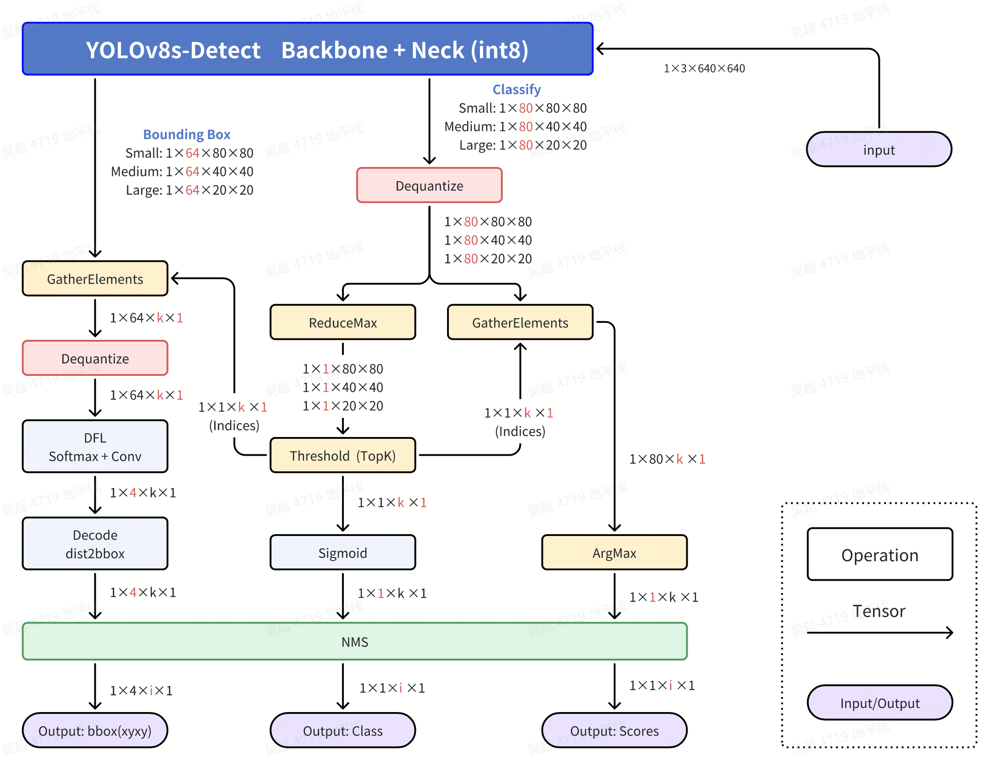
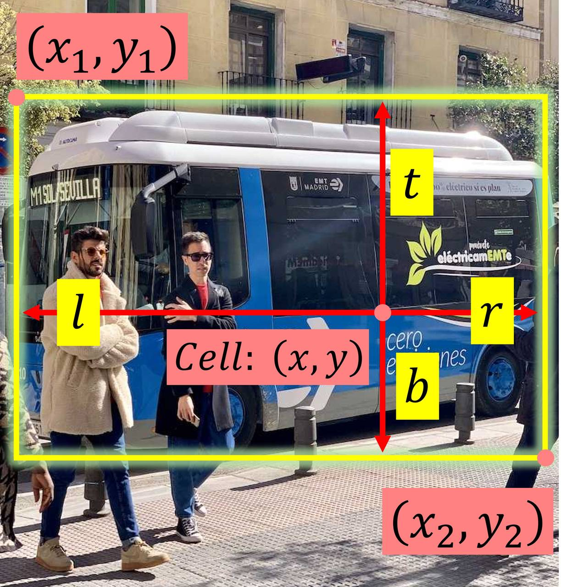

[English](./README.md) | 简体中文

# YOLOv8 Detect
- [YOLOv8 Detect](#yolov8-detect)
  - [YOLO介绍](#yolo介绍)
  - [公版处理流程](#公版处理流程)
  - [优化处理流程](#优化处理流程)
  - [步骤参考](#步骤参考)
    - [环境、项目准备](#环境项目准备)
    - [导出为onnx](#导出为onnx)
    - [PTQ方案量化转化](#ptq方案量化转化)
    - [移除bbox信息3个输出头的反量化节点](#移除bbox信息3个输出头的反量化节点)
    - [使用hb\_perf命令对bin模型进行可视化, hrt\_model\_exec命令检查bin模型的输入输出情况](#使用hb_perf命令对bin模型进行可视化-hrt_model_exec命令检查bin模型的输入输出情况)
    - [部分编译日志参考](#部分编译日志参考)
  - [模型训练](#模型训练)
  - [性能数据](#性能数据)
    - [RDK X5 \& RDK X5 Module](#rdk-x5--rdk-x5-module)
    - [RDK X3 \& RDK X3 Module](#rdk-x3--rdk-x3-module)
  - [精度数据](#精度数据)
    - [RDK X5 \& RDK X5 Module](#rdk-x5--rdk-x5-module-1)
    - [测试方法](#测试方法)
  - [反馈](#反馈)
  - [参考](#参考)

## YOLO介绍


YOLO(You Only Look Once)是一种流行的物体检测和图像分割模型,由华盛顿大学的约瑟夫-雷德蒙(Joseph Redmon)和阿里-法哈迪(Ali Farhadi)开发。YOLO 于 2015 年推出,因其高速度和高精确度而迅速受到欢迎。

 - 2016 年发布的YOLOv2 通过纳入批量归一化、锚框和维度集群改进了原始模型。
2018 年推出的YOLOv3 使用更高效的骨干网络、多锚和空间金字塔池进一步增强了模型的性能。
 - YOLOv4于 2020 年发布,引入了 Mosaic 数据增强、新的无锚检测头和新的损失函数等创新技术。
 - YOLOv5进一步提高了模型的性能,并增加了超参数优化、集成实验跟踪和自动导出为常用导出格式等新功能。
 - YOLOv6于 2022 年由美团开源,目前已用于该公司的许多自主配送机器人。
 - YOLOv7增加了额外的任务,如 COCO 关键点数据集的姿势估计。
 - YOLOv8是YOLO 的最新版本,由Ultralytics 提供。YOLOv8 支持全方位的视觉 AI 任务,包括检测、分割、姿态估计、跟踪和分类。这种多功能性使用户能够在各种应用和领域中利用YOLOv8 的功能。
 - YOLOv9 引入了可编程梯度信息(PGI)和广义高效层聚合网络(GELAN)等创新方法。
 - YOLOv10是由清华大学的研究人员使用该软件包创建的。 UltralyticsPython 软件包创建的。该版本通过引入端到端头(End-to-End head), 消除了非最大抑制(NMS)要求, 实现了实时目标检测的进步.

## 公版处理流程


## 优化处理流程


 - Classify部分,Dequantize操作
在模型编译时,如果选择了移除所有的反量化算子,这里需要在后处理中手动对Classify部分的三个输出头进行反量化。查看反量化系数的方式有多种,可以查看`hb_mapper`时产物的日志,也可通过BPU推理接口的API来获取。
注意,这里每一个C维度的反量化系数都是不同的,每个头都有80个反量化系数,可以使用numpy的广播直接乘。
此处反量化在bin模型中实现,所以拿到的输出是float32的。

 - Classify部分,ReduceMax操作
ReduceMax操作是沿着Tensor的某一个维度找到最大值,此操作用于找到8400个Grid Cell的80个分数的最大值。操作对象是每个Grid Cell的80类别的值,在C维度操作。注意,这步操作给出的是最大值,并不是80个值中最大值的索引。
激活函数Sigmoid具有单调性,所以Sigmoid作用前的80个分数的大小关系和Sigmoid作用后的80个分数的大小关系不会改变。

$$Sigmoid(x)=\frac{1}{1+e^{-x}}$$

$$Sigmoid(x_1) > Sigmoid(x_2) \Leftrightarrow x_1 > x_2$$

综上,bin模型直接输出的最大值(反量化完成)的位置就是最终分数最大值的位置,bin模型输出的最大值经过Sigmoid计算后就是原来onnx模型的最大值。

 - Classify部分,Threshold（TopK）操作
此操作用于找到8400个Grid Cell中,符合要求的Grid Cell。操作对象为8400个Grid Cell,在H和W的维度操作。如果您有阅读我的程序,你会发现我将后面H和W维度拉平了,这样只是为了程序设计和书面表达的方便,它们并没有本质上的不同。
我们假设某一个Grid Cell的某一个类别的分数记为$x$,激活函数作用完的整型数据为$y$,阈值筛选的过程会给定一个阈值,记为$C$,那么此分数合格的**充分必要条件**为：

$$y=Sigmoid(x)=\frac{1}{1+e^{-x}}>C$$

由此可以得出此分数合格的**充分必要条件**为：

$$x > -ln\left(\frac{1}{C}-1\right)$$

此操作会符合条件的Grid Cell的索引（indices）和对应Grid Cell的最大值,这个最大值经过Sigmoid计算后就是这个Grid Cell对应类别的分数了。

 - Classify部分,GatherElements操作和ArgMax操作
使用Threshold(TopK)操作得到的符合条件的Grid Cell的索引(indices),在GatherElements操作中获得符合条件的Grid Cell,使用ArgMax操作得到具体是80个类别中哪一个最大,得到这个符合条件的Grid Cell的类别。

 - Bounding Box部分,GatherElements操作和Dequantize操作
使用Threshold(TopK)操作得到的符合条件的Grid Cell的索引(indices),在GatherElements操作中获得符合条件的Grid Cell,这里每一个C维度的反量化系数都是不同的,每个头都有64个反量化系数,可以使用numpy的广播直接乘,得到1×64×k×1的bbox信息。

 - Bounding Box部分,DFL：SoftMax+Conv操作
每一个Grid Cell会有4个数字来确定这个框框的位置,DFL结构会对每个框的某条边基于anchor的位置给出16个估计,对16个估计求SoftMax,然后通过一个卷积操作来求期望,这也是Anchor Free的核心设计,即每个Grid Cell仅仅负责预测1个Bounding box。假设在对某一条边偏移量的预测中,这16个数字为 $l_p$ 或者$(t_p, t_p, b_p)$,其中$p = 0,1,...,15$那么偏移量的计算公式为：

$$\hat{l} = \sum_{p=0}^{15}{\frac{p·e^{l_p}}{S}}$$
$$S =\sum_{p=0}^{15}{e^{l_p}}$$

 - Bounding Box部分,Decode：dist2bbox(ltrb2xyxy)操作
此操作将每个Bounding Box的ltrb描述解码为xyxy描述,ltrb分别表示左上右下四条边距离相对于Grid Cell中心的距离,相对位置还原成绝对位置后,再乘以对应特征层的采样倍数,即可还原成xyxy坐标,xyxy表示Bounding Box的左上角和右下角两个点坐标的预测值。



图片输入为$Size=640$,对于Bounding box预测分支的第$i$个特征图$(i=1, 2, 3)$,对应的下采样倍数记为$Stride(i)$, 在YOLOv8 - Detect中,$Stride(1)=8, Stride(2)=16, Stride(3)=32$, 对应特征图的尺寸记为$n_i = {Size}/{Stride(i)}$,即尺寸为$n_1 = 80, n_2 = 40 ,n_3 = 20$三个特征图,一共有$n_1^2+n_2^2+n_3^3=8400$个Grid Cell,负责预测8400个Bounding Box。
对特征图i,第x行y列负责预测对应尺度Bounding Box的检测框,其中$x,y \in [0, n_i)\bigcap{Z}$, $Z$为整数的集合。DFL结构后的Bounding Box检测框描述为$ltrb$描述,而我们需要的是$xyxy$描述,具体的转化关系如下:

$$x_1 = (x+0.5-l)\times{Stride(i)}$$

$$y_1 = (y+0.5-t)\times{Stride(i)}$$

$$x_2 = (x+0.5+r)\times{Stride(i)}$$

$$y_1 = (y+0.5+b)\times{Stride(i)}$$

YOLOv8,v9,会有一个nms操作去去掉重复识别的目标,YOLOv10不需要。最终的检测结果了,包括类别(id),分数(score)和位置(xyxy)。

## 步骤参考

注：任何No such file or directory, No module named "xxx", command not found.等报错请仔细检查,请勿逐条复制运行,如果对修改过程不理解请前往开发者社区从YOLOv5开始了解。
### 环境、项目准备
 - 下载ultralytics/ultralytics仓库,并参考YOLOv8官方文档,配置好环境
```bash
git clone https://github.com/ultralytics/ultralytics.git
```
 - 进入本地仓库,下载官方的预训练权重,这里以320万参数的YOLOv8n-Detect模型为例
```bash
cd ultralytics
wget https://github.com/ultralytics/assets/releases/download/v8.2.0/yolov8n.pt
```

### 导出为onnx
 - 卸载yolo相关的命令行命令,这样直接修改`./ultralytics/ultralytics`目录即可生效。
```bash
$ conda list | grep ultralytics
$ pip list | grep ultralytics # 或者
# 如果存在,则卸载
$ conda uninstall ultralytics 
$ pip uninstall ultralytics   # 或者
```

如果不是很顺利，可以通过以下Python命令确认需要修改的`ultralytics`目录的位置:
```bash
>>> import ultralytics
>>> ultralytics.__path__
['/home/wuchao/miniconda3/envs/yolo/lib/python3.11/site-packages/ultralytics']
# 或者
['/home/wuchao/YOLO11/ultralytics_v11/ultralytics']
```

 - 修改Detect的输出头,直接将三个特征层的Bounding Box信息和Classify信息分开输出,一共6个输出头。
文件目录：`./ultralytics/ultralytics/nn/modules/head.py`,约第51行,`Detect`类的`forward`方法替换成以下内容.
注：建议您保留好原本的`forward`方法,例如改一个其他的名字`forward_`, 方便在训练的时候换回来。

注: 输出头顺序不能乱, 否则会报错. 另外不同版本的依赖库内部细节有一些不同, 如果发现输出头顺序与README的不同, 可以尝试修改append的顺序, 从而调转onnx输出头的顺序

```python
def forward(self, x):
    result = []
    for i in range(self.nl):
        result.append(self.cv3[i](x[i]).permute(0, 2, 3, 1).contiguous())
        result.append(self.cv2[i](x[i]).permute(0, 2, 3, 1).contiguous())
    return result

## 如果输出头顺序刚好是bbox和cls反的, 可以使用如下修改方式, 调换cv2和cv3的append顺序
## 然后再重新导出onnx, 编译为bin模型
def forward(self, x):
    result = []
    for i in range(self.nl):
        result.append(self.cv2[i](x[i]).permute(0, 2, 3, 1).contiguous())
        result.append(self.cv3[i](x[i]).permute(0, 2, 3, 1).contiguous())
    return result
```

 - 运行以下Python脚本,如果有**No module named onnxsim**报错,安装一个即可
```python
from ultralytics import YOLO
YOLO('yolov8n.pt').export(imgsz=640, format='onnx', simplify=False, opset=11)
```

### PTQ方案量化转化
 - 参考天工开物工具链手册和OE包(OpenExplore), 对模型进行检查, 所有算子均在BPU上, 进行编译即可.
```bash
(bpu_docker) $ hb_mapper checker --model-type onnx --march bayes-e --model yolov8n.onnx
(bpu_docker) $ hb_mapper makertbin --model-type onnx --config config_yolov8_detect_nv12.yaml
```

### 移除bbox信息3个输出头的反量化节点
 - 查看bbox信息的3个输出头的反量化节点名称
通过hb_mapper makerbin时的日志,看到大小为[1, 80, 80, 64], [1, 40, 40, 64], [1, 20, 20, 64]的三个输出的名称为output0, 326, 334。
 - 这里有一个小口诀, 就是带64的都移除. 这里的64 = 4 * REG, REG = 16.
```bash
ONNX IR version:          9
Opset version:            ['ai.onnx v11', 'horizon v1']
Producer:                 pytorch v2.1.1
Domain:                   None
Model version:            None
Graph input:
    images:               shape=[1, 3, 640, 640], dtype=FLOAT32
Graph output:
    output0:              shape=[1, 80, 80, 64], dtype=FLOAT32
    326:                  shape=[1, 40, 40, 64], dtype=FLOAT32
    334:                  shape=[1, 20, 20, 64], dtype=FLOAT32
    342:                  shape=[1, 80, 80, 80], dtype=FLOAT32
    350:                  shape=[1, 40, 40, 80], dtype=FLOAT32
    358:                  shape=[1, 20, 20, 80], dtype=FLOAT32
```

 - 进入编译产物的目录
```bash
$ cd yolov8n_bayese_640x640_nv12
```
 - 查看可以被移除的反量化节点
```bash
$ hb_model_modifier yolov8n_bayese_640x640_nv12.bin
```
 - 在生成的hb_model_modifier.log文件中,找到以下信息。主要是找到大小为[1, 64, 80, 80], [1, 64, 40, 40], [1, 64, 20, 20]的三个输出头的名称。当然,也可以通过netron等工具查看onnx模型,获得输出头的名称。
 此处的名称为:
 > "/model.22/cv2.0/cv2.0.2/Conv_output_0_quantized"
 > "/model.22/cv2.1/cv2.1.2/Conv_output_0_quantized"
 > "/model.22/cv2.2/cv2.2.2/Conv_output_0_quantized"

```bash
2024-08-14 15:50:25,193 file: hb_model_modifier.py func: hb_model_modifier line No: 409 input: "/model.22/cv2.0/cv2.0.2/Conv_output_0_quantized"
input: "/model.22/cv2.0/cv2.0.2/Conv_x_scale"
output: "output0"
name: "/model.22/cv2.0/cv2.0.2/Conv_output_0_HzDequantize"
op_type: "Dequantize"

2024-08-14 15:50:25,194 file: hb_model_modifier.py func: hb_model_modifier line No: 409 input: "/model.22/cv2.1/cv2.1.2/Conv_output_0_quantized"
input: "/model.22/cv2.1/cv2.1.2/Conv_x_scale"
output: "326"
name: "/model.22/cv2.1/cv2.1.2/Conv_output_0_HzDequantize"
op_type: "Dequantize"

input: "/model.22/cv2.2/cv2.2.2/Conv_x_scale"
output: "334"
name: "/model.22/cv2.2/cv2.2.2/Conv_output_0_HzDequantize"
op_type: "Dequantize"
```
 - 使用以下命令移除上述三个反量化节点,注意,导出时这些名称可能不同,请仔细确认。
```bash
$ hb_model_modifier yolov8n_bayese_640x640_nv12.bin \
-r /model.22/cv2.0/cv2.0.2/Conv_output_0_HzDequantize \
-r /model.22/cv2.1/cv2.1.2/Conv_output_0_HzDequantize \
-r /model.22/cv2.2/cv2.2.2/Conv_output_0_HzDequantize
```
 - 移除成功会显示以下日志
```bash
2024-08-14 15:55:01,233 INFO log will be stored in /open_explorer/yolov8n_bayese_640x640_nchw/hb_model_modifier.log
2024-08-14 15:55:01,238 INFO Nodes that will be removed from this model: ['/model.22/cv2.0/cv2.0.2/Conv_output_0_HzDequantize', '/model.22/cv2.1/cv2.1.2/Conv_output_0_HzDequantize', '/model.22/cv2.2/cv2.2.2/Conv_output_0_HzDequantize']
2024-08-14 15:55:01,238 INFO Node '/model.22/cv2.0/cv2.0.2/Conv_output_0_HzDequantize' found, its OP type is 'Dequantize'
2024-08-14 15:55:01,239 INFO scale: /model.22/cv2.0/cv2.0.2/Conv_x_scale; zero point: 0. node info details are stored in hb_model_modifier log file
2024-08-14 15:55:01,239 INFO Node '/model.22/cv2.0/cv2.0.2/Conv_output_0_HzDequantize' is removed
2024-08-14 15:55:01,239 INFO Node '/model.22/cv2.1/cv2.1.2/Conv_output_0_HzDequantize' found, its OP type is 'Dequantize'
2024-08-14 15:55:01,239 INFO scale: /model.22/cv2.1/cv2.1.2/Conv_x_scale; zero point: 0. node info details are stored in hb_model_modifier log file
2024-08-14 15:55:01,240 INFO Node '/model.22/cv2.1/cv2.1.2/Conv_output_0_HzDequantize' is removed
2024-08-14 15:55:01,240 INFO Node '/model.22/cv2.2/cv2.2.2/Conv_output_0_HzDequantize' found, its OP type is 'Dequantize'
2024-08-14 15:55:01,240 INFO scale: /model.22/cv2.2/cv2.2.2/Conv_x_scale; zero point: 0. node info details are stored in hb_model_modifier log file
2024-08-14 15:55:01,240 INFO Node '/model.22/cv2.2/cv2.2.2/Conv_output_0_HzDequantize' is removed
2024-08-14 15:55:01,245 INFO modified model saved as yolov8n_bayese_640x640_nchw_modified.bin
```

 - 接下来得到的bin模型名称为yolov8n_bayese_640x640_nchw_modified.bin, 这个是最终的模型。
 - NCHW输入的模型可以使用OpenCV和numpy来准备输入数据。
 - nv12输入的模型可以使用codec, jpu, vpu, gpu等硬件设备来准备输入数据,或者直接给TROS对应的功能包使用。

### 使用hb_perf命令对bin模型进行可视化, hrt_model_exec命令检查bin模型的输入输出情况
 - 移除反量化系数前的bin模型
```bash
hb_perf yolov8n_detect_bayese_640x640_nv12.bin
```
在`hb_perf_result`目录下可以找到以下结果：


```bash
hrt_model_exec model_info --model_file yolov8n_detect_bayese_640x640_nv12.bin
```
可以看到这个移除反量化系数前的bin模型的输入输出信息
```bash
[HBRT] set log level as 0. version = 3.15.55.0
[DNN] Runtime version = 1.24.5_(3.15.55 HBRT)
[A][DNN][packed_model.cpp:247][Model](2024-12-26,11:32:30.68.263) [HorizonRT] The model builder version = 1.24.3
Load model to DDR cost 24.163ms.
This model file has 1 model:
[yolov8n_detect_bayese_640x640_nv12]
---------------------------------------------------------------------
[model name]: yolov8n_detect_bayese_640x640_nv12

input[0]: 
name: images
input source: HB_DNN_INPUT_FROM_PYRAMID
valid shape: (1,3,640,640,)
aligned shape: (1,3,640,640,)
aligned byte size: 614400
tensor type: HB_DNN_IMG_TYPE_NV12
tensor layout: HB_DNN_LAYOUT_NCHW
quanti type: NONE
stride: (0,0,0,0,)

output[0]: 
name: output0
valid shape: (1,80,80,80,)
aligned shape: (1,80,80,80,)
aligned byte size: 2048000
tensor type: HB_DNN_TENSOR_TYPE_F32
tensor layout: HB_DNN_LAYOUT_NHWC
quanti type: NONE
stride: (2048000,25600,320,4,)

output[1]: 
name: 326
valid shape: (1,80,80,64,)
aligned shape: (1,80,80,64,)
aligned byte size: 1638400
tensor type: HB_DNN_TENSOR_TYPE_F32
tensor layout: HB_DNN_LAYOUT_NHWC
quanti type: NONE
stride: (1638400,20480,256,4,)

output[2]: 
name: 334
valid shape: (1,40,40,80,)
aligned shape: (1,40,40,80,)
aligned byte size: 512000
tensor type: HB_DNN_TENSOR_TYPE_F32
tensor layout: HB_DNN_LAYOUT_NHWC
quanti type: NONE
stride: (512000,12800,320,4,)

output[3]: 
name: 342
valid shape: (1,40,40,64,)
aligned shape: (1,40,40,64,)
aligned byte size: 409600
tensor type: HB_DNN_TENSOR_TYPE_F32
tensor layout: HB_DNN_LAYOUT_NHWC
quanti type: NONE
stride: (409600,10240,256,4,)

output[4]: 
name: 350
valid shape: (1,20,20,80,)
aligned shape: (1,20,20,80,)
aligned byte size: 128000
tensor type: HB_DNN_TENSOR_TYPE_F32
tensor layout: HB_DNN_LAYOUT_NHWC
quanti type: NONE
stride: (128000,6400,320,4,)

output[5]: 
name: 358
valid shape: (1,20,20,64,)
aligned shape: (1,20,20,64,)
aligned byte size: 102400
tensor type: HB_DNN_TENSOR_TYPE_F32
tensor layout: HB_DNN_LAYOUT_NHWC
quanti type: NONE
stride: (102400,5120,256,4,)
```

 - 移除目标反量化系数后的bin模型
```bash
hb_perf yolov8n_detect_bayese_640x640_nv12_modified.bin
```
在`hb_perf_result`目录下可以找到以下结果。


```bash
hrt_model_exec model_info --model_file yolov8n_detect_bayese_640x640_nv12_modified.bin
```
可以看到这个移除反量化系数后的bin模型的输入输出信息, 以及移除反量化节点的所有反量化系数, 这也说明bin模型中是存储着这些信息的, 可以使用推理库的API获得, 方便我们进行对应的前后处理.
```bash
[HBRT] set log level as 0. version = 3.15.55.0
[DNN] Runtime version = 1.24.5_(3.15.55 HBRT)
[A][DNN][packed_model.cpp:247][Model](2024-12-26,11:32:46.127.195) [HorizonRT] The model builder version = 1.24.3
Load model to DDR cost 27.631ms.
This model file has 1 model:
[yolov8n_detect_bayese_640x640_nv12]
---------------------------------------------------------------------
[model name]: yolov8n_detect_bayese_640x640_nv12

input[0]: 
name: images
input source: HB_DNN_INPUT_FROM_PYRAMID
valid shape: (1,3,640,640,)
aligned shape: (1,3,640,640,)
aligned byte size: 614400
tensor type: HB_DNN_IMG_TYPE_NV12
tensor layout: HB_DNN_LAYOUT_NCHW
quanti type: NONE
stride: (0,0,0,0,)

output[0]: 
name: output0
valid shape: (1,80,80,80,)
aligned shape: (1,80,80,80,)
aligned byte size: 2048000
tensor type: HB_DNN_TENSOR_TYPE_F32
tensor layout: HB_DNN_LAYOUT_NHWC
quanti type: NONE
stride: (2048000,25600,320,4,)

output[1]: 
name: 326
valid shape: (1,80,80,64,)
aligned shape: (1,80,80,64,)
aligned byte size: 1638400
tensor type: HB_DNN_TENSOR_TYPE_S32
tensor layout: HB_DNN_LAYOUT_NHWC
quanti type: SCALE
stride: (1638400,20480,256,4,)
scale data: 0.000482368,0.000486211,0.000458922,0.000426252,0.000359374,0.000297876,0.000290766,0.000234842,0.000299606,0.000323821,0.000216969,0.000192659,0.000184876,0.000148746,0.00012261,0.000125492,0.000457769,0.000467762,0.00042433,0.000378976,0.000338042,0.000439704,0.000296339,0.000240607,0.000279812,0.000268281,0.000179687,0.000184203,0.00017911,0.000158739,0.000141828,0.000184876,0.000475449,0.000483905,0.000427789,0.000368214,0.000370136,0.00027174,0.000305371,0.000201595,0.000314788,0.000279427,0.000186413,0.000182377,0.000170174,0.000136831,0.000118862,0.000158355,0.000449313,0.000413184,0.000404728,0.000341309,0.000324397,0.000456231,0.000354377,0.000262708,0.000235995,0.000236572,0.000135101,0.000165754,0.000161142,0.000132603,0.000113866,0.000135582,
quantizeAxis: 3

output[2]: 
name: 334
valid shape: (1,40,40,80,)
aligned shape: (1,40,40,80,)
aligned byte size: 512000
tensor type: HB_DNN_TENSOR_TYPE_F32
tensor layout: HB_DNN_LAYOUT_NHWC
quanti type: NONE
stride: (512000,12800,320,4,)

output[3]: 
name: 342
valid shape: (1,40,40,64,)
aligned shape: (1,40,40,64,)
aligned byte size: 409600
tensor type: HB_DNN_TENSOR_TYPE_S32
tensor layout: HB_DNN_LAYOUT_NHWC
quanti type: SCALE
stride: (409600,10240,256,4,)
scale data: 0.000649184,0.000618821,0.000498816,0.0004899,0.000440501,0.000401463,0.0004205,0.000403391,0.000353991,0.000295434,0.000258806,0.000238805,0.000258324,0.000255432,0.000242902,0.000273987,0.000644847,0.000625087,0.000569181,0.000477611,0.000462911,0.000392065,0.000439778,0.000412066,0.000300736,0.000349412,0.000253023,0.000203382,0.000226395,0.000223142,0.000207961,0.000255192,0.000654967,0.000658823,0.00063569,0.000488936,0.000390137,0.000414234,0.000437127,0.000334954,0.00036122,0.000300013,0.000224347,0.000228684,0.000271337,0.000297844,0.000304832,0.000343388,0.000618339,0.00059135,0.000598098,0.000491587,0.000459297,0.000418813,0.000402427,0.00033399,0.000285795,0.000438091,0.000287964,0.000205189,0.000248685,0.00027471,0.000282663,0.000323869,
quantizeAxis: 3

output[4]: 
name: 350
valid shape: (1,20,20,80,)
aligned shape: (1,20,20,80,)
aligned byte size: 128000
tensor type: HB_DNN_TENSOR_TYPE_F32
tensor layout: HB_DNN_LAYOUT_NHWC
quanti type: NONE
stride: (128000,6400,320,4,)

output[5]: 
name: 358
valid shape: (1,20,20,64,)
aligned shape: (1,20,20,64,)
aligned byte size: 102400
tensor type: HB_DNN_TENSOR_TYPE_S32
tensor layout: HB_DNN_LAYOUT_NHWC
quanti type: SCALE
stride: (102400,5120,256,4,)
scale data: 0.000756978,0.000731151,0.000685647,0.000796334,0.000653055,0.00052269,0.000527302,0.000600171,0.000637067,0.000466117,0.000612163,0.000454433,0.000452281,0.000466117,0.000431066,0.000363116,0.000718238,0.000667199,0.00074591,0.000736071,0.000629688,0.000513466,0.000643831,0.000454433,0.000555589,0.000702865,0.000455663,0.000456585,0.000367421,0.000339441,0.000273336,0.0001771,0.000718853,0.000804943,0.000725002,0.000757593,0.000693641,0.000560816,0.000726847,0.0004572,0.000520538,0.000508547,0.000643216,0.000453203,0.000357582,0.00048395,0.000535296,0.00050086,0.00078465,0.000770507,0.000732381,0.000580801,0.00059187,0.000634608,0.000651211,0.000494711,0.000590333,0.00057004,0.000493789,0.000425839,0.000395707,0.000433525,0.000410466,0.000364961,
quantizeAxis: 3
```

### 部分编译日志参考

可以看到: 
 - 工具链估算YOLOv8n大约能跑267FPS, 实际由于前处理, 量化节点和部分反量化节点在CPU上进行, 会略慢一些. 实测在X5上2个线程可达到263FPS的吞吐量. 
 - 尾部的transpose节点满足被动量化逻辑, 支持被BPU加速, 同时不影响其父节点Conv卷积算子以int32高精度输出.
 - 所有节点的余弦相似度均 > 0.9, 绝大多数节点的余弦相似度 > 0.99, 符合预期.
 - 所有算子均在BPU上, 整个bin模型只有1个BPU子图.

```bash
ONNX IR version:          6
Opset version:            ['ai.onnx v11', 'horizon v1']
Producer:                 pytorch v2.5.0
Domain:                   None
Version:                  None
Graph input:
    images:               shape=[1, 3, 640, 640], dtype=FLOAT32
Graph output:
    output0:              shape=[1, 80, 80, 80], dtype=FLOAT32
    326:                  shape=[1, 80, 80, 64], dtype=FLOAT32
    334:                  shape=[1, 40, 40, 80], dtype=FLOAT32
    342:                  shape=[1, 40, 40, 64], dtype=FLOAT32
    350:                  shape=[1, 20, 20, 80], dtype=FLOAT32
    358:                  shape=[1, 20, 20, 64], dtype=FLOAT32
2024-12-25 16:14:25,631 file: model_builder.py func: model_builder line No: 38 End to prepare the onnx model.
2024-12-25 16:14:25,652 file: model_builder.py func: model_builder line No: 265 Saving model to: yolov8n_detect_bayese_640x640_nv12_original_float_model.onnx.
2024-12-25 16:14:25,652 file: model_builder.py func: model_builder line No: 35 Start to optimize the onnx model.
2024-12-25 16:14:25,777 file: constant_folding.py func: constant_folding line No: 66 Summary info for constant_folding:
2024-12-25 16:14:25,777 file: constant_folding.py func: constant_folding line No: 67   After constant_folding, the number of nodes has changed from 220 to 216.
2024-12-25 16:14:25,777 file: constant_folding.py func: constant_folding line No: 71   After constant_folding, the number of parameters has changed from 3151908 to 3151908.
2024-12-25 16:14:25,777 file: constant_folding.py func: constant_folding line No: 76 Detailed info for constant_folding:
2024-12-25 16:14:25,777 file: constant_folding.py func: constant_folding line No: 88 
2024-12-25 16:14:26,057 file: model_builder.py func: model_builder line No: 38 End to optimize the onnx model.
2024-12-25 16:14:26,078 file: model_builder.py func: model_builder line No: 265 Saving model to: yolov8n_detect_bayese_640x640_nv12_optimized_float_model.onnx.
2024-12-25 16:14:26,078 file: model_builder.py func: model_builder line No: 35 Start to calibrate the model.
2024-12-25 16:14:26,177 file: calibration_data_set.py func: calibration_data_set line No: 111 input name: images,  number_of_samples: 80
2024-12-25 16:14:26,178 file: calibration_data_set.py func: calibration_data_set line No: 123 There are 80 samples in the data set.
2024-12-25 16:14:26,178 file: infer_thresholds.py func: infer_thresholds line No: 84 Run calibration model with modelwise search method.
2024-12-25 16:14:26,382 file: base.py func: base line No: 138 Calibration using batch 8
2024-12-25 16:15:23,816 file: base.py func: base line No: 138 Calibration using batch 8
2024-12-25 16:15:33,729 file: base.py func: base line No: 138 Calibration using batch 8
2024-12-25 16:16:38,277 file: modelwise_search.py func: modelwise_search line No: 75 Select max-percentile:percentile=0.99995 method.
2024-12-25 16:16:38,752 file: model_builder.py func: model_builder line No: 38 End to calibrate the model.
2024-12-25 16:16:38,823 file: model_builder.py func: model_builder line No: 265 Saving model to: yolov8n_detect_bayese_640x640_nv12_calibrated_model.onnx.
2024-12-25 16:16:38,823 file: model_builder.py func: model_builder line No: 35 Start to quantize the model.
2024-12-25 16:16:39,770 file: constant_folding.py func: constant_folding line No: 66 Summary info for constant_folding:
2024-12-25 16:16:39,770 file: constant_folding.py func: constant_folding line No: 67   After constant_folding, the number of nodes has changed from 182 to 182.
2024-12-25 16:16:39,771 file: constant_folding.py func: constant_folding line No: 71   After constant_folding, the number of parameters has changed from 3172655 to 3172655.
2024-12-25 16:16:39,771 file: constant_folding.py func: constant_folding line No: 76 Detailed info for constant_folding:
2024-12-25 16:16:39,771 file: constant_folding.py func: constant_folding line No: 88 
2024-12-25 16:16:39,931 file: model_builder.py func: model_builder line No: 38 End to quantize the model.
2024-12-25 16:16:39,983 file: model_builder.py func: model_builder line No: 265 Saving model to: yolov8n_detect_bayese_640x640_nv12_quantized_model.onnx.
2024-12-25 16:16:39,983 file: model_builder.py func: model_builder line No: 35 Start to compile the model with march bayes-e.
2024-12-25 16:16:40,492 file: hybrid_build.py func: hybrid_build line No: 111 Compile submodel: main_graph_subgraph_0
2024-12-25 16:16:40,508 file: hbdk_cc.py func: hbdk_cc line No: 126 hbdk-cc parameters:['--O3', '--core-num', '1', '--fast', '--input-layout', 'NHWC', '--output-layout', 'NHWC', '--input-source', 'pyramid']
2024-12-25 16:16:40,508 file: hbdk_cc.py func: hbdk_cc line No: 127 hbdk-cc command used:hbdk-cc -f hbir -m /tmp/tmpm8s22o82/main_graph_subgraph_0.hbir -o /tmp/tmpm8s22o82/main_graph_subgraph_0.hbm --march bayes-e --progressbar --O3 --core-num 1 --fast --input-layout NHWC --output-layout NHWC --input-source pyramid
2024-12-25 16:17:28,369 file: tool_utils.py func: tool_utils line No: 326 consumed time 47.8274
2024-12-25 16:17:28,453 file: tool_utils.py func: tool_utils line No: 326 FPS=252.26, latency = 3964.1 us, DDR = 12651904 bytes   (see main_graph_subgraph_0.html)
2024-12-25 16:17:28,527 file: model_builder.py func: model_builder line No: 38 End to compile the model with march bayes-e.
2024-12-25 16:17:30,024 file: print_info_dict.py func: print_info_dict line No: 72 The main quantized node information:
======================================================================================================================================
Node                                                ON   Subgraph  Type                       Cosine Similarity  Threshold  DataType  
--------------------------------------------------------------------------------------------------------------------------------------
HZ_PREPROCESS_FOR_images                            BPU  id(0)     HzSQuantizedPreprocess     1.000070           127.0      int8      
/model.0/conv/Conv                                  BPU  id(0)     HzSQuantizedConv           0.999725           1.12451    int8      
/model.0/act/Mul                                    BPU  id(0)     HzLut                      0.999454           35.5202    int8      
/model.1/conv/Conv                                  BPU  id(0)     HzSQuantizedConv           0.997945           34.2346    int8      
/model.1/act/Mul                                    BPU  id(0)     HzLut                      0.997475           89.1044    int8      
/model.2/cv1/conv/Conv                              BPU  id(0)     HzSQuantizedConv           0.996833           80.1549    int8      
/model.2/cv1/act/Mul                                BPU  id(0)     HzLut                      0.994011           55.3998    int8      
/model.2/Split                                      BPU  id(0)     Split                      0.993857           17.9131    int8      
/model.2/m.0/cv1/conv/Conv                          BPU  id(0)     HzSQuantizedConv           0.988493           17.9131    int8      
/model.2/m.0/cv1/act/Mul                            BPU  id(0)     HzLut                      0.987241           28.0995    int8      
/model.2/m.0/cv2/conv/Conv                          BPU  id(0)     HzSQuantizedConv           0.983713           19.7804    int8      
/model.2/m.0/cv2/act/Mul                            BPU  id(0)     HzLut                      0.987331           23.3435    int8      
/model.2/m.0/Add                                    BPU  id(0)     HzSElementwiseAdd          0.991672           17.9131    int8      
/model.2/Split_output_0_calibrated_Requantize       BPU  id(0)     HzRequantize               --                 --         int8      
/model.2/Split_output_1_calibrated_Requantize       BPU  id(0)     HzRequantize               --                 --         int8      
/model.2/Concat                                     BPU  id(0)     Concat                     0.992528           17.9131    int8      
/model.2/cv2/conv/Conv                              BPU  id(0)     HzSQuantizedConv           0.990362           18.8501    int8      
/model.2/cv2/act/Mul                                BPU  id(0)     HzLut                      0.990379           19.2708    int8      
/model.3/conv/Conv                                  BPU  id(0)     HzSQuantizedConv           0.987041           8.44005    int8      
/model.3/act/Mul                                    BPU  id(0)     HzLut                      0.991290           7.13621    int8      
/model.4/cv1/conv/Conv                              BPU  id(0)     HzSQuantizedConv           0.983722           5.69562    int8      
/model.4/cv1/act/Mul                                BPU  id(0)     HzLut                      0.985704           7.95639    int8      
/model.4/Split                                      BPU  id(0)     Split                      0.975047           5.26312    int8      
/model.4/m.0/cv1/conv/Conv                          BPU  id(0)     HzSQuantizedConv           0.981869           5.26312    int8      
/model.4/m.0/cv1/act/Mul                            BPU  id(0)     HzLut                      0.975608           5.41928    int8      
/model.4/m.0/cv2/conv/Conv                          BPU  id(0)     HzSQuantizedConv           0.976495           3.40764    int8      
/model.4/m.0/cv2/act/Mul                            BPU  id(0)     HzLut                      0.984509           5.9939     int8      
/model.4/m.0/Add                                    BPU  id(0)     HzSElementwiseAdd          0.992408           5.26312    int8      
/model.4/m.1/cv1/conv/Conv                          BPU  id(0)     HzSQuantizedConv           0.986481           5.17419    int8      
/model.4/m.1/cv1/act/Mul                            BPU  id(0)     HzLut                      0.984011           6.22745    int8      
/model.4/m.1/cv2/conv/Conv                          BPU  id(0)     HzSQuantizedConv           0.988676           2.79452    int8      
/model.4/m.1/cv2/act/Mul                            BPU  id(0)     HzLut                      0.990150           7.51138    int8      
/model.4/m.1/Add                                    BPU  id(0)     HzSElementwiseAdd          0.994363           5.17419    int8      
/model.4/Split_output_0_calibrated_Requantize       BPU  id(0)     HzRequantize               --                 --         int8      
/model.4/Split_output_1_calibrated_Requantize       BPU  id(0)     HzRequantize               --                 --         int8      
/model.4/m.0/Add_output_0_calibrated_Requantize     BPU  id(0)     HzRequantize               --                 --         int8      
/model.4/Concat                                     BPU  id(0)     Concat                     0.992272           5.26312    int8      
/model.4/cv2/conv/Conv                              BPU  id(0)     HzSQuantizedConv           0.984041           7.33285    int8      
/model.4/cv2/act/Mul                                BPU  id(0)     HzLut                      0.983866           7.01166    int8      
/model.5/conv/Conv                                  BPU  id(0)     HzSQuantizedConv           0.982005           4.0159     int8      
/model.5/act/Mul                                    BPU  id(0)     HzLut                      0.974535           6.7742     int8      
/model.6/cv1/conv/Conv                              BPU  id(0)     HzSQuantizedConv           0.967076           4.0572     int8      
/model.6/cv1/act/Mul                                BPU  id(0)     HzLut                      0.965061           8.76351    int8      
/model.6/Split                                      BPU  id(0)     Split                      0.959450           5.16361    int8      
/model.6/m.0/cv1/conv/Conv                          BPU  id(0)     HzSQuantizedConv           0.969855           5.16361    int8      
/model.6/m.0/cv1/act/Mul                            BPU  id(0)     HzLut                      0.960204           6.82545    int8      
/model.6/m.0/cv2/conv/Conv                          BPU  id(0)     HzSQuantizedConv           0.968194           4.47705    int8      
/model.6/m.0/cv2/act/Mul                            BPU  id(0)     HzLut                      0.951405           6.13556    int8      
/model.6/m.0/Add                                    BPU  id(0)     HzSElementwiseAdd          0.970854           5.16361    int8      
/model.6/m.1/cv1/conv/Conv                          BPU  id(0)     HzSQuantizedConv           0.980569           5.52426    int8      
/model.6/m.1/cv1/act/Mul                            BPU  id(0)     HzLut                      0.974152           6.40162    int8      
/model.6/m.1/cv2/conv/Conv                          BPU  id(0)     HzSQuantizedConv           0.975190           4.20779    int8      
/model.6/m.1/cv2/act/Mul                            BPU  id(0)     HzLut                      0.972926           8.95901    int8      
/model.6/m.1/Add                                    BPU  id(0)     HzSElementwiseAdd          0.979255           5.52426    int8      
/model.6/Split_output_0_calibrated_Requantize       BPU  id(0)     HzRequantize               --                 --         int8      
/model.6/Split_output_1_calibrated_Requantize       BPU  id(0)     HzRequantize               --                 --         int8      
/model.6/m.0/Add_output_0_calibrated_Requantize     BPU  id(0)     HzRequantize               --                 --         int8      
/model.6/Concat                                     BPU  id(0)     Concat                     0.974227           5.16361    int8      
/model.6/cv2/conv/Conv                              BPU  id(0)     HzSQuantizedConv           0.977926           6.43752    int8      
/model.6/cv2/act/Mul                                BPU  id(0)     HzLut                      0.965217           5.86385    int8      
/model.7/conv/Conv                                  BPU  id(0)     HzSQuantizedConv           0.967455           3.57667    int8      
/model.7/act/Mul                                    BPU  id(0)     HzLut                      0.930266           6.56799    int8      
/model.8/cv1/conv/Conv                              BPU  id(0)     HzSQuantizedConv           0.950542           4.41613    int8      
/model.8/cv1/act/Mul                                BPU  id(0)     HzLut                      0.920680           8.21057    int8      
/model.8/Split                                      BPU  id(0)     Split                      0.911342           6.88854    int8      
/model.8/m.0/cv1/conv/Conv                          BPU  id(0)     HzSQuantizedConv           0.970657           6.88854    int8      
/model.8/m.0/cv1/act/Mul                            BPU  id(0)     HzLut                      0.956882           7.65542    int8      
/model.8/m.0/cv2/conv/Conv                          BPU  id(0)     HzSQuantizedConv           0.966674           6.25702    int8      
/model.8/m.0/cv2/act/Mul                            BPU  id(0)     HzLut                      0.955494           10.9928    int8      
/model.8/m.0/Add                                    BPU  id(0)     HzSElementwiseAdd          0.951441           6.88854    int8      
/model.8/Split_output_0_calibrated_Requantize       BPU  id(0)     HzRequantize               --                 --         int8      
/model.8/Split_output_1_calibrated_Requantize       BPU  id(0)     HzRequantize               --                 --         int8      
/model.8/Concat                                     BPU  id(0)     Concat                     0.940331           6.88854    int8      
/model.8/cv2/conv/Conv                              BPU  id(0)     HzSQuantizedConv           0.960466           8.71733    int8      
/model.8/cv2/act/Mul                                BPU  id(0)     HzLut                      0.913324           8.43621    int8      
/model.9/cv1/conv/Conv                              BPU  id(0)     HzSQuantizedConv           0.977910           5.31089    int8      
/model.9/cv1/act/Mul                                BPU  id(0)     HzLut                      0.976087           5.97322    int8      
/model.9/m/MaxPool                                  BPU  id(0)     HzQuantizedMaxPool         0.990672           7.05132    int8      
/model.9/m_1/MaxPool                                BPU  id(0)     HzQuantizedMaxPool         0.995677           7.05132    int8      
/model.9/m_2/MaxPool                                BPU  id(0)     HzQuantizedMaxPool         0.997140           7.05132    int8      
/model.9/Concat                                     BPU  id(0)     Concat                     0.993305           7.05132    int8      
/model.9/cv2/conv/Conv                              BPU  id(0)     HzSQuantizedConv           0.972406           7.05132    int8      
/model.9/cv2/act/Mul                                BPU  id(0)     HzLut                      0.945214           7.44083    int8      
/model.10/Resize                                    BPU  id(0)     HzQuantizedResizeUpsample  0.945204           4.81219    int8      
/model.10/Resize_output_0_calibrated_Requantize     BPU  id(0)     HzRequantize               --                 --         int8      
...el.6/cv2/act/Mul_output_0_calibrated_Requantize  BPU  id(0)     HzRequantize               --                 --         int8      
/model.11/Concat                                    BPU  id(0)     Concat                     0.953504           4.81219    int8      
/model.12/cv1/conv/Conv                             BPU  id(0)     HzSQuantizedConv           0.970555           4.6247     int8      
/model.12/cv1/act/Mul                               BPU  id(0)     HzLut                      0.968151           6.24844    int8      
/model.12/Split                                     BPU  id(0)     Split                      0.952665           4.51522    int8      
/model.12/m.0/cv1/conv/Conv                         BPU  id(0)     HzSQuantizedConv           0.976874           4.51522    int8      
/model.12/m.0/cv1/act/Mul                           BPU  id(0)     HzLut                      0.958870           6.61213    int8      
/model.12/m.0/cv2/conv/Conv                         BPU  id(0)     HzSQuantizedConv           0.973822           3.58196    int8      
/model.12/m.0/cv2/act/Mul                           BPU  id(0)     HzLut                      0.968101           6.37423    int8      
/model.12/Split_output_0_calibrated_Requantize      BPU  id(0)     HzRequantize               --                 --         int8      
/model.12/Split_output_1_calibrated_Requantize      BPU  id(0)     HzRequantize               --                 --         int8      
/model.12/Concat                                    BPU  id(0)     Concat                     0.967770           4.51522    int8      
/model.12/cv2/conv/Conv                             BPU  id(0)     HzSQuantizedConv           0.970560           4.78842    int8      
/model.12/cv2/act/Mul                               BPU  id(0)     HzLut                      0.966696           6.56067    int8      
/model.13/Resize                                    BPU  id(0)     HzQuantizedResizeUpsample  0.966677           4.58525    int8      
/model.13/Resize_output_0_calibrated_Requantize     BPU  id(0)     HzRequantize               --                 --         int8      
...el.4/cv2/act/Mul_output_0_calibrated_Requantize  BPU  id(0)     HzRequantize               --                 --         int8      
/model.14/Concat                                    BPU  id(0)     Concat                     0.973797           4.58525    int8      
/model.15/cv1/conv/Conv                             BPU  id(0)     HzSQuantizedConv           0.989835           4.25936    int8      
/model.15/cv1/act/Mul                               BPU  id(0)     HzLut                      0.992105           6.27979    int8      
/model.15/Split                                     BPU  id(0)     Split                      0.989704           2.83929    int8      
/model.15/m.0/cv1/conv/Conv                         BPU  id(0)     HzSQuantizedConv           0.989061           2.83929    int8      
/model.15/m.0/cv1/act/Mul                           BPU  id(0)     HzLut                      0.988419           4.56386    int8      
/model.15/m.0/cv2/conv/Conv                         BPU  id(0)     HzSQuantizedConv           0.989614           2.42393    int8      
/model.15/m.0/cv2/act/Mul                           BPU  id(0)     HzLut                      0.993275           5.39392    int8      
/model.15/Split_output_0_calibrated_Requantize      BPU  id(0)     HzRequantize               --                 --         int8      
/model.15/Split_output_1_calibrated_Requantize      BPU  id(0)     HzRequantize               --                 --         int8      
/model.15/Concat                                    BPU  id(0)     Concat                     0.992548           2.83929    int8      
/model.15/cv2/conv/Conv                             BPU  id(0)     HzSQuantizedConv           0.990316           4.09361    int8      
/model.15/cv2/act/Mul                               BPU  id(0)     HzLut                      0.992036           5.84967    int8      
/model.16/conv/Conv                                 BPU  id(0)     HzSQuantizedConv           0.983486           3.43807    int8      
/model.16/act/Mul                                   BPU  id(0)     HzLut                      0.980954           5.81029    int8      
/model.17/Concat                                    BPU  id(0)     Concat                     0.972455           4.58525    int8      
/model.18/cv1/conv/Conv                             BPU  id(0)     HzSQuantizedConv           0.970250           4.58525    int8      
/model.18/cv1/act/Mul                               BPU  id(0)     HzLut                      0.962734           6.35637    int8      
/model.18/Split                                     BPU  id(0)     Split                      0.937428           4.79854    int8      
/model.18/m.0/cv1/conv/Conv                         BPU  id(0)     HzSQuantizedConv           0.986748           4.79854    int8      
/model.18/m.0/cv1/act/Mul                           BPU  id(0)     HzLut                      0.981013           6.08133    int8      
/model.18/m.0/cv2/conv/Conv                         BPU  id(0)     HzSQuantizedConv           0.975423           2.99507    int8      
/model.18/m.0/cv2/act/Mul                           BPU  id(0)     HzLut                      0.970091           8.8278     int8      
/model.18/Split_output_0_calibrated_Requantize      BPU  id(0)     HzRequantize               --                 --         int8      
/model.18/Split_output_1_calibrated_Requantize      BPU  id(0)     HzRequantize               --                 --         int8      
/model.18/Concat                                    BPU  id(0)     Concat                     0.966550           4.79854    int8      
/model.18/cv2/conv/Conv                             BPU  id(0)     HzSQuantizedConv           0.974884           5.86627    int8      
/model.18/cv2/act/Mul                               BPU  id(0)     HzLut                      0.969969           8.69367    int8      
/model.19/conv/Conv                                 BPU  id(0)     HzSQuantizedConv           0.969013           3.73589    int8      
/model.19/act/Mul                                   BPU  id(0)     HzLut                      0.954571           7.52046    int8      
/model.20/Concat                                    BPU  id(0)     Concat                     0.950124           4.81219    int8      
/model.21/cv1/conv/Conv                             BPU  id(0)     HzSQuantizedConv           0.966969           4.81219    int8      
/model.21/cv1/act/Mul                               BPU  id(0)     HzLut                      0.951718           7.57806    int8      
/model.21/Split                                     BPU  id(0)     Split                      0.928683           5.07163    int8      
/model.21/m.0/cv1/conv/Conv                         BPU  id(0)     HzSQuantizedConv           0.978895           5.07163    int8      
/model.21/m.0/cv1/act/Mul                           BPU  id(0)     HzLut                      0.967347           7.24804    int8      
/model.21/m.0/cv2/conv/Conv                         BPU  id(0)     HzSQuantizedConv           0.977558           4.4493     int8      
/model.21/m.0/cv2/act/Mul                           BPU  id(0)     HzLut                      0.963555           9.90562    int8      
/model.21/Split_output_0_calibrated_Requantize      BPU  id(0)     HzRequantize               --                 --         int8      
/model.21/Split_output_1_calibrated_Requantize      BPU  id(0)     HzRequantize               --                 --         int8      
/model.21/Concat                                    BPU  id(0)     Concat                     0.958120           5.07163    int8      
/model.21/cv2/conv/Conv                             BPU  id(0)     HzSQuantizedConv           0.975134           7.21284    int8      
/model.21/cv2/act/Mul                               BPU  id(0)     HzLut                      0.952390           15.1952    int8      
/model.22/cv3.0/cv3.0.0/conv/Conv                   BPU  id(0)     HzSQuantizedConv           0.990657           3.43807    int8      
/model.22/cv3.0/cv3.0.0/act/Mul                     BPU  id(0)     HzLut                      0.981173           7.46579    int8      
/model.22/cv3.0/cv3.0.1/conv/Conv                   BPU  id(0)     HzSQuantizedConv           0.979165           3.28427    int8      
/model.22/cv3.0/cv3.0.1/act/Mul                     BPU  id(0)     HzLut                      0.985005           29.3848    int8      
/model.22/cv3.0/cv3.0.2/Conv                        BPU  id(0)     HzSQuantizedConv           0.999589           21.0632    int8      
/model.22/cv2.0/cv2.0.0/conv/Conv                   BPU  id(0)     HzSQuantizedConv           0.988330           3.43807    int8      
/model.22/cv2.0/cv2.0.0/act/Mul                     BPU  id(0)     HzLut                      0.983369           9.98153    int8      
/model.22/cv2.0/cv2.0.1/conv/Conv                   BPU  id(0)     HzSQuantizedConv           0.980385           4.05814    int8      
/model.22/cv2.0/cv2.0.1/act/Mul                     BPU  id(0)     HzLut                      0.981720           25.4685    int8      
/model.22/cv2.0/cv2.0.2/Conv                        BPU  id(0)     HzSQuantizedConv           0.992556           25.3923    int8      
/model.22/cv3.1/cv3.1.0/conv/Conv                   BPU  id(0)     HzSQuantizedConv           0.976997           3.73589    int8      
/model.22/cv3.1/cv3.1.0/act/Mul                     BPU  id(0)     HzLut                      0.965845           8.38476    int8      
/model.22/cv3.1/cv3.1.1/conv/Conv                   BPU  id(0)     HzSQuantizedConv           0.965447           5.11657    int8      
/model.22/cv3.1/cv3.1.1/act/Mul                     BPU  id(0)     HzLut                      0.970695           57.4727    int8      
/model.22/cv3.1/cv3.1.2/Conv                        BPU  id(0)     HzSQuantizedConv           0.997979           45.2784    int8      
/model.22/cv2.1/cv2.1.0/conv/Conv                   BPU  id(0)     HzSQuantizedConv           0.972625           3.73589    int8      
/model.22/cv2.1/cv2.1.0/act/Mul                     BPU  id(0)     HzLut                      0.963409           12.2728    int8      
/model.22/cv2.1/cv2.1.1/conv/Conv                   BPU  id(0)     HzSQuantizedConv           0.968600           7.15811    int8      
/model.22/cv2.1/cv2.1.1/act/Mul                     BPU  id(0)     HzLut                      0.971624           31.8727    int8      
/model.22/cv2.1/cv2.1.2/Conv                        BPU  id(0)     HzSQuantizedConv           0.988528           31.8396    int8      
/model.22/cv3.2/cv3.2.0/conv/Conv                   BPU  id(0)     HzSQuantizedConv           0.978031           5.12244    int8      
/model.22/cv3.2/cv3.2.0/act/Mul                     BPU  id(0)     HzLut                      0.963845           14.8796    int8      
/model.22/cv3.2/cv3.2.1/conv/Conv                   BPU  id(0)     HzSQuantizedConv           0.973446           7.27556    int8      
/model.22/cv3.2/cv3.2.1/act/Mul                     BPU  id(0)     HzLut                      0.978138           55.2094    int8      
/model.22/cv3.2/cv3.2.2/Conv                        BPU  id(0)     HzSQuantizedConv           0.998841           48.0476    int8      
/model.22/cv2.2/cv2.2.0/conv/Conv                   BPU  id(0)     HzSQuantizedConv           0.970872           5.12244    int8      
/model.22/cv2.2/cv2.2.0/act/Mul                     BPU  id(0)     HzLut                      0.962241           12.3838    int8      
/model.22/cv2.2/cv2.2.1/conv/Conv                   BPU  id(0)     HzSQuantizedConv           0.966972           9.53729    int8      
/model.22/cv2.2/cv2.2.1/act/Mul                     BPU  id(0)     HzLut                      0.969422           40.625     int8      
/model.22/cv2.2/cv2.2.2/Conv                        BPU  id(0)     HzSQuantizedConv           0.983978           40.625     int8
2024-12-25 16:17:30,025 file: print_info_dict.py func: print_info_dict line No: 72 The quantized model output:
=============================================================================
Output      Cosine Similarity  L1 Distance  L2 Distance  Chebyshev Distance  
-----------------------------------------------------------------------------
output0     0.999588           0.333628     0.000637     4.750465            
326         0.992555           0.212963     0.000536     5.641762            
334         0.997979           0.499847     0.002672     31.070776           
342         0.988528           0.245697     0.001333     6.290219            
350         0.998841           0.425711     0.003686     7.174984            
358         0.983978           0.294326     0.003308     5.887583
2024-12-25 16:17:30,029 file: model_builder.py func: model_builder line No: 38 End to Horizon NN Model Convert.
2024-12-25 16:17:30,035 file: hb_mapper_makertbin.py func: hb_mapper_makertbin line No: 601 start convert to *.bin file....
2024-12-25 16:17:30,055 file: onnx2horizonrt.py func: onnx2horizonrt line No: 4326 ONNX model output num : 6
2024-12-25 16:17:30,056 file: layout_util.py func: layout_util line No: 15 set_featuremap_layout start
2024-12-25 16:17:30,057 file: onnx2horizonrt.py func: onnx2horizonrt line No: 4060 model_deps_info: {'hb_mapper_version': '1.24.3', 'hbdk_version': '3.49.15', 'hbdk_runtime_version': ' 3.15.55.0', 'horizon_nn_version': '1.1.0', 'onnx_model': '/open_explorer/onnx_model/yolov8n.onnx', 'march': 'bayes-e', 'layer_out_dump': False, 'log_level': 'DEBUG', 'working_dir': '/open_explorer/yolov8n_detect_bayese_640x640_nv12_default', 'model_prefix': 'yolov8n_detect_bayese_640x640_nv12', 'input_names': ['images'], 'input_type_rt': ['nv12'], 'input_space_and_range': ['regular'], 'input_type_train': ['rgb'], 'input_layout_rt': [''], 'input_layout_train': ['NCHW'], 'norm_type': ['data_scale'], 'scale_value': ['0.003921568627451,'], 'mean_value': [''], 'input_shape': ['1x3x640x640'], 'input_batch': [], 'cal_dir': ['/open_explorer/calibration_data_rgb_f32_80_coco2017'], 'cal_data_type': ['float32'], 'preprocess_on': False, 'calibration_type': 'default', 'per_channel': 'False', 'hbdk_params': {'hbdk_pass_through_params': '--O3 --core-num 1 --fast ', 'input-source': {'images': 'pyramid', '_default_value': 'ddr'}}, 'debug': False, 'compile_mode': 'latency'}
2024-12-25 16:17:30,057 file: onnx2horizonrt.py func: onnx2horizonrt line No: 4183 ############# model deps info #############
2024-12-25 16:17:30,057 file: onnx2horizonrt.py func: onnx2horizonrt line No: 4184 hb_mapper version   : 1.24.3
2024-12-25 16:17:30,057 file: onnx2horizonrt.py func: onnx2horizonrt line No: 4187 hbdk version        : 3.49.15
2024-12-25 16:17:30,057 file: onnx2horizonrt.py func: onnx2horizonrt line No: 4189 hbdk runtime version: 3.15.55.0
2024-12-25 16:17:30,057 file: onnx2horizonrt.py func: onnx2horizonrt line No: 4192 horizon_nn version  : 1.1.0
2024-12-25 16:17:30,057 file: onnx2horizonrt.py func: onnx2horizonrt line No: 4196 ############# model_parameters info #############
2024-12-25 16:17:30,058 file: onnx2horizonrt.py func: onnx2horizonrt line No: 4202 onnx_model          : /open_explorer/onnx_model/yolov8n.onnx
2024-12-25 16:17:30,058 file: onnx2horizonrt.py func: onnx2horizonrt line No: 4203 BPU march           : bayes-e
2024-12-25 16:17:30,058 file: onnx2horizonrt.py func: onnx2horizonrt line No: 4204 layer_out_dump      : False
2024-12-25 16:17:30,058 file: onnx2horizonrt.py func: onnx2horizonrt line No: 4205 log_level           : DEBUG
2024-12-25 16:17:30,058 file: onnx2horizonrt.py func: onnx2horizonrt line No: 4206 working dir         : /open_explorer/yolov8n_detect_bayese_640x640_nv12_default
2024-12-25 16:17:30,058 file: onnx2horizonrt.py func: onnx2horizonrt line No: 4207 output_model_file_prefix: yolov8n_detect_bayese_640x640_nv12
2024-12-25 16:17:30,058 file: onnx2horizonrt.py func: onnx2horizonrt line No: 4228 ############# input_parameters info #############
2024-12-25 16:17:30,059 file: onnx2horizonrt.py func: onnx2horizonrt line No: 4246 ------------------------------------------
2024-12-25 16:17:30,059 file: onnx2horizonrt.py func: onnx2horizonrt line No: 4248 ---------input info : images ---------
2024-12-25 16:17:30,059 file: onnx2horizonrt.py func: onnx2horizonrt line No: 4249 input_name          : images
2024-12-25 16:17:30,059 file: onnx2horizonrt.py func: onnx2horizonrt line No: 4250 input_type_rt       : nv12
2024-12-25 16:17:30,059 file: onnx2horizonrt.py func: onnx2horizonrt line No: 4252 input_space&range   : regular
2024-12-25 16:17:30,059 file: onnx2horizonrt.py func: onnx2horizonrt line No: 4254 input_layout_rt     : None
2024-12-25 16:17:30,059 file: onnx2horizonrt.py func: onnx2horizonrt line No: 4255 input_type_train    : rgb
2024-12-25 16:17:30,059 file: onnx2horizonrt.py func: onnx2horizonrt line No: 4256 input_layout_train  : NCHW
2024-12-25 16:17:30,060 file: onnx2horizonrt.py func: onnx2horizonrt line No: 4257 norm_type           : data_scale
2024-12-25 16:17:30,060 file: onnx2horizonrt.py func: onnx2horizonrt line No: 4258 input_shape         : 1x3x640x640
2024-12-25 16:17:30,060 file: onnx2horizonrt.py func: onnx2horizonrt line No: 4266 scale_value         : 0.003921568627451,
2024-12-25 16:17:30,060 file: onnx2horizonrt.py func: onnx2horizonrt line No: 4268 cal_data_dir        : /open_explorer/calibration_data_rgb_f32_80_coco2017
2024-12-25 16:17:30,060 file: onnx2horizonrt.py func: onnx2horizonrt line No: 4270 cal_data_type       : float32
2024-12-25 16:17:30,060 file: onnx2horizonrt.py func: onnx2horizonrt line No: 4271 ---------input info : images end -------
2024-12-25 16:17:30,060 file: onnx2horizonrt.py func: onnx2horizonrt line No: 4272 ------------------------------------------
2024-12-25 16:17:30,061 file: onnx2horizonrt.py func: onnx2horizonrt line No: 4274 ############# calibration_parameters info #############
2024-12-25 16:17:30,061 file: onnx2horizonrt.py func: onnx2horizonrt line No: 4275 preprocess_on       : False
2024-12-25 16:17:30,061 file: onnx2horizonrt.py func: onnx2horizonrt line No: 4276 calibration_type:   : default
2024-12-25 16:17:30,061 file: onnx2horizonrt.py func: onnx2horizonrt line No: 4284 per_channel         : False
2024-12-25 16:17:30,061 file: onnx2horizonrt.py func: onnx2horizonrt line No: 4303 ############# compiler_parameters info #############
2024-12-25 16:17:30,061 file: onnx2horizonrt.py func: onnx2horizonrt line No: 4305 debug               : False
2024-12-25 16:17:30,061 file: onnx2horizonrt.py func: onnx2horizonrt line No: 4307 compile_mode        : latency
2024-12-25 16:17:30,061 file: onnx2horizonrt.py func: onnx2horizonrt line No: 4310 hbdk_pass_through_params: --O3 --core-num 1 --fast
2024-12-25 16:17:30,062 file: onnx2horizonrt.py func: onnx2horizonrt line No: 4310 input-source        : {'images': 'pyramid', '_default_value': 'ddr'}
2024-12-25 16:17:30,065 file: hb_mapper_makertbin.py func: hb_mapper_makertbin line No: 783 Convert to runtime bin file successfully!
2024-12-25 16:17:30,065 file: hb_mapper_makertbin.py func: hb_mapper_makertbin line No: 784 End Model Convert
```

## 模型训练

 - 模型训练请参考ultralytics官方文档,这个文档由ultralytics维护,质量非常的高。网络上也有非常多的参考材料,得到一个像官方一样的预训练权重的模型并不困难。
 - 请注意,训练时无需修改任何程序,无需修改forward方法。

## 性能数据

### RDK X5 & RDK X5 Module
目标检测 Detection (COCO)
| 模型 | 尺寸(像素) | 类别数 | 参数量 | BPU任务延迟/BPU吞吐量(线程数) |  后处理时间 |
|---------|---------|---------|----------|--------------------|--------------------|
| YOLOv8n | 640×640 | 80 | 3.2 M  | 5.2 ms / 190.1 FPS (1 thread  ) <br/> 6.7 ms / 294.6 FPS (2 threads) | 5 ms |
| YOLOv8s | 640×640 | 80 | 11.2 M | 10.9 ms / 91.7 FPS (1 thread  ) <br/> 18.0 ms / 110.8 FPS (2 threads) | 5 ms |
| YOLOv8m | 640×640 | 80 | 25.9 M | 25.2 ms / 39.6 FPS (1 thread  ) <br/> 46.6 ms / 42.8 FPS (2 threads) | 5 ms |
| YOLOv8l | 640×640 | 80 | 43.7 M | 49.4 ms / 20.2 FPS (1 thread  ) <br/> 94.8 ms / 21.0 FPS (2 threads) | 5 ms |
| YOLOv8x | 640×640 | 80 | 68.2 M | 77.1 ms / 13.0 FPS (1 thread  ) <br/> 149.9 ms / 13.3 FPS (2 threads) | 5 ms |

### RDK X3 & RDK X3 Module
目标检测 Detection (COCO)
| 模型 | 尺寸(像素) | 类别数 | 参数量 | 浮点精度<br/>(mAP:50-95) | 量化精度<br/>(mAP:50-95) | BPU延迟/BPU吞吐量(线程) |  后处理时间<br/>(Python) |
|---------|---------|-------|---------|---------|----------|--------------------|--------------------|
| YOLOv8n | 640×640 | 80 | 3.2 M | 37.3  | - | 99.8 ms / 10.0 FPS (1 thread) <br/> 102.0 ms / 19.6 FPS (2 threads)<br/> 131.4 ms / 30.2 FPS (4 threads)<br/> 231.0 ms / 34.1 FPS (8 threads) | 6 ms |

说明: 
说明: 
1. BPU延迟与BPU吞吐量。
 - 单线程延迟为单帧,单线程,单BPU核心的延迟,BPU推理一个任务最理想的情况。
 - 多线程帧率为多个线程同时向BPU塞任务, 每个BPU核心可以处理多个线程的任务, 一般工程中4个线程可以控制单帧延迟较小,同时吃满所有BPU到100%,在吞吐量(FPS)和帧延迟间得到一个较好的平衡。X5的BPU整体比较厉害, 一般2个线程就可以将BPU吃满, 帧延迟和吞吐量都非常出色。
 - 表格中一般记录到吞吐量不再随线程数明显增加的数据。
 - BPU延迟和BPU吞吐量使用以下命令在板端测试
```bash
hrt_model_exec perf --thread_num 2 --model_file yolov8n_detect_bayese_640x640_nv12_modified.bin

python3 ../../tools/batch_perf/batch_perf.py --max 3 --file ptq_models
```
2. 测试板卡均为最佳状态。
 - X5的状态为最佳状态：CPU为8 × A55@1.8G, 全核心Performance调度, BPU为1 × Bayes-e@10TOPS.
```bash
sudo bash -c "echo 1 > /sys/devices/system/cpu/cpufreq/boost"  # CPU: 1.8Ghz
sudo bash -c "echo performance > /sys/devices/system/cpu/cpufreq/policy0/scaling_governor" # Performance Mode
echo 1200000000 > /sys/kernel/debug/clk/bpu_mclk_2x_clk/clk_rate # BPU: 1.2GHz
```
 - X3的状态为最佳状态：CPU为4 × A53@1.8G, 全核心Performance调度, BPU为2 × Bernoulli2@5TOPS.
```bash
sudo bash -c "echo 1 > /sys/devices/system/cpu/cpufreq/boost"  # 1.8Ghz
sudo bash -c "echo performance > /sys/devices/system/cpu/cpufreq/policy0/scaling_governor" # Performance Mode
```

## 精度数据

### RDK X5 & RDK X5 Module
目标检测 Detection (COCO2017)
| 模型 | Pytorch | YUV420SP<br/>Python | YUV420SP<br/>C/C++ | NCHWRGB<br/>C/C++ |
|---------|---------|-------|---------|---------|
| YOLOv8n | 0.306 | 0.292(95.42%) | 0.294(96.08%) | 0.300(98.04%) |
| YOLOv8s | 0.384 | 0.371(96.36%) | 0.374(97.14%) | 0.378(98.18%) |
| YOLOv8m | 0.433 | 0.421(97.00%) | 0.425(97.03%) | 0.430(99.08%) |
| YOLOv8l | 0.454 | 0.436(95.40%) | 0.441(96.50%) | 0.446(97.59%) |
| YOLOv8x | 0.465 | 0.446(95.50%) | 0.452(96.79%) | 0.459(98.28%) |

### 测试方法
1. 所有的精度数据使用微软官方的无修改的`pycocotools`库进行计算，取的精度标准为`Average Precision  (AP) @[ IoU=0.50:0.95 | area=   all | maxDets=100 ]`的数据。
2. 所有的测试数据均使用`COCO2017`数据集的val验证集的5000张照片, 在板端直接推理, dump保存为json文件, 送入第三方测试工具`pycocotools`库进行计算，分数的阈值为0.25, nms的阈值为0.7。
3. pycocotools计算的精度比ultralytics计算的精度会低一些是正常现象, 主要原因是pycocotools是取矩形面积, ultralytics是取梯形面积, 我们主要是关注同样的一套计算方式去测试定点模型和浮点模型的精度, 从而来评估量化过程中的精度损失. 
4. BPU模型在量化NCHW-RGB888输入转换为YUV420SP(nv12)输入后, 也会有一部分精度损失, 这是由于色彩空间转化导致的, 在训练时加入这种色彩空间转化的损失可以避免这种精度损失。
5. Python接口和C/C++接口的精度结果有细微差异, 主要在于Python和C/C++的一些数据结构进行memcpy和转化的过程中, 对浮点数的处理方式不同, 导致的细微差异.
6. 测试脚本请参考RDK Model Zoo的eval部分: https://github.com/D-Robotics/rdk_model_zoo/tree/main/demos/tools/eval_pycocotools
7. 本表格是使用PTQ(训练后量化)使用50张图片进行校准和编译的结果, 用于模拟普通开发者第一次直接编译的精度情况, 并没有进行精度调优或者QAT(量化感知训练), 满足常规使用验证需求, 不代表精度上限.

## 反馈
本文如果有表达不清楚的地方欢迎前往地瓜开发者社区进行提问和交流.

[地瓜机器人开发者社区](developer.d-robotics.cc).

## 参考

[ultralytics](https://docs.ultralytics.com/)