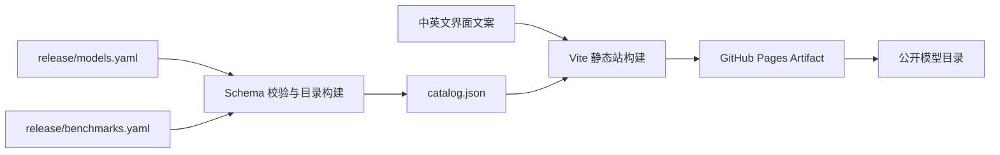

# RDK Model Zoo 在线模型目录设计

**状态：** 待规格确认

**日期：** 2026-09-03

**目标仓库：** `D-Robotics/rdk_model_zoo`

**首个公开地址：** `https://d-robotics.github.io/rdk_model_zoo/`

## 背景

`release/models.yaml` 已经记录 X5 版本的模型、任务、样例目录、模型文件和下载地址，但 YAML 不适合作为用户浏览入口。性能与精度数据分散在各模型 README 和 evaluator 文档中，字段及测试口径也不完全一致，用户难以搜索、筛选和比较。

仓库当前没有 GitHub Pages 站点。需要在不引入后端服务的前提下，为公开发布的模型提供一个直观、可检索、可追溯的在线目录。

## 目标

- 用卡片形式展示当前正式版本支持的模型与模型变体。
- 支持按名称、任务、格式、精度格式及 Benchmark 可用性搜索和筛选。
- 展示延迟、吞吐、精度、模型文件、下载状态和校验信息。
- 每条性能或精度数据都保留测试条件及仓库内来源。
- 支持中文和英文，默认跟随浏览器语言并允许用户切换。
- 使用 GitHub Pages 公开托管，通过 GitHub Actions 构建和部署。
- 让线上目录与正式 Release 及其 Manifest 保持可追溯关系。

## 非目标

- 首版不运行新的板卡性能测试或数据集精度测试。
- 首版不提供用户账户、评论、收藏、在线推理或模型上传能力。
- 首版不建立服务器、数据库或独立 API 服务。
- 不对测试环境、并发方式或数据集不同的结果生成统一排行榜。
- YOLOE 不进入数据集、页面、统计或导航。

## 方案选择

### 方案 A：Vite + TypeScript 静态站（采用）

构建阶段校验 YAML 并生成浏览器使用的 JSON；页面负责搜索、筛选、卡片和详情展示。GitHub Actions 生成静态文件并部署到 GitHub Pages。

该方案能保持数据源清晰，也便于实现双语、响应式布局、URL 可分享的模型详情及后续图表扩展。代价是仓库需要维护 Node.js 构建依赖和锁文件。

### 方案 B：Jekyll + GitHub Pages

Jekyll 可以直接使用 GitHub Pages 的常规构建能力，但复杂的客户端筛选、双语状态和详情交互仍需要额外 JavaScript。数据结构与模板耦合较强，后续扩展 Benchmark 图表时不够灵活。

### 方案 C：Python 生成纯 HTML

Python 可以在构建阶段输出完整 HTML，运行依赖较少。随着筛选条件、双语内容和详情交互增加，生成器会同时承担数据转换和界面拼装，长期维护成本更高。

## 总体架构



系统分为三层：

1. **发布数据层**：`release/models.yaml` 与 `release/benchmarks.yaml` 是权威数据源。
2. **构建与校验层**：校验模型引用、单位、来源和必填字段，并生成供页面读取的 `catalog.json`。
3. **展示层**：Vite + TypeScript 单页静态站负责双语文案、搜索、筛选、卡片和详情展示。

浏览器只下载构建后的静态资源，不在运行时解析 YAML，也不依赖第三方 API。

## 数据设计

### 模型 Manifest

`release/models.yaml` 继续保存发布版本、兼容性、样例和资产信息。现有模型 `id` 是其他数据引用模型的稳定主键。

首版允许在保持现有字段兼容的前提下增加适合展示的可选字段，例如：

- `description.zh` 与 `description.en`
- `tags`
- `thumbnail`
- 模型变体的显示名称与输入尺寸

这些字段缺失时，构建器应提供安全的默认展示，不阻止现有 Manifest 被读取。

### Benchmark 文件

新增 `release/benchmarks.yaml`，与模型资产清单分离。这样可以独立扩展测试记录，避免把同一模型在不同环境下的多组结果塞入资产定义。

建议结构如下：

```yaml
schema_version: 1
release:
  tag: x5-v1.0.0

benchmarks:
  - id: convnext-atto-x5-published
    sample_id: convnext
    variant_id: convnext-atto-224
    display_name: ConvNeXt Atto
    asset_filename: ConvNeXt_atto_224x224_nv12.bin
    model_format: hbm
    precision: int8
    input:
      shape: [1, 3, 224, 224]
      layout: NCHW
      format: NV12
    environment:
      hardware: RDK X5
      rdk_os: ">= 3.5.0"
      runtime: hbDNN
      cpu_mode: performance
    performance:
      - metric: latency
        value: 1.23
        unit: ms
        statistic: mean
        scope: single-frame, single-thread, single-BPU-core
      - metric: throughput
        value: 100.0
        unit: fps
        concurrency: 4
    accuracy:
      - metric: top1
        value: 75.0
        unit: percent
        dataset: ImageNet-1K
        model_stage: float
      - metric: top1
        value: 74.5
        unit: percent
        dataset: ImageNet-1K
        model_stage: quantized
    source:
      ref: x5-v1.0.0
      path: samples/vision/convnext/README_cn.md
      section: 性能数据
      provenance: existing-repository-documentation
```

实际录入时只填写来源中明确给出的字段，不根据 FPS 反推延迟，也不根据延迟反推 FPS。原文未说明的线程数、运行时、数据集或统计方法保持缺失，并在页面中显示为“未说明”。示例中的数值仅用于说明数据结构，不是待发布数据。

### Benchmark 关联与校验

- `sample_id` 必须引用 `models.yaml` 中存在的模型 `id`。
- `asset_filename` 存在时，必须引用该模型已发布的资产；原文无法对应具体资产时可以省略。
- `id` 和同一模型下的 `variant_id` 必须唯一且稳定。
- 数值必须显式提供单位。精度记录必须提供指标名称、数值和单位；原文未注明数据集时允许省略数据集，但构建器给出警告，页面同时标识信息不完整。
- `model_format` 与 `precision` 使用受控枚举，使格式和精度筛选不会依赖文件名推断；来源未说明时允许省略。
- `source.ref`、`source.path` 和 `source.section` 必填，使数据能够定位到不可变发布版本中的原始说明。
- 性能与精度字段均可缺失。缺失数据不阻止模型出现在目录中。
- 构建器拒绝未知模型、重复 ID、无单位数值、无来源记录和不合法 URL。

## 数据整理原则

首版只整理当前仓库已经公开的数据，不运行新测试。整理过程遵循以下规则：

- 保留 README 中的原始数值、单位和有效精度，不进行重新计算或合并。
- 将单线程延迟、多线程吞吐、编译器估算和 Runtime 实测标记为不同口径。
- 将浮点精度与量化精度作为独立指标记录。
- 保留数据集、输入尺寸、并发数、BPU 核心数及计时范围等已有条件。
- 缺少性能或精度表的模型显示“暂无公开性能数据”或“暂无公开精度数据”。
- 页面使用“仓库已公开数据”标识，避免将历史文档数值表述为本次发布重新验证的结果。

## 页面与交互

### 目录首页

首页顶部展示当前平台、版本和来源 Tag，并显示模型数、任务数、可下载资产数及已收录 Benchmark 数。

主要区域包括：

- 模型名称与关键词搜索。
- 任务、模型格式、精度格式及 Benchmark 可用性筛选。
- 按名称、延迟或 FPS 排序；只有口径相同的数据才允许进入性能排序集合。
- 响应式卡片网格。

每张模型卡片展示：

- 模型名称、任务标签和支持平台。
- 已发布的模型变体与主要模型格式。
- 一条具有完整来源的代表性延迟、FPS 和精度记录。
- “有公开 Benchmark”“缺少性能数据”“需要手动提供模型”等状态。
- 进入详情与查看样例的操作。

代表性指标只用于摘要，不声明跨模型排名。鼠标悬停或触屏展开后显示测试口径。

### 模型详情

详情通过 `?model=<sample_id>` 表达，确保 GitHub Pages 刷新和分享链接时不依赖服务器路由回退。

详情内容包括：

- 模型简介、任务、标签和样例入口。
- 模型变体及输入信息。
- 按环境分组的延迟与吞吐表。
- 按模型阶段和数据集分组的精度表。
- 测试条件、缺失字段提示及原始 README 来源链接。
- 模型资产、格式、下载链接、可用状态和 SHA256 状态。

### 双语与视觉

- 中文和英文文案使用独立字典，不在组件中散布字符串判断。
- 首次访问读取浏览器语言，用户选择保存在本地浏览器。
- 数据集、指标和硬件等专有名词保留标准名称，说明文字提供双语。
- 支持桌面端和移动端、键盘导航、可见焦点、语义化标签和足够的颜色对比度。
- 支持浅色与深色主题，默认跟随系统设置。

## 数据比较规则

页面不生成全局“最快模型”或“最准模型”结论。只有以下条件一致时，才允许用户按性能值排序：

- 硬件平台一致。
- 性能指标和单位一致。
- 计时范围、线程或并发口径一致。
- 输入尺寸及关键预处理口径可比较。

精度数据还必须使用相同数据集、指标及模型阶段。条件不完整或不一致时仍可展示，但不会参与排序，并提供口径提示。

## 构建与部署

站点源码放在 `site/`，构建产物不提交到发布分支。依赖使用锁文件固定，构建命令应能在本地和 GitHub Actions 中得到相同结果。

GitHub Actions 分为两类：

1. **校验任务**：在涉及 `site/`、`release/models.yaml` 或 `release/benchmarks.yaml` 的 Pull Request 和分支更新上运行 Schema 校验、引用校验、站点构建及基础页面检查。
2. **生产部署**：正式 GitHub Release 发布后，以该 Release Tag 为数据来源构建并部署 Pages，保证线上目录对应不可变版本。支持人工触发同一流程用于首次启用和失败恢复。

首次启用时，人工部署可以使用默认分支中的站点代码和 `x5-v1.0.0` 数据，页面必须明确显示数据来源 Tag。后续发布由 Release 事件驱动。

Pages 的 Vite 基础路径固定为 `/rdk_model_zoo/`。部署流程使用 GitHub 官方 Pages Actions，仓库 Pages 来源设置为 GitHub Actions。

## 错误处理

- 数据校验失败时阻止部署，并在 Actions 日志中指出文件、记录 ID 和字段。
- 单个模型没有 Benchmark 时正常构建，用空状态说明缺失情况。
- 下载 URL 或来源路径失效属于构建错误；网络瞬时不可达只在独立链接检查中报告，不修改已发布数据。
- 页面加载数据失败时显示可恢复错误和仓库 Manifest 链接，不显示空白页面。
- 未识别的语言、筛选值或模型查询参数回退到默认目录状态。

## 发布流程衔接

未来一次正常发布按以下顺序执行：

1. 更新模型资产清单与现有公开 Benchmark 数据。
2. 运行 Schema、引用、链接和站点构建检查。
3. 审核模型数据及页面预览。
4. 创建并推送版本 Tag，发布 GitHub Release。
5. Release 事件部署对应 Tag 的在线目录。
6. 在 Release 说明中链接在线目录，并核对页面显示的 Tag 与 Release 一致。

模型目录是 Release 的展示入口，不替代 Manifest、Release 附件或 README 中的详细使用说明。

## 验收标准

- GitHub Pages 可通过公开 URL 访问，首屏和直接模型链接均可刷新打开。
- 页面只包含 `models.yaml` 中的模型，且不包含 YOLOE。
- 模型数量、资产数量和当前版本与 Manifest 一致。
- 所有有来源的现有延迟、FPS 和精度数据能在对应模型详情中查看。
- 每条 Benchmark 都能定位到来源 Tag、文档和章节。
- 无 Benchmark 的模型显示明确空状态。
- 中文、英文、浏览器语言默认值和手动切换均正常。
- 搜索、筛选、排序和移动端布局可用。
- 不同测试口径的数据不会被错误地放入同一性能排序集合。
- Pull Request 校验失败时不会部署，正式部署内容显示对应 Release Tag。

## 后续扩展

首版稳定后可以增加版本切换、指标趋势图、CSV/JSON 导出、模型对比、自动链接健康检查及独立 Benchmark 采集流水线。这些能力不进入首版验收范围。
