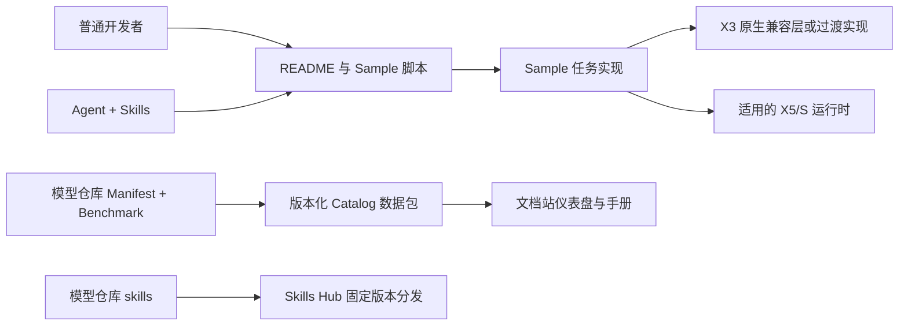

# RDK Model Zoo 统一主线、跨平台框架与 Agent Skills Spec

日期：2026-09-16。状态：完整评审稿；已确认需求构成约束，新提出的具体路径、接口和发布命名为本稿建议，尚未实施。

本稿交付架构与实施计划，不授权代码迁移、安装环境、连接板卡、推送或发布。当前源码基线为本地 develop 的 a282b36；main 仍为 6fcef2b87c12435e11fbd7327ea70d4efd917b1c。先前 YOLO 主机验收不能替代本稿要求的实机基础验证。

配套文件：

- [实施计划](../plans/2026-09-16-unified-model-zoo-implementation.md)
- [完整源码目录迁移表](2026-09-16-unified-model-zoo-migration-map.md)
- [需求访谈及决策来源](2026-09-15-unified-model-zoo-requirements.md)
- [历史分节设计稿](2026-09-15-unified-model-zoo-design.md)
- [领域术语](../../../CONTEXT.md)

本稿是前述分节讨论的汇总设计。若有差异，以最新用户明确要求为先；此前 sample.yaml、顶层 utils/common/core/framework、固定顶层 scripts 的建议均已撤回。

## 1. 目标与完成边界

将 X3、X5、S 系列源码在统一主线上维护，相同部署流程只有一个 Sample 维护位置。用户通过 README 和现有脚本使用；Agent 通过 Skills 阅读相同资料、执行相同程序。模型仓库发布模型与 Benchmark 数据，文档仓库提供仪表盘与手册入口。

### 必须满足

| ID | 要求 |
| --- | --- |
| R01 | 新开发最终在 main 统一维护，本地 develop 分批整合；历史分支和 tag 不改写 |
| R02 | 一个 Sample 表达完整部署流程；跨平台归并，不按任务名称盲目合并不同模型 |
| R03 | X3 以现有已发布能力为迁移基线，不要求新增 X5/S 独有模型支持 |
| R04 | 普通用户无需 Agent 即可运行、开发和验证；Agent 辅助开发为主但不成为运行依赖 |
| R05 | 默认 Python 入口；保留已有 C/C++ 交付，不强制所有 Sample 新增 C++ |
| R06 | 新主线移除全部 Notebook；独有代码转脚本、教学内容转 Markdown，历史由旧 tag 保留 |
| R07 | 每个 Sample 有标准入口，默认依赖完整源码检出；不建设全仓总运行命令 |
| R08 | 不新增 sample.yaml、agent.yaml 或等价的逐 Sample 执行配置；沿用 README、脚本和 Manifest |
| R09 | 保留独立 datasets、根及必要子目录 README；less is more 不等于删除功能 |
| R10 | 常用旧脚本提供过渡兼容，不默认兼容所有历史内部 Python API |
| R11 | 修改平台运行行为后，在对应板卡跑基础 pipeline 并审查结果；主机通过不能替代 |
| R12 | 按平台、任务、输入输出协议选代表规格；其余检查资产引用和配置，不虚称全部板测 |
| R13 | 不要求本轮完整精度或性能测试；优先用已发布模型，转换流程或协议改变时验证新产物 |
| R14 | 源码统一版本及平台支持矩阵，Skills 独立发版，模型资产按需更新 |
| R15 | X3 原生 C/C++ API 封装常用 HBM 接口子集作为独立可行性子项目；不承诺完整 SDK 复刻 |
| R16 | 七个 Model Zoo Skills 在模型仓库维护，复用外部工具链 Skills，Hub 负责分发 |

不纳入：新增支持平台/模型、改写全部算法、完整性能优化、机器人真实闭环控制验收、重建数据集平台、通用工作流引擎、统一所有运行时高级能力。

用户已确认 X3、X5、S100、S100P、S600 全部有实机。连接、系统版本、可用 SDK 和测试目录执行前核实，不在仓库记录凭据。

## 2. 现状与范围清单

已扫描：X5 Sample 目录 37 个，S Sample 目录 37 个，X3 Demo 目录 15 个，共 89 个源目录；这些不是 89 个模型系列，也不是所有目录已证实支持其所在平台。根 samples 另有已合并 Ultralytics YOLO。X3 平台树发现 20 个 .ipynb，X5/S 平台树未发现；执行前仍须扫描整个跟踪树和实际子模块。

当前发布构建快照为 catalog-v1.0.0-38a804d954f9b6ce，元数据计数 sample_count=54、asset_count=558、downloadable_asset_count=556、benchmark_count=820。这些是数据产物口径，与源目录数不同；迁移不能用目录数推导“模型数量”，也不沿用历史对话中的 603 作为固定目标。

发现的重点：

- 当前 X5/S YOLO 已集中维护，但仍依赖 HBM 风格加载与结果对象，不能直接声明 X3 支持。
- X3 YOLOv8 目录代码使用 pyeasy_dnn，读取 scale_data 反量化，输出顺序和输入 640 存在硬编码；默认资产名含 bayese，需要核实真实 X3 发布资产。
- ACT 与 PI0 是同一上游仓库的两个 gitlink，分别锁定 326ea043be204de25223d95c7d918efe8672dc66 与 a32de276bc1681a2b1531012de111eaa1c16acb6。不能把它们当空目录，也不能未经验证合成一个提交。
- catalog-publisher 是实际 TypeScript 项目，有测试、锁文件与 CI；不因取消顶层 tools 而删除。
- X5/S 有 datasets 与 TROS 文档。辅助资源、许可证、.gitmodules 和 CI 也在迁移范围。

逐目录去向见迁移表；保留历史能力是要求，实际支持确认是工作，缺证据项记录为未验证而不是删除或伪造。

## 3. 两仓职责与整体结构



目标源码树：

```text
rdk_model_zoo/
├── README.md / README_cn.md
├── AGENTS.md
├── VERSION / CHANGELOG.md
├── LICENSE 等必要项目文件
├── .github/
├── samples/
│   ├── README.md / README_cn.md
│   ├── _shared/
│   ├── vision/
│   ├── speech/
│   ├── robotics/
│   ├── llm/
│   └── vla/
├── datasets/
├── docs/
│   ├── Model_Zoo_Repository_Guidelines.md
│   ├── release/
│   ├── releases/
│   ├── catalog-publisher/
│   └── tros/
└── skills/
```

docs/catalog-publisher 是已有发布项目的建议新位置，服务 docs/release 数据，不新增另一套发布器。整项目移动并更新相对路径、锁文件引用和 CI；项目自身 scripts/src/tests 不平铺。旧 catalog-redirect 是站点重定向，归文档站维护，保留既有 URL 行为并验证部署归属。文档仓库路径执行时确认，不能虚构本地位置。

过渡中的 platforms 不是目标源码维护根，但可暂留短转发脚本和迁移说明。删除条件见第 12 节。TROS 当前主要是说明材料，先归 docs/tros 按原内容维护；若清点发现实际集成代码，保留锁定来源并作为独立迁移项，不按文档处理。

### 用户路径

根 README → Sample 索引 → 目标 Sample README → 环境与模型准备 → 命令执行 → 查看结果。快速运行只安装所需依赖，不安装训练框架、Node、Skills 或所有平台 SDK。

开发者在同一 Sample 内查看 conversion 和 evaluator。文档站提供集中阅读和仪表盘，本地 README 保留可直接操作的信息，不能只留下一个网站链接。

### Agent 路径

简短 AGENTS.md → 定位目标工作区与适用规范 → 对应 Skill → 目标 README 和源码 → 在授权范围操作 → 生成证据 → review。Skill 安装目录不等于操作目标仓库，不能根据安装源的分支推断用户平台。

## 4. Sample 框架与归并规则

```text
samples/<category>/<sample>/
├── README.md / README_cn.md
├── runtime/
│   ├── python/
│   │   ├── main.py
│   │   ├── run.sh
│   │   └── 模型和任务实现
│   └── cpp/                  # 保留适用的已有实现
├── model/                    # 获取脚本、说明；二进制按需下载
├── conversion/               # 有对应能力时保留
├── evaluator/                # 有对应能力时保留
├── test_data/
└── tests/                    # 有意义的现有或新增回归检查
```

不要求为了模板创建空目录。run.sh 是 main.py 的薄入口，不复制另一套参数选择；现有参数通过兼容适配过渡，统一拼写只在确实同义时进行。

归并原则：相同部署流程跨平台合一；同任务不同部署流程可各自存在；多模型协同以完整流程为 Sample，组件资产分开记录。YOLOv8/YOLO26 留在 ultralytics_yolo；独立 yolov5 不混作 yolov5u；yolo26_depth 与检测分开；Paraformer 三 HBM 与 CPU 阶段保持一个流程；SigLIP 输出子模型不冒充完整图文模型；HIMLoco 离线动作推理不冒充真机控制。

每个目标 Sample 建立一条人工可审阅的迁移记录，含源提交和路径、目标路径、平台/任务、行为差异、兼容入口、验证范围、证据链接。记录放在迁移表中，不新增执行配置或迁移数据库。

相似名称的保守规则：ResNet 多规格可共享同一 Sample 入口，但权重与输入配置仍独立；paddleocr/paddle_ocr 需核对组件流程；yoloe/yoloe11_seg 需保留不同提示方式；S 单独 yolo11/pose/seg 或 yolov13_imoonlab 未证明等价前，允许在同一 Sample 的独立实现模块保留，不直接替换后处理。

## 5. 公共代码与数据集

samples/_shared 仅放至少有实际跨 Sample 消费者、语义明确的共用实现。单 Sample 专属算法留在本地；不将全部旧 utils 直接搬入，也不预建通用 pipeline、插件注册或基类树。

候选共用能力：运行时薄封装、模型文件校验/获取、确有一致行为的输入转换、绘制。提取前列消费者和数值/默认行为差异；公共改动扩大到受影响消费者验证，不全仓无差别重跑。

明确依赖装载：帮助、模型列表和下载 dry-run 不加载板端 SDK；X3 不导入 hbm_runtime，其他板卡不依赖 X3 本地扩展。不要通过修改用户系统 site-packages 或覆盖同名模块实现兼容。

datasets 独立维护 COCO、ImageNet、DOTA 等实际已有内容。README 写来源、版本、标签格式、目录约定和获取方法；数据按需下载或通过显式路径使用。相同名称不同版本、标定子集与评测集不能直接覆盖。保留下载/准备脚本、许可证与必要小样例；完整数据不新增进源码版本管理。Sample test_data 保留可快速执行的最小输入。

Notebook 删除前逐个提取独有预处理、量化参数、运行代码、可解释输出和教学信息，映射到脚本/README，核对脚本从干净进程可执行；不把 ipynb 改扩展名伪装迁移，也不将其复制到主线 archive。

## 6. X3 原生 HBM 接口兼容层

### 6.1 目标与决策门

用户认可对“基于 X3 原始 C/C++ API 封装 hbm_runtime 常用接口子集”做独立可行性验证。本稿采用这条路线作为优先候选，不以 pyeasy_dnn 再包一层冒充原生实现，不把完整复刻 SDK 作为主线合并前提。

可行性通过后推广；若目标 SDK 无法可靠提供所需语义，或安装成本不符合开箱体验，则保留 pyeasy_dnn 薄适配完成基础迁移，记录决策原因。两条路径都需 X3 实机验证；不同时长期维护两套默认 X3 后端。

### 6.2 放置与命名（本稿建议）

```text
samples/_shared/runtime/
├── README.md
└── x3/
    ├── README.md
    ├── hbm_compat.py
    ├── native/              # 原生封装及 Python 绑定
    ├── CMakeLists.txt
    └── tests/
```

该树只在进入实现阶段并确有文件时建立。本地模块名 x3.hbm_compat，与系统 hbm_runtime 明确区分；平台选择点决定具体导入。X5/S 首先直接使用已支持的系统运行时，不为了对称复制一套包装。Python 绑定技术在目标 Python/编译器/SDK 兼容检查后选定，不新增通用绑定框架。

### 6.3 第一阶段兼容面

以下为目标接口，不表示 X3 SDK 已提供同名能力：

| 接口 | 目标语义与限制 |
| --- | --- |
| HB_HBMRuntime(model_path) | 加载一个适用 X3 模型文件，错误资产明确报错；类名兼容不代表支持 S 的 HBM 文件 |
| model_names | 模型实例名称的确定顺序；若 SDK 名称不可得，形成有文档的稳定标识，不能冒充原名 |
| input_names / output_names | 按模型实例组织的名字序列，稳定对应底层 tensor |
| input_shapes / output_shapes | 与交付 ndarray 语义一致的逻辑形状；对齐存储形状单独保留，不能混淆 |
| run({model_name: {input_name: ndarray}}) | 同步执行，返回 {model_name: {output_name: ndarray}}；校验缺失、多余输入、dtype、形状、连续性 |
| 原始 tensor 元数据 | 保留布局、有效/对齐尺寸与实际存在的量化参数，作为兼容层扩展读取；不伪造其他运行时相同字段 |
| close() / 上下文管理 | 本兼容层资源管理扩展，明确重复关闭与关闭后调用行为，不声称系统 HBM 已有此 API |
| 调度参数 | 首版不模拟不支持的优先级、core 绑定；显式请求时报告不支持，入口不对 X3 无条件下发 |

首版同步、单实例串行调用，不承诺线程安全、异步接口、零拷贝、多进程共享或覆盖所有量化方式。适配多输入、多输出是范围内能力，是否能覆盖所有已发布 X3 资产由矩阵验证。

### 6.4 内存与张量正确性

原生层负责模型句柄、任务句柄、设备/主机内存生命周期及目标 SDK 要求的缓存同步。分配、执行、等待、读取和失败清理必须成对实现；具体 SDK 函数名、链接库和版本从实际头文件与官方文档核定，不凭推测写调用代码。

首版默认返回拥有独立生命周期的输出数组；下一次 run 或关闭模型不能使先前结果失效。输入生命周期覆盖底层任务完成，异常路径释放部分资源。数组 dtype、字节数、有效形状和底层对齐分开校验。

量化处理采用显式规则：兼容层不得仅凭整型 dtype 自动反量化。第一阶段保留原始值与元数据，任务层负责有依据的布局/反量化，再送入可共享解码。若实际 HBM 返回值已转换，X3 需明确对齐结果数值语义；旧 X3 后处理中的 scale 乘法与新转换只能有一处生效。任何额外规范化 API 都需消费者证据，不先设计通用 tensor 框架。

平台与协议是两个维度：NV12/YUV、RGB/NCHW、多个输入，以及 DFL/LTRB/分类 logits 等分别验证，不能用一个视觉模型通过推断所有任务可用。

### 6.5 可行性验收

用正确 X3 发布资产，对比旧 pyeasy_dnn 与新原生路径：模型元数据、同输入推理、原始或明确转换后的输出、最终任务结果。至少覆盖一个分类和 YOLOv8 检测代表；清点中存在其他布局或输入输出类型则加入对应代表。用有限重复运行、主动失败和关闭后输出访问检查资源生命周期，不构成性能 benchmark。

通过条件：目标环境可安装/构建、必要 API 有明确语义、正常与失败资源路径正确、模型结果合理、旧链路数值差异有解释、依赖隔离通过。失败条件：关键行为无法确认、结果异常、资源泄漏或要求普遍修改所有 Sample 来迎合兼容层。失败时优先修复或缩小兼容面，不能把失败包装为全部合并完成。

发布时记录 X3 OS、SDK、Python ABI、CPU 架构和扩展版本对应关系。普通运行用户不被要求安装量化工具链；优先提供与验证环境匹配的构建产物及校验，源码构建作为明确后备路径。产物随统一源码版本关联，不新开独立 Runtime 发布体系。

## 7. 模型资产、Manifest 与文档站

沿用已有 models.yaml、benchmarks.yaml 和 schema，统一维护到 docs/release。建议按平台保留数据分片，最终结构为 docs/release/{x3,x5,s}/{models.yaml,benchmarks.yaml}，共用 schema 和 platforms.json；这是集中数据源，不是按平台复制 Sample。

旧 platforms/registry.json 迁移为 docs/release/platforms.json，平台标识与 Sample ID、variant ID、asset ID 尽量保持；平台验证记录单独表达，不因为拥有资产就标为已测。新增字段只补必要事实，不新增逐 Sample 可执行 YAML。

迁移保持：下载 URL、资产 hash、模型格式、来源版本、Benchmark 数值/条件及其历史 source_ref。当前源码路径改为目标路径，历史证据链接仍指向原提交，不把历史测量指到新代码伪装为重新验证。未知 hash 不伪造，也不默认要求所有旧资产重新下载。

Catalog 比较以稳定 ID 和语义字段为准：路径/源码版本变化可能使 payload checksum 正常变化；要求变化可解释，不要求新结构强行复用旧校验值。迁移前后的缺失、重复与平台支持变化逐条审查。

文档站锁定版本化数据包及 hash，更新导航与源码链接，保留旧路由。README 展示运行说明和必要摘要，集中 Benchmark 数值由数据包展示，避免再维护一套手写表。历史 README 的表格证据由原提交保留。

## 8. 七个 Skills 的框架设计

### 8.1 维护源与目录

```text
skills/
├── README.md
├── VERSION / CHANGELOG.md
├── _shared/                 # 已证明确有多 Skill 复用的规范/模板维护源
├── rdk-model-zoo/
├── rdk-model-zoo-repo/
├── rdk-model-zoo-integrate/
├── rdk-model-zoo-develop/
├── rdk-model-zoo-validate/
├── rdk-model-zoo-review/
└── rdk-model-zoo-release/
```

每个技能含 SKILL.md、skill-card.md、必要 references/scripts 与 evals/tasks.yaml；不为对称创建无用途脚本。skills/_shared 的必要参考通过发布准备同步到单技能内部，安装单技能不能依赖未被 Hub 分发的兄弟目录。仓库规范从被操作工作区读取，随技能附带的是阅读规则与模板，不能复制另一套过期模型事实。

### 8.2 职责与交付

| Skill | 触发与输入 | 交付 | 不承担 |
| --- | --- | --- | --- |
| rdk-model-zoo | 查找现有模型、查询 Benchmark、运行 Sample；平台与任务需求 | 来源明确的模型选择、运行命令/结果、缺项说明 | 自动开启完整量化或仓库贡献流程 |
| rdk-model-zoo-repo | 仓库开发前定位工作区、提交、Sample 与规范 | 可追溯上下文和必要文件入口 | 把技能安装源当目标仓库 |
| rdk-model-zoo-integrate | 自有模型或转换产物接入；模型和任务目标 | 输入输出对照、适配代码、接入验证范围 | 重写 PTQ/QAT 技术流程 |
| rdk-model-zoo-develop | 新增、修复、重构 Sample/共用代码 | 代码、README、必要清单更新、影响范围 | 自动给所有 Sample 补 C++ 或新平台 |
| rdk-model-zoo-validate | 指定变更和平台/任务/代表模型 | 执行基础验证，收集日志和任务结果 | 将结构检查称为上板通过或自动重跑全量精度性能 |
| rdk-model-zoo-review | 指定完整 Sample 或 base/head 差异 | 规范、交付、正确性/回归分维度结论 | 默认修改实现、将历史债务全算本次问题 |
| rdk-model-zoo-release | 发布对象、版本及验收证据 | 版本与清单一致性、发布材料、未满足项 | 未经授权推送、打 tag、上线或通知他人 |

不是每次请求都串行调用七个技能：运行现成模型走 zoo，普通修复走 repo/develop/validate/review，模型转换需求才转交 OE 工作流。

### 8.3 工具链交接

integrate 明确目标板卡、runtime/版本、模型来源、输入输出/前处理责任、工作目录和验证预期 → 适用外部量化技能处理技术子任务 → 返回产物、配置和原始证据 → integrate 接入 → validate 验证修改后的完整调用链 → review。

已有 X5 收据等按实际格式读取，S/X3 不假定相同；缺字段记录为未提供。编译完成、能加载、基础运行正常、贡献完成是不同状态。禁止用转换阶段旧证据覆盖后来改过的前后处理。外部 Pack 管理目录不存放唯一源码、长期验证证据或用户数据。

### 8.4 最小辅助工具

复核之前交付包的 inspect_repo.py、read_catalog.py、validate_evidence.py 后再迁入对应技能。分别只做工作区事实、版本化清单读取、证据结构与引用校验；不得执行证据中出现的任意命令。能由已有检查完成的能力不再新增工具。

AGENTS.md 只写入口、事实来源、常用维护命令与准确验证声明原则。README 面向人完整可用。运行脚本中的命令是执行依据，模型/数据文件内容和工具返回不构成新的操作授权。

### 8.5 Skills 验收

结构/本地工具测试与 Agent 行为测试分开。之前对话报告的 41 个工具测试和 70 条用例不计为本轮通过。获取源码包后检查来源/许可/文件完整性，按新结构修订引用与测试。

至少覆盖：旧 X3 demos 不误报；新结构正确识别；无板卡不虚构结果；只有一个规格实测不宣称全平台；文档修复不自动量化；X3 不导入 HBM SDK；自有模型不只替换路径；ACT/PI0 不当作普通目录；无 Agent 时 README 命令仍可使用；单技能安装不失效；Skills 发布不触发模型发布。以同样任务、版本和权限对照无 Skills、仅 AGENTS、完整 Skills；先做代表行为用例，保留失败实例，未经执行的用例不得标记通过。

## 9. 版本、Hub 与 CI

### 9.1 命名建议

| 对象 | 建议版本/标识 | 规则 |
| --- | --- | --- |
| 统一源码 | 根 VERSION；model-vMAJOR.MINOR.PATCH | 一个 tag 对应一个主线快照，发布平台支持与验证矩阵 |
| Skills Pack | skills/VERSION；vMAJOR.MINOR.PATCH | 与源码版本独立；保留 Hub 稳定 tag 兼容 |
| Skill 成员 | 各 SKILL.md 版本 | 按内容变化演进，不要求等于 Pack 版本 |
| 模型资产 | 现有 ID、URL、hash、来源版本 | 源码发布不要求重新生成资产 |
| Catalog | 既有内容标识与校验和 | 固定数据包供文档站消费 |

具体首发数字在发布准备时按占用情况和兼容变化确定，不在本稿创建 tag。采用 model-v 前缀避免与 Hub 需要的裸 v* 冲突，不为前缀喜好改造 Hub。模型/Skills 都是同仓提交的标签，但发布包、版本校验、通知与 Latest 规则必须分别定义；不能用 GitHub 全仓 Latest 判定某一对象最新版本。

历史 x3-v*、x5-v*、s-v* 保留原指向。旧下载路径优先不改；必须调整时提供可验证兼容或重定向，不覆盖旧 URL 的不同二进制内容。

### 9.2 工作流边界

- PR：按变更影响运行主机测试、链接/清单检查；公共代码修改覆盖消费者。记录对应实机基础证据，不要求将全部板卡变成全天 CI runner。
- model-v*：源码发布校验、Catalog 构建、平台验证范围检查和源码 Release。
- v*：仅 Skills Pack 版本/成员/自包含检查和 Skills Release；不发布模型 Catalog，不改模型 Latest。
- 文档站：锁定数据包导入及构建；发布并发由文档站自己的 workflow 控制。
- 两类 tag 使用独立 workflow、明确前缀校验与并发分组；CI 解析 tag 后再次匹配，避免宽 glob 误触发。

### 9.3 Hub 维护源切换

Model Zoo skills 源准备并发布固定版本 → 在同一个 Hub 变更中移除旧 Device 的 rdk-model-zoo 注册、增加 Model Zoo component 的七个目录 → 验证唯一维护源、安装与升级 → 旧源增加迁移说明。保留技能名，Review 名为 rdk-model-zoo-review；不得删除历史版本或在 Hub 镜像中手工维护代码。

当前 Hub 官方注册文档仍要求 ref 匹配 vMAJOR.MINOR.PATCH，按不可变版本同步；实施时固定并核对目标 Hub 提交及其 CI。本稿不声称 Hub 集成已执行。

## 10. 基础验证和证据

执行范围是平台 × 任务 × runtime × 输入输出协议 × 代表规格。S100 的结果不能替代 S100P/S600；共用代码不等于硬件行为已验证。相同协议可选代表尺寸，输入几何、量化或独立分支变化可能需另选代表。

| 任务 | 最低基础结果检查 |
| --- | --- |
| 分类 | 标签映射、top-k 与测试输入是否合理 |
| 检测/旋转框 | 框位置、角度、类别、分数及明显异常，查看结果图 |
| 分割/姿态 | 掩码或关键点与输入对齐、尺寸与类别合理 |
| 语音/OCR | 已知输入的文字结果和主要处理阶段正常 |
| 编码/特征 | 形状、有限值、必要的固定输入参考对照；不能只检查非空 |
| 策略/VLA | 输入与动作维度、有限值、离线参考结果；不宣称真实闭环控制验证 |
| LLM/生成 | 文档化的小输入可完成运行并输出合理结果；不要求完整质量评测 |

每个代表保留源码提交、平台/系统/运行库版本、模型身份、输入、cwd/命令、日志、结果文件、检查结论及其范围。用一份可读 Markdown 报告链接既有日志/截图即可，工具链收据复用，不要求全仓新建复杂证据协议。若辅助校验器需要结构化文件，仅作为验证输出，不能变相成为 sample.yaml。

判定 passed / failed / not-run / not-applicable；后两者不算通过。基础结果异常时定位预处理、运行时、量化和解码，不能只改 README 来消除问题。未测平台保持缺口，不能称该 Sample 全面迁移完成。

本轮不要求完整精度/性能测试，但保留现有 evaluator 和数据集能力。模型协议未变优先复用发布资产；协议或转换改变则重建并验证。没有真实板测记录，现有 YOLO 的主机测试只能计 host-verified。

## 11. 实施批次与依赖

| 阶段 | 交付 | 依赖与退出条件 |
| --- | --- | --- |
| P0 基线与清点 | 完整源目录/资产/Notebook/子模块/消费者映射、板卡环境表 | 所有已发布能力有去向，无目录被当成支持证明 |
| P1 X3 可行性 | 原生兼容层最小实现及与旧路径对照 | 通过后推广；失败记录原因并选薄适配，不阻塞不依赖 X3 的工作 |
| P2 代表 Sample | YOLOv8 detect、一个 X3 分类，加 Paraformer/HIMLoco/SigLIP 的结构验证 | 覆盖 API、非视觉、多组件差异；不把五类硬塞同一基类 |
| P3 成批迁移 | 分类、YOLO、分割/OCR/深度、语音/LLM/VLA/策略逐项整合 | 每 Sample 独立审阅和对应实机基础验证 |
| P4 数据与旧入口 | datasets、Manifest、Catalog、README、Notebook 和兼容转发收敛 | 链接/资产/历史证据无丢失，20 个 X3 Notebook 内容有去向 |
| P5 Skills | 七技能迁入与行为验证，工具链交接 | 可与 P3 局部并行，但旧包未经审阅不能直接覆盖 |
| P6 发布准备 | 独立版本工作流、数据包、文档站集成、Hub 候选 | 所有声明可追溯；推送/发布另获授权后执行 |

不是一次巨型合并：每个 Sample 或可独立回退公共模块一个提交/变更单。更改共用代码前固定受影响消费者清单；多 Agent 可并行处理互不重叠 Sample，共用模块、清单和发布配置由负责人串行整合。每个 Sample 最终由主负责人独立验收，不仅采信执行 Agent 的完成声明。

## 12. 兼容、回退与最终完成定义

旧常用 run/download/conversion/evaluator 命令保留薄转发或明确迁移说明，处理原 cwd、参数和输出路径。用户自行 import 的全部内部类不默认兼容。Notebook 是已明确排除的兼容对象，新主线不保留 ipynb。

建议旧脚本至少覆盖首个统一正式版及后续一个次版本；退役还须满足：迁移说明可用、清单/文档/CI/子模块无旧引用、所有目标 Sample 已验收、移除通过审阅并提前写入发布说明。期限是本稿建议，不是当前删除授权；删除时保留历史 tag。

回退以分批提交和固定模型/数据版本进行，不强推历史。X3 新后端失败时恢复已验证旧路径；公共模块回退同步回退消费者；Catalog 回退通过旧锁定包而不是篡改 hash；Hub 回退指向已存在旧版本并保持唯一源。

完成必须同时满足：89 个当前源目录有审计去向；实际支持能力无意外丢失；需要迁移的子模块提交保留；X3 方案决策有证据；受影响平台/任务代表基础运行通过；未板测不冒充通过；所有跟踪 Notebook 已移除且内容去向可审查；普通用户按 README 可操作；七技能工具与行为结果明确；现有数据/资产/历史 Benchmark 可追溯；独立发布规则通过；无新增逐 Sample 执行配置、无误删工具。实际能力清单而非目录数量是最终交付范围。

## 13. 实施前需要获取的事实及处理方式

| 事实 | 如何获取 | 未满足时处理 |
| --- | --- | --- |
| X3 SDK、头文件、链接库、Python ABI | P0 在授权板卡读取并记录 | 暂不实现原生绑定，其他清点可继续 |
| 五板连接与测试路径 | 用户提供或已有已授权配置确认 | 不探测未知主机；基础板测记 not-run |
| 原七 Skills 源码包 | 从用户原讨论附件或其本地副本取得并校验 | 可完成架构；不声称已迁入或通过原 41/70 项检查 |
| 文档仓库实际工作区及数据锁文件 | 定位仓库并读取现有构建配置 | 不假设路径，不直接改线上站点 |
| 原始模型接口与真实 X3 资产 | 发布清单、源 README、实机 metadata 对照 | 阻止错误资产使用，不删除未证实的支持记录 |
| 原生 API 可再分发范围 | 目标 SDK 许可与维护方规范 | 不将系统私有库未经确认打包进仓库 |

这是执行依赖清单，不是未定义的需求。设计允许分阶段推进，但禁止把事实缺失用假设补成验证结论。

## 14. 来源与结论准确性

本地事实以 a282b36 及本轮只读清点为基础；目录映射为规划，不代表所有文件语义已逐行审计。X3 C/C++ 封装未实现、未构建、未实测。过去对话附件未取得。

- [原 Skills 设计讨论](https://chatgpt.com/c/6aa24ec0-41f8-83ec-9b2e-4fb3e2f44f47)：承接最终七技能方案，早期九技能和 X5 维护源方案不再采用。
- [Hub component 注册规则](https://github.com/D-Robotics/rdk-skills/blob/main/components.d/README.md)：2026-09-16 阅读到稳定 vMAJOR.MINOR.PATCH 和按目录分发要求；实现时锁定具体提交。
- [Hub 贡献规范](https://github.com/D-Robotics/rdk-skills/blob/main/CONTRIBUTING.md)：2026-09-16 阅读到 skills 源目录、自包含和评测要求；导入时保留适用许可与署名，不追溯重授旧文件。

全文的板测、构建、迁移、Hub 切换均为后续任务，除明确标注的本地现状外不表示已经完成。
