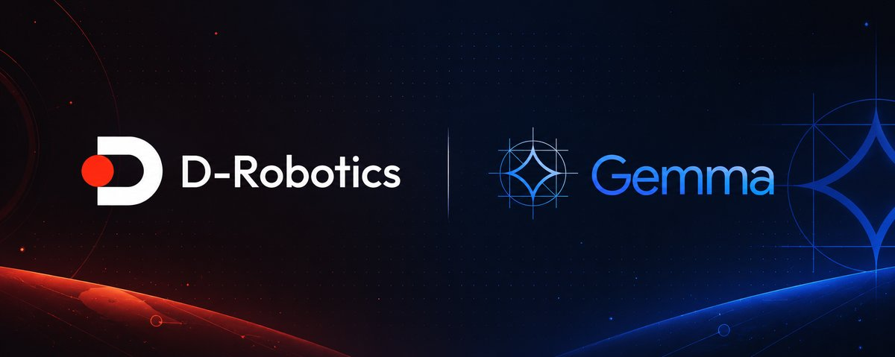
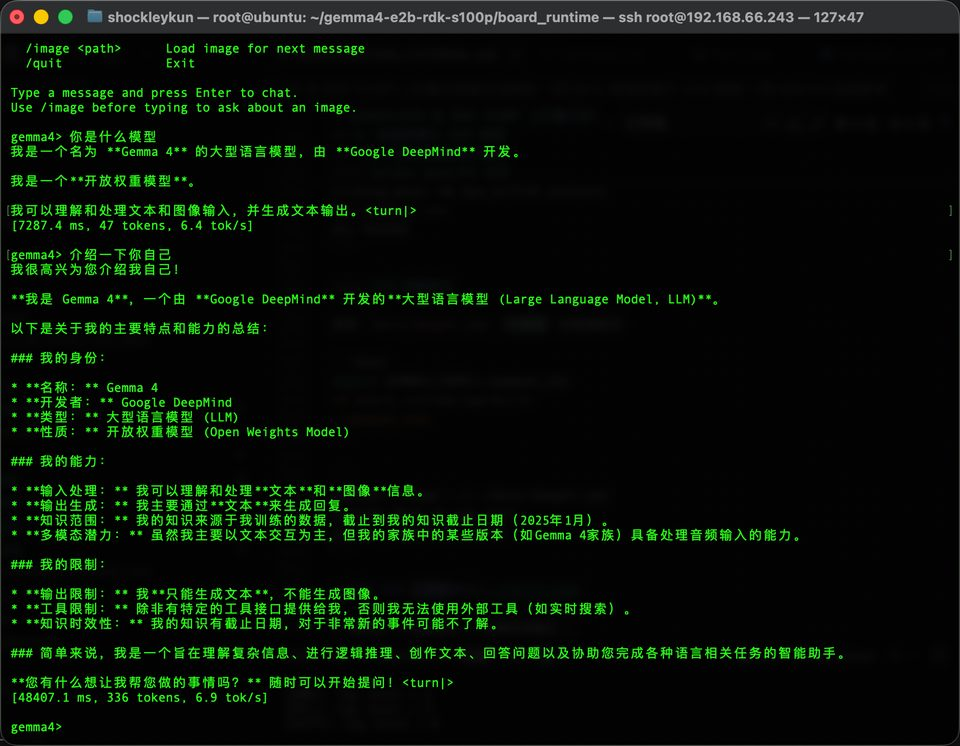
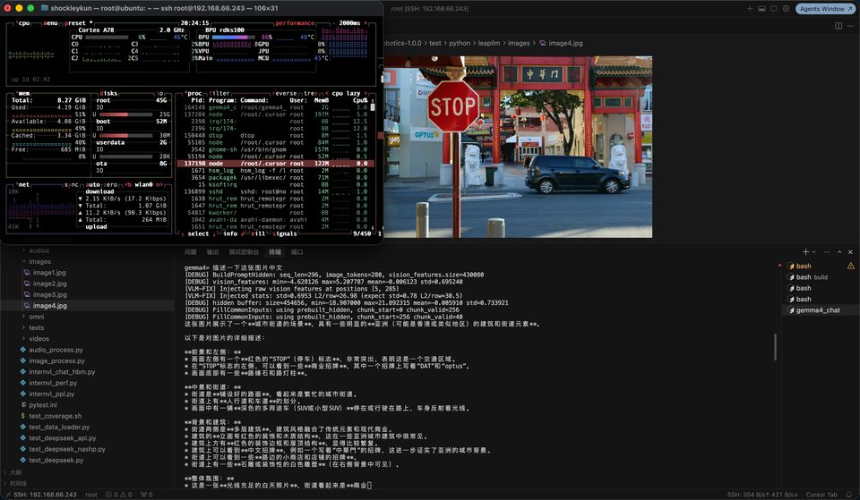

# Gemma4-E2B VLM 模型说明

**简体中文** | [English](./README.md)

<p align="center">
  
</p>

Google **Gemma4-E2B** 视觉语言模型在 **地瓜 RDK S100P / S600** 上的实时 VLM 推理示例。完全在 BPU 上运行，支持纯文本多轮对话和图文多模态对话。



*S100P 板端纯文本对话：中文提问，BPU 流式输出（约 6.9 tok/s）。*



*VLM 对话：加载图片、中文提问、BPU 流式输出（BPU 利用率 86%）。*

> 支持平台：**RDK S100P / S600**。运行时共用同一套 C++ 代码，但必须使用与板端 SoC 匹配的 HBM。

---

## 算法介绍

Gemma4-E2B 是 Google 推出的轻量多模态模型，由 Vision ViT 编码器与 2B 参数 Text LLM decoder 组成。官方资料：

- 模型卡：https://huggingface.co/google/gemma-4-e2b
- 上游部署项目：https://github.com/shockley6668/gemma4-e2b-rdk-s100p

### 算法功能

- 多模态理解：图片 + 文本 → 文本
- 多轮文本对话，复用 KV cache
- 4096-token 总上下文自动预算，支持 `/context` 查看容量并按完整轮次裁剪旧历史
- BPU 上流式 token 输出

### 算法特性

- **Vision**：16 层 ViT → 每张图 280 个 soft token
- **Text**：35 层 Decoder + PLE + KV cache（4096 上下文）
- **部署**：两个 HBM（Vision + Text）+ 外挂 `tok_embeddings.bin`
- **板端 runtime**：原生 C++（`tokenizers-cpp`），推理时不依赖 Python

---

## 平台兼容性

| 平台 | 支持 | 说明 |
| --- | --- | --- |
| RDK S100P | ✅ | 主要目标平台（`nash-m`，`core_num=1`） |
| RDK S600 | ✅ | `nash-p`；使用公开的 S600 HBM，Vision 与 Text 在启动时各加载一次并常驻 |
| RDK S100 | ⚠️ | Runtime 保留 SoC 分支，本示例未完成板端验证 |

本次更新只在 RDK S600 上执行板端回归。S100/S100P 仅检查同源代码的目标矩阵
与兼容性逻辑，不需要连接 S100，也不声明完成了 S100 板端实测。

---

## 目录结构

```bash
samples/llm/gemma4-e2b/
├── README.md / README_cn.md     示例总览（本文件）
├── model/                       预编译 HBM 下载
│   ├── download_model.sh
│   └── README.md
├── conversion/                  PC 端 PTQ 量化编译和完整量化教程
│   ├── QUANTIZATION_TUTORIAL.md
│   ├── QUANTIZATION_TUTORIAL_zh.md
│   ├── leap_llm_gemma4/
│   ├── scripts/
│   └── README.md
├── runtime/
│   └── cpp/                     ★ 板端 C++ 推理（main）
│       ├── run.sh
│       └── README.md
├── evaluator/                   精度 / golden 验证
│   └── README.md
├── test_data/                   VLM 测试图片和结果截图
│   └── results/
└── third_party/                 tokenizers-cpp（构建时下载）
    ├── install_tokenizers_cpp.sh
    └── README.md
```

---

## 快速体验（QuickStart）

板端一键运行：

```bash
cd samples/llm/gemma4-e2b/runtime/cpp
./run.sh                              # 交互式 VLM 对话
./run.sh server --port=8000           # OpenAI / ChatBox 接口
./run.sh --max_tokens=512             # 向 main 传递 gflags 参数
```

脚本会自动：

1. 安装编译依赖（`cmake`、`g++`、`libopencv-dev`、`libgflags-dev`、`nlohmann-json3-dev`、`cargo`、`wget`、`git`、`curl`）
2. 在 `~/gemma4_e2b` 下准备与 SoC 匹配的模型：S100P 与 S600 从公共归档下载对应 HBM；S100 使用预置 HBM 或 `GEMMA4_MODEL_BASE_URL`
3. 下载 `tokenizers-cpp` 源码（固定 commit）
4. 编译全部 5 个 runtime 目标（首次会编译 `tokenizers-cpp`）
5. 启动指定入口；零参数仍默认进入交互式 `main`

交互示例：

```
gemma4> /image ../../test_data/image1.jpg
gemma4> 描述这张图片
gemma4> /context
gemma4> /reset
gemma4> /quit
```

`main` 默认使用 `--max_tokens=0`，即每轮自动使用 prompt 后的全部剩余 KV 容量；`prompt + output` 总计不会超过 4096 tokens。S600 会由 `download_model.sh` 自动选择公开的 `nash-p` Vision/Text HBM。

详细步骤见 [runtime/cpp/README_cn.md](./runtime/cpp/README_cn.md)。

---

## 模型转换（Model Conversion）

已有预编译 HBM 时可直接运行，因此仅做推理的用户可以**跳过本小节**。下载脚本会自动选择 S100P 与 S600 的公开模型；S100 必须预置匹配 HBM，或通过 `GEMMA4_MODEL_BASE_URL` 指定模型目录。

如需自定义重新量化（需要 128 GB 内存的 PC + OE-LLM SDK），请参考 [conversion/README.md](./conversion/README.md) 及完整教程：

- [QUANTIZATION_TUTORIAL_zh.md](./conversion/QUANTIZATION_TUTORIAL_zh.md)（中文）
- [QUANTIZATION_TUTORIAL.md](./conversion/QUANTIZATION_TUTORIAL.md)（English）

---

## 模型推理（Runtime）

本示例仅提供 **C++** 板端推理（LLM 推理为 C++ 原生，不提供 Python 路径）。编译、参数、交互式对话和 OpenAI 兼容接口用法请参考 [runtime/cpp/README_cn.md](./runtime/cpp/README_cn.md)。

---

## 模型评估（Evaluator）

`evaluator/` 目录记录精度 / golden 张量校验，详见 [evaluator/README.md](./evaluator/README.md)。

---

## 推理结果


*S100P 板端 VLM 对话：图片 + 中文提问 → BPU 流式回复。*

---

## License

本示例中的 C++ runtime 代码为 MIT 许可（见上游 [gemma4-e2b-rdk-s100p](https://github.com/shockley6668/gemma4-e2b-rdk-s100p)）。预编译模型单独发布在地瓜机器人模型服务器。示例本身遵循 Model Zoo 顶层 License。
